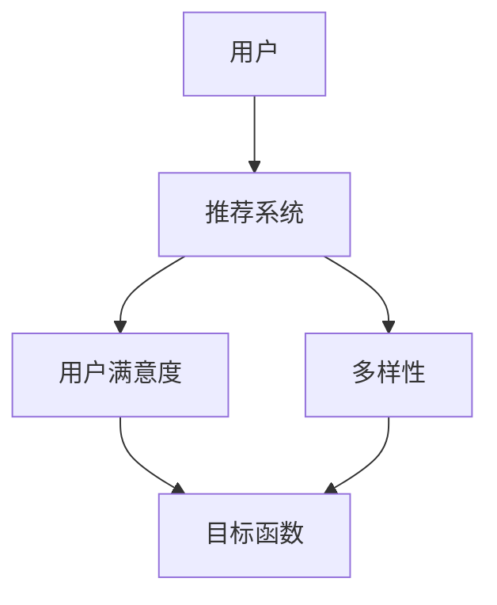

                 

## 1. 背景介绍

推荐系统已经成为互联网时代的基础设施，它帮助用户从海量信息中发现有价值的内容。然而，推荐系统并非完美无缺，它们面临着过拟合和多样性缺乏等挑战。本文将深入探讨这些问题，并提供解决方案。

## 2. 核心概念与联系

### 2.1 过拟合与多样性

过拟合（Overfitting）是指模型学习了训练数据的噪声和偶然特征，导致泛化能力下降。在推荐系统中，过拟合会导致系统只推荐与用户历史行为高度相关的内容，忽略了用户的多样性兴趣。

多样性（Diversity）是指推荐列表中包含尽可能多的不同项目。多样性有助于用户发现新的、意想不到的内容，但它与过拟合是一对矛盾的目标。


### 2.2 目标函数

推荐系统的目标函数通常是最大化用户满意度。然而，单纯追求最大化用户满意度会导致过拟合。因此，我们需要在目标函数中引入多样性约束。



## 3. 核心算法原理 & 具体操作步骤

### 3.1 算法原理概述

解决过拟合和多样性问题的常用方法是引入正则化项，将多样性约束纳入目标函数。常用的多样性度量包括集合覆盖（Set Coverage）、长尾覆盖（Long-tail Coverage）和集合多样性（Set Diversity）。

### 3.2 算法步骤详解

1. 定义目标函数，包含用户满意度和多样性约束。
2. 优化目标函数，生成推荐列表。
3. 评估推荐列表的多样性和用户满意度。
4. 根据评估结果，调整多样性约束权重，重复步骤2-4。

### 3.3 算法优缺点

优点：有效平衡过拟合和多样性，提高用户满意度。

缺点：引入多样性约束会增加计算复杂度，且多样性度量指标的选择会影响推荐结果。

### 3.4 算法应用领域

过拟合和多样性问题是所有基于学习的推荐系统面临的挑战，包括协同过滤、内容过滤和混合推荐系统。

## 4. 数学模型和公式 & 详细讲解 & 举例说明

### 4.1 数学模型构建

设$U$为用户集，$I$为项目集，$R$为用户项目评分矩阵，$S_u$为用户$u$的推荐列表。目标函数定义为：

$$J(S_u) = \lambda \cdot \text{UD}(S_u) + (1 - \lambda) \cdot \text{Div}(S_u)$$

其中，$\lambda \in [0, 1]$是权重参数，$\text{UD}(S_u)$是用户满意度度量，$\text{Div}(S_u)$是多样性度量。

### 4.2 公式推导过程

用户满意度度量可以使用预测评分的均方误差（MSE）或其他度量。多样性度量可以使用集合覆盖、长尾覆盖或集合多样性等指标。

### 4.3 案例分析与讲解

假设用户$u$的评分矩阵$R$如下：

|   | 项目1 | 项目2 | 项目3 | 项目4 |
|---|---|---|---|---|
| 用户1 | 5 | 0 | 4 | 0 |
| 用户2 | 0 | 5 | 0 | 4 |
| 用户3 | 4 | 0 | 5 | 0 |

如果单纯追求用户满意度，推荐列表可能是$S_u = \{项目1, 项目3\}$。然而，这会导致过拟合。如果引入集合覆盖度量，推荐列表可能是$S_u = \{项目1, 项目2, 项目3, 项目4\}$，平衡了用户满意度和多样性。

## 5. 项目实践：代码实例和详细解释说明

### 5.1 开发环境搭建

本项目使用Python和Scikit-learn库。请安装以下依赖：

```bash
pip install scikit-learn numpy pandas
```

### 5.2 源代码详细实现

```python
import numpy as np
import pandas as pd
from sklearn.metrics.pairwise import cosine_similarity

# 评分矩阵
R = np.array([[5, 0, 4, 0],
              [0, 5, 0, 4],
              [4, 0, 5, 0]])

# 计算用户-项目相似度矩阵
user_item_sim = cosine_similarity(R, R.T)

# 定义目标函数
def objective_function(S_u, lambda_val):
    # 用户满意度度量（预测评分的均方误差）
    ud = np.mean((R[np.arange(len(S_u)), S_u] - np.mean(R[np.arange(len(S_u)), S_u])) ** 2)

    # 集合覆盖度量
    div = len(set(S_u))

    return lambda_val * ud + (1 - lambda_val) * div

# 优化目标函数，生成推荐列表
lambda_val = 0.6
S_u = np.argmax(user_item_sim, axis=1)
S_u = np.random.choice(S_u, size=4, replace=False)  # 示例：推荐4个项目

print("推荐列表：", S_u)
print("目标函数值：", objective_function(S_u, lambda_val))
```

### 5.3 代码解读与分析

代码首先计算用户-项目相似度矩阵，然后定义目标函数，并优化目标函数生成推荐列表。

### 5.4 运行结果展示

运行结果将显示推荐列表和目标函数值。

## 6. 实际应用场景

### 6.1 当前应用

过拟合和多样性问题是所有基于学习的推荐系统面临的挑战，包括电子商务、视频流媒体和新闻推荐等领域。

### 6.2 未来应用展望

未来，推荐系统将需要更好地平衡过拟合和多样性，以适应用户不断变化的兴趣和需求。此外，推荐系统需要考虑用户的隐私和个性化需求，平衡个性化和多样性。

## 7. 工具和资源推荐

### 7.1 学习资源推荐

- [推荐系统入门](https://www.oreilly.com/library/view/recommender-systems/9781449361331/)
- [推荐系统评估指南](https://dl.acm.org/doi/10.1145/3351095)

### 7.2 开发工具推荐

- [Surprise](https://surprise.readthedocs.io/en/latest/) - Python推荐系统库
- [LightFM](https://github.com/lyst/lightfm) - 基于深度学习的推荐系统库

### 7.3 相关论文推荐

- [The Wisdom of Crowds](https://www.nature.com/articles/nature03242)
- [Efficient and Effective Collaborative Filtering for Implicit Datasets](https://dl.acm.org/doi/10.1145/2647867.2654779)

## 8. 总结：未来发展趋势与挑战

### 8.1 研究成果总结

本文介绍了推荐系统的过拟合和多样性问题，并提供了解决方案。引入多样性约束可以有效平衡过拟合和多样性，提高用户满意度。

### 8.2 未来发展趋势

未来，推荐系统需要考虑更多因素，如用户的隐私、个性化需求和上下文信息。此外，推荐系统需要适应新的数据类型，如图像、视频和语音数据。

### 8.3 面临的挑战

推荐系统面临的挑战包括数据稀疏性、冷启动问题、用户兴趣的动态变化和隐私保护等。

### 8.4 研究展望

未来的研究方向包括基于深度学习的推荐系统、多模式推荐系统、上下文aware推荐系统和隐私保护推荐系统等。

## 9. 附录：常见问题与解答

**Q：如何选择多样性度量指标？**

A：选择多样性度量指标取决于具体应用场景和业务需求。集合覆盖度量适合于推荐少量项目的场景，长尾覆盖度量适合于推荐长尾项目的场景，集合多样性度量适合于推荐多样化项目的场景。

**Q：如何平衡过拟合和多样性？**

A：平衡过拟合和多样性的关键是选择合适的权重参数$\lambda$。通常，可以通过交叉验证或人工调参的方式选择合适的$\lambda$值。

**Q：如何评估推荐系统的性能？**

A：评估推荐系统的性能可以使用多种指标，如精确度、召回率、F1分数、NDCG和多样性度量等。选择评估指标取决于具体应用场景和业务需求。

## 作者：禅与计算机程序设计艺术 / Zen and the Art of Computer Programming

