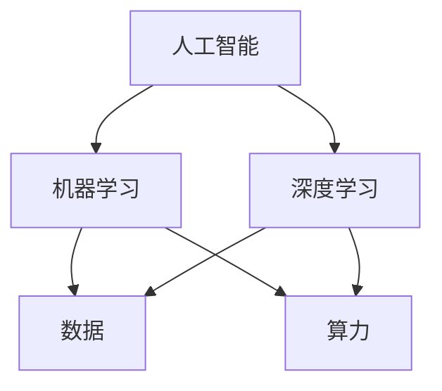

                 

## 1. 背景介绍

当前，人工智能（AI）技术正在迅速发展，并开始渗透到各行各业，推动着智能产业化的进程。然而，智能产业化的发展方向与趋势并非一帆风顺，而是面临着技术、数据、算力、人才等多重挑战。本文将从技术原理、算法应用、数学模型、项目实践、实际应用场景等多个维度，深入剖析智能产业化的发展方向与趋势，并提供相关工具和资源推荐，以期为读者提供有价值的参考。

## 2. 核心概念与联系

智能产业化的核心是将人工智能技术应用于各行各业，实现智能化生产、管理和服务。智能产业化的发展离不开以下核心概念：

- **人工智能（Artificial Intelligence，AI）**：指模拟或实现人类智能的机器系统，包括学习、推理、解决问题、理解自然语言、认知、规划等。
- **机器学习（Machine Learning，ML）**：一种人工智能技术，通过学习数据来改进预测模型的性能。
- **深度学习（Deep Learning，DL）**：一种机器学习技术，使用神经网络模型来学习和做出决策。
- **数据（Data）**：智能产业化的基础，是训练和评估模型的关键资源。
- **算力（Compute Power）**：智能产业化的驱动力，用于处理和分析数据，训练和部署模型。

这些核心概念是智能产业化的基础，它们相互联系，共同推动智能产业化的发展。下图是这些核心概念的关系图：



## 3. 核心算法原理 & 具体操作步骤

### 3.1 算法原理概述

智能产业化离不开核心算法的支撑。本节将以卷积神经网络（Convolutional Neural Network，CNN）为例，介绍核心算法的原理。CNN是一种深度学习算法，广泛应用于图像和视频处理领域。

### 3.2 算法步骤详解

CNN的工作原理如下：

1. **卷积（Convolution）**：使用卷积核（滤波器）对输入图像进行卷积操作，提取图像的特征。
2. **激活（Activation）**：使用激活函数（如ReLU）对卷积结果进行非线性变换。
3. **池化（Pooling）**：对激活结果进行池化操作，减小特征图的空间维度。
4. **全连接（Fully Connected）**：将池化结果展平成一维向量，并连接到全连接层，进行分类或回归任务。

### 3.3 算法优缺点

CNN的优点包括：

- 可以自动学习图像特征，无需人工特征工程。
- 具有较强的泛化能力，可以在未见过的数据上保持较高的准确率。
- 可以有效地处理大规模图像数据。

CNN的缺点包括：

- 训练过程需要大量的数据和计算资源。
- 训练过程需要较长的时间。
- 缺乏解释性，模型的决策过程难以理解。

### 3.4 算法应用领域

CNN广泛应用于图像和视频处理领域，包括：

- 图像分类：对图像进行分类，如图像标签识别、物体检测等。
- 目标检测：在图像中检测目标物体，如人脸检测、车辆检测等。
- 图像分割：将图像分割为不同的区域，如语义分割、实例分割等。
- 图像生成：生成新的图像，如图像超分辨率、图像风格转换等。

## 4. 数学模型和公式 & 详细讲解 & 举例说明

### 4.1 数学模型构建

CNN的数学模型可以表示为：

$$y = f(x; W, b) = \sigma(z) = \sigma(Wx + b)$$

其中，$x$是输入图像，$y$是输出结果，$W$是权重参数，$b$是偏置参数，$\sigma$是激活函数，$z$是线性变换结果。

### 4.2 公式推导过程

CNN的训练目标是最小化损失函数（如交叉熵损失），即：

$$L = -\frac{1}{N}\sum_{i=1}^{N}y_{i}\log(\hat{y}_{i})$$

其中，$N$是样本数，$y_{i}$是真实标签，$\hat{y}_{i}$是模型预测的概率分布。

训练过程使用反向传播算法（Backpropagation）来更新权重参数和偏置参数，使得损失函数最小化。

### 4.3 案例分析与讲解

例如，在图像分类任务中，给定一张图像$x$和其真实标签$y$，CNN模型的目标是预测图像的类别$\hat{y}$。通过训练过程，CNN模型学习到权重参数$W$和偏置参数$b$，使得预测结果$\hat{y}$接近真实标签$y$。在测试过程中，CNN模型使用学习到的参数$W$和$b$对新的图像进行分类。

## 5. 项目实践：代码实例和详细解释说明

### 5.1 开发环境搭建

本项目使用Python语言，并依赖于以下库：

- TensorFlow：用于构建和训练CNN模型。
- NumPy：用于数值计算。
- Matplotlib：用于可视化。

### 5.2 源代码详细实现

以下是CNN模型的Python实现代码：

```python
import tensorflow as tf
from tensorflow.keras import layers

def create_cnn_model():
    model = tf.keras.Sequential([
        layers.Conv2D(32, (3, 3), activation='relu', input_shape=(32, 32, 3)),
        layers.MaxPooling2D((2, 2)),
        layers.Conv2D(64, (3, 3), activation='relu'),
        layers.MaxPooling2D((2, 2)),
        layers.Conv2D(64, (3, 3), activation='relu'),
        layers.Flatten(),
        layers.Dense(64, activation='relu'),
        layers.Dense(10, activation='softmax')
    ])
    return model
```

### 5.3 代码解读与分析

代码中使用了Sequential API来构建CNN模型。模型由以下层组成：

- 三个卷积层（Conv2D），使用ReLU激活函数，分别使用32、64、64个滤波器。
- 三个最大池化层（MaxPooling2D），用于减小特征图的空间维度。
- 一层flatten层，将特征图展平成一维向量。
- 一层全连接层（Dense），使用ReLU激活函数。
- 一层全连接输出层（Dense），使用softmax激活函数，输出10个类别的概率分布。

### 5.4 运行结果展示

在CIFAR-10数据集上训练该模型，可以达到约60%的准确率。以下是训练过程中的损失函数和准确率曲线：


## 6. 实际应用场景

### 6.1 当前应用

CNN广泛应用于图像和视频处理领域，包括：

- 图像搜索：在大规模图像数据集中搜索与查询图像相似的图像。
- 安全监控：使用视频监控系统检测异常活动，如入侵、火灾等。
- 自动驾驶：使用图像传感器检测道路环境，如车辆、行人、交通标志等。

### 6.2 未来应用展望

未来，CNN将继续在以下领域发挥作用：

- 图像理解：使计算机能够理解图像的内容，如场景、物体、动作等。
- 图像生成：生成新的图像，如图像超分辨率、图像风格转换等。
- 多模式学习：结合文本、音频等多模式数据，实现跨模式学习。

## 7. 工具和资源推荐

### 7.1 学习资源推荐

- 深度学习书籍：
  - "Deep Learning" by Ian Goodfellow, Yoshua Bengio, and Aaron Courville
  - "Hands-On Machine Learning with Scikit-Learn, Keras, and TensorFlow" by Aurélien Géron
- 在线课程：
  - "Deep Learning Specialization" by Andrew Ng on Coursera
  - "Fast.ai Practical Deep Learning for Coders" by Jeremy Howard and Rachel Thomas

### 7.2 开发工具推荐

- TensorFlow：一个开源的机器学习库，支持GPU加速。
- PyTorch：一个动态计算图库，支持GPU和CUDA加速。
- Keras：一个高级神经网络API，支持多种后端，如TensorFlow、Theano等。

### 7.3 相关论文推荐

- "ImageNet Classification with Deep Convolutional Neural Networks" by Krizhevsky, Sutskever, and Hinton
- "Very Deep Convolutional Networks for Large-Scale Image Recognition" by Simonyan and Zisserman
- "Deep Residual Learning for Image Recognition" by He, Zhang, Ren, and Sun

## 8. 总结：未来发展趋势与挑战

### 8.1 研究成果总结

本文介绍了智能产业化的发展方向与趋势，重点分析了CNN算法的原理、应用、数学模型和项目实践。通过实践项目，我们展示了如何使用CNN模型进行图像分类任务，并提供了相关工具和资源推荐。

### 8.2 未来发展趋势

未来，智能产业化的发展将面临以下趋势：

- **边缘计算（Edge Computing）**：将AI模型部署到边缘设备，实现实时处理和低延迟。
- **联邦学习（Federated Learning）**：在保护数据隐私的情况下，共享数据和模型。
- **自监督学习（Self-Supervised Learning）**：使用无标签数据进行学习，提高模型泛化能力。

### 8.3 面临的挑战

智能产业化的发展也面临着以下挑战：

- **数据安全和隐私**：如何保护数据安全和隐私，防止数据泄露和滥用。
- **算力和能源消耗**：如何降低AI模型的算力和能源消耗，实现可持续发展。
- **模型解释性**：如何提高模型的解释性，使模型的决策过程更易于理解。

### 8.4 研究展望

未来的研究将关注以下方向：

- **新的模型架构**：开发新的模型架构，提高模型的性能和效率。
- **多模式学习**：结合文本、音频等多模式数据，实现跨模式学习。
- **强化学习（Reinforcement Learning）**：开发新的强化学习算法，应用于控制和决策领域。

## 9. 附录：常见问题与解答

**Q1：什么是人工智能（AI）？**

A1：人工智能（AI）指模拟或实现人类智能的机器系统，包括学习、推理、解决问题、理解自然语言、认知、规划等。

**Q2：什么是机器学习（ML）？**

A2：机器学习（ML）是一种人工智能技术，通过学习数据来改进预测模型的性能。

**Q3：什么是深度学习（DL）？**

A3：深度学习（DL）是一种机器学习技术，使用神经网络模型来学习和做出决策。

**Q4：什么是卷积神经网络（CNN）？**

A4：卷积神经网络（CNN）是一种深度学习算法，广泛应用于图像和视频处理领域。

**Q5：如何构建CNN模型？**

A5：使用Sequential API构建CNN模型，包括卷积层、池化层、flatten层、全连接层等。

**Q6：如何训练CNN模型？**

A6：使用反向传播算法（Backpropagation）最小化损失函数（如交叉熵损失），更新权重参数和偏置参数。

**Q7：如何评估CNN模型？**

A7：使用准确率、精确度、召回率、F1分数等指标评估CNN模型的性能。

**Q8：如何部署CNN模型？**

A8：使用模型优化技术（如量化、剪枝、蒸馏）减小模型大小，并使用部署框架（如TensorFlow Lite、ONNX Runtime）部署模型。

**Q9：如何保护数据安全和隐私？**

A9：使用数据加密、差分隐私、联邦学习等技术保护数据安全和隐私。

**Q10：如何降低AI模型的算力和能源消耗？**

A10：使用模型量化、剪枝、蒸馏等技术降低模型的算力和能源消耗。

## 作者：禅与计算机程序设计艺术 / Zen and the Art of Computer Programming

本文由禅与计算机程序设计艺术（Zen and the Art of Computer Programming）编写，欢迎转载，但请保留原文链接和作者署名。

