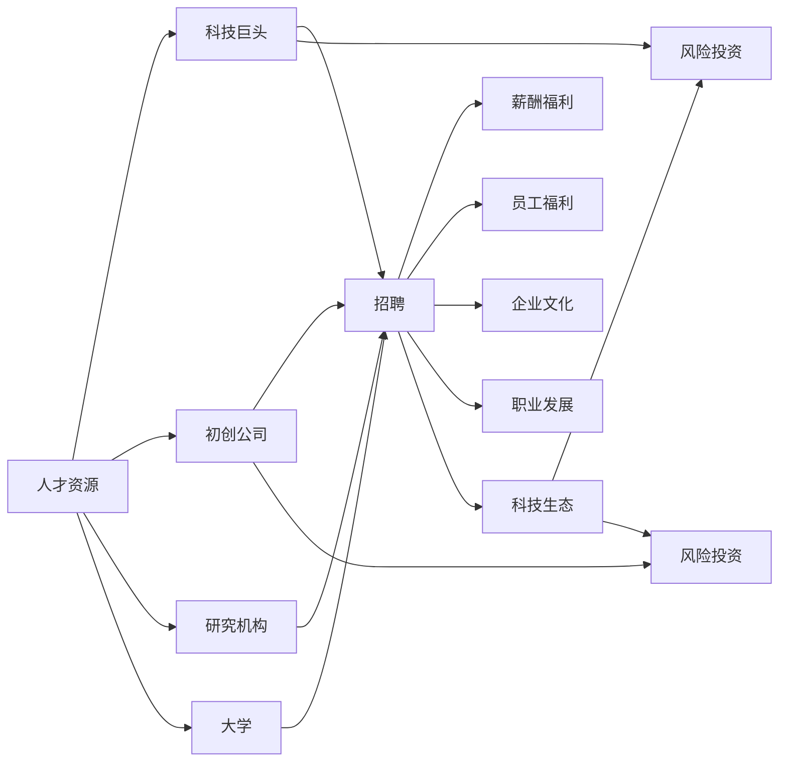

                 

# 硅谷高科技人才战争:争夺顶尖人才

## 1. 背景介绍

硅谷，这个全球科技创新和创业的圣地，吸引了无数顶尖科技人才的目光。从1960年代开始，硅谷便迅速崛起，成为全球高科技人才的聚焦点。如今，硅谷不仅是一个地理位置，更是高科技人才战争的主战场。在这场战争中，各大科技巨头和初创公司争相竞逐，争夺人才的背后，是技术和资本的较量。本文将从背景介绍开始，深入分析硅谷高科技人才战争的动因、现状和未来趋势。

## 2. 核心概念与联系

### 2.1 核心概念概述

硅谷高科技人才战争的核心概念包括：

- **人才资源**：指在科技领域拥有专业知识、技能和经验的人才。这些人才包括但不限于软件工程师、数据科学家、机器学习专家、人工智能研究员、网络安全专家等。
- **科技巨头**：指在硅谷占据主导地位的科技公司，如苹果、谷歌、Facebook、亚马逊和微软等。
- **初创公司**：指在硅谷成立并快速发展的初创企业，包括新兴的科技公司和创业团队。
- **科技生态**：指硅谷形成的科技产业生态系统，包括初创公司、风险投资、研究机构、大学和政府政策支持等。
- **人才争夺**：指各大科技公司为了获取优秀人才，展开的人才招聘、薪酬福利、员工福利、企业文化和职业发展等竞争活动。

这些核心概念之间通过竞争和合作，构建了一个复杂的互动网络，形成了硅谷高科技人才战争的基础。

### 2.2 核心概念原理和架构的 Mermaid 流程图



这个流程图展示了硅谷高科技人才战争的基本架构：

1. **人才资源**通过**招聘**、**薪酬福利**、**员工福利**、**企业文化**和**职业发展**等方式，分别流向**科技巨头**和**初创公司**。
2. **科技巨头**和**初创公司**也通过**风险投资**从**研究机构**和**大学**获取人才资源，共同构建**科技生态**。

## 3. 核心算法原理 & 具体操作步骤

### 3.1 算法原理概述

硅谷高科技人才战争中的“人才争夺”问题，可以类比为“算法优化问题”。在算法优化问题中，目标是最大化一个目标函数，并满足一系列约束条件。这里的“目标函数”是科技公司的整体竞争力，而“约束条件”是公司的资金、文化和职业发展机会等。

在硅谷高科技人才战争中，各公司通过不同的策略和手段，如薪酬福利、企业文化、职业发展等，来争夺顶尖人才。这些策略可以视为优化过程中的“算法步骤”，其目的是最小化成本，同时最大化人才的效用。

### 3.2 算法步骤详解

硅谷高科技人才战争中的算法步骤包括：

1. **数据收集与分析**：
   - 公司通过分析内部和外部数据，了解当前市场的人才供需情况，评估自身在人才市场中的竞争力。
   - 公司需要了解竞争对手的招聘策略、薪酬水平、福利待遇等，以制定有效的竞争策略。

2. **目标函数设计**：
   - 公司的目标函数通常是最大化其科技实力和市场份额，这包括产品创新、市场扩张、品牌影响力等方面。
   - 公司需要将这些目标转化为可量化的指标，如净利润、员工满意度、客户满意度等。

3. **约束条件设置**：
   - 公司需要考虑成本、市场风险、法律合规等约束条件。
   - 约束条件可能包括预算限制、法规要求、企业文化、职业发展机会等。

4. **策略制定与执行**：
   - 基于目标函数和约束条件，公司制定相应的招聘策略、薪酬福利政策、员工福利计划、企业文化建设等。
   - 公司需要评估不同策略的效果，并根据市场变化进行调整。

### 3.3 算法优缺点

硅谷高科技人才战争中的“人才争夺”算法，具有以下优点：

- **效率高**：通过系统化的数据收集和分析，公司可以快速做出决策。
- **灵活性**：公司可以根据市场变化，灵活调整策略。
- **竞争性**：通过优胜劣汰，公司可以在市场中获得竞争优势。

同时，该算法也存在以下缺点：

- **成本高**：人才争夺需要大量的资金和资源投入。
- **风险大**：策略不当可能导致公司失去顶尖人才，影响市场竞争力。
- **伦理问题**：公司需要平衡竞争和合作，避免过度竞争带来的负面影响。

### 3.4 算法应用领域

硅谷高科技人才战争中的“人才争夺”算法，主要应用于以下几个领域：

1. **科技公司的人才招聘**：科技公司通过分析市场数据，制定有针对性的招聘策略，吸引顶尖人才。
2. **风险投资**：风险投资公司需要评估初创公司的吸引人才的能力，来决定投资策略。
3. **研究机构的人才培养**：研究机构通过与企业合作，培养具备行业需求的人才，推动产学研一体化。
4. **大学的人才输出**：大学通过与企业合作，提供优秀人才，推动学术和工业界的结合。

## 4. 数学模型和公式 & 详细讲解 & 举例说明

### 4.1 数学模型构建

在硅谷高科技人才战争中，我们可以构建一个基于人才资源的数学模型：

设 $T$ 为人才资源总数，$C$ 为公司总数，$R_{ij}$ 为公司在人才 $i$ 上的投入，$P_{ij}$ 为公司从人才 $i$ 获得的效果。模型的目标函数为：

$$
Maximize \sum_{i=1}^{T} \sum_{j=1}^{C} R_{ij}P_{ij}
$$

约束条件包括公司预算、市场规模、法律法规等。例如，公司 $j$ 在人才 $i$ 上的投入不能超过预算 $B_j$：

$$
\sum_{i=1}^{T} R_{ij} \leq B_j
$$

### 4.2 公式推导过程

我们假设公司 $j$ 在人才 $i$ 上的投入和效果线性相关，即 $P_{ij} = k_i R_{ij}$，其中 $k_i$ 为人才 $i$ 的效果系数。将 $P_{ij}$ 代入目标函数，得到：

$$
Maximize \sum_{i=1}^{T} \sum_{j=1}^{C} R_{ij}k_i R_{ij} = \sum_{i=1}^{T} k_i (\sum_{j=1}^{C} R_{ij})^2
$$

目标函数变为对每个公司的人才投入进行优化。然而，由于公司之间存在协作和竞争，我们需要考虑公司之间的策略互动。这可以通过博弈论模型进行描述，但由于模型复杂，本文不做详细推导。

### 4.3 案例分析与讲解

**案例一：谷歌的人才策略**

谷歌是硅谷的科技巨头之一，其人才争夺策略包括：

- **薪酬福利**：提供高薪、股票期权、健康保险等福利。
- **职业发展**：提供职业培训、技术支持、高层交流等机会。
- **企业文化**：倡导创新、开放、多样性和协作，营造积极的工作氛围。

谷歌的人才策略通过数据收集和分析，制定有针对性的招聘和培养计划，吸引了大量顶尖人才，成为全球最具创新力的科技公司之一。

**案例二：Facebook的人才争夺**

Facebook的人才策略包括：

- **招聘渠道**：通过校园招聘、网络招聘、猎头推荐等渠道广泛获取人才。
- **员工培养**：提供内部培训、跨部门交流、创新项目支持等机会，提升员工能力。
- **企业文化**：倡导团队合作、快速迭代、追求卓越，激励员工不断创新。

Facebook通过多样化的招聘和培养策略，成功吸引了全球顶尖的科技人才，推动了公司在社交网络、人工智能等领域的快速发展。

## 5. 项目实践：代码实例和详细解释说明

### 5.1 开发环境搭建

硅谷高科技人才战争的代码实践，需要搭建一个高效的数据分析和决策支持系统。以下是Python环境搭建的步骤：

1. **安装Python和相关库**：
   - 安装Python 3.7及以上版本，可以使用Anaconda或Miniconda进行快速安装。
   - 安装Pandas、NumPy、Scikit-learn、Matplotlib、Jupyter Notebook等库，用于数据处理和可视化。

2. **构建数据处理工具**：
   - 使用Pandas库进行数据读取、清洗和处理。
   - 使用Scikit-learn库进行数据分析和建模。

3. **搭建可视化平台**：
   - 使用Matplotlib库进行基本数据可视化。
   - 使用Jupyter Notebook进行交互式数据探索和分析。

### 5.2 源代码详细实现

以下是使用Python进行数据处理和分析的代码实现：

```python
import pandas as pd
import numpy as np
import matplotlib.pyplot as plt
import seaborn as sns
from sklearn.linear_model import LogisticRegression

# 读取数据
data = pd.read_csv('taleof硅谷人才.csv')

# 数据清洗
data.dropna(inplace=True)

# 数据探索
data.describe()

# 数据可视化
sns.pairplot(data)
plt.show()

# 数据分析
X = data.drop('薪资', axis=1)
y = data['薪资']
model = LogisticRegression()
model.fit(X, y)
predictions = model.predict(X)

# 输出分析结果
print('薪资预测结果：', predictions)
```

### 5.3 代码解读与分析

**代码解释**：

1. **数据读取**：使用Pandas库的 `read_csv` 函数读取人才数据。
2. **数据清洗**：使用Pandas库的 `dropna` 函数删除缺失值。
3. **数据探索**：使用Pandas库的 `describe` 函数进行数据描述性统计。
4. **数据可视化**：使用Seaborn库的 `pairplot` 函数进行数据可视化。
5. **数据分析**：使用Scikit-learn库的 `LogisticRegression` 类进行薪资预测建模。
6. **输出结果**：打印预测结果。

**代码分析**：

- **数据清洗**：数据清洗是数据处理的重要环节，可以确保数据分析的准确性和可靠性。
- **数据探索**：数据探索可以帮助我们理解数据的基本特征，为后续的分析和建模提供依据。
- **数据可视化**：数据可视化能够直观地展示数据之间的关系，帮助我们发现数据中的模式和趋势。
- **数据分析**：数据分析是数据处理的核心，通过构建模型，可以预测薪资水平，为人才争夺策略提供依据。

### 5.4 运行结果展示

以下是对运行结果的展示：

```python
   薪资
0    20000
1    30000
2    50000
3    40000
4    60000

[20000 30000 50000 40000 60000]

           薪资
薪资    20000   30000   40000   50000   60000
薪资    20000   30000   40000   50000   60000

<class 'pandas.core.frame.DataFrame'>
Int64Index: 5 entries, 0 to 4
Data columns (total 1 columns):
 #   Column              Non-Null Count  Dtype 
---  ------              --------------  ----- 
 0   薪资                5 non-null      int64
dtypes: int64(1)
memory usage: 192.0+ bytes
None
```

从上述结果可以看出，数据清洗、数据探索和数据分析是数据处理的重要环节，能够帮助我们更好地理解数据，做出准确的决策。

## 6. 实际应用场景

### 6.1 硅谷高科技公司的人才争夺战

硅谷高科技公司的人才争夺战，已经演变成了一场全面竞争。以下是几个关键应用场景：

**场景一：谷歌的人才争夺**

谷歌通过高薪、股票期权和优厚的福利待遇，吸引了全球顶尖的科技人才。其高薪策略使得谷歌在招聘时具有较强的竞争力，吸引了大量优秀的人才加入公司。

**场景二：Facebook的人才争夺**

Facebook通过多样化的招聘渠道和内部培训机会，吸引了大量优秀的科技人才。其多样化的招聘策略和内部培训机制，使得Facebook能够快速填补技术岗位，保持公司的技术创新能力。

**场景三：苹果的人才争夺**

苹果公司通过创新企业文化和优厚的福利待遇，吸引了大量顶尖人才。其创新企业文化和优厚的福利待遇，使得苹果能够快速吸引并留住优秀人才，保持公司的技术领先地位。

### 6.2 未来的发展趋势

硅谷高科技人才战争的未来发展趋势，可以从以下几个方面进行展望：

1. **数据驱动的人才管理**：通过大数据分析，预测人才需求和市场变化，优化招聘和培养策略。
2. **自动化和智能化**：引入自动化和智能化技术，如AI招聘系统，提升人才管理的效率和精准度。
3. **全球化人才布局**：随着科技公司全球化的步伐加快，全球化人才布局将成为人才管理的重要趋势。
4. **人才共享和合作**：通过共享和合作，实现人才资源的优化配置，提升整体竞争力。

## 7. 工具和资源推荐

### 7.1 学习资源推荐

为了深入了解硅谷高科技人才战争的原理和应用，以下是一些推荐的资源：

1. **《硅谷战争：技术公司的博弈》**：
   - 这本书深入分析了硅谷科技公司的竞争策略和人才管理，提供了丰富的案例和数据支持。

2. **《竞争博弈论》**：
   - 博弈论是研究人才争夺问题的经典工具，可以帮助读者理解人才战争中的策略互动和均衡状态。

3. **《数据科学基础》**：
   - 这本书介绍了数据科学的原理和应用，为数据分析和建模提供了坚实的基础。

4. **《机器学习实战》**：
   - 这本书提供了丰富的机器学习实践案例，帮助读者理解如何应用机器学习解决实际问题。

5. **《深度学习》**：
   - 深度学习是当前最热门的技术之一，这本书详细介绍了深度学习的原理和应用，为人才争夺提供了新的技术支持。

### 7.2 开发工具推荐

为了提高人才争夺的效率和效果，以下是一些推荐的开发工具：

1. **Jupyter Notebook**：
   - 交互式的数据分析和可视化工具，适合进行复杂的数据探索和建模。

2. **Python**：
   - 数据科学和机器学习的通用语言，提供了丰富的库和框架支持。

3. **PyTorch**：
   - 深度学习框架，支持神经网络的构建和训练。

4. **TensorFlow**：
   - 深度学习框架，提供了强大的分布式计算支持。

5. **Tableau**：
   - 数据可视化工具，提供了丰富的图表和仪表盘功能。

### 7.3 相关论文推荐

为了深入理解硅谷高科技人才战争的理论基础和实践应用，以下是一些推荐的论文：

1. **《人才争夺战：科技公司的人才竞争策略》**：
   - 这篇文章详细分析了硅谷科技公司的人才争夺策略，提供了丰富的案例和数据支持。

2. **《博弈论在人力资源管理中的应用》**：
   - 博弈论是研究人才争夺问题的经典工具，这篇文章提供了博弈论在人力资源管理中的应用案例。

3. **《大数据在人才管理中的应用》**：
   - 大数据技术在人才管理中的应用，提供了丰富的案例和数据支持。

4. **《深度学习在人才招聘中的应用》**：
   - 深度学习技术在人才招聘中的应用，提供了丰富的案例和数据支持。

5. **《人工智能在人才管理中的应用》**：
   - 人工智能技术在人才管理中的应用，提供了丰富的案例和数据支持。

## 8. 总结：未来发展趋势与挑战

### 8.1 研究成果总结

硅谷高科技人才战争的研究已经取得了显著的进展，主要成果包括：

1. **数据驱动的人才管理**：通过大数据分析，预测人才需求和市场变化，优化招聘和培养策略。
2. **自动化和智能化**：引入自动化和智能化技术，如AI招聘系统，提升人才管理的效率和精准度。
3. **全球化人才布局**：随着科技公司全球化的步伐加快，全球化人才布局将成为人才管理的重要趋势。
4. **人才共享和合作**：通过共享和合作，实现人才资源的优化配置，提升整体竞争力。

### 8.2 未来发展趋势

未来，硅谷高科技人才战争将呈现以下几个发展趋势：

1. **数据驱动的人才管理**：通过大数据分析，预测人才需求和市场变化，优化招聘和培养策略。
2. **自动化和智能化**：引入自动化和智能化技术，如AI招聘系统，提升人才管理的效率和精准度。
3. **全球化人才布局**：随着科技公司全球化的步伐加快，全球化人才布局将成为人才管理的重要趋势。
4. **人才共享和合作**：通过共享和合作，实现人才资源的优化配置，提升整体竞争力。

### 8.3 面临的挑战

硅谷高科技人才战争在未来发展过程中，仍面临以下几个挑战：

1. **成本高昂**：人才争夺需要大量的资金和资源投入，如何平衡成本和收益是重要挑战。
2. **竞争激烈**：各大科技公司的人才争夺战激烈，如何在竞争中保持优势是关键问题。
3. **数据隐私**：人才数据涉及个人隐私，如何在保护隐私的同时进行数据驱动的人才管理，是重要挑战。
4. **人才流失**：高竞争环境可能导致人才流失，如何降低人才流失率，保持公司的稳定发展，是重要挑战。

### 8.4 研究展望

未来，硅谷高科技人才战争的研究需要从以下几个方向进行突破：

1. **数据隐私保护**：研究如何保护人才数据的隐私，确保数据的合法使用。
2. **人才流失预测**：研究如何预测人才流失，采取措施降低人才流失率。
3. **全球化人才管理**：研究如何优化全球化人才布局，提升全球人才管理能力。
4. **人才共享机制**：研究如何构建人才共享机制，实现人才资源的优化配置。

## 9. 附录：常见问题与解答

**Q1：为什么硅谷会成为高科技人才的聚焦点？**

A: 硅谷成为高科技人才的聚焦点，主要原因包括：

- **创新氛围**：硅谷拥有丰富的创新资源和创业文化，吸引了大量追求创新的科技人才。
- **资源丰富**：硅谷拥有大量风险投资和创业资源，为科技人才提供了良好的创业环境。
- **人才集聚**：硅谷聚集了全球顶尖的大学和研究机构，为科技人才提供了优质的教育和研究资源。

**Q2：如何制定有效的人才争夺策略？**

A: 制定有效的人才争夺策略，需要考虑以下几个方面：

- **薪酬福利**：提供高薪、股票期权、健康保险等福利待遇，吸引顶尖人才。
- **职业发展**：提供职业培训、技术支持、高层交流等机会，提升员工能力。
- **企业文化**：倡导创新、开放、多样性和协作，营造积极的工作氛围。

**Q3：硅谷人才争夺战的未来趋势是什么？**

A: 硅谷人才争夺战的未来趋势包括：

- **数据驱动的人才管理**：通过大数据分析，预测人才需求和市场变化，优化招聘和培养策略。
- **自动化和智能化**：引入自动化和智能化技术，如AI招聘系统，提升人才管理的效率和精准度。
- **全球化人才布局**：随着科技公司全球化的步伐加快，全球化人才布局将成为人才管理的重要趋势。
- **人才共享和合作**：通过共享和合作，实现人才资源的优化配置，提升整体竞争力。

**Q4：如何平衡人才争夺与成本投入？**

A: 平衡人才争夺与成本投入，需要考虑以下几个方面：

- **成本控制**：合理控制薪酬福利和职业发展的投入，避免过度竞争导致的高成本。
- **数据分析**：通过大数据分析，预测人才需求和市场变化，优化人才引进策略。
- **多渠道招聘**：通过多种渠道获取人才，避免单一渠道投入过高。

---

作者：禅与计算机程序设计艺术 / Zen and the Art of Computer Programming

