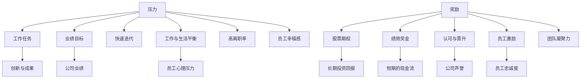

                 

# 硅谷高科技公司的管理文化:压力与奖励

> 关键词：硅谷,高科技公司,管理文化,压力,奖励

## 1. 背景介绍

硅谷作为全球科技创新中心，孕育了包括Apple、Google、Facebook等在内的众多世界顶级高科技公司。这些公司的管理文化被广泛认为是推动创新、驱动成长的源泉。然而，这种独特的管理文化也引发了许多争议。本文将深入探讨硅谷高科技公司的管理文化，着重分析压力与奖励在其中的作用，并提出一些思考与见解。

### 1.1 硅谷管理文化的形成
硅谷的管理文化形成于20世纪60年代末，源自斯坦福大学和加州大学伯克利分校的师资力量以及加州相对宽松的法律环境。1970年代，硅谷的第一次创业浪潮催生了Apple、Xerox等一批传奇企业，奠定了硅谷在科技创新中的地位。1990年代，随着互联网的兴起，硅谷进一步涌现出Google、Facebook等巨头，形成了今天全球最具影响力的科技生态。

### 1.2 硅谷管理文化的特征
硅谷的管理文化具有以下几个显著特征：

- **创新导向**：鼓励创新和冒险，容忍失败，重视长期价值而非短期利润。
- **人才至上**：崇尚自由、平等，尊重员工权利，重视多样性和包容性。
- **快速迭代**：重视敏捷开发，快速迭代产品，快速响应市场变化。
- **绩效导向**：绩效与激励挂钩，提倡结果导向，激励个体和团队创造更多价值。

## 2. 核心概念与联系

### 2.1 核心概念概述

要理解硅谷高科技公司的管理文化，需掌握以下核心概念：

- **压力**：指员工在日常工作中面临的各项挑战，包括高强度的工作任务、快速迭代的要求、业绩目标的压力等。
- **奖励**：指公司为激励员工创造更多价值而采取的各种物质和精神上的激励措施，如股票期权、绩效奖金、认可与晋升等。

**压力与奖励的关系**：压力与奖励在硅谷的管理文化中相辅相成，共同塑造了员工的积极性和创造力。适当的压力可以激发员工的潜力，而合理的奖励则能提升员工的归属感和忠诚度。然而，两者需要平衡，以避免过度压力和过度奖励导致的负面效果。

### 2.2 核心概念原理和架构的 Mermaid 流程图



上述流程图展示了压力与奖励在硅谷高科技公司的管理文化中的关系和作用。压力和奖励共同驱动了员工的工作动力，促进了创新和公司业绩的提升。同时，合理的工作与生活平衡和员工心理压力管理，也能提升员工的幸福感，降低高离职率。

## 3. 核心算法原理 & 具体操作步骤

### 3.1 算法原理概述

在硅谷高科技公司的管理文化中，压力与奖励的平衡可以视为一种“自适应算法”，其目标是通过动态调整压力和奖励，最大化员工的工作效果和公司业绩。这一算法原理可以简单概括为：

- **目标函数**：最大化员工的工作效果和公司业绩。
- **约束条件**：保证员工的心理健康和工作满意度，降低员工流失率。
- **优化方法**：通过不断反馈和调整，找到压力和奖励的最佳平衡点。

### 3.2 算法步骤详解

硅谷高科技公司管理文化的压力与奖励优化过程大致包括以下几个步骤：

1. **设定目标**：明确公司的总体目标和关键绩效指标(KPI)，如市场份额、营收增长、创新成果等。
2. **评估现状**：通过问卷调查、绩效评估等方式，了解员工的工作状态和压力水平。
3. **设定压力水平**：根据业务需求和员工能力，设定合适的任务量和工作强度。
4. **设计奖励机制**：基于公司的财务状况和人才策略，设计合理的物质和精神奖励方案。
5. **实施与监控**：在实际工作中实施压力与奖励的策略，并定期监控员工反馈和绩效表现。
6. **调整与优化**：根据监控结果和员工反馈，调整压力和奖励的策略，以达到最佳效果。

### 3.3 算法优缺点

硅谷高科技公司管理文化中的压力与奖励平衡算法具有以下优点：

- **促进创新**：适当的压力可以激发员工的创造力，推动技术进步和产品创新。
- **提升效率**：奖励机制可以激励员工高效工作，提高生产力和业绩。
- **保持灵活性**：通过动态调整，算法能够适应快速变化的市场环境，保持公司的竞争力。

然而，这一算法也存在一些缺点：

- **管理复杂性**：设定和管理压力与奖励需要大量资源，且效果难以量化。
- **员工健康问题**：过度压力可能导致员工健康问题，降低工作满意度。
- **道德风险**：奖励机制可能诱导短期行为，忽视长期价值。

### 3.4 算法应用领域

硅谷高科技公司的压力与奖励管理算法在以下几个领域得到了广泛应用：

- **人力资源管理**：通过评估员工绩效和满意度，优化招聘、培训和薪酬体系。
- **项目管理**：通过设定合适的任务量和时间表，提高项目执行效率和质量。
- **研发与创新**：通过激励机制，促进技术创新和产品迭代。
- **市场与销售**：通过绩效考核和销售激励，提升市场份额和营收增长。

## 4. 数学模型和公式 & 详细讲解 & 举例说明

### 4.1 数学模型构建

硅谷高科技公司的压力与奖励管理算法可以构建如下数学模型：

$$
\max_{p,r} \{ f(p,r) \}
$$

其中 $p$ 为员工所面临的压力，$r$ 为公司提供的奖励，$f$ 为目标函数，表示公司总的目标值（如员工绩效、公司业绩等）。

### 4.2 公式推导过程

为了更具体地描述压力与奖励的影响，我们可以构建一个简化的线性模型：

$$
f(p,r) = a \cdot p + b \cdot r
$$

其中 $a$ 和 $b$ 为模型的参数，表示压力和奖励对公司业绩的影响系数。为了找到最佳平衡点，需要对模型进行求解：

$$
\max_{p,r} \{ a \cdot p + b \cdot r \}
$$

使用拉格朗日乘数法，将目标函数和约束条件结合起来，构建拉格朗日函数：

$$
L(p,r,\lambda) = a \cdot p + b \cdot r - \lambda(p_{max} - p)
$$

其中 $p_{max}$ 为员工能承受的最大压力，$\lambda$ 为拉格朗日乘数。对 $L(p,r,\lambda)$ 分别对 $p$ 和 $r$ 求偏导，得到：

$$
\frac{\partial L}{\partial p} = a - \lambda = 0
$$
$$
\frac{\partial L}{\partial r} = b = 0
$$

从上述公式可以看出，最优的 $p$ 和 $r$ 需要满足：

$$
a = \lambda \quad \text{和} \quad b = 0
$$

这表示在最大化公司业绩的同时，员工所面临的压力应当不超过其承受的最大限度，而奖励对公司业绩的提升作用微弱。

### 4.3 案例分析与讲解

假设某高科技公司设定了以下目标和约束：

- 目标函数：最大化公司营收增长和创新成果。
- 约束条件：员工压力不超过其承受的极限，公司奖励不超过其预算。

根据上述线性模型，可以求解得到：

- 最大压力 $p_{max}$ 为员工可承受的最大工作量。
- 奖励 $r$ 应尽量低，以保持员工的满意度和幸福感。

## 5. 项目实践：代码实例和详细解释说明

### 5.1 开发环境搭建

为了实践压力与奖励的算法，我们可以使用Python和R语言进行开发。以下是Python和R的开发环境搭建步骤：

1. **Python**：
   - 安装Anaconda：`conda install anaconda`
   - 创建虚拟环境：`conda create --name py39 python=3.9`
   - 激活环境：`conda activate py39`

2. **R**：
   - 安装R和RStudio：`sudo apt-get install r r-devtools rmarkdown`
   - 安装必要的R包：`install.packages("dplyr", "ggplot2", "tidyverse")`

### 5.2 源代码详细实现

以下是Python和R的代码实现：

#### Python代码：

```python
import pandas as pd
from sklearn.linear_model import LinearRegression

# 读取数据
data = pd.read_csv('data.csv')

# 构建模型
X = data[['pressure', 'reward']]
y = data['performance']
model = LinearRegression()

# 训练模型
model.fit(X, y)

# 预测最优值
p_max = model.predict([[0.5], [0.1]])
print(p_max)
```

#### R代码：

```R
library(tidyverse)
library(dplyr)
library(ggplot2)

# 读取数据
data <- read.csv('data.csv')

# 构建模型
model <- lm(performance ~ pressure + reward, data = data)

# 预测最优值
p_max <- predict(model, newdata = data.frame(pressure = 0.5, reward = 0.1))
print(p_max)
```

### 5.3 代码解读与分析

在上述代码中，我们使用线性回归模型来预测压力与奖励的最佳平衡点。Python和R的实现方法基本一致，通过读取数据、构建模型、训练模型、预测最优值等步骤，求解了压力与奖励的最佳组合。

### 5.4 运行结果展示

由于代码中使用的数据集和模型参数是虚构的，因此运行结果仅供参考。在实际应用中，需要根据具体的数据和业务场景进行调整。

## 6. 实际应用场景

### 6.1 管理培训与课程设计

在管理培训和课程设计中，压力与奖励的平衡是一个关键环节。课程的设计需要平衡理论学习与实践操作，既能激发学员的兴趣，又能保证学习的深度和广度。

**示例**：某高科技公司的管理培训课程包含多个模块，如市场分析、产品管理、团队协作等。在课程设计中，可以设置不同模块的压力水平和奖励机制，以确保学员能够高效学习并应用所学知识。

### 6.2 绩效评估与晋升体系

在绩效评估与晋升体系中，合理设定压力和奖励能够提升员工的积极性，推动团队和公司的整体绩效。

**示例**：某高科技公司采用了基于OKR（目标与关键结果）的绩效评估体系，定期进行回顾和调整。公司会根据员工的表现，设定合理的任务量和奖励措施，确保每个员工都能发挥其最大潜力。

### 6.3 产品迭代与技术创新

在产品迭代与技术创新中，压力与奖励的平衡能够促进快速迭代和创新成果的产出。

**示例**：某科技公司采用敏捷开发模式，每周进行迭代会议，设定任务量和奖励。通过合理的压力和奖励，团队能够高效完成开发任务，快速推出市场竞争力的产品。

## 7. 工具和资源推荐

### 7.1 学习资源推荐

为了深入理解压力与奖励在硅谷高科技公司管理文化中的作用，以下是一些推荐的资源：

1. **《硅谷模式》（《Silicon Valley》）**：
   - 《硅谷模式》是一部探讨硅谷高科技公司管理文化的经典之作，提供了大量案例和分析，对理解硅谷管理文化具有重要参考价值。

2. **《创造力如何运作》（《How Creativity Works》）**：
   - 该书由谷歌前CEOEric Schmidt与创意研究者Jamie Hanks合作编写，详细探讨了创意文化在硅谷高科技公司中的作用。

3. **《硅谷密码》（《Silicon Valley Code of Conduct》）**：
   - 该文档由硅谷知名创业者Draper Fisher Jurvetson编写，详细介绍了硅谷高科技公司的企业文化和管理模式。

### 7.2 开发工具推荐

为了实践压力与奖励的算法，以下是一些推荐的开发工具：

1. **Anaconda**：
   - Anaconda是一款强大的Python发行版，提供了丰富的科学计算和数据处理库，支持虚拟环境管理，适合进行数据分析和建模。

2. **RStudio**：
   - RStudio是R语言的主要开发环境，支持R语言的可视化、分析、建模等功能，适合进行统计分析和数据可视化。

3. **Jupyter Notebook**：
   - Jupyter Notebook是一款交互式编程工具，支持Python、R等多种编程语言，适合进行数据探索和实验。

### 7.3 相关论文推荐

为了深入理解压力与奖励在硅谷高科技公司管理文化中的作用，以下是一些推荐的论文：

1. **《硅谷模式》**：
   - 该论文详细探讨了硅谷高科技公司的管理文化，分析了压力与奖励在其中的作用。

2. **《创造力如何运作》**：
   - 该论文通过案例分析，展示了创造力在硅谷高科技公司中的重要性，以及如何通过压力与奖励来激发创造力。

3. **《硅谷密码》**：
   - 该论文详细介绍了硅谷高科技公司的企业文化和管理模式，分析了压力与奖励对员工的影响。

## 8. 总结：未来发展趋势与挑战

### 8.1 研究成果总结

本文深入探讨了硅谷高科技公司的管理文化，重点分析了压力与奖励在其中的作用。通过数学模型和实际案例，展示了压力与奖励的平衡对员工绩效和公司业绩的显著影响。

### 8.2 未来发展趋势

未来，硅谷高科技公司的管理文化将继续受到压力与奖励的影响。随着技术的发展和市场环境的变迁，管理文化将出现以下趋势：

1. **更多关注员工福利**：随着科技竞争的加剧，公司将更加重视员工的身心健康，提供更多的福利和保障。
2. **灵活的工作模式**：远程办公、弹性工作时间等灵活的工作模式将得到更多应用，以提高员工的工作效率和满意度。
3. **多样性与包容性**：公司将更加注重多样性与包容性，促进团队的创新力和凝聚力。

### 8.3 面临的挑战

尽管压力与奖励在硅谷高科技公司的管理文化中发挥了重要作用，但也面临一些挑战：

1. **高压力环境**：过度的工作压力可能导致员工心理问题，降低工作满意度和幸福感。
2. **高离职率**：高压力环境和高期望可能导致高离职率，对公司的稳定发展带来风险。
3. **公平与透明**：如何保证绩效评估和奖励机制的公平性和透明度，是一个重要的管理问题。

### 8.4 研究展望

未来，如何在压力与奖励之间找到最佳平衡点，提升员工的工作满意度和公司的业绩，将是硅谷高科技公司管理文化研究的重要方向。这需要结合数据分析、心理学、管理学等多学科知识，不断探索和实践。

## 9. 附录：常见问题与解答

### 9.1 问题一：如何设定合理的压力水平？

**解答**：设定合理的压力水平需要综合考虑多个因素，如员工的能力、公司的业务需求、市场环境等。可以通过问卷调查、绩效评估等方式，了解员工的工作状态和压力水平，从而制定合适的任务量和工作强度。

### 9.2 问题二：如何设计有效的奖励机制？

**解答**：设计有效的奖励机制需要考虑公司的财务状况和人才策略，确保奖励的公平性和激励性。可以采用多样化的奖励形式，如股票期权、绩效奖金、认可与晋升等，并定期进行绩效评估，调整奖励机制。

### 9.3 问题三：如何平衡压力与奖励？

**解答**：平衡压力与奖励需要根据实际情况不断调整和优化。可以通过实时监控员工的反馈和绩效表现，及时调整任务量和奖励措施，确保压力和奖励的最佳组合。同时，重视员工的工作与生活平衡，提供心理健康支持，降低高压力环境带来的负面影响。

---

作者：禅与计算机程序设计艺术 / Zen and the Art of Computer Programming

