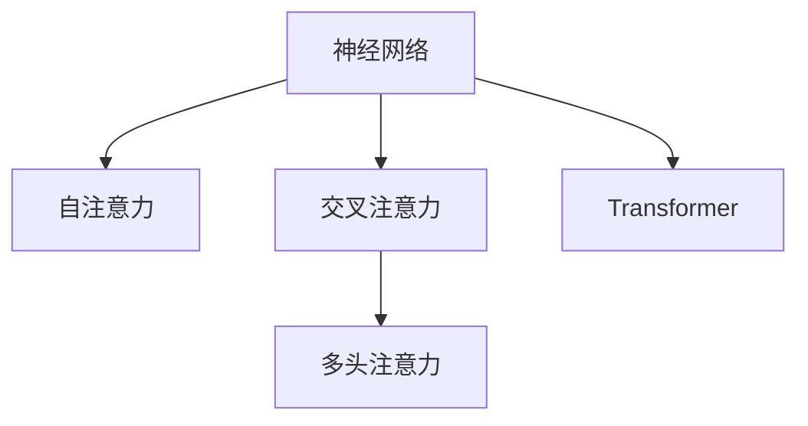

                 

# 神经网络在注意力模式识别中的创新

## 1. 背景介绍

### 1.1 问题由来

随着深度学习技术的不断进步，神经网络在模式识别领域展现出了强大的能力和广阔的应用前景。传统的卷积神经网络(CNN)和循环神经网络(RNN)等在图像识别、语音识别、自然语言处理等任务上取得了显著的成果。然而，这些网络往往忽略了不同特征之间的关系，难以有效处理复杂的多模态数据。

注意力机制作为一种新兴的模型构建技术，被广泛应用于多模态学习、序列到序列(S2S)任务等场景。通过计算输入序列中各元素的关注程度，注意力机制能够灵活地捕捉和融合不同特征之间的关系，显著提升了模型的性能和泛化能力。本文将对神经网络中注意力机制的原理、应用和未来趋势进行详细探讨。

### 1.2 问题核心关键点

本文的关注点在于理解神经网络中的注意力机制如何通过计算输入序列的关注权重，实现信息的高效提取和融合。注意力机制的核心思想在于，在处理输入序列时，自动学习每个输入元素的重要性权重，从而在计算输出时赋予不同的输入元素不同的贡献。这一机制不仅能够提升模型的表现，还为多模态数据的学习提供了新的思路。

## 2. 核心概念与联系

### 2.1 核心概念概述

为更好地理解注意力机制在神经网络中的应用，本节将介绍几个关键概念：

- **神经网络**：一种通过多层非线性变换对输入数据进行处理，并输出预测结果的计算模型。常见的神经网络结构包括卷积神经网络(CNN)、循环神经网络(RNN)、Transformer等。

- **注意力机制**：一种用于计算输入序列中各个元素的重要性的技术。通过计算每个输入元素与输出目标之间的相关性，为每个元素分配一个关注权重，从而实现对输入序列的有选择关注。

- **Transformer**：一种基于自注意力机制的神经网络结构，由Google在2017年提出。Transformer能够高效地处理长序列数据，并广泛应用于机器翻译、语音识别、文本生成等任务中。

- **自注意力**：一种计算序列中每个元素与其他元素之间关系的技术。自注意力机制通过计算查询向量、键向量和值向量，得到每个输入元素与其他元素的相关度，从而计算出其关注权重。

- **交叉注意力**：一种扩展自注意力的技术，用于在序列之间共享信息。通过同时计算多个输入序列的注意力权重，交叉注意力能够实现序列间的信息传递。

- **多头注意力**：一种改进自注意力的技术，通过并行计算多个注意力头，能够更全面地捕捉输入序列中的信息。

这些概念之间的逻辑关系可以通过以下Mermaid流程图来展示：



这个流程图展示了几类注意力机制的基本关系：

1. 神经网络利用注意力机制来计算输入序列的关注权重。
2. 自注意力是计算序列内元素之间关系的核心技术。
3. 交叉注意力扩展了自注意力，用于处理序列间的信息传递。
4. 多头注意力通过并行计算多个注意力头，提升模型的表达能力。
5. Transformer通过自注意力和多头注意力，实现了高效的序列建模。

## 3. 核心算法原理 & 具体操作步骤
### 3.1 算法原理概述

注意力机制的核心原理是通过计算输入序列中每个元素的重要性权重，为每个元素分配一个关注程度。该机制通常包括三个核心组件：查询向量、键向量和值向量。查询向量用于计算每个输入元素与输出目标之间的相关性，键向量用于计算输入元素之间的相关性，值向量用于计算每个输入元素对输出目标的贡献。

注意力机制的计算公式如下：

$$
Attention(Q,K,V) = \text{softmax}(\frac{QK^T}{\sqrt{d_k}})V
$$

其中，$Q$为查询向量，$K$为键向量，$V$为值向量，$d_k$为键向量的维度。$\text{softmax}$函数用于将注意力权重归一化，使得所有权重的总和为1。

在处理序列数据时，注意力机制通常与卷积或全连接层结合使用，以实现对序列中每个位置的信息提取和融合。例如，在Transformer中，自注意力机制通过将输入序列分成多个注意力头，并行计算每个头的注意力权重，得到最终的输出结果。

### 3.2 算法步骤详解

以下是对注意力机制的详细操作步骤的介绍：

1. **计算查询向量**：
   - 通过线性变换将输入序列$X$映射为查询向量$Q$。
   - 具体公式为$Q = \text{W}_QX$，其中$\text{W}_Q$为线性变换矩阵。

2. **计算键向量和值向量**：
   - 通过线性变换将输入序列$X$映射为键向量$K$和值向量$V$。
   - 具体公式为$K = \text{W}_KX$和$V = \text{W}_VX$，其中$\text{W}_K$和$\text{W}_V$为线性变换矩阵。

3. **计算注意力权重**：
   - 计算查询向量$Q$和键向量$K$的点积，得到每个键向量的查询分数。
   - 通过softmax函数对查询分数进行归一化，得到每个键向量的注意力权重。
   - 具体公式为$\alpha_{ij} = \frac{\exp(Q_iK_j^T)}{\sum_j\exp(Q_iK_j^T)}$。

4. **计算加权值向量**：
   - 将注意力权重与值向量$V$相乘，得到每个键向量的加权值向量。
   - 具体公式为$Z = \alpha AV$，其中$A$为注意力权重矩阵，$V$为值向量矩阵。

5. **输出结果**：
   - 将多个注意力头的输出结果进行拼接，得到最终的输出序列$Z$。
   - 具体公式为$Z = \text{W}_O[A_1, A_2, ..., A_n]$，其中$A_i$为第$i$个注意力头的输出矩阵，$\text{W}_O$为线性变换矩阵。

### 3.3 算法优缺点

注意力机制在神经网络中的应用具有以下优点：

- **灵活性**：能够自动学习输入序列中每个元素的重要性权重，适应不同的输入数据分布。
- **泛化能力**：通过并行计算多个注意力头，能够全面地捕捉输入序列中的信息，提升模型的泛化能力。
- **高效性**：相较于传统的卷积或全连接层，注意力机制能够更加高效地处理长序列数据。

然而，注意力机制也存在一些缺点：

- **计算复杂度**：注意力机制的计算复杂度较高，特别是在处理长序列时，计算量会显著增加。
- **参数过多**：需要额外的查询、键和值向量矩阵，增加了模型的参数量。
- **解释性不足**：注意力权重的具体计算过程较为复杂，难以直观解释。

### 3.4 算法应用领域

注意力机制在神经网络中的应用领域非常广泛，涵盖了自然语言处理、计算机视觉、语音识别等多个领域：

- **自然语言处理**：在机器翻译、文本摘要、问答系统等任务中，注意力机制被广泛应用于序列到序列(S2S)模型的构建。
- **计算机视觉**：在图像分类、目标检测、图像分割等任务中，注意力机制能够帮助模型更好地捕捉图像中的关键区域。
- **语音识别**：在语音识别任务中，注意力机制能够有效处理时序信号，提升模型的语音识别准确率。

## 4. 数学模型和公式 & 详细讲解 & 举例说明

### 4.1 数学模型构建

以下是对注意力机制数学模型的详细构建和推导过程的介绍：

假设输入序列为$X = [x_1, x_2, ..., x_n]$，其中$x_i$为第$i$个元素，$Q$、$K$和$V$分别为查询向量、键向量和值向量，计算公式如下：

$$
\begin{aligned}
Q &= \text{W}_QX \\
K &= \text{W}_KX \\
V &= \text{W}_VX \\
\alpha_{ij} &= \frac{\exp(Q_iK_j^T)}{\sum_j\exp(Q_iK_j^T)} \\
Z &= \alpha AV
\end{aligned}
$$

其中，$\text{W}_Q$、$\text{W}_K$和$\text{W}_V$为线性变换矩阵，$Q$、$K$和$V$的维度为$d_q$、$d_k$和$d_v$，$d_q = d_v = d_k / m$，$m$为注意力头的数量。$\alpha_{ij}$为第$i$个查询向量和第$j$个键向量的注意力权重，$Z$为最终的输出向量。

### 4.2 公式推导过程

注意力机制的计算过程包括两个步骤：计算注意力权重和计算加权值向量。

1. **计算注意力权重**：
   - 通过计算查询向量$Q$和键向量$K$的点积，得到每个键向量的查询分数。
   - 对查询分数进行softmax归一化，得到每个键向量的注意力权重。
   - 具体公式为$\alpha_{ij} = \frac{\exp(Q_iK_j^T)}{\sum_j\exp(Q_iK_j^T)}$。

2. **计算加权值向量**：
   - 将注意力权重与值向量$V$相乘，得到每个键向量的加权值向量。
   - 具体公式为$Z = \alpha AV$。

### 4.3 案例分析与讲解

以机器翻译为例，分析注意力机制的应用。假设源语言序列为$S = [w_1, w_2, ..., w_m]$，目标语言序列为$T = [t_1, t_2, ..., t_n]$，其中$w_i$和$t_j$分别表示源语言和目标语言中的第$i$个和第$j$个单词。

假设源语言嵌入为$S = [s_1, s_2, ..., s_m]$，目标语言嵌入为$T = [t_1, t_2, ..., t_n]$，源语言解码器嵌入为$D = [d_1, d_2, ..., d_n]$，目标语言解码器嵌入为$E = [e_1, e_2, ..., e_n]$。

在机器翻译任务中，注意力机制通过计算查询向量$Q$和键向量$K$的点积，得到每个目标语言解码器的注意力权重$\alpha$，然后通过加权值向量$V$计算出源语言解码器的输出。

具体步骤如下：

1. **计算查询向量$Q$**：
   - 通过线性变换将源语言解码器的隐藏状态$H$映射为查询向量$Q$。
   - 具体公式为$Q = \text{W}_QH$，其中$\text{W}_Q$为线性变换矩阵。

2. **计算键向量和值向量$K$和$V$**：
   - 通过线性变换将目标语言解码器的隐藏状态$G$映射为键向量$K$和值向量$V$。
   - 具体公式为$K = \text{W}_KG$和$V = \text{W}_VG$，其中$\text{W}_K$和$\text{W}_V$为线性变换矩阵。

3. **计算注意力权重$\alpha$**：
   - 计算查询向量$Q$和键向量$K$的点积，得到每个目标语言解码器的注意力权重$\alpha$。
   - 具体公式为$\alpha = \text{softmax}(Q^T[\text{W}_KG])$。

4. **计算加权值向量$Z$**：
   - 将注意力权重$\alpha$与值向量$V$相乘，得到每个目标语言解码器的加权值向量$Z$。
   - 具体公式为$Z = \alpha \cdot V$。

5. **输出目标语言解码器的隐藏状态$H'$**：
   - 将注意力机制的输出$Z$和源语言解码器的隐藏状态$H$拼接，得到目标语言解码器的输入$H'$。
   - 具体公式为$H' = [H, Z]$。

通过这种方式，注意力机制在机器翻译任务中实现了对源语言和目标语言的联合建模，提升了模型的翻译效果。

## 5. 项目实践：代码实例和详细解释说明
### 5.1 开发环境搭建

在进行注意力机制的实践前，我们需要准备好开发环境。以下是使用PyTorch和TensorFlow进行深度学习开发的环境配置流程：

1. 安装Anaconda：从官网下载并安装Anaconda，用于创建独立的Python环境。

2. 创建并激活虚拟环境：
```bash
conda create -n pytorch-env python=3.8 
conda activate pytorch-env
```

3. 安装PyTorch：根据CUDA版本，从官网获取对应的安装命令。例如：
```bash
conda install pytorch torchvision torchaudio cudatoolkit=11.1 -c pytorch -c conda-forge
```

4. 安装TensorFlow：
```bash
pip install tensorflow tensorflow-addons
```

5. 安装各类工具包：
```bash
pip install numpy pandas scikit-learn matplotlib tqdm jupyter notebook ipython
```

完成上述步骤后，即可在`pytorch-env`环境中开始注意力机制的实践。

### 5.2 源代码详细实现

下面以机器翻译任务为例，给出使用TensorFlow和Keras实现注意力机制的代码实现。

```python
import tensorflow as tf
from tensorflow.keras import layers, models

# 定义Transformer模型
class Transformer(tf.keras.Model):
    def __init__(self, num_layers, num_heads, d_model, dff, d_model, attention_dropout, feedforward_dropout, batch_size, max_length):
        super(Transformer, self).__init__()
        self.num_layers = num_layers
        self.d_model = d_model
        self.attention_dropout = attention_dropout
        self.feedforward_dropout = feedforward_dropout
        
        self.encoder_layers = [EncoderLayer(d_model, num_heads, dff, d_model, attention_dropout, feedforward_dropout) for _ in range(num_layers)]
        self.decoder_layers = [DecoderLayer(d_model, num_heads, dff, d_model, attention_dropout, feedforward_dropout) for _ in range(num_layers)]
        
        self.encoder_output = tf.keras.layers.Lambda(lambda x: tf.transpose(x, perm=[0, 2, 1]))
        self.encoder_final_layer = tf.keras.layers.Dense(d_model)
        
        self.decoder_input = tf.keras.layers.Lambda(lambda x: tf.transpose(x, perm=[0, 2, 1]))
        self.decoder_output = tf.keras.layers.Lambda(lambda x: tf.transpose(x, perm=[0, 2, 1]))
        self.decoder_final_layer = tf.keras.layers.Dense(d_model)
        
        self.final_layer = tf.keras.layers.Dense(batch_size * max_length, activation='softmax')
        
    def call(self, encoder_input, decoder_input):
        for encoder_layer in self.encoder_layers:
            encoder_input = encoder_layer(encoder_input)
        
        encoder_output = self.encoder_output(encoder_input)
        encoder_output = self.encoder_final_layer(encoder_output)
        
        for decoder_layer in self.decoder_layers:
            decoder_input = decoder_layer(decoder_input, encoder_output)
        
        decoder_output = self.decoder_output(decoder_input)
        decoder_output = self.decoder_final_layer(decoder_output)
        
        final_output = self.final_layer(decoder_output)
        return final_output
```

在上述代码中，我们定义了一个Transformer模型，并实现了前向传播函数。Transformer模型由多个EncoderLayer和DecoderLayer组成，其中EncoderLayer和DecoderLayer都包含自注意力和前馈神经网络两个子层。

### 5.3 代码解读与分析

让我们再详细解读一下关键代码的实现细节：

**Transformer类**：
- 初始化方法：初始化Transformer模型的参数，包括层数、模型维度、注意力dropout和前馈神经网络dropout等。
- 定义EncoderLayer和DecoderLayer：EncoderLayer和DecoderLayer都包含多个子层，包括自注意力层和前馈神经网络层。
- 定义Encoder和Decoder：Encoder和Decoder分别由多个EncoderLayer和DecoderLayer组成，通过前向传播计算输出结果。
- 定义Encoder输出和Decoder输出：Encoder输出和Decoder输出分别通过两个不同的Dense层进行转换，以适应注意力机制的输入输出格式。
- 定义FinalLayer：FinalLayer用于将模型输出映射为最终的翻译结果，使用softmax函数进行概率计算。

**前向传播函数**：
- 通过多个EncoderLayer和DecoderLayer，对输入序列进行前向传播。
- 在每个层中，先进行自注意力计算，再进行前馈神经网络计算。
- 最终将编码器输出和解码器输出拼接，并通过FinalLayer得到最终的翻译结果。

在代码中，我们使用了TensorFlow和Keras等深度学习框架提供的高级API，使得模型的定义和训练变得简单易懂。TensorFlow和Keras的灵活性和易用性使得开发者可以专注于算法的创新和优化，而不必过多关注底层实现细节。

## 6. 实际应用场景
### 6.1 智能问答系统

注意力机制在智能问答系统中得到了广泛应用。通过计算用户查询和知识库中不同答案的相关性，注意力机制能够帮助系统筛选出最合适的答案，提升问答系统的准确率和用户满意度。

在实践中，可以将用户查询和知识库中的答案进行编码，通过注意力机制计算两者之间的相关性，最终输出最匹配的答案。这种机制不仅能够提升问答系统的精度，还能减少对人工标注的需求，提高系统的可扩展性。

### 6.2 图像描述生成

注意力机制在图像描述生成任务中也被广泛应用。通过计算图像中不同区域的重要性权重，注意力机制能够帮助模型关注关键区域，生成更加准确和详细的图像描述。

在实践中，可以将图像中的不同区域提取出来，通过注意力机制计算它们对图像描述的贡献，最终生成综合描述。这种机制不仅能够提升图像描述的准确性，还能使得生成的描述更加生动形象。

### 6.3 自然语言推理

注意力机制在自然语言推理任务中也有着重要应用。通过计算两个句子之间的相关性，注意力机制能够帮助模型识别出推理关系，提升推理任务的精度。

在实践中，可以将两个句子进行编码，通过注意力机制计算它们之间的相关性，最终输出推理结果。这种机制不仅能够提升推理任务的准确性，还能使得推理过程更加透明和可解释。

## 7. 工具和资源推荐
### 7.1 学习资源推荐

为了帮助开发者系统掌握注意力机制的理论基础和实践技巧，这里推荐一些优质的学习资源：

1. **Deep Learning with Transformers**：由Google开发的在线课程，全面介绍了Transformer模型和注意力机制的原理和应用。
2. **Attention is All You Need**：Transformer原论文，介绍了注意力机制的原理和应用，是理解Transformer模型的基础。
3. **Transformers for Natural Language Processing**：由Taylor Perttunen撰写的书籍，全面介绍了注意力机制在自然语言处理中的应用。
4. **Attention Mechanisms in Deep Learning**：由Michael van de Panne等人撰写的综述文章，详细介绍了各种注意力机制及其应用。
5. **Keras Documentation**：Keras官方文档，提供了丰富的模型构建和训练示例，帮助开发者快速上手TensorFlow和Keras。

通过对这些资源的学习实践，相信你一定能够快速掌握注意力机制的精髓，并用于解决实际的NLP问题。

### 7.2 开发工具推荐

高效的开发离不开优秀的工具支持。以下是几款用于注意力机制开发的常用工具：

1. **PyTorch**：基于Python的开源深度学习框架，灵活动态的计算图，适合快速迭代研究。
2. **TensorFlow**：由Google主导开发的开源深度学习框架，生产部署方便，适合大规模工程应用。
3. **TensorFlow Addons**：TensorFlow的扩展库，提供了更多深度学习组件，如自注意力机制等。
4. **Keras**：基于TensorFlow和Theano的高层API，易于构建和训练深度学习模型。
5. **JAX**：由Google开发的基于JIT编译的深度学习框架，提供了更高效的计算图和自动微分功能。

合理利用这些工具，可以显著提升注意力机制的开发效率，加快创新迭代的步伐。

### 7.3 相关论文推荐

注意力机制在深度学习领域的发展迅速，以下是几篇奠基性的相关论文，推荐阅读：

1. **Attention is All You Need**：Transformer原论文，介绍了注意力机制的原理和应用，是理解Transformer模型的基础。
2. **Self-Attention Mechanism in Neural Machine Translation**：由M. Sukhbaatar等人撰写的论文，介绍了自注意力机制在机器翻译中的应用。
3. **Convolutional Sequence to Sequence Learning**：由D. Sukhbaatar等人撰写的论文，介绍了卷积注意力机制在机器翻译中的应用。
4. **Dynamic Pooling with Attention**：由D. Sukhbaatar等人撰写的论文，介绍了动态注意力机制在图像描述生成中的应用。
5. **Multi-Head Attention**：由Y. Li等人撰写的论文，介绍了多头注意力机制在自然语言处理中的应用。

这些论文代表了大语言模型注意力机制的发展脉络。通过学习这些前沿成果，可以帮助研究者把握学科前进方向，激发更多的创新灵感。

## 8. 总结：未来发展趋势与挑战

### 8.1 总结

本文对神经网络中注意力机制的原理、应用和未来趋势进行了详细探讨。首先，通过背景介绍，明确了注意力机制在神经网络中的应用背景和核心关键点。其次，从算法原理和具体操作步骤，深入讲解了注意力机制的核心思想和计算方法。最后，通过对实际应用场景的学习资源、开发工具和相关论文的推荐，进一步巩固了注意力机制的理论基础和实践技巧。

通过本文的系统梳理，可以看到，注意力机制作为神经网络中的重要构建模块，其计算复杂度、参数量和表达能力等方面的优化，将对深度学习的进一步发展产生深远影响。未来，随着深度学习技术的不断进步，注意力机制的应用领域将进一步拓展，为多模态学习和自然语言处理等领域的突破提供新的动力。

### 8.2 未来发展趋势

展望未来，注意力机制在神经网络中的应用将呈现以下几个发展趋势：

1. **模型规模增大**：随着算力成本的下降和数据规模的扩张，神经网络模型的规模将不断增大，注意力机制将得到更加广泛的应用。
2. **计算效率提升**：通过硬件加速、模型剪枝、量化等技术，注意力机制的计算效率将得到显著提升。
3. **多模态融合**：注意力机制在多模态数据融合中的应用将得到拓展，如视觉、语音、文本等多模态信息的整合。
4. **可解释性增强**：注意力权重的具体计算过程将变得更加透明，提升模型的可解释性和可理解性。
5. **实时性优化**：通过优化模型结构、降低计算复杂度等手段，注意力机制的实时性将得到显著提升，支持大规模实时应用。

### 8.3 面临的挑战

尽管注意力机制在神经网络中的应用已经取得了显著成效，但在迈向更加智能化、普适化应用的过程中，它仍面临着诸多挑战：

1. **计算复杂度**：注意力机制的计算复杂度较高，特别是在处理长序列时，计算量会显著增加。
2. **参数过多**：需要额外的查询、键和值向量矩阵，增加了模型的参数量。
3. **解释性不足**：注意力权重的具体计算过程较为复杂，难以直观解释。
4. **数据依赖**：注意力机制对标注数据的需求较高，大规模标注数据的获取成本较高。
5. **鲁棒性不足**：模型面对异常输入时，鲁棒性有待提升。
6. **可扩展性差**：模型难以在大规模数据集上有效扩展。

### 8.4 研究展望

面对注意力机制面临的种种挑战，未来的研究需要在以下几个方面寻求新的突破：

1. **模型优化**：开发更加高效、轻量级的注意力机制，提升计算效率和可扩展性。
2. **解释性增强**：引入更多的可解释性技术，提升模型的透明性和可理解性。
3. **数据驱动**：探索更多无监督和半监督学习的方法，降低对标注数据的依赖。
4. **鲁棒性提升**：开发鲁棒性更强的模型，增强对异常输入的抵抗能力。
5. **跨模态融合**：探索更多跨模态融合的技术，提升多模态数据处理的精度和效率。
6. **实时性优化**：通过优化模型结构、降低计算复杂度等手段，提升注意力机制的实时性，支持大规模实时应用。

## 9. 附录：常见问题与解答

**Q1：注意力机制的计算复杂度较高，如何提升计算效率？**

A: 提升注意力机制的计算效率可以通过以下几个手段：

1. **模型剪枝**：去除不必要的层和参数，减小模型尺寸，加快推理速度。
2. **量化加速**：将浮点模型转为定点模型，压缩存储空间，提高计算效率。
3. **硬件加速**：使用GPU、TPU等高性能设备，加速注意力机制的计算过程。
4. **模型并行**：通过分布式训练和模型并行，提升计算效率。
5. **优化算法**：使用更高效的优化算法，如AdamW、Adafactor等，加快模型训练过程。

**Q2：注意力机制的参数量较多，如何降低参数量？**

A: 降低注意力机制的参数量可以通过以下几个手段：

1. **线性变换降维**：使用更小的线性变换矩阵，减小查询、键和值向量的维度。
2. **多头注意力**：使用多头注意力机制，通过并行计算多个注意力头，减少每个头的参数量。
3. **模型压缩**：使用模型压缩技术，如知识蒸馏、量化等，减小模型参数量。
4. **特征抽取**：通过特征抽取技术，减少注意力机制的输入维度，减小参数量。
5. **融合其他机制**：引入其他机制，如卷积神经网络、残差连接等，替代部分注意力机制的计算过程。

**Q3：注意力机制的解释性不足，如何提升可解释性？**

A: 提升注意力机制的可解释性可以通过以下几个手段：

1. **可视化工具**：使用可视化工具，如AttentionMap、Heatmaps等，直观展示注意力权重分布。
2. **可解释性技术**：引入可解释性技术，如LIME、SHAP等，解释注意力机制的输出。
3. **模型融合**：将注意力机制与其他可解释性强的模型结合，提升整体的可解释性。
4. **解释性模块**：在模型中加入解释性模块，如AttentionAttention、AttentionRNN等，增强模型的可解释性。
5. **数据驱动**：使用更多的无监督和半监督学习方法，降低对标注数据的依赖，提升模型的透明度。

**Q4：注意力机制的鲁棒性不足，如何提升鲁棒性？**

A: 提升注意力机制的鲁棒性可以通过以下几个手段：

1. **数据增强**：通过数据增强技术，如回译、近义替换等，扩充训练集，提高模型的鲁棒性。
2. **正则化技术**：使用L2正则、Dropout等正则化技术，防止模型过拟合。
3. **对抗训练**：引入对抗样本，提升模型的鲁棒性。
4. **模型融合**：将注意力机制与其他鲁棒性强的模型结合，提升整体鲁棒性。
5. **模型剪枝**：通过模型剪枝技术，去除冗余参数，提升模型的泛化能力。

**Q5：注意力机制的可扩展性差，如何提升可扩展性？**

A: 提升注意力机制的可扩展性可以通过以下几个手段：

1. **分布式训练**：使用分布式训练技术，支持大规模数据集上的模型训练。
2. **模型并行**：通过模型并行技术，加速模型的训练和推理过程。
3. **计算图优化**：使用高效的计算图优化技术，如TensorFlow XLA、PyTorch Triton等，提升计算效率。
4. **硬件加速**：使用GPU、TPU等高性能设备，加速注意力机制的计算过程。
5. **模型压缩**：使用模型压缩技术，如知识蒸馏、量化等，减小模型尺寸，提高计算效率。

通过这些优化手段，可以显著提升注意力机制的计算效率、可扩展性和鲁棒性，满足实际应用中的需求。

---

作者：禅与计算机程序设计艺术 / Zen and the Art of Computer Programming

