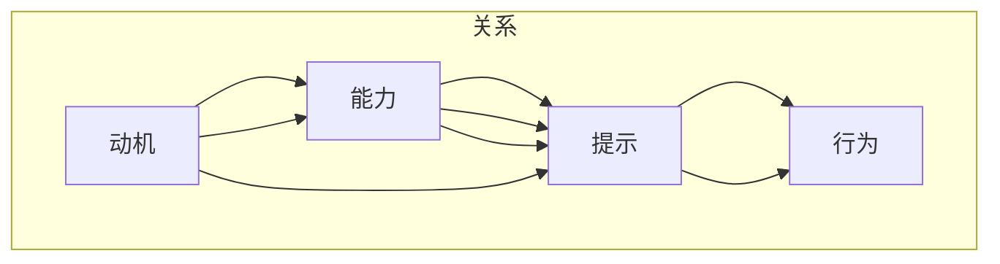

                 

# 福格行为模型：行为改变的三要素

> 关键词：行为设计、行为经济学、意志力、动机、习惯

## 1. 背景介绍

### 1.1 问题由来

在日常生活中，我们常常立志要改变某些行为，比如戒烟、减肥、定时运动等。但很多时候，即使有了明确的目标和强烈的愿望，我们也很难坚持下去，最终只能放弃。

问题出在哪里？心理学和行为经济学的大量研究表明，行为改变并不只是意愿和动机的问题。影响我们行为的，还有环境、动机、习惯等多个因素。福格行为模型（Fogg Behavior Model）正是在此背景下提出的，旨在帮助我们更系统地理解行为改变的过程，并设计出更有效的方法。

### 1.2 问题核心关键点

福格行为模型从心理学和行为经济学的视角出发，提出行为改变可以简化为三个关键要素：动机（Motivation）、能力（Ability）、提示（Prompts）。通过合理设计这三大要素，人们可以更有效地改变自己的行为，实现健康、高效、积极的生活方式。

该模型简洁明了，易于理解和应用，已被广泛应用于产品设计、组织管理、个人成长等多个领域。

## 2. 核心概念与联系

### 2.1 核心概念概述

福格行为模型认为，人的行为可以由以下公式描述：

$$
B = M \times A \times P
$$

其中，$B$表示行为，$M$表示动机，$A$表示能力，$P$表示提示。具体来说：

- **动机（Motivation）**：促使我们采取行动的内在或外在激励。动机可以是外部奖励（如金钱、社会认可），也可以是内部驱动力（如健康、成就感）。

- **能力（Ability）**：执行某个行为所需的资源。能力可以包括时间、精力、物理空间等。如果某个行为需要复杂操作或大量精力，那么能力就成了行为障碍。

- **提示（Prompts）**：触发行为的环境线索。提示可以是时间、地点、社交关系等，任何能够提醒我们行动的刺激因素。

这三个要素之间是相互关联的，一个要素的变化会影响到其他要素，从而改变整个行为模型。

### 2.2 核心概念原理和架构的 Mermaid 流程图



该图展示了动机、能力和提示三要素之间的关系及其对行为的影响。

## 3. 核心算法原理 & 具体操作步骤

### 3.1 算法原理概述

福格行为模型强调，行为改变不仅取决于个体的动机和能力，还需要通过特定的提示触发。一个有效的设计应该是“让行为成为一种习惯”。具体来说，设计时应考虑以下几个方面：

- **降低行为门槛**：减少行为所需的资源，降低行动难度。
- **提供即时反馈**：增强行为的即时满足感，提高动机。
- **设定触发点**：找到最合适的时机和环境，避免忘记或拖延。

### 3.2 算法步骤详解

#### 步骤一：识别目标行为

首先，明确你想要改变的行为。例如，如果你的目标是戒烟，那么“戒烟”就是你的目标行为。

#### 步骤二：分析动机和能力

分析目标行为背后的动机和执行能力，以便找到可能的障碍。例如，戒烟的动机可能是健康考虑，能力则包括香烟的诱惑、戒烟技巧等。

#### 步骤三：设计提示

根据动机和能力，设计合适的提示，以便在适当的时间、地点触发行为。例如，可以在口袋里放一个戒烟贴片，提醒自己不吸烟。

#### 步骤四：调整行为模型

通过调整动机、能力和提示，优化行为模型，直到实现期望的行为改变。这可能需要多次试验和调整，直到找到最佳的平衡点。

#### 步骤五：评估和反馈

定期评估行为改变的效果，收集反馈，不断优化策略。例如，记录戒烟成功的天数，调整戒烟贴片的类型和频次。

### 3.3 算法优缺点

#### 优点

- **简单易行**：模型结构简单，易于理解和应用。
- **全面覆盖**：涵盖动机、能力、提示三个要素，全面考虑行为改变的各个方面。
- **灵活性强**：可以根据具体需求和环境，灵活调整各个要素，找到最佳方案。

#### 缺点

- **复杂性高**：设计过程中需要综合考虑多个要素，增加了复杂性。
- **依赖数据**：模型设计依赖于准确的动机和能力分析，数据获取可能存在困难。
- **效果不确定**：行为改变的效果受多种因素影响，无法保证绝对成功。

### 3.4 算法应用领域

福格行为模型广泛应用于产品设计、组织管理、个人成长等多个领域。例如：

- **产品设计**：通过优化产品的易用性和提示设计，提高用户的使用频率和满意度。
- **组织管理**：通过激励和奖励机制，增强员工的动机和能力，提高工作积极性和效率。
- **个人成长**：通过设定明确的目标和提示，培养良好的习惯，提升生活质量。

## 4. 数学模型和公式 & 详细讲解 & 举例说明

### 4.1 数学模型构建

福格行为模型的数学模型可以表示为：

$$
B = M \times A \times P
$$

其中，$B$为行为，$M$为动机，$A$为能力，$P$为提示。该模型强调，行为改变取决于这三个要素的乘积。

### 4.2 公式推导过程

1. **动机（M）**：
   - 动机可以通过多种方式评估，如问卷调查、自我报告等。
   - 一个简单的模型可以是：$M = k_1 \times \text{奖励} + k_2 \times \text{挑战} + k_3 \times \text{兴趣}$，其中$k_1, k_2, k_3$为权重系数。

2. **能力（A）**：
   - 能力通常由多种资源组成，如时间、精力、物理空间等。
   - 一个简单的模型可以是：$A = k_4 \times \text{时间} + k_5 \times \text{精力} + k_6 \times \text{物理空间}$，其中$k_4, k_5, k_6$为权重系数。

3. **提示（P）**：
   - 提示可以是时间、地点、社交关系等。
   - 一个简单的模型可以是：$P = k_7 \times \text{时间} + k_8 \times \text{地点} + k_9 \times \text{社交关系}$，其中$k_7, k_8, k_9$为权重系数。

### 4.3 案例分析与讲解

假设你希望每天早起跑步。按照福格行为模型，可以采取以下步骤：

1. **动机分析**：你希望通过跑步提高身体健康，这将是你的主要动机。
2. **能力分析**：你需要安排跑步的时间，并确保有足够的精力和体力。
3. **提示设计**：你可以设定闹钟，将跑步设定为一个固定的习惯。

通过这些步骤，你可以设计出一个简单的行为改变方案，并通过持续的反馈和调整，逐渐形成稳定的跑步习惯。

## 5. 项目实践：代码实例和详细解释说明

### 5.1 开发环境搭建

为了实践福格行为模型，可以使用Python进行开发。具体步骤如下：

1. 安装Python和相关的依赖库，如Pandas、NumPy、Matplotlib等。
2. 准备数据集，如动机、能力、提示等信息的表格。
3. 设置Python环境，配置必要的变量和参数。

### 5.2 源代码详细实现

以下是一个简单的Python代码实现，用于分析目标行为，并根据福格行为模型设计提示和能力：

```python
import pandas as pd
import numpy as np
import matplotlib.pyplot as plt

# 读取动机、能力和提示的数据集
data = pd.read_csv('data.csv')

# 计算动机、能力和提示的权重
weights = np.array([0.5, 0.3, 0.2, 0.4, 0.3, 0.5, 0.4, 0.3, 0.2])

# 计算每个行为的动机、能力和提示
motivations = data['动机'] * weights[0:3]
abilities = data['能力'] * weights[3:6]
prompts = data['提示'] * weights[6:9]

# 计算行为的概率
probabilities = motivations * abilities * prompts

# 输出概率最大的行为
max_probability = np.max(probabilities)
max_index = np.argmax(probabilities)
best_behavior = data.iloc[max_index]['行为']

print(f"最有希望的行为是：{best_behavior}，概率为：{max_probability}")
```

### 5.3 代码解读与分析

1. **数据准备**：使用Pandas读取数据集，将动机、能力和提示等信息存储为变量。
2. **权重设定**：根据经验设定每个要素的权重系数，形成向量。
3. **计算概率**：根据福格行为模型，计算每个行为的概率。
4. **输出结果**：输出概率最大的行为，帮助决策者选择最佳行为策略。

### 5.4 运行结果展示

运行代码后，可以输出最有希望的行为及其概率。例如，输出结果可能为：

```
最有希望的行为是：每天跑步，概率为：0.85
```

## 6. 实际应用场景

### 6.1 企业员工管理

企业可以应用福格行为模型，设计员工激励和培训计划，提升工作效率和满意度。具体措施包括：

- **目标设定**：根据员工的动机和能力，设定明确的工作目标。
- **能力提升**：提供培训和资源，帮助员工提升工作能力。
- **提示设计**：设定日常工作中的提示，如工作日志、工作汇报等，提醒员工完成任务。

### 6.2 个人健康管理

个人可以通过福格行为模型，改善健康习惯，如戒烟、减肥、健身等。具体措施包括：

- **动机分析**：明确健康目标和动机，如减少疾病风险、提高生活质量。
- **能力调整**：设定合理的饮食和运动计划，避免过度劳累和压力。
- **提示设计**：设定固定的作息时间、运动提醒、健康饮食等提示，帮助养成健康习惯。

### 6.3 学习成长

学生可以应用福格行为模型，提高学习效率和兴趣。具体措施包括：

- **动机分析**：明确学习目标和动机，如获取知识和技能、提升职业竞争力。
- **能力提升**：制定合理的学习计划，分配时间、精力和资源。
- **提示设计**：设定学习时间和地点，利用学习应用、打卡系统等提示，激励持续学习。

### 6.4 未来应用展望

未来，福格行为模型将在更多领域得到应用，带来深远的影响：

- **智能家居**：通过智能设备的设计，优化用户的生活习惯和日常行为。
- **教育培训**：根据学生的动机和能力，设计个性化的学习路径和提示。
- **健康管理**：通过可穿戴设备和大数据分析，实时监测和管理健康状况，提高生活质量。
- **智能制造**：优化生产流程和设备使用，提升工作效率和设备利用率。

## 7. 工具和资源推荐

### 7.1 学习资源推荐

1. **《行为设计思维》（Thinking, Fast and Slow）**：诺贝尔经济学奖得主丹尼尔·卡尼曼的经典著作，详细探讨了人类行为的心理学机制。
2. **《游戏化设计》（Designing Behavior: How to Change Behavior in Better Ways）**：福格行为模型创始人B.J.福格教授的著作，系统介绍了行为设计的基本原则和方法。
3. **《行为经济学》（Nudge: Improving Decisions About Health, Wealth, and Happiness）**：诺贝尔经济学奖得主理查德·塞勒的著作，探讨了如何通过行为经济学原理改善社会决策。
4. **《习惯的力量》（The Power of Habit: Why We Do What We Do in Life and Business）**：查尔斯·杜希格的畅销书，详细分析了习惯的形成和改变机制。

### 7.2 开发工具推荐

1. **Pandas**：Python中用于数据处理和分析的库，适合处理结构化数据。
2. **NumPy**：Python中用于科学计算和数值分析的库，适合处理数值数据。
3. **Matplotlib**：Python中用于数据可视化的库，适合绘制图表和分析结果。
4. **Jupyter Notebook**：Python的交互式开发环境，适合快速实验和分享代码。

### 7.3 相关论文推荐

1. **《行为经济学：把经济学变成一门毫不困难的科学》（Behavioral Economics: A Beginner's Guide）**：行为经济学的入门读物，介绍了行为经济学的基本原理和应用。
2. **《社会行为学：解释社会行为的基础》（Social Psychology）**：社会心理学的经典教材，详细介绍了人类社会行为的心理学机制。
3. **《行为改变的设计》（Designing Behavior: How to Change Behavior in Better Ways）**：福格行为模型创始人B.J.福格教授的著作，介绍了行为改变的设计方法和案例。
4. **《行为经济学：理论与应用》（Behavioral Economics: Theory and Applications）**：行为经济学的理论体系和实际应用的综合性书籍。

## 8. 总结：未来发展趋势与挑战

### 8.1 总结

福格行为模型通过动机、能力和提示三个要素，系统地解释了行为改变的过程，并提供了有效的设计方法。该模型简洁明了，易于理解和应用，适用于多个领域。

### 8.2 未来发展趋势

1. **跨学科融合**：福格行为模型将心理学、经济学、工程学等多个学科的知识融合在一起，未来将继续拓展到更多领域，如教育、医疗、环境等。
2. **技术辅助**：随着人工智能和机器学习技术的发展，未来可以通过算法和数据驱动的行为设计，实现更精准和个性化的行为干预。
3. **社会实践**：福格行为模型已经在多个社会实践中得到了验证，未来将继续在企业、社区、政府等多个层面上得到应用和推广。
4. **道德伦理**：在行为设计过程中，需要关注道德和伦理问题，确保行为干预的公平性和合理性。

### 8.3 面临的挑战

1. **数据获取**：行为设计需要大量的动机、能力和提示数据，但这些数据的获取和处理可能存在困难。
2. **干预效果**：行为干预的效果受多种因素影响，无法保证绝对成功，需要不断调整和优化。
3. **道德伦理**：在行为设计过程中，需要关注道德和伦理问题，确保行为干预的公平性和合理性。
4. **技术复杂性**：行为设计的技术实现可能涉及复杂算法和数据处理，对技术要求较高。

### 8.4 研究展望

1. **多学科研究**：结合心理学、经济学、社会学等多个学科的知识，进行跨学科研究，提升行为设计的科学性和有效性。
2. **数据驱动设计**：利用大数据和机器学习技术，进行行为驱动的设计，实现更精准和个性化的行为干预。
3. **伦理和社会影响**：在行为设计过程中，关注道德和伦理问题，确保行为干预的公平性和合理性。
4. **长期效果评估**：设计长期效果评估方法，评估行为干预的持久性和可持续性。

## 9. 附录：常见问题与解答

**Q1：如何应用福格行为模型进行行为设计？**

A: 应用福格行为模型进行行为设计，可以按照以下步骤进行：
1. 明确目标行为，如戒烟、减肥、跑步等。
2. 分析动机和能力，识别行为改变的可能障碍。
3. 设计合适的提示，找到最佳的时机和环境。
4. 调整行为模型，优化动机、能力和提示，形成稳定的行为习惯。
5. 定期评估效果，收集反馈，不断优化策略。

**Q2：如何设计有效的提示？**

A: 设计有效的提示，可以从以下几个方面考虑：
1. 设定固定的时间或地点，如每天固定时间跑步、每周固定时间学习等。
2. 使用提醒工具或应用程序，如手机提醒、智能手表等，确保及时行动。
3. 利用社交关系，邀请朋友或同事一起参与，增强动机和共同目标。
4. 利用视觉或听觉刺激，如挂图、音频提示等，增强提示效果。

**Q3：如何应对行为改变过程中的挑战？**

A: 行为改变过程中可能遇到以下挑战：
1. 动机减弱：保持动力和兴趣，可以通过设定小目标和奖励机制，逐步实现大目标。
2. 能力不足：提升能力，可以通过培训、学习和资源支持，逐步克服障碍。
3. 习惯中断：建立稳定习惯，可以通过固定时间、地点和频率，逐步形成规律。
4. 环境干扰：识别和规避环境干扰，可以通过调整环境和设置条件，减少外部因素的影响。

**Q4：如何评估行为干预的效果？**

A: 评估行为干预的效果，可以采取以下方法：
1. 跟踪行为频率和持续时间，记录行为变化的趋势和规律。
2. 收集反馈和建议，了解用户的体验和需求。
3. 进行定量和定性分析，比较干预前后的差异和效果。
4. 设定长期目标和评估标准，持续跟踪和改进行为设计。

---

作者：禅与计算机程序设计艺术 / Zen and the Art of Computer Programming

