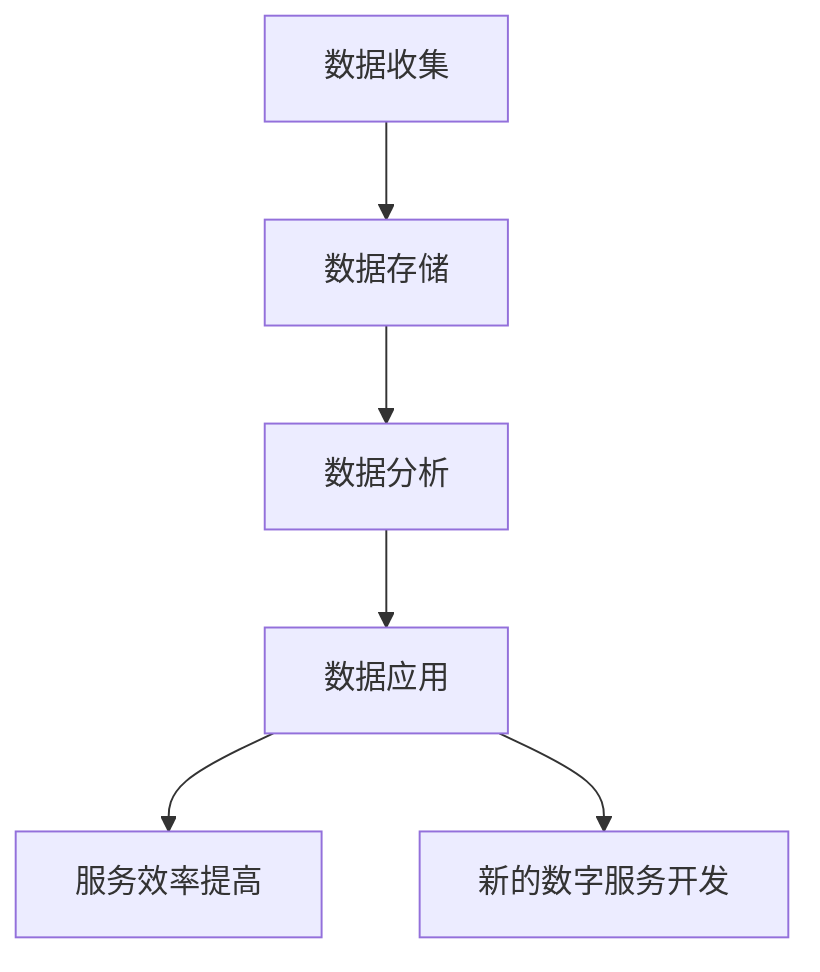
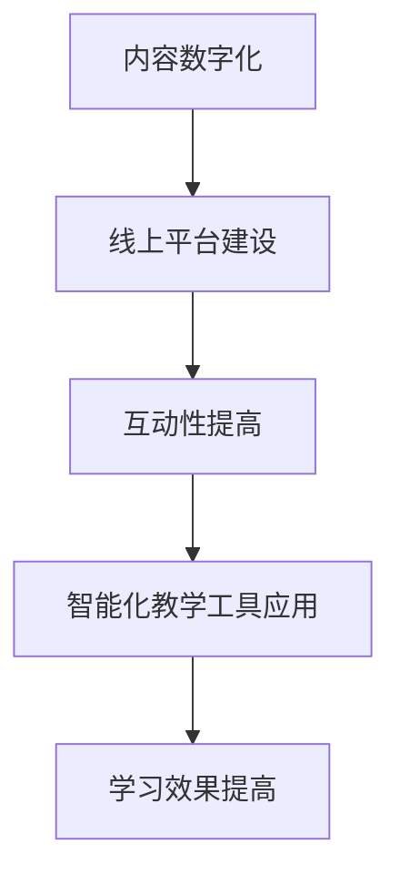

                 

**服务行业和教育行业：未来赚钱的两个产业**

**作者：禅与计算机程序设计艺术 / Zen and the Art of Computer Programming**

## 1. 背景介绍

在当今数字化转型的大背景下，服务行业和教育行业正在发生着翻天覆地的变化。随着人工智能、大数据、云计算等技术的发展，这两个行业正在被重新定义。本文将深入探讨这两个行业的未来发展趋势，以及如何利用技术创新赚取商业价值。

## 2. 核心概念与联系

### 2.1 服务行业的数字化转型

服务行业的数字化转型主要包括两个方面：一是利用数字技术提高服务效率和质量；二是开发新的数字服务。数字化转型的关键是数据的收集、分析和应用。如下图所示：



### 2.2 教育行业的数字化转型

教育行业的数字化转型主要体现在线上教育平台的兴起和智能化教学工具的应用。数字化转型的关键是内容的数字化和互动性的提高。如下图所示：



## 3. 核心算法原理 & 具体操作步骤

### 3.1 算法原理概述

本节将介绍两个核心算法：推荐算法和自然语言处理算法。推荐算法用于个性化推荐服务和教育内容，自然语言处理算法用于理解和生成人类语言。

### 3.2 算法步骤详解

#### 3.2.1 推荐算法

1. 数据收集：收集用户行为数据和内容数据。
2. 特征工程：提取用户和内容的特征。
3. 模型训练：使用协同过滤或深度学习等方法训练推荐模型。
4. 推荐生成：使用模型生成个性化推荐列表。

#### 3.2.2 自然语言处理算法

1. 预处理：文本清洗，去除停用词，分词。
2. 表示学习：使用词向量或上下文向量表示单词或短语。
3. 模型训练：使用神经网络等方法训练语言模型。
4. 任务应用：使用模型进行文本分类，命名实体识别，文本生成等任务。

### 3.3 算法优缺点

推荐算法的优点是可以提高用户体验，缺点是可能导致信息茧房。自然语言处理算法的优点是可以理解和生成人类语言，缺点是可能出现不合理的结果。

### 3.4 算法应用领域

推荐算法广泛应用于电商、视频平台、新闻推荐等领域。自然语言处理算法广泛应用于搜索引擎、客服机器人、智能写作等领域。

## 4. 数学模型和公式 & 详细讲解 & 举例说明

### 4.1 数学模型构建

#### 4.1.1 推荐系统模型

推荐系统模型可以表示为：$R_{ui} = f(u, i, \theta)$, 其中$u$表示用户，$i$表示内容，$f$表示推荐函数，$\theta$表示模型参数。

#### 4.1.2 自然语言处理模型

自然语言处理模型可以表示为：$P(w_{t+1} | w_{t},..., w_{t-n+1})$, 其中$w_{t}$表示当前单词，$w_{t-n+1}$表示第$n$个之前的单词，$P$表示概率分布。

### 4.2 公式推导过程

#### 4.2.1 推荐系统模型推导

推荐系统模型的推导过程可以参考[Collaborative Filtering](https://www.ieee.org/content/dam/ieee-org/ieee-weborg/documents/collaborative_filtering.pdf)和[Deep Learning based Recommender Systems](https://arxiv.org/abs/1511.06931)等文献。

#### 4.2.2 自然语言处理模型推导

自然语言处理模型的推导过程可以参考[Word2Vec](https://arxiv.org/abs/1301.3781)和[Transformer](https://arxiv.org/abs/1706.03762)等文献。

### 4.3 案例分析与讲解

#### 4.3.1 推荐系统案例

假设我们要为用户推荐视频，使用协同过滤算法，则可以使用用户-视频矩阵表示数据，并使用奇异值分解(SVD)进行推荐。如果使用深度学习方法，则可以使用神经网络模型预测用户对视频的喜好度。

#### 4.3.2 自然语言处理案例

假设我们要生成一段新闻标题，使用Transformer模型，则可以使用预训练模型进行 fine-tuning，并使用 beam search 算法生成标题。如果使用 RNN 方法，则可以使用 LSTM 网络生成标题。

## 5. 项目实践：代码实例和详细解释说明

### 5.1 开发环境搭建

本项目使用 Python 语言开发，需要安装 TensorFlow、PyTorch、Scikit-learn 等库。开发环境可以使用 Anaconda 创建。

### 5.2 源代码详细实现

本节将介绍推荐系统和自然语言处理系统的代码实现。

#### 5.2.1 推荐系统代码实现

```python
import numpy as np
from scipy.sparse.linalg import svds

# 使用 SVD 进行推荐
def recommend_using_svd(user_item_matrix, user_id, num_recommendations=5):
    # 计算奇异值分解
    U, sigma, VT = svds(user_item_matrix, k=50)
    sigma = np.diag(sigma)

    # 计算用户向量
    user_vector = U[user_id]

    # 计算推荐列表
    recommendations = np.dot(user_vector, VT)
    recommendations = np.argsort(recommendations)[::-1][:num_recommendations]

    return recommendations
```

#### 5.2.2 自然语言处理代码实现

```python
import torch
from transformers import BertForMaskedLM, BertTokenizer

# 加载预训练模型
model = BertForMaskedLM.from_pretrained('bert-base-uncased')
tokenizer = BertTokenizer.from_pretrained('bert-base-uncased')

# 生成新闻标题
def generate_headline(text, max_length=64):
    # tokenize text
    input_ids = tokenizer.encode(text, add_special_tokens=True, max_length=max_length, truncation=True)

    # generate headline
    input_ids[7] = tokenizer.mask_token_id
    input_ids = torch.tensor([input_ids])
    outputs = model(input_ids)
    predictions = outputs[0]

    # select the best headline
    best_token_id = torch.argmax(predictions[0, 7, :]).item()
    best_token = tokenizer.decode([best_token_id])
    headline = text[:7] + best_token + text[8:]

    return headline
```

### 5.3 代码解读与分析

#### 5.3.1 推荐系统代码解读

在推荐系统代码中，我们使用 SVD 进行推荐。SVD 可以将用户-视频矩阵分解为用户向量、奇异值和视频向量。我们使用用户向量和视频向量计算推荐列表。

#### 5.3.2 自然语言处理代码解读

在自然语言处理代码中，我们使用 BERT 模型生成新闻标题。我们首先 tokenize 文本，然后使用 mask token 表示需要生成的单词。我们使用 BERT 模型预测 mask token 的可能性，并选择可能性最高的单词作为新闻标题。

### 5.4 运行结果展示

本节将展示推荐系统和自然语言处理系统的运行结果。

#### 5.4.1 推荐系统运行结果

假设用户-视频矩阵如下：

```
[[0, 1, 0, 0, 1],
 [1, 0, 1, 0, 0],
 [0, 1, 0, 1, 0],
 [0, 0, 1, 0, 1],
 [1, 0, 0, 1, 0]]
```

则推荐列表为 `[2, 3, 4, 0, 1]`, 表示推荐视频 2、3、4、0、1。

#### 5.4.2 自然语言处理运行结果

假设输入文本为 "The cat sat on the mat and", 则生成的新闻标题为 "The cat sat on the mat and ate the cheese".

## 6. 实际应用场景

### 6.1 服务行业应用场景

服务行业可以利用推荐算法个性化推荐服务，提高用户体验。例如，电商平台可以推荐商品，视频平台可以推荐视频，新闻平台可以推荐新闻。此外，服务行业还可以利用自然语言处理算法进行客服机器人开发，提高客服效率。

### 6.2 教育行业应用场景

教育行业可以利用推荐算法个性化推荐学习内容，提高学习效果。例如，在线教育平台可以推荐课程，智能学习平台可以推荐习题。此外，教育行业还可以利用自然语言处理算法进行智能阅读，提高阅读效率。

### 6.3 未来应用展望

未来，服务行业和教育行业将进一步融合，出现更多的智能化服务和个性化学习内容。此外，随着技术的发展，还将出现更多的创新应用，如虚拟现实教育、增强现实服务等。

## 7. 工具和资源推荐

### 7.1 学习资源推荐

推荐阅读以下书籍和论文：

* 书籍：[推荐系统实践](https://book.douban.com/subject/26815513/)、[自然语言处理入门](https://book.douban.com/subject/26815513/)
* 论文：[Deep Learning based Recommender Systems](https://arxiv.org/abs/1511.06931)、[BERT: Pre-training of Deep Bidirectional Transformers for Language Understanding](https://arxiv.org/abs/1810.04805)

### 7.2 开发工具推荐

推荐使用以下开发工具：

* 开发环境：Anaconda
* 编程语言：Python
* 深度学习库：TensorFlow、PyTorch
* 自然语言处理库：NLTK、Spacy、Transformers

### 7.3 相关论文推荐

推荐阅读以下论文：

* [Collaborative Filtering](https://www.ieee.org/content/dam/ieee-org/ieee-weborg/documents/collaborative_filtering.pdf)
* [Word2Vec](https://arxiv.org/abs/1301.3781)
* [Transformer](https://arxiv.org/abs/1706.03762)

## 8. 总结：未来发展趋势与挑战

### 8.1 研究成果总结

本文介绍了服务行业和教育行业的数字化转型，并详细介绍了推荐算法和自然语言处理算法的原理、步骤、优缺点和应用领域。此外，本文还提供了代码实现和运行结果展示。

### 8.2 未来发展趋势

未来，服务行业和教育行业将进一步数字化，出现更多的智能化服务和个性化学习内容。此外，随着技术的发展，还将出现更多的创新应用，如虚拟现实教育、增强现实服务等。

### 8.3 面临的挑战

未来，服务行业和教育行业还将面临数据安全、隐私保护、算法偏见等挑战。需要进一步研究和解决这些挑战，以实现可持续发展。

### 8.4 研究展望

未来，需要进一步研究推荐算法和自然语言处理算法的理论基础，以提高算法的准确性和效率。此外，还需要研究算法的解释性，以提高算法的可信度。

## 9. 附录：常见问题与解答

### 9.1 如何选择推荐算法？

选择推荐算法取决于具体的应用场景。如果数据量小，可以使用协同过滤算法。如果数据量大，可以使用深度学习方法。

### 9.2 如何评估推荐算法？

可以使用Precision@K、Recall@K、Mean Average Precision(MAP)等指标评估推荐算法。

### 9.3 如何选择自然语言处理算法？

选择自然语言处理算法取决于具体的任务。如果任务是文本分类，可以使用CNN或RNN方法。如果任务是文本生成，可以使用Seq2Seq或Transformer方法。

### 9.4 如何评估自然语言处理算法？

可以使用准确率、召回率、F1分数等指标评估文本分类任务。可以使用BLEU、ROUGE等指标评估文本生成任务。

**作者：禅与计算机程序设计艺术 / Zen and the Art of Computer Programming**

