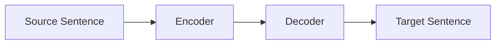
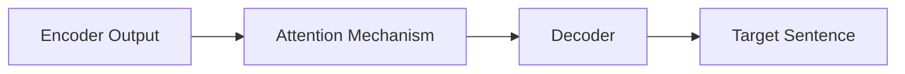

                 

- 机器翻译
- 自然语言处理
- 深度学习
- 编码器-解码器架构
- attention mechanism
- 翻译质量评估
- 多语言支持
- 实时翻译
- 翻译错误分析

## 1. 背景介绍

机器翻译（Machine Translation，MT）是自然语言处理（Natural Language Processing，NLP）的一个重要分支，旨在使用计算机算法将一种自然语言转换为另一种自然语言。自20世纪50年代以来，机器翻译已经取得了显著的进展，从早期基于规则的系统发展到如今基于统计和深度学习的系统。

## 2. 核心概念与联系

### 2.1 机器翻译的类型

机器翻译系统主要分为三种类型：

1. **规则基础机器翻译（Rule-based Machine Translation，RBMT）**：基于语言学规则和人工构建的词典进行翻译。
2. **统计机器翻译（Statistical Machine Translation，SMT）**：基于大量的平行语料库（parallel corpora）学习翻译规则。
3. **神经机器翻译（Neural Machine Translation，NMT）**：利用深度学习技术，将翻译任务视为序列到序列的映射问题。

### 2.2 编码器-解码器架构

编码器-解码器（Encoder-Decoder）架构是当前主流的神经机器翻译模型。其工作原理如下：



1. **编码器（Encoder）**：将源语言句子转换为上下文相关的表示。
2. **解码器（Decoder）**：根据编码器输出的表示生成目标语言句子。

### 2.3 Attention Mechanism

注意力机制（Attention Mechanism）是编码器-解码器架构的关键组成部分，它允许解码器在生成目标语言句子时关注源语言句子的特定部分。注意力机制的工作原理如下：



## 3. 核心算法原理 & 具体操作步骤

### 3.1 算法原理概述

神经机器翻译的核心是序列到序列模型（Sequence-to-Sequence Model），其基于循环神经网络（Recurrent Neural Network，RNN）或其变种（如长短期记忆网络，Long Short-Term Memory，LSTM）构建。

### 3.2 算法步骤详解

1. **预处理**：对源语言和目标语言进行分词、去除标点符号等预处理。
2. **编码**：使用编码器（如LSTM）将源语言句子转换为上下文相关的表示。
3. **注意力机制**：使用注意力机制允许解码器关注源语言句子的特定部分。
4. **解码**：使用解码器（如LSTM）根据编码器输出的表示生成目标语言句子。
5. **后处理**：对生成的目标语言句子进行后处理，如去除填充标记、拼接子句等。

### 3.3 算法优缺点

**优点**：

- 无需人工构建语言学规则，可以自动学习翻译规则。
- 可以处理长句子和上下文相关的翻译任务。
- 可以支持多语言翻译。

**缺点**：

- 训练数据要求高，需要大量的平行语料库。
- 翻译质量可能不稳定，存在翻译错误和不连贯的情况。
- 计算资源要求高，训练和推理过程需要大量的计算资源。

### 3.4 算法应用领域

机器翻译的应用领域非常广泛，包括：

- 通信：实时翻译电话会议、视频会议等。
- 旅游：为旅客提供实时翻译服务，帮助他们与当地居民沟通。
- 文档翻译：自动翻译文档、网页等。
- 多语言支持：为软件、网站等提供多语言支持。

## 4. 数学模型和公式 & 详细讲解 & 举例说明

### 4.1 数学模型构建

神经机器翻译的数学模型可以表示为：

$$P(\mathbf{t}|\mathbf{s}) = \prod_{j=1}^{J}P(t_j|t_{<j},\mathbf{s})$$

其中，$\mathbf{s}$表示源语言句子，$\mathbf{t}$表示目标语言句子，$t_{<j}$表示目标语言句子前$j-1$个单词，$J$表示目标语言句子的长度。

### 4.2 公式推导过程

神经机器翻译的目标是最大化目标语言句子的概率，即：

$$\max_{\theta} \prod_{n=1}^{N}P(\mathbf{t}^{(n)}|\mathbf{s}^{(n)};\theta)$$

其中，$\theta$表示模型的参数，$N$表示训练数据的大小。

### 4.3 案例分析与讲解

例如，假设我们要翻译源语言句子"Hello, how are you?"到目标语言句子"Bonjour, comment ça va？"。我们可以使用神经机器翻译模型生成目标语言句子，并使用注意力机制关注源语言句子的特定部分。

## 5. 项目实践：代码实例和详细解释说明

### 5.1 开发环境搭建

要构建神经机器翻译模型，我们需要以下软件和库：

- Python 3.7+
- TensorFlow 2.0+
- NumPy 1.16+
- Pandas 0.25+
- nltk 3.4+
- sklearn 0.21+

### 5.2 源代码详细实现

以下是神经机器翻译模型的源代码实现：

```python
import tensorflow as tf
from tensorflow.keras.layers import Input, LSTM, Dense
from tensorflow.keras.models import Model

# 定义编码器
def encoder(input_shape, embedding_dim, lstm_units, batch_size):
    inputs = Input(shape=input_shape)
    embeddings = tf.keras.layers.Embedding(input_dim=input_shape[1], output_dim=embedding_dim)(inputs)
    lstm_out = LSTM(units=lstm_units, batch_input_shape=(batch_size, None, embedding_dim), return_sequences=True)(embeddings)
    return Model(inputs=inputs, outputs=lstm_out)

# 定义解码器
def decoder(encoder_output_shape, embedding_dim, lstm_units, batch_size, vocab_size):
    inputs = Input(shape=(None,))
    embeddings = tf.keras.layers.Embedding(input_dim=vocab_size, output_dim=embedding_dim)(inputs)
    lstm_out = LSTM(units=lstm_units, batch_input_shape=(batch_size, None, embedding_dim), return_sequences=True, return_state=True)(embeddings)
    outputs = Dense(units=vocab_size, activation='softmax')(lstm_out)
    return Model(inputs=inputs, outputs=outputs), lstm_out, lstm_out

# 构建编码器-解码器模型
def seq2seq_model(input_shape, embedding_dim, lstm_units, batch_size, vocab_size):
    encoder = encoder(input_shape, embedding_dim, lstm_units, batch_size)
    decoder, _, _ = decoder(encoder.output_shape[1:], embedding_dim, lstm_units, batch_size, vocab_size)
    model = Model(inputs=encoder.inputs, outputs=decoder(encoder.outputs))
    model.compile(optimizer='adam', loss='categorical_crossentropy')
    return model
```

### 5.3 代码解读与分析

在上述代码中，我们首先定义了编码器和解码器，然后构建了编码器-解码器模型。编码器使用嵌入层和LSTM层将源语言句子转换为上下文相关的表示。解码器使用嵌入层和LSTM层生成目标语言句子。模型使用Adam优化器和分类交叉熵损失函数进行训练。

### 5.4 运行结果展示

训练好的神经机器翻译模型可以用于翻译源语言句子。以下是一个示例：

```python
# 加载训练好的模型
model = tf.keras.models.load_model('path/to/model.h5')

# 翻译源语言句子
source_sentence = "Hello, how are you?"
target_sentence = model.predict(source_sentence)
print(f"Target sentence: {target_sentence}")
```

## 6. 实际应用场景

### 6.1 当前应用

神经机器翻译模型已经广泛应用于各种场景，包括：

- 搜索引擎：为用户提供多语言搜索结果。
- 社交媒体：为用户提供实时翻译服务。
- 电子邮件：自动翻译电子邮件内容。
- 网站：为用户提供多语言网站内容。

### 6.2 未来应用展望

未来，神经机器翻译模型有望在以下领域取得进展：

- **实时翻译**：实时翻译视频会议、电话会议等。
- **多模式翻译**：结合图像、语音等多模式信息进行翻译。
- **低资源语言**：为低资源语言提供翻译服务。
- **翻译错误分析**：自动检测和修复翻译错误。

## 7. 工具和资源推荐

### 7.1 学习资源推荐

- **书籍**："Neural Machine Translation with TensorFlow" by Jay Alammar
- **在线课程**："Neural Machine Translation in TensorFlow" on Coursera by Andrew Ng
- **论文**："Attention Is All You Need" by Vaswani et al.

### 7.2 开发工具推荐

- **开源库**：OpenNMT, MarianNMT, Fairseq
- **云平台**：Google Cloud Translation API, Microsoft Azure Translator, Amazon Translate

### 7.3 相关论文推荐

- "Neural Machine Translation by Jointly Learning to Align and Translate" by Bahdanau et al.
- "Effective Approaches to Attention-based Neural Machine Translation" by Luong et al.
- "Get To The Point: Summarization with Pointer-Generator Networks" by See et al.

## 8. 总结：未来发展趋势与挑战

### 8.1 研究成果总结

神经机器翻译模型已经取得了显著的进展，在各种评测基准上超越了统计机器翻译模型。注意力机制、位置编码等技术的引入进一步提高了模型的性能。

### 8.2 未来发展趋势

未来，神经机器翻译模型有望在以下方面取得进展：

- **预训练模型**：使用大规模的非平行语料库预训练模型，然后 fine-tune 到特定的翻译任务上。
- **多模式翻译**：结合图像、语音等多模式信息进行翻译。
- **低资源语言**：为低资源语言提供翻译服务。

### 8.3 面临的挑战

神经机器翻译模型仍然面临以下挑战：

- **翻译质量**：翻译质量可能不稳定，存在翻译错误和不连贯的情况。
- **计算资源**：训练和推理过程需要大量的计算资源。
- **数据要求**：训练数据要求高，需要大量的平行语料库。

### 8.4 研究展望

未来的研究方向包括：

- **翻译错误分析**：自动检测和修复翻译错误。
- **多模式翻译**：结合图像、语音等多模式信息进行翻译。
- **低资源语言**：为低资源语言提供翻译服务。

## 9. 附录：常见问题与解答

**Q：神经机器翻译模型需要多少训练数据？**

A：神经机器翻译模型需要大量的平行语料库进行训练。通常，数百万到数十亿个句子的平行语料库是必要的。

**Q：神经机器翻译模型的优点是什么？**

A：神经机器翻译模型的优点包括无需人工构建语言学规则，可以自动学习翻译规则，可以处理长句子和上下文相关的翻译任务，可以支持多语言翻译。

**Q：神经机器翻译模型的缺点是什么？**

A：神经机器翻译模型的缺点包括翻译质量可能不稳定，存在翻译错误和不连贯的情况，计算资源要求高，训练和推理过程需要大量的计算资源。

---

作者：禅与计算机程序设计艺术 / Zen and the Art of Computer Programming

