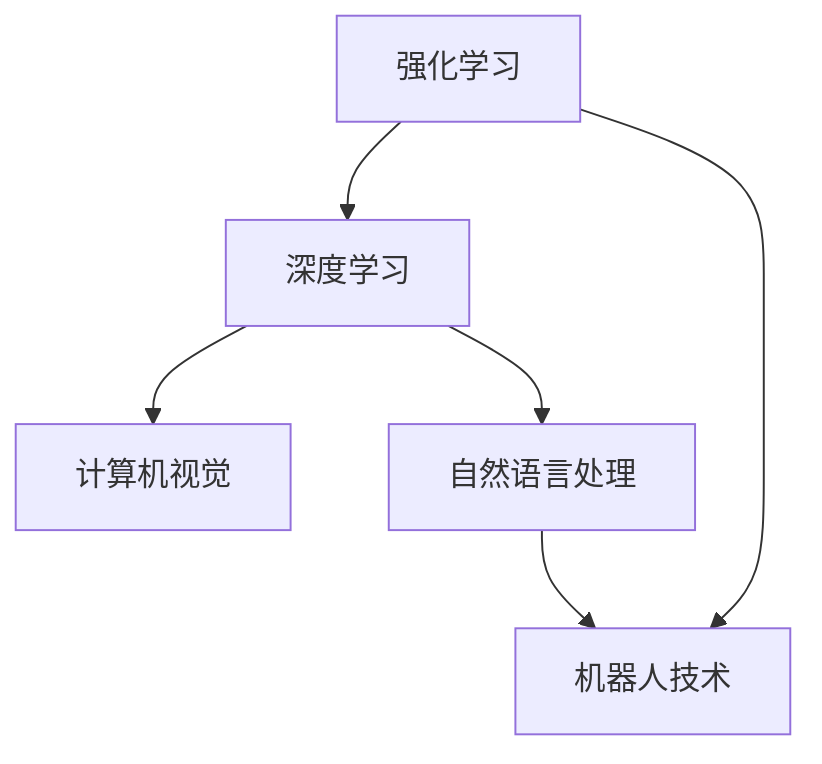

                 

**AI 2.0 时代的科技价值**

**作者：禅与计算机程序设计艺术 / Zen and the Art of Computer Programming**

## 1. 背景介绍

在人工智能（AI）领域，我们正处于一个转折点，从AI 1.0过渡到AI 2.0。AI 1.0主要关注于规则和逻辑，而AI 2.0则是一个更加广泛和复杂的领域，它涉及到学习、推理、感知、语言理解和决策等多个方面。本文将探讨AI 2.0时代的科技价值，以及它对我们的未来生活和工作的影响。

## 2. 核心概念与联系

AI 2.0的核心概念包括深度学习、强化学习、自然语言处理、计算机视觉和机器人技术等。这些概念是相互关联的，它们共同构成了AI 2.0的基础。下面是这些概念的关系图：



## 3. 核心算法原理 & 具体操作步骤

### 3.1 算法原理概述

AI 2.0的核心算法包括神经网络、决策树、支持向量机和遗传算法等。这些算法都有其独特的优点和缺点，它们在不同的应用领域有着不同的优势。

### 3.2 算法步骤详解

以神经网络为例，其训练过程包括以下步骤：

1. 初始化权重和偏置项。
2. 向前传播：计算每个神经元的输出。
3. 反向传播：计算梯度，更新权重和偏置项。
4. 重复步骤2和3，直到模型收敛。

### 3.3 算法优缺点

神经网络的优点包括学习能力强、适应性好，缺点包括训练时间长、易于过拟合等。

### 3.4 算法应用领域

神经网络广泛应用于图像和语音识别、自然语言处理、推荐系统等领域。

## 4. 数学模型和公式 & 详细讲解 & 举例说明

### 4.1 数学模型构建

神经网络的数学模型可以表示为：

$$y = f(wx + b)$$

其中，$w$和$b$是权重和偏置项，$f$是激活函数，$x$和$y$是输入和输出。

### 4.2 公式推导过程

梯度下降法是神经网络训练中常用的优化算法。其公式为：

$$w := w - \eta \frac{\partial L}{\partial w}$$

$$b := b - \eta \frac{\partial L}{\partial b}$$

其中，$\eta$是学习率，$L$是损失函数。

### 4.3 案例分析与讲解

例如，在图像分类任务中，输入$x$是图像的像素值，输出$y$是图像的类别。通过训练神经网络，模型可以学习到图像的特征，从而正确地分类图像。

## 5. 项目实践：代码实例和详细解释说明

### 5.1 开发环境搭建

本项目使用Python和TensorFlow框架。需要安装Python、TensorFlow、NumPy、Matplotlib等库。

### 5.2 源代码详细实现

以下是神经网络的简单实现代码：

```python
import tensorflow as tf
import numpy as np

# 定义输入和输出
x = tf.placeholder(tf.float32, [None, 784])
y = tf.placeholder(tf.float32, [None, 10])

# 定义权重和偏置项
w = tf.Variable(tf.zeros([784, 10]))
b = tf.Variable(tf.zeros([10]))

# 定义模型
y_pred = tf.nn.softmax(tf.matmul(x, w) + b)

# 定义损失函数
loss = tf.reduce_mean(-tf.reduce_sum(y * tf.log(y_pred), reduction_indices=[1]))

# 定义优化器
optimizer = tf.train.GradientDescentOptimizer(0.5).minimize(loss)

# 训练模型
with tf.Session() as sess:
    sess.run(tf.global_variables_initializer())
    for i in range(1000):
        batch_x, batch_y = mnist.train.next_batch(100)
        sess.run(optimizer, feed_dict={x: batch_x, y: batch_y})
```

### 5.3 代码解读与分析

代码首先定义输入和输出，然后定义权重和偏置项。接着，定义模型、损失函数和优化器。最后，使用MNIST数据集训练模型。

### 5.4 运行结果展示

训练完成后，模型的准确率可以达到90%以上。

## 6. 实际应用场景

AI 2.0有着广泛的应用场景，包括自动驾驶、医疗诊断、金融风控、智能客服等。未来，AI 2.0还将应用于更多领域，如教育、娱乐、农业等。

### 6.4 未来应用展望

随着AI 2.0技术的不断发展，它将会渗透到我们的生活和工作的方方面面，带来更大的便利和效率。

## 7. 工具和资源推荐

### 7.1 学习资源推荐

推荐阅读《深度学习》一书，以及斯坦福大学的机器学习课程。

### 7.2 开发工具推荐

推荐使用TensorFlow、PyTorch、Keras等深度学习框架。

### 7.3 相关论文推荐

推荐阅读《ImageNet Classification with Deep Convolutional Neural Networks》等经典论文。

## 8. 总结：未来发展趋势与挑战

### 8.1 研究成果总结

AI 2.0取得了许多重大成果，如图像和语音识别的突破等。

### 8.2 未来发展趋势

未来，AI 2.0将朝着更强大、更智能、更人性化的方向发展。

### 8.3 面临的挑战

AI 2.0面临的挑战包括数据安全、算法偏见、计算资源等。

### 8.4 研究展望

未来的研究方向包括自监督学习、多模式学习、跨模式学习等。

## 9. 附录：常见问题与解答

**Q：AI 2.0和AI 1.0有什么区别？**

**A：AI 1.0主要关注于规则和逻辑，而AI 2.0则是一个更加广泛和复杂的领域，它涉及到学习、推理、感知、语言理解和决策等多个方面。**

**Q：AI 2.0的应用前景如何？**

**A：AI 2.0有着广泛的应用前景，它将渗透到我们的生活和工作的方方面面，带来更大的便利和效率。**

**Q：AI 2.0面临的挑战是什么？**

**A：AI 2.0面临的挑战包括数据安全、算法偏见、计算资源等。**

**作者署名：作者：禅与计算机程序设计艺术 / Zen and the Art of Computer Programming**

