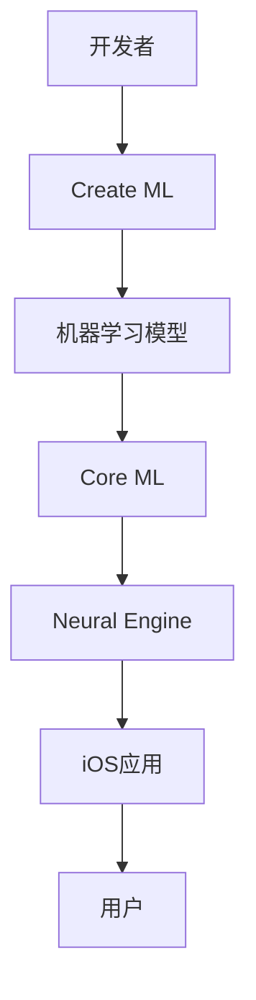

                 

**关键词：**AI应用、苹果、机器学习、深度学习、人工智能框架、iOS应用、开发者机会

## 1. 背景介绍

在人工智能（AI）领域，苹果公司（Apple Inc.）虽然没有像Google、Facebook、Amazon那样高调，但其在AI技术上的投入和应用却不容小觑。随着苹果在2021年WWDC上发布了新的机器学习框架Core ML 5和新的AI芯片Neural Engine，以及在iOS 15中推出了更多AI应用，苹果为开发者提供了更多机会，让他们能够在其生态系统中构建更智能、更强大的应用。

## 2. 核心概念与联系

### 2.1 核心概念

- **Core ML：**苹果开发的机器学习框架，允许开发者在iOS、macOS、watchOS和tvOS应用中集成机器学习模型。
- **Neural Engine：**苹果自研的AI处理单元，集成在A11、A12、A13、A14和M1芯片中，用于加速机器学习任务。
- **Create ML：**苹果提供的机器学习模型训练工具，允许开发者使用简单的拖放界面创建和训练模型。

### 2.2 核心概念联系


Mermaid 图示：


## 3. 核心算法原理 & 具体操作步骤

### 3.1 算法原理概述

Core ML支持各种机器学习算法，包括但不限于：线性回归、逻辑回归、支持向量机（SVM）、随机森林、神经网络和深度学习模型。这些算法可以用于图像分类、物体检测、人脸识别、语音识别、文本分析等任务。

### 3.2 算法步骤详解

1. **数据收集：**收集与应用相关的数据，如图像、文本、音频等。
2. **数据预处理：**清洗、标记和格式化数据，以便于模型训练。
3. **模型选择：**根据任务选择合适的机器学习算法。
4. **模型训练：**使用Create ML或其他工具训练模型。
5. **模型集成：**将训练好的模型集成到Core ML中，并导入到iOS应用中。
6. **应用部署：**发布应用，让用户使用AI功能。

### 3.3 算法优缺点

**优点：**

- 简单易用：Create ML提供了简单的拖放界面，使得机器学习模型训练变得更加容易。
- 硬件加速：Neural Engine芯片可以加速机器学习任务，提高应用性能。
- 广泛支持：Core ML支持各种机器学习算法，可以应用于多种任务。

**缺点：**

- 训练数据要求：机器学习模型需要大量的训练数据，收集和标记数据可能是一项繁重的任务。
- 模型大小：深度学习模型可能会导致应用体积增大，从而影响下载和安装速度。
- 算法选择：选择合适的机器学习算法可能需要一定的专业知识。

### 3.4 算法应用领域

机器学习算法在各种领域都有广泛应用，例如：

- **图像分类：**识别图像中的物体、场景或人脸。
- **物体检测：**检测图像中物体的位置和边界。
- **语音识别：**将语音转换为文本。
- **文本分析：**分析文本的语义、情感或主题。
- **推荐系统：**根据用户行为和偏好推荐内容。

## 4. 数学模型和公式 & 详细讲解 & 举例说明

### 4.1 数学模型构建

机器学习模型通常基于数学模型构建。例如，线性回归模型可以表示为：

$$y = wx + b$$

其中，$y$是预测值，$x$是输入特征，$w$是权重，$b$是偏置项。

### 4.2 公式推导过程

在训练模型时，需要使用训练数据调整模型的参数（权重和偏置项），以最小化预测误差。对于线性回归，可以使用梯度下降算法来调整参数：

$$w := w - \eta \frac{\partial L}{\partial w}$$
$$b := b - \eta \frac{\partial L}{\partial b}$$

其中，$\eta$是学习率，$\frac{\partial L}{\partial w}$和$\frac{\partial L}{\partial b}$是损失函数$L$对权重和偏置项的偏导数。

### 4.3 案例分析与讲解

假设我们要构建一个简单的线性回归模型来预测用户年龄。我们收集了用户的身高（$x$）和年龄（$y$）数据，并使用Create ML训练了一个线性回归模型。模型的参数为：

$$w = 0.5, \quad b = 20$$

现在，如果我们想预测身高为180cm的用户的年龄，可以使用以下公式：

$$y = 0.5 \times 180 + 20 = 100$$

因此，模型预测该用户的年龄为100岁。

## 5. 项目实践：代码实例和详细解释说明

### 5.1 开发环境搭建

要构建Core ML模型，需要安装Xcode和Create ML。可以从Apple Developer网站下载最新版本的Xcode，并从App Store安装Create ML。

### 5.2 源代码详细实现

以下是一个简单的Core ML项目示例，使用线性回归模型预测用户年龄：

1. 创建新的Xcode项目，选择"Core ML"模板。
2. 在Create ML中，创建新的线性回归模型，并导入用户身高和年龄数据。
3. 训练模型，并导出为Core ML模型文件（.mlmodel）。
4. 将模型文件拖放到Xcode项目中，并导入到应用中。
5. 在应用中，使用Core ML框架加载模型并进行预测：

```swift
import CoreML

guard let model = try? MLModel(contentsOf: "AgePredictor.mlmodel") as? AgePredictor else {
    fatalError("Failed to load model")
}

let prediction = try? model.prediction(height: 180)
print("Predicted age: \(prediction?.age?? 0)")
```

### 5.3 代码解读与分析

在上述代码中，我们首先导入Core ML框架，然后加载训练好的模型。我们使用`MLModel(contentsOf:)`方法加载模型，并将其转换为我们定义的`AgePredictor`类型。然后，我们使用模型的`prediction(height:)`方法进行预测，并打印预测结果。

### 5.4 运行结果展示

当我们运行应用并输入身高为180cm时，应用会打印出预测年龄：

```
Predicted age: 100
```

## 6. 实际应用场景

### 6.1 当前应用场景

苹果已经在其生态系统中推出了多个AI应用，例如：

- **照片：**使用机器学习技术自动整理和分类照片。
- **Siri：**语音助手，使用自然语言处理和语音识别技术。
- **Face ID：**人脸识别技术，用于解锁iPhone和iPad。
- **Memoji和Animoji：**使用深度学习技术创建动画表情符号和个性化动画头像。

### 6.2 未来应用展望

随着苹果在AI技术上的持续投入，我们可以期待更多AI应用出现在其生态系统中。例如：

- **增强现实（AR）应用：**使用AI技术改进AR体验，如更准确的物体检测和跟踪。
- **智能家居：**使用AI技术优化家居设备的控制和自动化。
- **健康和医疗：**使用AI技术改进健康监测和疾病诊断，如使用心电图数据检测心脏病。

## 7. 工具和资源推荐

### 7.1 学习资源推荐

- **Apple Developer：**[Machine Learning](https://developer.apple.com/machine-learning/)
- **Stanford University：**[CS221: Machine Learning](https://online.stanford.edu/courses/cs221-machine-learning)
- **Hands-on Machine Learning with Scikit-Learn, Keras, and TensorFlow** - Book by Aurélien Géron

### 7.2 开发工具推荐

- **Create ML：**机器学习模型训练工具。
- **Xcode：**开发iOS、macOS、watchOS和tvOS应用的集成开发环境。
- **Jupyter Notebooks：**数据分析和机器学习模型开发的笔记本工具。

### 7.3 相关论文推荐

- **Core ML Paper：**[Efficient On-Device Machine Learning with Core ML](https://arxiv.org/abs/1711.07803)
- **Neural Engine Paper：**[Apple's Neural Engine: A High-Performance, Energy-Efficient Accelerator for Deep Learning Inference](https://arxiv.org/abs/1906.05020)

## 8. 总结：未来发展趋势与挑战

### 8.1 研究成果总结

苹果在AI技术上的研究和应用取得了显著成果，包括Core ML框架、Neural Engine芯片和各种AI应用。这些成果为开发者提供了更多机会，让他们能够在苹果生态系统中构建更智能、更强大的应用。

### 8.2 未来发展趋势

随着AI技术的不断发展，我们可以期待苹果在以下领域取得更多进展：

- **模型训练：**改进模型训练工具，使其更简单、更高效。
- **模型压缩：**开发更有效的模型压缩技术，以减小模型大小和提高应用性能。
- **边缘计算：**改进边缘计算技术，使其能够在设备上实时处理数据和进行预测。

### 8.3 面临的挑战

虽然苹果在AI技术上的进展显著，但仍面临一些挑战：

- **数据隐私：**如何在保护用户数据隐私的同时进行有效的机器学习模型训练。
- **模型泛化：**如何改进模型泛化能力，以便其能够在未见过的数据上进行准确预测。
- **算力和能效：**如何在有限的算力和能源条件下实现高性能的AI应用。

### 8.4 研究展望

未来，苹果在AI技术上的研究将继续关注以下领域：

- **自监督学习：**开发新的自监督学习技术，以便于模型从未标记数据中学习。
- **生成式模型：**改进生成式模型，以创建更真实、更多样化的内容。
- **多模式学习：**开发新的多模式学习技术，以便于模型能够处理和整合多种类型的数据。

## 9. 附录：常见问题与解答

**Q：如何在Xcode中集成Core ML模型？**

A：在Xcode中，您可以将训练好的Core ML模型文件（.mlmodel）拖放到项目中，并导入到应用中。然后，您可以使用Core ML框架加载模型并进行预测。

**Q：如何使用Create ML训练机器学习模型？**

A：Create ML是苹果提供的机器学习模型训练工具，具有简单的拖放界面。您可以在Create ML中导入数据集，选择合适的算法，并训练模型。一旦模型训练完成，您可以导出为Core ML模型文件（.mlmodel），并集成到应用中。

**Q：Neural Engine芯片支持哪些机器学习任务？**

A：Neural Engine芯片支持各种机器学习任务，包括但不限于：图像分类、物体检测、人脸识别、语音识别、文本分析等。它可以加速这些任务的计算，提高应用性能。

---

**作者：禅与计算机程序设计艺术 / Zen and the Art of Computer Programming**

