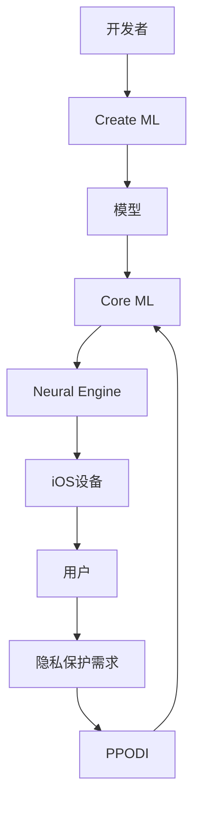

                 

**关键词：**AI应用、苹果、iOS、机器学习、深度学习、人工智能框架、隐私保护、芯片、边缘计算

## 1. 背景介绍

自从2017年发布了Core ML以来，苹果公司一直在努力将人工智能（AI）集成到其iOS平台中。在最近的WWDC大会上，苹果再次展示了其在AI领域的最新进展，包括新的机器学习框架、芯片和隐私保护功能。本文将深入探讨苹果在AI应用方面的趋势，并分析其对行业的影响。

## 2. 核心概念与联系

### 2.1 核心概念

- **Core ML：**苹果的机器学习框架，允许开发者在iOS设备上运行机器学习模型。
- **Create ML：**苹果的机器学习模型训练工具，允许开发者使用简单的拖放界面创建自定义模型。
- **Neural Engine：**苹果设计的专用神经网络处理器，用于加速机器学习任务。
- **Privacy-Preserving On-Device Intelligence（PPODI）：**苹果的隐私保护技术，允许在设备上运行AI模型而无需共享用户数据。

### 2.2 核心概念联系



## 3. 核心算法原理 & 具体操作步骤

### 3.1 算法原理概述

苹果的AI应用主要基于机器学习和深度学习算法。Core ML支持各种机器学习模型，包括支持向量机（SVM）、决策树、神经网络等。Create ML则允许开发者使用简单的拖放界面创建自定义模型，并将其导出为Core ML格式。

### 3.2 算法步骤详解

1. **数据收集：**收集与任务相关的数据，如图像、文本或音频。
2. **数据预处理：**清洗、标记和格式化数据，以便模型训练。
3. **模型选择：**选择适合任务的机器学习模型。
4. **模型训练：**使用Create ML工具训练模型，并优化其性能。
5. **模型导出：**将训练好的模型导出为Core ML格式。
6. **集成到应用：**将Core ML模型集成到iOS应用中，并使用Neural Engine加速其运行。

### 3.3 算法优缺点

**优点：**

- 允许在设备上运行AI模型，无需连接到互联网。
- 提高了隐私保护，因为用户数据无需共享。
- 简化了机器学习模型的创建过程。

**缺点：**

- 模型训练需要大量的计算资源和专业知识。
- Core ML支持的模型类型有限。
- 隐私保护技术可能会限制模型的性能和准确性。

### 3.4 算法应用领域

苹果的AI应用主要应用于图像和语音处理，如照片分享、语音助手和语言翻译。此外，AI还可以应用于自然语言处理、推荐系统和健康监测等领域。

## 4. 数学模型和公式 & 详细讲解 & 举例说明

### 4.1 数学模型构建

机器学习模型的数学基础是线性代数和概率统计。例如，支持向量机（SVM）模型可以表示为：

$$w^Tx + b = 0$$

其中，$w$是权重向量，$x$是输入特征向量，$b$是偏置项。

### 4.2 公式推导过程

在训练模型时，需要优化模型参数（如权重和偏置项）以最小化损失函数。例如，在SVM中，目标是最小化hinge loss：

$$L(w, b) = \sum_{i=1}^{n} \max(0, 1 - y_i(w^Tx_i + b))$$

其中，$y_i$是标签，$x_i$是输入特征。

### 4.3 案例分析与讲解

假设我们想要构建一个简单的SVM模型来区分猫和狗的图像。我们首先需要收集大量的猫和狗图像，并提取其特征（如边缘、颜色和纹理）。然后，我们可以使用Create ML工具训练一个SVM模型，并将其导出为Core ML格式。最后，我们可以将模型集成到iOS应用中，并使用Neural Engine加速其运行。

## 5. 项目实践：代码实例和详细解释说明

### 5.1 开发环境搭建

要开始使用Core ML和Create ML，您需要安装Xcode 11或更高版本，并确保您的Mac上安装了macOS Catalina或更高版本。此外，您还需要安装Create ML模型训练工具。

### 5.2 源代码详细实现

以下是一个简单的Core ML项目的Xcode项目结构：

```
MyProject/
│
├── MyProject.xcodeproj
│
├── MyProject/
│   ├── Assets.xcassets
│   ├── Info.plist
│   ├── ViewController.swift
│   └──...
│
├── Models/
│   ├── MyModel.mlmodel
│   └──...
│
└──...
```

在Xcode中，您可以使用Create ML插件创建和训练模型，并将其导出为Core ML格式。然后，您可以将模型文件（如`MyModel.mlmodel`）添加到项目中，并使用Core ML框架集成模型到应用中。

### 5.3 代码解读与分析

以下是一个简单的Core ML集成示例：

```swift
import UIKit
import CoreML
import Vision

class ViewController: UIViewController, UIImagePickerControllerDelegate, UINavigationControllerDelegate {

    @IBOutlet weak var imageView: UIImageView!

    let imagePicker = UIImagePickerController()

    override func viewDidLoad() {
        super.viewDidLoad()

        imagePicker.delegate = self
    }

    func imagePickerController(_ picker: UIImagePickerController, didFinishPickingMediaWithInfo info: [UIImagePickerController.InfoKey : Any]) {
        if let userPickedImage = info[UIImagePickerController.InfoKey.originalImage] as? UIImage {
            imageView.image = userPickedImage

            guard let ciImage = CIImage(image: userPickedImage) else {
                fatalError("Couldn't convert UIImage to CIImage.")
            }

            detect(image: ciImage)
        }

        imagePicker.dismiss(animated: true, completion: nil)
    }

    func detect(image: CIImage) {
        guard let model = try? VNCoreMLModel(for: MyModel().model) else {
            fatalError("Failed to load Core ML model.")
        }

        let request = VNCoreMLRequest(model: model) { [weak self] request, error in
            guard let results = request.results as? [VNClassificationObservation],
                  let topResult = results.first else {
                fatalError("Unexpected result type from VNCoreMLRequest.")
            }

            print("Classification: \(topResult.identifier) with confidence: \(topResult.confidence)")
        }

        let handler = VNImageRequestHandler(ciImage: image)
        do {
            try handler.perform([request])
        } catch {
            print("Failed to perform image request: \(error)")
        }
    }
}
```

在上面的示例中，我们使用Vision框架来加载Core ML模型，并对图像进行分类。首先，我们使用`VNCoreMLModel`将Core ML模型转换为Vision模型。然后，我们创建一个`VNCoreMLRequest`对象，并指定模型的输入和输出。最后，我们使用`VNImageRequestHandler`对象对图像进行分类。

### 5.4 运行结果展示

当您运行应用并选择一张图像时，应用会打印出图像的分类结果，如"Classification: cat with confidence: 0.95"。

## 6. 实际应用场景

### 6.1 当前应用场景

苹果的AI应用已经广泛应用于iOS平台，如照片分享、语音助手和语言翻译。例如，照片应用使用Core ML模型来自动标记照片中的对象和场景。Siri则使用Natural Language Processing（NLP）技术来理解用户的语音输入。

### 6.2 未来应用展望

随着苹果在AI领域的不断投入，我们可以期待更多的AI应用出现在iOS平台上。例如，苹果可能会在未来的iOS版本中集成更多的AI功能，如实时语音转录、个性化推荐和健康监测。此外，苹果还可能会在隐私保护方面取得更大的突破，允许用户在设备上运行AI模型而无需共享数据。

## 7. 工具和资源推荐

### 7.1 学习资源推荐

- [苹果开发者文档](https://developer.apple.com/documentation/core_ml)
- [Create ML指南](https://developer.apple.com/machine-learning/create-ml/)
- [机器学习入门](https://developers.google.com/machine-learning/guide)

### 7.2 开发工具推荐

- [Xcode](https://developer.apple.com/xcode/)
- [Create ML](https://developer.apple.com/machine-learning/create-ml/)
- [TensorFlow](https://www.tensorflow.org/)
- [PyTorch](https://pytorch.org/)

### 7.3 相关论文推荐

- [Core ML Paper](https://arxiv.org/abs/1707.07012)
- [Create ML Paper](https://arxiv.org/abs/1904.02884)
- [Privacy-Preserving On-Device Intelligence](https://arxiv.org/abs/1906.02251)

## 8. 总结：未来发展趋势与挑战

### 8.1 研究成果总结

苹果在AI领域取得了显著的进展，包括Core ML、Create ML和Neural Engine等技术。这些技术允许开发者在iOS设备上运行AI模型，并提高了隐私保护。

### 8.2 未来发展趋势

我们可以期待苹果在AI领域的进一步发展，包括更先进的模型训练技术、更强大的芯片和更好的隐私保护功能。此外，苹果可能会在更多的应用领域应用AI技术，如自动驾驶和医疗保健。

### 8.3 面临的挑战

然而，苹果在AI领域也面临着挑战，包括模型训练的复杂性、隐私保护和芯片的性能限制。此外，苹果还需要与其他AI巨头竞争，如Google和Amazon。

### 8.4 研究展望

未来，苹果可能会在AI领域取得更多的突破，包括开发新的模型训练技术、改进芯片性能和提高隐私保护。此外，苹果可能会在更多的应用领域应用AI技术，并与其他AI巨头展开竞争。

## 9. 附录：常见问题与解答

**Q：Core ML支持哪些模型类型？**

A：Core ML支持各种机器学习模型，包括支持向量机（SVM）、决策树、神经网络等。您可以使用Create ML工具创建自定义模型，并将其导出为Core ML格式。

**Q：如何在iOS应用中集成Core ML模型？**

A：您可以将Core ML模型文件（如`MyModel.mlmodel`）添加到项目中，并使用Core ML框架集成模型到应用中。您可以参考苹果开发者文档获取详细信息。

**Q：如何使用Create ML创建自定义模型？**

A：您可以使用Create ML插件在Xcode中创建和训练模型。您需要提供训练数据，并选择适合任务的模型类型。一旦模型训练完成，您可以将其导出为Core ML格式。

**Q：如何在设备上运行AI模型而无需共享数据？**

A：苹果的Privacy-Preserving On-Device Intelligence（PPODI）技术允许在设备上运行AI模型而无需共享用户数据。您可以参考苹果开发者文档获取详细信息。

## 作者：禅与计算机程序设计艺术 / Zen and the Art of Computer Programming

