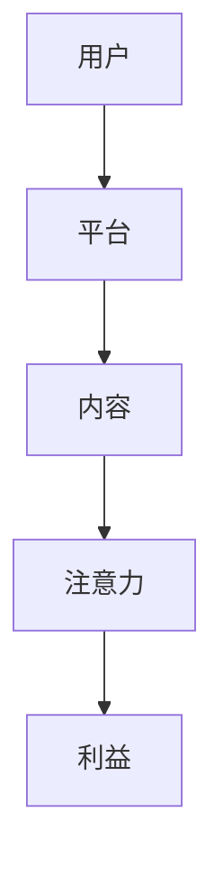

                 

## 关键词

- 注意力经济 (Attention Economy)
- 信息安全 (Information Security)
- 机器学习 (Machine Learning)
- 深度学习 (Deep Learning)
- 计算机视觉 (Computer Vision)
- 自然语言处理 (Natural Language Processing)
- 网络安全 (Network Security)

## 1. 背景介绍

在当今信息爆炸的时代，注意力成为一种稀缺资源，这导致了注意力经济的崛起。互联网平台、社交媒体和搜索引擎等都在竞争用户的注意力，以此来获取利益。然而，这种注意力经济也带来了信息安全的挑战。本文将深入探讨注意力经济背景下的信息安全问题，并提供解决方案。

## 2. 核心概念与联系

### 2.1 注意力经济

注意力经济是指在信息过载的情况下，企业和组织竞争用户注意力的经济模式。用户的注意力是有限的，因此企业需要通过各种手段，如个性化推荐、算法feed等，来吸引和保持用户的注意力。



### 2.2 信息安全

信息安全是指保护信息资产免受未授权访问、使用、披露、破坏、扣留或未经授权的更改的能力。在注意力经济中，信息安全面临着新的挑战，因为用户的注意力数据和行为数据等敏感信息需要被收集、存储和分析。

## 3. 核心算法原理 & 具体操作步骤

### 3.1 算法原理概述

在注意力经济中，机器学习算法，特别是深度学习算法，被广泛应用于个性化推荐、内容生成和用户行为预测等领域。这些算法需要大量的用户数据来训练，包括用户的注意力数据和行为数据。

### 3.2 算法步骤详解

1. 数据收集：收集用户的注意力数据和行为数据，如点击、滚动、停留时间等。
2. 特征工程：提取数据中的特征，如用户特征、内容特征和上下文特征等。
3. 模型训练：使用机器学习算法，如深度学习算法，来训练模型，预测用户的注意力和行为。
4. 模型部署：将模型部署到生产环境中，实时预测用户的注意力和行为，并提供个性化推荐和内容生成等服务。

### 3.3 算法优缺点

优点：

* 个性化推荐：算法可以根据用户的注意力和行为数据，提供个性化的推荐服务。
* 内容生成：算法可以根据用户的注意力和行为数据，生成吸引用户的内容。
* 用户行为预测：算法可以预测用户的注意力和行为，帮助企业做出决策。

缺点：

* 数据依赖：算法需要大量的用户数据来训练，如果数据不足或不准确，会影响算法的性能。
* 算法偏见：算法可能会受到数据偏见的影响，导致个性化推荐和内容生成等服务存在偏见。
* 隐私保护：收集和使用用户的注意力数据和行为数据可能会侵犯用户的隐私。

### 3.4 算法应用领域

注意力经济中的信息安全问题涉及多个领域，包括：

* 计算机视觉：用于分析用户的注意力数据，如眼动数据和面部表情数据等。
* 自然语言处理：用于分析用户的注意力数据，如文本数据和语音数据等。
* 网络安全：用于保护用户的注意力数据和行为数据免受未授权访问、使用、披露、破坏、扣留或未经授权的更改。

## 4. 数学模型和公式 & 详细讲解 & 举例说明

### 4.1 数学模型构建

在注意力经济中，用户的注意力和行为可以被建模为一个序列数据问题。序列数据是指数据在时间维度上是有序的，如用户的点击序列和滚动序列等。因此，可以使用序列建模技术，如循环神经网络（RNN）和长短期记忆网络（LSTM），来建模用户的注意力和行为。

### 4.2 公式推导过程

假设用户的注意力和行为数据可以表示为一个序列 $\{x_1, x_2,..., x_T\}$, 其中 $x_t$ 表示时间 $t$ 的注意力和行为数据。使用 LSTM 来建模用户的注意力和行为，可以得到以下公式：

$$h_t = LSTM(x_t, h_{t-1})$$

其中，$h_t$ 表示时间 $t$ 的隐藏状态，$h_{t-1}$ 表示时间 $t-1$ 的隐藏状态，$LSTM$ 表示长短期记忆网络。

### 4.3 案例分析与讲解

例如，可以使用 LSTM 来建模用户的点击序列，预测用户的下一个点击。假设用户的点击序列为 $\{c_1, c_2,..., c_T\}$, 其中 $c_t$ 表示时间 $t$ 的点击。使用 LSTM 来建模用户的点击序列，可以得到以下公式：

$$p(c_{t+1} | c_1, c_2,..., c_T) = softmax(W_h h_T + b)$$

其中，$p(c_{t+1} | c_1, c_2,..., c_T)$ 表示用户下一个点击的概率，$W_h$ 表示权重矩阵，$b$ 表示偏置向量，$h_T$ 表示时间 $T$ 的隐藏状态。

## 5. 项目实践：代码实例和详细解释说明

### 5.1 开发环境搭建

在开始项目实践之前，需要搭建开发环境。推荐使用 Python 和 TensorFlow 来实现注意力经济中的信息安全算法。首先，需要安装 Python 和 TensorFlow。然后，需要安装其他必要的库，如 NumPy、Pandas、Matplotlib 和 Scikit-learn 等。

### 5.2 源代码详细实现

以下是使用 Python 和 TensorFlow 实现 LSTM 来建模用户点击序列的源代码示例：

```python
import numpy as np
import tensorflow as tf
from tensorflow.keras.models import Sequential
from tensorflow.keras.layers import LSTM, Dense

# 定义 LSTM 模型
def build_model():
    model = Sequential()
    model.add(LSTM(128, input_shape=(None, 1)))
    model.add(Dense(10, activation='softmax'))
    model.compile(loss='categorical_crossentropy', optimizer='adam')
    return model

# 加载数据
def load_data():
    # 从文件中加载用户点击序列数据
    # 这里省略了数据加载的具体实现
    pass

# 训练模型
def train_model(model, X_train, y_train):
    model.fit(X_train, y_train, epochs=10, batch_size=32)

# 预测下一个点击
def predict_next_click(model, X_test):
    y_pred = model.predict(X_test)
    return np.argmax(y_pred, axis=1)

# 主函数
def main():
    # 加载数据
    X_train, y_train, X_test = load_data()

    # 定义 LSTM 模型
    model = build_model()

    # 训练模型
    train_model(model, X_train, y_train)

    # 预测下一个点击
    y_pred = predict_next_click(model, X_test)

    # 打印预测结果
    print(y_pred)

if __name__ == '__main__':
    main()
```

### 5.3 代码解读与分析

在源代码中，首先定义了 LSTM 模型，然后加载了用户点击序列数据。接着，使用 `fit` 方法训练模型，并使用 `predict` 方法预测下一个点击。最后，打印预测结果。

### 5.4 运行结果展示

运行源代码后，可以得到用户下一个点击的预测结果。预测结果是一个数组，其中每个元素表示用户下一个点击的类别。

## 6. 实际应用场景

### 6.1 个性化推荐

在注意力经济中，个性化推荐是一个关键应用场景。个性化推荐可以根据用户的注意力和行为数据，提供个性化的推荐服务。例如，可以使用 LSTM 来建模用户的点击序列，预测用户的下一个点击，并提供个性化的推荐服务。

### 6.2 内容生成

内容生成是另一个关键应用场景。内容生成可以根据用户的注意力和行为数据，生成吸引用户的内容。例如，可以使用 LSTM 来建模用户的注意力数据，预测用户的注意力分布，并生成吸引用户的内容。

### 6.3 网络安全

注意力经济中的信息安全问题也涉及网络安全领域。网络安全需要保护用户的注意力数据和行为数据免受未授权访问、使用、披露、破坏、扣留或未经授权的更改。例如，可以使用加密技术来保护用户的注意力数据和行为数据。

### 6.4 未来应用展望

随着注意力经济的发展，信息安全问题也将面临新的挑战。未来，需要开发新的算法和技术来保护用户的注意力数据和行为数据。例如，可以使用联邦学习技术来保护用户的注意力数据和行为数据，并实现个性化推荐和内容生成等服务。

## 7. 工具和资源推荐

### 7.1 学习资源推荐

* "Attention Is All You Need" 论文：<https://arxiv.org/abs/1706.03762>
* "Deep Learning" 书籍：<https://www.deeplearningbook.org/>
* "Hands-On Machine Learning with Scikit-Learn, Keras, and TensorFlow" 书籍：<https://www.oreilly.com/library/view/hands-on-machine-learning/9781492032632/>

### 7.2 开发工具推荐

* Python：<https://www.python.org/>
* TensorFlow：<https://www.tensorflow.org/>
* Jupyter Notebook：<https://jupyter.org/>

### 7.3 相关论文推荐

* "A Survey of Attention Mechanisms in Deep Learning" 论文：<https://arxiv.org/abs/1806.01269>
* "Deep Learning for Recommender Systems" 论文：<https://arxiv.org/abs/1706.06978>
* "A Survey on Deep Learning for Network Intrusion Detection" 论文：<https://ieeexplore.ieee.org/document/8454063>

## 8. 总结：未来发展趋势与挑战

### 8.1 研究成果总结

本文介绍了注意力经济中的信息安全问题，并提供了解决方案。通过使用机器学习算法，特别是深度学习算法，可以建模用户的注意力和行为数据，实现个性化推荐和内容生成等服务。同时，也需要考虑信息安全问题，保护用户的注意力数据和行为数据。

### 8.2 未来发展趋势

未来，注意力经济中的信息安全问题将面临新的挑战。需要开发新的算法和技术来保护用户的注意力数据和行为数据。例如，可以使用联邦学习技术来保护用户的注意力数据和行为数据，并实现个性化推荐和内容生成等服务。

### 8.3 面临的挑战

面临的挑战包括：

* 数据隐私：收集和使用用户的注意力数据和行为数据可能会侵犯用户的隐私。
* 数据偏见：算法可能会受到数据偏见的影响，导致个性化推荐和内容生成等服务存在偏见。
* 算法解释性：深度学习算法缺乏解释性，难以理解算法的决策过程。

### 8.4 研究展望

未来的研究方向包括：

* 开发新的算法和技术来保护用户的注意力数据和行为数据。
* 研究算法偏见的原因和解决方案。
* 研究深度学习算法的解释性，开发新的解释性算法。

## 9. 附录：常见问题与解答

**Q1：什么是注意力经济？**

A1：注意力经济是指在信息过载的情况下，企业和组织竞争用户注意力的经济模式。

**Q2：什么是信息安全？**

A2：信息安全是指保护信息资产免受未授权访问、使用、披露、破坏、扣留或未经授权的更改的能力。

**Q3：什么是机器学习？**

A3：机器学习是指一种人工智能技术，它使计算机有能力学习而无需被明确编程。

**Q4：什么是深度学习？**

A4：深度学习是指一种机器学习技术，它使用神经网络模型来模拟人类大脑的学习过程。

**Q5：什么是计算机视觉？**

A5：计算机视觉是指一种人工智能技术，它使计算机能够理解和分析视觉内容。

**Q6：什么是自然语言处理？**

A6：自然语言处理是指一种人工智能技术，它使计算机能够理解、分析和生成人类语言。

**Q7：什么是网络安全？**

A7：网络安全是指保护网络和信息系统免受未授权访问、使用、披露、破坏、扣留或未经授权的更改的能力。

**Q8：什么是循环神经网络（RNN）？**

A8：循环神经网络（RNN）是指一种神经网络模型，它使用循环单元来处理序列数据。

**Q9：什么是长短期记忆网络（LSTM）？**

A9：长短期记忆网络（LSTM）是指一种循环神经网络模型，它使用长短期记忆单元来处理序列数据。

**Q10：什么是序列数据？**

A10：序列数据是指数据在时间维度上是有序的，如用户的点击序列和滚动序列等。

**Q11：什么是联邦学习？**

A11：联邦学习是指一种机器学习技术，它允许多个机构协作训练机器学习模型，而无需共享其本地数据。

**Q12：什么是数据隐私？**

A12：数据隐私是指个人信息不被未经授权的访问、使用、披露、破坏、扣留或未经授权的更改。

**Q13：什么是数据偏见？**

A13：数据偏见是指数据集中存在的系统性偏差，导致算法决策存在偏见。

**Q14：什么是算法解释性？**

A14：算法解释性是指算法决策过程可以被理解和解释的能力。

**Q15：什么是注意力机制？**

A15：注意力机制是指一种人工智能技术，它使计算机能够模拟人类的注意力过程，关注输入数据的关键部分。

## 作者：禅与计算机程序设计艺术 / Zen and the Art of Computer Programming

