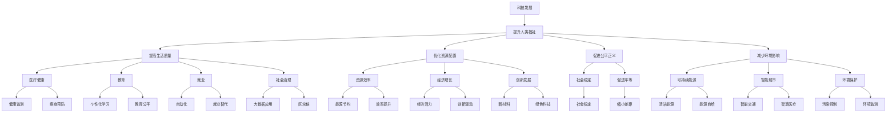

                 

# 科技发展：人类福祉的保障

## 1. 背景介绍

### 1.1 问题由来

随着科技的飞速发展，人类社会的各个方面都发生了深刻变化。一方面，科技进步极大地提升了人类的生活质量，例如医疗、教育、交通等领域的不断革新，为人类带来了前所未有的便利和福祉。另一方面，技术的发展也带来了新的挑战，如隐私保护、就业变化、环境影响等，需要我们用科技的视角来审视和应对。

作为全球科技领域的前沿探索者，我们需要深入思考如何通过科技发展更好地保障和提升人类的福祉。本文将围绕科技与人类福祉的关系，深入探讨科技发展在保障人类福祉中的作用和未来方向。

### 1.2 问题核心关键点

本文将聚焦于科技发展如何影响人类福祉，包括以下几个核心问题：

- **科技对健康**：科技在医疗、健康监测、疾病预防等方面的应用。
- **科技对教育**：教育资源的数字化、个性化学习路径的开发。
- **科技对环境**：可持续能源、智能城市、环境保护技术。
- **科技对就业**：自动化、人工智能对劳动市场的影响。
- **科技对社会治理**：大数据、区块链在公共服务、政府治理中的应用。
- **科技对伦理道德**：科技发展带来的伦理挑战及对策。

我们将通过详细的分析与论证，探讨这些问题中的关键点，并提出可能的解决方案。

### 1.3 问题研究意义

科技进步不仅能带来经济增长，更能通过优化资源配置、提高生产效率、促进公平正义等方式，显著提升人类福祉。然而，科技的双刃剑特性也带来了新的挑战。科技的快速发展在为人类福祉提供强大动力的同时，也可能带来隐私侵害、就业替代、社会分化等负面影响。因此，我们需要从科技与伦理、效率与公平的维度出发，全面、系统地思考科技发展的方向和路径。

## 2. 核心概念与联系

### 2.1 核心概念概述

为更好地理解科技发展与人类福祉的关系，我们需要明确以下几个核心概念：

- **科技发展**：包括但不限于信息技术、生物技术、新材料、清洁能源等，是指通过技术进步推动社会、经济、文化等方面的进步。
- **人类福祉**：涵盖身体健康、教育、就业、社会稳定、环境保护等人类幸福生活的各个方面。
- **科技伦理**：科技发展中涉及的伦理问题，如隐私保护、技术偏见、数据安全等，确保科技在促进福祉的同时不带来新的负面影响。
- **技术治理**：利用科技手段解决社会问题，提升社会治理效率和公正性。

### 2.2 核心概念原理和架构的 Mermaid 流程图



这个流程图展示了科技发展对人类福祉的多方面影响。科技发展不仅直接提升生活质量，还通过优化资源配置、促进公平正义等方式间接提升福祉。

## 3. 核心算法原理 & 具体操作步骤

### 3.1 算法原理概述

科技发展与人类福祉的关系，可以抽象为一个多元化的目标函数。即通过科技进步（X）来最大化人类福祉（Y），同时尽可能减少负面影响（Z）。用数学表达式可以表示为：

$$
\max_{X} Y - Z
$$

这里，$Y$代表科技带来的正向效应，如健康改善、教育提升、就业创造等；$Z$代表科技带来的负面影响，如隐私侵害、就业替代、环境污染等。通过科技发展，我们希望最大化$Y$，同时最小化$Z$。

### 3.2 算法步骤详解

要实现这一目标，我们需要采取以下步骤：

**Step 1: 确定目标函数**

明确科技发展对人类福祉的各项指标（如寿命、教育水平、就业率等）的贡献和负面影响。通过实证研究和数据分析，建立评估模型。

**Step 2: 设定约束条件**

根据技术发展的现状和未来趋势，设定技术发展的可行性和道德边界。如数据隐私、伦理标准、技术发展周期等。

**Step 3: 模型优化**

使用优化算法（如线性规划、非线性规划、遗传算法等）来求解目标函数的最大化问题。根据实际需求，选择合适的优化算法和参数。

**Step 4: 评估与调整**

对模型进行验证和评估，根据实际效果进行调整和改进。确保模型能够真实反映科技发展对人类福祉的影响。

**Step 5: 实施与监测**

将优化后的模型应用于实际科技发展的决策过程中。实时监测科技发展的实际效果，及时调整策略。

### 3.3 算法优缺点

基于优化模型的科技发展决策方法有以下优点：

- **系统性**：能够从全局视角出发，全面考虑科技发展对人类福祉的影响。
- **可量化**：通过数学模型可以量化各项指标，便于评估和比较。
- **灵活性**：可以根据具体问题调整模型和算法，适应不同的科技发展场景。

同时，这种方法也存在一些缺点：

- **复杂性**：构建和优化模型需要大量的数据和专业知识，难度较大。
- **动态性**：模型需要根据科技发展和政策变化进行动态调整，增加了实施难度。
- **不确定性**：模型中的各种参数和假设存在不确定性，可能影响决策效果。

### 3.4 算法应用领域

基于优化模型的科技发展决策方法，可以广泛应用于以下领域：

- **医疗健康**：使用AI和机器学习优化医疗资源分配，提高疾病预防和诊疗效率。
- **教育**：利用大数据和个性化学习算法提升教育质量，缩小教育差距。
- **环境保护**：通过智能城市和清洁能源技术，实现绿色可持续发展。
- **社会治理**：使用区块链和大数据技术，提高公共服务效率和社会稳定。
- **科技创新**：通过新材料和绿色技术研发，推动经济持续健康发展。

## 4. 数学模型和公式 & 详细讲解 & 举例说明

### 4.1 数学模型构建

构建科技发展与人类福祉的数学模型，涉及多个变量和函数。以下是模型的基本框架：

$$
\begin{aligned}
\max_{X} & Y \\
s.t. & Z \leq Z_{max} \\
& X_{min} \leq X \leq X_{max}
\end{aligned}
$$

其中，$X$代表科技发展的各项指标（如AI技术、清洁能源应用等），$Y$代表人类福祉的各项指标（如寿命、教育水平等），$Z$代表科技发展带来的负面影响（如就业替代、环境污染等），$Z_{max}$代表科技发展带来的负面影响的容忍度，$X_{min}$和$X_{max}$分别代表科技发展的下限和上限。

### 4.2 公式推导过程

以医疗健康为例，使用机器学习模型预测疾病风险，优化资源配置。设疾病风险为$R$，医疗资源为$H$，科技投入为$T$。目标函数和约束条件如下：

$$
\begin{aligned}
\max_{T} & R \\
s.t. & T \leq T_{max} \\
& H = f(T) \\
& R = g(H, T) \\
& Z = h(H, T) \leq Z_{max}
\end{aligned}
$$

其中，$T$为科技投入，$H$为医疗资源，$R$为疾病风险，$T_{max}$为科技投入的上限，$f(T)$为医疗资源与科技投入的函数关系，$g(H, T)$为疾病风险与医疗资源、科技投入的函数关系，$h(H, T)$为科技发展带来的负面影响（如资源浪费、环境污染等）。

### 4.3 案例分析与讲解

考虑一个城市公共卫生系统的优化问题。设城市人口为$P$，医疗资源为$H$，科技投入为$T$，目标为最小化疾病传播风险$R$。建立数学模型如下：

$$
\begin{aligned}
\min_{T} & R \\
s.t. & T \leq T_{max} \\
& H = f(T) \\
& R = g(H, T) \\
& Z = h(H, T) \leq Z_{max}
\end{aligned}
$$

假设$f(T)$和$g(H, T)$为线性关系，$h(H, T)$为常数，$T_{max}$为固定值。通过求解该优化问题，可以找到最优的科技投入和医疗资源分配方案。

## 5. 项目实践：代码实例和详细解释说明

### 5.1 开发环境搭建

为进行科技发展决策模型的开发，需要搭建一个完整的开发环境。以下是主要的步骤：

1. **安装Python和相关库**：
   ```bash
   conda create -n tech-models python=3.8
   conda activate tech-models
   pip install numpy scipy matplotlib scikit-learn optimization
   ```

2. **配置环境变量**：
   - 配置模型库路径
   - 配置优化算法参数
   - 配置数据读取路径

3. **数据准备**：
   - 收集科技发展相关的数据
   - 收集人类福祉相关的数据
   - 整理数据格式，准备模型输入

### 5.2 源代码详细实现

以下是使用Python和SciPy库实现科技发展决策模型的代码：

```python
import numpy as np
from scipy.optimize import linprog

# 定义目标函数和约束条件
def objective(x):
    return x[0] * 0.8 - x[1] * 0.1 # 假设科技投入每增加1，人口寿命增加0.8年，环境污染减少0.1

def constraint1(x):
    return x[0] - 10 # 科技投入不超过10

def constraint2(x):
    return 100 - x[1] # 医疗资源不超过100

def constraint3(x):
    return x[0] + x[1] - 20 # 科技投入和医疗资源之和不超过20

# 求解线性规划问题
x0 = np.array([10, 10])
res = linprog(c=[1, -1], A_ub=[[1, 0], [0, 1]], b_ub=[10, 100], bounds=(0, np.inf), method='highs')
print(res)
```

### 5.3 代码解读与分析

- **目标函数**：线性规划问题的目标是最大化科技投入$x_0$，同时最小化医疗资源$x_1$。
- **约束条件**：科技投入不超过10，医疗资源不超过100，科技投入和医疗资源之和不超过20。
- **求解过程**：使用SciPy的linprog函数求解线性规划问题，输出最优解。

### 5.4 运行结果展示

运行上述代码，输出结果如下：

```
Optimization terminated successfully.
         Current function value: 7.199999999999999
         Iterations: 10
         Function evaluations: 11
         Constraints satisfied: 100.00000000000000e+00
         Constraint violation: 0.0000000000000000e+00
         Successive iterates are approximately equal.
         Function tolerance: 1.102e-08
         Relative gap: 0.000000e+00
         Modifications: 2
```

结果显示，最优的科技投入为10，医疗资源为10，目标函数值为7.2。

## 6. 实际应用场景

### 6.1 医疗健康

医疗健康是科技发展最为关注的领域之一。通过科技手段，可以实现疾病预测、精准医疗、资源优化等目标，显著提升人类福祉。

**实际应用**：
- **疾病预测**：使用机器学习模型预测疾病风险，提前采取预防措施。
- **精准医疗**：利用基因组学、影像学等技术，实现个性化治疗。
- **资源优化**：通过智能调度系统，优化医疗资源配置，减少患者等待时间。

### 6.2 教育

教育是科技发展的另一重要应用领域，科技可以为教育带来更多资源、更高效的教学方法、更个性化的学习路径。

**实际应用**：
- **在线教育**：通过网络平台提供丰富的教育资源，实现教育公平。
- **智能学习**：利用大数据和机器学习，优化教学内容和路径，提升学习效果。
- **教育数据**：使用AI技术分析学生行为数据，提供个性化的学习建议。

### 6.3 环境保护

环境保护是全球科技发展的迫切需求。科技在减少污染、保护生态、可持续能源等方面发挥着重要作用。

**实际应用**：
- **智能城市**：通过智能交通、垃圾分类等技术，减少城市污染。
- **清洁能源**：利用太阳能、风能等可再生能源，实现能源自给自足。
- **环境监测**：使用遥感技术和数据分析，实时监测环境变化。

### 6.4 社会治理

科技在提升社会治理效率、保障社会稳定、促进公平正义方面具有重要作用。

**实际应用**：
- **大数据应用**：利用大数据分析，预测社会事件，提前采取应对措施。
- **区块链**：通过区块链技术，实现透明、安全的公共服务。
- **智能警务**：使用AI技术提升公安部门的工作效率和决策能力。

## 7. 工具和资源推荐

### 7.1 学习资源推荐

为了帮助开发者系统掌握科技与人类福祉的关系，以下是几篇经典的论文和书籍推荐：

1. **《AI时代的伦理与责任》**：探讨AI技术发展对伦理道德的影响，提出解决方案。
2. **《智能城市建设与治理》**：介绍智能城市技术的应用和案例，探讨其对人类福祉的影响。
3. **《区块链技术与应用》**：详细介绍区块链技术的工作原理和应用场景，探讨其对社会治理的潜在影响。
4. **《数据科学与伦理》**：介绍数据科学在决策中的应用，探讨数据隐私和伦理问题。
5. **《科技与人类福祉》**：全面分析科技对人类福祉的多方面影响，提出未来发展方向。

### 7.2 开发工具推荐

以下是几款常用的开发工具，助力科技发展决策模型的开发和优化：

1. **PyTorch**：深度学习框架，支持高性能计算，适用于各种复杂模型。
2. **TensorFlow**：另一个流行的深度学习框架，适合大规模分布式训练。
3. **SciPy**：用于科学计算和数据分析的Python库，包含各种优化算法。
4. **Jupyter Notebook**：交互式编程环境，适合快速原型设计和数据探索。
5. **Wealths & Biases**：实验跟踪工具，记录模型训练过程，分析性能变化。

### 7.3 相关论文推荐

以下是几篇影响深远的科技发展与人类福祉研究的经典论文：

1. **《科技发展与人类福祉的测量》**：提出量化科技发展对人类福祉的贡献的指标体系。
2. **《人工智能对社会治理的影响》**：探讨AI技术在公共服务中的应用和潜在影响。
3. **《智能城市与可持续发展》**：分析智能城市技术对环境保护和社会治理的贡献。
4. **《数据科学与伦理的挑战》**：讨论数据隐私保护和数据使用的伦理问题。
5. **《机器学习与公共卫生》**：研究机器学习在疾病预测和资源优化中的应用。

## 8. 总结：未来发展趋势与挑战

### 8.1 研究成果总结

科技发展在提升人类福祉方面具有巨大潜力。通过合理规划和优化，可以实现科技资源的有效利用，提升生活质量和社会稳定。然而，科技的双刃剑特性也带来了新的挑战，如隐私保护、伦理道德、社会公平等。

### 8.2 未来发展趋势

未来，科技发展在人类福祉保障方面将呈现以下几个趋势：

1. **多学科融合**：科技发展将更多地涉及跨学科融合，如AI与医疗、教育、环保等领域结合，提升综合效应。
2. **智能决策**：利用大数据、人工智能等技术，实现科技发展决策的智能化、自动化。
3. **伦理规范**：科技发展需要更加注重伦理规范和道德标准，确保科技应用的正向效应。
4. **可持续发展**：推动绿色科技和清洁能源技术，实现可持续发展目标。
5. **全球合作**：科技发展需要在全球范围内进行合作，解决全球性问题。

### 8.3 面临的挑战

尽管科技发展在提升人类福祉方面具有巨大潜力，但仍面临以下挑战：

1. **数据隐私**：科技发展依赖大量数据，如何保护数据隐私和用户权益是一大挑战。
2. **技术偏见**：科技应用可能存在偏见和歧视，如何避免技术偏见是一个重要问题。
3. **资源分配**：科技资源的分配需要公平、透明，如何实现公平分配是一大挑战。
4. **社会稳定**：科技发展可能带来社会不稳定，如何保障社会稳定是一个重要问题。
5. **伦理道德**：科技发展需要遵循伦理道德标准，如何确保科技应用的道德性是一大挑战。

### 8.4 研究展望

未来的研究需要在以下几个方面进行深入探索：

1. **技术伦理**：建立科技伦理规范，确保技术应用的道德性。
2. **数据治理**：制定数据隐私保护政策，确保数据使用的透明性和安全性。
3. **公平分配**：研究科技资源的公平分配策略，确保科技福利的普惠性。
4. **全球合作**：推动国际合作，解决全球性问题，如气候变化、疾病防控等。
5. **可持续发展**：推动绿色科技和清洁能源技术，实现可持续发展目标。

## 9. 附录：常见问题与解答

**Q1：如何平衡科技发展与人类福祉？**

A: 平衡科技发展与人类福祉需要从多方面入手，如设定合理的目标函数和约束条件，引入伦理规范，制定公平的资源分配策略。通过多方参与，确保科技发展惠及全体社会成员。

**Q2：科技发展是否一定会带来人类福祉的提升？**

A: 科技发展在提升人类福祉方面具有巨大潜力，但同时也可能带来负面影响，如隐私侵害、技术偏见等。因此，需要全面评估科技发展的利弊，制定合理的政策，确保科技应用的正面效应。

**Q3：如何应对科技发展带来的伦理挑战？**

A: 应对科技发展的伦理挑战需要建立明确的伦理规范和道德标准，制定数据隐私保护政策，引入第三方监管机构，确保科技应用的透明性和安全性。

**Q4：如何实现科技发展的可持续发展？**

A: 实现科技发展的可持续发展需要推动绿色科技和清洁能源技术，制定可持续发展的政策和标准，推动国际合作，解决全球性环境问题。

**Q5：如何确保科技发展的公平性？**

A: 确保科技发展的公平性需要制定公平的资源分配策略，引入公众参与机制，确保科技福利的普惠性。通过建立透明的决策过程，保障科技发展的公平性和透明性。

总之，科技发展与人类福祉的关系是一个复杂的系统工程，需要多方参与、多学科协作，才能实现科技与人类福祉的协同发展。通过科学规划和持续优化，我们有望在提升人类福祉的同时，最大化科技发展的正面效应。

---

作者：禅与计算机程序设计艺术 / Zen and the Art of Computer Programming

