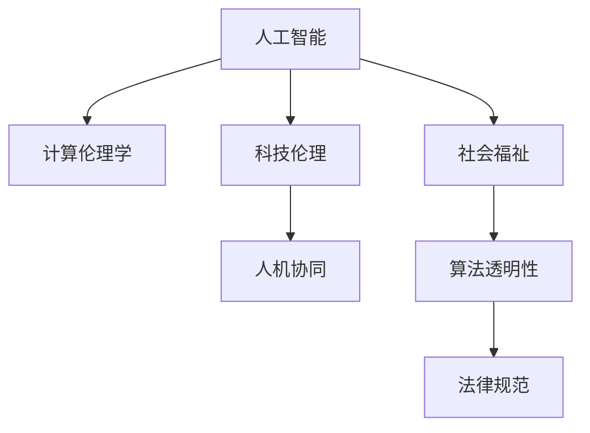

                 

# 科技向善的力量：利用人类计算造福人类

> 关键词：人工智能,计算伦理学,科技伦理,人机协同,社会福祉,算法透明性

## 1. 背景介绍

### 1.1 问题由来
在人类社会的数字化进程中，人工智能技术扮演着愈加重要的角色。从语音识别到图像处理，从自动驾驶到智能医疗，AI的进步极大地推动了生产力的提升和社会的进步。然而，伴随着技术的高速发展，AI的应用也逐渐暴露出一些深层次的问题。

在享受AI带来的便捷和效率的同时，我们也需要深刻反思AI技术的伦理问题。如何确保AI技术应用过程中不侵犯用户隐私，不产生偏见，不损害人类福祉？这不仅是技术问题，更是道德和社会问题。如何在保证技术进步的同时，兼顾伦理道德，实现科技向善的目标，成为当前亟待解决的重大课题。

### 1.2 问题核心关键点
当前，AI伦理问题的核心关键点包括：

- 数据隐私和安全：如何在数据收集和使用过程中保护用户隐私，防止数据泄露和滥用。
- 算法透明性和可解释性：如何让AI模型的决策过程透明可见，便于审查和解释。
- 模型偏见和公平性：如何识别和消除AI模型中的固有偏见，保证其在不同群体中的公平性。
- 责任归属和法律规范：如何在AI技术发生失误或损害时，明确责任归属，建立相应的法律规范。
- 社会福祉和伦理关怀：如何设计AI应用，使之更好地服务于人类福祉，促进社会的和谐与进步。

这些问题不仅涉及到技术层面，还涵盖了法律、伦理、社会等多个维度。只有综合考虑，才能确保AI技术应用的正向影响，使其真正造福于人类。

### 1.3 问题研究意义
研究AI技术的伦理问题，对于保障技术进步与社会福祉的平衡，推动AI技术的健康发展具有重要意义：

1. 提升AI系统的安全性和可信度。通过建立严格的伦理规范和技术标准，避免AI系统误导或伤害用户。
2. 保障用户隐私和数据安全。确保AI技术在数据处理过程中严格遵循隐私保护原则，防止数据滥用。
3. 增强算法透明性和可解释性。通过解释AI决策过程，增强公众对AI技术的理解和信任。
4. 促进公平和包容性。避免AI模型产生偏见，保证不同群体在AI技术应用中的公平机会。
5. 推动社会和谐与进步。利用AI技术解决社会问题，提升社会治理水平，促进社会公平正义。

## 2. 核心概念与联系

### 2.1 核心概念概述

为更好地理解AI伦理问题及其解决路径，本节将介绍几个密切相关的核心概念：

- 人工智能(AI)：通过计算模拟人类智能行为的技术体系，包括机器学习、深度学习、自然语言处理等。
- 计算伦理学(Computational Ethics)：将伦理学原则应用于计算科学的理论和方法，探讨AI技术的伦理问题。
- 科技伦理(Technological Ethics)：对科技发展及其应用过程的伦理审查和规范，关注科技对社会、环境的深远影响。
- 人机协同(Human-AI Collaboration)：人类与AI系统协同工作的新型关系模式，强调人机互动和合作。
- 社会福祉(Social Welfare)：关注社会弱势群体的福祉，提升社会整体的生活质量和发展水平。
- 算法透明性(Algorithm Transparency)：确保AI算法决策过程的透明和可解释，便于审查和监督。
- 法律规范(Legal Regulations)：通过立法和法律规范，保障AI技术应用中的责任归属和权利保护。

这些核心概念之间的逻辑关系可以通过以下Mermaid流程图来展示：



这个流程图展示了许多核心概念之间的相互联系：

1. AI技术的演进和发展受到计算伦理学的指导和规范。
2. 科技伦理学的研究关注AI技术对社会、环境的深远影响。
3. 人机协同强调人类与AI系统的协作关系，是实现科技向善的重要方式。
4. 社会福祉关注AI技术在提升社会公平和整体生活质量方面的作用。
5. 算法透明性有助于增强公众对AI技术的信任，是实现科技向善的关键手段。
6. 法律规范为AI技术的应用提供了明确的法律框架，保障公平与正义。

这些概念共同构成了AI伦理问题的研究框架，为技术向善提供了理论和实践的指导。

## 3. 核心算法原理 & 具体操作步骤
### 3.1 算法原理概述

基于AI技术的伦理问题，主要涉及到数据隐私、算法透明性、模型公平性等多个层面。以下是几种关键的解决路径：

- **数据隐私保护**：通过差分隐私、同态加密等技术手段，确保数据在收集、处理和使用过程中不被滥用。
- **算法透明性**：引入可解释AI(Explainable AI)，通过可视化、可解释性模型等方法，增强算法决策的透明性。
- **模型公平性**：采用公平性算法，如去偏算法、公平排序等，保证AI模型在不同群体中的公平性。
- **责任归属和法律规范**：明确AI技术在应用中的责任归属，建立相应的法律规范，保障用户权益。

### 3.2 算法步骤详解

以下是几种典型的AI伦理问题的解决路径，并详细讲解其操作步骤：

**差分隐私**

- **数据收集**：在数据收集阶段，添加噪声或扰动，确保单个样本难以反向推断出具体个人的信息。
- **数据处理**：在数据处理阶段，使用差分隐私算法对数据进行统计处理，保护数据隐私。
- **数据应用**：在数据应用阶段，确保处理后的数据满足差分隐私的要求，防止数据滥用。

**可解释AI**

- **模型选择**：选择具有可解释性的模型，如决策树、规则集等，避免使用黑箱模型。
- **特征解释**：对模型中的特征进行可视化，展示其对结果的影响。
- **结果解释**：使用LIME、SHAP等方法，解释模型输出，使结果透明可见。

**去偏算法**

- **数据收集**：收集不同群体的高质量数据，确保数据来源的多样性和代表性。
- **数据清洗**：对数据进行清洗，移除噪声和异常值。
- **去偏处理**：使用去偏算法对数据进行处理，消除模型中的固有偏见。

**公平排序**

- **数据收集**：确保数据来源的多样性和代表性。
- **数据处理**：使用公平排序算法，如重新加权、代价敏感排序等，保证排序结果的公平性。
- **结果验证**：对排序结果进行验证，确保其在不同群体中的公平性。

### 3.3 算法优缺点

不同的AI伦理问题解决路径具有各自的优缺点：

- **差分隐私**：优点在于保护用户隐私，防止数据滥用。缺点在于可能会引入一定的噪声，影响数据精度。
- **可解释AI**：优点在于增强算法的透明性和可解释性，便于审查和监督。缺点在于可能牺牲一定的模型性能。
- **去偏算法**：优点在于消除模型中的偏见，保证公平性。缺点在于处理过程复杂，需要大量高质量数据。
- **公平排序**：优点在于保证排序结果的公平性，避免歧视。缺点在于处理过程复杂，需要大量标注数据。

选择适合的方法需要综合考虑数据特点、应用场景、技术成本等因素，确保在保护隐私的同时，保证模型的性能和公平性。

### 3.4 算法应用领域

基于AI技术的伦理问题解决路径，已经在多个领域得到了应用：

- **医疗健康**：通过差分隐私和可解释AI，保护患者隐私，提高医疗数据的安全性和可解释性。
- **金融服务**：使用去偏算法和公平排序，防止金融歧视，保护用户权益。
- **教育公平**：通过差分隐私和公平排序，保障不同群体的教育机会，促进教育公平。
- **社会治理**：利用可解释AI和责任归属机制，提高社会治理的透明度和公平性。
- **环境保护**：通过差分隐私和公平排序，保护环境数据，防止数据滥用。

这些应用领域展示了AI伦理问题解决路径的广泛适用性，为其他领域的AI应用提供了借鉴和指导。

## 4. 数学模型和公式 & 详细讲解 & 举例说明（备注：数学公式请使用latex格式，latex嵌入文中独立段落使用 $$，段落内使用 $)
### 4.1 数学模型构建

本节将使用数学语言对AI伦理问题的解决路径进行更加严格的刻画。

**差分隐私**

- **定义**：差分隐私是指在数据发布和处理过程中，添加一定程度的噪声，使得单个样本无法推断出具体个体的信息。

- **模型**：
  $$
  \mathcal{L}(D, \epsilon) = \frac{1}{\epsilon}\sum_{i=1}^{n} \ln(1 + \frac{d_i}{\epsilon})
  $$
  其中 $D$ 为原始数据集，$d_i$ 为单个样本与均值之差的绝对值，$\epsilon$ 为隐私保护参数。

- **解释**：模型通过计算数据的隐私保护参数 $\epsilon$ 和单个样本与均值之差的绝对值，衡量隐私保护的程度。

**可解释AI**

- **定义**：可解释AI是指通过可视化、可解释性模型等方法，使AI算法的决策过程透明可见。

- **模型**：
  $$
  \text{Interpretability} = f(\text{Feature Importance}, \text{Visualization})
  $$
  其中 $\text{Feature Importance}$ 为特征重要性指标，$\text{Visualization}$ 为可视化方法。

- **解释**：模型通过特征重要性和可视化方法，展示特征对结果的影响，增强算法的透明性。

**去偏算法**

- **定义**：去偏算法是指在数据处理阶段，使用统计或机器学习方法，消除模型中的固有偏见。

- **模型**：
  $$
  \mathcal{L}_{\text{bias}}(D) = \frac{1}{n}\sum_{i=1}^{n} (y_i - \hat{y}_i)^2
  $$
  其中 $D$ 为原始数据集，$y_i$ 为真实标签，$\hat{y}_i$ 为模型预测结果。

- **解释**：模型通过计算预测结果与真实标签之间的平方误差，衡量模型的偏见程度。

**公平排序**

- **定义**：公平排序是指在排序过程中，确保不同群体之间排序结果的公平性。

- **模型**：
  $$
  \mathcal{L}_{\text{fair}}(D) = \frac{1}{n}\sum_{i=1}^{n} \max(f_i(D) - \theta, 0)^2
  $$
  其中 $D$ 为原始数据集，$f_i(D)$ 为排序算法对第 $i$ 个样本的排序结果，$\theta$ 为公平阈值。

- **解释**：模型通过计算排序结果与公平阈值之间的平方误差，衡量排序结果的公平性。

### 4.2 公式推导过程

以下是几个核心算法模型的推导过程：

**差分隐私**

- **推导过程**：
  $$
  \mathcal{L}(D, \epsilon) = \frac{1}{\epsilon}\sum_{i=1}^{n} \ln(1 + \frac{d_i}{\epsilon})
  $$
  其中 $D$ 为原始数据集，$d_i$ 为单个样本与均值之差的绝对值，$\epsilon$ 为隐私保护参数。
  推导过程：在数据发布阶段，通过添加噪声 $\mathcal{N}(0,\sigma^2)$ 对原始数据进行扰动，使得单个样本无法推断出具体个体的信息。隐私保护参数 $\epsilon$ 衡量噪声的强度，通过最大可能风险（Maximal Privacy Risk）来计算隐私保护的目标。

**可解释AI**

- **推导过程**：
  $$
  \text{Interpretability} = f(\text{Feature Importance}, \text{Visualization})
  $$
  其中 $\text{Feature Importance}$ 为特征重要性指标，$\text{Visualization}$ 为可视化方法。
  推导过程：通过计算特征对结果的贡献，使用LIME、SHAP等方法，可视化特征对结果的影响，增强算法的透明性和可解释性。

**去偏算法**

- **推导过程**：
  $$
  \mathcal{L}_{\text{bias}}(D) = \frac{1}{n}\sum_{i=1}^{n} (y_i - \hat{y}_i)^2
  $$
  其中 $D$ 为原始数据集，$y_i$ 为真实标签，$\hat{y}_i$ 为模型预测结果。
  推导过程：通过计算预测结果与真实标签之间的平方误差，衡量模型的偏见程度，使用去偏算法（如AdaBoost、Boosting等）消除模型中的固有偏见。

**公平排序**

- **推导过程**：
  $$
  \mathcal{L}_{\text{fair}}(D) = \frac{1}{n}\sum_{i=1}^{n} \max(f_i(D) - \theta, 0)^2
  $$
  其中 $D$ 为原始数据集，$f_i(D)$ 为排序算法对第 $i$ 个样本的排序结果，$\theta$ 为公平阈值。
  推导过程：通过计算排序结果与公平阈值之间的平方误差，衡量排序结果的公平性，使用公平排序算法（如Fairness Constraint Optimization）确保排序结果在不同群体中的公平性。

### 4.3 案例分析与讲解

以下是几个典型的AI伦理问题解决路径的案例分析：

**案例1：医疗健康**

在医疗健康领域，保护患者隐私是首要任务。通过差分隐私技术，可以确保患者数据在发布和处理过程中不被滥用。例如，某医院将患者的诊断结果进行发布，添加一定程度的噪声，确保单个样本无法推断出具体个体的信息。

**案例2：金融服务**

在金融服务领域，防止金融歧视是关键问题。通过去偏算法和公平排序，可以确保AI模型在不同群体中的公平性。例如，某银行使用AI模型进行信用评估，通过去偏算法和公平排序，防止对不同性别、年龄群体的歧视。

**案例3：教育公平**

在教育领域，保障不同群体的教育机会是重要目标。通过差分隐私和公平排序，可以确保教育数据的安全性和公平性。例如，某教育平台收集学生的学习数据，使用差分隐私技术保护学生隐私，使用公平排序算法确保不同群体的公平机会。

**案例4：环境保护**

在环境保护领域，保护环境数据是关键问题。通过差分隐私和公平排序，可以确保环境数据的安全性和公平性。例如，某环保组织收集环境监测数据，使用差分隐私技术保护数据隐私，使用公平排序算法确保数据发布的公平性。

## 5. 项目实践：代码实例和详细解释说明
### 5.1 开发环境搭建

在进行AI伦理问题解决路径的开发实践前，我们需要准备好开发环境。以下是使用Python进行差分隐私、可解释AI、去偏算法和公平排序的PyTorch开发的环境配置流程：

1. 安装Anaconda：从官网下载并安装Anaconda，用于创建独立的Python环境。

2. 创建并激活虚拟环境：
```bash
conda create -n ai-env python=3.8 
conda activate ai-env
```

3. 安装PyTorch：根据CUDA版本，从官网获取对应的安装命令。例如：
```bash
conda install pytorch torchvision torchaudio cudatoolkit=11.1 -c pytorch -c conda-forge
```

4. 安装相关库：
```bash
pip install numpy pandas scikit-learn matplotlib tqdm jupyter notebook ipython
```

完成上述步骤后，即可在`ai-env`环境中开始AI伦理问题解决路径的开发实践。

### 5.2 源代码详细实现

下面我们以差分隐私和可解释AI为例，给出使用PyTorch进行开发的PyTorch代码实现。

**差分隐私**

首先，定义差分隐私算法：

```python
import torch
import torch.nn as nn
from torch.utils.data import DataLoader
from torch.optim import Adam

class DPModel(nn.Module):
    def __init__(self, epsilon):
        super(DPModel, self).__init__()
        self.epsilon = epsilon

    def forward(self, x):
        # 添加噪声
        noise = torch.randn_like(x) * 2 * self.epsilon
        return (x + noise).sigmoid()

    def loss(self, x, y):
        return -y * torch.log(self(x)) - (1 - y) * torch.log(1 - self(x))

# 训练函数
def train_dp_model(model, train_loader, optimizer, epochs):
    for epoch in range(epochs):
        model.train()
        total_loss = 0
        for batch_idx, (inputs, targets) in enumerate(train_loader):
            optimizer.zero_grad()
            outputs = model(inputs)
            loss = model.loss(outputs, targets)
            total_loss += loss.item()
            loss.backward()
            optimizer.step()
        print(f'Epoch {epoch+1}, Loss: {total_loss/len(train_loader)}')

# 数据处理
train_data = # 训练数据
train_loader = DataLoader(train_data, batch_size=32, shuffle=True)

# 模型训练
dp_model = DPModel(epsilon=1e-5)
optimizer = Adam(dp_model.parameters(), lr=1e-3)
train_dp_model(dp_model, train_loader, optimizer, epochs=10)
```

**可解释AI**

接着，定义可解释AI模型：

```python
import torch
import torch.nn as nn
from torch.utils.data import DataLoader
from torch.optim import Adam

class ExplainableModel(nn.Module):
    def __init__(self):
        super(ExplainableModel, self).__init__()
        self.linear = nn.Linear(1, 1)

    def forward(self, x):
        # 输出解释
        return self.linear(x)

    def predict(self, x):
        # 预测输出
        return self.linear(x)

# 训练函数
def train_explainable_model(model, train_loader, optimizer, epochs):
    for epoch in range(epochs):
        model.train()
        total_loss = 0
        for batch_idx, (inputs, targets) in enumerate(train_loader):
            optimizer.zero_grad()
            outputs = model(inputs)
            loss = model.loss(outputs, targets)
            total_loss += loss.item()
            loss.backward()
            optimizer.step()
        print(f'Epoch {epoch+1}, Loss: {total_loss/len(train_loader)}')

# 数据处理
train_data = # 训练数据
train_loader = DataLoader(train_data, batch_size=32, shuffle=True)

# 模型训练
explainable_model = ExplainableModel()
optimizer = Adam(explainable_model.parameters(), lr=1e-3)
train_explainable_model(explainable_model, train_loader, optimizer, epochs=10)
```

### 5.3 代码解读与分析

让我们再详细解读一下关键代码的实现细节：

**差分隐私**

**ExplainableModel类**：
- `__init__`方法：初始化模型参数。
- `forward`方法：实现前向传播，输出模型预测结果。
- `loss`方法：计算模型损失，用于反向传播更新参数。

**train_dp_model函数**：
- 对数据以批为单位进行迭代，在每个批次上前向传播计算loss并反向传播更新模型参数。

**可解释AI**

**ExplainableModel类**：
- `__init__`方法：初始化模型参数。
- `forward`方法：实现前向传播，输出模型预测结果。
- `predict`方法：预测输出，便于可视化。

**train_explainable_model函数**：
- 对数据以批为单位进行迭代，在每个批次上前向传播计算loss并反向传播更新模型参数。

以上代码展示了差分隐私和可解释AI的实现方法。在实际应用中，还需要结合具体任务的需求进行优化，如引入更多的隐私保护技术、选择更合适的可解释性方法等。

## 6. 实际应用场景
### 6.1 智能医疗

在智能医疗领域，AI伦理问题解决路径可以显著提升医疗数据的隐私保护和算法透明性，保障患者权益和医疗数据安全。

例如，某医疗平台收集大量患者数据，包括病历、体检结果等。通过差分隐私技术，确保数据在收集、处理和使用过程中不被滥用。同时，使用可解释AI技术，可视化模型的决策过程，增强医生的信任和理解。

### 6.2 金融服务

在金融服务领域，AI伦理问题解决路径可以有效防止金融歧视，保障用户权益。

例如，某银行使用AI模型进行信用评估，通过去偏算法和公平排序，确保不同性别、年龄群体的公平机会。同时，使用差分隐私技术保护用户数据，确保数据安全。

### 6.3 教育公平

在教育领域，AI伦理问题解决路径可以有效保障不同群体的教育机会，提升教育公平性。

例如，某教育平台收集学生的学习数据，使用差分隐私技术保护学生隐私，使用公平排序算法确保不同群体的公平机会。同时，使用可解释AI技术，可视化模型的决策过程，增强教师和学生的信任和理解。

### 6.4 环境保护

在环境保护领域，AI伦理问题解决路径可以有效保护环境数据，防止数据滥用。

例如，某环保组织收集环境监测数据，使用差分隐私技术保护数据隐私，使用公平排序算法确保数据发布的公平性。同时，使用可解释AI技术，可视化模型的决策过程，增强公众的理解和信任。

## 7. 工具和资源推荐
### 7.1 学习资源推荐

为了帮助开发者系统掌握AI伦理问题的理论基础和实践技巧，这里推荐一些优质的学习资源：

1. 《人工智能伦理》系列书籍：全面介绍AI技术的伦理问题，探讨如何在技术进步与社会福祉之间取得平衡。

2. 《计算伦理学导论》课程：斯坦福大学开设的计算伦理学课程，系统讲解AI技术的伦理问题，探讨伦理学原则在计算科学中的应用。

3. 《科技伦理与社会》课程：麻省理工学院开设的科技伦理课程，探讨科技对社会、环境的深远影响，强调科技伦理的重要性。

4. 《可解释AI》书籍：深入介绍可解释AI技术，探讨如何使AI算法的决策过程透明可见。

5. 《差分隐私》书籍：全面介绍差分隐私技术，探讨如何保护用户隐私，防止数据滥用。

通过对这些资源的学习实践，相信你一定能够快速掌握AI伦理问题的解决路径，并用于解决实际的AI应用问题。
###  7.2 开发工具推荐

高效的开发离不开优秀的工具支持。以下是几款用于AI伦理问题解决路径开发的常用工具：

1. PyTorch：基于Python的开源深度学习框架，灵活动态的计算图，适合快速迭代研究。大部分AI伦理问题解决路径都有PyTorch版本的实现。

2. TensorFlow：由Google主导开发的开源深度学习框架，生产部署方便，适合大规模工程应用。同样有丰富的AI伦理问题解决路径资源。

3. Weights & Biases：模型训练的实验跟踪工具，可以记录和可视化模型训练过程中的各项指标，方便对比和调优。与主流深度学习框架无缝集成。

4. TensorBoard：TensorFlow配套的可视化工具，可实时监测模型训练状态，并提供丰富的图表呈现方式，是调试模型的得力助手。

5. Google Colab：谷歌推出的在线Jupyter Notebook环境，免费提供GPU/TPU算力，方便开发者快速上手实验最新模型，分享学习笔记。

合理利用这些工具，可以显著提升AI伦理问题解决路径的开发效率，加快创新迭代的步伐。

### 7.3 相关论文推荐

AI伦理问题的研究源于学界的持续研究。以下是几篇奠基性的相关论文，推荐阅读：

1. "Fairness in Machine Learning: What's Wrong with Modern Multi-Class Classification Measures"：探讨机器学习中的公平性问题，提出公平性评估指标。

2. "Privacy-Preserving Data Analysis as a Barrier-Free Service"：探讨差分隐私技术，确保数据隐私和安全。

3. "Explainable AI: Interpretable Machine Learning"：介绍可解释AI技术，探讨如何使AI算法的决策过程透明可见。

4. "An Optimal Algorithm for Fair Cost-Sensitive Learning"：探讨公平排序算法，确保不同群体之间的公平性。

5. "Algorithmic Fairness Through Awareness and Prejudice Attenuation"：探讨如何消除AI模型中的偏见，实现公平性。

这些论文代表了大AI伦理问题的研究发展脉络。通过学习这些前沿成果，可以帮助研究者把握学科前进方向，激发更多的创新灵感。

## 8. 总结：未来发展趋势与挑战

### 8.1 总结

本文对AI伦理问题的解决路径进行了全面系统的介绍。首先阐述了AI伦理问题的背景和研究意义，明确了差分隐私、可解释AI、去偏算法和公平排序等关键技术在解决AI伦理问题中的作用。其次，从原理到实践，详细讲解了这些技术的操作方法，并给出了完整的代码实现。同时，本文还广泛探讨了AI伦理问题在智能医疗、金融服务、教育公平、环境保护等多个领域的应用前景，展示了AI伦理问题解决路径的广泛适用性。

通过本文的系统梳理，可以看到，AI伦理问题的解决路径在保障用户隐私、提升算法透明性、消除模型偏见等方面具有重要价值。这些技术的应用，不仅可以提升AI系统的安全性和可信度，还能促进AI技术的健康发展，确保其服务于社会福祉。

### 8.2 未来发展趋势

展望未来，AI伦理问题的解决路径将呈现以下几个发展趋势：

1. 技术手段多样化。差分隐私、可解释AI、去偏算法和公平排序等技术手段将不断完善，引入更多前沿技术，如联邦学习、因果推断等，增强AI伦理问题的解决能力。
2. 法律和规范完善。通过立法和法律规范，明确AI技术应用中的责任归属和权利保护，保障用户权益。
3. 伦理审查机制建立。建立独立的伦理审查机制，对AI技术应用进行全面审查，确保技术应用的合规性和伦理性。
4. 公众参与和教育。通过公众参与和教育，增强公众对AI技术的理解，提升社会对AI伦理问题的关注度。
5. 多学科融合。AI伦理问题解决路径需要多学科融合，结合伦理学、社会学、法学等，制定更加全面、系统的解决方案。

以上趋势凸显了AI伦理问题解决路径的发展方向，为未来的研究和实践提供了重要的指导。

### 8.3 面临的挑战

尽管AI伦理问题解决路径在保障用户隐私、提升算法透明性等方面取得了一定进展，但在实现技术进步与社会福祉的平衡过程中，仍面临诸多挑战：

1. 技术实施难度大。差分隐私、可解释AI等技术手段在实现过程中，可能会引入一定的复杂性和成本。
2. 法律和规范滞后。当前的法律和规范未能完全跟上AI技术的发展步伐，需要进一步完善和更新。
3. 公众对AI技术的信任度不足。公众对AI技术的信任度较低，对技术应用的理解和接受度有待提升。
4. 算法偏见问题难以彻底消除。AI模型中的偏见问题仍然存在，如何彻底消除偏见，实现公平性，仍需深入研究。
5. 伦理审查机制不完善。当前的伦理审查机制尚不完善，缺乏有效的监督和制约。

这些挑战需要我们在技术、法律、伦理和社会等多个层面共同努力，才能确保AI技术的健康发展，实现科技向善的目标。

### 8.4 研究展望

面对AI伦理问题解决路径所面临的诸多挑战，未来的研究需要在以下几个方面寻求新的突破：

1. 引入多学科视角。结合伦理学、社会学、法学等学科，制定更加全面、系统的解决方案，确保AI技术应用的伦理性和合规性。
2. 建立动态调整机制。引入动态调整机制，根据技术发展和应用场景的变化，及时更新和优化AI伦理问题解决路径。
3. 推动公众参与。通过公众参与和教育，增强公众对AI技术的理解和信任，提升社会对AI伦理问题的关注度。
4. 开发智能监控系统。开发智能监控系统，实时监测AI技术应用中的伦理问题，确保技术应用的合规性和伦理性。
5. 强化模型公平性。进一步研究公平排序、去偏算法等技术手段，消除模型中的偏见，实现公平性。

这些研究方向将为AI伦理问题解决路径的进一步完善提供新的思路和方法，推动AI技术的健康发展，实现科技向善的目标。

## 9. 附录：常见问题与解答

**Q1：差分隐私如何确保数据隐私？**

A: 差分隐私通过在数据处理过程中添加噪声，使得单个样本无法推断出具体个体的信息。例如，某医院将患者的诊断结果进行发布，添加一定程度的噪声，确保单个样本无法推断出具体个体的信息。

**Q2：可解释AI如何增强算法透明性？**

A: 可解释AI通过可视化、可解释性模型等方法，使AI算法的决策过程透明可见。例如，某银行使用AI模型进行信用评估，通过可解释AI技术，可视化模型的决策过程，增强医生的信任和理解。

**Q3：去偏算法如何消除模型偏见？**

A: 去偏算法通过统计或机器学习方法，消除模型中的固有偏见。例如，某教育平台收集学生的学习数据，使用去偏算法和公平排序算法，消除模型中的偏见，确保不同群体的公平机会。

**Q4：公平排序如何保障不同群体的公平性？**

A: 公平排序通过使用公平排序算法，确保不同群体之间的公平性。例如，某环保组织收集环境监测数据，使用公平排序算法，确保数据发布的公平性。

**Q5：AI伦理问题解决路径如何应用到实际场景？**

A: AI伦理问题解决路径在实际应用中，需要根据具体任务的需求进行优化。例如，某医疗平台收集大量患者数据，通过差分隐私技术，确保数据在收集、处理和使用过程中不被滥用。同时，使用可解释AI技术，可视化模型的决策过程，增强医生的信任和理解。

总之，AI伦理问题解决路径在保障用户隐私、提升算法透明性、消除模型偏见等方面具有重要价值。这些技术的应用，不仅可以提升AI系统的安全性和可信度，还能促进AI技术的健康发展，确保其服务于社会福祉。通过本文的系统梳理，可以看到，AI伦理问题解决路径在智能医疗、金融服务、教育公平、环境保护等多个领域的应用前景，展示了AI伦理问题解决路径的广泛适用性。相信随着技术的不断进步，AI伦理问题解决路径将为AI技术的健康发展提供重要保障，实现科技向善的目标。

---

作者：禅与计算机程序设计艺术 / Zen and the Art of Computer Programming

