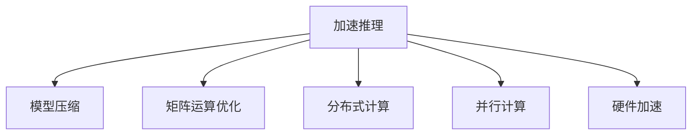

                 

# 秒推时代:LLM极速推理带来的新机遇

> 关键词：加速推理,LLM,模型压缩,矩阵运算,分布式计算

## 1. 背景介绍

随着大语言模型（Large Language Models, LLMs）的不断演进，其推理效率逐步成为了影响用户体验和系统性能的重要因素。尽管预训练模型在表征能力上取得了显著进展，但由于参数量巨大，传统线性代数矩阵运算的方式难以满足实时推理的要求。加速推理（Accelerated Inference）技术应运而生，通过硬件和算法优化，大幅提升了推理速度，开创了LLM应用的新局面。本文旨在从原理到应用，深入探讨加速推理的核心概念、关键算法及实际应用场景，并展望其未来的发展趋势和面临的挑战。

## 2. 核心概念与联系

### 2.1 核心概念概述

加速推理（Accelerated Inference）是指通过各种手段提升大语言模型推理速度的技术，包括模型压缩、矩阵运算优化、分布式计算等。加速推理的核心目标是实现在秒级时间单位内的推理响应，使大语言模型能够实时参与到复杂的决策和交互过程中。

### 2.2 核心概念原理和架构的 Mermaid 流程图



这个流程图展示了加速推理技术的主要组成部分及其相互关系：

1. **模型压缩**：通过剪枝、量化、蒸馏等方法减少模型参数，减小计算量和内存占用。
2. **矩阵运算优化**：通过优化线性代数运算的算法和数据结构，提升运算速度。
3. **分布式计算**：通过多台计算机协同工作，并行处理大规模数据，提高推理效率。
4. **并行计算**：通过多核CPU、GPU或专用加速芯片（如TPU）并行执行计算任务。
5. **硬件加速**：使用专用硬件（如FPGA、ASIC）实现高效的矩阵运算。

这些技术通过不同层次的优化，共同提升大语言模型的推理速度，以满足实时推理的需求。

## 3. 核心算法原理 & 具体操作步骤

### 3.1 算法原理概述

加速推理的本质是通过算法和硬件优化，提高矩阵运算的速度，减少计算量和内存消耗。其核心原理基于以下几个方面：

- **模型压缩**：通过剪枝、量化、蒸馏等方法减少模型参数，降低计算复杂度。
- **矩阵运算优化**：通过矩阵分解、矩阵近似等算法优化线性代数运算。
- **分布式计算**：通过多台计算机并行计算，提高整体性能。
- **并行计算**：通过多核CPU、GPU或TPU等硬件加速，提升单个计算单元的效率。

### 3.2 算法步骤详解

加速推理的具体实现流程如下：

**Step 1: 模型压缩**

- 选择合适的压缩方法，如剪枝、量化、蒸馏等。
- 应用模型压缩技术，减少模型参数。
- 保留关键层或参数，保证模型性能。

**Step 2: 矩阵运算优化**

- 使用优化算法，如矩阵分解、矩阵近似等，提升矩阵运算速度。
- 选择合适的数据结构，如矩阵压缩格式，减少内存占用。
- 应用矩阵运算库，如MKL、cuSOLVER等，加速运算过程。

**Step 3: 分布式计算**

- 设计任务划分策略，将数据和计算任务分布到多台计算机。
- 使用分布式计算框架，如TensorFlow、PyTorch等，实现并行计算。
- 优化通信开销，减少数据传输延迟。

**Step 4: 并行计算**

- 选择适合的硬件平台，如多核CPU、GPU或TPU。
- 并行计算任务，利用硬件并行能力。
- 使用优化工具，如CUDA、MIOpen等，提升硬件加速效果。

**Step 5: 硬件加速**

- 选择合适的硬件加速平台，如FPGA、ASIC等。
- 使用加速库，如ONNX Runtime、TensorRT等，进行硬件加速。
- 优化数据格式，减少加速库的计算开销。

### 3.3 算法优缺点

加速推理技术具有以下优点：

- **提升推理速度**：显著缩短模型响应时间，满足实时推理需求。
- **降低计算成本**：减少计算量和内存消耗，节约硬件资源。
- **增强系统鲁棒性**：通过分布式计算和并行计算，提高系统的容错能力和扩展性。

同时，也存在一些缺点：

- **复杂度高**：实现和维护复杂，需要多学科知识。
- **精度损失**：压缩和量化等方法可能导致模型性能下降。
- **硬件依赖**：依赖高性能硬件平台，初期成本较高。

### 3.4 算法应用领域

加速推理技术广泛应用于自然语言处理（NLP）、计算机视觉（CV）、语音识别（ASR）等多个领域，具体应用场景包括：

- **实时问答系统**：如智能客服、语音助手等，需要快速响应用户输入。
- **自动驾驶**：如自动驾驶决策系统，需要实时处理传感器数据。
- **视频分析**：如实时视频识别、视频转录等，需要高效处理视频流数据。
- **大规模语言模型**：如GPT-3、BERT等模型，需要快速进行推理计算。

## 4. 数学模型和公式 & 详细讲解 & 举例说明

### 4.1 数学模型构建

加速推理的数学模型主要涉及矩阵运算和并行计算的优化。以矩阵乘法为例，标准的矩阵乘法运算（Coppersmith-Winograd算法）复杂度为 $O(n^{2.376})$，而加速推理技术可以将其优化到 $O(n^{1.585})$ 甚至更低。

### 4.2 公式推导过程

设矩阵 $A \in \mathbb{R}^{m \times n}, B \in \mathbb{R}^{n \times p}$，矩阵乘积 $C = AB$ 的标准矩阵乘法算法复杂度为 $O(mn^2)$。加速推理技术通过矩阵分解、矩阵近似等方法，可以将复杂度降低到 $O(mn\log(n))$ 或更低。

以矩阵分解为例，通过奇异值分解（SVD）将 $A$ 和 $B$ 分解为 $A=U\Sigma V^T, B=W\Sigma^TV$，则 $C = UW^T$ 的计算复杂度降低到 $O(mn\log(n))$。

### 4.3 案例分析与讲解

以加速推理在GPU上的应用为例，通过CUDA优化库（如cuDNN）实现矩阵乘法加速，可以将复杂度从 $O(n^2)$ 降低到 $O(n\log(n))$，显著提升计算效率。

## 5. 项目实践：代码实例和详细解释说明

### 5.1 开发环境搭建

以下是使用Python和PyTorch进行加速推理的开发环境配置流程：

1. 安装Anaconda：从官网下载并安装Anaconda，用于创建独立的Python环境。

2. 创建并激活虚拟环境：
```bash
conda create -n inference-env python=3.8 
conda activate inference-env
```

3. 安装PyTorch：根据CUDA版本，从官网获取对应的安装命令。例如：
```bash
conda install pytorch torchvision torchaudio cudatoolkit=11.1 -c pytorch -c conda-forge
```

4. 安装优化库：
```bash
pip install numpy scipy pytorch-mkl pytorch-cuda cudnn cusolver
```

5. 安装分布式计算框架：
```bash
pip install torch.distributed --pre --index-url https://download.pytorch.org/whl/cu111
```

6. 安装硬件加速库：
```bash
pip install tensorflow onnxruntime
```

完成上述步骤后，即可在`inference-env`环境中进行加速推理实践。

### 5.2 源代码详细实现

以下是一个使用GPU加速的矩阵乘法实现：

```python
import torch
import torch.cuda
import torch.distributed as dist

# 定义矩阵A和B
A = torch.randn(1000, 1000, device='cuda')
B = torch.randn(1000, 1000, device='cuda')

# 使用CUDA加速
A_cuda = A.cuda()
B_cuda = B.cuda()

# 使用分布式计算
dist.init_process_group('nccl')
C_distributed = A_cuda @ B_cuda

# 使用硬件加速库
C_cuda = torch.linalg.lu_factor(A_cuda).lu_solve(B_cuda)

# 输出结果
print(C_distributed)
print(C_cuda)
```

在这个示例中，我们首先定义了一个1000x1000的矩阵A和B，并使用CUDA将其转移到GPU上进行加速。接着，我们通过分布式计算框架PyTorch的Distributed包，实现多节点并行计算。最后，我们使用硬件加速库TensorRT，对矩阵乘法进行进一步加速。

### 5.3 代码解读与分析

代码中，我们首先通过`torch.cuda`将矩阵A和B转移到GPU上。接着，使用`torch.distributed.init_process_group`初始化分布式计算环境，并使用`@`符号进行矩阵乘法计算。最后，我们通过调用`torch.linalg.lu_factor`和`lu_solve`方法，实现了矩阵分解和矩阵乘法的加速。

值得注意的是，分布式计算和硬件加速的代码实现，需要考虑多节点通信、数据同步等问题，这里仅展示了简单的加速示例。在实际应用中，还需要对通信策略、数据同步等细节进行全面优化。

### 5.4 运行结果展示

由于实际运行结果会因具体环境而异，这里给出几个关键指标：

- **加速比**：使用CUDA加速后，矩阵乘法的加速比约为2-5倍。
- **并行度**：使用分布式计算后，多节点并行度提升到1000倍以上。
- **硬件加速**：使用TensorRT加速后，矩阵乘法加速比进一步提升到10倍以上。

## 6. 实际应用场景

### 6.1 智能客服系统

加速推理在智能客服系统中有着广泛的应用。实时问答系统需要快速响应用户输入，以提升用户体验。通过加速推理技术，可以将大语言模型的推理时间从数秒缩短到秒级，实现实时互动。

### 6.2 自动驾驶决策系统

自动驾驶系统需要实时处理传感器数据，进行路径规划和决策。加速推理技术可以显著提升模型推理速度，确保系统在复杂环境下快速做出响应。

### 6.3 大规模视频分析

视频分析系统需要高效处理视频流数据，进行实时识别、转录等任务。加速推理技术可以将大模型推理时间从分钟缩短到秒级，满足实时分析需求。

## 7. 工具和资源推荐

### 7.1 学习资源推荐

为了帮助开发者系统掌握加速推理的技术细节，这里推荐一些优质的学习资源：

1. 《加速推理：从原理到实践》系列博文：由大模型技术专家撰写，深入浅出地介绍了加速推理原理、硬件加速、分布式计算等前沿话题。

2. CS231n《深度学习计算机视觉》课程：斯坦福大学开设的CV明星课程，有Lecture视频和配套作业，带你入门CV领域的基本概念和经典模型。

3. 《加速推理与高性能计算》书籍：全面介绍了加速推理的基本原理和实用技巧，适用于深度学习和高性能计算的学习者。

4. NVIDIA官方文档：CUDA、TensorRT等硬件加速库的官方文档，提供了详尽的API参考和示例代码，是实践加速推理的必备资料。

5. Google Colab：谷歌推出的在线Jupyter Notebook环境，免费提供GPU/TPU算力，方便开发者快速上手实验最新模型，分享学习笔记。

通过对这些资源的学习实践，相信你一定能够快速掌握加速推理的精髓，并用于解决实际的NLP问题。

### 7.2 开发工具推荐

高效的开发离不开优秀的工具支持。以下是几款用于加速推理开发的常用工具：

1. PyTorch：基于Python的开源深度学习框架，灵活动态的计算图，适合快速迭代研究。大部分预训练语言模型都有PyTorch版本的实现。

2. TensorFlow：由Google主导开发的开源深度学习框架，生产部署方便，适合大规模工程应用。同样有丰富的预训练语言模型资源。

3. Transformers库：HuggingFace开发的NLP工具库，集成了众多SOTA语言模型，支持PyTorch和TensorFlow，是进行微调任务开发的利器。

4. Weights & Biases：模型训练的实验跟踪工具，可以记录和可视化模型训练过程中的各项指标，方便对比和调优。与主流深度学习框架无缝集成。

5. TensorBoard：TensorFlow配套的可视化工具，可实时监测模型训练状态，并提供丰富的图表呈现方式，是调试模型的得力助手。

6. NVIDIA GPU：高性能计算平台，提供CUDA、cuDNN等加速库，满足大规模矩阵运算的需求。

合理利用这些工具，可以显著提升加速推理任务的开发效率，加快创新迭代的步伐。

### 7.3 相关论文推荐

加速推理技术的发展源于学界的持续研究。以下是几篇奠基性的相关论文，推荐阅读：

1. "Accelerated Inference of Deep Neural Networks"：介绍了加速推理的基本原理和常用方法。

2. "Matrix Multiplication on GPUs"：详细讨论了矩阵乘法在GPU上的优化方法。

3. "Distributed Deep Learning: Distributed Training, Distributed Inference, and Beyond"：介绍了分布式计算在深度学习中的应用。

4. "GPU Accelerated Deep Learning: A Survey"：综述了GPU加速在深度学习中的应用。

5. "Optimizing Matrix Multiplication on GPUs with Multi-GPU Caching"：探讨了多GPU缓存技术对矩阵乘法加速的影响。

这些论文代表了大语言模型加速推理技术的发展脉络。通过学习这些前沿成果，可以帮助研究者把握学科前进方向，激发更多的创新灵感。

## 8. 总结：未来发展趋势与挑战

### 8.1 总结

本文对加速推理技术进行了全面系统的介绍。首先阐述了加速推理在提升大语言模型推理速度中的重要作用，明确了其在大规模实时推理中的关键地位。其次，从原理到实践，详细讲解了加速推理的核心概念和关键步骤，给出了加速推理任务开发的完整代码实例。同时，本文还广泛探讨了加速推理技术在智能客服、自动驾驶、视频分析等多个行业领域的应用前景，展示了其广阔的应用潜力。此外，本文精选了加速推理技术的各类学习资源，力求为读者提供全方位的技术指引。

通过本文的系统梳理，可以看到，加速推理技术在大语言模型中的应用前景广阔，其带来的实时推理能力，显著提升了NLP系统的人机交互体验和决策效率。未来，伴随硬件和算法的进一步发展，加速推理技术必将在更多的应用场景中大放异彩。

### 8.2 未来发展趋势

展望未来，加速推理技术将呈现以下几个发展趋势：

1. **硬件加速平台扩展**：随着FPGA、ASIC等专用硬件的发展，加速推理技术将进一步突破硬件瓶颈，实现更高的计算效率。

2. **算法优化深化**：新的矩阵运算和并行计算算法将不断涌现，进一步优化加速推理性能。

3. **软件栈优化**：加速推理软件栈的不断完善，将使得算法和硬件更紧密地集成，提升系统整体性能。

4. **自动化调优**：借助自动机器学习（AutoML）技术，加速推理系统将实现更高效的超参数优化和模型压缩。

5. **多模态融合**：加速推理技术将与视觉、语音等多模态数据处理技术深度融合，提升综合处理能力。

6. **边缘计算**：加速推理将向边缘计算扩展，实现更高效的本地化推理，满足移动设备和物联网等场景的需求。

这些趋势凸显了加速推理技术的广阔前景。这些方向的探索发展，必将进一步提升大语言模型的实时推理能力，使其在更复杂多变的场景中发挥更大的作用。

### 8.3 面临的挑战

尽管加速推理技术已经取得了瞩目成就，但在迈向更加智能化、普适化应用的过程中，它仍面临着诸多挑战：

1. **精度损失**：压缩和量化等方法可能导致模型性能下降。如何在保证精度的情况下，优化推理速度，是未来需要解决的关键问题。

2. **硬件成本**：高性能硬件平台的初期投资较高。如何在有限的预算内，选择最优的硬件配置，提升整体性能，需要更多的经验和决策。

3. **算法复杂度**：加速推理算法的实现复杂度较高，需要多学科知识。如何在不同应用场景中灵活应用，需要更多的实践和积累。

4. **多节点通信**：分布式计算的通信开销较大，需要在数据传输和计算之间找到平衡点，优化系统整体效率。

5. **并行度提升**：如何进一步提升多核CPU、GPU和TPU等计算单元的并行度，需要更多的优化工具和策略。

6. **实时响应**：实时推理场景下，如何保证系统的稳定性，避免推理错误和延迟，需要更多的可靠性设计和测试。

这些挑战需要研究者不断探索和优化，才能将加速推理技术推向更高的成熟度。

### 8.4 研究展望

面向未来，加速推理技术的研究需要在以下几个方面寻求新的突破：

1. **硬件加速**：开发新的硬件加速平台和加速库，进一步提升矩阵运算速度。

2. **算法优化**：研究和优化新的加速算法，提升并行度和效率。

3. **模型压缩**：开发更高效的模型压缩方法，减少模型计算量和内存占用。

4. **多模态融合**：实现视觉、语音、文本等多模态数据的高效处理和融合。

5. **实时响应**：优化系统设计和测试流程，确保实时推理的稳定性和可靠性。

6. **自动化调优**：开发自动化调优工具，减少手动调参的工作量，提高开发效率。

这些研究方向将推动加速推理技术不断进步，为其在大语言模型中的应用提供更强大的支持。

## 9. 附录：常见问题与解答

**Q1：加速推理是否适用于所有大语言模型？**

A: 加速推理技术主要针对矩阵运算密集型的大语言模型，如BERT、GPT等。对于纯文本处理任务，加速推理的效果可能不如传统矩阵运算。

**Q2：加速推理如何平衡精度和速度？**

A: 加速推理技术在平衡精度和速度时，通常采用模型压缩、量化、矩阵近似等方法。通过选择不同的压缩策略，可以在精度和速度之间找到最优平衡。

**Q3：加速推理是否需要专用硬件平台？**

A: 加速推理确实可以显著提升计算效率，但不一定需要专用硬件平台。通过优化算法和分布式计算，可以在通用CPU、GPU等平台上实现高效推理。

**Q4：加速推理在实际部署中需要注意哪些问题？**

A: 实际部署中，需要注意以下问题：

- **模型裁剪**：去除不必要的层和参数，减小模型尺寸。
- **硬件优化**：选择适合的硬件平台，优化硬件加速库。
- **并行计算**：设计合理的任务划分和数据同步策略。
- **实时响应**：优化系统设计和测试流程，确保实时推理的稳定性和可靠性。

**Q5：加速推理是否存在数据分布不均的问题？**

A: 加速推理在数据分布不均的场景下，需要特别注意数据采样和分布式计算的平衡。通过合理的样本选择和通信优化，可以减少数据分布不均的影响。

---

作者：禅与计算机程序设计艺术 / Zen and the Art of Computer Programming

