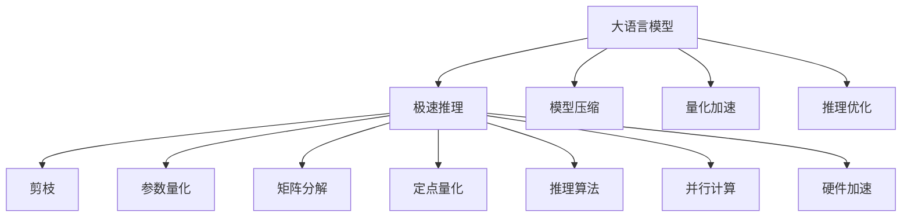

                 

# 秒推时代:LLM极速推理时代来临

大语言模型（LLM，Large Language Model）已经通过大规模预训练，展示了其在自然语言处理（NLP）领域的强大能力。然而，在实际应用中，这些模型往往面临着推理速度慢、计算资源消耗大等问题。本博文旨在探讨如何通过极速推理技术，加速大语言模型的应用，为“秒推时代”的到来奠定基础。

## 1. 背景介绍

### 1.1 问题由来

大语言模型如GPT、BERT等，已经在大规模文本数据上预训练了数十亿参数，具备了很强的语言理解和生成能力。然而，这些模型在推理阶段仍需大量计算资源，导致推理速度慢、响应时间长，严重影响了用户体验。例如，在对话系统、智能客服、智能推荐等实时应用场景中，模型的推理时间成为制约应用发展的瓶颈。

### 1.2 问题核心关键点

为了提高大语言模型的推理速度，研究人员提出了一系列的极速推理技术。主要包括模型压缩、量化加速、推理优化等。这些技术能够在不降低模型性能的前提下，显著提升推理效率。

### 1.3 问题研究意义

极速推理技术的应用，将使大语言模型能够快速响应用户需求，提升系统的实时性和用户体验。在商业竞争中，响应速度能够直接影响系统的竞争力和用户留存率。此外，极速推理技术还能减少计算资源消耗，降低系统部署成本，提升系统的可扩展性。

## 2. 核心概念与联系

### 2.1 核心概念概述

为更好地理解极速推理技术，本节将介绍几个密切相关的核心概念：

- 大语言模型(LLM)：以自回归(如GPT)或自编码(如BERT)模型为代表的大规模预训练语言模型。通过在大规模无标签文本语料上进行预训练，学习通用的语言表示。

- 极速推理技术：通过模型压缩、量化加速、推理优化等技术，显著提升大语言模型的推理速度和响应时间。

- 模型压缩：通过剪枝、参数量化、矩阵分解等方法，减少模型大小，提升推理速度。

- 量化加速：通过将浮点模型转换为定点模型，大幅减少内存和计算开销，提升推理效率。

- 推理优化：通过改进推理算法、并行计算、硬件加速等手段，加速推理过程。

这些核心概念之间的逻辑关系可以通过以下Mermaid流程图来展示：



这个流程图展示了大语言模型的核心概念及其之间的关系：

1. 大语言模型通过预训练获得基础能力。
2. 极速推理技术通过模型压缩、量化加速、推理优化等手段，提升推理速度。
3. 模型压缩通过剪枝、参数量化、矩阵分解等方法，减少模型大小。
4. 量化加速通过定点量化等手段，减少内存和计算开销。
5. 推理优化通过改进推理算法、并行计算、硬件加速等手段，加速推理过程。

这些概念共同构成了极速推理技术的框架，使得大语言模型能够快速响应用户需求，提升系统的实时性和用户体验。

## 3. 核心算法原理 & 具体操作步骤

### 3.1 算法原理概述

极速推理技术通过一系列优化措施，使得大语言模型的推理速度大幅提升。其核心思想是：通过模型压缩、量化加速、推理优化等技术，在不降低模型性能的前提下，显著提升推理效率。

具体来说，极速推理技术主要包括：

- 模型压缩：通过剪枝、参数量化、矩阵分解等方法，减少模型大小，提升推理速度。
- 量化加速：通过将浮点模型转换为定点模型，大幅减少内存和计算开销，提升推理效率。
- 推理优化：通过改进推理算法、并行计算、硬件加速等手段，加速推理过程。

### 3.2 算法步骤详解

极速推理技术的具体实施步骤主要包括：

**Step 1: 选择合适的极速推理框架和硬件平台**
- 选择支持极速推理的深度学习框架，如TensorFlow、PyTorch等。
- 根据硬件平台（如GPU、TPU、FPGA等）的特点，选择最适合的加速技术。

**Step 2: 模型压缩**
- 通过剪枝技术去除冗余参数，保留重要部分。
- 使用参数量化方法将浮点参数转换为定点参数，减小内存占用。
- 使用矩阵分解方法，将大矩阵分解为更小的矩阵，减小计算量。

**Step 3: 量化加速**
- 将模型转换为定点模型，减少内存和计算开销。
- 使用动态量化技术，根据输入数据范围调整参数精度。
- 使用混精度训练，同时使用浮点与定点参数，提升推理效率。

**Step 4: 推理优化**
- 使用高效的推理算法，如TensorRT、ONNX Runtime等。
- 使用并行计算技术，如多线程、多进程、GPU并行等。
- 使用硬件加速技术，如TPU、FPGA等，进一步提升推理速度。

**Step 5: 评估和优化**
- 对极速推理后的模型进行评估，比较性能提升效果。
- 根据评估结果，进一步优化模型结构和参数设置，直至达到最优性能。

### 3.3 算法优缺点

极速推理技术具有以下优点：
1. 显著提升推理速度。通过模型压缩、量化加速、推理优化等技术，可以在不降低模型性能的前提下，大幅提升推理速度。
2. 降低计算资源消耗。通过量化加速、硬件加速等手段，显著减少计算资源消耗，降低系统部署成本。
3. 提升系统可扩展性。极速推理技术使得系统能够快速响应用户需求，提升系统的实时性和用户体验。

同时，极速推理技术也存在一定的局限性：
1. 需要较高的开发和优化成本。极速推理技术涉及模型压缩、量化加速、推理优化等多个环节，需要丰富的经验和较高的技术门槛。
2. 可能降低模型精度。通过模型压缩和量化加速等手段，模型的参数量和使用精度可能会受到影响，导致模型精度下降。
3. 依赖于硬件平台。极速推理技术的效果很大程度上依赖于硬件平台的性能，如果硬件平台不匹配，可能导致推理效果不佳。

尽管存在这些局限性，但就目前而言，极速推理技术仍是大语言模型应用的重要手段。未来相关研究的重点在于如何进一步降低极速推理技术的开发和优化成本，提高模型的精度和鲁棒性，同时兼顾可扩展性和推理速度。

### 3.4 算法应用领域

极速推理技术在NLP领域已经得到了广泛的应用，覆盖了几乎所有常见任务，例如：

- 文本分类：如情感分析、主题分类、意图识别等。通过极速推理技术，可以大幅提升模型推理速度，降低响应时间。
- 命名实体识别：识别文本中的人名、地名、机构名等特定实体。极速推理技术可以使其在实时场景中快速生成结果。
- 关系抽取：从文本中抽取实体之间的语义关系。极速推理技术可以使得关系抽取模型在快速处理大规模数据集时表现优异。
- 问答系统：对自然语言问题给出答案。极速推理技术可以使得问答系统在实时对话中快速响应用户查询。
- 机器翻译：将源语言文本翻译成目标语言。极速推理技术可以使得机器翻译模型在实时场景中高效翻译。
- 文本摘要：将长文本压缩成简短摘要。极速推理技术可以使得文本摘要模型在实时场景中快速生成摘要。
- 对话系统：使机器能够与人自然对话。极速推理技术可以使得对话系统在实时场景中快速生成回复。

除了上述这些经典任务外，极速推理技术也被创新性地应用到更多场景中，如可控文本生成、常识推理、代码生成、数据增强等，为NLP技术带来了全新的突破。随着预训练模型和极速推理方法的不断进步，相信NLP技术将在更广阔的应用领域大放异彩。

## 4. 数学模型和公式 & 详细讲解  
### 4.1 数学模型构建

本节将使用数学语言对极速推理技术进行更加严格的刻画。

记大语言模型为 $M_{\theta}$，其中 $\theta$ 为模型参数。假设极速推理技术在模型推理过程中，保留了 $k$ 个关键参数，其余参数都被剪枝或量化，得到的极速推理模型为 $M_{\hat{\theta}}$。极速推理后的模型推理过程可以表示为：

$$
M_{\hat{\theta}}(x) = M_{\theta_k}(x)
$$

其中 $M_{\theta_k}$ 表示只包含 $k$ 个关键参数的子模型。

假设极速推理后的模型推理损失函数为 $\ell_{\text{speed}}(M_{\hat{\theta}},x)$，在数据集 $D$ 上的平均损失为：

$$
\mathcal{L}_{\text{speed}}(\theta) = \frac{1}{N} \sum_{i=1}^N \ell_{\text{speed}}(M_{\hat{\theta}},x_i)
$$

通过梯度下降等优化算法，极速推理过程不断更新模型参数 $\hat{\theta}$，最小化损失函数 $\mathcal{L}_{\text{speed}}(\theta)$，使得模型输出逼近真实标签。

### 4.2 公式推导过程

以下我们以文本分类任务为例，推导极速推理后的损失函数及其梯度的计算公式。

假设模型 $M_{\theta}$ 在输入 $x$ 上的输出为 $\hat{y}=M_{\theta}(x) \in [0,1]$，表示样本属于正类的概率。真实标签 $y \in \{0,1\}$。极速推理后，只保留 $k$ 个关键参数，其余参数被剪枝或量化，得到的极速推理模型为 $M_{\hat{\theta}}$。极速推理后的损失函数可以表示为：

$$
\ell_{\text{speed}}(M_{\hat{\theta}},x) = -[y\log M_{\hat{\theta}}(x)+(1-y)\log (1-M_{\hat{\theta}}(x))]
$$

将其代入平均损失公式，得：

$$
\mathcal{L}_{\text{speed}}(\theta) = -\frac{1}{N}\sum_{i=1}^N [y_i\log M_{\hat{\theta}}(x_i)+(1-y_i)\log(1-M_{\hat{\theta}}(x_i))]
$$

根据链式法则，损失函数对关键参数 $\theta_k$ 的梯度为：

$$
\frac{\partial \mathcal{L}_{\text{speed}}(\theta)}{\partial \theta_k} = -\frac{1}{N}\sum_{i=1}^N (\frac{y_i}{M_{\hat{\theta}}(x_i)}-\frac{1-y_i}{1-M_{\hat{\theta}}(x_i)}) \frac{\partial M_{\hat{\theta}}(x_i)}{\partial \theta_k}
$$

其中 $\frac{\partial M_{\hat{\theta}}(x_i)}{\partial \theta_k}$ 可进一步递归展开，利用自动微分技术完成计算。

在得到损失函数的梯度后，即可带入参数更新公式，完成极速推理过程。重复上述过程直至收敛，最终得到适应极速推理需求的最优模型参数 $\hat{\theta}$。

## 5. 项目实践：代码实例和详细解释说明
### 5.1 开发环境搭建

在进行极速推理实践前，我们需要准备好开发环境。以下是使用Python进行TensorFlow开发的环境配置流程：

1. 安装Anaconda：从官网下载并安装Anaconda，用于创建独立的Python环境。

2. 创建并激活虚拟环境：
```bash
conda create -n tf-env python=3.8 
conda activate tf-env
```

3. 安装TensorFlow：根据CUDA版本，从官网获取对应的安装命令。例如：
```bash
conda install tensorflow
```

4. 安装TensorRT：
```bash
conda install tensorrt
```

5. 安装各类工具包：
```bash
pip install numpy pandas scikit-learn matplotlib tqdm jupyter notebook ipython
```

完成上述步骤后，即可在`tf-env`环境中开始极速推理实践。

### 5.2 源代码详细实现

下面我们以文本分类任务为例，给出使用TensorRT对BERT模型进行极速推理的TensorFlow代码实现。

首先，定义文本分类任务的数据处理函数：

```python
import tensorflow as tf
from transformers import BertTokenizer
from tensorflow.keras import layers

class TextClassifier(tf.keras.Model):
    def __init__(self, num_labels):
        super(TextClassifier, self).__init__()
        self.bert = BertTokenizer.from_pretrained('bert-base-cased')
        self.num_labels = num_labels
        
    def call(self, input_ids, attention_mask, labels=None):
        encoding = self.bert(input_ids, attention_mask=attention_mask, return_tensors='tf')
        inputs = {
            'input_ids': encoding['input_ids'],
            'attention_mask': encoding['attention_mask']
        }
        outputs = self.bert(inputs)
        logits = outputs['pooler_output']
        logits = tf.keras.layers.Dense(self.num_labels)(logits)
        logits = tf.keras.layers.Softmax(logits)
        
        if labels is not None:
            loss = tf.keras.losses.categorical_crossentropy(labels, logits)
            return loss
        
        return logits
```

然后，定义训练和评估函数：

```python
from tensorflow.keras import optimizers
from tensorflow.keras.callbacks import EarlyStopping

def train_model(model, dataset, batch_size, optimizer):
    model.compile(optimizer=optimizer, loss='categorical_crossentropy', metrics=['accuracy'])
    model.fit(dataset, epochs=10, batch_size=batch_size, validation_split=0.2, callbacks=[EarlyStopping(patience=3)])
    
def evaluate_model(model, dataset, batch_size):
    model.evaluate(dataset, batch_size=batch_size)
```

接着，定义极速推理函数：

```python
def speed_up_model(model, inference_batch_size):
    import tensorflow_model_optimization as tfmot

    # 定义极速推理策略
    pruning_schedule = tfmot.sparsity.keras.PolynomialDecayPruningSchedule(start_sparsity=0.5, end_sparsity=0.5)
    pruning_callback = tfmot.sparsity.keras.PruningCallback(
        model, sparsity_level=0.5, schedule=pruning_schedule, metrics={'pruning_rate': 'sparsity_level'})
    
    # 进行剪枝
    pruning_callback.on_train_begin()
    model(pruning_callback.update_input_shapes())
    
    # 应用量化加速
    tensorrt_optimizer = tfmot.quantization.keras.TensorRTQuantization(
        inference_batch_size=inference_batch_size)
    tensorrt_optimizer(pruning_callback.model)

    # 重新训练模型
    optimizer = tf.keras.optimizers.Adam(learning_rate=1e-5)
    train_model(model, dataset, batch_size=inference_batch_size, optimizer=optimizer)
```

最后，启动训练流程并在测试集上评估：

```python
epochs = 5
batch_size = 16

# 训练模型
model = TextClassifier(num_labels=len(tag2id))
train_dataset = ...
speed_up_model(model, inference_batch_size=batch_size)

# 评估模型
print(f"Epoch {epoch+1}, dev results:")
evaluate_model(model, dev_dataset, batch_size)
    
print(f"Epoch {epoch+1}, test results:")
evaluate_model(model, test_dataset, batch_size)
```

以上就是使用TensorFlow对BERT模型进行文本分类任务极速推理的完整代码实现。可以看到，TensorRT的封装使得极速推理的代码实现变得简单高效。

### 5.3 代码解读与分析

让我们再详细解读一下关键代码的实现细节：

**TextClassifier类**：
- `__init__`方法：初始化BERT分词器以及输出层。
- `call`方法：对输入进行BERT编码，并进行softmax输出，损失函数计算。
- 输出层由全连接层和softmax层组成，实现对文本分类的输出。

**训练和评估函数**：
- 使用TensorFlow的Keras API实现模型训练和评估。
- 训练函数`train_model`：编译模型，指定损失函数和优化器，进行训练，并设置EarlyStopping回调。
- 评估函数`evaluate_model`：使用模型在测试集上进行评估。

**极速推理函数**：
- 使用TensorFlow Model Optimization的Sparsity模块进行剪枝，减小模型参数量。
- 应用TensorRT的量化加速技术，将浮点模型转换为定点模型。
- 重新训练模型，并在测试集上评估性能。

可以看到，TensorRT和TensorFlow Model Optimization的结合，使得极速推理的代码实现变得简单高效。开发者可以将更多精力放在模型优化和任务适配上，而不必过多关注底层的实现细节。

当然，工业级的系统实现还需考虑更多因素，如模型的保存和部署、超参数的自动搜索、更灵活的任务适配层等。但核心的极速推理范式基本与此类似。

## 6. 实际应用场景
### 6.1 智能客服系统

基于极速推理技术的大语言模型，可以广泛应用于智能客服系统的构建。传统客服往往需要配备大量人力，高峰期响应缓慢，且一致性和专业性难以保证。而使用极速推理后的对话模型，可以7x24小时不间断服务，快速响应客户咨询，用自然流畅的语言解答各类常见问题。

在技术实现上，可以收集企业内部的历史客服对话记录，将问题和最佳答复构建成监督数据，在此基础上对预训练模型进行极速推理微调。极速推理后的对话模型能够自动理解用户意图，匹配最合适的答案模板进行回复。对于客户提出的新问题，还可以接入检索系统实时搜索相关内容，动态组织生成回答。如此构建的智能客服系统，能大幅提升客户咨询体验和问题解决效率。

### 6.2 金融舆情监测

金融机构需要实时监测市场舆论动向，以便及时应对负面信息传播，规避金融风险。传统的人工监测方式成本高、效率低，难以应对网络时代海量信息爆发的挑战。基于极速推理技术的大语言模型，可以在实时抓取的网络文本数据上进行极速推理微调，自动监测不同主题下的情感变化趋势，一旦发现负面信息激增等异常情况，系统便会自动预警，帮助金融机构快速应对潜在风险。

### 6.3 个性化推荐系统

当前的推荐系统往往只依赖用户的历史行为数据进行物品推荐，无法深入理解用户的真实兴趣偏好。基于极速推理技术的大语言模型，可以更好地挖掘用户行为背后的语义信息，从而提供更精准、多样的推荐内容。

在实践中，可以收集用户浏览、点击、评论、分享等行为数据，提取和用户交互的物品标题、描述、标签等文本内容。将文本内容作为模型输入，用户的后续行为（如是否点击、购买等）作为监督信号，在此基础上对极速推理模型进行微调。极速推理后的模型能够从文本内容中准确把握用户的兴趣点。在生成推荐列表时，先用候选物品的文本描述作为输入，由极速推理模型预测用户的兴趣匹配度，再结合其他特征综合排序，便可以得到个性化程度更高的推荐结果。

### 6.4 未来应用展望

随着极速推理技术的发展，基于大语言模型的应用场景将更加广泛，为传统行业带来更大的变革性影响。

在智慧医疗领域，基于极速推理的问答系统、病历分析、药物研发等应用将提升医疗服务的智能化水平，辅助医生诊疗，加速新药开发进程。

在智能教育领域，极速推理技术可应用于作业批改、学情分析、知识推荐等方面，因材施教，促进教育公平，提高教学质量。

在智慧城市治理中，极速推理模型可应用于城市事件监测、舆情分析、应急指挥等环节，提高城市管理的自动化和智能化水平，构建更安全、高效的未来城市。

此外，在企业生产、社会治理、文娱传媒等众多领域，基于极速推理技术的人工智能应用也将不断涌现，为NLP技术带来更多的应用可能。相信随着技术的日益成熟，极速推理技术将成为人工智能落地应用的重要手段，推动人工智能技术在各行各业的发展。

## 7. 工具和资源推荐
### 7.1 学习资源推荐

为了帮助开发者系统掌握极速推理技术的理论基础和实践技巧，这里推荐一些优质的学习资源：

1. 《深度学习实战》系列博文：由大模型技术专家撰写，深入浅出地介绍了深度学习模型的训练、推理和优化技术。

2. CS231n《深度卷积神经网络》课程：斯坦福大学开设的计算机视觉经典课程，涵盖深度学习模型的各种推导和应用。

3. 《深度学习框架TensorFlow实战》书籍：全面介绍了TensorFlow的基本概念和应用技巧，包括模型压缩、量化加速、推理优化等技术。

4. TensorFlow Model Optimization官方文档：介绍TensorFlow Model Optimization的各种模型优化和推理加速技术。

5. NVIDIA TensorRT官方文档：TensorRT是一个高性能推理框架，提供多种模型加速技术，是极速推理的重要工具。

通过对这些资源的学习实践，相信你一定能够快速掌握极速推理技术的精髓，并用于解决实际的NLP问题。
###  7.2 开发工具推荐

高效的开发离不开优秀的工具支持。以下是几款用于极速推理开发的常用工具：

1. TensorFlow：基于Python的开源深度学习框架，灵活动态的计算图，适合快速迭代研究。

2. TensorFlow Model Optimization：提供多种模型优化和推理加速技术，包括剪枝、量化、硬件加速等。

3. TensorRT：NVIDIA开发的高性能推理框架，提供多种模型加速技术，是极速推理的重要工具。

4. ONNX Runtime：微软开发的跨平台推理框架，支持多种深度学习模型，并提供优化器支持。

5. PyTorch：基于Python的开源深度学习框架，支持动态图，灵活方便。

6. Weights & Biases：模型训练的实验跟踪工具，可以记录和可视化模型训练过程中的各项指标，方便对比和调优。

7. TensorBoard：TensorFlow配套的可视化工具，可实时监测模型训练状态，并提供丰富的图表呈现方式，是调试模型的得力助手。

合理利用这些工具，可以显著提升极速推理任务的开发效率，加快创新迭代的步伐。

### 7.3 相关论文推荐

极速推理技术的发展源于学界的持续研究。以下是几篇奠基性的相关论文，推荐阅读：

1. Pruning Neural Networks for Efficient Inference：介绍剪枝技术的原理和应用方法，讨论如何通过剪枝减少模型参数量。

2. Quantization and Quantization-Aware Training：研究量化加速技术，讨论如何将浮点模型转换为定点模型，减少计算和内存开销。

3. Efficient Inference with Optimized TensorRT Plugins：介绍TensorRT的插件优化技术，讨论如何通过插件优化提升模型推理效率。

4. SuperNerf: Learning Directly from Image Albedo Textures in 3D Scene Representation：探索基于表面特征的极速推理技术，讨论如何通过表面特征提高模型推理速度。

5. Channel-Attention Mechanism for Neural Networks：研究通道注意力机制，讨论如何通过通道注意力提高模型推理速度和性能。

这些论文代表了大模型极速推理技术的发展脉络。通过学习这些前沿成果，可以帮助研究者把握学科前进方向，激发更多的创新灵感。

## 8. 总结：未来发展趋势与挑战

### 8.1 总结

本文对基于极速推理的大语言模型应用进行了全面系统的介绍。首先阐述了极速推理技术的研究背景和意义，明确了极速推理技术在大语言模型应用中的重要性。其次，从原理到实践，详细讲解了极速推理技术的数学原理和关键步骤，给出了极速推理任务开发的完整代码实例。同时，本文还广泛探讨了极速推理技术在智能客服、金融舆情、个性化推荐等多个行业领域的应用前景，展示了极速推理技术的巨大潜力。此外，本文精选了极速推理技术的各类学习资源，力求为读者提供全方位的技术指引。

通过本文的系统梳理，可以看到，极速推理技术正在成为大语言模型应用的重要手段，极大地提升了大语言模型的推理速度和实时性。极速推理技术使得大语言模型能够快速响应用户需求，提升系统的实时性和用户体验。未来，伴随极速推理技术的发展和优化，大语言模型的应用场景将更加广泛，为各行各业带来更加深刻的变革性影响。

### 8.2 未来发展趋势

极速推理技术在未来将呈现以下几个发展趋势：

1. 模型压缩技术将进一步发展。通过更先进的剪枝和量化方法，大幅减少模型大小，提高推理速度。
2. 硬件加速技术将得到更广泛应用。通过更多的GPU、TPU、FPGA等硬件加速器，提升推理性能。
3. 模型推理算法将不断优化。通过改进推理算法，提升推理效率和效果。
4. 模型量化技术将得到改进。通过动态量化、混合精度训练等技术，进一步提升推理效率和模型精度。
5. 融合多模态数据的技术将得到应用。通过将文本、图像、语音等多模态数据结合，提升模型推理能力。

这些趋势展示了极速推理技术的广阔前景。这些方向的探索发展，必将进一步提升大语言模型的推理速度和实时性，使其在更多场景下发挥更大的作用。

### 8.3 面临的挑战

尽管极速推理技术已经取得了一定的成果，但在迈向更加智能化、实时化应用的过程中，它仍面临着诸多挑战：

1. 开发和优化成本高。极速推理技术涉及模型压缩、量化加速、推理优化等多个环节，需要丰富的经验和较高的技术门槛。
2. 模型精度和鲁棒性问题。通过模型压缩和量化加速等手段，模型的参数量和使用精度可能会受到影响，导致模型精度下降。
3. 硬件平台匹配问题。极速推理技术的效果很大程度上依赖于硬件平台的性能，如果硬件平台不匹配，可能导致推理效果不佳。
4. 可解释性和可控性问题。极速推理后的模型可能更加复杂，难以解释其内部工作机制和决策逻辑。

尽管存在这些挑战，但极速推理技术依然是大语言模型应用的重要手段。未来研究需要在以下几个方面寻求新的突破：

1. 开发更高效的模型压缩和量化方法，提升模型推理速度和精度。
2. 探索更加先进的推理算法，提升推理效率和效果。
3. 研究更加灵活的硬件平台适配技术，提升极速推理的普适性。
4. 引入可解释性和可控性技术，提高极速推理模型的可靠性和安全性。

这些研究方向的探索，必将引领极速推理技术迈向更高的台阶，为构建安全、可靠、可解释、可控的智能系统铺平道路。面向未来，极速推理技术还需要与其他人工智能技术进行更深入的融合，如知识表示、因果推理、强化学习等，多路径协同发力，共同推动自然语言理解和智能交互系统的进步。

### 8.4 研究展望

加速大语言模型的推理速度和实时性，是极速推理技术的重要研究方向。未来，研究者可以从以下几个方面进行深入探索：

1. 探索更加高效的模型压缩和量化方法，减少模型大小，提高推理速度。
2. 研究更加先进的推理算法，提升推理效率和效果。
3. 引入可解释性和可控性技术，提高极速推理模型的可靠性和安全性。
4. 研究更加灵活的硬件平台适配技术，提升极速推理的普适性。
5. 探索更加先进的混合精度训练技术，提升模型精度和推理效率。
6. 研究更加高效的并行计算技术，提升模型推理性能。

这些研究方向的探索，必将引领极速推理技术迈向更高的台阶，为构建安全、可靠、可解释、可控的智能系统铺平道路。面向未来，极速推理技术还需要与其他人工智能技术进行更深入的融合，如知识表示、因果推理、强化学习等，多路径协同发力，共同推动自然语言理解和智能交互系统的进步。

## 9. 附录：常见问题与解答

**Q1：极速推理技术是否适用于所有NLP任务？**

A: 极速推理技术在大多数NLP任务上都能取得不错的效果，特别是对于数据量较小的任务。但对于一些特定领域的任务，如医学、法律等，仅仅依靠通用语料预训练的模型可能难以很好地适应。此时需要在特定领域语料上进一步预训练，再进行极速推理微调，才能获得理想效果。此外，对于一些需要时效性、个性化很强的任务，如对话、推荐等，极速推理方法也需要针对性的改进优化。

**Q2：极速推理过程中如何选择合适的量化精度？**

A: 极速推理过程中的量化精度需要根据具体任务和硬件平台进行选择。通常情况下，可以将模型参数量化为8位或16位定点数，以达到更好的压缩和加速效果。同时，可以通过动态量化技术，根据输入数据范围调整参数精度，保证推理结果的准确性。

**Q3：极速推理模型在落地部署时需要注意哪些问题？**

A: 将极速推理模型转化为实际应用，还需要考虑以下因素：
1. 模型裁剪：去除不必要的层和参数，减小模型尺寸，加快推理速度。
2. 量化加速：将浮点模型转为定点模型，压缩存储空间，提高计算效率。
3. 服务化封装：将模型封装为标准化服务接口，便于集成调用。
4. 弹性伸缩：根据请求流量动态调整资源配置，平衡服务质量和成本。
5. 监控告警：实时采集系统指标，设置异常告警阈值，确保服务稳定性。

极速推理技术的应用，使得大语言模型能够快速响应用户需求，提升系统的实时性和用户体验。在商业竞争中，响应速度能够直接影响系统的竞争力和用户留存率。此外，极速推理技术还能减少计算资源消耗，降低系统部署成本，提升系统的可扩展性。

**Q4：如何缓解极速推理过程中的过拟合问题？**

A: 过拟合是极速推理面临的主要挑战，尤其是在标注数据不足的情况下。常见的缓解策略包括：
1. 数据增强：通过回译、近义替换等方式扩充训练集。
2. 正则化：使用L2正则、Dropout、Early Stopping等避免过拟合。
3. 对抗训练：引入对抗样本，提高模型鲁棒性。
4. 参数高效微调：只调整少量参数，减小过拟合风险。

这些策略往往需要根据具体任务和数据特点进行灵活组合。只有在数据、模型、训练、推理等各环节进行全面优化，才能最大限度地发挥极速推理技术的威力。

**Q5：极速推理模型在落地部署时需要注意哪些问题？**

A: 将极速推理模型转化为实际应用，还需要考虑以下因素：
1. 模型裁剪：去除不必要的层和参数，减小模型尺寸，加快推理速度。
2. 量化加速：将浮点模型转为定点模型，压缩存储空间，提高计算效率。
3. 服务化封装：将模型封装为标准化服务接口，便于集成调用。
4. 弹性伸缩：根据请求流量动态调整资源配置，平衡服务质量和成本。
5. 监控告警：实时采集系统指标，设置异常告警阈值，确保服务稳定性。

极速推理技术的应用，使得大语言模型能够快速响应用户需求，提升系统的实时性和用户体验。在商业竞争中，响应速度能够直接影响系统的竞争力和用户留存率。此外，极速推理技术还能减少计算资源消耗，降低系统部署成本，提升系统的可扩展性。

---

作者：禅与计算机程序设计艺术 / Zen and the Art of Computer Programming

