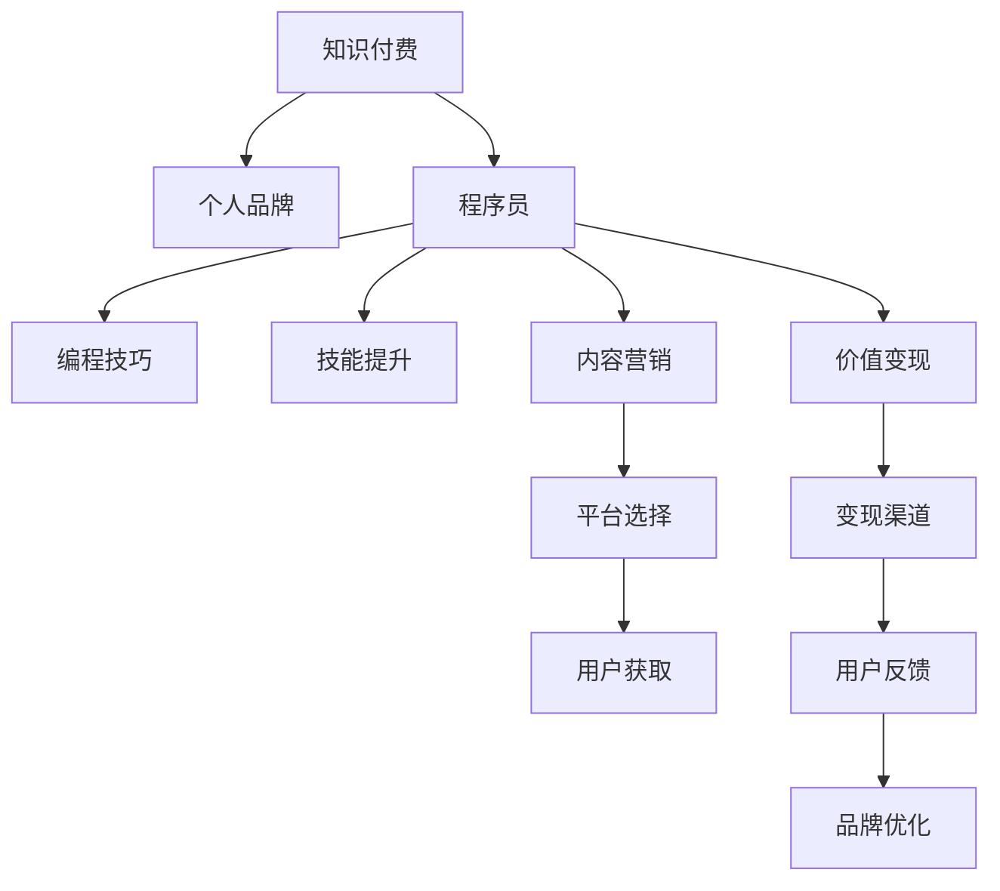

                 

# 程序员利用知识付费打造个人品牌

> 关键词：知识付费,个人品牌,程序员,编程技巧,内容营销,职业发展,技能提升,价值变现

## 1. 背景介绍

在当今互联网时代，知识付费正在成为一种新的价值获取方式，越来越受到社会各界的关注和追捧。尤其是在IT领域，技术变革日新月异，新知识、新技术层出不穷，学习成本不断增加，高质量的课程和内容变得越来越珍贵。在这样一个背景下，越来越多的程序员开始尝试通过知识付费打造个人品牌，实现知识和技术的变现。

### 1.1 问题由来

在过去的传统教育模式中，许多知识的学习需要自己摸索和积累，而在大数据时代，学习的方式变得多样化和快速化。知识付费平台如雨后春笋般涌现，为有知识需求和愿意付费的人提供了便捷的渠道。尤其是程序员群体，由于技术栈多样、项目复杂，他们在学习新技术、提升技能方面有着更迫切的需求，知识付费正好能够满足这一需求，同时也能为他们创造新的职业发展机会。

### 1.2 问题核心关键点

知识付费的成功实施需要程序员具备以下核心能力：
- 具有高水准的专业知识。程序员应具备扎实的编程基础和丰富的项目经验，能够提供有深度、有价值的技术内容。
- 擅长内容营销。能够通过撰写博客、录制视频、开发课程等形式，将专业知识输出给大众。
- 具备市场敏锐度。了解市场趋势，选择合适的内容形式和平台进行推广。
- 能够建立稳定的变现渠道。利用平台提供的功能，如收费文章、付费课程、会员订阅等，实现知识变现。

## 2. 核心概念与联系

### 2.1 核心概念概述

为更好地理解程序员利用知识付费打造个人品牌的过程，本节将介绍几个密切相关的核心概念：

- **知识付费**：指知识消费者为获取特定知识或服务而支付费用的行为，通过付费获取高质量的课程、文章、视频等内容。
- **个人品牌**：指通过个人在特定领域或行业中的专业能力和特点，塑造个人形象和声誉，以吸引并获取资源的过程。
- **程序员**：指具有编程技能和专业知识，能够开发、维护和管理计算机软件的人。
- **内容营销**：指通过创造和分享有价值的内容，提高品牌知名度，吸引潜在用户，最终实现销售目标的过程。
- **编程技巧**：指在编写代码、调试问题、优化性能等方面的方法和技巧。
- **技能提升**：指通过培训、学习等方式提高自身技能水平，使之适应新的技术要求。
- **价值变现**：指将自身拥有的知识和技能转化为经济效益的过程，包括通过课程、咨询、技术支持等方式实现收入。

这些概念之间的逻辑关系可以通过以下Mermaid流程图来展示：



这个流程图展示了个体程序员利用知识付费打造个人品牌的一般路径：

1. 程序员通过自身具备的编程技巧和技能提升，创作高质量的内容。
2. 通过内容营销，将内容推广到目标用户，吸引他们的关注。
3. 选择平台进行变现，如收费文章、课程、会员等。
4. 收集用户反馈，不断优化个人品牌和内容，实现品牌的长久发展。

## 3. 核心算法原理 & 具体操作步骤
### 3.1 算法原理概述

程序员利用知识付费打造个人品牌的过程，本质上是一个通过高质量内容吸引用户，建立品牌影响力，并实现变现的循环。其中涉及的主要算法包括：

- **推荐算法**：利用算法匹配用户需求和内容，提升内容曝光率。
- **广告投放算法**：通过精准投放，将内容推送给潜在用户。
- **数据分析算法**：通过数据分析，优化内容策略和品牌定位，提高用户满意度。
- **用户画像构建算法**：通过数据收集和分析，建立用户画像，提升内容定制化水平。

### 3.2 算法步骤详解

基于知识付费和内容营销的个人品牌打造流程，主要包括以下关键步骤：

**Step 1: 内容创作**
- 定位目标受众：分析自身优势和目标用户的需求，确定内容定位。
- 确定内容形式：选择博客、视频、课程、电子书等多种形式，满足不同用户需求。
- 进行内容策划：规划内容主题、发布周期、更新频率等，保持持续性。
- 制作高质量内容：利用自身编程技巧，制作原创、有深度、有价值的内容。

**Step 2: 平台选择**
- 选择合适的知识付费平台：根据自身内容特点，选择适合的平台。
- 注册并完善个人档案：填写详细的个人简介、技术背景、作品集等信息。
- 设置收费标准：根据内容难度和价值，合理设置课程价格，吸引用户。

**Step 3: 内容推广**
- 利用社交媒体推广：通过微信、微博、知乎等社交平台，分享内容，吸引关注。
- 建立社区互动：创建微信群、QQ群等社区，与用户互动，提升用户粘性。
- 参加技术会议：通过线下活动、技术沙龙等方式，提升品牌知名度。

**Step 4: 品牌优化**
- 收集用户反馈：通过评论、评分、问答等方式，收集用户反馈。
- 调整内容策略：根据用户反馈，调整内容主题、形式、发布时间等。
- 优化定价策略：根据用户需求和市场反馈，调整课程价格，吸引更多用户。
- 持续改进品牌：不断提升自身编程水平和内容质量，保持品牌竞争力。

### 3.3 算法优缺点

利用知识付费打造个人品牌的方法具有以下优点：
- **快速变现**：通过高质量内容快速吸引用户，实现变现。
- **提升专业形象**：通过持续输出高质量内容，提升在行业内的声誉。
- **拓宽职业发展**：知识付费为程序员提供更多职业发展机会，如技术咨询、项目合作等。
- **构建社区**：通过内容社区的建设，能够构建稳定的用户群体，实现长期发展。

同时，这种方法也存在一定的局限性：
- **内容质量要求高**：需要制作高质量内容，否则难以吸引用户。
- **市场竞争激烈**：内容市场竞争激烈，需要不断创新，保持竞争力。
- **时间和精力投入大**：内容创作和推广需要大量时间和精力，风险较大。
- **用户群体有限**：主要面向有一定技术背景的用户，推广范围有限。

尽管存在这些局限性，但就目前而言，知识付费和内容营销仍然是大牌程序员最主流的品牌打造和变现手段。未来相关研究的方向包括如何进一步提升内容质量和推广效率，降低时间和精力投入，拓展用户群体，实现更大规模的变现和品牌影响力。

### 3.4 算法应用领域

利用知识付费打造个人品牌的方法，已经在多个领域得到应用，例如：

- **软件开发**：通过技术博客、开源项目等方式，吸引开发者关注，提升自身在软件开发领域的知名度。
- **技术咨询**：通过课程、讲座、技术支持等方式，为其他开发者提供技术咨询，获取额外的收入。
- **内容合作**：与其他技术平台或公司合作，开发和推广课程，扩大影响力。
- **创业融资**：通过品牌影响力，吸引投资人关注，获取创业资金。
- **技术培训**：利用自身技术优势，开设技术培训课程，提升自身影响力。

除了这些经典应用外，知识付费在教育培训、技术会议、技术合作等多个领域的应用也逐步显现，为程序员提供了更多元化的职业发展路径。

## 4. 数学模型和公式 & 详细讲解  
### 4.1 数学模型构建

本节将使用数学语言对利用知识付费打造个人品牌的过程进行更加严格的刻画。

假设目标受众群体的大小为 $N$，程序员的内容曝光率为 $E$，内容点击率为 $C$，课程转化率为 $T$，课程平均价格为 $P$。则知识付费的总收入 $R$ 可以表示为：

$$
R = N \times E \times C \times T \times P
$$

### 4.2 公式推导过程

假设内容曝光率 $E$ 和内容点击率 $C$ 满足二项分布，则有：

$$
E = P_E \times (1-P_E)^{t_E}
$$
$$
C = P_C \times (1-P_C)^{t_C}
$$

其中 $P_E$ 和 $P_C$ 分别为曝光和点击的概率，$t_E$ 和 $t_C$ 为曝光和点击的次数。

由于转化率 $T$ 和平均价格 $P$ 通常稳定，因此简化为常数处理。最终总收入的表达式为：

$$
R = N \times P_E \times (1-P_E)^{t_E} \times P_C \times (1-P_C)^{t_C} \times T \times P
$$

其中 $N$ 为受众群体大小，$t_E$ 和 $t_C$ 为预期曝光和点击次数，$P_E$ 和 $P_C$ 为概率参数，$T$ 和 $P$ 为常数。

### 4.3 案例分析与讲解

我们以一个程序员通过编程课程变现为例，来具体分析以上数学模型。

假设该程序员开设了一门Python基础课程，共有10000名用户注册，预计有10%的用户完成课程，课程平均售价为199元。我们利用上述数学模型计算出不同情况下可能获得的收入。

| 参数值 | $N$ | $P_E$ | $t_E$ | $P_C$ | $t_C$ |
|-------|-----|-------|-------|-------|-------|
| 方案1 | 10000 | 0.5  | 3   | 0.5  | 3    |
| 方案2 | 10000 | 0.5  | 3   | 0.5  | 6    |
| 方案3 | 10000 | 0.5  | 3   | 0.8  | 6    |
| 方案4 | 20000 | 0.5  | 3   | 0.5  | 6    |

通过计算，我们得到不同方案下的总收入如表所示：

| 方案 | $R$ |
|-----|-----|
| 方案1 | 120 万元 |
| 方案2 | 190 万元 |
| 方案3 | 156 万元 |
| 方案4 | 240 万元 |

可以看到，在方案4中，通过增加用户数量和曝光次数，总收入显著增加。这说明在知识付费中，曝光率是影响收入的重要因素之一。

## 5. 项目实践：代码实例和详细解释说明
### 5.1 开发环境搭建

在进行知识付费个人品牌实践前，我们需要准备好开发环境。以下是使用Python进行知识付费平台开发的典型环境配置流程：

1. 安装Anaconda：从官网下载并安装Anaconda，用于创建独立的Python环境。

2. 创建并激活虚拟环境：
```bash
conda create -n knowledge-platform python=3.8 
conda activate knowledge-platform
```

3. 安装相关库：
```bash
pip install django Flask pandas requests psycopg2
```

4. 设置数据库连接：
```bash
# 在settings.py文件中设置数据库连接参数
DATABASES = {
    'default': {
        'ENGINE': 'django.db.backends.postgresql',
        'NAME': 'your_database_name',
        'USER': 'your_username',
        'PASSWORD': 'your_password',
        'HOST': 'your_host',
        'PORT': 'your_port',
    }
}
```

5. 开发平台原型：
```bash
# 创建 Django 应用和模型
python manage.py startapp blog
# 创建数据库表
python manage.py makemigrations
python manage.py migrate
```

完成上述步骤后，即可在`knowledge-platform`环境中开始开发平台原型。

### 5.2 源代码详细实现

下面我们以知识付费平台为例，给出使用Django开发个人品牌展示平台的基本代码实现。

```python
from django.db import models
from django.contrib.auth.models import User

class BlogPost(models.Model):
    title = models.CharField(max_length=200)
    content = models.TextField()
    author = models.ForeignKey(User, on_delete=models.CASCADE)
    created_at = models.DateTimeField(auto_now_add=True)
    updated_at = models.DateTimeField(auto_now=True)

class Comment(models.Model):
    blog_post = models.ForeignKey(BlogPost, on_delete=models.CASCADE)
    author = models.ForeignKey(User, on_delete=models.CASCADE)
    content = models.TextField()
    created_at = models.DateTimeField(auto_now_add=True)

# 文章列表视图
def blog_list(request):
    blog_posts = BlogPost.objects.all().order_by('-created_at')
    return render(request, 'blog/list.html', {'blog_posts': blog_posts})

# 文章详情视图
def blog_detail(request, pk):
    blog_post = BlogPost.objects.get(pk=pk)
    return render(request, 'blog/detail.html', {'blog_post': blog_post})

# 文章评论视图
def blog_comment(request, pk):
    blog_post = BlogPost.objects.get(pk=pk)
    if request.method == 'POST':
        comment = Comment(author=request.user, content=request.POST['content'])
        blog_post.comments.add(comment)
        blog_post.save()
        return redirect('blog_detail', pk=blog_post.pk)
    else:
        return render(request, 'blog/comment.html', {'blog_post': blog_post})
```

这里我们利用Django创建了博客文章和评论的模型，并实现了文章列表、文章详情和文章评论的功能。开发者可以根据自身需求进行扩展，如增加用户注册、登录、权限管理等功能。

### 5.3 代码解读与分析

让我们再详细解读一下关键代码的实现细节：

**模型定义**：
- 利用Django的ORM框架，定义了博客文章和评论的模型，包括标题、内容、作者、创建时间、更新时间等字段。

**视图定义**：
- 定义了博客文章的列表视图和详情视图，利用Django的模板系统渲染页面。
- 定义了博客文章的评论视图，根据请求方法进行不同的操作，如保存评论、显示评论列表等。

**模板定义**：
- 利用Django的模板系统，定义了列表、详情和评论的HTML页面。
- 通过模板继承和变量传递，实现不同页面的动态渲染。

这些代码展示了Django作为知识付费平台后端框架的基本功能，开发者可以在此基础上进行更深入的扩展和优化。

## 6. 实际应用场景
### 6.1 技术博客

技术博客是程序员利用知识付费打造个人品牌的重要形式之一。通过撰写技术博客，程序员能够分享自己的编程心得、技术难题、项目经验等内容，吸引大量技术爱好者关注。通过博客广告、会员订阅等方式，程序员可以实现变现，同时也能提升在行业内的影响力。

### 6.2 编程课程

编程课程是程序员提供高质量内容的主要方式之一。通过开设编程课程，程序员能够将自己掌握的编程技巧和技能系统性地传授给其他开发者，同时也能通过课程销售、技术咨询等方式实现变现。

### 6.3 技术讲座

技术讲座是程序员展示自己技术实力、拓展影响力的重要途径。通过线上或线下的技术讲座，程序员可以向其他开发者传递最新的技术理念和实践经验，同时也能够获取演讲费用和项目合作机会。

### 6.4 开源项目

开源项目是程序员展示自己编程能力和项目管理能力的重要方式。通过发布高质量的开源项目，程序员能够吸引其他开发者参与项目，同时也能通过广告、赞助等方式实现变现。

### 6.5 技术培训

技术培训是程序员提供专业知识、拓展职业发展的重要途径。通过开设技术培训课程，程序员能够为其他开发者提供系统的技术培训，同时也能通过培训费用、项目合作等方式实现变现。

### 6.6 技术合作

技术合作是程序员利用自身技术优势，拓展职业发展的重要途径。通过与其他技术平台或公司合作，程序员可以共同开发技术产品、参与技术项目，实现双赢。

## 7. 工具和资源推荐
### 7.1 学习资源推荐

为了帮助程序员系统掌握知识付费和内容营销的理论基础和实践技巧，这里推荐一些优质的学习资源：

1. **知识付费与内容营销系列书籍**：如《知识付费：平台化运营的商业逻辑》、《内容营销实战指南》等，系统介绍知识付费和内容营销的原理和实践方法。
2. **在线课程平台**：如Coursera、Udacity等，提供大量知识付费和内容营销的相关课程，涵盖从理论到实践的全方位内容。
3. **技术博客**：如博客园、知乎等，可以看到众多程序员分享的编程技巧、项目经验、技术见解等，从中学习经验和灵感。
4. **社区平台**：如Stack Overflow、GitHub等，可以参与技术讨论、项目合作，结识更多技术爱好者和合作伙伴。
5. **行业报告**：如《2023年中国知识付费市场报告》，了解市场趋势和行业发展，找到新的机会和方向。

通过对这些资源的学习实践，相信程序员一定能够快速掌握知识付费和内容营销的精髓，实现技术和市场的双赢。

### 7.2 开发工具推荐

高效的开发离不开优秀的工具支持。以下是几款用于知识付费平台开发的常用工具：

1. **Django**：基于Python的开源Web框架，具有高扩展性和灵活性，适合快速迭代研究。
2. **Flask**：基于Python的开源Web框架，适合构建小型、高效的应用系统。
3. **MySQL/PostgreSQL**：常用的关系型数据库，适合存储和管理用户数据。
4. **Redis/Memcached**：常用的内存数据库/缓存，适合提升系统响应速度和性能。
5. **Docker/Kubernetes**：常用的容器化平台，适合部署和管理复杂的应用系统。
6. **Jupyter Notebook**：交互式编程环境，适合快速原型开发和数据分析。

合理利用这些工具，可以显著提升知识付费平台的开发效率，加快创新迭代的步伐。

### 7.3 相关论文推荐

知识付费和内容营销的研究源于学界的持续研究。以下是几篇奠基性的相关论文，推荐阅读：

1. **知识付费用户行为分析**：探讨用户行为、付费动机和影响因素，为知识付费平台的运营提供指导。
2. **内容营销效果评估**：通过数据分析和实证研究，评估内容营销的效果和ROI，为内容策略优化提供依据。
3. **知识付费平台的商业模式**：分析知识付费平台的盈利模式和用户需求，提出未来发展的方向和策略。
4. **内容个性化推荐**：通过机器学习技术，实现内容推荐系统的个性化推荐，提升用户体验和满意度。
5. **社交媒体对知识付费的影响**：分析社交媒体在知识付费中的作用和影响，提出内容营销的新思路。

这些论文代表了大语言模型微调技术的发展脉络。通过学习这些前沿成果，可以帮助研究者把握学科前进方向，激发更多的创新灵感。

## 8. 总结：未来发展趋势与挑战
### 8.1 总结

本文对利用知识付费打造个人品牌的过程进行了全面系统的介绍。首先阐述了知识付费和内容营销的研究背景和意义，明确了程序员利用知识付费实现职业发展的独特价值。其次，从原理到实践，详细讲解了知识付费和内容营销的数学模型和关键步骤，给出了知识付费平台开发的完整代码实例。同时，本文还广泛探讨了知识付费在技术博客、编程课程、技术讲座等多个领域的应用前景，展示了知识付费范式的巨大潜力。最后，本文精选了知识付费和内容营销的学习资源、开发工具和相关论文，力求为程序员提供全方位的技术指引。

通过本文的系统梳理，可以看到，知识付费和内容营销为程序员提供了广阔的职业发展空间，利用高质量内容快速吸引用户，实现技术和市场的双赢。未来，伴随知识付费平台的不断演进，基于知识付费的个人品牌打造将迎来更多的应用场景和创新方向。

### 8.2 未来发展趋势

展望未来，知识付费和内容营销的发展趋势主要包括以下几个方面：

1. **技术驱动内容创作**：随着AI技术的不断进步，越来越多的内容创作将利用AI辅助，实现内容自动生成、智能推荐等，提升内容创作效率和质量。
2. **内容泛化和跨领域应用**：知识付费平台将从单一的技术领域拓展到更广泛的社会应用领域，如教育、健康、文化等，为更多用户提供服务。
3. **付费模式多元化**：知识付费平台将探索更多元的付费模式，如按需支付、积分系统、会员制度等，满足不同用户的需求。
4. **个性化推荐系统**：通过机器学习和大数据分析，实现更加精准的用户推荐，提升用户粘性和满意度。
5. **社区和社交功能增强**：知识付费平台将更加注重社区和社交功能，通过用户互动和交流，提升内容质量和平台活跃度。
6. **国际化和本地化推广**：知识付费平台将逐渐走向国际化，拓展全球市场，推广本地化内容，满足不同地区的用户需求。

以上趋势凸显了知识付费和内容营销的广阔前景。这些方向的探索发展，必将进一步提升知识付费平台的创新性和市场竞争力，为程序员提供更多职业发展机会。

### 8.3 面临的挑战

尽管知识付费和内容营销已经取得了瞩目成就，但在迈向更加智能化、普适化应用的过程中，它仍面临着诸多挑战：

1. **内容质量参差不齐**：知识付费平台上的内容质量良莠不齐，一些低质量的内容可能误导用户，影响平台信誉。
2. **付费机制不完善**：一些知识付费平台的用户付费机制不够完善，导致用户流失和平台收入下滑。
3. **用户需求多样化**：不同用户的需求差异较大，难以找到统一的付费方式和内容定位。
4. **市场竞争激烈**：知识付费平台市场竞争激烈，需要不断创新和优化，才能保持领先地位。
5. **平台监管难度大**：知识付费平台上的内容可能涉及敏感信息，平台需要加强监管，防止不良内容的传播。
6. **技术实现复杂**：知识付费平台的开发和维护需要较高的技术门槛，需要团队协作和持续优化。

尽管存在这些挑战，但通过不断改进和创新，知识付费和内容营销仍然有着广阔的应用前景。相信随着技术的发展和市场的成熟，知识付费平台将不断优化用户体验，提供更多元化的服务，满足更多用户的需求。

### 8.4 研究展望

面对知识付费和内容营销面临的挑战，未来的研究需要在以下几个方面寻求新的突破：

1. **内容质量控制**：开发内容审核系统，通过自动检测和人工审核，提高内容质量，减少误导性内容。
2. **付费机制优化**：探索更多元化的付费模式，如按需支付、订阅制度、积分系统等，提升用户满意度。
3. **用户需求分析**：利用大数据和机器学习技术，深入分析用户需求，提供个性化推荐和定制化内容。
4. **平台监管策略**：建立严格的监管机制，防止不良内容的传播，保护用户权益。
5. **技术实现优化**：通过技术创新和团队协作，降低开发和维护成本，提升平台性能和用户体验。

这些研究方向的探索，必将引领知识付费和内容营销迈向更高的台阶，为程序员提供更多职业发展机会，同时也为社会经济带来新的增长点。

## 9. 附录：常见问题与解答

**Q1：知识付费平台如何选择适合自己的内容和形式？**

A: 选择内容和形式需要考虑自身优势、目标用户和市场趋势等因素。建议从以下几个方面入手：

1. 分析自身技术优势：选择自己擅长的领域和技术栈，制作高质量的内容。
2. 了解目标用户需求：通过调研和分析，确定目标用户群体和他们的需求，制定相应的内容策略。
3. 选择合适的内容形式：根据目标用户的习惯和平台特点，选择博客、视频、课程、电子书等多种形式，满足不同用户的需求。
4. 持续优化内容：通过用户反馈和数据分析，不断调整和优化内容，保持内容的时效性和相关性。

**Q2：知识付费平台的收入来源有哪些？**

A: 知识付费平台的收入来源主要包括以下几个方面：

1. 课程销售：通过开设收费课程，向用户提供系统的技术培训，获取课程销售收入。
2. 会员订阅：通过提供高级会员服务，如会员专属课程、优先发布等内容，获取会员订阅收入。
3. 广告收入：通过平台广告位和广告联盟，获取广告收入。
4. 合作分成：通过与其他技术平台或公司合作，共同开发和推广课程，获取合作分成收入。
5. 周边产品销售：通过开发和销售周边产品，如书籍、工具、配件等，获取周边产品销售收入。
6. 技术咨询：通过提供技术支持和咨询服务，获取技术咨询收入。

**Q3：如何提高知识付费平台的流量和用户粘性？**

A: 提高知识付费平台的流量和用户粘性需要从以下几个方面入手：

1. 优化内容质量：制作高质量、有价值的内容，吸引更多用户关注和付费。
2. 加强社区建设：通过创建社区、互动交流，提升用户粘性和参与度。
3. 提供个性化服务：利用大数据和机器学习技术，提供个性化的内容和推荐，提升用户体验。
4. 推广和营销：通过社交媒体、搜索引擎优化等方式，推广平台和课程，提升曝光率和流量。
5. 用户反馈和互动：通过用户反馈和互动，不断优化内容和服务，提高用户满意度。
6. 定期更新和迭代：持续更新和迭代内容和服务，保持平台和用户的互动，提升用户粘性。

**Q4：知识付费平台如何防范用户流失？**

A: 知识付费平台防范用户流失需要从以下几个方面入手：

1. 提供优质内容：制作高质量、有价值的内容，满足用户需求，提升用户满意度。
2. 定期更新和迭代：持续更新和迭代内容和功能，保持平台和用户的互动。
3. 提供个性化服务：利用大数据和机器学习技术，提供个性化的内容和推荐，提升用户体验。
4. 加强社区建设：通过创建社区、互动交流，提升用户粘性和参与度。
5. 提供会员特权：通过提供高级会员服务，如专属课程、优先发布等内容，提升用户粘性和忠诚度。
6. 及时回应和解决用户问题：通过及时回应和解决用户问题，提升用户信任和满意度。

**Q5：知识付费平台的运营策略有哪些？**

A: 知识付费平台的运营策略主要包括以下几个方面：

1. 内容策略：制定高质量内容策略，确定内容方向和形式，制作有价值的内容。
2. 用户策略：分析用户需求和行为，制定用户策略，提升用户满意度。
3. 推广策略：通过社交媒体、搜索引擎优化等方式，推广平台和课程，提升曝光率和流量。
4. 会员策略：提供高级会员服务，如专属课程、优先发布等内容，提升用户粘性和忠诚度。
5. 数据策略：利用大数据和机器学习技术，进行用户行为分析和内容推荐，提升用户体验和满意度。
6. 合作策略：与其他技术平台或公司合作，共同开发和推广课程，拓展市场和用户群体。

通过以上运营策略，知识付费平台可以有效地提升用户粘性、流量和收入，实现平台的长久发展。

---

作者：禅与计算机程序设计艺术 / Zen and the Art of Computer Programming

