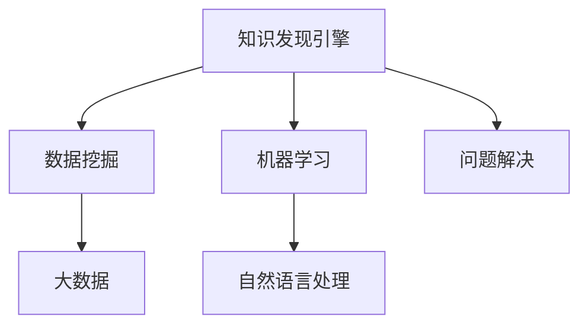

                 

# 程序员利用知识发现引擎提高解决问题的能力

> 关键词：知识发现引擎,问题解决,数据分析,机器学习,大数据

## 1. 背景介绍

### 1.1 问题由来
现代软件开发过程中，代码量日益增长，软件系统的复杂度不断提升。程序员面临的挑战已不再是简单的编写代码，而是如何更高效、更准确地解决复杂问题。传统的手工调试、测试和迭代开发方式已难以满足需求，需要借助智能化的工具和方法来提高问题解决的效率。

在这样的背景下，知识发现引擎作为一种新的智能化辅助工具应运而生。它利用机器学习和大数据分析技术，从历史数据和专家经验中挖掘出有价值的知识和模式，帮助程序员快速定位问题并提出解决方案。知识发现引擎的引入，为程序员提供了一种更高效、更智能的问题解决途径。

### 1.2 问题核心关键点
知识发现引擎的核心在于其通过算法自动从大量数据中挖掘出隐含的知识模式和规律，并基于这些知识辅助程序员解决问题。其核心功能包括：

- 知识挖掘：从代码库、日志文件、错误报告等数据中，自动提取关键信息，形成知识库。
- 问题定位：利用挖掘出的知识库，快速识别问题的根本原因。
- 解决方案生成：基于历史案例和知识库，生成多种可能的解决方案，供程序员选择。
- 知识更新：实时更新知识库，不断提升系统性能。

## 2. 核心概念与联系

### 2.1 核心概念概述

为了更好地理解知识发现引擎的工作原理和优势，本节将介绍几个密切相关的核心概念：

- 知识发现引擎(Knowledge Discovery Engine, KDE)：利用数据挖掘、机器学习等技术，自动从数据中发现规律和知识，辅助人类进行决策和问题解决的智能化系统。

- 数据挖掘(Data Mining)：从大量数据中自动发现模式、规则和异常的技术，常用于市场营销、客户分析等领域。

- 机器学习(Machine Learning, ML)：通过算法从数据中学习规律，构建模型并进行预测或决策的自动化技术。

- 大数据(Big Data)：涉及数据量庞大、数据种类繁多、数据来源分散、数据处理速度快的大规模数据集，常见于互联网、金融等领域。

- 自然语言处理(Natural Language Processing, NLP)：使计算机能够理解、解释和处理人类语言的技术，常用于文本挖掘、自动翻译等任务。

- 问题解决(Problem Solving)：通过分析问题、制定方案并实施的过程，以达成目标或解决矛盾的技术。

这些概念之间的逻辑关系可以通过以下Mermaid流程图来展示：



这个流程图展示了几大核心概念及其之间的关系：

1. 知识发现引擎通过数据挖掘和机器学习技术，从大数据中提取知识。
2. 自然语言处理技术可以处理非结构化文本数据，辅助知识发现引擎更准确地挖掘有价值的信息。
3. 知识发现引擎的目标是辅助问题解决，提高软件开发效率和质量。

## 3. 核心算法原理 & 具体操作步骤
### 3.1 算法原理概述

知识发现引擎的核心算法原理主要基于数据挖掘和机器学习的思想，通过自动分析大量数据，发现其中隐含的模式和规律，并应用于问题解决。其基本工作流程如下：

1. 数据预处理：对原始数据进行清洗、转换、归一化等预处理操作，使其符合后续算法的要求。
2. 特征提取：从处理后的数据中提取有用的特征，如词频、关键词、语法结构等。
3. 模型构建：基于提取的特征，选择合适的算法构建模型，如分类、聚类、关联规则等。
4. 知识发现：通过模型分析，自动发现数据中的模式、规则和异常。
5. 知识应用：将发现的规则和模式应用于问题解决，生成解决方案。

### 3.2 算法步骤详解

以下是知识发现引擎的详细操作步骤：

**Step 1: 数据收集和预处理**
- 收集项目相关的数据源，如代码库、日志文件、错误报告等。
- 对数据进行清洗和预处理，包括去除噪声、缺失值处理、特征选择等。

**Step 2: 特征提取**
- 利用自然语言处理技术，对文本数据进行分词、词性标注、命名实体识别等处理。
- 提取关键特征，如词频、TF-IDF值、代码行数、函数调用关系等。

**Step 3: 模型构建**
- 选择合适的机器学习算法，如决策树、随机森林、支持向量机等，构建分类或回归模型。
- 利用交叉验证等方法进行模型调参，优化模型性能。

**Step 4: 知识发现**
- 通过模型分析，识别出代码中的潜在问题，如代码重复、内存泄漏、性能瓶颈等。
- 提取问题描述和解决方案，生成知识库。

**Step 5: 知识应用**
- 根据问题描述，在知识库中查找相关的解决方案和最佳实践。
- 自动生成多种可能的解决方案，供程序员选择。

### 3.3 算法优缺点

知识发现引擎作为一种新兴的技术工具，具有以下优点：

- 自动化程度高：利用算法自动分析大量数据，减少人工干预，提高效率。
- 数据驱动：基于实际数据构建模型，发现潜在问题和解决方案，具有较强的可信度。
- 灵活性高：可以针对不同类型的问题，灵活调整算法和模型。
- 可扩展性强：能够处理大规模数据，适用于复杂的软件系统。

同时，也存在一些缺点：

- 数据质量要求高：算法的准确性和可靠性依赖于数据的质量。
- 模型解释性差：部分算法（如深度学习）缺乏可解释性，难以理解其决策过程。
- 算法复杂度高：某些算法（如集成学习）计算复杂，对计算资源有较高要求。
- 用户习惯问题：部分程序员习惯于传统的手工调试方式，可能对知识发现引擎的接受度不高。

### 3.4 算法应用领域

知识发现引擎在软件开发和维护过程中有广泛的应用，主要体现在以下几个方面：

- 代码质量检测：通过分析代码质量指标，发现潜在的代码问题。
- 性能优化：分析代码性能瓶颈，提出优化建议。
- 安全检测：检测代码中的潜在安全漏洞，避免安全事故。
- 版本管理：通过历史代码的版本追踪，自动生成版本控制建议。
- 问题定位：自动定位代码中的问题，生成详细的诊断报告。

## 4. 数学模型和公式 & 详细讲解 & 举例说明

### 4.1 数学模型构建

知识发现引擎的数学模型构建涉及多个步骤，以下是几个关键模型的简单介绍：

- **决策树模型**：通过对特征进行分治，构建一棵树形结构，用于分类或回归任务。决策树的每个节点表示一个特征，每个叶子节点表示一个类别或数值。

- **随机森林模型**：由多棵决策树组成，通过对多个决策树的预测结果进行平均或投票，提高模型的准确性和鲁棒性。

- **支持向量机模型**：通过构建最优超平面，实现分类或回归任务。支持向量机在处理高维数据时表现较好。

- **关联规则模型**：用于发现数据集中的频繁项集和关联规则，常用于市场篮分析。

### 4.2 公式推导过程

以决策树模型为例，其基本推导过程如下：

1. 设训练数据集为 $D=\{(x_i, y_i)\}_{i=1}^N$，其中 $x_i$ 为特征向量，$y_i$ 为类别标签。
2. 设当前节点的特征为 $f$，通过信息增益或基尼系数等指标，选择最优特征 $f^*$。
3. 对于特征 $f^*$，将其划分为若干子集，每个子集对应一个分支节点。
4. 递归地对每个子集进行上述过程，直到满足终止条件。
5. 将最终的决策树模型用于分类或回归任务。

**决策树的熵和信息增益公式**：
- 熵：$H(X)=-\sum_{i=1}^C p_i\log_2p_i$，其中 $C$ 为类别数目，$p_i$ 为属于类别 $i$ 的样本比例。
- 信息增益：$IG(f, D) = H(D) - \sum_{i=1}^C \frac{|D_i|}{|D|}H(D_i)$，其中 $D_i$ 为特征 $f$ 划分的子集。

### 4.3 案例分析与讲解

以下是一个简单的代码质量检测案例：

假设某软件项目的历史代码库中，存在多处代码重复问题。通过知识发现引擎，可以分析代码的重复度、重复行数等特征，构建决策树模型进行分类。

- **数据收集**：从代码库中提取代码行数、函数名、函数调用关系等特征。
- **特征选择**：选择重复行数和函数调用关系作为主要特征。
- **模型构建**：构建决策树模型，训练集为历史代码数据。
- **知识发现**：通过决策树模型，自动分类出代码重复的样本。
- **知识应用**：对于识别出的重复代码，给出修改建议和重构方案。

## 5. 项目实践：代码实例和详细解释说明
### 5.1 开发环境搭建

在进行知识发现引擎的实践前，我们需要准备好开发环境。以下是使用Python进行Scikit-Learn开发的环境配置流程：

1. 安装Anaconda：从官网下载并安装Anaconda，用于创建独立的Python环境。

2. 创建并激活虚拟环境：
```bash
conda create -n sklearn-env python=3.8 
conda activate sklearn-env
```

3. 安装Scikit-Learn：
```bash
conda install scikit-learn pandas numpy
```

4. 安装自然语言处理库：
```bash
pip install nltk textblob gensim
```

5. 安装其他工具包：
```bash
pip install matplotlib seaborn jupyter notebook ipython
```

完成上述步骤后，即可在`sklearn-env`环境中开始知识发现引擎的实践。

### 5.2 源代码详细实现

下面以代码质量检测为例，给出使用Scikit-Learn构建决策树模型的PyTorch代码实现。

```python
import pandas as pd
from sklearn.model_selection import train_test_split
from sklearn.tree import DecisionTreeClassifier
from sklearn.metrics import classification_report
from sklearn.preprocessing import LabelEncoder

# 数据准备
data = pd.read_csv('code_quality_data.csv')
X = data[['重复行数', '函数调用关系']]
y = LabelEncoder().fit_transform(data['标签'])

# 数据划分
X_train, X_test, y_train, y_test = train_test_split(X, y, test_size=0.2, random_state=42)

# 模型构建
model = DecisionTreeClassifier(max_depth=3, criterion='entropy')
model.fit(X_train, y_train)

# 模型评估
y_pred = model.predict(X_test)
print(classification_report(y_test, y_pred))
```

### 5.3 代码解读与分析

让我们再详细解读一下关键代码的实现细节：

**数据处理**：
- `pd.read_csv`：从CSV文件中读取数据，并转换为Pandas数据框。
- `LabelEncoder`：将标签转换为数值编码。

**模型构建**：
- `train_test_split`：将数据划分为训练集和测试集。
- `DecisionTreeClassifier`：构建决策树模型，设置最大深度和评价指标。
- `model.fit`：在训练集上拟合模型。

**模型评估**：
- `y_pred`：在测试集上预测标签。
- `classification_report`：生成分类指标报告，包括精确度、召回率、F1分数等。

**运行结果展示**：
输出分类指标报告，展示模型在测试集上的表现。

## 6. 实际应用场景

### 6.1 智能代码自动补全

知识发现引擎在智能代码自动补全中也发挥了重要作用。通过分析历史代码和文档，发现常见的代码片段和功能模块，生成自动补全建议，减少程序员的打字量。

在实践过程中，可以收集大量的代码库和文档数据，利用自然语言处理技术提取关键信息，构建词频分布模型，自动推荐相关代码片段。同时，通过统计代码片段的使用频率和流行度，生成优先级列表，提升代码补全的准确性。

### 6.2 代码审计和静态分析

知识发现引擎还可以用于代码审计和静态分析，帮助发现代码中的潜在问题和安全漏洞。通过分析代码结构、调用关系和运行时数据，发现代码重复、逻辑错误、内存泄漏等问题，及时修复，提升代码质量。

在实践中，可以构建依赖图、调用链等静态分析工具，结合知识发现引擎的算法，自动检测代码问题。对于检测到的潜在问题，系统可以给出详细的诊断报告和修复建议，供程序员参考。

### 6.3 性能优化

知识发现引擎在性能优化方面也有广泛应用。通过分析代码执行轨迹和资源消耗数据，发现性能瓶颈，自动生成优化方案。

在实践中，可以收集应用性能监控数据，利用关联规则模型等算法，发现频繁的函数调用和数据访问操作。系统可以给出优化建议，如调整算法、减少不必要的计算、缓存数据等。

### 6.4 未来应用展望

随着知识发现引擎的不断发展，未来将会在更多领域得到应用，为软件开发带来革命性影响：

- 自动化测试：通过自动生成测试用例和断言，提升测试效率和覆盖率。
- 需求分析：通过分析用户需求和历史数据，自动生成需求文档和功能模块。
- 知识管理：构建企业级知识库，帮助程序员快速查找相关文档和代码。
- 项目管理：通过分析项目进度和代码变动，自动生成项目报告和评估指标。

## 7. 工具和资源推荐
### 7.1 学习资源推荐

为了帮助开发者系统掌握知识发现引擎的理论基础和实践技巧，这里推荐一些优质的学习资源：

1. 《机器学习实战》系列书籍：深入浅出地介绍了机器学习的基本原理和常用算法，适合初学者和进阶开发者。

2. 《Python数据科学手册》书籍：全面介绍了数据科学中的各类工具和技术，包括数据挖掘、机器学习、自然语言处理等。

3. 《Python深度学习》书籍：介绍了深度学习的基本概念和常用算法，适合深度学习入门和进阶开发者。

4. 《知识发现：数据挖掘、统计学习和机器学习》课程：斯坦福大学开设的数据挖掘和机器学习课程，涵盖数据预处理、特征选择、模型评估等重要内容。

5. Kaggle平台：机器学习社区和数据集共享平台，提供了大量的数据集和竞赛，可以帮助开发者快速上手实践。

通过对这些资源的学习实践，相信你一定能够快速掌握知识发现引擎的精髓，并用于解决实际的软件开发问题。

### 7.2 开发工具推荐

高效的开发离不开优秀的工具支持。以下是几款用于知识发现引擎开发的常用工具：

1. Scikit-Learn：基于Python的机器学习库，提供了丰富的算法和工具，适合构建各种模型。

2. TensorFlow：由Google主导开发的深度学习框架，生产部署方便，适合大规模工程应用。

3. PyTorch：基于Python的开源深度学习框架，灵活动态的计算图，适合快速迭代研究。

4. Weights & Biases：模型训练的实验跟踪工具，可以记录和可视化模型训练过程中的各项指标，方便对比和调优。

5. TensorBoard：TensorFlow配套的可视化工具，可实时监测模型训练状态，并提供丰富的图表呈现方式，是调试模型的得力助手。

6. Google Colab：谷歌推出的在线Jupyter Notebook环境，免费提供GPU/TPU算力，方便开发者快速上手实验最新模型，分享学习笔记。

合理利用这些工具，可以显著提升知识发现引擎的开发效率，加快创新迭代的步伐。

### 7.3 相关论文推荐

知识发现引擎的研究发展日新月异，以下是几篇奠基性的相关论文，推荐阅读：

1. "The Elements of Statistical Learning" by T. Hastie et al.：全面介绍了统计学习方法，涵盖了回归、分类、聚类等基本算法，适合理论学习和实践应用。

2. "Pattern Recognition and Machine Learning" by C. Bishop：深入介绍了模式识别和机器学习的基本原理，包括贝叶斯方法、决策树、支持向量机等。

3. "A Survey of Statistical Learning Theory with an Emphasis on Consistency of Regularization" by V. Vapnik：系统介绍了统计学习理论和常用的正则化方法，适合理论研究和学习。

4. "Knowledge Discovery in Databases" by P. Indurkhya：全面介绍了数据挖掘和知识发现的各类技术和应用，适合实际开发和应用。

5. "Data Mining Techniques for High-Dimensional Data" by Y. Ye：介绍了高维数据分析和挖掘的方法和技术，适合数据科学和机器学习的应用开发。

这些论文代表了大规模数据分析和挖掘技术的发展脉络，帮助研究者掌握前沿理论和技术。

## 8. 总结：未来发展趋势与挑战

### 8.1 研究成果总结

本文对知识发现引擎的原理和应用进行了全面系统的介绍。首先阐述了知识发现引擎的背景和意义，明确了其在提升软件开发效率和质量方面的独特价值。其次，从原理到实践，详细讲解了知识发现引擎的数学模型和操作步骤，给出了完整的代码实例和运行结果展示。同时，本文还探讨了知识发现引擎在软件开发中的应用场景，展示了其在自动化测试、代码审计、性能优化等方面的广泛应用。最后，本文精选了知识发现引擎的学习资源、开发工具和相关论文，力求为读者提供全方位的技术指引。

通过本文的系统梳理，可以看到，知识发现引擎利用机器学习和大数据分析技术，从历史数据和专家经验中挖掘出有价值的知识和模式，辅助程序员解决问题。知识发现引擎的引入，为程序员提供了一种更高效、更智能的问题解决途径。

### 8.2 未来发展趋势

展望未来，知识发现引擎技术将呈现以下几个发展趋势：

1. 数据多样化。随着应用场景的扩展，数据类型和来源将更加多样化，知识发现引擎需要处理更多非结构化数据和实时数据。

2. 模型融合。知识发现引擎将结合多模态数据和多种算法，提供更加全面和精确的知识发现服务。

3. 智能化程度提升。利用深度学习等高级算法，知识发现引擎将具备更强的学习能力和推理能力。

4. 实时化。知识发现引擎将逐步实现实时分析和响应，提高问题解决的及时性。

5. 可解释性增强。知识发现引擎将提供更加透明和可解释的决策过程，帮助程序员理解和信任算法的输出。

6. 自动化程度提高。通过自动化任务分解和并行化计算，知识发现引擎将大幅提升问题解决效率。

以上趋势凸显了知识发现引擎技术的广阔前景。这些方向的探索发展，必将进一步提升知识发现引擎的性能和应用范围，为软件开发提供更强大的支持。

### 8.3 面临的挑战

尽管知识发现引擎技术已经取得了显著进展，但在迈向更加智能化、普适化应用的过程中，仍面临诸多挑战：

1. 数据质量问题。知识发现引擎的准确性依赖于高质量的数据，如何有效处理数据缺失和噪声，是亟待解决的问题。

2. 模型复杂性。部分算法（如深度学习）计算复杂，需要大量计算资源，如何优化模型性能，降低计算成本，是一个重要挑战。

3. 算法可解释性。部分算法的决策过程缺乏可解释性，难以理解其内部工作机制，如何增强算法的透明性，提高用户信任，是一个重要问题。

4. 跨领域适应性。知识发现引擎在不同领域和场景下的适应性还需进一步提高，如何泛化到更多应用场景，是一个重要挑战。

5. 数据隐私和安全。知识发现引擎涉及大量敏感数据，如何保护用户隐私和数据安全，是一个重要挑战。

6. 持续学习能力。知识发现引擎需要不断学习新知识，避免过时和遗忘，如何增强持续学习能力，是一个重要挑战。

这些挑战需要研究者不断探索和解决，推动知识发现引擎技术向更加智能化和普适化迈进。

### 8.4 研究展望

未来知识发现引擎的研究将从以下几个方向寻求新的突破：

1. 探索无监督学习和半监督学习方法。摆脱对大量标注数据的依赖，利用无监督学习和半监督学习技术，提高知识发现引擎的泛化能力和鲁棒性。

2. 研究多模态知识发现方法。将视觉、语音、文本等多模态数据融合，提高知识发现引擎的全面性和准确性。

3. 引入因果分析和博弈论工具。通过因果分析和博弈论方法，增强知识发现引擎的稳定性和可解释性，提高问题解决的合理性。

4. 加强模型自动调参能力。通过自动调参技术，提高知识发现引擎的模型优化效率，减少手动调参的工作量。

5. 构建企业级知识图谱。通过知识图谱技术，构建企业内部的知识图谱，增强知识发现引擎的领域适应性和应用范围。

6. 实现实时知识发现和应用。通过实时数据流处理和分布式计算，实现知识发现引擎的实时分析和应用。

这些研究方向将推动知识发现引擎技术向更加智能化、普适化和自动化迈进，为软件开发和系统运维提供更强大的支持。相信通过多领域的协同创新，知识发现引擎将开启软件开发的新纪元。

## 9. 附录：常见问题与解答

**Q1：知识发现引擎如何提高问题解决效率？**

A: 知识发现引擎通过自动分析大量历史数据，挖掘出有用的知识和模式，并辅助程序员快速定位问题。例如，通过分析历史代码，识别出常见的问题模式，自动生成问题报告和解决方案，减少程序员的调试时间和工作量。

**Q2：知识发现引擎是否需要大量的标注数据？**

A: 知识发现引擎主要依赖无监督学习和半监督学习方法，不需要大量的标注数据。部分算法（如关联规则、决策树）可以从数据中自动发现规律和规则，仅需少量标注数据进行模型优化。

**Q3：知识发现引擎是否适用于所有类型的软件项目？**

A: 知识发现引擎适用于大多数软件项目，特别是数据量较大、复杂性较高的项目。对于小规模或结构简单的项目，手动调试和测试可能更高效。

**Q4：知识发现引擎是否会带来额外的计算负担？**

A: 知识发现引擎的计算复杂度因算法而异，部分算法（如深度学习）可能需要较高的计算资源。但通过优化算法和参数，可以显著降低计算成本。

**Q5：知识发现引擎如何避免数据偏差？**

A: 知识发现引擎的模型构建和训练过程可以引入数据采样、正则化等技术，减少数据偏差的影响。同时，通过多数据源的融合和多样化数据的处理，提高模型的鲁棒性和泛化能力。

总之，知识发现引擎作为智能化辅助工具，通过自动分析大量数据，发现其中的规律和模式，帮助程序员快速定位和解决问题。虽然仍面临一些挑战，但通过持续的研究和优化，知识发现引擎将为软件开发带来革命性的变化。

