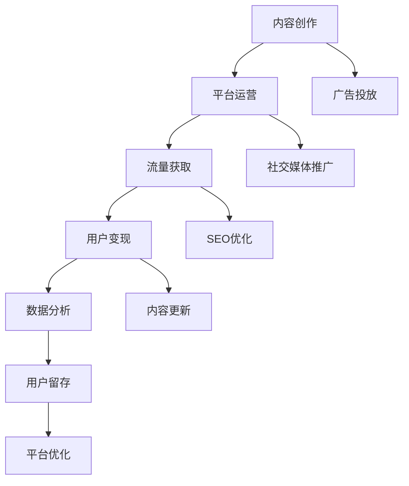

                 

# 程序员副业指南：知识付费项目启动攻略

在科技日新月异、AI浪潮席卷的今天，作为一名程序员，除了主业发展，副业探索也成为越来越多人的选择。知识付费项目作为新兴的副业模式，以其门槛低、收益高、内容多样化的特点，吸引了无数程序员加入。本文将从核心概念、算法原理、具体操作步骤、项目实践、实际应用场景等多个方面，深入探讨知识付费项目的启动攻略，帮助程序员更好地抓住商机，实现副业变现。

## 1. 背景介绍

### 1.1 问题由来

随着互联网和移动设备普及，知识获取和传播的方式发生了翻天覆地的变化。海量的在线课程、博客、视频教程等资源，让知识付费成为一种便捷高效的学习方式。无论是教育培训、技术分享，还是生活娱乐，各种知识付费平台都为内容创作者提供了新的变现途径。对于程序员而言，他们不仅具备了技术硬实力，还具备了丰富的项目经验和问题解决能力，成为知识付费项目的重要后备力量。

### 1.2 问题核心关键点

知识付费项目的核心关键点包括：
- 内容生产：如何设计优质内容，满足用户需求。
- 流量获取：如何吸引并保持用户，增加曝光度。
- 变现手段：如何有效实现收入转化，提升收益。
- 持续更新：如何不断更新内容，保持用户粘性。
- 数据分析：如何通过数据分析，优化内容质量和运营策略。

掌握这些关键点，是程序员成功启动知识付费项目的关键。

## 2. 核心概念与联系

### 2.1 核心概念概述

以下是知识付费项目启动过程中涉及的几个核心概念：

- **内容创作**：内容创作者根据市场需求，制作符合用户需求的知识内容，如在线课程、技术博客、视频教程等。
- **平台运营**：内容发布和传播平台，为内容创作者提供技术支持和运营支持，帮助其更好地推广内容。
- **流量获取**：通过各种方式吸引潜在用户访问内容，包括SEO优化、社交媒体推广、广告投放等。
- **用户变现**：通过付费订阅、付费下载、打赏、广告分成等方式，将流量转换为实际收入。
- **数据分析**：通过分析用户行为数据，优化内容推荐算法，提升用户满意度和留存率。

这些概念之间相互联系，构成了一个完整的知识付费项目运作框架。

### 2.2 核心概念原理和架构的 Mermaid 流程图



该图展示了知识付费项目从内容创作到变现的整个流程。内容创作是起点，平台运营是保障，流量获取和用户变现是实现收入的关键，数据分析是持续优化的重要手段。各环节之间相互依赖，形成一个闭环。

## 3. 核心算法原理 & 具体操作步骤

### 3.1 算法原理概述

知识付费项目的核心算法原理可以归纳为以下几个方面：

- **推荐算法**：根据用户行为和偏好，推荐最适合用户的内容，提高用户粘性和留存率。常见的推荐算法包括协同过滤、基于内容的推荐、深度学习推荐等。
- **流量预测**：预测未来流量变化趋势，帮助运营团队优化资源分配，降低成本。常用的流量预测方法包括时间序列分析、回归分析等。
- **个性化推荐**：根据用户特征和历史行为，个性化推荐内容，提升用户体验和满意度。这通常需要结合机器学习和数据分析技术。
- **用户画像构建**：通过对用户行为数据进行分析，构建用户画像，帮助运营团队更好地理解用户需求和行为，进行精准营销。

这些算法原理构成了知识付费项目的核心技术支撑，能够有效提升内容推荐效率和用户体验。

### 3.2 算法步骤详解

以下是知识付费项目启动的具体算法步骤：

1. **内容创作**：
   - 调研市场需求：通过调查问卷、访谈等方式，了解用户需求和痛点。
   - 设计课程大纲：根据市场需求，设计课程大纲，确保内容系统全面、实用。
   - 制作课程内容：根据大纲，制作课程PPT、视频、练习题等。

2. **平台搭建**：
   - 选择合适的平台：如腾讯课堂、网易云课堂、小鹅通等，根据需求选择合适的知识付费平台。
   - 设置课程信息：包括课程名称、简介、价格、课时等。
   - 添加课程素材：上传PPT、视频、练习题等课程内容。

3. **流量获取**：
   - 优化SEO：通过关键词优化、内部链接优化等方式，提升内容在搜索引擎中的排名。
   - 社交媒体推广：通过微博、微信、抖音等平台，发布课程预告、课程评价等，吸引流量。
   - 广告投放：在搜索引擎、社交媒体等平台进行广告投放，获取精准流量。

4. **用户变现**：
   - 设置付费方式：选择适合的付费方式，如付费订阅、单次购买、课程包等。
   - 集成支付系统：与第三方支付系统集成，确保支付流程流畅。
   - 开发邀请机制：通过用户推荐、课程评价等方式，给予用户激励，增加用户黏性。

5. **数据分析**：
   - 数据收集：通过日志、数据库等方式，收集用户行为数据。
   - 数据分析：利用数据挖掘、机器学习等技术，分析用户行为数据，优化推荐算法。
   - 结果反馈：根据数据分析结果，优化课程内容和运营策略，提升用户满意度和留存率。

### 3.3 算法优缺点

知识付费项目的核心算法具有以下优点：
- 提升内容推荐效率：通过推荐算法，能够快速精准地为用户推荐内容，提高用户满意度和留存率。
- 优化流量获取策略：通过流量预测和个性化推荐，能够有效获取高质量流量，降低运营成本。
- 提升用户转化率：通过数据分析，能够优化用户变现策略，提升课程销售转化率。

同时，这些算法也存在一些缺点：
- 技术要求高：需要一定的数据挖掘和机器学习技术，对技术要求较高。
- 数据隐私问题：用户行为数据涉及用户隐私，需要严格遵守相关法律法规。
- 维护成本高：需要持续更新和维护推荐算法，保持系统稳定运行。

### 3.4 算法应用领域

知识付费项目的核心算法广泛应用于以下领域：

- **教育培训**：为各类课程提供个性化推荐，提升学习效果。
- **技术分享**：为技术博客、视频教程等提供内容推荐和流量优化。
- **生活娱乐**：为生活技巧、兴趣爱好等提供内容推荐和用户互动。
- **企业培训**：为企业员工提供定制化培训内容，提升员工技能。

## 4. 数学模型和公式 & 详细讲解 & 举例说明

### 4.1 数学模型构建

知识付费项目涉及的数学模型包括：

- **协同过滤算法**：
  - **模型**：基于用户-物品评分矩阵，利用相似度计算推荐物品。
  - **公式**：
  $$
  \hat{y}_{ui} = \frac{\sum_{v \in N(u)} r_{vui} \times y_{vi}}{\sum_{v \in N(u)} r_{vui}}
  $$
  其中，$r_{vui}$ 表示用户$u$对物品$v$的评分，$y_{vi}$ 表示物品$v$的真实评分。

- **基于内容的推荐算法**：
  - **模型**：根据物品特征向量，利用余弦相似度计算推荐物品。
  - **公式**：
  $$
  \hat{y}_{ui} = \frac{\vec{u} \cdot \vec{v}}{\|\vec{u}\| \times \|\vec{v}\|}
  $$
  其中，$\vec{u}$ 表示用户特征向量，$\vec{v}$ 表示物品特征向量。

- **深度学习推荐算法**：
  - **模型**：利用神经网络模型，对用户和物品进行特征提取和表示学习，从而进行推荐。
  - **公式**：
  $$
  \hat{y}_{ui} = \text{sigmoid}(\vec{u} \times \vec{v} + \vec{b})
  $$
  其中，$\vec{u}$ 和 $\vec{v}$ 表示用户和物品的特征向量，$\vec{b}$ 为偏置向量，$\text{sigmoid}$ 为激活函数。

### 4.2 公式推导过程

协同过滤算法的推导如下：

假设用户$u$对物品$v$的评分记为$r_{uv}$，物品$v$的真实评分为$y_{vi}$，用户$u$对物品$v$的预测评分为$\hat{y}_{uv}$。根据协同过滤算法，我们可以根据用户$u$的其他物品评分$r_{uv}$，计算出用户$u$对物品$v$的预测评分：
$$
\hat{y}_{uv} = \frac{\sum_{v \in N(u)} r_{vui} \times y_{vi}}{\sum_{v \in N(u)} r_{vui}}
$$

其中，$N(u)$ 表示用户$u$评分过的物品集合。该公式利用了相似用户之间的评分信息，预测用户对未评分物品的评分，从而达到推荐的效果。

### 4.3 案例分析与讲解

以一个在线教育平台为例，该平台收集了用户对各类课程的评分数据。通过协同过滤算法，可以为用户推荐相似用户评分较高的课程，从而提高课程推荐效果。

## 5. 项目实践：代码实例和详细解释说明

### 5.1 开发环境搭建

要启动知识付费项目，首先需要搭建开发环境。以下是使用Python进行PyTorch开发的环境配置流程：

1. 安装Anaconda：从官网下载并安装Anaconda，用于创建独立的Python环境。
2. 创建并激活虚拟环境：
  ```bash
  conda create -n pytorch-env python=3.8 
  conda activate pytorch-env
  ```
3. 安装PyTorch：根据CUDA版本，从官网获取对应的安装命令。例如：
  ```bash
  conda install pytorch torchvision torchaudio cudatoolkit=11.1 -c pytorch -c conda-forge
  ```
4. 安装Transformers库：
  ```bash
  pip install transformers
  ```
5. 安装各类工具包：
  ```bash
  pip install numpy pandas scikit-learn matplotlib tqdm jupyter notebook ipython
  ```

完成上述步骤后，即可在`pytorch-env`环境中开始项目实践。

### 5.2 源代码详细实现

这里我们以一个简单的推荐系统为例，使用PyTorch进行代码实现。

首先，定义用户和物品的特征向量：

```python
import torch
import torch.nn as nn

# 用户特征向量
user_vec = torch.tensor([[0.2, 0.3, 0.1], [0.1, 0.4, 0.2]])

# 物品特征向量
item_vec = torch.tensor([[0.4, 0.2, 0.3], [0.3, 0.4, 0.1]])

# 评分矩阵
rating_matrix = torch.tensor([[5, 4, 3], [2, 4, 1]])
```

然后，定义推荐算法：

```python
class RecommendationModel(nn.Module):
    def __init__(self):
        super(RecommendationModel, self).__init__()
        self.fc1 = nn.Linear(3, 8)
        self.fc2 = nn.Linear(8, 1)
        self.sigmoid = nn.Sigmoid()
    
    def forward(self, user_vec, item_vec):
        x = self.fc1(torch.cat([user_vec, item_vec], dim=1))
        x = self.fc2(x)
        return self.sigmoid(x)

model = RecommendationModel()
```

接下来，进行模型训练：

```python
criterion = nn.BCELoss()
optimizer = torch.optim.Adam(model.parameters(), lr=0.01)

for epoch in range(100):
    model.train()
    for i in range(len(rating_matrix)):
        user_idx = i // 3
        item_idx = i % 3
        rating = rating_matrix[i]
        user_vec = user_vec[user_idx]
        item_vec = item_vec[item_idx]
        y_true = torch.tensor([rating])
        y_pred = model(user_vec, item_vec)
        loss = criterion(y_pred, y_true)
        optimizer.zero_grad()
        loss.backward()
        optimizer.step()
```

最后，测试推荐效果：

```python
model.eval()
user_vec = user_vec[0]
item_vec = item_vec[0]
y_pred = model(user_vec, item_vec)
y_pred
```

### 5.3 代码解读与分析

这里我们重点解读一下关键代码的实现细节：

- **用户特征向量和物品特征向量**：定义了用户和物品的特征向量，用于计算相似度。
- **评分矩阵**：定义了用户和物品之间的评分矩阵，用于训练推荐模型。
- **RecommendationModel类**：定义了推荐模型的结构，包括两个全连接层和激活函数。
- **模型训练**：通过Adam优化器进行模型训练，使用BCELoss作为损失函数。
- **模型测试**：对新用户和新物品进行推荐，得到预测评分。

## 6. 实际应用场景

### 6.1 教育培训

知识付费项目在教育培训领域有着广泛应用。程序员可以利用自身技术优势，制作各种编程语言、框架、算法等课程，为学生提供系统化的学习资源。通过平台运营和流量推广，这些课程可以迅速积累大量用户，实现收益变现。

### 6.2 技术分享

技术分享也是知识付费的重要应用场景。程序员可以将自己在工作中积累的技术经验、项目经验进行总结分享，帮助同行提升技术水平。这些课程和分享能够为程序员带来知名度和声誉，同时增加额外收入。

### 6.3 生活娱乐

生活娱乐领域的知识付费项目，如厨艺、旅行、阅读等，也为程序员提供了广阔的副业机会。利用自身的兴趣爱好和专业知识，程序员可以制作各种生活类课程，吸引志同道合的用户，实现内容变现。

## 7. 工具和资源推荐

### 7.1 学习资源推荐

以下是一些优质的学习资源，推荐程序员在项目启动前进行学习：

1. **《深度学习》书籍**：深度学习领域的经典教材，涵盖深度学习原理、算法和应用。
2. **Coursera和Udacity**：提供大量深度学习、机器学习等相关课程，适合系统学习。
3. **GitHub**：程序员可以在GitHub上查找和学习开源代码，提升编程能力和实践经验。
4. **Kaggle**：数据科学竞赛平台，提供大量数据集和竞赛，提升数据处理和模型优化能力。

### 7.2 开发工具推荐

以下是几款用于知识付费项目开发的常用工具：

1. **PyTorch**：基于Python的开源深度学习框架，灵活动态，适合快速迭代研究。
2. **TensorFlow**：由Google主导开发的开源深度学习框架，生产部署方便，适合大规模工程应用。
3. **Jupyter Notebook**：交互式编程环境，适合数据处理、模型训练和调试。
4. **Google Colab**：谷歌推出的在线Jupyter Notebook环境，免费提供GPU/TPU算力，适合快速实验和学习。

### 7.3 相关论文推荐

以下是一些与知识付费项目相关的经典论文，推荐程序员阅读：

1. **"Deep Learning for Recommender Systems"**：介绍深度学习在推荐系统中的应用。
2. **"Machine Learning for Software Engineering"**：介绍机器学习在软件开发中的应用。
3. **"Reinforcement Learning for Recommendation Systems"**：介绍强化学习在推荐系统中的应用。

## 8. 总结：未来发展趋势与挑战

### 8.1 总结

本文对知识付费项目启动过程中涉及的核心概念、算法原理、具体操作步骤等进行了全面系统的介绍。通过深入探讨内容创作、平台运营、流量获取、用户变现和数据分析等环节，帮助程序员更好地理解和实施知识付费项目。

### 8.2 未来发展趋势

未来，知识付费项目将呈现以下几个发展趋势：

1. **内容多样化**：知识付费项目将从单一课程向多元化内容转变，涵盖编程、金融、心理等多个领域。
2. **平台多样化**：知识付费平台将从单一平台向多平台拓展，如微信公众号、B站、抖音等。
3. **变现模式多样化**：除了课程销售，还将出现课程包、会员订阅、付费咨询等多种变现方式。
4. **个性化推荐**：基于机器学习和大数据分析，为每位用户提供个性化的内容推荐，提升用户体验。
5. **数据驱动**：通过大数据分析，优化内容创作和平台运营策略，提升运营效率和收益。

### 8.3 面临的挑战

尽管知识付费项目具有广阔的市场前景，但在实际运营中，仍面临以下挑战：

1. **内容质量**：如何持续生产高质量内容，满足用户需求，提升用户满意度。
2. **流量获取**：如何通过有效手段获取高质量流量，降低运营成本。
3. **用户留存**：如何保持用户粘性，提升用户留存率，实现长期收益。
4. **变现效率**：如何高效变现，提升收益，同时保证用户权益。
5. **数据分析**：如何通过数据分析，优化运营策略，提升运营效果。

### 8.4 研究展望

未来，知识付费项目的研究需要从以下几个方面进行探索：

1. **内容生成**：通过生成对抗网络、自然语言处理等技术，自动生成高质量课程内容。
2. **流量获取**：利用社交媒体、搜索引擎优化、广告投放等手段，提升流量获取效果。
3. **用户分析**：通过用户画像、用户行为分析等技术，深入了解用户需求，提供精准推荐。
4. **数据隐私**：在数据收集和分析过程中，严格遵守数据隐私法律法规，保障用户隐私。
5. **平台优化**：通过算法优化和系统改进，提升平台性能和用户体验。

通过这些研究方向的探索，相信知识付费项目将迎来更加广阔的发展空间，为程序员提供更多副业机会。

## 9. 附录：常见问题与解答

**Q1：如何设计优质内容？**

A: 设计优质内容需要考虑以下几个方面：
1. 用户需求：调研用户需求和痛点，制定课程大纲。
2. 系统全面：确保内容系统全面，涵盖基础知识、进阶内容、实战经验等。
3. 通俗易懂：使用通俗易懂的语言和实例，讲解复杂概念。
4. 互动交流：通过问答、作业、讨论等方式，增加互动交流，提升学习效果。

**Q2：如何吸引高质量流量？**

A: 吸引高质量流量需要综合考虑以下几个方面：
1. SEO优化：通过关键词优化、内部链接优化等方式，提升内容在搜索引擎中的排名。
2. 社交媒体推广：通过微博、微信、抖音等平台，发布课程预告、课程评价等，吸引流量。
3. 广告投放：在搜索引擎、社交媒体等平台进行广告投放，获取精准流量。

**Q3：如何提升用户留存？**

A: 提升用户留存需要以下几个方面：
1. 内容更新：持续更新课程内容，保持用户新鲜感。
2. 用户互动：通过问答、作业、讨论等方式，增加用户互动，提升用户粘性。
3. 推荐系统：利用推荐算法，为用户推荐感兴趣的内容。
4. 优惠活动：通过优惠券、折扣等方式，吸引用户续费。

**Q4：如何高效变现？**

A: 高效变现需要以下几个方面：
1. 多样化变现：除了课程销售，还可以考虑课程包、会员订阅、付费咨询等多种变现方式。
2. 精准定价：根据课程难度和市场需求，精准定价，提升收益。
3. 平台支持：利用平台流量和支付系统，降低运营成本。

**Q5：如何提升数据分析能力？**

A: 提升数据分析能力需要以下几个方面：
1. 数据收集：通过日志、数据库等方式，收集用户行为数据。
2. 数据分析：利用数据挖掘、机器学习等技术，分析用户行为数据，优化推荐算法。
3. 结果反馈：根据数据分析结果，优化课程内容和运营策略，提升用户满意度和留存率。

通过这些问题的解答，相信程序员能够更好地应对知识付费项目启动过程中遇到的各种挑战，实现副业变现。

