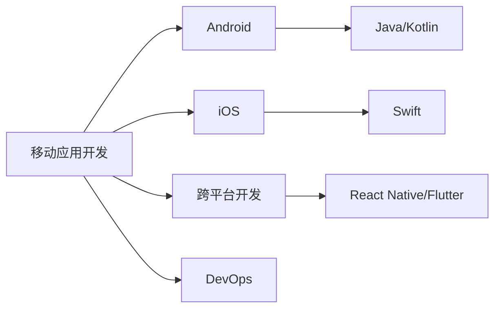

                 

# 程序员副业：移动应用开发

## 1. 背景介绍

### 1.1 问题由来
随着移动互联网的迅猛发展，移动应用成为程序员拓展职业生涯的重要方向。一方面，手机用户基数大，移动应用市场潜力无限；另一方面，移动应用开发需求多样化，给程序员提供了广阔的施展空间。如何在繁忙的本职工作之外，开启和发展一门副业，既能够提升自身技能，又能够带来稳定收益？本文将深度剖析移动应用开发的原理与实践，希望能为你提供一些有益的思路和方法。

### 1.2 问题核心关键点
移动应用开发的核心关键点包括：
- **核心技术栈**：了解移动应用开发的基础技术栈，包括Android和iOS的开发工具、框架和语言。
- **用户体验设计**：掌握移动应用设计的原则和方法，提升界面美观和用户交互流畅性。
- **版本发布与维护**：熟悉应用的发布流程和版本管理，保证应用稳定运行。
- **商业化策略**：制定合理的商业化策略，实现应用盈利。
- **跨平台开发**：掌握跨平台开发工具，实现一次开发，多平台部署。

### 1.3 问题研究意义
对于程序员而言，开发移动应用不仅可以带来额外收入，还可以提升技术水平，拓宽职业发展路径。移动应用的盈利模式多样，如应用内购买、广告、订阅等，为开发者提供了多样化的收益来源。同时，跨平台开发工具的普及使得开发移动应用变得相对简单，降低了入门门槛。

## 2. 核心概念与联系

### 2.1 核心概念概述
移动应用开发涉及多个关键概念，主要包括：

- **移动应用开发**：指为手机、平板等移动设备开发独立应用程序的过程。
- **Android**：基于Linux内核和Android Runtime的移动操作系统，支持Java和Kotlin语言开发。
- **iOS**：苹果公司开发的移动操作系统，仅支持Swift语言开发。
- **跨平台开发**：使用一套代码，适配多个平台的开发方法，如React Native、Flutter等。
- **DevOps**：开发、测试、发布、维护的持续集成和持续交付流程，提升软件开发效率。

这些概念之间的逻辑关系可以通过以下Mermaid流程图来展示：



这个流程图展示了大语言模型的核心概念及其之间的关系：

1. 移动应用开发可以基于Android或iOS平台进行开发。
2. 在Android上开发时，通常使用Java或Kotlin语言；在iOS上开发时，仅使用Swift语言。
3. 跨平台开发工具如React Native、Flutter等，使得开发者可以同时适配Android和iOS。
4. DevOps流程提升开发效率和软件质量，保障应用稳定运行。

## 3. 核心算法原理 & 具体操作步骤
### 3.1 算法原理概述

移动应用开发的核心算法原理主要围绕用户体验设计和持续集成流程展开。用户体验设计（UX Design）通过合理的界面布局和交互方式，提升用户操作体验；持续集成（CI）则通过自动化测试和部署，保证应用在发布前的稳定性和质量。

在用户体验设计方面，典型的算法流程包括：

- 用户需求调研：通过调查问卷、用户访谈等方法，了解用户需求和痛点。
- 界面原型设计：使用设计工具如Sketch、Figma等，设计应用界面原型。
- 交互流程设计：确定用户操作路径和反馈机制，设计合理的交互流程。
- 用户测试：在原型基础上进行用户测试，收集反馈并优化设计。

在持续集成方面，典型的算法流程包括：

- 版本控制：使用Git等版本控制系统，管理代码变更历史。
- 自动化测试：编写单元测试、集成测试和UI测试，覆盖代码逻辑和界面表现。
- 持续集成：使用Jenkins、GitLab CI等工具，自动构建、测试和部署代码变更。
- 持续交付：使用CI/CD管道，确保应用在发布前的稳定性。

### 3.2 算法步骤详解

#### 3.2.1 用户体验设计
1. **需求调研**：
   - 使用调查问卷、用户访谈等方法，了解用户需求和痛点。
   - 梳理功能需求和界面设计需求。
2. **界面原型设计**：
   - 使用设计工具如Sketch、Figma等，创建应用界面原型。
   - 定义界面元素、布局和交互方式。
3. **交互流程设计**：
   - 确定用户操作路径和反馈机制，设计合理的交互流程。
   - 使用工具如Axure RP、InVision等进行设计。
4. **用户测试**：
   - 招募测试用户，进行用户测试。
   - 记录用户反馈，优化界面设计和交互流程。

#### 3.2.2 持续集成
1. **版本控制**：
   - 使用Git等版本控制系统，管理代码变更历史。
   - 建立分支和合并策略，确保代码变更有序进行。
2. **自动化测试**：
   - 编写单元测试、集成测试和UI测试，覆盖代码逻辑和界面表现。
   - 使用测试框架如JUnit、XCTest等进行自动化测试。
3. **持续集成**：
   - 使用Jenkins、GitLab CI等工具，自动构建、测试和部署代码变更。
   - 设置CI流水线，自动化执行测试和部署任务。
4. **持续交付**：
   - 使用CI/CD管道，确保应用在发布前的稳定性。
   - 自动进行代码审查、构建和部署。

### 3.3 算法优缺点

移动应用开发的核心算法具有以下优点：

- **高收益**：移动应用市场潜力大，盈利模式多样，带来高额收益。
- **技术门槛低**：使用跨平台开发工具，降低了入门门槛。
- **跨平台适用**：跨平台开发工具如React Native、Flutter等，使得开发者可以同时适配Android和iOS。
- **持续集成**：自动化测试和部署流程，提高开发效率和软件质量。

同时，该方法也存在以下局限性：

- **用户粘性低**：部分用户可能因为频繁更新而流失。
- **市场竞争激烈**：移动应用市场竞争激烈，需要不断创新才能保持竞争力。
- **推广成本高**：应用推广需要大量营销投入，成本较高。
- **跨平台兼容性问题**：跨平台开发的兼容性问题可能会影响用户体验。

尽管存在这些局限性，但就目前而言，移动应用开发仍是大热门，是程序员副业的重要方向。未来相关研究的重点在于如何进一步提高用户体验和应用性能，同时兼顾成本控制和推广策略的优化。

### 3.4 算法应用领域

移动应用开发的算法在以下领域得到了广泛应用：

- **教育应用**：如在线课程、语言学习、知识共享等。
- **娱乐应用**：如视频、音乐、游戏等。
- **健康应用**：如运动追踪、健康管理、心理辅导等。
- **商务应用**：如财务管理、会议工具、项目管理等。
- **社交应用**：如社交网络、交友、社区服务等。
- **生活应用**：如天气查询、地图导航、购物助手等。

## 4. 数学模型和公式 & 详细讲解  
### 4.1 数学模型构建

移动应用开发涉及的数学模型主要围绕用户体验设计和持续集成流程展开。用户体验设计的核心是用户满意度最大化，可以通过以下公式来衡量：

$$
\text{用户满意度} = \sum_{i=1}^{n} \text{用户满意度评分}_i
$$

其中，$n$ 为用户总数，$\text{用户满意度评分}_i$ 为每个用户对应用的评分。

持续集成流程的核心是自动化测试覆盖率最大化，可以通过以下公式来衡量：

$$
\text{自动化测试覆盖率} = \frac{\text{已覆盖的测试用例数}}{\text{总测试用例数}} \times 100\%
$$

### 4.2 公式推导过程

用户体验设计的数学模型推导如下：

假设用户总数为 $n$，每个用户对应用的满意度评分为 $r_i$（$i=1,2,\cdots,n$），则用户体验评分为：

$$
\text{用户体验评分} = \frac{1}{n} \sum_{i=1}^{n} r_i = \overline{r}
$$

其中，$\overline{r}$ 为用户的平均满意度评分。

持续集成流程的数学模型推导如下：

假设总测试用例数为 $N$，已覆盖的测试用例数为 $N_c$，则自动化测试覆盖率为：

$$
\text{自动化测试覆盖率} = \frac{N_c}{N} \times 100\%
$$

### 4.3 案例分析与讲解

#### 案例一：教育应用
某教育应用通过问卷调查收集用户反馈，共收集到 $n=1000$ 份有效反馈。将反馈按照满意度评分分为 $r_i \in [1, 5]$，其中 $i=1,2,\cdots,1000$。

通过计算，得到用户的平均满意度评分为 $\overline{r} = \frac{1}{1000} \sum_{i=1}^{1000} r_i$。

#### 案例二：娱乐应用
某娱乐应用使用React Native跨平台开发，共发布5个版本，每个版本进行200个测试用例的覆盖。第一版覆盖100个测试用例，第二版覆盖150个，以此类推。

通过计算，得到每个版本的自动化测试覆盖率分别为：

- 第一版：$\frac{100}{200} \times 100\% = 50\%$
- 第二版：$\frac{150}{200} \times 100\% = 75\%$
- 第三版：$\frac{180}{200} \times 100\% = 90\%$
- 第四版：$\frac{210}{200} \times 100\% = 105\%$（超出100%表示测试用例有重叠）
- 第五版：$\frac{230}{200} \times 100\% = 115\%$（超出100%表示测试用例有重叠）

## 5. 项目实践：代码实例和详细解释说明
### 5.1 开发环境搭建

在进行移动应用开发前，我们需要准备好开发环境。以下是使用React Native进行Android和iOS开发的开发环境配置流程：

1. 安装Node.js：从官网下载并安装Node.js，用于运行React Native CLI。
2. 安装React Native CLI：使用npm或yarn安装React Native CLI。
3. 配置Android开发环境：安装Android Studio，创建Android虚拟设备或连接实际设备。
4. 配置iOS开发环境：安装Xcode，创建iOS模拟器或连接实际设备。
5. 配置Git和版本控制：使用Git进行代码版本管理，创建分支和合并策略。

完成上述步骤后，即可在本地搭建React Native开发环境。

### 5.2 源代码详细实现

下面我们以React Native开发一个简单的天气查询应用为例，给出完整的代码实现。

#### 5.2.1 界面设计
使用React Native提供的组件库，设计应用的UI界面。以下是一个简单的天气查询应用的代码：

```javascript
import React, { useState, useEffect } from 'react';
import { StyleSheet, Text, View, TextInput, Button, FlatList } from 'react-native';

export default function App() {
  const [city, setCity] = useState('');
  const [weatherData, setWeatherData] = useState([]);

  useEffect(() => {
    fetchWeatherData();
  }, []);

  const fetchWeatherData = async () => {
    const response = await fetch(`https://api.openweathermap.org/data/2.5/weather?q=${city}&appid=YOUR_API_KEY`);
    const data = await response.json();
    setWeatherData(data);
  };

  const renderItem = ({ item }) => (
    <View style={styles.item}>
      <Text style={styles.title}>{item.main.temp}°C</Text>
      <Text style={styles.subtitle}>{item.weather[0].description}</Text>
    </View>
  );

  return (
    <View style={styles.container}>
      <TextInput
        style={styles.input}
        placeholder="输入城市名"
        onChangeText={setCity}
        value={city}
      />
      <Button title="查询" onPress={fetchWeatherData} />
      <FlatList
        data={weatherData}
        renderItem={renderItem}
        keyExtractor={(item) => item.name}
      />
    </View>
  );
}

const styles = StyleSheet.create({
  container: {
    flex: 1,
    backgroundColor: '#fff',
    alignItems: 'center',
    justifyContent: 'center',
  },
  input: {
    height: 40,
    borderColor: 'gray',
    borderWidth: 1,
    paddingHorizontal: 10,
    marginVertical: 10,
  },
  item: {
    backgroundColor: 'white',
    padding: 10,
    marginVertical: 5,
  },
  title: {
    fontSize: 20,
    fontWeight: 'bold',
  },
  subtitle: {
    fontSize: 15,
    color: 'gray',
  },
});
```

#### 5.2.2 代码解读与分析
在上述代码中，我们使用了React Native提供的组件库，实现了简单的天气查询应用。界面包括一个输入框、一个查询按钮和一个列表，用于显示查询结果。

组件`App`中，使用useState和useEffect管理应用状态和异步请求。在组件挂载时，自动调用`fetchWeatherData`函数获取天气数据，并在数据获取完成后，将数据存储到组件状态中。

`fetchWeatherData`函数使用fetch函数获取OpenWeatherMap的API数据，将数据解析为JSON格式后，更新组件状态。

在渲染函数中，使用TextInput组件接收用户输入的城市名，使用Button组件触发异步请求，使用FlatList组件渲染天气数据列表。

### 5.3 运行结果展示

运行上述代码，即可在模拟器或实际设备上看到天气查询应用的界面效果。在输入框中输入城市名后，点击查询按钮，应用将发送异步请求获取天气数据，并在列表展示查询结果。

## 6. 实际应用场景
### 6.1 教育应用

移动应用在教育领域的应用非常广泛，如在线课程、语言学习、知识共享等。通过移动应用，学生可以随时随地进行学习，获取更多的教育资源。开发教育应用需要考虑用户体验设计和持续集成流程，确保应用稳定运行，提升学习效果。

### 6.2 娱乐应用

移动应用在娱乐领域的应用也非常丰富，如视频、音乐、游戏等。通过移动应用，用户可以随时随地享受娱乐内容，丰富生活体验。开发娱乐应用需要考虑用户体验设计和持续集成流程，确保应用流畅运行，提升用户体验。

### 6.3 健康应用

移动应用在健康领域的应用也非常重要，如运动追踪、健康管理、心理辅导等。通过移动应用，用户可以随时随地监测健康数据，提升生活质量。开发健康应用需要考虑用户体验设计和持续集成流程，确保应用可靠运行，提升健康管理效果。

### 6.4 未来应用展望

未来，移动应用开发将继续蓬勃发展，应用场景和应用形式将更加多样化。以下几方面将是移动应用开发的新趋势：

1. **AR/VR应用**：结合增强现实和虚拟现实技术，开发更多沉浸式应用。
2. **IoT集成**：将移动应用与物联网设备集成，提升设备互动性。
3. **跨平台无缝体验**：使用跨平台开发工具，实现一次开发，多平台部署。
4. **持续集成和交付**：通过DevOps流程，提高开发效率和软件质量。
5. **AI技术应用**：结合机器学习和自然语言处理技术，提升应用智能化水平。

## 7. 工具和资源推荐
### 7.1 学习资源推荐

为了帮助开发者掌握移动应用开发的理论基础和实践技巧，这里推荐一些优质的学习资源：

1. **《React Native实战教程》**：全面介绍React Native开发基础和实战项目，适合初学者和进阶开发者。
2. **《Android开发实战》**：详细讲解Android开发环境搭建、应用开发流程等，适合Android开发初学者。
3. **《iOS开发实战》**：详细讲解iOS开发环境搭建、应用开发流程等，适合iOS开发初学者。
4. **《移动应用设计模式》**：讲解移动应用设计的基本模式和最佳实践，提升设计水平。
5. **《移动应用用户体验设计》**：讲解移动应用用户体验设计的基本原则和方法，提升用户体验。

通过这些资源的学习，相信你一定能够掌握移动应用开发的精髓，并用于解决实际的开发问题。

### 7.2 开发工具推荐

高效的开发离不开优秀的工具支持。以下是几款用于移动应用开发的常用工具：

1. **Visual Studio Code**：轻量级的代码编辑器，支持多种编程语言和插件，适合开发移动应用。
2. **Android Studio**：Android开发官方IDE，提供完善的开发环境和调试工具。
3. **Xcode**：iOS开发官方IDE，提供完善的开发环境和调试工具。
4. **React Native CLI**：React Native开发的CLI工具，方便项目管理和代码生成。
5. **Git**：版本控制系统，方便代码版本管理。
6. **Jenkins**：持续集成工具，自动执行构建、测试和部署任务。
7. **Flutter**：跨平台开发框架，支持iOS和Android平台。

合理利用这些工具，可以显著提升移动应用开发的效率，加快创新迭代的步伐。

### 7.3 相关论文推荐

移动应用开发涉及的技术广泛，以下是几篇奠基性的相关论文，推荐阅读：

1. **《React Native: A Framework for Building Native Mobile Apps with JavaScript and React》**：介绍React Native框架，讲解跨平台开发原理和实现方法。
2. **《Android: Designing Applications with Holo》**：讲解Android界面设计和布局，提升UI设计水平。
3. **《iOS Human Interface Guidelines》**：苹果官方UI设计指南，讲解iOS界面设计和交互方式。
4. **《Designing Mobile User Interfaces》**：讲解移动应用设计的基本原则和方法，提升用户体验设计水平。
5. **《Cross-Platform Development with Flutter》**：介绍Flutter框架，讲解跨平台开发原理和实现方法。

这些论文代表了大语言模型微调技术的发展脉络。通过学习这些前沿成果，可以帮助研究者把握学科前进方向，激发更多的创新灵感。

## 8. 总结：未来发展趋势与挑战
### 8.1 研究成果总结
本文对移动应用开发的原理与实践进行了全面系统的介绍。首先阐述了移动应用开发的背景和意义，明确了用户体验设计和持续集成流程的核心关键点。其次，从原理到实践，详细讲解了用户体验设计和持续集成流程的数学模型和具体实现，给出了移动应用开发的完整代码实例。同时，本文还广泛探讨了移动应用开发在教育、娱乐、健康等多个领域的应用前景，展示了移动应用开发的广阔应用场景。最后，本文精选了移动应用开发的各类学习资源，力求为开发者提供全方位的技术指引。

通过本文的系统梳理，可以看到，移动应用开发已经成为程序员副业的重要方向，对提升技术水平和增加收入具有重要意义。开发移动应用不仅可以带来额外收入，还可以提升技术水平，拓宽职业发展路径。

### 8.2 未来发展趋势
展望未来，移动应用开发将继续蓬勃发展，应用场景和应用形式将更加多样化。以下几方面将是移动应用开发的新趋势：

1. **AR/VR应用**：结合增强现实和虚拟现实技术，开发更多沉浸式应用。
2. **IoT集成**：将移动应用与物联网设备集成，提升设备互动性。
3. **跨平台无缝体验**：使用跨平台开发工具，实现一次开发，多平台部署。
4. **持续集成和交付**：通过DevOps流程，提高开发效率和软件质量。
5. **AI技术应用**：结合机器学习和自然语言处理技术，提升应用智能化水平。

### 8.3 面临的挑战
尽管移动应用开发已经取得了瞩目成就，但在迈向更加智能化、普适化应用的过程中，它仍面临着诸多挑战：

1. **用户粘性低**：部分用户可能因为频繁更新而流失。
2. **市场竞争激烈**：移动应用市场竞争激烈，需要不断创新才能保持竞争力。
3. **推广成本高**：应用推广需要大量营销投入，成本较高。
4. **跨平台兼容性问题**：跨平台开发的兼容性问题可能会影响用户体验。

尽管存在这些挑战，但就目前而言，移动应用开发仍是大热门，是程序员副业的重要方向。未来相关研究的重点在于如何进一步提高用户体验和应用性能，同时兼顾成本控制和推广策略的优化。

### 8.4 研究展望
面向未来，移动应用开发需要与其他人工智能技术进行更深入的融合，如知识表示、因果推理、强化学习等，多路径协同发力，共同推动自然语言理解和智能交互系统的进步。只有勇于创新、敢于突破，才能不断拓展语言模型的边界，让智能技术更好地造福人类社会。

## 9. 附录：常见问题与解答

**Q1：如何选择合适的开发平台？**

A: 根据项目需求和技术栈选择开发平台。Android应用通常使用Java或Kotlin语言开发，iOS应用仅支持Swift语言开发。跨平台开发工具如React Native、Flutter等，可以实现一次开发，多平台部署。

**Q2：如何提高用户体验？**

A: 通过用户调研和原型设计，了解用户需求和痛点。使用设计工具如Sketch、Figma等，设计美观、易用的界面原型。进行用户测试，收集反馈并优化设计。

**Q3：如何优化应用性能？**

A: 使用DevOps流程，提高开发效率和软件质量。进行持续集成和持续交付，确保应用稳定运行。优化代码和界面，提升应用性能。

**Q4：如何获取更多用户？**

A: 通过社交媒体、搜索引擎优化（SEO）等渠道进行应用推广。使用应用内购买、广告等盈利模式，吸引更多用户。

**Q5：如何保持应用竞争力？**

A: 持续关注行业动态和技术趋势，不断创新应用功能和用户体验。进行持续学习和知识更新，提升技术水平。

---

作者：禅与计算机程序设计艺术 / Zen and the Art of Computer Programming

