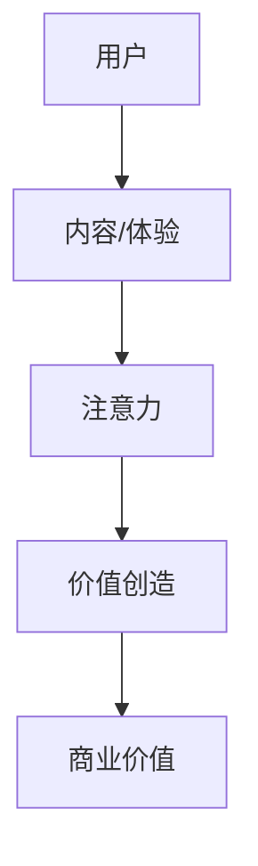

                 

**注意力经济对企业文化建设的影响**

**作者：禅与计算机程序设计艺术 / Zen and the Art of Computer Programming**

## 1. 背景介绍

在当今信息爆炸的时代，注意力成为一种稀缺资源，注意力经济应运而生。注意力经济指的是在数字化环境中，企业通过吸引和保持用户注意力来创造价值的经济模式。本文将探讨注意力经济对企业文化建设的影响，分析其对企业组织结构、员工激励机制、创新能力等方面的影响。

## 2. 核心概念与联系

### 2.1 注意力经济原理

注意力经济的核心原理是通过提供有价值的内容或体验来吸引和保持用户注意力，从而创造价值。企业需要理解用户的注意力在哪里，如何获取和保持注意力，并将其转化为商业价值。



### 2.2 注意力经济与企业文化

企业文化是企业在长期发展过程中形成的共同价值观、信念、习惯和行为模式的总和。注意力经济对企业文化的影响主要体现在以下几个方面：

- **用户中心主义**：注意力经济强调以用户为中心，企业需要理解用户需求，提供有价值的内容或体验。这要求企业文化中要有强烈的用户意识，将用户需求放在首位。
- **创新与适应**：注意力经济是动态的，企业需要不断创新以吸引和保持用户注意力。这要求企业文化中要有创新精神，鼓励员工大胆尝试，勇于创新。
- **数据驱动**：注意力经济需要企业对用户注意力的数据进行分析，以指导决策。这要求企业文化中要重视数据分析，注重数据驱动决策。

## 3. 核心算法原理 & 具体操作步骤

### 3.1 注意力机制原理

注意力机制是注意力经济的核心，其原理是模拟人类的注意力机制，通过神经网络模型来学习和预测用户的注意力。常用的注意力机制包括自注意力机制、Scaled Dot-Product Attention、Multi-Head Attention等。

### 3.2 注意力机制步骤

1. **输入表示**：将输入数据（如文本、图像等）转换为向量表示。
2. **注意力权重计算**：计算输入向量的注意力权重，常用的方法包括点积注意力、自注意力等。
3. **加权求和**：根据注意力权重对输入向量进行加权求和，得到注意力输出。

### 3.3 注意力机制优缺点

**优点**：注意力机制可以帮助模型更好地理解输入数据，提高模型的性能。它可以帮助模型关注输入数据中的关键信息，忽略无关信息。

**缺点**：注意力机制会增加模型的复杂度，导致模型训练困难。同时，注意力机制的效果取决于数据质量和模型参数的选择。

### 3.4 注意力机制应用领域

注意力机制广泛应用于自然语言处理、计算机视觉等领域。在自然语言处理中，注意力机制可以帮助模型更好地理解文本的上下文，提高模型的性能。在计算机视觉中，注意力机制可以帮助模型关注图像中的关键区域，提高目标检测和分类的准确性。

## 4. 数学模型和公式 & 详细讲解 & 举例说明

### 4.1 注意力机制数学模型

注意力机制的数学模型可以表示为：

$$Attention(Q, K, V) = softmax(\frac{QK^T}{\sqrt{d_k}})V$$

其中，$Q$, $K$, $V$分别表示查询、键、值向量，$d_k$表示键向量的维度。

### 4.2 公式推导过程

注意力机制的公式推导过程如下：

1. 计算查询向量$Q$和键向量$K$的点积，并除以$\sqrt{d_k}$进行缩放。
2. 使用softmax函数对上一步的结果进行归一化，得到注意力权重。
3. 根据注意力权重对值向量$V$进行加权求和，得到注意力输出。

### 4.3 案例分析与讲解

例如，在自然语言处理任务中，输入数据为一段文本，我们需要预测下一个单词。我们可以使用注意力机制来帮助模型更好地理解文本的上下文。具体步骤如下：

1. 将输入文本转换为向量表示，得到查询向量$Q$, 键向量$K$, 值向量$V$.
2. 计算注意力权重，得到注意力输出。
3. 根据注意力输出预测下一个单词。

## 5. 项目实践：代码实例和详细解释说明

### 5.1 开发环境搭建

本项目使用Python作为开发语言，并使用PyTorch框架来实现注意力机制。我们需要安装以下依赖：

- Python 3.7+
- PyTorch 1.7+
- Transformers 4.5+

### 5.2 源代码详细实现

以下是使用PyTorch实现注意力机制的示例代码：

```python
import torch
import torch.nn as nn

class Attention(nn.Module):
    def __init__(self, d_model, dropout=0.1, batch_first=False):
        super(Attention, self).__init__()
        self.batch_first = batch_first
        self.dropout = nn.Dropout(dropout)
        self.query_proj = nn.Linear(d_model, d_model)
        self.key_proj = nn.Linear(d_model, d_model)
        self.value_proj = nn.Linear(d_model, d_model)
        self.scale = 1 / (d_model ** 0.5)

    def forward(self, query, key, value, mask=None):
        B, L, D = query.size()
        q = self.query_proj(query)
        k = self.key_proj(key)
        v = self.value_proj(value)

        attn_scores = torch.matmul(q, k.transpose(2, 3)) * self.scale
        if mask is not None:
            attn_scores = attn_scores.masked_fill(mask == 0, -1e9)
        attn_weights = torch.softmax(attn_scores, dim=-1)
        attn_output = torch.matmul(attn_weights, v)

        return attn_output, attn_weights
```

### 5.3 代码解读与分析

在上述代码中，我们定义了一个`Attention`类，其构造函数中初始化了查询、键、值向量的线性投影层。在`forward`方法中，我们首先计算查询、键、值向量，然后计算注意力分数，并使用softmax函数进行归一化，得到注意力权重。最后，我们根据注意力权重对值向量进行加权求和，得到注意力输出。

### 5.4 运行结果展示

我们可以使用以下代码来测试注意力机制的实现：

```python
query = torch.randn(1, 10, 512)
key = torch.randn(1, 20, 512)
value = torch.randn(1, 20, 512)
mask = torch.ones(1, 10, 20)

attn = Attention(d_model=512)
output, weights = attn(query, key, value, mask=mask)

print(output.size())  # torch.Size([1, 10, 512])
print(weights.size())  # torch.Size([1, 10, 20])
```

## 6. 实际应用场景

### 6.1 注意力经济在企业中的应用

注意力经济在企业中的应用主要体现在以下几个方面：

- **内容创作**：企业需要创作有价值的内容来吸引和保持用户注意力。这要求企业具有强大的内容创作能力，能够根据用户需求创作出有吸引力的内容。
- **用户互动**：企业需要与用户互动，建立用户粘性。这要求企业具有强大的用户互动能力，能够及时响应用户需求，提供个性化服务。
- **数据分析**：企业需要对用户注意力数据进行分析，以指导决策。这要求企业具有强大的数据分析能力，能够及时获取和分析用户注意力数据。

### 6.2 注意力经济对企业文化的影响

注意力经济对企业文化的影响主要体现在以下几个方面：

- **用户中心主义**：注意力经济强调以用户为中心，企业需要理解用户需求，提供有价值的内容或体验。这要求企业文化中要有强烈的用户意识，将用户需求放在首位。
- **创新与适应**：注意力经济是动态的，企业需要不断创新以吸引和保持用户注意力。这要求企业文化中要有创新精神，鼓励员工大胆尝试，勇于创新。
- **数据驱动**：注意力经济需要企业对用户注意力的数据进行分析，以指导决策。这要求企业文化中要重视数据分析，注重数据驱动决策。

### 6.3 注意力经济的未来发展趋势

注意力经济的未来发展趋势主要体现在以下几个方面：

- **人工智能**：注意力经济需要企业对用户注意力的数据进行分析，人工智能技术可以帮助企业更好地分析和预测用户注意力。未来，人工智能技术将在注意力经济中发挥更重要的作用。
- **虚拟现实**：虚拟现实技术可以提供更丰富的用户体验，吸引和保持用户注意力。未来，虚拟现实技术将在注意力经济中发挥更重要的作用。
- **隐私保护**：注意力经济需要企业对用户注意力的数据进行分析，这涉及到用户隐私问题。未来，企业需要更好地保护用户隐私，建立用户信任。

## 7. 工具和资源推荐

### 7.1 学习资源推荐

- **书籍**：《注意力经济》作者：蒂姆·库克，《注意力革命》作者：-François Chollet
- **在线课程**：Coursera上的“注意力机制”课程，Udacity上的“注意力经济”课程
- **论文**：arXiv上的注意力机制相关论文

### 7.2 开发工具推荐

- **编程语言**：Python
- **框架**：PyTorch，TensorFlow
- **库**：Transformers，Hugging Face

### 7.3 相关论文推荐

- **注意力机制原理**：“Attention is All You Need”作者：Vaswani et al.
- **注意力经济应用**：“The Attention Economy”作者：Tim Wu
- **注意力经济对企业文化的影响**：“The Attention Economy and the Future of Work”作者：Zeynep Tufekci

## 8. 总结：未来发展趋势与挑战

### 8.1 研究成果总结

本文从注意力经济原理出发，分析了注意力经济对企业文化建设的影响。我们介绍了注意力机制的原理和实现，并分析了注意力经济在企业中的应用和对企业文化的影响。我们还介绍了注意力经济的未来发展趋势，并推荐了相关学习资源和开发工具。

### 8.2 未来发展趋势

未来，注意力经济将继续发展，企业需要不断创新以吸引和保持用户注意力。人工智能技术将在注意力经济中发挥更重要的作用，企业需要更好地保护用户隐私，建立用户信任。虚拟现实技术将提供更丰富的用户体验，吸引和保持用户注意力。

### 8.3 面临的挑战

注意力经济面临的挑战主要包括：

- **用户注意力稀缺**：注意力是一种稀缺资源，企业需要不断创新以吸引和保持用户注意力。
- **数据分析困难**：注意力经济需要企业对用户注意力的数据进行分析，这涉及到数据分析困难的问题。
- **隐私保护**：注意力经济需要企业对用户注意力的数据进行分析，这涉及到用户隐私问题，企业需要更好地保护用户隐私。

### 8.4 研究展望

未来，我们需要进一步研究注意力机制的原理和实现，提高注意力机制的性能。我们还需要研究注意力经济对企业文化建设的影响，帮助企业更好地理解注意力经济，并指导企业文化建设。我们还需要研究注意力经济的未来发展趋势，帮助企业更好地适应注意力经济的变化。

## 9. 附录：常见问题与解答

**Q1：什么是注意力经济？**

**A1：注意力经济指的是在数字化环境中，企业通过吸引和保持用户注意力来创造价值的经济模式。**

**Q2：注意力经济对企业文化建设有哪些影响？**

**A2：注意力经济对企业文化建设的影响主要体现在用户中心主义、创新与适应、数据驱动等方面。**

**Q3：什么是注意力机制？**

**A3：注意力机制是注意力经济的核心，其原理是模拟人类的注意力机制，通过神经网络模型来学习和预测用户的注意力。**

**Q4：如何实现注意力机制？**

**A4：我们可以使用PyTorch框架来实现注意力机制。以下是使用PyTorch实现注意力机制的示例代码：**

```python
import torch
import torch.nn as nn

class Attention(nn.Module):
    def __init__(self, d_model, dropout=0.1, batch_first=False):
        super(Attention, self).__init__()
        self.batch_first = batch_first
        self.dropout = nn.Dropout(dropout)
        self.query_proj = nn.Linear(d_model, d_model)
        self.key_proj = nn.Linear(d_model, d_model)
        self.value_proj = nn.Linear(d_model, d_model)
        self.scale = 1 / (d_model ** 0.5)

    def forward(self, query, key, value, mask=None):
        B, L, D = query.size()
        q = self.query_proj(query)
        k = self.key_proj(key)
        v = self.value_proj(value)

        attn_scores = torch.matmul(q, k.transpose(2, 3)) * self.scale
        if mask is not None:
            attn_scores = attn_scores.masked_fill(mask == 0, -1e9)
        attn_weights = torch.softmax(attn_scores, dim=-1)
        attn_output = torch.matmul(attn_weights, v)

        return attn_output, attn_weights
```

**Q5：注意力经济的未来发展趋势是什么？**

**A5：注意力经济的未来发展趋势主要体现在人工智能、虚拟现实、隐私保护等方面。**

**作者：禅与计算机程序设计艺术 / Zen and the Art of Computer Programming**

