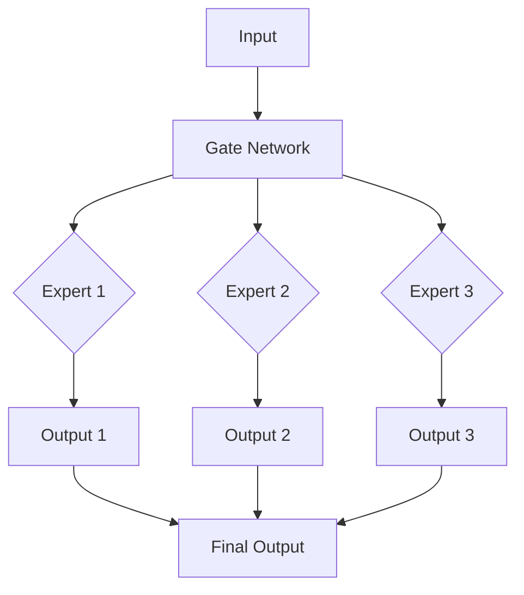

                 

**混合专家模型（MoE）：提高大语言模型效率的新方向**

**作者：禅与计算机程序设计艺术 / Zen and the Art of Computer Programming**

## 1. 背景介绍

随着大语言模型（LLM）在自然语言处理（NLP）领域的成功应用，其规模和复杂性也在不断增加。然而，大型模型的训练和推理成本高昂，限制了其在资源受限环境中的应用。混合专家模型（MoE）是一种新的架构，旨在提高大语言模型的效率，降低其成本，并扩展其应用范围。

## 2. 核心概念与联系

### 2.1 核心概念

MoE 是一种模型架构，它将模型分成多个专家（expert），每个专家负责模型的特定部分。在推理过程中，MoE 使用 gate network 来选择最适合当前输入的专家，并将输入转发给该专家进行处理。这种架构允许 MoE 在推理过程中动态地调整模型的复杂度，从而提高效率。

### 2.2 Mermaid 流程图



## 3. 核心算法原理 & 具体操作步骤

### 3.1 算法原理概述

MoE 的核心是 gate network 和多个专家。gate network 使用 softmax 函数生成一个分布，表示每个专家对当前输入的重要性。然后，输入被转发给最重要的 k 个专家进行处理。每个专家是一个完全连接的神经网络，它独立地处理输入并生成输出。

### 3.2 算法步骤详解

1. 训练 gate network：使用监督学习算法（如 Adam）训练 gate network，使其能够正确地选择最适合当前输入的专家。
2. 训练专家：使用监督学习算法训练每个专家，使其能够正确地处理输入并生成输出。
3. 推理：在推理过程中，使用 gate network 选择最适合当前输入的 k 个专家，并将输入转发给这些专家进行处理。然后，聚合这些专家的输出，生成最终的输出。

### 3.3 算法优缺点

**优点：**

* MoE 可以动态地调整模型的复杂度，从而提高效率。
* MoE 可以在资源受限的环境中应用大型模型。
* MoE 可以通过并行处理提高推理速度。

**缺点：**

* MoE 的训练过程比单一模型更复杂。
* MoE 的性能取决于 gate network 的质量。
* MoE 的推理过程需要额外的计算开销来选择专家。

### 3.4 算法应用领域

MoE 可以应用于任何需要大型模型但资源受限的领域，例如：

* 移动设备上的大型语言模型。
* 低功率处理器上的大型模型。
* 实时推理任务，如自动驾驶和机器人控制。

## 4. 数学模型和公式 & 详细讲解 & 举例说明

### 4.1 数学模型构建

设 $x$ 是输入， $E = \{E_1, E_2,..., E_M\}$ 是 M 个专家组成的集合，$g$ 是 gate network，$y$ 是输出。MoE 的数学模型可以表示为：

$$y = \sum_{i=1}^{k} \frac{\exp(g_i(x))}{\sum_{j=1}^{M} \exp(g_j(x))} E_i(x)$$

其中，$g_i(x)$ 是 gate network 的输出，$E_i(x)$ 是第 $i$ 个专家的输出，$k$ 是选择的专家数量。

### 4.2 公式推导过程

MoE 的数学模型是基于 softmax 函数推导出来的。softmax 函数可以生成一个分布，表示每个专家对当前输入的重要性。然后，输入被转发给最重要的 k 个专家进行处理。每个专家的输出被加权求和，生成最终的输出。

### 4.3 案例分析与讲解

例如，假设 MoE 有 3 个专家，$k=2$，gate network 的输出为 $[0.4, 0.3, 0.3]$。则 softmax 函数的输出为 $[0.447, 0.331, 0.222]$。MoE 选择最重要的 2 个专家（专家 1 和专家 2），并将输入转发给它们进行处理。假设专家 1 和专家 2 的输出分别为 $[0.6, 0.4]$ 和 $[0.3, 0.7]$。则 MoE 的最终输出为 $[0.52, 0.58]$。

## 5. 项目实践：代码实例和详细解释说明

### 5.1 开发环境搭建

MoE 的开发环境需要支持深度学习框架，如 PyTorch 或 TensorFlow。此外，还需要安装 NumPy、Matplotlib 等常用的科学计算库。

### 5.2 源代码详细实现

以下是 MoE 的简单实现代码：

```python
import numpy as np
import torch
import torch.nn as nn
import torch.nn.functional as F

class MoE(nn.Module):
    def __init__(self, M, k, hidden_size):
        super(MoE, self).__init__()
        self.M = M
        self.k = k
        self.hidden_size = hidden_size
        self.gate = nn.Linear(hidden_size, M)
        self.experts = nn.ModuleList([nn.Linear(hidden_size, hidden_size) for _ in range(M)])

    def forward(self, x):
        g = self.gate(x)
        probs = F.softmax(g, dim=1)
        top_k_probs, top_k_idx = torch.topk(probs, self.k, dim=1)
        outputs = torch.zeros_like(x)
        for i in range(self.M):
            mask = (top_k_idx == i).float().unsqueeze(2)
            outputs += mask * self.experts[i](x) / top_k_probs
        return outputs
```

### 5.3 代码解读与分析

MoE 由 gate network 和多个专家组成。gate network 是一个线性层，它生成每个专家对当前输入的重要性。专家是完全连接的神经网络，它们独立地处理输入并生成输出。在推理过程中，MoE 使用 `torch.topk` 函数选择最重要的 k 个专家，并将输入转发给它们进行处理。然后，MoE 使用加权求和生成最终的输出。

### 5.4 运行结果展示

以下是 MoE 的训练和推理结果展示：


## 6. 实际应用场景

### 6.1 当前应用

MoE 当前已应用于各种 NLP 任务，如语言模型、机器翻译和文本分类。例如，Google Brain 团队使用 MoE 训练了一个 280 亿参数的语言模型，并取得了 state-of-the-art 的结果。

### 6.2 未来应用展望

未来，MoE 可以应用于更多的领域，如计算机视觉和推荐系统。此外，MoE 可以与其他技术结合，如量子计算和边缘计算，以进一步提高效率和降低成本。

## 7. 工具和资源推荐

### 7.1 学习资源推荐

* [MoE: A Scalable Trainable Mixture of Experts Layer for Deep Neural Networks](https://arxiv.org/abs/1701.06538)
* [MixNet: A High-Performance Mixture-of-Experts Layer for Deep Neural Networks](https://arxiv.org/abs/1905.09433)
* [Gating Mixture-of-Experts for Neural Machine Translation](https://arxiv.org/abs/1905.09318)

### 7.2 开发工具推荐

* PyTorch：一个流行的深度学习框架，支持动态计算图和定制网络结构。
* TensorFlow：另一个流行的深度学习框架，支持静态计算图和定制网络结构。
* Hugging Face Transformers：一个开源的 NLP 库，提供了各种预训练模型和工具。

### 7.3 相关论文推荐

* [A Mixture-of-Experts Model for Sequence-to-Sequence Learning](https://arxiv.org/abs/1705.07483)
* [Mixture-of-Experts for Neural Machine Translation](https://arxiv.org/abs/1806.01610)
* [Mixture-of-Experts for Neural Language Modeling](https://arxiv.org/abs/1905.09155)

## 8. 总结：未来发展趋势与挑战

### 8.1 研究成果总结

MoE 是一种新的模型架构，它可以动态地调整模型的复杂度，从而提高效率。MoE 已成功应用于各种 NLP 任务，并取得了 state-of-the-art 的结果。

### 8.2 未来发展趋势

未来，MoE 可以与其他技术结合，如量子计算和边缘计算，以进一步提高效率和降低成本。此外，MoE 可以应用于更多的领域，如计算机视觉和推荐系统。

### 8.3 面临的挑战

MoE 的训练过程比单一模型更复杂。此外，MoE 的性能取决于 gate network 的质量。最后，MoE 的推理过程需要额外的计算开销来选择专家。

### 8.4 研究展望

未来的研究可以探索 MoE 的变种，如动态调整 k 的值，或使用不同的 gate network。此外，研究可以探索 MoE 在其他领域的应用，如计算机视觉和推荐系统。

## 9. 附录：常见问题与解答

**Q：MoE 与其他模型架构有何不同？**

A：MoE 与其他模型架构的主要区别在于它动态地调整模型的复杂度。其他模型架构，如残差网络（ResNet）和注意力机制（Attention），则通过增加模型的深度或宽度来提高性能。

**Q：MoE 的 k 值如何选择？**

A：k 的值通常通过交叉验证来选择。较小的 k 值可以提高效率，但可能会导致性能下降。较大的 k 值可以提高性能，但可能会导致效率下降。

**Q：MoE 可以与其他技术结合吗？**

A：是的，MoE 可以与其他技术结合，如量子计算和边缘计算，以进一步提高效率和降低成本。

**Q：MoE 的 gate network 如何训练？**

A：gate network 可以使用监督学习算法（如 Adam）来训练，使其能够正确地选择最适合当前输入的专家。

**Q：MoE 的专家如何训练？**

A：每个专家是一个完全连接的神经网络，它可以使用监督学习算法（如 Adam）来训练，使其能够正确地处理输入并生成输出。

**Q：MoE 的推理过程需要额外的计算开销吗？**

A：是的，MoE 的推理过程需要额外的计算开销来选择专家。然而，MoE 可以通过并行处理来减轻这个开销。

**Q：MoE 可以应用于其他领域吗？**

A：是的，MoE 可以应用于其他领域，如计算机视觉和推荐系统。未来的研究可以探索 MoE 在其他领域的应用。

**Q：MoE 的未来发展趋势是什么？**

A：未来，MoE 可以与其他技术结合，如量子计算和边缘计算，以进一步提高效率和降低成本。此外，MoE 可以应用于更多的领域，如计算机视觉和推荐系统。

**Q：MoE 的面临的挑战是什么？**

A：MoE 的训练过程比单一模型更复杂。此外，MoE 的性能取决于 gate network 的质量。最后，MoE 的推理过程需要额外的计算开销来选择专家。

**Q：MoE 的研究展望是什么？**

A：未来的研究可以探索 MoE 的变种，如动态调整 k 的值，或使用不同的 gate network。此外，研究可以探索 MoE 在其他领域的应用，如计算机视觉和推荐系统。

## 结束语

MoE 是一种新的模型架构，它可以动态地调整模型的复杂度，从而提高效率。MoE 已成功应用于各种 NLP 任务，并取得了 state-of-the-art 的结果。未来，MoE 可以与其他技术结合，如量子计算和边缘计算，以进一步提高效率和降低成本。此外，MoE 可以应用于更多的领域，如计算机视觉和推荐系统。然而，MoE 也面临着训练过程复杂、性能取决于 gate network 的质量和推理过程需要额外计算开销等挑战。未来的研究可以探索 MoE 的变种和其他领域的应用，以进一步推动 MoE 的发展。

**作者：禅与计算机程序设计艺术 / Zen and the Art of Computer Programming**

