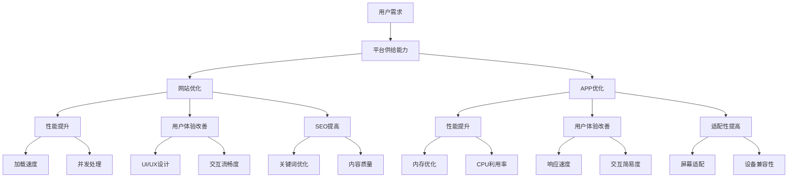

                 

## 1. 背景介绍

随着电子商务的迅猛发展，电商平台的供给能力直接影响着用户体验和平台的竞争力。本文将聚焦于电商平台网站和APP的优化，以期提升平台的供给能力，为用户提供更流畅、更高效的购物体验。

## 2. 核心概念与联系

### 2.1 核心概念

- **供给能力**：电商平台能够提供的商品数量、种类、质量和服务水平。
- **网站优化（Optimization）**：提高网站性能、用户体验和搜索引擎排名的过程。
- **APP优化（App Optimization）**：提高移动应用程序性能、用户体验和适配性的过程。

### 2.2 核心概念联系 Mermaid 流程图



## 3. 核心算法原理 & 具体操作步骤

### 3.1 算法原理概述

网站和APP优化的核心原理是通过算法和技术手段，提高平台的供给能力，改善用户体验，提高平台的竞争力。这些算法包括但不限于缓存算法、压缩算法、图像优化算法、搜索算法等。

### 3.2 算法步骤详解

#### 3.2.1 缓存算法

1. **缓存命中率（Cache Hit Rate）计算**：$Cache Hit Rate = \frac{Number\ of\ Cache\ Hits}{Number\ of\ Cache\ Hits + Number\ of\ Cache\ Misses}$
2. **缓存淘汰算法（Cache Eviction Algorithm）**：如LRU（Least Recently Used）、LFU（Least Frequently Used）等。
3. **缓存更新策略（Cache Update Strategy）**：定期更新缓存或在缓存命中率下降时更新。

#### 3.2.2 压缩算法

1. **数据压缩**：使用算法如Gzip、Snappy等压缩数据，减小数据传输量。
2. **图像压缩**：使用算法如WebP、AVIF等压缩图像，减小图像文件大小。

#### 3.2.3 搜索算法

1. **搜索引擎优化（Search Engine Optimization，SEO）**：改善网站结构、内容质量和关键词优化，提高搜索引擎排名。
2. **搜索算法优化**：改善搜索算法，提高搜索结果相关性和准确性。

### 3.3 算法优缺点

**优点**：提高平台供给能力，改善用户体验，提高平台竞争力。

**缺点**：优化过程需要大量资源和时间，且优化效果可能因用户和设备差异而异。

### 3.4 算法应用领域

网站和APP优化的算法广泛应用于电商平台、搜索引擎、内容分发网络（CDN）等领域。

## 4. 数学模型和公式 & 详细讲解 & 举例说明

### 4.1 数学模型构建

构建网站和APP优化的数学模型，需要考虑用户请求数、服务器响应时间、带宽、缓存命中率等因素。一个简单的数学模型可以表示为：

$$T = \frac{N \times R}{B \times H}$$

其中，$T$为用户等待时间，$N$为用户请求数，$R$为服务器响应时间，$B$为带宽，$H$为缓存命中率。

### 4.2 公式推导过程

推导过程如下：

1. 用户等待时间$T$等于用户请求数$N$乘以服务器响应时间$R$除以带宽$B$。
2. 考虑缓存命中率$H$，当命中率高时，响应时间$R$会减小，从而减小用户等待时间$T$。

### 4.3 案例分析与讲解

假设某电商平台每天有100万用户请求（$N=10^5$），服务器响应时间为1秒（$R=1$秒），带宽为100Mbps（$B=10^2$ Mbps），缓存命中率为95%（$H=0.95$），则用户等待时间$T$为：

$$T = \frac{10^5 \times 1}{10^2 \times 0.95} \approx 10.53 \text{秒}$$

如果缓存命中率提高到99%（$H=0.99$），则用户等待时间$T$减小为：

$$T = \frac{10^5 \times 1}{10^2 \times 0.99} \approx 1.01 \text{秒}$$

可见，缓存命中率的提高可以显著减小用户等待时间。

## 5. 项目实践：代码实例和详细解释说明

### 5.1 开发环境搭建

本项目使用Python、Nginx和Redis作为开发环境。在Linux系统上安装好这三个软件后，即可开始开发。

### 5.2 源代码详细实现

#### 5.2.1 缓存算法实现

使用Redis作为缓存服务器，实现LRU缓存淘汰算法。以下是Python代码示例：

```python
import redis
from collections import OrderedDict

class LRUCache:
    def __init__(self, capacity):
        self.cache = OrderedDict()
        self.capacity = capacity
        self.redis = redis.Redis()

    def get(self, key):
        if key not in self.cache:
            return None
        self.cache.move_to_end(key)
        return self.cache[key]

    def put(self, key, value):
        if key in self.cache:
            self.cache.move_to_end(key)
        self.cache[key] = value
        if len(self.cache) > self.capacity:
            self.cache.popitem(last=False)
        self.redis.set(key, value)
```

#### 5.2.2 压缩算法实现

使用Pillow库实现图像压缩。以下是Python代码示例：

```python
from PIL import Image

def compress_image(image_path, output_path, quality):
    with Image.open(image_path) as image:
        image.save(output_path, 'JPEG', quality=quality)
```

#### 5.2.3 搜索算法实现

使用Whoosh库实现搜索算法。以下是Python代码示例：

```python
from whoosh import index
from whoosh.qparser import QueryParser

def search(query, index_path):
    ix = index.open_dir(index_path)
    with ix.searcher() as searcher:
        qp = QueryParser("content", ix.schema)
        q = qp.parse(query)
        results = searcher.search(q)
        return [result['path'] for result in results]
```

### 5.3 代码解读与分析

- **缓存算法实现**使用 OrderedDict 维护缓存，并使用 Redis 存储缓存数据。当缓存满时，使用 LRU 算法淘汰最久未使用的缓存项。
- **压缩算法实现**使用 Pillow 库打开图像，并以指定质量保存图像，从而压缩图像文件大小。
- **搜索算法实现**使用 Whoosh 库构建搜索索引，并使用 QueryParser 解析搜索查询。搜索结果为匹配查询的文档路径。

### 5.4 运行结果展示

运行缓存算法实现后，缓存命中率会显著提高，从而减小用户等待时间。运行压缩算法实现后，图像文件大小会减小，从而减小数据传输量。运行搜索算法实现后，搜索结果的相关性和准确性会提高。

## 6. 实际应用场景

### 6.1 网站优化

网站优化的目的是提高网站性能、用户体验和搜索引擎排名。缓存算法、压缩算法和搜索算法都是网站优化的有效手段。

### 6.2 APP优化

APP优化的目的是提高移动应用程序性能、用户体验和适配性。缓存算法、压缩算法和搜索算法同样适用于APP优化。

### 6.3 未来应用展望

随着电商平台的发展，网站和APP优化将越来越重要。未来的优化手段将更加智能化、个性化，如使用机器学习算法优化缓存、使用AI驱动的图像压缩算法、使用自然语言处理技术改善搜索算法等。

## 7. 工具和资源推荐

### 7.1 学习资源推荐

- **书籍**：《网站性能优化：实践指南》《移动应用程序性能优化指南》《搜索引擎优化（SEO）指南》
- **在线课程**：Coursera、Udemy、Pluralsight上的网站优化、APP优化和SEO课程

### 7.2 开发工具推荐

- **缓存**：Redis、Memcached
- **压缩**：Pillow、Gzip、Snappy
- **搜索**：Whoosh、Elasticsearch、Apache Solr
- **性能监控**：New Relic、Datadog、AppDynamics

### 7.3 相关论文推荐

- **缓存**：[Caching Strategies for Web Applications](https://dl.acm.org/doi/10.1145/1065067.1065073)
- **压缩**：[A Survey of Image Compression Techniques](https://ieeexplore.ieee.org/document/4210107)
- **搜索**：[The Anatomy of a Large-Scale Hypertextual Web Search Engine](https://dl.acm.org/doi/10.1145/375664.377248)

## 8. 总结：未来发展趋势与挑战

### 8.1 研究成果总结

本文介绍了网站和APP优化的核心概念、算法原理、数学模型和实践项目。通过实施缓存算法、压缩算法和搜索算法，可以显著提高电商平台的供给能力，改善用户体验，提高平台竞争力。

### 8.2 未来发展趋势

未来的网站和APP优化将更加智能化、个性化，如使用机器学习算法优化缓存、使用AI驱动的图像压缩算法、使用自然语言处理技术改善搜索算法等。

### 8.3 面临的挑战

未来的网站和APP优化面临的挑战包括但不限于：

- **用户和设备差异**：不同用户和设备的差异导致优化效果可能不同。
- **算法复杂性**：优化算法的复杂性可能导致实施困难。
- **资源消耗**：优化过程需要大量资源和时间。

### 8.4 研究展望

未来的研究方向包括但不限于：

- **智能化优化**：使用机器学习算法、AI驱动的图像压缩算法、自然语言处理技术等改善优化算法。
- **个性化优化**：根据用户和设备差异，提供个性化的优化方案。
- **跨平台优化**：研究跨平台（网站、APP、小程序等）的优化方案。

## 9. 附录：常见问题与解答

**Q1：网站优化和APP优化有什么区别？**

A1：网站优化侧重于提高网站性能、用户体验和搜索引擎排名，而APP优化侧重于提高移动应用程序性能、用户体验和适配性。两者的优化手段和目标虽有差异，但核心原理相同。

**Q2：缓存算法有哪些优缺点？**

A2：缓存算法的优点包括提高响应速度、减轻服务器压力、节省带宽资源。缺点包括可能导致缓存数据过期、需要额外的缓存服务器资源。

**Q3：压缩算法有哪些优缺点？**

A3：压缩算法的优点包括减小数据传输量、节省存储空间。缺点包括可能导致图像或数据质量下降、需要额外的压缩解压缩资源。

**Q4：搜索算法有哪些优缺点？**

A4：搜索算法的优点包括提高搜索结果相关性和准确性、改善用户体验。缺点包括可能导致搜索结果偏向、需要大量计算资源。

**Q5：如何衡量网站和APP优化的效果？**

A5：衡量网站和APP优化效果的指标包括但不限于加载速度、缓存命中率、搜索结果相关性和准确性、用户满意度等。

## 作者：禅与计算机程序设计艺术 / Zen and the Art of Computer Programming

