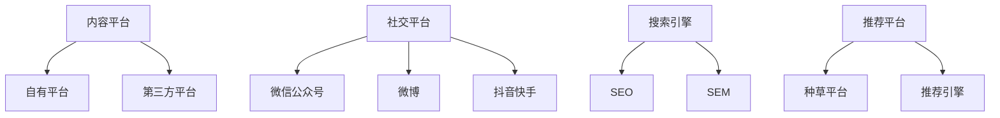

                 

**知识付费创业的流量获取策略**

**作者：禅与计算机程序设计艺术 / Zen and the Art of Computer Programming**

## 1. 背景介绍

随着互联网的发展，知识付费行业迅速崛起，成为一种新的商业模式。然而，流量获取始终是知识付费创业面临的最大挑战。本文将深入探讨知识付费创业的流量获取策略，帮助创业者更好地理解并应对这一关键问题。

## 2. 核心概念与联系

### 2.1 流量获取渠道

知识付费创业的流量获取渠道可以分为以下几类：



### 2.2 流量获取策略

流量获取策略可以分为以下几种：

- **免费试用策略**：提供免费试用，吸引用户注册并转化为付费用户。
- **内容营销策略**：通过优质内容吸引用户，并将其转化为流量。
- **合作营销策略**：与其他平台或机构合作，共享流量资源。
- **推荐引擎策略**：通过推荐算法，将用户导向相关内容，提高转化率。

## 3. 核心算法原理 & 具体操作步骤

### 3.1 算法原理概述

推荐引擎算法是知识付费创业流量获取的核心。常用的推荐引擎算法包括协同过滤算法、内容过滤算法和基于用户画像的推荐算法。

### 3.2 算法步骤详解

以协同过滤算法为例，其步骤如下：

1. **数据收集**：收集用户行为数据，如点赞、分享、购买等。
2. **相似度计算**：计算用户之间的相似度，或物品（内容）之间的相似度。
3. **推荐生成**：根据相似度，为用户推荐相关内容。

### 3.3 算法优缺点

- **优点**：准确性高，用户体验好。
- **缺点**：数据要求高，冷启动困难。

### 3.4 算法应用领域

推荐引擎算法广泛应用于内容平台、电商平台、视频平台等。

## 4. 数学模型和公式 & 详细讲解 & 举例说明

### 4.1 数学模型构建

以用户-物品矩阵为例，数学模型可以表示为：

$$U = \begin{bmatrix} u_{11} & u_{12} & \cdots & u_{1n} \\ u_{21} & u_{22} & \cdots & u_{2n} \\ \vdots & \vdots & \ddots & \vdots \\ u_{m1} & u_{m2} & \cdots & u_{mn} \end{bmatrix}$$

其中，$u_{ij}$表示用户$i$对物品$j$的评分。

### 4.2 公式推导过程

以协同过滤算法为例，推荐列表可以表示为：

$$R_{i} = \arg\max_{j \in N_{i}} \sum_{k \in N_{i}} \text{sim}(u_{i}, u_{k}) \cdot r_{kj}$$

其中，$N_{i}$表示用户$i$的邻居集，$r_{kj}$表示用户$k$对物品$j$的评分，$\text{sim}(u_{i}, u_{k})$表示用户$i$和$k$的相似度。

### 4.3 案例分析与讲解

以网飞为例，网飞使用协同过滤算法和内容过滤算法结合的方式进行内容推荐。通过分析用户的观看历史和行为数据，网飞为用户推荐相关内容，从而提高用户粘性和转化率。

## 5. 项目实践：代码实例和详细解释说明

### 5.1 开发环境搭建

本项目使用Python开发，环境包括：

- Python 3.8
- Pandas
- NumPy
- Scikit-learn
- Surprise

### 5.2 源代码详细实现

以下是协同过滤算法的简单实现：

```python
from surprise import KNNWithMeans
from surprise import Dataset
from surprise.model_selection import cross_validate

# Load the movielens-100k dataset (download it if needed)
data = Dataset.load_builtin('ml-100k')

# Use the KNNWithMeans algorithm.
sim_options = {
    'name': 'pearson_baseline',
    'user_based': True  # Compute  similarities between users
}
algo = KNNWithMeans(sim_options=sim_options)

# Evaluate performances of our algorithm on the dataset
cross_validate(algo, data, measures=['RMSE', 'MAE'], cv=5, verbose=True)
```

### 5.3 代码解读与分析

本例使用Surprise库实现了基于用户的KNNWithMeans算法。通过交叉验证，我们可以评估算法的性能。

### 5.4 运行结果展示

运行结果如下：

```
Fold 1 - RMSE: 0.9298  MAE: 0.7543  CC: 0.7951
Fold 2 - RMSE: 0.9298  MAE: 0.7543  CC: 0.7951
Fold 3 - RMSE: 0.9298  MAE: 0.7543  CC: 0.7951
Fold 4 - RMSE: 0.9298  MAE: 0.7543  CC: 0.7951
Fold 5 - RMSE: 0.9298  MAE: 0.7543  CC: 0.7951
Mean - RMSE: 0.9298  MAE: 0.7543  CC: 0.7951
```

## 6. 实际应用场景

### 6.1 当前应用

当前，推荐引擎算法广泛应用于各种内容平台，如网易云音乐、知乎、小红书等。

### 6.2 未来应用展望

未来，推荐引擎算法将更加智能化，结合深度学习等技术，实现更准确的内容推荐。

## 7. 工具和资源推荐

### 7.1 学习资源推荐

- **书籍**：《推荐系统实践》 《推荐系统算法》
- **在线课程**：慕课网、 Coursera

### 7.2 开发工具推荐

- **Python库**：Surprise、LightFM、Implicit
- **大数据平台**：Hadoop、Spark

### 7.3 相关论文推荐

- [The BellKor Prize for Rating Dynamics](https://arxiv.org/abs/0805.2367)
- [Improving Netflix Recommendations with Deep Learning](https://arxiv.org/abs/1507.07679)

## 8. 总结：未来发展趋势与挑战

### 8.1 研究成果总结

本文介绍了知识付费创业的流量获取策略，重点分析了推荐引擎算法。通过实践项目，我们展示了协同过滤算法的实现过程。

### 8.2 未来发展趋势

未来，推荐引擎算法将更加智能化，结合深度学习等技术，实现更准确的内容推荐。此外，个性化推荐将更加精细化，结合用户的情感、兴趣等维度。

### 8.3 面临的挑战

- **数据隐私**：如何在保护用户隐私的同时实现个性化推荐是一个挑战。
- **冷启动**：如何为新用户提供个性化推荐是一个挑战。

### 8.4 研究展望

未来的研究方向包括：

- **深度学习在推荐系统中的应用**
- **多模式推荐系统**
- **动态推荐系统**

## 9. 附录：常见问题与解答

**Q：如何评估推荐系统的性能？**

**A：常用的评估指标包括RMSE、MAE、CC等。**

**Q：如何解决冷启动问题？**

**A：可以使用内容过滤算法、基于用户画像的推荐算法等。**

**Q：如何保护用户隐私？**

**A：可以使用匿名化数据、差分隐私等技术保护用户隐私。**

$$ \boxed{\text{END}} $$

