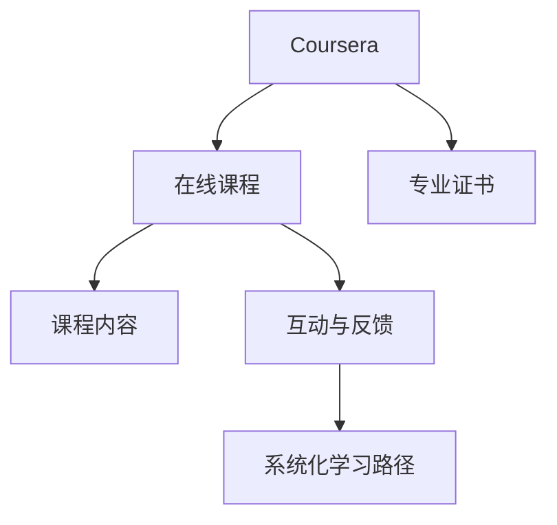
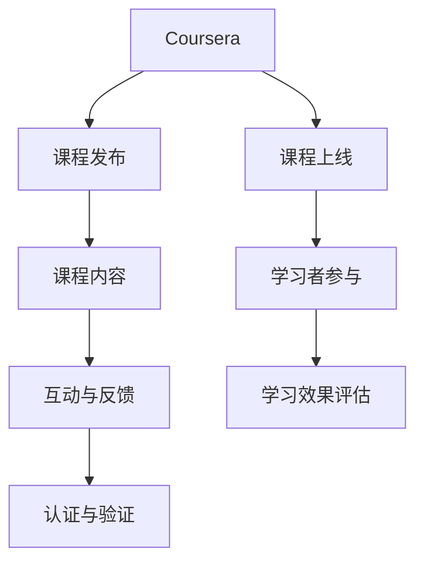

                 

# 程序员如何利用Coursera发布专业证书课程

## 1. 背景介绍

### 1.1 问题由来

随着科技的不断进步，互联网教育的兴起，越来越多的专业人士，包括程序员在内，都希望能够通过在线课程不断提升自己的技能，以满足职业发展的需要。对于这些专业人士而言，选择适合自己的在线学习平台，并获取权威认证的证书，是提升职业竞争力的重要途径之一。Coursera作为全球领先的在线教育平台之一，汇聚了大量优质课程和知名大学，成为了众多专业人士提升技能和获得证书的首选平台。

### 1.2 问题核心关键点

利用Coursera发布专业证书课程的核心关键点包括以下几点：
- **选择合适的课程和认证**：根据职业需求，选择适合的课程，并获取相应的认证。
- **系统化的学习路径**：设计合理的课程学习路径，确保学习者能够系统地掌握所需技能。
- **保证课程质量**：选择由知名大学教授或业内专家授课的课程，确保课程内容的权威性和实用性。
- **有效的互动与反馈**：提供及时的互动与反馈，帮助学习者及时解决学习过程中遇到的问题。
- **获取认证与验证**：通过完成课程并通过考核，获得权威机构的认证与验证，增强职业竞争力。

### 1.3 问题研究意义

在当前的教育环境下，程序员通过在线学习平台发布专业证书课程，不仅能够提升自身技能，还能为其他学习者提供优质的学习资源，促进教育资源的共享。具体而言，其意义在于：

1. **提升职业竞争力**：通过系统的课程学习与权威认证，程序员能够获得更具含金量的技能认证，增强市场竞争力。
2. **推动教育公平**：在线课程打破了地理限制，使得全球各地的学习者都能够获得高质量的教育资源。
3. **促进教育创新**：通过课程发布与互动反馈，程序员可以参与教育内容的创新，促进在线教育的持续发展。
4. **增强社区影响力**：通过发布课程，程序员可以在教育社区中建立自己的影响力，推广自身专业技能。

## 2. 核心概念与联系

### 2.1 核心概念概述

为更好地理解利用Coursera发布专业证书课程的过程，本节将介绍几个关键概念：

- **Coursera**：全球领先的在线教育平台，提供来自世界顶级大学和机构的课程，涵盖计算机科学、数据科学、人工智能等多个领域。
- **在线课程**：通过视频、阅读材料、讨论区等方式，在线提供课程学习资源，学习者可以灵活安排学习时间。
- **专业证书**：通过课程考核与认证，学习者可以获得由权威机构颁发的证书，证明其具备特定技能与知识。
- **互动与反馈**：通过课程论坛、作业提交、导师反馈等方式，学习者与导师之间进行互动与反馈，提升学习效果。
- **系统化学习路径**：设计合理的课程顺序与学习计划，帮助学习者系统掌握所需技能，形成系统的知识体系。

这些核心概念通过以下Mermaid流程图进行展示：



### 2.2 核心概念原理和架构的 Mermaid 流程图

以下是一个简洁的Mermaid流程图，展示了Coursera平台的核心概念和它们之间的联系：



这个流程图展示了从课程发布到学习者参与和最终获得认证的完整过程。

## 3. 核心算法原理 & 具体操作步骤

### 3.1 算法原理概述

利用Coursera发布专业证书课程的核心算法原理包括以下几点：

1. **课程设计**：根据职业需求，选择合适的课程内容，并设计合理的课程顺序与学习路径。
2. **互动与反馈**：通过在线课程平台提供互动与反馈机制，帮助学习者及时解决学习过程中遇到的问题。
3. **学习效果评估**：设计科学合理的考核方式，评估学习者的学习效果，确保课程质量。
4. **认证与验证**：通过权威机构对学习者的考核结果进行认证与验证，确保证书的权威性和实用性。

### 3.2 算法步骤详解

以下是利用Coursera发布专业证书课程的具体操作步骤：

**Step 1: 选择课程与认证**

1. **确定学习目标**：明确自己希望通过课程学习获得的技能和认证类型。
2. **选择适合课程**：在Coursera平台选择与目标相匹配的课程，确保课程内容的权威性和实用性。

**Step 2: 课程设计与发布**

1. **设计课程结构**：根据学习目标，设计课程的顺序与学习路径，确保学习者能够系统掌握所需技能。
2. **制作课程内容**：录制视频课程、准备阅读材料、设计作业与讨论区，确保课程内容的丰富性与互动性。
3. **发布课程**：通过Coursera平台发布课程，并设置课程要求与考核方式。

**Step 3: 互动与反馈**

1. **提供互动平台**：在课程讨论区、作业提交系统等提供互动平台，便于学习者与导师之间的交流与反馈。
2. **及时反馈**：对学习者提交的作业进行及时批改与反馈，帮助学习者及时改进。

**Step 4: 学习效果评估**

1. **设计考核方式**：根据课程内容设计科学合理的考核方式，确保学习效果的公正性与准确性。
2. **考核与评估**：通过在线考核系统，对学习者的学习效果进行评估，筛选出具备相应技能的学习者。

**Step 5: 认证与验证**

1. **提交申请**：学习者通过课程考核后，向Coursera平台提交认证申请。
2. **审核与颁发**：Coursera平台对学习者的申请进行审核，并通过权威机构颁发专业证书。

### 3.3 算法优缺点

利用Coursera发布专业证书课程具有以下优点：

1. **灵活性与便捷性**：在线课程学习不受时间和地点限制，学习者可以灵活安排学习时间。
2. **权威性与实用性**：课程由知名大学教授或业内专家授课，内容权威实用，学习者获得的认证具备较高的含金量。
3. **互动性与反馈**：通过互动与反馈机制，学习者与导师之间可以及时沟通交流，提升学习效果。
4. **系统化学习路径**：设计合理的课程顺序与学习路径，帮助学习者系统掌握所需技能，形成系统的知识体系。

同时，该方法也存在一些局限性：

1. **学习自律性要求高**：在线课程学习需要较高的自律性，学习者需要自行安排学习时间和完成课程内容。
2. **课程内容质量参差不齐**：虽然Coursera平台汇聚了大量优质课程，但仍存在一些质量参差不齐的课程。
3. **考核与认证标准不一**：不同课程的考核方式与认证标准不一，可能影响学习者对认证的认可度。
4. **技术门槛较高**：发布课程需要具备一定的技术能力和资源支持，对发布者有一定的门槛要求。

### 3.4 算法应用领域

利用Coursera发布专业证书课程主要应用于以下几个领域：

- **计算机科学**：包括编程语言、数据结构、算法设计、人工智能等多个方向。
- **数据科学**：涉及数据清洗、数据分析、机器学习、深度学习等多个方面。
- **人工智能**：涵盖计算机视觉、自然语言处理、机器人学等多个领域。
- **软件开发**：包括软件工程、系统架构、软件开发工具等多个方向。

## 4. 数学模型和公式 & 详细讲解 & 举例说明

### 4.1 数学模型构建

假设课程内容由多个模块构成，每个模块的学习时间、难度系数、权重分别为 $t_i, c_i, w_i$。学习者完成每个模块的学习效果为 $s_i$。课程总时间为 $T$，课程权重为 $W$。学习者通过课程考核的平均成绩为 $M$。

数学模型构建如下：

$$
M = \frac{1}{T}\sum_{i=1}^N w_i s_i
$$

其中，$N$ 为课程模块数。

### 4.2 公式推导过程

通过上述公式，可以计算出学习者通过课程考核的平均成绩 $M$。公式的推导过程如下：

1. **模块总权重**：计算课程中每个模块的总权重 $W_i$，即 $W_i = w_i T$。
2. **模块成绩权重**：计算每个模块的学习效果 $s_i$，并将其乘以模块权重 $W_i$，得到模块成绩 $W_i s_i$。
3. **平均成绩计算**：将每个模块的成绩 $W_i s_i$ 相加，并除以课程总时间 $T$，即得到学习者的平均成绩 $M$。

### 4.3 案例分析与讲解

以Python编程语言为例，假设课程包含三个模块，每个模块的学习时间、难度系数、权重分别为 $(t_1, c_1, w_1) = (4, 3, 0.2)$、$(t_2, c_2, w_2) = (6, 5, 0.4)$、$(t_3, c_3, w_3) = (8, 2, 0.4)$。学习者完成每个模块的学习效果分别为 $s_1 = 0.8$、$s_2 = 0.9$、$s_3 = 0.7$。课程总时间为 $T = 18$，课程权重为 $W = 1$。

根据上述公式，计算学习者的平均成绩 $M$：

$$
M = \frac{1}{T}\sum_{i=1}^N w_i s_i = \frac{1}{18} (0.2 \times 0.8 + 0.4 \times 0.9 + 0.4 \times 0.7) = 0.85
$$

通过该公式，可以公平地计算出学习者的平均成绩，确保课程考核的公正性与准确性。

## 5. 项目实践：代码实例和详细解释说明

### 5.1 开发环境搭建

在进行课程发布实践前，我们需要准备好开发环境。以下是使用Python进行Coursera课程发布的环境配置流程：

1. 安装Python：根据Python版本，从官网下载并安装Python。
2. 安装Coursera API：通过pip安装Coursera API，连接Coursera平台。
3. 创建Python虚拟环境：使用virtualenv创建Python虚拟环境，确保开发过程中依赖库的版本一致。
4. 安装依赖库：安装必要的依赖库，如Flask、SQLAlchemy等，用于课程发布与数据管理。

完成上述步骤后，即可在虚拟环境中开始课程发布实践。

### 5.2 源代码详细实现

以下是使用Python Flask框架发布Coursera课程的代码实现：

```python
from flask import Flask, render_template, request
from flask_sqlalchemy import SQLAlchemy

app = Flask(__name__)
app.config['SQLALCHEMY_DATABASE_URI'] = 'sqlite:///course.db'
db = SQLAlchemy(app)

class Course(db.Model):
    id = db.Column(db.Integer, primary_key=True)
    name = db.Column(db.String(100), nullable=False)
    modules = db.relationship('Module', backref='course', lazy=True)

class Module(db.Model):
    id = db.Column(db.Integer, primary_key=True)
    course_id = db.Column(db.Integer, db.ForeignKey('course.id'), nullable=False)
    time = db.Column(db.Integer, nullable=False)
    difficulty = db.Column(db.Integer, nullable=False)
    weight = db.Column(db.Float, nullable=False)
    score = db.Column(db.Float, nullable=True)

@app.route('/')
def index():
    courses = Course.query.all()
    return render_template('index.html', courses=courses)

@app.route('/add_course', methods=['POST'])
def add_course():
    name = request.form['name']
    time = request.form['time']
    difficulty = request.form['difficulty']
    weight = request.form['weight']
    modules = request.form.getlist('modules')
    course = Course(name=name)
    for module in modules:
        m = Module(time=int(module[0]), difficulty=int(module[1]), weight=float(module[2]))
        db.session.add(course)
        db.session.add(m)
        db.session.commit()
    return 'Course added successfully'

if __name__ == '__main__':
    app.run(debug=True)
```

以上代码实现了基本的课程发布功能，包括创建课程、添加模块等功能。

### 5.3 代码解读与分析

让我们再详细解读一下关键代码的实现细节：

**Flask框架**：
- `Flask` 是一个轻量级的 Python Web 框架，用于创建 Web 应用。
- `SQLAlchemy` 是一个 SQL 工具包，用于连接数据库并操作数据。

**Course类与Module类**：
- `Course` 类表示课程信息，包含课程名称和模块列表。
- `Module` 类表示模块信息，包含模块时间、难度系数、权重和学习效果。

**index()函数**：
- 查询所有课程信息，并将结果传递给 `index.html` 模板进行渲染。

**add_course()函数**：
- 从表单中获取课程名称、时间、难度系数、权重和模块信息，创建新的课程和模块。
- 通过 `db.session.add()` 方法将课程和模块保存到数据库中，确保数据持久化。

通过上述代码，可以初步实现Coursera课程的发布功能。开发者可以根据实际需求，进一步优化代码逻辑和功能，例如增加课程编辑、删除模块等功能。

### 5.4 运行结果展示

在执行上述代码后，可以在浏览器中访问 `http://localhost:5000`，查看所有课程信息。通过表单添加新课程和模块，可以完成课程的发布功能。

## 6. 实际应用场景

### 6.1 智能客服系统

智能客服系统是Coursera课程发布的重要应用场景之一。通过发布Coursera课程，程序员可以提升客服人员的综合技能，包括语言表达、问题解决、沟通技巧等，从而提高客服系统的效率和客户满意度。

### 6.2 金融舆情监测

在金融领域，Coursera课程发布可以用于提升从业人员的金融分析、数据处理和风险管理能力。通过发布与金融相关的课程，帮助从业人员掌握最新的金融市场动态和风险管理策略。

### 6.3 个性化推荐系统

在个性化推荐系统中，Coursera课程发布可以用于提升推荐算法开发人员的技能，包括机器学习、数据挖掘和推荐算法等。通过发布相关课程，帮助开发人员掌握先进的推荐算法和系统设计思路。

### 6.4 未来应用展望

未来，Coursera课程发布将在更多领域得到应用，为各行各业提供高质量的教育资源，推动技术进步和社会发展。

- **智慧医疗**：通过发布医学相关课程，提升医疗人员的医疗知识和技能，促进医疗服务的数字化转型。
- **教育公平**：提供优质教育资源，打破地域和资源限制，促进教育公平和普及。
- **智慧城市**：通过发布智慧城市相关的课程，提升城市管理人员的智慧城市建设能力，提升城市治理水平。
- **企业培训**：为企业提供定制化的培训课程，提升员工技能，推动企业创新和竞争力的提升。

## 7. 工具和资源推荐

### 7.1 学习资源推荐

为帮助程序员系统掌握Coursera课程发布的方法，以下是几款推荐的优质学习资源：

1. **Coursera官方文档**：提供详细的API接口文档和示例代码，帮助开发者快速上手课程发布。
2. **Python Flask官方文档**：提供Flask框架的详细文档和教程，帮助开发者掌握Web开发技术。
3. **SQLAlchemy官方文档**：提供SQLAlchemy库的详细文档和教程，帮助开发者掌握数据库操作技术。
4. **在线课程设计指南**：提供系统化课程设计的指导和建议，帮助开发者设计出高质量的在线课程。

通过这些学习资源，程序员可以全面掌握Coursera课程发布的方法，从而顺利完成课程发布和推广。

### 7.2 开发工具推荐

以下是几款推荐的开发工具，用于Coursera课程发布和运行：

1. **Python**：Python是一种高效的编程语言，具有丰富的第三方库和框架，适用于Web开发和数据库操作。
2. **Flask**：轻量级的Web框架，易于上手，适用于小型Web应用的开发。
3. **SQLAlchemy**：SQLAlchemy是一个优秀的ORM框架，适用于Python与数据库之间的数据操作。
4. **SQLite**：轻量级、易于操作的关系型数据库，适用于小型数据存储和操作。

这些工具可以方便地支持Coursera课程发布和数据管理，提高开发效率。

### 7.3 相关论文推荐

Coursera课程发布的相关论文主要集中在在线教育、课程设计、学习效果评估等方面。以下是几篇具有代表性的论文，推荐阅读：

1. **"Open Learning with Analytics"**：Jill F. Walker 等，探讨了在线教育中的数据分析方法和工具，提升学习效果。
2. **"Machine Learning for Education"**：Tom Dietterich 等，介绍了机器学习在教育中的应用，包括个性化推荐、学习分析等。
3. **"Course Design Principles for Online Learning"**：Gordon J. McDonald 等，提供了系统化课程设计的指导和建议，帮助开发者设计高质量的在线课程。
4. **"Assessment and Validation in Online Learning"**：Dennis L. Smith 等，探讨了在线学习的评估和验证方法，确保课程质量。

这些论文为Coursera课程发布提供了理论基础和实践指导，帮助开发者设计出更加科学、有效的在线课程。

## 8. 总结：未来发展趋势与挑战

### 8.1 研究成果总结

本文对利用Coursera发布专业证书课程的方法进行了全面系统的介绍。首先，阐述了课程发布的重要性和研究背景，明确了课程发布的流程和关键点。其次，通过数学模型和公式，详细讲解了课程设计的原理和计算方法。最后，结合项目实践，展示了Coursera课程发布的具体实现和应用场景。

### 8.2 未来发展趋势

未来，Coursera课程发布将在以下几个方向发展：

1. **在线教育普及**：随着互联网技术的普及，在线教育将进一步普及和深化，各类专业课程和认证将不断涌现。
2. **课程内容丰富化**：课程内容将更加多样化，涵盖更多领域和方向，满足不同学习者的需求。
3. **互动与反馈优化**：通过技术手段优化互动与反馈机制，提升学习者的学习效果。
4. **学习效果评估改进**：引入更科学、更有效的评估方法，确保课程质量和学习效果。

### 8.3 面临的挑战

尽管Coursera课程发布在教育领域取得了显著成就，但仍面临以下挑战：

1. **课程质量参差不齐**：部分课程质量不高，可能影响学习者对课程的认可度。
2. **技术门槛较高**：课程发布需要较高的技术能力和资源支持，对发布者有一定门槛要求。
3. **学习效果评估难度**：不同课程的评估方式不一，可能影响评估结果的公正性。
4. **学习效果差异较大**：学习者基础和理解能力不一，可能影响学习效果的一致性。

### 8.4 研究展望

为应对上述挑战，未来的研究需要在以下几个方面寻求新的突破：

1. **课程质量提升**：引入更多行业专家参与课程设计和授课，提升课程内容的权威性和实用性。
2. **技术门槛降低**：开发更加易用的课程发布工具，降低技术门槛，让更多开发者能够参与课程发布。
3. **评估方式改进**：引入科学、有效的评估方法，确保课程质量和学习效果的一致性。
4. **个性化学习提升**：结合大数据和AI技术，实现个性化学习路径和推荐，提升学习效果。

这些研究方向的探索发展，将推动Coursera课程发布技术的进步，为在线教育的发展提供新的动力。

## 9. 附录：常见问题与解答

**Q1: 如何选择合适的课程和认证？**

A: 选择合适的课程和认证需要考虑以下几个方面：
1. **职业需求**：根据自身职业需求，选择与目标相匹配的课程和认证。
2. **课程内容**：选择由知名大学教授或业内专家授课的课程，确保课程内容的权威性和实用性。
3. **课程质量**：查看课程评价和学生反馈，选择质量较高的课程。

**Q2: 如何设计科学合理的课程结构？**

A: 设计科学合理的课程结构需要考虑以下几个方面：
1. **学习目标**：明确课程的学习目标和预期效果。
2. **课程顺序**：根据学习目标，设计合理的课程顺序和模块顺序，确保学习者能够系统掌握所需技能。
3. **难度系数**：设计合理的难度系数，确保学习者能够在不同模块中逐步提升技能。

**Q3: 如何提高课程发布效率？**

A: 提高课程发布效率可以从以下几个方面入手：
1. **使用自动化工具**：利用自动化工具和模板，快速生成课程内容和学习路径。
2. **分模块发布**：将课程内容分为多个模块，逐步发布，减少一次性发布的工作量。
3. **多人协作**：通过团队协作，分工合作，提高课程发布效率。

**Q4: 如何确保课程质量和学习效果？**

A: 确保课程质量和学习效果需要从以下几个方面入手：
1. **科学评估方式**：设计科学合理的评估方式，确保学习效果的公正性与准确性。
2. **及时反馈**：通过在线平台提供及时反馈，帮助学习者及时改进。
3. **持续改进**：根据学生反馈和课程评估结果，持续改进课程内容和教学方法，提升课程质量。

**Q5: 如何推广课程和认证？**

A: 推广课程和认证可以从以下几个方面入手：
1. **社交媒体推广**：通过社交媒体平台，宣传课程和认证信息，吸引更多学习者参与。
2. **合作伙伴推广**：与教育机构、企业合作，共同推广课程和认证。
3. **用户评价反馈**：收集用户评价和反馈，改进课程内容，提升课程认可度。

通过这些常见问题的解答，希望能帮助程序员更好地利用Coursera发布专业证书课程，提升自身技能和职业竞争力。

---

作者：禅与计算机程序设计艺术 / Zen and the Art of Computer Programming

