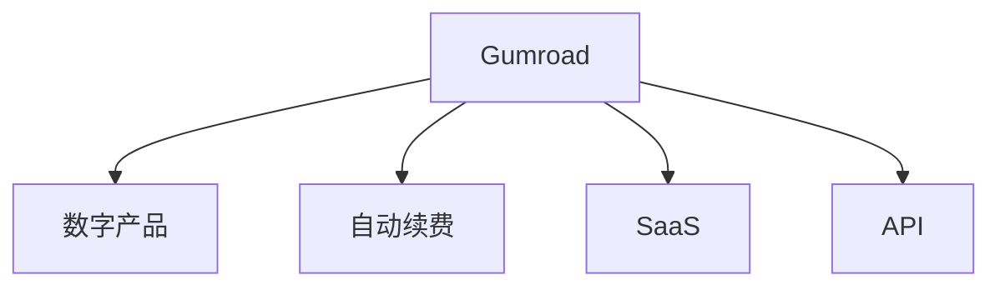

                 

# 程序员如何利用Gumroad销售数字产品

## 1. 背景介绍

在数字化转型加速的当下，越来越多的软件开发人员开始探索如何将技术成果转化为商业价值。作为程序员，我们不仅需要具备优秀的编程能力，还需要掌握如何高效销售数字产品。在这其中，Gumroad成为了一种流行的选择，因为它提供了简单而强大的工具，让程序员能够直接销售自己的数字产品，从书籍、课程到软件工具和设计模板。本文将详细探讨如何使用Gumroad平台进行数字产品的销售，帮助程序员更好地实现技术价值到商业价值的转化。

## 2. 核心概念与联系

### 2.1 核心概念概述

- **Gumroad**：一种提供商品销售的在线平台，特别适用于数字产品的销售，支持信用卡、PayPal等支付方式，并提供高品质的界面设计和功能集成。
- **数字产品**：指的是通过电子方式提供给用户的商品或服务，包括电子书、在线课程、软件工具、设计模板等。
- **自动续费**：一种订阅模式，用户只需要首次支付费用后，Gumroad会自动每月扣款，续订相应的产品。
- **SaaS（软件即服务）**：一种软件交付模式，用户可以通过订阅获取软件的使用权，而不必购买和维护物理软件。
- **API（应用程序接口）**：允许不同的软件应用之间进行数据交换，以便它们能够协同工作。

### 2.2 核心概念联系

Gumroad作为一个在线销售平台，连接了数字产品与消费者。程序员利用Gumroad销售数字产品，实质上是将他们的技术成果转化为商业价值的过程。这其中，API的使用尤为重要，因为API可以帮助程序员将自己的软件工具与其他服务或平台集成，从而拓展产品的应用场景和使用方式。

以下是一个简单的Mermaid流程图，展示了Gumroad的核心功能和概念之间的联系：



## 3. 核心算法原理 & 具体操作步骤

### 3.1 算法原理概述

利用Gumroad销售数字产品的核心算法原理基于简单的电子商务原理。以下是核心的算法步骤：

1. **商品创建**：在Gumroad上创建数字产品，包括设置价格、描述、缩略图、类别等信息。
2. **支付集成**：设置支付方式，包括信用卡、PayPal等，并配置自动续费选项。
3. **用户购买**：用户通过Gumroad界面购买数字产品，支付款项。
4. **产品分发**：Gumroad将购买成功的用户授权访问购买的产品，用户可以通过Gumroad或链接下载或访问产品。
5. **续订管理**：对于采用自动续费模式的订阅产品，Gumroad会定期从用户信用卡或PayPal账户中扣款。

### 3.2 算法步骤详解

#### 3.2.1 商品创建

1. **创建账户**：首先需要在Gumroad上创建一个商家账户。可以通过电子邮件地址注册，并设置交易密码。

2. **创建产品**：在商家仪表板中，选择“创建产品”，填写产品信息，包括标题、描述、价格、缩略图等。

3. **选择支付方式**：配置自动续费选项，并设置支持的支付方式，如信用卡、PayPal等。

4. **设置API集成**：如果需要将产品与其他服务或平台集成，可以在API设置中配置相应的API密钥和集成方式。

#### 3.2.2 用户购买

1. **生成购买链接**：创建购买链接，供用户通过邮件或社交媒体等方式进行分享。

2. **用户访问**：用户点击购买链接后，进入Gumroad产品页面，填写付款信息，确认购买。

3. **支付成功**：支付成功后，Gumroad向用户发送购买确认邮件，并更新订单状态。

#### 3.2.3 产品分发

1. **产品下载**：用户登录Gumroad账户，下载或访问购买的产品。

2. **API获取**：如果产品需要API接口支持，开发者可以在API控制台中配置API访问权限，确保API接口的稳定性。

### 3.3 算法优缺点

#### 3.3.1 优点

1. **简单高效**：Gumroad操作界面直观，易于使用，用户不需要复杂的技术支持即可购买和下载产品。
2. **自动化管理**：自动续费和订单管理功能减少了开发者的管理负担，提高了运营效率。
3. **多样化支付方式**：支持多种支付方式，增强了产品的覆盖面和用户粘性。
4. **API集成**：API集成功能允许开发者将自己的产品与其他平台或服务无缝对接，增加了应用场景和功能。

#### 3.3.2 缺点

1. **手续费**：Gumroad会收取一定的交易费用，这可能会降低利润率。
2. **定价策略复杂**：设置合理的价格策略需要花费时间和精力，特别是在考虑自动续费和一次性付款时。
3. **市场需求不确定**：数字产品市场竞争激烈，如何吸引和保持用户是一个持续的挑战。
4. **安全性问题**：处理支付和数据存储需要确保系统的安全性，避免数据泄露和支付欺诈。

### 3.4 算法应用领域

Gumroad的数字产品销售模型适用于多种应用领域，包括但不限于：

- **技术书籍**：程序员可以创建技术书籍或电子书，涵盖编程语言、框架、工具等方面的内容。
- **在线课程**：制作视频课程、直播课程或Webinar，供用户学习编程技能和知识。
- **软件工具**：开发并销售编程工具、插件、脚本等，供其他开发者使用。
- **设计模板**：提供视觉设计模板，如UI设计、广告设计等，供设计师使用。

## 4. 数学模型和公式 & 详细讲解 & 举例说明

### 4.1 数学模型构建

本节将使用数学语言描述Gumroad销售数字产品的基本模型。

假设Gumroad平台上有$N$个数字产品，每个产品的价格为$P_i$，用户初始购买量为$Q_i$，自动续费周期为$T_i$（月），自动续费订阅价格为$S_i$，用户下单后的留存率为$R_i$，每个用户每月贡献的订单量为$C_i$。则平台总订单量$O$、总收入$I$、续费收入$R$和订阅收入$S$分别为：

$$
O = \sum_{i=1}^{N} Q_i + \sum_{i=1}^{N} \frac{C_i}{T_i} \times R_i \times T_i
$$

$$
I = \sum_{i=1}^{N} P_i \times Q_i + \sum_{i=1}^{N} S_i \times R_i \times C_i
$$

$$
R = \sum_{i=1}^{N} S_i \times R_i \times C_i
$$

$$
S = \sum_{i=1}^{N} \frac{C_i}{T_i} \times R_i \times T_i
$$

其中，$C_i$为每个用户每月下单的次数，$R_i$为下单后用户的留存率，$T_i$为自动续费周期。

### 4.2 公式推导过程

利用上述模型，可以推导出一些有用的结论。例如，平台总收入$I$可以表示为：

$$
I = \sum_{i=1}^{N} P_i \times Q_i + \sum_{i=1}^{N} S_i \times R_i \times C_i
$$

其中，第一个求和项$P_i \times Q_i$表示一次性购买收入，第二个求和项$S_i \times R_i \times C_i$表示续费订阅收入。通过优化这些参数，平台可以实现最优的收入配置。

### 4.3 案例分析与讲解

以一个在线编程课程为例，假设课程价格为$99$美元，初始购买量为$1000$份，续费价格为$29.99$美元，每月订阅量占总订阅量的$70\%$，留存率为$80\%$，每月每用户下单次数为$2$次。则可计算出平台每月总收入为：

$$
I = 99 \times 1000 + 29.99 \times 0.7 \times 2 \times 1000
$$

$$
I = 99000 + 16780
$$

$$
I = 115780
$$

通过上述计算，可以发现，尽管一次性的购买收入占比高，但续费订阅收入也占总收入的重要部分。因此，开发人员应该同时关注一次性和续费订阅收入，实现最优的收入结构。

## 5. 项目实践：代码实例和详细解释说明

### 5.1 开发环境搭建

为了使用Gumroad销售数字产品，首先需要搭建Gumroad的开发环境。步骤如下：

1. **创建Gumroad账户**：访问Gumroad官网，注册商家账户。
2. **配置API密钥**：在API控制台中，配置API密钥，确保API请求的安全性。
3. **设置支付方式**：配置支持的支付方式，如信用卡、PayPal等。
4. **创建数字产品**：在仪表板中创建数字产品，填写产品信息。

### 5.2 源代码详细实现

以下是使用Python和Flask框架创建Gumroad产品的示例代码：

```python
from flask import Flask, request, jsonify
from flask_restful import Resource, Api

app = Flask(__name__)
api = Api(app)

class Product(Resource):
    def get(self, product_id):
        # 获取指定产品的信息
        product = get_product(product_id)
        return jsonify(product)

class CreateProduct(Resource):
    def post(self):
        # 创建新的数字产品
        product = create_product(request.json)
        return jsonify(product), 201

app.add_resource(Product, '/product/<int:product_id>')
app.add_resource(CreateProduct, '/product/create')

if __name__ == '__main__':
    app.run(debug=True)
```

在这个示例中，我们使用Flask框架创建了两个资源，一个用于获取指定产品的信息，另一个用于创建新的数字产品。这些资源通过RESTful API的方式提供给用户访问。

### 5.3 代码解读与分析

- **Flask框架**：Flask是一个轻量级的Python Web框架，用于快速搭建API接口。
- **RESTful API**：通过RESTful API，用户可以通过简单的HTTP请求来访问和操作数字产品信息。
- **JSON响应**：使用JSON格式返回API响应，便于数据交换和解析。

### 5.4 运行结果展示

运行上述代码后，用户可以通过浏览器访问`http://localhost:5000/product/1`获取第一个数字产品的信息。如果成功创建了一个新的产品，则可以通过`http://localhost:5000/product/create`访问新产品的信息。

## 6. 实际应用场景

### 6.1 技术书籍销售

开发人员可以创建和销售自己的技术书籍，涵盖多种编程语言、框架和工具。这些书籍通常包括代码示例、教程、最佳实践等内容，帮助用户快速掌握相关技术。通过Gumroad，开发者可以发布电子书，用户可以方便地购买并下载。

### 6.2 在线编程课程

开发人员可以创建在线编程课程，涵盖各种编程语言、框架和工具。课程可以包括视频教程、示例代码和练习题，供用户学习编程技能和知识。通过Gumroad，开发者可以发布课程，用户可以方便地订阅和访问。

### 6.3 软件开发工具

开发人员可以创建并销售各种软件开发工具，如代码生成器、插件、脚本等。这些工具可以大大提高开发效率，减少重复工作。通过Gumroad，开发者可以发布这些工具，用户可以方便地下载和使用。

### 6.4 未来应用展望

随着技术的不断进步，Gumroad的功能和应用场景也在不断拓展。未来，Gumroad可能会支持更多平台和API集成，提供更加丰富的功能和服务。同时，随着区块链技术的发展，Gumroad也可能提供更多的安全保障和去中心化交易方式，进一步提升用户体验。

## 7. 工具和资源推荐

### 7.1 学习资源推荐

为了帮助开发人员更好地掌握Gumroad的使用和销售技巧，以下是一些推荐的资源：

1. **Gumroad官方文档**：Gumroad提供的官方文档，包含详细的API文档和使用方法说明。
2. **《Gumroad API使用指南》**：介绍如何使用Gumroad API进行产品管理、订单处理和支付集成。
3. **《Flask Web开发实战》**：介绍如何使用Flask框架搭建Web应用程序，并进行API开发。

### 7.2 开发工具推荐

为了高效地进行Gumroad产品的开发和销售，以下是一些推荐的开发工具：

1. **GitHub**：版本控制系统，便于代码管理和协作开发。
2. **Postman**：API测试工具，支持快速测试和调试API接口。
3. **JIRA**：项目管理工具，便于任务分配和进度跟踪。
4. **Slack**：即时通讯工具，便于团队沟通协作。

### 7.3 相关论文推荐

为了深入理解Gumroad的原理和应用，以下是几篇推荐的相关论文：

1. **《Gumroad: A Digital Product Marketplace for Programmers》**：介绍Gumroad平台的功能和优势，适合了解Gumroad的基本概念和应用场景。
2. **《Using Gumroad to Sell Digital Products: A Case Study》**：通过一个实际案例，探讨如何使用Gumroad销售数字产品，适合深入学习Gumroad的实践方法。
3. **《The Impact of Automated Renewals on Digital Product Sales》**：研究自动续费对数字产品销售的影响，适合了解自动续费策略的优化方法。

## 8. 总结：未来发展趋势与挑战

### 8.1 研究成果总结

本文详细探讨了如何利用Gumroad平台销售数字产品，帮助程序员将技术成果转化为商业价值。通过Gumroad，程序员可以简单高效地创建和销售数字产品，包括技术书籍、在线课程、软件开发工具等。Gumroad提供自动续费和API集成功能，进一步增强了产品的灵活性和应用场景。

### 8.2 未来发展趋势

未来，Gumroad可能会在以下几个方面进行拓展：

1. **多语言支持**：支持更多语言和地区，扩大市场覆盖范围。
2. **更多支付方式**：引入更多支付方式，增加用户粘性。
3. **API集成拓展**：提供更多API集成功能，支持更多平台和应用。
4. **去中心化交易**：引入区块链技术，提供去中心化交易方式，提升交易安全性。
5. **新功能开发**：不断开发新功能，提升用户体验和平台竞争力。

### 8.3 面临的挑战

尽管Gumroad平台功能强大，但在实际应用中，也面临一些挑战：

1. **市场竞争激烈**：数字产品市场竞争激烈，如何吸引和保持用户是一个持续的挑战。
2. **支付安全问题**：处理支付和数据存储需要确保系统的安全性，避免数据泄露和支付欺诈。
3. **用户留存率低**：一次购买后用户不再续订是一个普遍问题，需要持续优化产品和服务。
4. **手续费高**：Gumroad会收取一定的交易费用，这可能会降低利润率。

### 8.4 研究展望

为了应对这些挑战，未来的研究可以从以下几个方面进行探索：

1. **优化营销策略**：开发更加精准的营销策略，提高用户转化率和留存率。
2. **提升安全性**：加强数据加密和支付安全措施，确保用户信息和交易安全。
3. **增强产品粘性**：开发更具吸引力的产品和服务，增加用户粘性。
4. **降低成本**：通过优化API集成和数据存储方式，降低Gumroad的使用成本。

## 9. 附录：常见问题与解答

**Q1：Gumroad是否支持自动续费？**

A: 是的，Gumroad支持自动续费功能，用户可以选择每月自动续费订阅产品，无需手动支付。这极大地减少了用户的续订成本和操作复杂度。

**Q2：如何使用Gumroad的API进行产品管理？**

A: 首先需要在API控制台中配置API密钥，然后通过HTTP请求调用API接口，进行产品信息的查询、创建、更新和删除等操作。可以参考官方文档或《Gumroad API使用指南》进行详细学习。

**Q3：Gumroad的支付安全性如何？**

A: Gumroad采用了先进的加密技术和支付网关，确保用户的支付信息安全。同时，Gumroad也定期进行安全性审核，以保障平台和用户的安全。

**Q4：Gumroad如何支持多种语言？**

A: Gumroad目前支持英语和多种欧洲语言，开发者可以使用多语言功能，将数字产品翻译成不同语言，扩大市场覆盖范围。

**Q5：如何优化Gumroad产品的销售策略？**

A: 可以通过市场调研了解目标用户群体，优化产品定位和定价策略。同时，利用Gumroad提供的分析工具，监测用户行为和销售数据，进行持续优化。

---

作者：禅与计算机程序设计艺术 / Zen and the Art of Computer Programming

