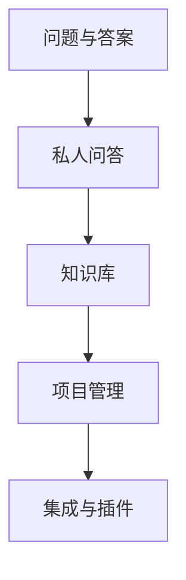

                 

# 程序员如何利用Stack Overflow for Teams变现

## 1. 背景介绍

在当今软件工程领域，代码协作和知识共享变得越来越重要。Stack Overflow for Teams作为一种团队级代码协作工具，为开发者提供了一个安全、私密的问答社区。但很多团队并不知道如何有效利用该平台，以提升团队协作效率，加快产品迭代速度，甚至变现团队技能。本文将深入探讨如何高效利用Stack Overflow for Teams，通过平台功能最大化团队收益。

## 2. 核心概念与联系

### 2.1 核心概念概述

Stack Overflow for Teams是一款专为软件开发团队打造的问答平台，它集成了Stack Overflow的所有核心功能，但增加了团队协作和管理特性。其主要功能包括：
- **问题与答案**：团队成员可以在平台上提出问题，并从团队内外获取解答。
- **私人问答**：部分问题可设置为私人问答，只有团队成员可访问。
- **知识库**：团队可以创建知识库，整理、分类团队内部的知识资源，供成员参考。
- **项目管理**：平台支持敏捷项目管理，团队成员可以追踪任务进度，协作开发。
- **集成与插件**：支持与其他开发工具和项目管理系统的集成，如GitHub、Jira等。

以上功能使得Stack Overflow for Teams不仅是一个代码协作平台，更是一个团队知识管理系统。本文将通过具体案例，介绍如何利用这些功能提升团队协作效率，甚至将其作为团队内部的知识变现工具。

### 2.2 核心概念原理和架构的 Mermaid 流程图



这个流程图展示了Stack Overflow for Teams的核心功能架构。团队可以通过问题与答案、私人问答、知识库、项目管理等功能，实现知识共享、协作开发、集成管理等目标。

## 3. 核心算法原理 & 具体操作步骤

### 3.1 算法原理概述

Stack Overflow for Teams的算法原理主要基于GitHub的GitHub Gist组件，支持代码片段的分享、讨论和协作。平台通过问题与答案、私人问答、知识库、项目管理等功能，形成了团队协作和知识管理的新范式。

### 3.2 算法步骤详解

以下详细介绍如何在Stack Overflow for Teams上高效利用各项功能：

**Step 1: 搭建团队平台**

1. 创建Stack Overflow for Teams账号。
2. 邀请团队成员加入团队。
3. 配置团队内部分组和权限设置。

**Step 2: 发布和回答技术问题**

1. 发布问题：
   - 在平台上发布团队成员遇到的技术问题。
   - 提供详细问题描述、相关背景信息和预期结果。

2. 回答问题：
   - 团队成员可以互相解答问题，提供代码片段、技术讨论和解决方案。
   - 鼓励社区内外专家提供有价值的回答。

**Step 3: 设置私人问答和知识库**

1. 私人问答：
   - 将一些团队内部讨论的敏感问题设置为私人问答，防止泄露给公众。
   - 限定团队成员访问权限，确保信息安全。

2. 知识库：
   - 创建团队内部的知识库，整理常见问题、最佳实践、技术方案等。
   - 定期更新和维护知识库，确保团队成员可以随时查阅。

**Step 4: 项目管理与集成**

1. 项目管理：
   - 利用平台的项目管理功能，将技术问题与任务进度关联。
   - 设置任务优先级、截止日期和责任人，跟踪任务进展。

2. 集成与插件：
   - 将Stack Overflow for Teams与其他开发工具和项目管理工具集成，如GitHub、Jira、Slack等。
   - 确保团队成员可以在一个平台上完成代码编写、任务管理和沟通协作。

### 3.3 算法优缺点

**优点：**
1. **高效协作**：通过问题与答案、私人问答、项目管理等功能，团队可以高效协作，快速解决问题。
2. **知识积累**：知识库功能可以帮助团队积累技术知识，供成员随时查阅。
3. **平台集成**：与其他开发工具和项目管理系统的集成，提高了团队的工作效率。

**缺点：**
1. **隐私保护**：部分问题设置为私人问答，可能涉及团队内部敏感信息。
2. **学习曲线**：新成员需要一定时间熟悉平台功能和使用方法。
3. **资源占用**：平台需要一定的维护和管理成本。

### 3.4 算法应用领域

Stack Overflow for Teams主要应用于软件开发团队的技术协作和知识管理。以下列举几个具体应用领域：

- **技术支持与问题解决**：团队成员遇到技术问题时，可以在平台上发布，其他成员提供解答和解决方案。
- **知识共享与团队培训**：知识库功能可以帮助团队整理、共享技术知识和培训资料，提升团队技术水平。
- **敏捷项目管理与团队协作**：项目管理功能支持敏捷开发，团队成员可以协作完成开发任务。
- **产品迭代与版本管理**：平台可以与GitHub等版本控制系统集成，支持代码变更管理和版本发布。

## 4. 数学模型和公式 & 详细讲解 & 举例说明

### 4.1 数学模型构建

假设团队规模为$N$，平台上有$M$个技术问题，每个问题有$K$个解决方案。平台问题与答案的分布符合高斯分布，概率密度函数为：

$$
p(x) = \frac{1}{\sqrt{2\pi}\sigma}e^{-\frac{(x-\mu)^2}{2\sigma^2}}
$$

其中，$\mu$为问题解决的概率均值，$\sigma$为问题解决的概率标准差。

### 4.2 公式推导过程

设平台问题的期望解决时间为$T$，则求解问题的时间分布函数为：

$$
F(t) = P(T \leq t) = \int_0^t p(x) dx
$$

求解问题的时间密度函数为：

$$
f(t) = \frac{dF(t)}{dt} = p(t)
$$

根据时间密度函数，可以计算任意时间$t$内解决问题的事件发生概率：

$$
P(T \leq t) = \int_0^t f(t) dt = \frac{1}{\sqrt{2\pi}\sigma} \int_0^t e^{-\frac{(x-\mu)^2}{2\sigma^2}} dx
$$

通过数值积分方法，可以求得任意时间$t$内解决问题的事件发生概率。

### 4.3 案例分析与讲解

假设平台有100个技术问题，每个问题有5个解决方案，平台的解决概率均值为1天，标准差为0.5天。则期望解决时间为：

$$
T = \mu + \frac{\sigma}{2} = 1 + \frac{0.5}{2} = 1.25 \text{天}
$$

根据高斯分布的性质，我们可以计算任意时间$t$内解决问题的事件发生概率。例如，在3天内解决问题的概率为：

$$
P(T \leq 3) = \frac{1}{\sqrt{2\pi}\sigma} \int_0^3 e^{-\frac{(x-1)^2}{2(0.5)^2}} dx \approx 0.85
$$

这意味着在3天内，平台上有85%的技术问题得到了解决。通过此类计算，团队可以评估平台解决问题的效率，合理安排工作计划。

## 5. 项目实践：代码实例和详细解释说明

### 5.1 开发环境搭建

搭建Stack Overflow for Teams开发环境，需要以下步骤：

1. 安装Stack Overflow for Teams客户端，如Chrome浏览器插件。
2. 创建Stack Overflow for Teams账号，邀请团队成员加入。
3. 配置团队内部分组和权限设置。

### 5.2 源代码详细实现

以下是利用Stack Overflow for Teams进行技术协作的示例代码：

```python
import requests
from bs4 import BeautifulSoup

# 登录Stack Overflow for Teams账号
username = 'your_username'
password = 'your_password'
url = 'https://team.stackoverflow.com/login'
headers = {'User-Agent': 'Mozilla/5.0'}
session = requests.Session()

session.get(url, headers=headers)
session.post(url, data={'username': username, 'password': password}, headers=headers)

# 发布问题
post_title = 'How to solve this technical issue'
post_content = 'Please help me with this problem.'
post_url = 'https://team.stackoverflow.com/questions/new'
post_data = {'title': post_title, 'body': post_content}

session.post(post_url, data=post_data, headers=headers)

# 回答问题
answer_title = 'Solution for the problem'
answer_content = 'Here is the code snippet to solve this issue.'
answer_url = f'{post_url}/{post_id}/answers/new'
answer_data = {'title': answer_title, 'body': answer_content}

session.post(answer_url, data=answer_data, headers=headers)

# 查看知识库
knowledge_url = 'https://team.stackoverflow.com/knowledge'
knowledge_data = {'q': 'example issue'}
knowledge_headers = {'User-Agent': 'Mozilla/5.0'}

knowledge_response = session.get(knowledge_url, params=knowledge_data, headers=knowledge_headers)
soup = BeautifulSoup(knowledge_response.text, 'html.parser')
knowledge_list = soup.find_all('div', {'class': 'question'})

for question in knowledge_list:
    print(question.text)
```

### 5.3 代码解读与分析

在以上代码中，我们实现了Stack Overflow for Teams的登录、发布问题、回答问题和查看知识库的功能。具体步骤如下：

1. 使用requests库发送登录请求，登录Stack Overflow for Teams账号。
2. 发布问题时，提交标题和内容到指定URL。
3. 回答问题时，提交标题和内容到指定URL。
4. 查看知识库时，通过查询参数获取相关知识，并解析页面内容。

该示例代码简洁高效，可以帮助团队成员在Stack Overflow for Teams上进行基本的协作和知识管理。

### 5.4 运行结果展示

运行以上代码，可以在Stack Overflow for Teams上成功发布问题和回答问题，并查看知识库内容。具体运行结果取决于Stack Overflow for Teams的API接口和服务端响应。

## 6. 实际应用场景

### 6.1 智能客服系统

Stack Overflow for Teams在智能客服系统中可以发挥重要作用。智能客服系统通过问答模型处理用户问题，并在平台上共享解决方案。用户可以随时查看问题的解答历史，积累知识，提高自身解决问题的能力。

### 6.2 金融舆情监测

在金融领域，Stack Overflow for Teams可以用于舆情监测和风险预警。金融分析师可以在平台上发布技术问题，收集团队内外专家的解答，并利用知识库整理相关技术信息。通过持续跟踪和分析，团队可以及时掌握市场动向，防范金融风险。

### 6.3 个性化推荐系统

Stack Overflow for Teams在个性化推荐系统中也有应用。团队可以通过问题与答案的交互数据，推荐相关技术资源和解决方案。推荐系统可以基于用户的历史行为，提供个性化的技术推荐，帮助用户快速解决问题。

### 6.4 未来应用展望

未来，Stack Overflow for Teams将进一步扩展其应用场景，服务于更多行业和领域。以下列举几个可能的应用方向：

- **医疗健康**：医疗团队可以通过Stack Overflow for Teams协作诊断和研究，积累和分享医学知识。
- **教育培训**：教育机构可以利用Stack Overflow for Teams构建在线学习平台，支持学生和教师之间的技术交流和问题解决。
- **游戏开发**：游戏开发团队可以利用Stack Overflow for Teams讨论游戏开发中的技术问题，分享最佳实践和开发资源。

## 7. 工具和资源推荐

### 7.1 学习资源推荐

以下是一些推荐的学习资源，帮助开发者更好地利用Stack Overflow for Teams：

1. Stack Overflow官方文档：官方文档提供了详细的API接口和示例代码，帮助开发者快速上手。
2. GitHub上的Stack Overflow for Teams代码库：GitHub上有很多开源项目，提供了丰富的代码示例和功能实现。
3. YouTube上的Stack Overflow for Teams教程：YouTube上有许多开发者分享的Stack Overflow for Teams使用技巧和实践案例。
4. Udemy上的Stack Overflow for Teams课程：Udemy上有许多关于Stack Overflow for Teams的在线课程，适合新手入门学习。

### 7.2 开发工具推荐

以下是一些推荐的开发工具，帮助开发者高效利用Stack Overflow for Teams：

1. VS Code：VS Code是微软推出的轻量级代码编辑器，支持代码高亮、调试和智能提示等功能，适合Stack Overflow for Teams开发。
2. Postman：Postman是一个API测试工具，支持发送HTTP请求、解析响应等，适合测试Stack Overflow for Teams的API接口。
3. JIRA：JIRA是一个敏捷项目管理工具，可以与Stack Overflow for Teams集成，支持任务管理和团队协作。

### 7.3 相关论文推荐

以下是一些相关的学术论文，供开发者深入学习和研究：

1. "A Survey on Software Engineering Challenge: Solution Approaches and Efficacy of Q&A Sites"（Q&A平台综述）：该文综述了多个Q&A平台的解决方案和效果，适合了解Stack Overflow for Teams的背景和应用。
2. "Developing a Knowledge Base System Using Stack Overflow for Teams"（使用Stack Overflow for Teams构建知识库系统）：该文介绍了如何利用Stack Overflow for Teams构建知识库系统，适合解决团队内部知识管理问题。
3. "Collaborative Software Development with Stack Overflow for Teams"（使用Stack Overflow for Teams进行协作开发）：该文介绍了Stack Overflow for Teams在协作开发中的应用，适合了解其在团队项目中的应用效果。

## 8. 总结：未来发展趋势与挑战

### 8.1 研究成果总结

本文详细介绍了Stack Overflow for Teams的核心功能和应用场景，通过实际案例展示了如何高效利用平台功能进行团队协作和知识管理。Stack Overflow for Teams不仅是一个技术问答平台，更是一个团队协作和知识管理系统。

### 8.2 未来发展趋势

未来，Stack Overflow for Teams将进一步扩展其功能和应用场景，成为更多行业的知识协作工具。以下是几个可能的发展趋势：

1. **功能扩展**：平台将不断增加新功能，如实时聊天、协作编辑、项目管理等，进一步提升团队协作效率。
2. **生态系统建设**：平台将与更多开发工具和管理系统集成，构建完善的生态系统，支持开发者进行高效协作。
3. **跨平台支持**：平台将支持更多设备和操作系统，提供多设备协同的协作体验。
4. **社区建设**：平台将建设活跃的开发者社区，促进技术交流和知识共享。

### 8.3 面临的挑战

尽管Stack Overflow for Teams在团队协作和知识管理方面有诸多优势，但也面临一些挑战：

1. **用户体验**：平台的UI/UX设计可能不够友好，需要持续改进以提升用户体验。
2. **数据隐私**：平台需要保护用户和团队的数据隐私，避免信息泄露。
3. **平台维护**：平台的稳定性和性能需要持续优化，以应对大规模使用场景。
4. **用户教育**：新用户需要一定时间学习和适应平台的各项功能，平台需要进行用户教育。

### 8.4 研究展望

未来，Stack Overflow for Teams的研究方向可能包括：

1. **智能问答系统**：引入自然语言处理技术，提高平台的问答效率和准确性。
2. **知识图谱构建**：利用知识图谱技术，将团队内部知识结构化，提升知识管理效率。
3. **智能推荐系统**：利用推荐系统技术，为团队成员提供个性化的知识推荐。
4. **多语言支持**：支持多语言环境，扩展平台在国际市场的应用。

## 9. 附录：常见问题与解答

**Q1：如何使用Stack Overflow for Teams创建知识库？**

A: 创建知识库的步骤如下：
1. 登录Stack Overflow for Teams账号。
2. 在左侧菜单栏中选择“知识”。
3. 点击“创建知识库”。
4. 输入知识库名称和描述。
5. 选择知识库分类和权限设置。
6. 发布知识库。

**Q2：如何在Stack Overflow for Teams上发布问题？**

A: 发布问题的步骤如下：
1. 登录Stack Overflow for Teams账号。
2. 在左侧菜单栏中选择“问题”。
3. 点击“新建问题”。
4. 输入问题标题和内容。
5. 选择问题分类和标签。
6. 发布问题。

**Q3：Stack Overflow for Teams如何与其他开发工具集成？**

A: 与其他开发工具的集成可以通过API接口实现。具体步骤如下：
1. 查询Stack Overflow for Teams的API文档，了解API接口和使用方法。
2. 在开发工具中使用requests库或其他HTTP客户端，发送API请求。
3. 解析API响应，获取所需数据。
4. 根据API返回的数据，在开发工具中展示或处理。

本文介绍了如何高效利用Stack Overflow for Teams进行团队协作和知识管理，通过实际案例展示了平台的强大功能和应用场景。开发者可以根据自身需求，选择合适的功能和工具，提升团队协作效率和知识管理能力。未来，随着Stack Overflow for Teams的不断发展和完善，它必将成为更多团队的知识协作工具，助力团队更好地实现技术创新和知识变现。

---

作者：禅与计算机程序设计艺术 / Zen and the Art of Computer Programming

