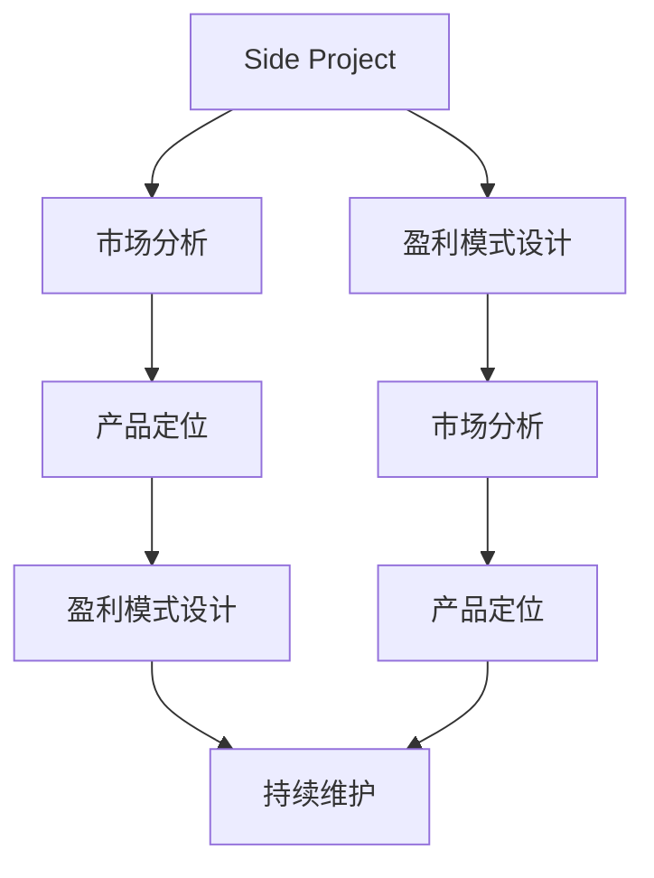

                 

# 程序员如何将Side Project转化为付费产品

> 关键词：Side Project, 盈利模式, 技术博客, 开发者社区, 开源项目, 持续维护, 商业化策略, 市场分析

## 1. 背景介绍

作为一名经验丰富的程序员，你一定有着一个或多个个人项目（Side Project），它们或许仅仅是为了兴趣，或许是在工作之余进行实验和探索。但这些Side Project，往往拥有潜在的商业价值，只要适当转化，即可成为付费产品。本文将从背景介绍入手，分析Side Project转化为付费产品的原因、过程和步骤，为你提供一套完整的转型方案。

## 2. 核心概念与联系

### 2.1 核心概念概述

要成功将Side Project转化为付费产品，首先需要明确几个核心概念：

- **Side Project**：程序员在主要工作之外，为了兴趣或实验而开发的项目。
- **付费产品**：通过售卖或订阅方式，向用户提供软件、工具或服务，以获取收入的商业产品。
- **盈利模式**：通过何种方式从用户处获得收入，包括广告、订阅、付费下载、交易手续费等。
- **市场分析**：分析目标市场的需求、竞争情况和用户行为，为产品定位和推广提供依据。
- **持续维护**：长期对产品进行优化、更新和改进，确保其稳定性和功能性。

这些概念相互联系，共同构成了一个完整的Side Project到付费产品的转化链条。理解它们之间的内在联系，对于成功转型至关重要。

### 2.2 核心概念原理和架构的 Mermaid 流程图



该流程图展示了从Side Project到付费产品的转化路径。从市场需求分析出发，确定产品定位和盈利模式，然后通过持续维护不断改进产品，最终实现商业化。

## 3. 核心算法原理 & 具体操作步骤

### 3.1 算法原理概述

将Side Project转化为付费产品的过程，实际上是一个从兴趣驱动到商业驱动的转变。这种转变需要综合运用市场分析、产品定位、盈利模式设计和持续维护等策略。

1. **市场分析**：通过调研和分析，了解目标市场的需求和竞争状况。
2. **产品定位**：根据市场需求和自身资源，确定产品的核心功能和独特卖点。
3. **盈利模式设计**：基于产品定位，设计相应的收入方式，确保可持续运营。
4. **持续维护**：不断优化产品功能，更新内容和功能，保持用户粘性。

### 3.2 算法步骤详解

**Step 1: 市场分析**
- **调研目标市场**：通过问卷调查、用户访谈、竞争对手分析等方式，了解目标用户的需求和痛点。
- **竞争分析**：分析现有同类产品的优缺点，找出市场空白和改进点。
- **需求分析**：根据调研结果，明确产品的核心功能和用户需求。

**Step 2: 产品定位**
- **功能确定**：根据市场需求和自身技术能力，确定产品的主要功能模块和用户体验。
- **独特卖点**：提炼产品独特的优势，使其在竞争激烈的市场中脱颖而出。
- **用户画像**：构建目标用户画像，明确产品的主要用户群体和应用场景。

**Step 3: 盈利模式设计**
- **免费模式**：提供基础功能免费使用，通过广告或增值服务收费。
- **订阅模式**：提供付费订阅，享受高级功能和服务。
- **按需付费**：根据用户使用量或功能需求，收取相应费用。
- **开源付费**：提供开源版本，同时提供商业版本，满足不同用户需求。

**Step 4: 持续维护**
- **用户反馈**：收集用户反馈，及时修复问题，改进功能。
- **版本更新**：定期发布新版本，增加新功能，提高用户体验。
- **社区建设**：建立开发者社区，鼓励用户参与开发和改进。

### 3.3 算法优缺点

**优点**：
- **提高技能**：通过实践，提升自身项目管理和产品设计的技能。
- **多元化收入**：通过商业化，增加个人收入来源，实现财务自由。
- **社会价值**：将个人兴趣转化为对社会有价值的产品，实现自我价值。

**缺点**：
- **时间和精力投入**：商业化需要大量时间和精力投入，可能影响日常生活。
- **市场风险**：市场需求不确定，产品可能失败。
- **技术挑战**：在产品迭代和维护过程中，可能遇到技术难题。

### 3.4 算法应用领域

Side Project转化为付费产品的过程，可以应用于各种类型的项目，包括但不限于：

- **开发工具**：如GitHub Copilot，通过提供代码补全功能，收取订阅费用。
- **网站和应用程序**：如Todoist，提供任务管理和日程安排，收取月费或年费。
- **数据分析和可视化工具**：如Tableau，通过可视化数据，收取软件许可费用。
- **教育和学习平台**：如Coursera，提供课程和证书，收取课程费用。
- **游戏开发**：如Unity，通过销售游戏引擎和开发工具，获取收入。

## 4. 数学模型和公式 & 详细讲解 & 举例说明

### 4.1 数学模型构建

假设Side Project的产品为 $P$，市场容量为 $M$，目标用户数为 $U$，转化率为 $R$，订阅费用为 $F$，每月活跃用户数为 $A$，则用户收入 $I$ 可以表示为：

$$
I = U \times R \times F \times A
$$

其中，$U$ 为总目标用户数，$R$ 为转化率，$F$ 为每月的订阅费用，$A$ 为每月活跃用户数。

### 4.2 公式推导过程

通过上述公式，我们可以进一步推导出每个月的收入增长率 $G$：

$$
G = \left(1 + R \times F \times \frac{A}{U}\right)^{1/12} - 1
$$

这意味着，通过提高转化率、订阅费用和活跃用户数，可以显著提升每月的收入增长率。

### 4.3 案例分析与讲解

**案例：Grubhub**

Grubhub 是一个提供本地餐饮外卖服务的平台。其Side Project最初是一个简单的在线订餐工具，通过市场分析，发现订餐服务的需求日益增长。通过不断改进和优化，最终Grubhub成为一家成功的付费产品，用户可以在上面点外卖，商家可以提供外卖服务，平台收取佣金。

- **市场分析**：调研用户对于订餐服务的痛点，发现现有服务的不便之处。
- **产品定位**：明确了平台的核心功能，即快速便捷的点餐和外卖服务。
- **盈利模式设计**：采用订阅和佣金模式，提供基础免费服务，高级功能收费。
- **持续维护**：不断更新功能，增加餐厅和菜品信息，提升用户体验。

## 5. 项目实践：代码实例和详细解释说明

### 5.1 开发环境搭建

要实现Side Project到付费产品的转化，需要一个稳定的开发环境。以下是一些推荐的开发环境搭建步骤：

1. **版本控制**：使用Git进行代码管理，方便团队协作和版本控制。
2. **持续集成**：使用Jenkins或Travis CI进行持续集成和自动化测试。
3. **代码托管**：使用GitHub或Bitbucket进行代码托管，方便代码分享和协作。
4. **文档管理**：使用Confluence或GitBook管理项目文档，记录项目进展和需求。
5. **远程协作**：使用Slack或Microsoft Teams进行远程协作，确保团队高效沟通。

### 5.2 源代码详细实现

以一个简单的待办事项管理应用为例，展示如何将Side Project转化为付费产品。

**需求**：用户可以创建任务，设定截止日期，查看任务进展，进行任务标记和优先级排序。

**代码实现**：

```python
# 创建任务
class Task:
    def __init__(self, title, description, due_date, priority):
        self.title = title
        self.description = description
        self.due_date = due_date
        self.priority = priority
        self.completed = False

# 任务列表管理
class TaskList:
    def __init__(self):
        self.tasks = []

    def add_task(self, task):
        self.tasks.append(task)

    def remove_task(self, task):
        self.tasks.remove(task)

    def mark_completed(self, task):
        task.completed = True

    def filter_tasks_by_priority(self, priority):
        return [task for task in self.tasks if task.priority == priority]

    def filter_tasks_by_due_date(self, due_date):
        return [task for task in self.tasks if task.due_date == due_date]
```

**功能模块设计**：

1. **任务创建模块**：允许用户创建、编辑和删除任务。
2. **任务管理模块**：提供任务列表、优先级排序和截止日期筛选功能。
3. **通知提醒模块**：根据任务截止日期，发送提醒通知。

### 5.3 代码解读与分析

**代码解读**：

- **Task类**：表示一个待办事项，包含标题、描述、截止日期、优先级和是否完成等属性。
- **TaskList类**：表示待办事项列表，包含添加、删除、标记完成等方法，并提供按优先级和截止日期筛选任务的功能。
- **模块设计**：通过封装Task和TaskList类，实现了任务创建、管理、排序和筛选等功能。

**分析**：

- **代码简洁**：模块化设计和封装，使代码结构清晰，易于维护。
- **功能全面**：支持任务的创建、编辑、删除、标记和筛选，满足用户需求。
- **可扩展性强**：通过增加新的Task类属性和方法，可以轻松扩展任务列表的功能。

### 5.4 运行结果展示

在开发环境中，可以通过以下步骤测试应用：

1. 在本地运行代码，启动服务器。
2. 通过浏览器访问应用，进行任务创建和操作。
3. 记录用户反馈，进行功能优化和改进。
4. 发布应用到应用商店，吸引用户下载和使用。

## 6. 实际应用场景

### 6.1 职业发展

Side Project的商业化转型，不仅能带来财务收益，还能提升个人职业发展。通过开发和推广Side Project，程序员可以获得更多的项目经验、提高技术水平和领导能力，增强市场竞争力。

### 6.2 社会贡献

成功的Side Project转型，可以为社会带来积极影响。例如，开发一个面向教育的软件，可以帮助学生提高学习效率，开发一个面向医疗的应用，可以提高医疗服务质量。

### 6.3 商业模式创新

通过Side Project的商业化，可以探索和验证新的商业模式。例如，通过订阅模式、按需付费、广告收入等多元化方式，实现收入来源的多样化。

### 6.4 未来应用展望

未来，随着技术的进步和市场的成熟，Side Project到付费产品的转化将更加便捷和高效。智能化的项目管理工具、自动化测试和部署工具、低成本的云服务和服务器资源，将大大降低开发和运营成本，使更多程序员能够成功转型。

## 7. 工具和资源推荐

### 7.1 学习资源推荐

- **在线课程**：Udemy、Coursera、edX等平台提供的Web开发、项目管理、商业分析等课程，帮助你提升技能。
- **技术博客**：Medium、Towards Data Science等平台上的开发者博客，分享成功案例和经验。
- **开源社区**：GitHub、Stack Overflow等社区，提供技术支持和资源分享。
- **商业咨询**：MBA课程、商业分析书籍等资源，帮助你理解商业和市场。

### 7.2 开发工具推荐

- **版本控制**：Git、GitHub、Bitbucket
- **持续集成**：Jenkins、Travis CI
- **代码托管**：GitHub、Bitbucket
- **文档管理**：Confluence、GitBook
- **远程协作**：Slack、Microsoft Teams

### 7.3 相关论文推荐

- **《Web应用开发实战》**：详细介绍了Web开发的全流程，从需求分析到上线部署。
- **《敏捷项目管理》**：介绍了敏捷项目管理的方法和工具，帮助提升项目效率。
- **《软件商业模式创新》**：探讨了不同软件商业模式的特点和优势，帮助你设计合适的盈利模式。
- **《用户增长指南》**：介绍了用户获取、留存和转化的方法，帮助你实现商业增长。

## 8. 总结：未来发展趋势与挑战

### 8.1 研究成果总结

本文系统分析了Side Project转化为付费产品的原因、步骤和策略，提供了详细的转化方案。通过市场分析、产品定位、盈利模式设计和持续维护等步骤，程序员可以成功将个人兴趣转化为商业产品。

### 8.2 未来发展趋势

未来，Side Project到付费产品的转化将更加普及和便捷。新技术和工具的出现，如人工智能、机器学习、区块链等，将为转型提供更多可能。

### 8.3 面临的挑战

尽管转化过程充满挑战，但通过不断学习和实践，克服这些挑战是完全可能的。关键在于持续学习、不断创新，积极应对市场的变化和需求。

### 8.4 研究展望

未来研究可以从以下几个方向进行：

- **新技术融合**：将人工智能、大数据等新技术与Side Project结合，提升产品功能和服务质量。
- **多渠道销售**：通过App Store、Google Play等平台，以及自有网站、社交媒体等渠道，拓展收入来源。
- **用户行为分析**：通过数据分析工具，深入了解用户行为和需求，指导产品改进和创新。

总之，Side Project到付费产品的转化，不仅能够带来经济收益，还能提升个人技能和职业发展。通过深入学习和实践，每位程序员都有机会将个人兴趣转化为对社会有价值的商业产品。

## 9. 附录：常见问题与解答

**Q1: Side Project到付费产品转化为何如此重要？**

A: 转化的重要性体现在多个方面：

- **财务收益**：通过商业化，获得稳定的收入来源。
- **技能提升**：项目管理、产品设计、市场分析等能力得到提升。
- **职业发展**：积累了丰富的项目经验，提升职业竞争力。

**Q2: 转化过程中遇到的最大挑战是什么？**

A: 转化过程中遇到的最大挑战是市场需求的不确定性和技术实现难度。需要深入市场调研，合理设计产品，并通过持续优化和迭代，克服这些挑战。

**Q3: 如何进行市场分析？**

A: 市场分析主要包括以下步骤：

- **用户调研**：通过问卷、访谈等方式，了解用户需求和痛点。
- **竞争分析**：分析竞争对手的产品和市场表现。
- **数据挖掘**：利用大数据分析工具，进行用户行为和市场趋势分析。

**Q4: 如何选择盈利模式？**

A: 盈利模式的选择需要综合考虑市场、产品定位和用户需求。常见的盈利模式包括：

- **订阅模式**：用户订阅付费，享受高级功能。
- **按需付费**：根据用户使用量收费。
- **广告模式**：通过展示广告获取收入。

**Q5: 如何持续维护产品？**

A: 持续维护需要：

- **用户反馈**：定期收集用户反馈，及时修复问题。
- **功能更新**：根据市场反馈，不断更新功能和改进性能。
- **社区建设**：建立开发者社区，鼓励用户参与产品改进。

---

作者：禅与计算机程序设计艺术 / Zen and the Art of Computer Programming

