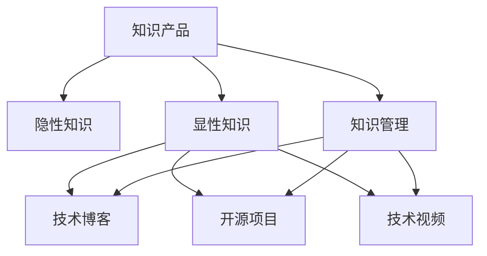

                 

# 程序员如何将工作经验转化为知识产品

> 关键词：软件开发, 技术积累, 知识管理, 编程技能, 技术博客

## 1. 背景介绍

### 1.1 问题由来
在当今快速发展的技术环境中，程序员在职业生涯中不断学习和积累新的技能和经验。如何将这些宝贵的知识转化为可共享、可复用的知识产品，成为每个技术人共同的挑战。知识产品的形式多种多样，包括技术博客、开源项目、教学视频等，但其核心都是如何将程序员的经验和见解以易于理解、可操作的方式呈现出来。本文将深入探讨如何系统性地将程序员的经验转化为知识产品。

### 1.2 问题核心关键点
将工作经验转化为知识产品的关键在于将隐性知识显性化，形成结构化的内容，使他人能够轻松理解和应用。这涉及知识抽取、组织和表达等多个环节。具体包括以下几点：
- **知识抽取**：从日常工作中挖掘具有普适性和教育价值的知识点。
- **知识组织**：将抽取的知识进行结构化处理，使其逻辑清晰、易于理解。
- **知识表达**：采用易于理解和表达的形式，如代码、图表、视频等，使内容具有高度可操作性。

### 1.3 问题研究意义
将工作经验转化为知识产品不仅有助于个人技术能力的提升，还能帮助社区成员共同成长，加速技术知识传播，促进技术生态的健康发展。通过知识共享，可以构建技术交流平台，激发创新，推动技术进步。同时，这也是程序员实现个人品牌提升和职业发展的有效途径。

## 2. 核心概念与联系

### 2.1 核心概念概述

为更好地理解如何将工作经验转化为知识产品，本节将介绍几个密切相关的核心概念：

- **知识产品(Knowledge Product)**：程序员通过各种方式将积累的经验和技能转化为可供他人学习、使用的产品。
- **隐性知识(Tacit Knowledge)**：存储于个人经验和实践中的难以言传的知识，如直觉、洞察力、判断力等。
- **显性知识(Explicit Knowledge)**：能够通过文字、图表、代码等方式清晰表达的知识，易于他人学习和理解。
- **知识管理(Knowledge Management)**：对知识进行系统化管理和维护的过程，包括知识抽取、组织、检索等。
- **技术博客(Technical Blog)**：程序员以博客形式记录和分享技术经验、问题解决思路等，供他人参考和学习。
- **开源项目(Open Source Project)**：程序员贡献代码、文档和教程，形成可复用、可扩展的软件项目，供社区成员共同维护和改进。
- **技术视频(Technical Video)**：通过视频讲解技术原理、操作流程等，使复杂的技术知识变得生动直观。

这些核心概念之间的逻辑关系可以通过以下Mermaid流程图来展示：



这个流程图展示了几大核心概念及其之间的关系：

1. **知识产品**：知识管理的最终目标，通过将隐性知识显性化，使其易于传播和应用。
2. **隐性知识**：程序员在实践中积累的知识，需要通过系统化管理，使其可传递给他人。
3. **显性知识**：通过博客、开源项目和视频等形式，将知识产品具体表达出来。
4. **知识管理**：系统化地管理和维护知识，确保知识能够被有效抽取、组织和检索。

这些概念共同构成了程序员将工作经验转化为知识产品的框架，使其能够在不同的形式和渠道上得到应用。

## 3. 核心算法原理 & 具体操作步骤
### 3.1 算法原理概述

将工作经验转化为知识产品，本质上是一个知识抽取和表达的过程。其核心思想是：通过系统化的知识和技能管理，将程序员在实际工作中的隐性知识转化为结构化的显性知识，使其易于他人学习和应用。

形式化地，假设程序员在工作中的经验为 $E$，其目标是将 $E$ 转化为结构化的知识产品 $K$。转化过程可以概括为两个步骤：
1. **知识抽取**：从 $E$ 中抽取具有普适性和教育价值的知识点，形成 $K_1$。
2. **知识表达**：将 $K_1$ 进行结构化处理，形成易于理解和应用的形式 $K_2$。

这一过程可以通过以下数学模型来描述：

$$
K = F(E)
$$

其中 $F$ 为知识转换函数，将经验 $E$ 转化为知识产品 $K$。

### 3.2 算法步骤详解

将工作经验转化为知识产品的过程可以分为以下几个关键步骤：

**Step 1: 知识抽取**
- 定义知识点的类型，如技术原理、问题解决方法、最佳实践等。
- 分析日常工作中的关键任务和挑战，识别出有价值的知识点。
- 收集相关的数据和信息，如代码片段、操作步骤、问题描述等。
- 对收集到的数据进行预处理，如去重、清洗、分类等。

**Step 2: 知识组织**
- 选择合适的知识组织形式，如博客文章、代码库、文档教程等。
- 设计知识表达的结构和布局，如文章标题、子标题、图表、代码块等。
- 使用标记语言或框架，如Markdown、HTML等，将知识点组织成可读性强的内容。

**Step 3: 知识表达**
- 选择合适的表达方式，如文字描述、代码示例、图表展示等。
- 对关键技术点进行详细讲解，如背景知识、实现步骤、注意事项等。
- 使用图像、动画、视频等多媒体工具，增强内容的生动性和互动性。
- 提供相应的配套资源，如代码库、数据集、演示视频等，方便读者实践和深入理解。

**Step 4: 知识共享与维护**
- 将知识产品发布到公共平台，如GitHub、Medium、YouTube等。
- 定期更新和维护知识产品，确保其内容的准确性和时效性。
- 与社区成员互动，收集反馈和建议，持续改进知识产品。

### 3.3 算法优缺点

将工作经验转化为知识产品的方法具有以下优点：
1. **促进知识传播**：通过系统化管理，知识能够更有效地传播，帮助社区成员共同成长。
2. **提升个人品牌**：通过分享高质量的知识产品，程序员能够建立良好的个人品牌，吸引更多关注和机会。
3. **推动技术发展**：知识产品能够激发创新，推动技术进步，加速技术生态的健康发展。

同时，该方法也存在一定的局限性：
1. **时间成本高**：系统化管理知识和技能需要投入大量时间和精力，不适合频繁进行。
2. **质量依赖个人**：知识产品的质量很大程度上依赖于程序员的写作能力和经验积累，难以达到专业标准。
3. **表达方式有限**：不同的知识产品形式有其适用的场景，部分复杂的技术点可能难以通过文字或视频完全表达。
4. **缺乏互动性**：相较于面对面的技术交流，知识产品缺乏互动性，可能难以解决读者具体的问题。

尽管存在这些局限性，但将工作经验转化为知识产品仍然是程序员提升自身能力、分享知识的有效途径。通过不断学习和实践，可以在这一过程中提升自身技能，同时也能为社区提供有价值的内容。

### 3.4 算法应用领域

将工作经验转化为知识产品的实践不仅限于软件开发领域，还广泛应用于其他技术和管理领域。以下是几个典型的应用场景：

- **技术博客**：程序员通过撰写博客文章，分享技术经验、问题解决思路等，供他人参考和学习。
- **开源项目**：程序员贡献代码、文档和教程，形成可复用、可扩展的软件项目，供社区成员共同维护和改进。
- **技术视频**：通过视频讲解技术原理、操作流程等，使复杂的技术知识变得生动直观。
- **技术培训**：将积累的知识制作成培训课程或手册，帮助团队成员快速掌握新技能。
- **技术报告**：在会议或研讨会上分享技术研究成果，推动学术交流和产业应用。

除了上述这些经典场景，将工作经验转化为知识产品的实践还可以拓展到更多领域，如科学论文、行业白皮书、管理咨询报告等，为技术生态带来更广泛的影响。

## 4. 数学模型和公式 & 详细讲解 & 举例说明
### 4.1 数学模型构建

本文将使用数学语言对将工作经验转化为知识产品的过程进行更加严格的刻画。

假设程序员在实际工作中的经验为 $E$，其目标是将 $E$ 转化为结构化的知识产品 $K$。

定义知识点的类型集合为 $T=\{T_1, T_2, \dots, T_n\}$，其中 $T_i$ 表示第 $i$ 种知识点的类型，如技术原理、问题解决方法、最佳实践等。

知识产品 $K$ 可以表示为一个关于 $T$ 的映射 $K: T \rightarrow [0, 1]$，其中 $K(T_i)$ 表示 $T_i$ 类型的知识点在知识产品中的重要性评分。

知识产品 $K$ 的构建过程可以表示为：

$$
K = F(E)
$$

其中 $F$ 为知识转换函数，将经验 $E$ 转化为知识产品 $K$。

### 4.2 公式推导过程

以下我们以技术博客为例，推导知识产品的构建过程。

**Step 1: 知识抽取**

设 $E$ 为程序员在实际工作中的经验，$T$ 为知识点的类型集合，$D$ 为知识点的数据集。知识抽取的过程可以表示为：

$$
K_1 = F_1(E) = \{K_1^1, K_1^2, \dots, K_1^m\}
$$

其中 $K_1^i$ 表示第 $i$ 个知识点，$F_1$ 为知识抽取函数。

**Step 2: 知识组织**

知识组织的过程可以表示为：

$$
K_2 = F_2(K_1) = \{K_2^1, K_2^2, \dots, K_2^m\}
$$

其中 $K_2^i$ 表示经过组织后的第 $i$ 个知识点，$F_2$ 为知识组织函数。

**Step 3: 知识表达**

知识表达的过程可以表示为：

$$
K = F_3(K_2) = \{K^1, K^2, \dots, K^n\}
$$

其中 $K^i$ 表示以 $T_i$ 类型表示的第 $i$ 个知识点，$F_3$ 为知识表达函数。

### 4.3 案例分析与讲解

以一个简单的技术博客为例，展示知识产品构建的全过程。

**背景**：某程序员在工作中遇到一个新的问题，需要通过网络搜索和学习，找到解决方案，并将其总结为博客文章。

**Step 1: 知识抽取**

1. 识别出问题的关键技术点，如问题描述、数据格式、解决方案等。
2. 收集相关的数据和信息，如官方文档、博客文章、开源项目等。
3. 对收集到的数据进行预处理，如去重、清洗、分类等。

**Step 2: 知识组织**

1. 选择合适的博客布局，如标题、副标题、目录等。
2. 设计内容结构，如引言、问题描述、解决方案、代码示例等。
3. 使用Markdown语法组织内容，如代码块、链接、列表等。

**Step 3: 知识表达**

1. 详细讲解问题背景、解决方案的步骤、注意事项等。
2. 提供相应的代码示例和图表，增强内容的可读性和可操作性。
3. 提供配套的资源，如示例代码、链接、参考文档等。

**Step 4: 知识共享与维护**

1. 将博客文章发布到公共平台，如Medium、GitHub等。
2. 定期更新和维护博客，确保内容的准确性和时效性。
3. 与社区成员互动，收集反馈和建议，持续改进内容。

## 5. 项目实践：代码实例和详细解释说明
### 5.1 开发环境搭建

在进行知识产品实践前，我们需要准备好开发环境。以下是使用Python进行Jupyter Notebook开发的环境配置流程：

1. 安装Anaconda：从官网下载并安装Anaconda，用于创建独立的Python环境。

2. 创建并激活虚拟环境：
```bash
conda create -n pyenv python=3.8 
conda activate pyenv
```

3. 安装必要的库：
```bash
pip install jupyter notebook ipywidgets pandas matplotlib numpy
```

完成上述步骤后，即可在`pyenv`环境中开始开发。

### 5.2 源代码详细实现

下面我们以技术博客为例，给出使用Jupyter Notebook进行知识产品开发的Python代码实现。

首先，定义知识产品的类型：

```python
# 定义知识点的类型
knowledge_types = {
    '问题描述': None,
    '解决方案': None,
    '代码示例': None,
    '参考资料': None
}
```

然后，进行知识点的抽取和组织：

```python
# 定义知识抽取函数
def extract_knowledge(doc):
    # 对文档进行预处理
    doc = preprocess(doc)
    # 识别知识点
    knowledge = {}
    # 以标题为单位，分割文档
    for heading in doc:
        # 提取知识点
        if heading in knowledge_types:
            knowledge[heading] = extract_content(doc, heading)
    return knowledge

# 定义知识组织函数
def organize_knowledge(knowledge):
    # 对知识点进行组织
    organized_knowledge = {}
    for heading, content in knowledge.items():
        # 设置子标题和内容
        organized_knowledge[heading] = organize_content(content)
    return organized_knowledge
```

接着，进行知识点的表达和输出：

```python
# 定义知识表达函数
def express_knowledge(organized_knowledge):
    # 将知识点转化为博客文章
    blog = {}
    for heading, content in organized_knowledge.items():
        # 添加标题和内容
        blog[heading] = express_content(content)
    return blog

# 定义输出函数
def output_knowledge(blog):
    # 将博客文章输出为Markdown格式
    md = ''
    for heading, content in blog.items():
        md += markdown_heading(heading)
        md += markdown_content(content)
    return md

# 输出博客文章
print(output_knowledge(express_knowledge(organize_knowledge(extract_knowledge(doc))))
```

以上是使用Jupyter Notebook进行技术博客开发的完整代码实现。可以看到，通过将知识抽取、组织和表达的函数化，使得整个过程更加模块化和可复用。

### 5.3 代码解读与分析

让我们再详细解读一下关键代码的实现细节：

**extract_knowledge函数**：
- 首先对文档进行预处理，如去除格式无关的字符、去除注释等。
- 识别出标题和知识点，将问题描述、解决方案等知识点提取出来。

**organize_knowledge函数**：
- 对知识点进行结构化组织，设置合适的标题和子标题。
- 使用Markdown语法组织内容，如代码块、链接、列表等。

**express_knowledge函数**：
- 对知识点进行详细讲解，如引言、问题描述、解决方案等。
- 提供相应的代码示例和图表，增强内容的可读性和可操作性。

**output_knowledge函数**：
- 将博客文章输出为Markdown格式，便于在Jupyter Notebook或其他平台展示和分享。

通过这些函数的组合使用，可以高效地构建技术博客文章，并对其进行格式化输出。

## 6. 实际应用场景
### 6.1 技术博客

技术博客是程序员分享经验、解决问题的重要途径。通过技术博客，程序员可以将复杂的知识点拆解成易于理解的步骤，帮助读者快速掌握新技能。

在实际应用中，程序员可以收集日常工作中的常见问题和解决方案，制作成技术博客文章。通过博客平台的分享和互动，可以获得读者的反馈和建议，进一步完善内容。这种循环反馈机制，有助于提升技术博客的质量和影响力。

### 6.2 开源项目

开源项目是程序员贡献代码、文档和教程的舞台。通过开源项目，程序员可以将积累的经验和知识以代码形式公开，供社区成员共同维护和改进。

在实际应用中，程序员可以参与开源社区的项目，撰写详细的文档和教程，帮助其他开发者更好地理解和利用代码。同时，也可以将自己在项目中遇到的问题和解决方案，整理成博客或视频，分享给更多的社区成员。

### 6.3 技术视频

技术视频是讲解技术原理、操作流程的有效方式。通过技术视频，程序员可以将复杂的知识点转化为生动的视觉内容，帮助读者更好地理解和应用。

在实际应用中，程序员可以录制技术讲解视频，演示代码实现、操作流程等。视频可以包含详细的讲解、代码示例、演示效果等，使内容更加生动和直观。视频还可以配上字幕和注释，方便读者观看和理解。

### 6.4 技术培训

技术培训是程序员分享经验、提升团队技能的重要方式。通过技术培训，程序员可以将积累的知识系统化地传授给团队成员，加速团队的共同成长。

在实际应用中，程序员可以制作技术培训课程或手册，系统讲解技术原理、操作流程等。培训课程可以包含讲解视频、PPT、代码示例等，使内容更加全面和系统。培训课程还可以设置互动环节，如问答、实操等，增强培训效果。

## 7. 工具和资源推荐
### 7.1 学习资源推荐

为了帮助开发者系统掌握将工作经验转化为知识产品的理论基础和实践技巧，这里推荐一些优质的学习资源：

1. **《编程之道》系列博文**：由大模型技术专家撰写，深入浅出地介绍了编程技巧、代码重构、技术设计等前沿话题。

2. **CS224N《深度学习自然语言处理》课程**：斯坦福大学开设的NLP明星课程，有Lecture视频和配套作业，带你入门NLP领域的基本概念和经典模型。

3. **《代码大全》书籍**：讲解代码设计、重构、优化等基本技巧，提供大量实际案例和实用建议。

4. **GitHub官方文档**：GitHub平台的官方文档，提供了丰富的开源项目和代码示例，是学习代码管理、版本控制的宝贵资源。

5. **博客平台教程**：如Medium、Dev.to等，提供详细的博客平台搭建和发布指南，帮助程序员快速上手博客写作。

通过这些资源的学习实践，相信你一定能够快速掌握将工作经验转化为知识产品的精髓，并用于解决实际的编程问题。

### 7.2 开发工具推荐

高效的开发离不开优秀的工具支持。以下是几款用于知识产品开发的常用工具：

1. **Jupyter Notebook**：基于Python的交互式编程环境，支持代码、文本、图表等多媒体内容的混合展示。适合编写技术博客、文档和教程。

2. **GitHub**：全球最大的代码托管平台，提供丰富的版本控制、代码管理、协作工具，适合开源项目的开发和维护。

3. **Markdown编辑器**：如Typora、Sublime Text等，提供Markdown语法支持和格式化展示，适合编写技术博客和文档。

4. **视频编辑工具**：如Adobe Premiere、FFmpeg等，提供视频编辑、导出功能，适合制作技术讲解视频。

5. **演示文稿工具**：如Microsoft PowerPoint、Google Slides等，提供PPT制作和展示功能，适合制作技术培训课程。

合理利用这些工具，可以显著提升知识产品开发的效率，加快创新迭代的步伐。

### 7.3 相关论文推荐

将工作经验转化为知识产品的发展源于学界的持续研究。以下是几篇奠基性的相关论文，推荐阅读：

1. **《编程语言的演化：趋势与挑战》**：讨论了编程语言的演变趋势，分析了新兴编程语言的优势和局限性。

2. **《代码重构的艺术》**：讲解了代码重构的基本原则和技巧，提供大量实际案例和实用建议。

3. **《技术博客：程序员的成长之路》**：探讨了技术博客在程序员职业发展中的作用，分享了成功的博客写作经验。

4. **《开源项目：协作开发的实践》**：讲解了开源项目的基础知识和协作工具，提供了开源项目的最佳实践。

5. **《技术培训：提升团队技能》**：探讨了技术培训的原理和实践，分享了有效的培训方法和工具。

这些论文代表了大语言模型微调技术的发展脉络。通过学习这些前沿成果，可以帮助研究者把握学科前进方向，激发更多的创新灵感。

## 8. 总结：未来发展趋势与挑战

### 8.1 总结

本文对将工作经验转化为知识产品的系统方法进行了全面系统的介绍。首先阐述了知识产品的重要性和基本概念，明确了从知识抽取到知识表达的转化流程。其次，从原理到实践，详细讲解了知识产品的构建过程，给出了完整的代码实例。同时，本文还广泛探讨了知识产品在技术博客、开源项目、技术视频等场景中的应用，展示了知识产品技术的广阔前景。此外，本文精选了知识产品的各类学习资源，力求为读者提供全方位的技术指引。

通过本文的系统梳理，可以看到，将工作经验转化为知识产品是程序员提升自身能力、分享知识的重要途径。这一过程不仅有助于个人成长，还能推动社区和行业的健康发展。未来，伴随技术生态的不断演进，知识产品将发挥越来越重要的作用，成为技术交流和创新的重要工具。

### 8.2 未来发展趋势

展望未来，知识产品的开发和应用将呈现以下几个发展趋势：

1. **自动化和工具化**：随着技术的发展，知识产品的构建和维护将逐渐自动化和工具化，使开发者能够更高效地实现知识共享。
2. **社区协作**：社区协作平台将成为知识产品开发的利器，帮助开发者快速获取和贡献高质量内容，形成良性互动。
3. **多模态融合**：未来的知识产品将融合文字、代码、图表、视频等多模态内容，使知识表达更加全面和生动。
4. **智能化推荐**：知识产品推荐系统将利用人工智能技术，根据用户需求和兴趣推荐相关内容，提升用户体验。
5. **知识图谱**：通过知识图谱技术，将知识点和知识点之间的关系可视化，形成知识网络，帮助用户更系统地理解知识。

以上趋势凸显了知识产品技术的广阔前景。这些方向的探索发展，必将进一步提升知识产品的内容质量和用户体验，为技术生态带来更大的价值。

### 8.3 面临的挑战

尽管知识产品开发技术已经取得了显著进展，但在迈向更加智能化、普适化应用的过程中，它仍面临着诸多挑战：

1. **质量控制**：知识产品的质量很大程度上依赖于作者的水平，难以达到专业标准。如何保证知识产品的准确性和时效性，是未来需要解决的重要问题。
2. **交互性不足**：相较于面对面的技术交流，知识产品缺乏互动性，可能难以解决读者具体的问题。如何增强知识产品的互动性，是提升用户体验的关键。
3. **知识孤岛**：现有的知识产品往往难以跨平台和跨学科融合，形成知识孤岛。如何构建统一的知识标准和格式，促进跨平台和跨学科的交流，是知识产品发展的重要课题。
4. **知识产权保护**：知识产品的版权保护问题较为复杂，如何有效保护作者的权益，是知识产品社区需要关注的重要问题。
5. **标准化和规范**：知识产品的格式和规范尚未统一，不同平台和工具之间的兼容性问题较多。如何制定统一的标准和规范，是知识产品社区亟待解决的问题。

正视知识产品面临的这些挑战，积极应对并寻求突破，将知识产品技术推向成熟。相信随着学界和产业界的共同努力，知识产品必将在构建技术交流和创新的新生态中扮演越来越重要的角色。

### 8.4 研究展望

面对知识产品技术面临的挑战，未来的研究需要在以下几个方面寻求新的突破：

1. **自动化和智能化**：开发自动化的知识抽取和组织工具，利用人工智能技术提高知识产品生成和维护的效率。
2. **交互性增强**：引入人工智能技术，增强知识产品的互动性，提供问答、讨论等功能，提升用户体验。
3. **多模态融合**：结合视觉、听觉、触觉等多模态信息，增强知识产品的表现力和可操作性。
4. **标准化和规范化**：制定统一的知识产品标准和规范，促进不同平台和工具之间的兼容性和互通性。
5. **知识图谱技术**：利用知识图谱技术，构建知识网络，形成系统化的知识体系，提升知识产品的系统性和完整性。

这些研究方向的探索，必将引领知识产品技术迈向更高的台阶，为技术交流和创新提供更强大的支持。面向未来，知识产品技术需要与其他人工智能技术进行更深入的融合，如自然语言处理、计算机视觉、增强现实等，多路径协同发力，共同推动技术生态的健康发展。只有勇于创新、敢于突破，才能不断拓展知识产品的应用范围，让知识共享变得更加高效和便捷。

## 9. 附录：常见问题与解答

**Q1：如何将日常工作中的经验转化为知识产品？**

A: 将工作经验转化为知识产品的过程可以分为三个步骤：知识抽取、知识组织和知识表达。具体如下：
1. **知识抽取**：识别出工作中的关键技术点和问题解决方法，收集相关的数据和信息。
2. **知识组织**：选择合适的知识组织形式，如博客文章、代码库、文档教程等，设计内容结构和布局。
3. **知识表达**：详细讲解技术原理、操作流程等，提供代码示例和图表，增强内容的可读性和可操作性。

**Q2：如何保证知识产品的质量？**

A: 知识产品的质量很大程度上依赖于作者的水平，可以采取以下措施：
1. **多轮审核**：引入多轮审核机制，确保知识产品的准确性和完整性。
2. **用户反馈**：通过用户反馈机制，不断优化和改进知识产品的内容。
3. **专家评审**：邀请领域专家对知识产品进行评审，提供专业的指导和建议。

**Q3：如何提高知识产品的互动性？**

A: 知识产品的互动性可以通过以下方式提高：
1. **添加问答功能**：在知识产品中添加问答环节，用户可以提出问题，作者进行解答。
2. **引入社区讨论**：建立社区讨论区，用户可以留言交流，分享自己的见解和体验。
3. **实时更新**：及时更新知识产品内容，保持其时效性和相关性。

**Q4：如何保护知识产品的版权？**

A: 保护知识产品的版权，可以采取以下措施：
1. **明确版权声明**：在知识产品中明确版权声明，告知读者版权信息。
2. **使用开源协议**：采用开源协议，如MIT、Apache等，明确知识产品的使用权限和限制。
3. **维护备份**：建立知识产品的备份机制，防止数据丢失和篡改。

**Q5：如何提高知识产品的标准化和规范化？**

A: 提高知识产品的标准化和规范化，可以采取以下措施：
1. **制定标准**：制定统一的知识产品标准和规范，如Markdown格式、代码规范等。
2. **推广应用**：推广使用标准和规范，形成社区共识，增强兼容性。
3. **工具支持**：开发工具和插件，帮助作者遵守标准和规范。

通过这些措施，可以提升知识产品的标准化和规范化水平，促进其跨平台和跨学科的应用。

---

作者：禅与计算机程序设计艺术 / Zen and the Art of Computer Programming

