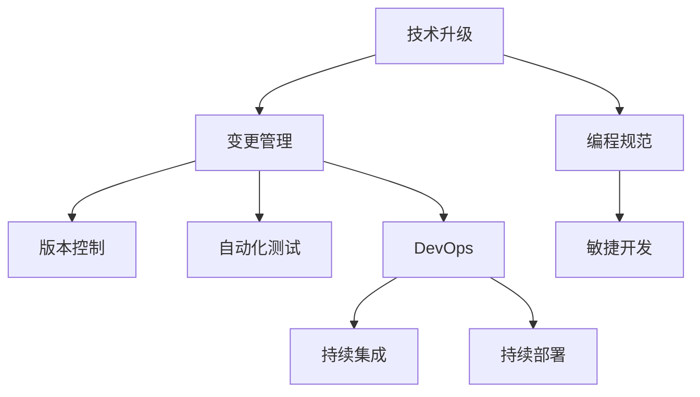

                 

# 程序员如何应对技术升级与变更

> 关键词：技术升级, 变更管理, 编程规范, 版本控制, 自动化测试, DevOps, 持续集成, 敏捷开发

## 1. 背景介绍

### 1.1 问题由来
在软件开发过程中，技术升级与变更是不可避免的。随着科技的迅速发展，新的编程语言、框架、库和工具层出不穷。这些技术升级虽然能够带来性能提升和功能增强，但也带来了学习成本增加和兼容问题等挑战。如何在保证项目平稳运行的同时，快速响应技术变革，是每位程序员必须面对的问题。

### 1.2 问题核心关键点
技术升级与变更的核心在于确保代码的质量、项目的稳定性和团队的协作效率。以下是几个关键点：
1. 持续学习：程序员需要不断更新自己的知识体系，掌握新技术。
2. 兼容性管理：确保新旧技术能够无缝兼容。
3. 版本控制：使用版本控制系统管理代码变更，跟踪变更历史。
4. 自动化测试：通过自动化测试确保新功能不会破坏现有功能。
5. DevOps实践：采用DevOps理念，持续集成和交付，提升开发效率。
6. 敏捷开发：采用敏捷开发方法，快速响应需求变更。

## 2. 核心概念与联系

### 2.1 核心概念概述

为了更好地理解如何应对技术升级与变更，本节将介绍几个密切相关的核心概念：

- 技术升级（Technical Upgrade）：引入新技术或工具，提升软件性能和功能。
- 变更管理（Change Management）：管理代码变更的过程，确保变更的可靠性和兼容性。
- 编程规范（Coding Standard）：编写代码的标准和规则，保证代码风格统一、易于维护。
- 版本控制（Version Control）：记录代码变更历史，管理代码版本的过程。
- 自动化测试（Automated Testing）：通过编写自动化测试脚本，确保代码变更不会破坏已有功能。
- DevOps：开发与运维结合的软件开发实践，提升软件交付效率和质量。
- 持续集成与持续部署（CI/CD）：通过自动化流程，快速集成和交付代码变更。
- 敏捷开发（Agile Development）：采用迭代、增量交付的开发方式，快速响应需求变更。

这些概念之间的逻辑关系可以通过以下Mermaid流程图来展示：



这个流程图展示了一组概念之间的联系和依赖关系：

1. 技术升级作为整个流程的起点，为变更管理提供动力和基础。
2. 编程规范和版本控制是变更管理的支撑工具，保证变更过程的可控性和可追溯性。
3. 自动化测试是变更管理的重要保障，确保新功能不会破坏现有功能。
4. DevOps和CI/CD是变更管理的具体实践，提升变更的效率和可靠性。
5. 敏捷开发是变更管理的理念支撑，保证快速响应需求变更。

这些概念共同构成了技术升级与变更的完整流程，为程序员应对技术变革提供了指导。

## 3. 核心算法原理 & 具体操作步骤
### 3.1 算法原理概述

技术升级与变更的过程，本质上是通过引入新技术、更新代码库、调整开发流程等手段，提升软件系统的性能和功能。这一过程通常包括以下几个步骤：

1. 需求分析：评估技术升级的必要性，明确升级目标。
2. 选择技术方案：对比不同技术的优缺点，选择最适合的技术方案。
3. 代码迁移：将旧代码逐步迁移到新技术或工具上。
4. 自动化测试：确保新功能不会破坏现有功能，保证代码质量。
5. 部署与上线：将新功能发布到生产环境中，监控运行状态。
6. 监控与反馈：实时监控系统运行状态，收集反馈，持续优化。

### 3.2 算法步骤详解

以下是具体的技术升级与变更操作步骤：

**Step 1: 需求分析**
- 确定技术升级的目的和范围，评估升级的必要性和可行性。
- 制定详细的升级计划，包括时间表、人员分配、风险评估等。

**Step 2: 选择技术方案**
- 对比不同技术的优缺点，选择最适合的技术方案。
- 考虑技术的成熟度、社区支持、迁移成本等因素。
- 选择新技术的同时，应考虑其与现有系统的兼容性。

**Step 3: 代码迁移**
- 逐步将旧代码迁移到新技术或工具上，保留旧代码的兼容性。
- 采用模块化开发方式，逐步迁移，减少对系统稳定性的影响。
- 编写文档和示例代码，帮助团队快速适应新技术。

**Step 4: 自动化测试**
- 编写自动化测试用例，覆盖新功能和现有功能。
- 运行自动化测试，确保新功能不会破坏现有功能。
- 使用持续集成工具，实时运行自动化测试，保证代码质量。

**Step 5: 部署与上线**
- 采用持续集成和持续部署（CI/CD）流程，快速发布代码变更。
- 监控新功能在生产环境中的运行状态，及时修复问题。
- 通过回滚机制，在出现问题时快速恢复到上一个稳定版本。

**Step 6: 监控与反馈**
- 实时监控系统运行状态，收集用户反馈。
- 定期进行代码审查，优化代码质量。
- 根据反馈和监控结果，持续优化系统性能和功能。

### 3.3 算法优缺点

技术升级与变更过程的优点：
1. 提升系统性能和功能：新技术往往能够带来性能提升和功能增强。
2. 提高开发效率：自动化测试、持续集成等工具能够提高开发效率。
3. 减少维护成本：新技术通常更加稳定和易维护。
4. 提升用户体验：新技术能够带来更好的用户体验。

技术升级与变更过程的缺点：
1. 学习成本高：新技术的学习和应用需要时间和资源。
2. 兼容性问题：新技术与现有系统可能存在兼容性问题。
3. 风险大：技术升级可能带来系统不稳定或数据丢失等问题。
4. 开发成本高：新技术的引入和迁移需要人力和财力支持。

尽管存在这些缺点，但通过合理的规划和管理，技术升级与变更过程仍然是一种提升系统性能和功能的重要手段。

### 3.4 算法应用领域

技术升级与变更过程在软件开发和运维中广泛应用，具体包括：

1. 前端技术升级：如从HTML5迁移到React、Vue等新前端框架。
2. 后端技术升级：如从Java迁移到Python、Go等新后端语言。
3. 数据库升级：如从MySQL迁移到MongoDB、PostgreSQL等新数据库。
4. DevOps实践：采用DevOps理念，提升软件开发和运维效率。
5. 云计算迁移：如将本地应用迁移到云平台，提升资源利用率。
6. 新技术引入：如引入人工智能、大数据等新技术，提升系统智能化水平。

这些应用领域涵盖了软件开发和运维的各个方面，技术升级与变更过程在其中起到了至关重要的作用。

## 4. 数学模型和公式 & 详细讲解 & 举例说明
### 4.1 数学模型构建

技术升级与变更过程的数学模型通常涉及以下几个关键因素：

- 技术升级成本（C）：引入新技术所需的人力、时间、资金等成本。
- 技术升级收益（B）：新技术带来的性能提升、功能增强等收益。
- 兼容性成本（D）：新技术与现有系统兼容性问题导致的额外开发成本。
- 兼容性收益（E）：新技术带来的兼容性提升，减少维护成本。

形式化地，技术升级与变更的收益-成本模型可以表示为：

$$
ROI = B - C - D + E
$$

其中，ROI表示投资回报率，B表示技术升级收益，C表示技术升级成本，D表示兼容性成本，E表示兼容性收益。

### 4.2 公式推导过程

假设原有系统的运行成本为R，引入新技术后的运行成本为R'。引入新技术后的系统性能为P，原有系统的性能为P0。引入新技术后的兼容性问题数量为N，原有系统的兼容性问题数量为N0。引入新技术后的开发成本为C，原有系统的开发成本为C0。引入新技术后的维护成本为M，原有系统的维护成本为M0。引入新技术后的用户体验为U，原有系统的用户体验为U0。

则技术升级与变更的收益-成本模型可以表示为：

$$
ROI = (P-P0) - C - N - M - U - N0 + E - M0 + U0
$$

通过对比ROI的正负，可以判断技术升级与变更的可行性。

### 4.3 案例分析与讲解

以一个前端框架的升级为例，分析技术升级的收益-成本模型。

假设原有前端框架是Bootstrap，运行成本为R=1000元/月，性能为P0=2000元/月，兼容性问题数量为N0=5个，开发成本为C0=3000元/月，维护成本为M0=2000元/月，用户体验为U0=5分。引入新的前端框架React，运行成本为R'=2000元/月，性能为P=5000元/月，兼容性问题数量为N=0个，开发成本为C=5000元/月，维护成本为M=1500元/月，用户体验为U=8分。

根据上述数据，可以计算出引入React后的ROI为：

$$
ROI = (5000-2000) - (5000-3000) - 0 - (1500-2000) - (8-5) - 0 + 0 - (2000-1500) + (5-8)
$$

$$
ROI = 2500 - 2000 + 0 + 500 - 3 + 0 + 500 - 3 - 3 = 2400元/月
$$

由此可见，引入React后，技术升级的ROI为正，技术升级是可行的。

## 5. 项目实践：代码实例和详细解释说明
### 5.1 开发环境搭建

在进行技术升级与变更的实践前，需要先准备好开发环境。以下是使用Python进行Django开发的开发环境配置流程：

1. 安装Python：从官网下载并安装Python，保证版本与项目要求一致。
2. 安装Django：使用pip安装Django，保证版本与项目要求一致。
3. 创建虚拟环境：使用virtualenv创建虚拟环境，避免依赖冲突。
4. 配置开发环境：在虚拟环境中安装项目所需的依赖包。

完成上述步骤后，即可在虚拟环境中开始开发实践。

### 5.2 源代码详细实现

下面以引入新数据库为例，展示使用Django进行技术升级的代码实现。

首先，定义数据库迁移命令：

```python
from django.db import migrations, models

class Migration(migrations.Migration):

    dependencies = [
        ('myapp', '0001_initial'),
    ]

    operations = [
        migrations.AlterModelOptions(
            name='mymodel',
            options={'ordering': ['created_at'], 'verbose_name': 'My Model'},
        ),
        migrations.AddField(
            model_name='mymodel',
            name='field',
            field=models.TextField(),
        ),
        migrations.AlterField(
            model_name='mymodel',
            name='other_field',
            field=models.CharField(max_length=255),
        ),
    ]
```

然后，运行数据库迁移命令：

```bash
python manage.py makemigrations myapp
python manage.py migrate
```

接着，在开发环境中部署新数据库：

```bash
mydatabase = {
    'ENGINE': 'django.db.backends.mysql',
    'NAME': 'mydatabase',
    'USER': 'mydatabase_user',
    'PASSWORD': 'mydatabase_password',
    'HOST': 'localhost',
    'PORT': '3306',
}
```

最后，在配置文件中添加新数据库：

```python
DATABASES = {
    'default': {
        'ENGINE': 'django.db.backends.mysql',
        'NAME': 'mydatabase',
        'USER': 'mydatabase_user',
        'PASSWORD': 'mydatabase_password',
        'HOST': 'localhost',
        'PORT': '3306',
    },
}
```

通过以上步骤，即可完成对新数据库的引入。

### 5.3 代码解读与分析

让我们再详细解读一下关键代码的实现细节：

**迁移命令**：
- `AlterModelOptions`：修改模型选项，如排序和显示名称。
- `AddField`：添加新字段。
- `AlterField`：修改已有字段。

**部署代码**：
- `mydatabase`：定义新数据库的连接参数。
- `DATABASES`：在配置文件中添加新数据库的连接参数。

这些代码展示了使用Django进行技术升级的具体步骤。通过数据库迁移和配置修改，能够快速将旧数据库迁移到新数据库上，保证项目的平稳运行。

当然，实际的开发环境搭建和迁移实践可能更加复杂，需要考虑更多的细节。但核心的迁移过程与上述示例类似。

## 6. 实际应用场景
### 6.1 技术升级与变更的应用场景

技术升级与变更在软件开发和运维中具有广泛的应用场景，具体包括：

1. 技术选型：选择合适的技术栈，提升系统性能和功能。
2. 代码重构：优化代码结构，提升代码可读性和可维护性。
3. 性能优化：通过技术升级提升系统性能，提升用户体验。
4. 安全加固：引入安全技术，如Web应用防火墙、加密技术等，提升系统安全性。
5. 数据迁移：将旧数据迁移到新系统上，保证数据完整性和安全性。
6. 新技术引入：引入人工智能、大数据等新技术，提升系统智能化水平。

这些场景涵盖了软件开发和运维的各个方面，技术升级与变更在其中起到了至关重要的作用。

### 6.2 未来应用展望

展望未来，技术升级与变更过程将呈现出以下几个发展趋势：

1. 自动化程度提升：通过引入自动化工具，提升技术升级的效率和可靠性。
2. 持续集成和持续部署：采用CI/CD流程，快速集成和交付代码变更，提升开发效率。
3. 敏捷开发方法推广：采用敏捷开发方法，快速响应需求变更，提升开发效率和系统稳定性。
4. DevOps理念深入：采用DevOps理念，提升软件交付效率和质量，保障系统稳定运行。
5. 新技术融合：将新技术与现有系统深度融合，提升系统性能和功能。

这些趋势凸显了技术升级与变更过程的重要性和紧迫性，相信随着技术的不断进步，技术升级与变更过程将更加高效、可靠和可控。

## 7. 工具和资源推荐
### 7.1 学习资源推荐

为了帮助程序员系统掌握技术升级与变更的理论基础和实践技巧，这里推荐一些优质的学习资源：

1. 《软件测试基础》：深入介绍自动化测试的原理和实践方法，帮助程序员掌握测试技巧。
2. 《持续集成和持续部署》：介绍持续集成和持续部署的实践方法，提升开发效率和系统稳定性。
3. 《敏捷开发实践》：介绍敏捷开发方法的理论和实践，提升团队协作和响应速度。
4. 《DevOps实践指南》：介绍DevOps理念和实践，提升软件交付效率和质量。
5. 《Python语言基础》：详细介绍Python语言的基础知识和实践技巧，帮助程序员掌握编程技能。

通过这些资源的学习实践，相信程序员一定能够掌握技术升级与变更的精髓，应对各种技术挑战。

### 7.2 开发工具推荐

高效的开发离不开优秀的工具支持。以下是几款用于技术升级与变更开发的常用工具：

1. PyCharm：一款功能强大的Python开发工具，支持代码自动补全、调试、测试等功能，适合团队协作开发。
2. Visual Studio Code：一款轻量级的代码编辑器，支持多种编程语言，具有强大的扩展能力。
3. Docker：一款开源的容器技术，支持快速部署和迁移应用，提升开发和运维效率。
4. Jenkins：一款开源的持续集成工具，支持自动化构建和测试，提升开发效率和系统稳定性。
5. GitLab：一款开源的DevOps平台，支持代码管理、CI/CD、项目管理等功能，提升团队协作效率。

合理利用这些工具，可以显著提升技术升级与变更任务的开发效率，加快创新迭代的步伐。

### 7.3 相关论文推荐

技术升级与变更过程的研究源于学界的持续探索。以下是几篇奠基性的相关论文，推荐阅读：

1. "The Impact of Technology Upgrade on Software System Performance"：分析技术升级对系统性能的影响。
2. "A Survey of DevOps Practices and Their Impact on Software Delivery"：综述DevOps理念及其对软件交付的影响。
3. "Agile Development: An Introduction"：介绍敏捷开发方法的理论和实践。
4. "A Comparative Study of Continuous Integration and Continuous Deployment"：比较持续集成和持续部署的方法和效果。
5. "A Survey of Software Testing Tools and Techniques"：综述软件测试的工具和技术。

这些论文代表了大规模软件开发和运维技术的发展脉络，通过学习这些前沿成果，可以帮助程序员把握学科前进方向，激发更多的创新灵感。

## 8. 总结：未来发展趋势与挑战
### 8.1 研究成果总结

本文对技术升级与变更过程进行了全面系统的介绍。首先阐述了技术升级与变更的重要性和紧迫性，明确了变更过程的主要步骤和关键因素。其次，从原理到实践，详细讲解了技术升级与变更的数学模型和具体操作，给出了代码实例和详细解释说明。同时，本文还广泛探讨了技术升级与变更过程在软件开发和运维中的实际应用场景，展示了技术升级与变更过程的广泛应用和巨大潜力。

通过本文的系统梳理，可以看到，技术升级与变更过程是软件开发和运维中的重要组成部分，程序员需要不断学习新知识，掌握新技术，提升开发效率和系统稳定性。

### 8.2 未来发展趋势

展望未来，技术升级与变更过程将呈现出以下几个发展趋势：

1. 自动化程度提升：通过引入自动化工具，提升技术升级的效率和可靠性。
2. 持续集成和持续部署：采用CI/CD流程，快速集成和交付代码变更，提升开发效率。
3. 敏捷开发方法推广：采用敏捷开发方法，快速响应需求变更，提升开发效率和系统稳定性。
4. DevOps理念深入：采用DevOps理念，提升软件交付效率和质量，保障系统稳定运行。
5. 新技术融合：将新技术与现有系统深度融合，提升系统性能和功能。

这些趋势凸显了技术升级与变更过程的重要性和紧迫性，相信随着技术的不断进步，技术升级与变更过程将更加高效、可靠和可控。

### 8.3 面临的挑战

尽管技术升级与变更过程已经取得了显著进展，但在迈向更加智能化、普适化应用的过程中，它仍面临诸多挑战：

1. 学习成本高：新技术的学习和应用需要时间和资源。
2. 兼容性问题：新技术与现有系统可能存在兼容性问题。
3. 风险大：技术升级可能带来系统不稳定或数据丢失等问题。
4. 开发成本高：新技术的引入和迁移需要人力和财力支持。
5. 数据迁移复杂：旧数据迁移到新系统上需要时间、精力和资源。
6. 安全性问题：新技术的引入可能带来新的安全风险。

这些挑战需要程序员在技术升级与变更过程中，不断学习和探索，逐步克服。只有通过不断优化开发流程、提升技术水平，才能顺利完成技术升级与变更过程。

### 8.4 研究展望

面对技术升级与变更所面临的种种挑战，未来的研究需要在以下几个方面寻求新的突破：

1. 自动化工具优化：开发更智能、更高效的自动化工具，降低技术升级的难度。
2. 兼容性管理优化：提高新技术与现有系统的兼容性，减少迁移成本。
3. 风险控制优化：制定风险控制策略，减少技术升级的风险。
4. 开发成本控制：优化新技术的引入和迁移流程，降低开发成本。
5. 数据迁移优化：使用更高效的数据迁移工具和技术，降低数据迁移成本。
6. 安全性提升：采用先进的安全技术和管理方法，提升系统的安全性。

这些研究方向将引领技术升级与变更过程迈向更高的台阶，为程序员应对技术变革提供更强大的工具和方法。

## 9. 附录：常见问题与解答
**Q1：技术升级和变更需要多长时间？**

A: 技术升级和变更的时间取决于具体项目的需求和复杂度。通常需要1-6个月，具体时间取决于以下因素：
1. 项目规模：大规模项目需要更长的时间。
2. 技术复杂度：新技术的复杂度越高，时间越久。
3. 团队协作：团队协作效率高，时间越短。

**Q2：如何选择合适的技术方案？**

A: 选择技术方案需要考虑以下几个因素：
1. 功能需求：评估新技术的功能是否满足项目需求。
2. 性能表现：评估新技术的性能是否满足项目要求。
3. 学习成本：评估团队成员对新技术的学习成本。
4. 兼容性：评估新技术与现有系统的兼容性。
5. 社区支持：评估新技术的社区支持和资源丰富度。

**Q3：如何降低技术升级和变更的成本？**

A: 降低技术升级和变更的成本需要从以下几个方面入手：
1. 分阶段升级：分阶段逐步升级，避免一次性大规模变更。
2. 使用现有资源：利用现有系统中的资源，减少新技术的引入成本。
3. 自动化工具：使用自动化工具提升开发效率，减少人力成本。
4. 批量处理：批量处理代码变更，提升变更效率。
5. 外包服务：外包部分技术升级和变更任务，分担成本。

**Q4：如何避免技术升级和变更带来的风险？**

A: 避免技术升级和变更带来的风险需要从以下几个方面入手：
1. 详细评估：在技术升级前进行详细的评估和测试，确保变更的可行性和稳定性。
2. 备份数据：在技术升级前备份重要数据，确保数据的安全性。
3. 定期备份：定期备份数据，避免数据丢失。
4. 制定应急预案：制定应急预案，确保在出现问题时能够快速恢复。
5. 分阶段升级：分阶段逐步升级，避免一次性大规模变更。

**Q5：如何确保技术升级和变更过程中的代码质量？**

A: 确保技术升级和变更过程中的代码质量需要从以下几个方面入手：
1. 自动化测试：编写自动化测试用例，确保新功能不会破坏现有功能。
2. 代码审查：进行代码审查，确保代码质量。
3. 持续集成：采用持续集成工具，实时运行自动化测试，确保代码质量。
4. 版本控制：使用版本控制系统，记录代码变更历史，确保代码可追溯性。
5. 文档完善：完善技术文档，确保团队成员能够理解和维护代码。

这些问题的解答，可以帮助程序员在技术升级与变更过程中，更好地应对各种挑战，确保项目的平稳运行和顺利交付。

---

作者：禅与计算机程序设计艺术 / Zen and the Art of Computer Programming

