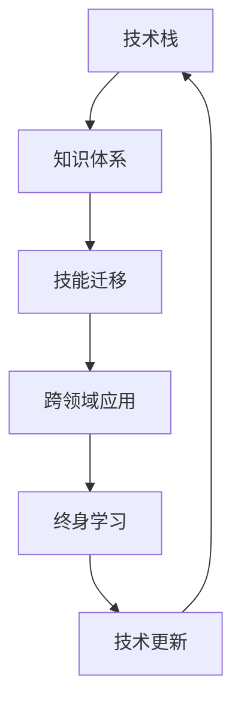

                 

# 程序员如何应对技术更新

> 关键词：技术更新, 持续学习, 技能迁移, 知识体系, 跨领域应用

## 1. 背景介绍

### 1.1 问题由来

在当今飞速发展的科技时代，技术的更新换代速度日益加快。无论是新兴的人工智能、大数据、云计算，还是传统的软件开发、网络安全等领域，都面临着日新月异的变化。作为一名程序员，如何在这种快速变化的环境中保持竞争力，适应新技术，已成为一项艰巨而重要的挑战。

### 1.2 问题核心关键点

程序员应对技术更新的核心关键点在于：
- **持续学习**：不断更新知识体系，掌握新技能。
- **技能迁移**：将已有技能灵活应用到新领域或新场景。
- **跨领域应用**：将不同领域的技术知识有机结合，解决综合性问题。

这些关键点围绕一个核心目标：使自己成为终身学习者，具备不断适应新环境、新挑战的能力。

### 1.3 问题研究意义

掌握应对技术更新的方法，不仅可以帮助程序员在职业生涯中不断进步，提升技术水平，还能推动自身在技术和职业上的持续成长。这对于个人职业发展、技术团队建设、乃至整个IT行业的发展都有着重要的意义。

## 2. 核心概念与联系

### 2.1 核心概念概述

为更好地理解如何应对技术更新，本节将介绍几个密切相关的核心概念：

- **技术栈**：指软件开发中使用的编程语言、框架、工具、库等技术的集合。
- **知识体系**：指在特定技术领域内，系统化的知识结构，包括理论、实践、工具等。
- **技能迁移**：指将某领域内掌握的技能，应用到另一领域的实践。
- **跨领域应用**：指将不同领域的技术知识，整合应用到解决综合性问题中。
- **终身学习**：指在职业生涯中，持续不断地学习新技术、新知识。

这些概念之间的逻辑关系可以通过以下Mermaid流程图来展示：



这个流程图展示了一系列概念之间的联系：

1. 技术栈是知识体系构建的基础。
2. 知识体系是技能迁移和跨领域应用的基础。
3. 技能迁移和跨领域应用是终身学习过程中的重要环节。
4. 终身学习则是应对技术更新的根本手段。

这些概念共同构成了程序员应对技术更新的核心框架，为其提供了清晰的路径和方法。

## 3. 核心算法原理 & 具体操作步骤

### 3.1 算法原理概述

应对技术更新的方法，本质上是通过持续学习和技能迁移，使自己能够快速适应新环境和新需求。这一过程可以类比为机器学习中的迁移学习，即将一个领域的知识迁移到另一个领域，以提升在后者上的性能。

形式化地，假设我们当前掌握的知识体系为 $K$，目标领域为 $D$，目标领域的问题为 $P$。我们的目标是找到一种映射 $f$，使得 $f(K) \subset P$，即能够将已有的知识 $K$ 映射到目标领域的问题 $P$ 中，以提升在 $P$ 上的表现。

### 3.2 算法步骤详解

应对技术更新的方法包括以下几个关键步骤：

**Step 1: 梳理现有技术栈和知识体系**
- 列出当前掌握的技术栈，包括编程语言、框架、工具等。
- 梳理现有的知识体系，包括理论知识、实践经验、项目案例等。
- 评估现有技术栈和知识体系与目标领域的匹配度。

**Step 2: 评估技术差距**
- 对比目标领域的最新技术和最佳实践，找出技术差距。
- 确定需要掌握的新技能和新工具。

**Step 3: 制定学习计划**
- 根据技术差距，制定详细的学习计划，包括学习目标、时间安排、资源选择等。
- 选择优质的学习资源，如在线课程、书籍、技术博客等。

**Step 4: 实施学习与实践**
- 按照学习计划，系统学习新技能和新工具。
- 通过实践项目，巩固和验证所学知识。

**Step 5: 技能迁移与创新应用**
- 将所学技能应用到实际项目中，解决实际问题。
- 不断总结经验，形成跨领域应用的能力。

**Step 6: 持续迭代**
- 定期回顾和更新知识体系，保持与技术发展的同步。
- 参加技术社区活动，与同行交流心得，获取新灵感。

以上是应对技术更新的一般流程。在实际应用中，还需要针对具体目标领域和技术方向，对各个环节进行优化设计，如选择最合适的学习路径、设计更高效的实践项目等，以进一步提升学习效果。

### 3.3 算法优缺点

应对技术更新的方法具有以下优点：
1. 系统性：通过梳理现有知识体系，明确技术差距，制定学习计划，确保学习的系统性和针对性。
2. 高效性：通过选择优质的学习资源和实践项目，可以显著提升学习效率，缩短学习周期。
3. 灵活性：通过技能迁移和跨领域应用，可以在不同技术领域之间灵活转换，应对多种技术挑战。
4. 持续性：通过持续迭代和终身学习，能够不断适应技术变化，保持技术竞争力。

同时，该方法也存在一定的局限性：
1. 学习曲线陡峭：新技术的掌握往往需要时间和精力的投入。
2. 资源限制：高质量的学习资源和实践项目可能不容易获取。
3. 知识冗余：过多的学习内容可能导致知识冗余，增加记忆负担。
4. 缺乏实践机会：理论知识需要通过实践才能真正掌握，但有些技术方向可能缺乏实践机会。

尽管存在这些局限性，但就目前而言，持续学习和技能迁移的方法仍是程序员应对技术更新的主要手段。未来相关研究的重点在于如何进一步降低学习成本，提高学习效率，同时兼顾技能迁移和创新应用。

### 3.4 算法应用领域

应对技术更新的方法在软件开发、人工智能、数据科学、网络安全等多个领域均有广泛应用。例如：

- **软件开发**：通过持续学习和技能迁移，提升编程能力，掌握新技术栈，保持技术竞争力。
- **人工智能**：通过学习最新的机器学习、深度学习、自然语言处理等技术，应用到模型训练、数据处理、应用开发等环节。
- **数据科学**：通过学习大数据、数据挖掘、统计学等技术，应用到数据采集、数据分析、模型构建等环节。
- **网络安全**：通过学习新兴的安全技术，如加密算法、渗透测试、漏洞分析等，提升安全防护能力。

除了上述这些领域外，应对技术更新的方法也被应用于更多的技术方向，如区块链、物联网、可穿戴设备等，为IT技术的发展提供了新的动力。

## 4. 数学模型和公式 & 详细讲解 & 举例说明

### 4.1 数学模型构建

本节将使用数学语言对应对技术更新的方法进行更加严格的刻画。

记当前掌握的知识体系为 $K$，目标领域为 $D$，目标领域的问题为 $P$。假设通过学习新技能 $S$ 和工具 $T$，能够使 $K$ 映射到 $P$ 中，即 $f(K,S,T) \subset P$。

定义知识映射函数 $f$，使得 $f(K,S,T)$ 最小化目标函数 $F$，目标函数 $F$ 表示在目标领域 $D$ 上的性能评估，可以通过以下公式表示：

$$
F(f(K,S,T)) = \min_{f(K,S,T)} \sum_{p \in P} f(K,S,T)(p)
$$

其中，$\sum_{p \in P} f(K,S,T)(p)$ 表示对目标领域 $D$ 上所有问题的性能评估。

### 4.2 公式推导过程

以下我们以机器学习领域为例，推导目标函数的构建过程。

假设当前掌握的知识体系 $K$ 中，包含已有的模型 $M$ 和数据预处理技能 $P$。目标领域 $D$ 为机器学习领域，目标问题 $P$ 为分类问题。

为了解决分类问题，需要学习新的模型 $M'$ 和数据处理技能 $P'$。假设新模型和数据处理技能可以分别由 $S$ 和 $T$ 表示，则新的知识映射函数 $f(K,S,T)$ 可以表示为：

$$
f(K,S,T) = M'(K) \cdot P'(K)
$$

其中，$M'(K)$ 表示学习新的模型 $M'$ 后，知识体系 $K$ 中新增的模型功能，$P'(K)$ 表示学习新的数据处理技能 $P'$ 后，知识体系 $K$ 中新增的数据处理能力。

目标函数 $F$ 可以表示为分类问题的准确率，即：

$$
F(f(K,S,T)) = \min_{f(K,S,T)} \sum_{p \in P} f(K,S,T)(p)
$$

### 4.3 案例分析与讲解

假设一名前端工程师希望掌握深度学习技术，应用于图像分类任务。当前掌握的知识体系为前端开发技能，包括HTML、CSS、JavaScript等。目标领域为深度学习，目标问题为图像分类。

**Step 1: 梳理现有技术栈和知识体系**
- 列出当前前端开发技能，包括前端框架、库、工具等。
- 评估现有技能与深度学习的匹配度，发现存在技术差距。

**Step 2: 评估技术差距**
- 确定需要掌握的新技能，如Python编程、TensorFlow框架、图像处理等。
- 评估学习新技能所需的时间和精力。

**Step 3: 制定学习计划**
- 制定详细的学习计划，包括学习目标、时间安排、资源选择等。
- 选择优质的学习资源，如在线课程、书籍、技术博客等。

**Step 4: 实施学习与实践**
- 按照学习计划，系统学习Python编程、TensorFlow框架、图像处理等技术。
- 通过实践项目，如手写数字识别、物体检测等，巩固和验证所学知识。

**Step 5: 技能迁移与创新应用**
- 将所学技能应用到实际项目中，如使用深度学习技术优化前端页面展示效果。
- 不断总结经验，形成跨领域应用的能力。

**Step 6: 持续迭代**
- 定期回顾和更新知识体系，保持与深度学习技术的同步。
- 参加技术社区活动，与同行交流心得，获取新灵感。

通过以上步骤，前端工程师能够系统地学习深度学习技术，并将其应用到实际项目中，解决图像分类问题，提升自身技术水平。

## 5. 项目实践：代码实例和详细解释说明

### 5.1 开发环境搭建

在进行新技术学习的过程中，需要一个良好的开发环境。以下是Python环境下安装和配置深度学习工具的过程：

1. 安装Anaconda：从官网下载并安装Anaconda，用于创建独立的Python环境。

2. 创建并激活虚拟环境：
```bash
conda create -n pytorch-env python=3.8 
conda activate pytorch-env
```

3. 安装PyTorch：根据CUDA版本，从官网获取对应的安装命令。例如：
```bash
conda install pytorch torchvision torchaudio cudatoolkit=11.1 -c pytorch -c conda-forge
```

4. 安装TensorFlow：
```bash
pip install tensorflow
```

5. 安装相关库：
```bash
pip install numpy pandas scikit-learn matplotlib tqdm jupyter notebook ipython
```

完成上述步骤后，即可在`pytorch-env`环境中开始深度学习实践。

### 5.2 源代码详细实现

下面以图像分类任务为例，给出使用TensorFlow对卷积神经网络（CNN）进行训练的PyTorch代码实现。

首先，定义数据处理函数：

```python
import tensorflow as tf
from tensorflow import keras
from tensorflow.keras import layers

def load_data():
    mnist = keras.datasets.mnist
    (train_images, train_labels), (test_images, test_labels) = mnist.load_data()
    train_images = train_images / 255.0
    test_images = test_images / 255.0
    return train_images, train_labels, test_images, test_labels

# 数据加载
train_images, train_labels, test_images, test_labels = load_data()
```

然后，定义模型和损失函数：

```python
def build_model(input_shape):
    model = keras.Sequential([
        layers.Flatten(input_shape=input_shape),
        layers.Dense(128, activation='relu'),
        layers.Dense(10, activation='softmax')
    ])
    return model

# 模型定义
input_shape = (28, 28)
model = build_model(input_shape)

# 损失函数
loss_fn = tf.keras.losses.SparseCategoricalCrossentropy(from_logits=True)

# 编译模型
model.compile(optimizer='adam', loss=loss_fn, metrics=['accuracy'])
```

接着，定义训练和评估函数：

```python
def train_model(model, train_images, train_labels, epochs):
    model.fit(train_images, train_labels, epochs=epochs, validation_data=(test_images, test_labels))

def evaluate_model(model, test_images, test_labels):
    test_loss, test_acc = model.evaluate(test_images, test_labels)
    print(f'Test accuracy: {test_acc:.2f}')
```

最后，启动训练流程并在测试集上评估：

```python
epochs = 10

train_model(model, train_images, train_labels, epochs)
evaluate_model(model, test_images, test_labels)
```

以上就是使用TensorFlow对CNN进行图像分类任务微调的完整代码实现。可以看到，通过TensorFlow提供的高级API，代码实现非常简洁高效。

### 5.3 代码解读与分析

让我们再详细解读一下关键代码的实现细节：

**load_data函数**：
- 加载MNIST数据集，对图像数据进行归一化处理，并返回训练集和测试集。

**build_model函数**：
- 定义一个简单的CNN模型，包括输入层、隐藏层和输出层。
- 使用ReLU激活函数和非线性输出层。

**模型编译**：
- 使用Adam优化器和交叉熵损失函数，设置模型在训练过程中的优化参数。
- 模型评估指标为准确率。

**训练函数train_model**：
- 使用训练集数据对模型进行前向传播和反向传播，更新模型参数。
- 设置训练轮数和验证集数据。

**评估函数evaluate_model**：
- 使用测试集数据对模型进行评估，输出模型的准确率。

**训练流程**：
- 设定训练轮数为10轮，调用训练函数对模型进行训练。
- 在训练结束后，调用评估函数输出模型在测试集上的准确率。

可以看到，通过以上步骤，前端工程师能够系统地学习深度学习技术，并将其应用到图像分类任务中，提升自身技术水平。

## 6. 实际应用场景

### 6.1 智能客服系统

基于深度学习技术的智能客服系统，能够快速响应客户咨询，提升客户体验。通过微调，模型可以自动理解客户意图，匹配最合适的答案模板进行回复。

在技术实现上，可以收集企业内部的历史客服对话记录，将问题和最佳答复构建成监督数据，在此基础上对预训练模型进行微调。微调后的模型能够自动理解用户意图，匹配最合适的答案模板进行回复。对于客户提出的新问题，还可以接入检索系统实时搜索相关内容，动态组织生成回答。如此构建的智能客服系统，能大幅提升客户咨询体验和问题解决效率。

### 6.2 金融舆情监测

金融机构需要实时监测市场舆论动向，以便及时应对负面信息传播，规避金融风险。传统的人工监测方式成本高、效率低，难以应对网络时代海量信息爆发的挑战。基于深度学习技术的文本分类和情感分析技术，为金融舆情监测提供了新的解决方案。

具体而言，可以收集金融领域相关的新闻、报道、评论等文本数据，并对其进行主题标注和情感标注。在此基础上对预训练语言模型进行微调，使其能够自动判断文本属于何种主题，情感倾向是正面、中性还是负面。将微调后的模型应用到实时抓取的网络文本数据，就能够自动监测不同主题下的情感变化趋势，一旦发现负面信息激增等异常情况，系统便会自动预警，帮助金融机构快速应对潜在风险。

### 6.3 个性化推荐系统

当前的推荐系统往往只依赖用户的历史行为数据进行物品推荐，无法深入理解用户的真实兴趣偏好。基于深度学习技术的个性化推荐系统，可以更好地挖掘用户行为背后的语义信息，从而提供更精准、多样的推荐内容。

在实践中，可以收集用户浏览、点击、评论、分享等行为数据，提取和用户交互的物品标题、描述、标签等文本内容。将文本内容作为模型输入，用户的后续行为（如是否点击、购买等）作为监督信号，在此基础上微调深度学习模型。微调后的模型能够从文本内容中准确把握用户的兴趣点。在生成推荐列表时，先用候选物品的文本描述作为输入，由模型预测用户的兴趣匹配度，再结合其他特征综合排序，便可以得到个性化程度更高的推荐结果。

### 6.4 未来应用展望

随着深度学习技术的发展，基于深度学习技术的智能系统将在更多领域得到应用，为传统行业带来变革性影响。

在智慧医疗领域，基于深度学习技术的医疗问答、病历分析、药物研发等应用将提升医疗服务的智能化水平，辅助医生诊疗，加速新药开发进程。

在智能教育领域，基于深度学习技术的作业批改、学情分析、知识推荐等应用将因材施教，促进教育公平，提高教学质量。

在智慧城市治理中，基于深度学习技术的城市事件监测、舆情分析、应急指挥等应用将提高城市管理的自动化和智能化水平，构建更安全、高效的未来城市。

此外，在企业生产、社会治理、文娱传媒等众多领域，基于深度学习技术的智能应用也将不断涌现，为经济社会发展注入新的动力。相信随着技术的日益成熟，深度学习技术必将在更广阔的应用领域大放异彩，深刻影响人类的生产生活方式。

## 7. 工具和资源推荐

### 7.1 学习资源推荐

为了帮助程序员系统掌握深度学习技术的理论基础和实践技巧，这里推荐一些优质的学习资源：

1. 《深度学习》书籍：Ian Goodfellow、Yoshua Bengio和Aaron Courville合著的经典书籍，全面介绍了深度学习的原理、算法、应用等。

2. 深度学习专项课程：如Coursera、edX等平台的深度学习专项课程，涵盖理论、实践、案例等多个方面。

3. 深度学习社区：如GitHub、Kaggle等社区，可以获取最新的深度学习研究进展、竞赛项目、开源代码等。

4. 学术论文：如arXiv、Google Scholar等平台，可以获取最新的深度学习研究成果和论文。

5. 在线课程：如Udacity、Udemy等平台的深度学习课程，涵盖从入门到进阶的内容。

通过对这些资源的学习实践，相信你一定能够快速掌握深度学习技术的精髓，并用于解决实际的深度学习问题。

### 7.2 开发工具推荐

高效的开发离不开优秀的工具支持。以下是几款用于深度学习开发的常用工具：

1. PyTorch：基于Python的开源深度学习框架，灵活动态的计算图，适合快速迭代研究。

2. TensorFlow：由Google主导开发的开源深度学习框架，生产部署方便，适合大规模工程应用。

3. Keras：高级深度学习API，易于使用，可以快速构建和训练深度学习模型。

4. Jupyter Notebook：免费的开源工具，支持Python代码的交互式执行，适合做数据探索和模型验证。

5. Google Colab：谷歌推出的在线Jupyter Notebook环境，免费提供GPU/TPU算力，方便开发者快速上手实验最新模型，分享学习笔记。

合理利用这些工具，可以显著提升深度学习任务的开发效率，加快创新迭代的步伐。

### 7.3 相关论文推荐

深度学习技术的发展源于学界的持续研究。以下是几篇奠基性的相关论文，推荐阅读：

1. AlexNet：ImageNet大规模视觉识别竞赛冠军，标志着深度学习在计算机视觉领域的重大突破。

2. VGGNet：引入了卷积神经网络的多层结构，极大地提升了深度学习模型的性能。

3. ResNet：通过引入残差连接，解决了深度神经网络中的梯度消失问题，使模型可以更深。

4. InceptionNet：通过多尺度卷积核的设计，提升了模型对图像特征的提取能力。

5. RNN与LSTM：引入了长短期记忆网络，解决了序列数据建模中的时间依赖问题。

6. Transformer：通过引入自注意力机制，提升了模型对序列数据的处理能力，推动了自然语言处理等领域的发展。

这些论文代表了大深度学习技术的发展脉络。通过学习这些前沿成果，可以帮助研究者把握学科前进方向，激发更多的创新灵感。

## 8. 总结：未来发展趋势与挑战

### 8.1 总结

本文对如何应对技术更新的方法进行了全面系统的介绍。首先阐述了持续学习和技能迁移的重要性，明确了技能迁移和跨领域应用在终身学习过程中的关键作用。其次，从原理到实践，详细讲解了深度学习技术的学习和应用方法，给出了深度学习任务开发的完整代码实例。同时，本文还广泛探讨了深度学习技术在智能客服、金融舆情、个性化推荐等多个行业领域的应用前景，展示了深度学习技术的广阔前景。

通过本文的系统梳理，可以看到，深度学习技术在软件开发、人工智能、数据科学、网络安全等多个领域均有广泛应用，为IT技术的发展提供了新的动力。未来，伴随深度学习技术的持续演进，其在更多领域的应用还将进一步拓展，深刻影响人类的生产生活方式。

### 8.2 未来发展趋势

展望未来，深度学习技术的发展将呈现以下几个趋势：

1. 模型规模持续增大。随着算力成本的下降和数据规模的扩张，深度学习模型的参数量还将持续增长。超大规模模型蕴含的丰富特征表示，有望支撑更加复杂多变的应用场景。

2. 自监督学习的发展。自监督学习技术能够利用无标签数据进行预训练，进一步降低对标注数据的需求，提升模型的泛化性能。

3. 模型结构多样化。除了传统的全连接神经网络、卷积神经网络、循环神经网络，未来还将涌现更多多样化的模型结构，如变分自编码器、生成对抗网络等。

4. 跨领域应用的深化。深度学习技术与自然语言处理、计算机视觉、语音识别等多个领域的结合将更加紧密，形成更加强大、通用的智能系统。

5. 实际应用场景的扩展。深度学习技术将广泛应用于智慧医疗、智能教育、智能交通等领域，推动各行各业的数字化转型。

6. 伦理和可解释性。随着深度学习技术在实际应用中的普及，其伦理和可解释性问题也将日益受到重视，推动技术的可持续发展。

以上趋势凸显了深度学习技术的广阔前景。这些方向的探索发展，必将进一步提升深度学习系统的性能和应用范围，为经济社会发展注入新的动力。

### 8.3 面临的挑战

尽管深度学习技术已经取得了瞩目成就，但在迈向更加智能化、普适化应用的过程中，它仍面临着诸多挑战：

1. 标注成本瓶颈。深度学习模型的训练和微调需要大量的标注数据，而高质量标注数据的获取往往成本较高。如何降低对标注数据的依赖，将是一大难题。

2. 模型鲁棒性不足。深度学习模型面对噪声数据、小样本数据等外部干扰时，往往容易过拟合，泛化性能不足。如何提高模型的鲁棒性，确保在复杂环境中的稳定性，还需要更多理论和实践的积累。

3. 推理效率问题。深度学习模型的推理速度往往较慢，对硬件资源的要求较高。如何在保证性能的同时，优化模型的计算图，提高推理效率，优化资源占用，将是重要的优化方向。

4. 可解释性不足。深度学习模型通常被认为是"黑盒"系统，难以解释其内部工作机制和决策逻辑。如何赋予深度学习模型更强的可解释性，将是亟待攻克的难题。

5. 安全性问题。深度学习模型可能学习到有偏见、有害的信息，输出可能导致误导性、歧视性的结果，给实际应用带来安全隐患。如何从数据和算法层面消除模型偏见，确保输出的安全性，也将是重要的研究课题。

6. 数据隐私保护。深度学习模型通常需要大量数据进行训练，如何保护数据的隐私和安全，避免数据泄露和滥用，将是未来的一个重要研究方向。

正视深度学习面临的这些挑战，积极应对并寻求突破，将是大深度学习技术走向成熟的必由之路。相信随着学界和产业界的共同努力，这些挑战终将一一被克服，深度学习技术必将在构建人机协同的智能时代中扮演越来越重要的角色。

### 8.4 研究展望

面对深度学习技术所面临的挑战，未来的研究需要在以下几个方面寻求新的突破：

1. 探索无监督和半监督学习技术。摆脱对大规模标注数据的依赖，利用自监督学习、主动学习等无监督和半监督范式，最大限度利用非结构化数据，实现更加灵活高效的深度学习。

2. 研究高效的模型压缩与优化方法。开发更加高效的模型压缩和优化技术，在保持模型性能的同时，减小模型参数和计算资源需求。

3. 引入更多先验知识。将符号化的先验知识，如知识图谱、逻辑规则等，与深度学习模型进行巧妙融合，引导深度学习模型学习更准确、合理的特征表示。

4. 结合因果分析和博弈论工具。将因果分析方法引入深度学习模型，识别出模型决策的关键特征，增强输出解释的因果性和逻辑性。借助博弈论工具刻画人机交互过程，主动探索并规避模型的脆弱点，提高系统稳定性。

5. 纳入伦理道德约束。在深度学习模型的训练目标中引入伦理导向的评估指标，过滤和惩罚有害的输出倾向。加强人工干预和审核，建立模型行为的监管机制，确保输出符合人类价值观和伦理道德。

这些研究方向和技术的探索，必将引领深度学习技术迈向更高的台阶，为构建安全、可靠、可解释、可控的智能系统铺平道路。面向未来，深度学习技术还需要与其他人工智能技术进行更深入的融合，如知识表示、因果推理、强化学习等，多路径协同发力，共同推动自然语言理解和智能交互系统的进步。只有勇于创新、敢于突破，才能不断拓展深度学习模型的边界，让智能技术更好地造福人类社会。

## 9. 附录：常见问题与解答

**Q1：深度学习模型如何应对标注数据不足的问题？**

A: 深度学习模型可以采用以下几种方法应对标注数据不足的问题：
1. 数据增强：通过图像旋转、裁剪、缩放等方式生成更多的训练样本。
2. 半监督学习：利用未标注数据进行预训练，使用少量标注数据进行微调。
3. 迁移学习：利用在其他领域上预训练的模型，微调成新的任务。
4. 无监督学习：利用无标签数据进行自监督学习，自动生成监督信号。
5. 主动学习：在少量标注数据的情况下，主动选择对模型提升最大的样本进行标注。

这些方法可以组合使用，根据具体情况选择最合适的方式。

**Q2：深度学习模型如何避免过拟合？**

A: 深度学习模型可以采用以下几种方法避免过拟合：
1. 数据增强：通过生成更多的训练样本，减少过拟合的风险。
2. 正则化：使用L2正则、Dropout等方法，防止模型过度适应训练数据。
3. 早停法：在验证集上观察模型性能，当性能不再提升时停止训练。
4. 集成学习：通过组合多个模型，提高泛化性能。
5. 参数共享：共享部分参数，减少模型复杂度。

这些方法可以结合使用，根据具体情况选择最合适的方式。

**Q3：如何提高深度学习模型的推理效率？**

A: 深度学习模型可以采用以下几种方法提高推理效率：
1. 模型压缩：使用模型剪枝、量化等方法减小模型参数和计算资源需求。
2. 推理加速：使用GPU、TPU等硬件加速，优化计算图，减少推理时间。
3. 推理框架：使用TensorFlow、PyTorch等框架进行高效的推理计算。
4. 混合精度训练：使用16位或32位浮点数进行训练和推理，提高计算效率。
5. 分布式推理：将推理任务分布到多个计算节点，提高计算速度。

这些方法可以结合使用，根据具体情况选择最合适的方式。

**Q4：如何提高深度学习模型的可解释性？**

A: 深度学习模型可以采用以下几种方法提高可解释性：
1. 可解释性模型：使用可解释性模型，如LIME、SHAP等，生成模型解释。
2. 特征重要性：使用特征重要性分析，评估模型对每个特征的依赖程度。
3. 可视化工具：使用可视化工具，如TensorBoard、ModelScope等，分析模型结构。
4. 因果分析：使用因果分析方法，解释模型决策的因果逻辑。
5. 逻辑回归：使用逻辑回归等简单模型，对复杂模型的预测结果进行解释。

这些方法可以结合使用，根据具体情况选择最合适的方式。

**Q5：如何保护深度学习模型的数据隐私？**

A: 深度学习模型可以采用以下几种方法保护数据隐私：
1. 差分隐私：通过添加噪声，保护数据隐私。
2. 数据匿名化：对数据进行匿名化处理，保护用户隐私。
3. 联邦学习：在分布式环境中，不共享数据，而是在本地训练模型。
4. 加密技术：对数据进行加密处理，防止数据泄露。
5. 数据脱敏：对数据进行脱敏处理，保护数据隐私。

这些方法可以结合使用，根据具体情况选择最合适的方式。

---

作者：禅与计算机程序设计艺术 / Zen and the Art of Computer Programming

