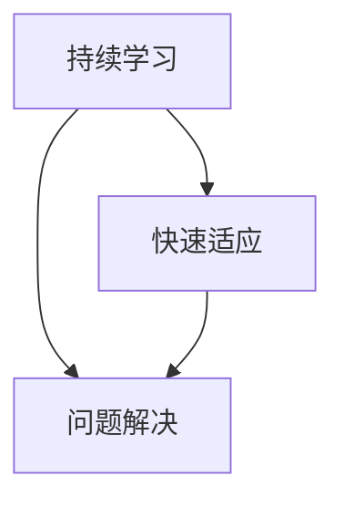

                 

# 程序员如何应对技术栈快速更新

## 1. 背景介绍

### 1.1 问题由来

在当前的科技行业中，技术栈的变化日新月异。新的编程语言、框架和工具层出不穷，而技术的更新换代速度也在不断加快。对于程序员而言，要想跟上这个快速变化的时代，就需要不断地学习新技术，更新自己的技术栈。然而，技术的快速更新也带来了巨大的挑战，比如学习成本高、技术深度大、应用场景复杂等。如何在技术栈快速更新的环境下，有效地应对挑战，提升个人和团队的能力，成为每一位程序员必须面对的问题。

### 1.2 问题核心关键点

当前，技术栈的快速更新主要表现在以下几个方面：

- **技术迭代速度加快**：新的技术框架、库和工具不断涌现，旧的技术逐渐被淘汰。
- **技术深度不断增加**：技术的复杂度越来越高，需要掌握的知识面也更加广泛。
- **技术应用场景多元化**：技术的应用场景越来越多样化，需要灵活运用各种技术。

为了应对这些挑战，程序员需要具备以下几个关键能力：

- **持续学习的能力**：不断更新知识，学习新技术。
- **快速适应的能力**：快速掌握新技术，应用到实际项目中。
- **问题解决的能力**：具备良好的问题解决能力，能够应对各种复杂的技术问题。

## 2. 核心概念与联系

### 2.1 核心概念概述

要应对技术栈的快速更新，首先需要理解几个核心概念：

- **持续学习**：不断更新自己的知识体系，跟上技术发展的步伐。
- **快速适应**：迅速掌握新技术，并将其应用到实际项目中。
- **问题解决**：具备解决复杂技术问题的能力，能够在遇到问题时迅速找到解决方案。

这些概念之间有着密切的联系：持续学习是基础，快速适应是手段，问题解决是目标。只有通过持续学习，掌握新技术，才能快速适应变化，解决实际问题。

### 2.2 核心概念原理和架构的 Mermaid 流程图

## 3. 核心算法原理 & 具体操作步骤

### 3.1 算法原理概述

基于上述核心概念，本文将探讨一种能够帮助程序员应对技术栈快速更新的方法论。

**方法论概述**：
1. **持续学习**：通过阅读书籍、参加培训、参与社区讨论等方式，不断更新自己的知识体系。
2. **快速适应**：通过实践、项目、挑战赛等方式，快速掌握新技术，并将其应用到实际项目中。
3. **问题解决**：通过分解问题、查找资料、尝试不同解决方案等方式，解决复杂的实际问题。

### 3.2 算法步骤详解

#### 3.2.1 持续学习

**步骤1：选择合适的学习资源**
- 阅读相关书籍、博客、论文等。
- 参加线上线下培训课程、技术讲座等。
- 参与技术社区讨论，如Stack Overflow、GitHub等。

**步骤2：制定学习计划**
- 确定学习目标和内容。
- 制定合理的学习计划，包括学习时间、学习方式等。
- 定期回顾和调整学习计划。

**步骤3：实际应用**
- 将学习到的知识应用到实际项目中，加深理解。
- 通过实践巩固知识，发现不足。

#### 3.2.2 快速适应

**步骤1：项目实践**
- 选择有挑战性的项目，如开源项目、新技术项目等。
- 深入理解项目需求，设计解决方案。
- 在项目中不断调整和优化方案。

**步骤2：技术竞赛**
- 参与编程比赛、技术挑战赛等，挑战自我。
- 在比赛中学习其他优秀的解决方案，积累经验。
- 在比赛后总结经验教训，持续改进。

**步骤3：跨学科应用**
- 将所学技术应用到其他领域，拓宽应用场景。
- 跨领域学习，如将AI技术应用到数据分析、医疗等领域。

#### 3.2.3 问题解决

**步骤1：分解问题**
- 将复杂问题分解成多个小问题。
- 逐一解决每个小问题。
- 验证每个小问题的解决方案是否正确。

**步骤2：查找资料**
- 利用搜索引擎、技术文档、社区讨论等查找资料。
- 寻找相关案例和解决方案。

**步骤3：尝试不同解决方案**
- 尝试多种解决方案，找到最优方案。
- 评估每种方案的优缺点，选择最佳方案。

### 3.3 算法优缺点

**优点**：
- 系统化学习，不断提高技术水平。
- 通过实践和挑战，迅速掌握新技术。
- 解决实际问题，积累经验，提升技能。

**缺点**：
- 学习成本高，需要投入大量时间和精力。
- 技术栈变化快，需要不断更新知识。
- 问题复杂多样，需要灵活运用各种技术。

### 3.4 算法应用领域

该方法论可以应用于各种技术栈的变化场景中，如：

- **Web开发**：学习新的Web框架、前端库等。
- **移动开发**：学习新的移动开发技术、跨平台开发框架等。
- **数据科学**：学习新的数据分析工具、机器学习框架等。
- **云计算**：学习新的云平台、容器技术等。

## 4. 数学模型和公式 & 详细讲解 & 举例说明

### 4.1 数学模型构建

**模型概述**：
1. **持续学习模型**：通过学习资源、学习计划、实践应用等方式，不断更新知识体系。
2. **快速适应模型**：通过项目实践、技术竞赛、跨学科应用等方式，快速掌握新技术。
3. **问题解决模型**：通过分解问题、查找资料、尝试不同解决方案等方式，解决实际问题。

**模型公式**：
$$
\text{持续学习} = f(\text{学习资源}, \text{学习计划}, \text{实践应用})
$$
$$
\text{快速适应} = f(\text{项目实践}, \text{技术竞赛}, \text{跨学科应用})
$$
$$
\text{问题解决} = f(\text{分解问题}, \text{查找资料}, \text{尝试不同解决方案})
$$

### 4.2 公式推导过程

**推导过程**：
1. **持续学习**：
   - 选择学习资源，设定学习目标，制定学习计划，通过实践巩固知识。
   - 学习资源：$R$，学习目标：$G$，学习计划：$P$。
   - 学习计划：$P = f(G, R)$。
   - 实践巩固知识：$K = P \cdot f(R)$。

2. **快速适应**：
   - 选择项目实践，参与技术竞赛，应用到其他领域，不断调整和优化解决方案。
   - 项目实践：$P$，技术竞赛：$C$，跨学科应用：$X$。
   - 快速适应：$A = P \cdot C \cdot X$。

3. **问题解决**：
   - 分解问题，查找资料，尝试不同解决方案，评估方案并选择最佳方案。
   - 分解问题：$D$，查找资料：$F$，尝试不同解决方案：$S$。
   - 问题解决：$S = D \cdot F \cdot S$。

### 4.3 案例分析与讲解

**案例1：学习新的Web框架React**

- **持续学习**：
  - 阅读书籍和博客，参加培训课程。
  - 设定学习目标：掌握React的基本用法和高级特性。
  - 制定学习计划：每天阅读1章书籍，每周完成一个实战项目。
  - 实践巩固知识：通过实战项目加深理解，发现不足。

- **快速适应**：
  - 选择有挑战性的项目，如电商网站、数据可视化应用等。
  - 参与React社区讨论，获取最新的开发技巧。
  - 跨领域应用：将React技术应用到数据分析项目中。

- **问题解决**：
  - 分解问题：将电商网站分解成多个模块，如商品展示、购物车、结算等。
  - 查找资料：利用React文档、社区讨论等查找解决方案。
  - 尝试不同解决方案：尝试多种React状态管理方案，找到最优方案。

## 5. 项目实践：代码实例和详细解释说明

### 5.1 开发环境搭建

**环境搭建**：
1. 安装Python、Node.js等开发环境。
2. 安装相关开发工具，如Visual Studio Code、Git等。
3. 配置版本控制，如GitHub、GitLab等。
4. 搭建开发环境，如Docker、Kubernetes等。

### 5.2 源代码详细实现

**实现步骤**：
1. **持续学习**：
   - 阅读书籍和博客，获取相关知识。
   - 实践应用：通过编写小项目，加深理解。

2. **快速适应**：
   - 选择有挑战性的项目，如开源项目、新技术项目等。
   - 深入理解项目需求，设计解决方案。
   - 在项目中不断调整和优化方案。

3. **问题解决**：
   - 分解问题：将复杂问题分解成多个小问题。
   - 查找资料：利用搜索引擎、技术文档、社区讨论等查找资料。
   - 尝试不同解决方案：尝试多种解决方案，找到最优方案。

### 5.3 代码解读与分析

**代码解读**：
1. **持续学习**：
   - 阅读书籍和博客：使用Python爬虫获取相关书籍和博客资源，通过Jupyter Notebook进行阅读和实践。
   - 编写小项目：通过编写小项目，如简单的React应用、数据分析项目等，加深理解。

2. **快速适应**：
   - 选择有挑战性的项目：选择开源项目或新技术项目，如TensorFlow、PyTorch等。
   - 深入理解项目需求：分析项目需求，设计解决方案，编写代码。
   - 调整和优化方案：根据项目反馈，调整和优化解决方案，完善代码。

3. **问题解决**：
   - 分解问题：将复杂问题分解成多个小问题，如数据清洗、模型训练、模型评估等。
   - 查找资料：利用搜索引擎、技术文档、社区讨论等查找资料，如Kaggle数据集、TensorFlow文档等。
   - 尝试不同解决方案：尝试多种解决方案，如不同的模型、算法等，选择最优方案。

### 5.4 运行结果展示

**运行结果**：
1. **持续学习**：通过阅读和实践，掌握新的技术，提高技术水平。
2. **快速适应**：通过项目实践，迅速掌握新技术，应用到实际项目中。
3. **问题解决**：通过分解问题、查找资料、尝试不同解决方案，解决复杂的实际问题。

## 6. 实际应用场景

### 6.1 数据科学

在数据科学领域，技术的快速更新主要体现在数据分析工具和机器学习框架的迭代。

- **持续学习**：学习新的数据分析工具，如Pandas、NumPy等。
- **快速适应**：参与Kaggle竞赛，应用新的机器学习框架，如Scikit-learn、TensorFlow等。
- **问题解决**：解决复杂的数据分析问题，如数据清洗、特征工程、模型评估等。

### 6.2 移动开发

在移动开发领域，技术的快速更新主要体现在移动开发框架和跨平台技术的迭代。

- **持续学习**：学习新的移动开发框架，如React Native、Flutter等。
- **快速适应**：参与技术竞赛，应用新的跨平台开发技术，如WebAssembly、React Native等。
- **问题解决**：解决跨平台开发的复杂问题，如UI渲染、性能优化、网络通信等。

### 6.3 云计算

在云计算领域，技术的快速更新主要体现在云平台和容器技术的迭代。

- **持续学习**：学习新的云平台，如AWS、Azure等。
- **快速适应**：参与技术竞赛，应用新的容器技术，如Kubernetes、Docker等。
- **问题解决**：解决云平台和容器技术的复杂问题，如容器编排、微服务架构、弹性伸缩等。

## 7. 工具和资源推荐

### 7.1 学习资源推荐

**书籍推荐**：
1. 《深入浅出设计模式》：深入理解设计模式，提升编程能力。
2. 《Clean Code》：学习代码编写规范，提高代码质量。
3. 《程序员的自我修养》：提升程序员软技能，如沟通、团队合作等。

**在线资源推荐**：
1. Udemy、Coursera：提供各种编程语言和技术栈的在线课程。
2. GitHub、Stack Overflow：查找技术资料和解决方案。
3. Medium：阅读最新的技术文章和博客。

### 7.2 开发工具推荐

**IDE推荐**：
1. Visual Studio Code：功能强大，支持多种编程语言。
2. IntelliJ IDEA：适用于Java、Kotlin等开发。
3. Xcode：适用于iOS、macOS等开发。

**开发框架推荐**：
1. React：适用于Web前端开发。
2. Vue：适用于Web前端开发。
3. TensorFlow：适用于机器学习和深度学习开发。

### 7.3 相关论文推荐

**论文推荐**：
1. "A Survey on Deep Learning-based Software Evolution"：综述了基于深度学习的软件演化技术。
2. "Practical Deep Learning for Coders"：介绍了深度学习在软件开发中的应用。
3. "Programming Paradigms"：介绍了各种编程范式和设计模式。

## 8. 总结：未来发展趋势与挑战

### 8.1 研究成果总结

本文介绍了应对技术栈快速更新的方法论，涵盖持续学习、快速适应和问题解决三个关键方面。通过实际项目和案例分析，展示了该方法论在数据科学、移动开发、云计算等领域的应用效果。

### 8.2 未来发展趋势

未来，技术的快速更新将继续加速，对程序员提出了更高的要求。以下是一些可能的发展趋势：

1. **自动化和智能化**：自动化开发工具和智能化编程助手将成为主流。
2. **跨领域融合**：跨学科的应用场景将不断增加，需要具备多领域的知识。
3. **云原生架构**：云原生架构将成为主流，需要掌握云平台和容器技术。
4. **人工智能**：AI技术在软件开发中的应用将更加广泛，需要具备AI相关知识。

### 8.3 面临的挑战

技术栈的快速更新也带来了诸多挑战，如：

1. **学习成本高**：需要不断更新知识，投入大量时间和精力。
2. **技术深度大**：新技术的深度和复杂度增加，需要不断学习和实践。
3. **问题复杂多样**：各种技术的应用场景复杂多样，需要灵活运用各种技术。

### 8.4 研究展望

未来，需要进一步研究和探索以下方向：

1. **自动化学习**：开发自动化学习工具，辅助程序员学习和掌握新技术。
2. **智能推荐**：开发智能推荐系统，推荐最适合的培训和项目实践。
3. **知识图谱**：构建知识图谱，整合各种技术知识和实践经验，提供更全面的学习资源。

## 9. 附录：常见问题与解答

**Q1：如何保持持续学习的动力？**

A: 设定学习目标和计划，定期回顾和调整，保持学习的热情和动力。

**Q2：如何快速适应新技术？**

A: 选择有挑战性的项目，深入理解项目需求，不断调整和优化解决方案。

**Q3：如何解决复杂的技术问题？**

A: 分解问题，查找资料，尝试不同解决方案，评估方案并选择最佳方案。

**Q4：如何提高问题解决能力？**

A: 多读多写多练，积累经验，提升解决问题的能力。

**Q5：如何平衡学习和发展？**

A: 合理安排时间和精力，兼顾学习和发展，保持身心健康。

---

作者：禅与计算机程序设计艺术 / Zen and the Art of Computer Programming

