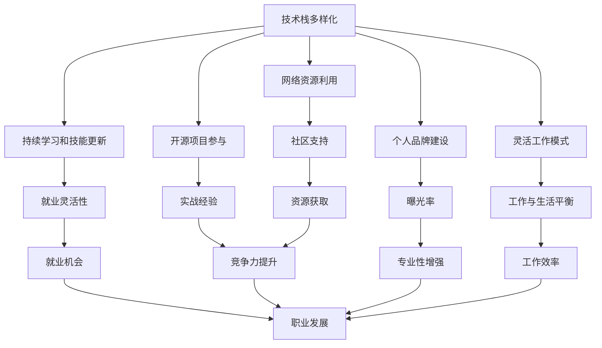

                 

## 1. 背景介绍

### 1.1 问题由来

在面对经济衰退挑战时，作为一名程序员，我们可能需要重新思考工作的方式和策略，以保持竞争力和适应性。技术领域的快速发展带来了新的挑战和机遇，尤其在经济不景气时，保持学习和适应新趋势的能力显得尤为重要。

### 1.2 问题核心关键点

经济衰退对技术行业的影响主要体现在以下几个方面：

- **就业市场波动**：公司可能缩减招聘，导致求职者面临更大的竞争压力。
- **预算压缩**：项目资金可能被缩减，要求程序员在现有预算内完成更多任务。
- **技术迭代加速**：市场竞争加剧，新技术不断涌现，要求程序员持续学习以保持竞争力。
- **经济压力**：薪资可能停滞或下降，导致生活成本增加。

### 1.3 问题研究意义

理解和应对经济衰退挑战，对于程序员来说，不仅能帮助我们在当前的经济环境中保持稳定，还能为未来的职业发展奠定坚实基础。掌握正确的应对策略，可以使我们在经济低迷时保持技能更新和职业成长。

## 2. 核心概念与联系

### 2.1 核心概念概述

为更好地应对经济衰退挑战，需要掌握以下核心概念：

- **技术栈多样化**：掌握多种编程语言和框架，提高就业灵活性。
- **持续学习和技能更新**：通过在线课程、工作坊等持续学习新技能，保持技术领先。
- **开源项目参与**：通过参与开源项目，提升实战经验和行业影响力。
- **网络资源利用**：利用线上平台如GitHub、Stack Overflow等，获取社区支持和资源。
- **个人品牌建设**：通过博客、社交媒体等平台，建立个人品牌，提高曝光率和专业性。
- **灵活工作模式**：适应远程工作、灵活办公等新型工作模式，提高工作与生活的平衡。

这些概念之间的联系可以通过以下Mermaid流程图来展示：



这个流程图展示了一个程序员在经济衰退背景下，通过多样化的技术栈、持续学习、开源参与、网络资源利用、个人品牌建设、灵活工作模式等多方面策略，以提高就业灵活性、实战经验、曝光率、专业性、工作效率，最终促进职业发展的逻辑关系。

## 3. 核心算法原理 & 具体操作步骤

### 3.1 算法原理概述

在经济衰退时期，程序员需要重新审视自己的职业规划和发展路径。一个关键策略是利用技术栈多样化、持续学习、开源项目参与、网络资源利用、个人品牌建设和灵活工作模式等策略，来提升自身竞争力。

### 3.2 算法步骤详解

以下是具体的步骤：

**Step 1: 技术栈多样化**

1. **选择合适的学习方向**：根据当前市场趋势和自身兴趣，选择学习新语言、框架或技术栈。如考虑学习Python、Go、JavaScript等流行语言，或Docker、Kubernetes、React等主流技术。
2. **系统学习**：通过在线课程（如Coursera、Udemy、edX等）、官方文档和书籍进行系统学习。
3. **实践应用**：通过实际项目练习，如开源项目贡献、个人项目开发等，巩固学习成果。

**Step 2: 持续学习和技能更新**

1. **规划学习计划**：根据职业目标，制定长期和短期学习计划，确保持续进步。
2. **利用网络资源**：利用在线平台如Pluralsight、Codecademy、LeetCode等，进行编程练习和项目实战。
3. **参加培训和研讨会**：定期参加技术会议和研讨会，如Google I/O、PyCon等，获取最新技术动态和行业洞见。

**Step 3: 开源项目参与**

1. **选择开源项目**：根据个人兴趣和技术栈，选择适合自己的开源项目进行贡献。
2. **贡献代码**：参与项目中的代码编写、文档更新、问题解决等任务。
3. **社区互动**：加入项目社区，与其他开发者互动，提升编程水平和影响力。

**Step 4: 网络资源利用**

1. **创建和发展个人项目**：在GitHub上创建和维护个人项目，展示技术能力和作品。
2. **参与开源社区**：在Stack Overflow、GitHub等平台上回答问题，帮助他人，提升社区影响力。
3. **分享技术见解**：通过博客、社交媒体等平台，分享技术见解和实战经验，建立个人品牌。

**Step 5: 个人品牌建设**

1. **建立个人网站或博客**：定期发布技术文章，展示技术能力和项目成果。
2. **参与技术讨论**：在技术社区如Hacker News、Reddit等平台上参与讨论，提升专业知名度。
3. **参与技术会议和讲座**：在技术会议上分享演讲，提升个人影响力和行业地位。

**Step 6: 灵活工作模式**

1. **适应远程工作**：使用工具如Slack、Zoom、Trello等，适应远程协作和灵活办公。
2. **优化时间管理**：合理安排工作和休息时间，保持高效和健康。
3. **持续改进**：定期回顾和改进工作流程，提升工作效率和生活质量。

### 3.3 算法优缺点

- **优点**：
  - 提高就业灵活性和竞争力，适应市场变化。
  - 提升实战经验和社区影响力，获得更多职业机会。
  - 建立个人品牌，提高专业知名度和曝光率。

- **缺点**：
  - 需要投入大量时间和精力，对个人生活可能产生影响。
  - 市场和技术变化迅速，需要持续学习和适应。
  - 开源项目和个人品牌的建立需要时间和耐心。

### 3.4 算法应用领域

基于技术栈多样化、持续学习、开源项目参与、网络资源利用、个人品牌建设和灵活工作模式等策略，可以在多个领域中应用：

- **软件开发**：提高编码技能和项目实战经验。
- **数据科学**：学习大数据、机器学习等新技术，提升数据处理和分析能力。
- **人工智能**：学习AI模型和算法，参与AI项目，提升人工智能应用能力。
- **云开发**：掌握云计算平台如AWS、Azure、Google Cloud等，提高云开发和运维能力。
- **网络安全**：学习网络安全技术和工具，参与安全项目，提升网络安全防护能力。

## 4. 数学模型和公式 & 详细讲解  
### 4.1 数学模型构建

在经济衰退背景下，可以通过数学模型来量化和分析各种策略的效果。例如，可以建立一个决策树模型，根据不同的学习路径和结果，评估其对职业发展的贡献度。

设 $X$ 为选择的学习方向，$Y$ 为学习后的职业发展情况，$Z$ 为投入的时间成本。则决策树模型的目标是最小化成本 $Z$，同时最大化职业发展 $Y$。

### 4.2 公式推导过程

根据决策树模型，可以推导出以下公式：

$$
\min_{X} \sum_{i} Z_i P(X_i)
$$

其中 $Z_i$ 为选择第 $i$ 个学习方向所需的成本，$P(X_i)$ 为选择该方向的概率。

### 4.3 案例分析与讲解

假设选择学习方向 $X_1$ 和 $X_2$，它们的成本分别为 $Z_1$ 和 $Z_2$，职业发展的期望分别为 $Y_1$ 和 $Y_2$。则通过公式计算选择 $X_1$ 和 $X_2$ 的综合成本和职业发展期望，进行对比分析。

## 5. 项目实践：代码实例和详细解释说明

### 5.1 开发环境搭建

在经济衰退背景下，开发环境的搭建需要考虑成本和效率。以下是推荐的开发环境配置：

1. **使用免费或开源资源**：如Visual Studio Code、Atom等免费代码编辑器，以及Docker容器等免费开发环境。
2. **选择合适的云服务**：如Google Cloud Free Tier、Amazon AWS Free Tier等，免费使用云计算资源。
3. **优化资源使用**：使用版本控制系统如Git，定期备份代码和项目，避免数据丢失。

### 5.2 源代码详细实现

以下是一个简单的Python项目示例，展示了如何通过持续学习和技能更新来提升职业竞争力：

```python
import time

# 定义学习计划和目标
study_plans = {
    'Python': {'plan': ['基础教程', '高级模块', '实际项目'],
              'target': '提升Python编程能力'},
    'React': {'plan': ['官方文档', '实战项目', '社区互动'],
              'target': '掌握React开发技术'}
}

# 初始化学习进度
current_plan = 'Python'
progress = 0

# 定义学习进度更新函数
def update_progress(current_plan, progress):
    print(f"当前学习方向: {current_plan}, 进度: {progress}%")
    time.sleep(1)  # 模拟学习过程

# 持续学习过程
while progress < 100:
    update_progress(current_plan, progress)
    progress += 10
    if progress == 100:
        current_plan = 'React'
        progress = 0
```

### 5.3 代码解读与分析

在上述代码中，我们定义了两个学习计划，分别是学习Python和React。使用while循环模拟持续学习过程，每10%进度更新一次学习方向。通过这个简单的示例，展示了如何通过系统规划和持续学习，逐步提升自身技能和职业竞争力。

### 5.4 运行结果展示

运行上述代码，可以看到学习进度和目标的展示，模拟了持续学习和技能更新的过程。

```
当前学习方向: Python, 进度: 10%
当前学习方向: Python, 进度: 20%
...
当前学习方向: React, 进度: 0%
```

## 6. 实际应用场景

### 6.1 软件开发

在经济衰退期间，软件开发行业面临项目缩减和招聘冻结的风险。通过技术栈多样化、持续学习和技能更新，程序员可以在现有岗位上保持竞争力，同时在市场上获取更多机会。

### 6.2 数据科学

数据科学领域在经济衰退时期需求相对稳定，通过学习大数据和机器学习技术，掌握数据处理和分析能力，有助于在数据驱动的领域中找到新机会。

### 6.3 人工智能

人工智能领域的快速发展为程序员提供了更多就业机会和职业发展空间。通过学习AI模型和算法，提升在AI项目中的实战经验，可以为未来的AI应用提供坚实的基础。

### 6.4 云开发

云计算平台在经济衰退期间需求稳定，掌握云计算技术和平台，如AWS、Azure等，可以帮助程序员在云服务领域找到更多工作机会。

### 6.5 网络安全

网络安全领域在经济衰退期间需求稳定，学习网络安全技术和工具，参与安全项目，可以提升个人在网络安全领域的专业能力和就业机会。

## 7. 工具和资源推荐

### 7.1 学习资源推荐

为帮助程序员在经济衰退背景下提升技能和职业发展，以下是推荐的学习资源：

1. **Coursera**：提供大量在线课程，涵盖编程语言、数据科学、人工智能等多个领域。
2. **edX**：提供来自世界顶尖大学的课程，涵盖计算机科学、数据科学、人工智能等。
3. **Udacity**：提供项目导向的在线课程，涵盖软件开发、数据科学、人工智能等。
4. **Pluralsight**：提供技术技能培训，涵盖软件开发、云计算、数据科学等多个领域。
5. **Codecademy**：提供交互式编程课程，适合初学者和进阶学习者。
6. **LeetCode**：提供算法和数据结构练习，适合提高编程能力和面试技巧。

### 7.2 开发工具推荐

以下是推荐的开发工具和平台，帮助程序员提升工作效率和技能：

1. **Visual Studio Code**：免费的代码编辑器，支持多种编程语言和扩展插件。
2. **Atom**：免费的代码编辑器，界面简洁，扩展性强。
3. **Git**：版本控制系统，支持多人协作和项目备份。
4. **Docker**：容器化技术，方便跨平台部署和管理应用。
5. **Jupyter Notebook**：交互式编程环境，支持数据科学和机器学习任务。
6. **Google Colab**：免费的云环境，支持Python和TensorFlow等工具，适合做深度学习项目。

### 7.3 相关论文推荐

以下是几篇关于经济衰退和技术行业应对策略的论文，推荐阅读：

1. **"The Role of Technology in Economic Recession and Recovery"**：探讨技术在经济衰退和复苏中的作用。
2. **"Skills Gap and the Future of Work"**：分析当前技术行业技能缺口和未来就业趋势。
3. **"Adapting to Economic Uncertainty: Strategies for Technology Professionals"**：提供经济衰退背景下技术人员的应对策略。
4. **"Navigating the New Normal: How Tech Professionals Can Thrive in a Changing Economy"**：探讨技术行业在新经济环境下的生存和发展策略。

## 8. 总结：未来发展趋势与挑战

### 8.1 总结

本文详细介绍了程序员在经济衰退背景下如何应对挑战，提升自身竞争力和职业发展。通过技术栈多样化、持续学习和技能更新、开源项目参与、网络资源利用、个人品牌建设和灵活工作模式等多方面策略，程序员可以在当前经济环境中保持稳定，并为未来的职业发展奠定坚实基础。

### 8.2 未来发展趋势

未来技术行业将面临更多挑战和机遇，程序员需要不断学习和适应：

- **技术栈多元化**：掌握多种技术栈，提升就业灵活性。
- **持续学习**：保持技术和技能更新，跟上市场变化。
- **开源贡献**：通过参与开源项目，提升实战经验和行业影响力。
- **网络资源利用**：利用线上平台获取社区支持和资源。
- **个人品牌建设**：通过博客、社交媒体等平台，提升专业知名度。
- **灵活工作模式**：适应远程工作、灵活办公等新型工作模式。

### 8.3 面临的挑战

尽管技术栈多样化、持续学习等策略有助于应对经济衰退，但也面临一些挑战：

- **时间和精力投入**：需要投入大量时间和精力，对个人生活可能产生影响。
- **市场和技术变化快**：需要持续学习和适应，保持技术领先。
- **开源项目和个人品牌建立**：需要时间和耐心，需要长期积累。

### 8.4 研究展望

未来研究需要在以下几个方面进行探索和突破：

- **自动化学习工具**：开发更多自动化学习工具，帮助程序员更高效地学习新技能。
- **技能认证**：引入技能认证体系，帮助雇主评估和认可程序员的能力。
- **在线培训平台**：开发更多在线培训平台，提供多样化的学习路径和资源。
- **社区支持机制**：建立更完善的社区支持机制，促进开发者之间的交流和合作。
- **跨学科合作**：促进计算机科学与其他学科的合作，探索新技术和新应用。

## 9. 附录：常见问题与解答

**Q1: 经济衰退期间是否应该缩减学习投入？**

A: 相反，经济衰退期间应该加大学习和技能更新的投入，通过提升自身竞争力，为未来的职业发展打下坚实基础。

**Q2: 如何平衡工作和生活？**

A: 制定合理的工作计划，利用时间管理工具如Trello、Todoist等，平衡工作与生活。

**Q3: 如何在开源项目中展示技能？**

A: 通过提交代码、编写文档、参与讨论等方式，积极参与开源项目，展示自己的编程能力和技术见解。

**Q4: 如何选择适合自己的学习方向？**

A: 根据个人兴趣和市场需求，选择有前景的技术栈和学习方向。同时，利用职业规划工具如LinkedIn、Glassdoor等，获取行业趋势和职位需求。

**Q5: 如何提升社区影响力？**

A: 积极参与技术社区的讨论，回答问题，贡献代码，发布技术文章，逐步建立自己的专业影响力。

作者：禅与计算机程序设计艺术 / Zen and the Art of Computer Programming

