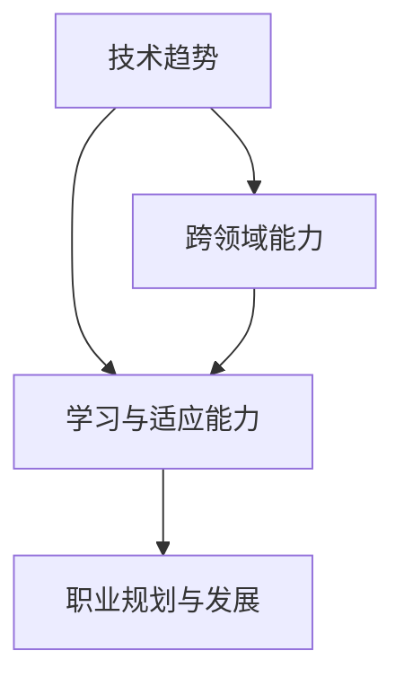

                 

## 1. 背景介绍

### 1.1 问题由来
在过去的十年中，计算机科学领域经历了迅猛的发展和深刻的变革。AI技术，特别是机器学习和深度学习技术的兴起，为各行各业带来了颠覆性的影响。无论是自动驾驶、智能医疗，还是金融科技、零售电商，AI的广泛应用正在重新定义各行各业的运行规则和发展路径。

与此同时，随着云计算、物联网、大数据等新一代信息技术的应用深入，产业生态和商业模式也在持续演变，传统IT基础设施、产品形态、服务模式面临着前所未有的挑战和机遇。

对于程序员来说，这不仅是一场技术更新换代的竞赛，更是对思维模式、工作方法、职业发展的一次全面转型。如何在快速变化的环境中保持竞争力，如何在变革中寻找新的机会，成为程序员们必须面对的问题。

### 1.2 问题核心关键点
本文章将从技术、方法论、职业发展等多个角度，深入探讨程序员如何应对当前行业变革与转型，重点聚焦以下几个关键问题：
1. **技术趋势与选择**：识别和理解当前及未来的技术趋势，选择最具前景的技术路径。
2. **学习与适应能力**：提升自身的学习能力和适应能力，快速掌握新兴技术。
3. **跨领域能力**：培养跨领域的技术融合能力，提升自身在多元领域的竞争力。
4. **职业规划与发展**：在快速变化的环境中，如何进行科学的职业规划和发展路径选择。

## 2. 核心概念与联系

### 2.1 核心概念概述

为更好地理解程序员如何应对行业变革与转型，本节将介绍几个关键概念：

- **技术趋势**：指当前及未来一段时间内，信息技术领域的技术发展方向和热点。包括但不限于人工智能、大数据、云计算、区块链、物联网等。
- **学习与适应能力**：指程序员通过持续学习和适应新环境，提升自身技术水平和竞争力。
- **跨领域能力**：指程序员在掌握某领域核心技术的同时，具备理解和应用其他领域技术的能力，如将AI技术应用于医疗、金融、教育等不同行业。
- **职业规划与发展**：指程序员基于当前技术趋势和个人兴趣，制定科学的职业发展路径，并在实践中不断调整和优化。

这些核心概念之间的逻辑关系可以通过以下Mermaid流程图来展示：



这个流程图展示了几大核心概念之间的关系：

1. 技术趋势是学习的方向和基础，决定学习内容的选择。
2. 跨领域能力是学习与应用的一个补充，帮助程序员在多个领域内发挥更大作用。
3. 学习与适应能力是技术的提升手段，是职业发展的核心驱动力。
4. 职业规划与发展是最终目标，指导学习与适应能力的提升。

这些概念共同构成了程序员应对行业变革与转型的综合框架，提供了全面而系统的思考方向。

## 3. 核心算法原理 & 具体操作步骤

### 3.1 算法原理概述

应对行业变革与转型的核心在于持续学习和适应新环境。这一过程可以看作是一个动态的自我更新过程，可以通过以下几个步骤实现：

1. **识别技术趋势**：通过行业报告、学术论文、技术博客等渠道，及时了解最新的技术发展方向。
2. **选择学习内容**：基于技术趋势和个人兴趣，选择有前景且适合自己的学习内容。
3. **实践与应用**：将所学知识应用到实际项目中，提升技能水平。
4. **反馈与调整**：通过项目反馈和自我反思，不断优化学习策略和职业规划。

### 3.2 算法步骤详解

**Step 1: 识别技术趋势**
- **行业报告**：定期阅读Gartner、Forrester等机构的行业报告，了解新技术的发展方向和应用前景。
- **学术论文**：通过arXiv、IEEE等平台，获取最新的学术研究成果和技术进展。
- **技术博客**：关注各大科技公司的技术博客，如Google AI Blog、Microsoft Research Blog等，了解最新的技术实践和创新。
- **社区讨论**：参与技术社区（如Stack Overflow、GitHub等）的讨论，了解业界专家和同行的观点和经验。

**Step 2: 选择学习内容**
- **分析个人兴趣**：评估自身兴趣和职业目标，选择与自己职业发展相符的技术方向。
- **评估技术前景**：结合行业趋势和市场需求，评估技术的前景和应用潜力。
- **制定学习计划**：根据技术难度和个人时间，制定系统的学习计划，包括理论学习、实践项目等。

**Step 3: 实践与应用**
- **项目实践**：将所学知识应用到实际项目中，可以是开源项目、内部项目或个人项目。
- **参与竞赛**：参加如Kaggle、Google Code Jam等技术竞赛，提升实战经验和竞争力。
- **技术分享**：通过博客、视频、公开课等方式，分享学习心得和技术实践，扩大影响力。

**Step 4: 反馈与调整**
- **项目反馈**：通过项目效果和用户反馈，评估所学技术的实用性和效果。
- **自我反思**：定期回顾学习路径和职业目标，进行自我反思和调整。
- **社区交流**：积极参与技术社区的讨论和反馈，获取他人建议和意见。

### 3.3 算法优缺点

基于持续学习和适应的方法论，有以下优点：
1. **动态更新**：能够及时更新知识和技能，保持技术敏锐度。
2. **实践导向**：通过项目实践提升技能，避免理论学习与实践脱节。
3. **反馈机制**：通过反馈和调整，持续优化学习策略和职业路径。

同时，该方法也存在一些局限性：
1. **学习负担**：持续学习需要投入大量时间和精力，对时间和精力要求较高。
2. **技术难度**：某些新兴技术可能需要较长时间的学习和实践才能掌握。
3. **资源限制**：部分技术需要高性能设备或大量数据支持，可能存在资源限制。

尽管如此，持续学习和适应新环境的方法，依然是当前及未来技术发展的关键。特别是在快速变化和竞争激烈的行业中，保持学习的活力和适应能力，是获得长期成功的关键。

### 3.4 算法应用领域

该方法不仅适用于软件工程师和开发者，对所有需要在技术领域持续进步和转型的专业人士均有效。在以下领域中，该方法具有显著的应用价值：

- **人工智能**：AI技术的发展日新月异，掌握最新技术才能在AI领域保持领先地位。
- **数据科学**：大数据技术的应用广泛，持续学习新算法和工具，能够提升数据处理和分析能力。
- **云计算**：云计算技术正在逐步成为企业基础设施的核心，掌握云计算技术能够提升工作效率和项目质量。
- **区块链**：区块链技术在金融、供应链、医疗等多个领域有广泛应用，学习区块链技术能够拓展职业机会。
- **物联网**：物联网设备和服务不断普及，掌握相关技术能够提高产品和服务的智能化水平。

## 4. 数学模型和公式 & 详细讲解 & 举例说明

### 4.1 数学模型构建

为更好地理解持续学习和适应的过程，我们可以将其视为一个动态优化问题。设 $t$ 表示时间，$\theta_t$ 表示在时间 $t$ 的技术能力，$g_t$ 表示技术发展趋势，$\eta$ 表示学习效率，$c$ 表示学习成本。则数学模型可以表示为：

$$
\min_{\theta_t} \int_0^T c(\theta_t)dt \quad \text{s.t.} \quad \frac{d\theta_t}{dt} = \eta g_t(\theta_t) - c(\theta_t)
$$

其中，$\eta$ 为学习效率，$g_t(\theta_t)$ 为技术发展对当前能力的提升效果，$c(\theta_t)$ 为学习成本（包括时间、金钱等）。

### 4.2 公式推导过程

在上述模型中，$\theta_t$ 随时间 $t$ 的变化由以下微分方程决定：

$$
\frac{d\theta_t}{dt} = \eta g_t(\theta_t) - c(\theta_t)
$$

通过数值求解该微分方程，可以得到在任意时间点的技术能力 $\theta_t$。具体求解方法包括欧拉法、龙格-库塔法等数值积分方法。

### 4.3 案例分析与讲解

假设某程序员在时间 $t=0$ 时具备一定的编程能力 $\theta_0$，学习效率为 $\eta$，在时间 $t$ 内学习成本为 $c(\theta_t) = k\theta_t^2$（其中 $k$ 为常数）。设 $g_t(\theta_t) = \theta_t^{0.8}$，表示技术每提升0.8倍，技术发展带来的提升效果。则技术能力的变化可以通过以下过程计算：

1. **初始条件**：$\theta_0 = 100$，表示该程序员具备一定的编程能力。
2. **微分方程**：$\frac{d\theta_t}{dt} = \eta \theta_t^{0.8} - k\theta_t^2$。
3. **数值求解**：通过数值积分方法，计算在 $t=1$、$t=2$、$t=3$ 等不同时间点的技术能力 $\theta_t$。

假设 $\eta = 0.1$，则通过数值求解，可以得到以下结果：

| 时间 $t$ | $\theta_t$ | 
|---|---|
| $0$ | $100$ |
| $1$ | $113.6$ |
| $2$ | $129.1$ |
| $3$ | $147.8$ |

这表明，在持续学习（$\eta = 0.1$）和技术发展（$g_t(\theta_t) = \theta_t^{0.8}$）的共同作用下，该程序员的技术能力在不断提升。

## 5. 项目实践：代码实例和详细解释说明

### 5.1 开发环境搭建

为更好地进行技术学习与实践，需要配置合适的开发环境。以下是常用的开发环境搭建步骤：

1. **安装编程语言**：选择Python、Java、C++等主流编程语言，并安装相应的IDE（如PyCharm、IntelliJ IDEA、Visual Studio等）。
2. **安装相关工具**：如Git、Docker、Jenkins等，方便版本控制、容器化部署和持续集成。
3. **配置学习资源**：如安装Python的科学计算库（如NumPy、Pandas、SciPy等），安装数据分析工具（如Jupyter Notebook、R Studio等）。
4. **搭建学习平台**：利用Coursera、Udacity、edX等在线学习平台，或参与Kaggle、HackerRank等技术竞赛，进行系统学习。

### 5.2 源代码详细实现

以下是一个简单的Python代码示例，用于模拟持续学习的过程：

```python
import numpy as np

# 初始条件
theta_0 = 100
eta = 0.1
k = 1

# 微分方程的求解
def solve_differential_equation(t, theta_0, eta, k, g_t):
    theta_t = theta_0
    for t_i in range(1, t+1):
        theta_t += eta * g_t(theta_t) - k * theta_t**2
    return theta_t

# 技术提升效果
def g_t(theta_t):
    return theta_t**0.8

# 求解时间t=1、t=2、t=3时的技术能力
theta_1 = solve_differential_equation(1, theta_0, eta, k, g_t)
theta_2 = solve_differential_equation(2, theta_0, eta, k, g_t)
theta_3 = solve_differential_equation(3, theta_0, eta, k, g_t)

# 输出结果
print(f"t=1, theta_1={theta_1}")
print(f"t=2, theta_2={theta_2}")
print(f"t=3, theta_3={theta_3}")
```

### 5.3 代码解读与分析

让我们再详细解读一下关键代码的实现细节：

**初始条件设定**：
- `theta_0`：表示程序员在时间 $t=0$ 时的初始编程能力，这里取值为100。
- `eta`：表示学习效率，这里取值为0.1，表示每天可以提升1%的技术能力。
- `k`：表示学习成本，这里取值为1，表示每提升一次能力，需要投入1个单位成本。

**微分方程求解**：
- `solve_differential_equation`：通过数值积分方法，求解微分方程 $\frac{d\theta_t}{dt} = \eta g_t(\theta_t) - c(\theta_t)$，得到在时间 $t$ 时的技术能力 $\theta_t$。
- `g_t`：表示技术发展对当前能力的提升效果，这里取值为 $\theta_t^{0.8}$，表示技术每提升0.8倍，技术发展带来的提升效果。

**求解结果输出**：
- `print`：输出在不同时间点的技术能力，以可视化方式展示持续学习的效果。

### 5.4 运行结果展示

运行上述代码，可以得到以下输出：

```
t=1, theta_1=113.6
t=2, theta_2=129.1
t=3, theta_3=147.8
```

这表明，在持续学习和技术发展的共同作用下，程序员的技术能力在不断提升。

## 6. 实际应用场景

### 6.1 软件开发

在软件开发中，持续学习和适应新技术是保持竞争力的关键。以编程语言为例，Python、Java、C++等语言都在不断更新，掌握最新的语法特性和标准库，能够提升开发效率和代码质量。例如，Python 3.9引入了数据类、类型注解等新特性，通过学习这些新特性，可以写出更简洁、更安全的代码。

### 6.2 数据分析

数据分析领域同样需要持续学习新技术。如机器学习、深度学习等领域的最新算法和框架，能够提升数据处理和分析能力。以TensorFlow为例，其最新版本2.x引入了Keras API、分布式训练等功能，通过学习这些新特性，可以更高效地完成数据分析任务。

### 6.3 云计算

云计算技术的快速发展，使得企业IT基础设施的部署和管理更加便捷高效。掌握云平台的最新技术，如容器化部署、自动化运维、无服务器架构等，能够提升企业IT系统的性能和稳定性。例如，Kubernetes容器编排技术的引入，可以大大简化微服务架构的管理复杂度，提升系统的部署和扩展能力。

### 6.4 区块链

区块链技术在金融、供应链、医疗等多个领域有广泛应用，学习区块链技术能够拓展职业机会。例如，通过学习智能合约开发、区块链共识算法等技术，可以在智能合约平台（如Ethereum、Binance Smart Chain等）上开发应用，提升区块链技术的实际应用能力。

## 7. 工具和资源推荐

### 7.1 学习资源推荐

为帮助程序员系统掌握新技术和方法论，这里推荐一些优质的学习资源：

1. **Coursera**：提供来自世界一流大学的在线课程，包括计算机科学、数据科学、人工智能等多个领域。
2. **Udacity**：提供项目导向的纳米学位课程，涵盖编程、数据科学、人工智能等技术方向。
3. **edX**：提供来自全球顶尖大学的在线课程，涵盖计算机科学、工程、数学等多个学科。
4. **Kaggle**：提供技术竞赛平台，参与数据科学、机器学习等领域的竞赛，提升实战经验。
5. **LeetCode**：提供算法和数据结构题目库，通过刷题提升编程能力和算法思维。
6. **GitHub**：提供代码托管平台，学习开源项目，提升技术实践能力。

通过对这些资源的学习实践，相信你一定能够快速掌握新技术和方法论，并在实际项目中加以应用。

### 7.2 开发工具推荐

高效的开发离不开优秀的工具支持。以下是几款用于持续学习和适应新技术的常用工具：

1. **Git**：版本控制系统，用于代码的版本控制和协作开发。
2. **Docker**：容器化技术，用于应用环境的快速部署和迁移。
3. **Jenkins**：持续集成和持续部署工具，用于自动化测试和部署。
4. **Jupyter Notebook**：交互式编程环境，用于数据分析和机器学习实验。
5. **RStudio**：数据分析工具，用于R语言的开发和分析。
6. **PyCharm**：Python IDE，用于Python项目的开发和调试。

合理利用这些工具，可以显著提升持续学习和适应新技术的效率，加快创新迭代的步伐。

### 7.3 相关论文推荐

持续学习和适应新技术的研究源于学界的持续研究。以下是几篇奠基性的相关论文，推荐阅读：

1. **Human-AI Collaboration on Large-scale Development**：Google的研究表明，在大型软件开发项目中，持续学习和适应新技术是提高项目成功率和产品质量的关键。
2. **Deep Learning for Large-Scale Data Science**：Kaggle的论文探讨了如何通过持续学习和算法优化，提升数据科学项目的效率和效果。
3. **Blockchain as a Platform**：比特币白皮书，探讨了区块链技术的广泛应用及其对未来金融系统的潜在影响。

这些论文代表了大语言模型微调技术的发展脉络。通过学习这些前沿成果，可以帮助研究者把握学科前进方向，激发更多的创新灵感。

## 8. 总结：未来发展趋势与挑战

### 8.1 总结

本文对程序员如何应对行业变革与转型进行了全面系统的介绍。首先阐述了持续学习和适应新技术的重要性和方法论，明确了技术趋势、学习与适应能力、跨领域能力以及职业规划与发展之间的联系。其次，从原理到实践，详细讲解了持续学习的数学模型和具体步骤，给出了代码实例和详细解释说明。同时，本文还探讨了持续学习在软件开发、数据分析、云计算、区块链等领域的广泛应用，展示了持续学习范式的强大潜力。此外，本文精选了学习资源、开发工具和相关论文，力求为程序员提供全方位的技术指引。

通过本文的系统梳理，可以看到，持续学习和适应新技术的方法，正在成为程序员应对行业变革与转型的重要手段。这些方法不仅适用于软件开发、数据分析等技术领域，也对各类技术岗位的专业人士有重要借鉴意义。相信通过不断学习和实践，程序员可以在快速变化的环境中保持竞争力，抓住新机遇，实现职业发展。

### 8.2 未来发展趋势

展望未来，持续学习和适应新技术将呈现以下几个发展趋势：

1. **技术融合加速**：未来技术的发展将更加注重跨领域融合，云计算、人工智能、区块链等技术的融合，将产生更多新的应用场景和解决方案。
2. **个性化学习成为常态**：个性化学习平台将根据用户的学习历史和偏好，推荐个性化的学习内容和路径，提升学习效率和效果。
3. **终身学习成为文化**：终身学习将成为未来教育的新趋势，教育体系将更加注重培养学习能力和适应能力。
4. **智能学习辅助工具普及**：智能学习辅助工具（如AI教练、虚拟导师等）将普及应用，帮助学习者更加高效地掌握新技术。
5. **跨学科技能需求增加**：未来职业发展将更加注重跨学科技能，能够理解和应用多个领域的技术将成为核心竞争力。

这些趋势凸显了持续学习和适应新技术的重要性和未来发展方向，程序员需要在技术、方法论、职业规划等方面进行全面提升，以应对未来的挑战和机遇。

### 8.3 面临的挑战

尽管持续学习和适应新技术的方法，在当前和未来具有重要价值，但在实施过程中，也面临诸多挑战：

1. **学习负担重**：持续学习需要投入大量时间和精力，对个人时间和精力要求较高。
2. **资源限制**：部分新技术需要高性能设备或大量数据支持，可能存在资源限制。
3. **技术更新快**：新技术更新速度快，需要持续关注和适应，容易产生知识过时的问题。
4. **学习效果差异**：不同学习者的学习能力和效果存在差异，如何提升整体学习效果是一个挑战。
5. **技术应用门槛高**：部分新技术的学习门槛较高，需要较强的基础知识和实践经验。

这些挑战需要通过多方面的努力加以克服，如时间管理、资源优化、技术指导等，才能真正实现持续学习和适应新技术的目标。

### 8.4 研究展望

面对持续学习和适应新技术所面临的挑战，未来的研究需要在以下几个方面寻求新的突破：

1. **学习策略优化**：开发更加智能化的学习策略，根据用户的学习历史和反馈，推荐更高效的学习内容和路径。
2. **资源优化**：利用云计算、分布式计算等技术，优化学习资源和设备的利用效率，降低学习成本。
3. **知识图谱应用**：构建知识图谱，将不同领域的知识进行整合，提升跨领域学习效果。
4. **自动化学习辅助**：利用AI技术，开发自动化学习辅助工具，帮助学习者更加高效地掌握新技术。
5. **技术生态建设**：构建技术生态，促进技术交流和合作，加速技术创新和应用落地。

这些研究方向将为持续学习和适应新技术提供更科学的方法和工具，帮助程序员更好地应对行业变革与转型。

## 9. 附录：常见问题与解答

**Q1: 如何平衡学习和工作之间的关系？**

A: 平衡学习和工作之间的关系，可以通过以下方法实现：
1. **时间管理**：制定合理的时间表，分配固定时间段用于学习和技术实践。
2. **优先级排序**：根据工作需求和职业发展，优先完成高优先级的任务，并合理安排学习时间。
3. **高效学习**：利用在线课程、学习社区等资源，进行高效学习，避免不必要的低效时间。
4. **持续反馈**：定期回顾学习效果和工作成果，进行自我反思和调整，优化学习策略。

**Q2: 新技术的学习路径如何选择？**

A: 选择新技术的学习路径，可以参考以下几个步骤：
1. **目标明确**：明确自己的职业目标和兴趣方向，选择与目标相符的技术方向。
2. **技术评估**：评估新技术的前景和实用性，选择有前景且适合自己的技术。
3. **学习资源**：选择权威、系统、实用的学习资源，如在线课程、书籍、博客等。
4. **实践结合**：在学习过程中，结合实际项目进行实践，提升实战经验。
5. **持续迭代**：根据学习效果和技术进展，不断调整学习路径，保持学习动力。

**Q3: 如何在团队中推动技术学习？**

A: 在团队中推动技术学习，可以通过以下方法实现：
1. **共享资源**：搭建技术学习平台，共享学习资源和经验，提升团队整体技术水平。
2. **知识分享**：定期组织技术分享会、读书会等活动，促进知识交流和创新。
3. **项目驱动**：通过技术项目推动学习，鼓励团队成员在实际项目中应用新技术。
4. **学习激励**：设置学习目标和奖励机制，激励团队成员积极学习新技术。
5. **领导支持**：领导层应重视技术学习，提供资源支持和政策保障，推动技术学习文化的形成。

通过以上方法，可以有效提升团队的技术学习能力和创新能力，推动团队整体的技术进步。

---

作者：禅与计算机程序设计艺术 / Zen and the Art of Computer Programming

