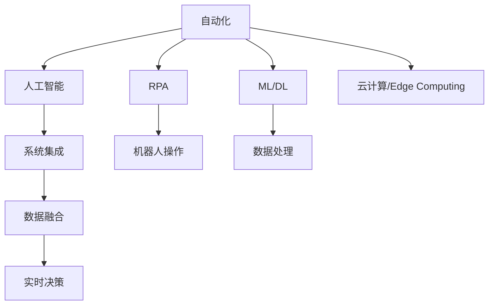

                 

# 程序员如何应对行业自动化的挑战

## 1. 背景介绍

### 1.1 问题由来
随着人工智能(AI)和自动化技术的发展，行业自动化浪潮正在席卷全球。从制造业到金融业，从医疗保健到零售业，各行各业都在寻求通过自动化技术提升效率、降低成本、创造价值。然而，自动化技术的快速发展也给程序员带来了巨大的挑战，他们需要不断学习和适应新的技术，以保持竞争力。本文将探讨如何应对行业自动化的挑战，帮助程序员在自动化大潮中乘风破浪。

### 1.2 问题核心关键点
行业自动化带来的主要挑战包括：
- **技能升级**：自动化技术不断演进，程序员需要不断学习新的编程语言、框架和工具。
- **工作性质变化**：自动化系统减少了对重复性、低价值工作的需求，程序员需要转向更高价值、更具创造性的工作。
- **就业压力**：自动化可能带来裁员，程序员需要提升自身技能以适应新的工作模式。
- **系统集成**：越来越多的系统需要集成和交互，程序员需要具备更强的系统设计和集成能力。
- **安全与隐私**：自动化系统涉及大量数据，程序员需要关注系统安全性和用户隐私保护。

本文将围绕上述挑战，探讨如何通过学习和适应，应对行业自动化的挑战。

## 2. 核心概念与联系

### 2.1 核心概念概述

为更好地理解自动化挑战及其应对方法，本节将介绍几个关键概念：

- **自动化(Automation)**：指利用机器和软件系统代替人工执行重复性、低价值工作，提高效率和精度。
- **人工智能(AI)**：使用算法和机器学习技术，使计算机能够模拟人类智能，进行自主决策和问题解决。
- **机器人流程自动化(RPA)**：通过软件机器人模拟人工操作，自动化执行规则明确、重复性高的业务流程。
- **机器学习与深度学习(ML/DL)**：使用算法让计算机系统具备学习能力，根据数据自动改进算法。
- **系统集成(System Integration)**：将不同软件系统和组件无缝连接，实现数据和功能的整合。
- **云计算与边缘计算(Cloud/Edge Computing)**：通过云和边缘计算技术，实现数据的分布式处理和存储。

这些核心概念之间的联系可以通过以下Mermaid流程图来展示：



这个流程图展示的核心概念及其之间的逻辑关系：

1. 自动化技术利用人工智能和机器学习算法，提升系统自主决策和问题解决能力。
2. RPA和机器人操作是自动化的具体实现手段，适用于规则明确的业务场景。
3. 机器学习和深度学习算法，使计算机系统能够根据数据自我优化，提升自动化效果。
4. 系统集成技术将不同系统和组件整合，实现数据和功能的无缝连接。
5. 云计算和边缘计算技术支持自动化系统的分布式部署和数据处理，提升系统的扩展性和性能。

这些概念共同构成了行业自动化的技术基础，帮助程序员更好地理解和应对自动化带来的挑战。

## 3. 核心算法原理 & 具体操作步骤
### 3.1 算法原理概述

自动化系统通常采用如下算法原理：

- **监督学习**：利用已标注数据训练模型，进行分类、回归等任务。
- **无监督学习**：通过未标注数据挖掘模式，进行聚类、降维等任务。
- **强化学习**：通过与环境的互动，学习最优策略以达成特定目标。
- **深度学习**：使用多层神经网络进行复杂数据分析和建模。
- **优化算法**：通过迭代优化算法，不断改进模型的预测能力。

这些算法原理被广泛应用于自动化系统的各个环节，帮助程序员理解和应用自动化技术。

### 3.2 算法步骤详解

自动化系统的开发和部署通常包括以下步骤：

**Step 1: 需求分析与需求文档制定**

- 分析业务需求，确定自动化系统的功能和目标。
- 编写需求文档，明确系统需要实现的功能和预期效果。

**Step 2: 数据收集与预处理**

- 收集所需的数据，清洗和处理数据，确保数据质量和完整性。
- 对数据进行标注，为监督学习模型提供训练样本。

**Step 3: 模型选择与训练**

- 根据业务需求选择合适的机器学习算法和深度学习模型。
- 使用标注数据训练模型，调整参数和超参数，提升模型性能。

**Step 4: 系统集成与部署**

- 将训练好的模型集成到自动化系统中，进行系统测试和调试。
- 部署系统到生产环境，监控系统性能和稳定性。

**Step 5: 系统优化与迭代**

- 根据反馈信息优化系统性能，进行功能扩展和改进。
- 定期更新数据和模型，提升系统的准确性和鲁棒性。

### 3.3 算法优缺点

自动化系统的优点包括：
- **提高效率**：自动化系统可以24/7不间断工作，提高生产效率。
- **降低成本**：减少人力成本和错误率，提升企业竞争力。
- **增强决策能力**：利用机器学习算法，提升系统决策的精确性和智能性。

然而，自动化系统也存在一些缺点：
- **初期投入高**：系统开发和部署初期投入成本较高。
- **技术门槛高**：需要程序员具备深厚的技术背景和经验。
- **依赖数据质量**：模型性能受数据质量影响，低质量数据可能导致误判。
- **缺乏灵活性**：自动化系统通常固化，难以应对快速变化的需求。

### 3.4 算法应用领域

自动化技术广泛应用于多个行业，例如：

- **制造业**：通过机器人和自动化流水线，提高生产效率和质量。
- **金融业**：利用机器学习和算法交易，实现自动高频交易和风险控制。
- **医疗保健**：使用机器人手术和医疗诊断系统，提升诊疗效率和准确性。
- **零售业**：通过RPA和自动化仓储系统，优化库存管理和物流配送。
- **客户服务**：通过聊天机器人和自动化客服系统，提升客户服务体验。

## 4. 数学模型和公式 & 详细讲解 & 举例说明（备注：数学公式请使用latex格式，latex嵌入文中独立段落使用 $$，段落内使用 $)
### 4.1 数学模型构建

以下以机器学习算法为例，展示数学模型构建的基本过程：

- **监督学习模型**：使用标注数据训练模型，目标是最小化预测误差。
- **无监督学习模型**：通过未标注数据挖掘模式，目标是最小化数据损失。
- **强化学习模型**：通过与环境的互动，目标是最小化累积奖励。
- **深度学习模型**：使用多层神经网络进行数据分析，目标是最小化损失函数。

### 4.2 公式推导过程

以线性回归为例，展示监督学习模型的公式推导过程：

设训练数据集为 $(x_1, y_1), (x_2, y_2), ..., (x_n, y_n)$，其中 $x_i$ 为自变量，$y_i$ 为因变量。线性回归模型的目标是最小化预测误差，即最小化损失函数：

$$
\min_{\theta} \sum_{i=1}^n (y_i - \hat{y}_i)^2
$$

其中 $\hat{y}_i$ 为模型预测值，$\theta$ 为模型参数。

通过求导和最小化，可得到模型参数 $\theta$ 的计算公式：

$$
\theta = (X^TX)^{-1}X^Ty
$$

其中 $X$ 为自变量矩阵，$y$ 为因变量向量。

### 4.3 案例分析与讲解

以图像分类为例，展示深度学习模型的应用。假设输入为图像 $x$，输出为类别 $y$。使用卷积神经网络(CNN)进行图像分类，目标是最小化分类误差，即最小化交叉熵损失：

$$
\min_{\theta} \frac{1}{N} \sum_{i=1}^N -y_i\log \hat{y}_i - (1-y_i)\log(1-\hat{y}_i)
$$

其中 $\hat{y}_i$ 为模型预测的概率值。

通过反向传播算法，可得到模型参数 $\theta$ 的更新公式：

$$
\theta = \theta - \eta \nabla_{\theta}\mathcal{L}(\theta)
$$

其中 $\eta$ 为学习率，$\nabla_{\theta}\mathcal{L}(\theta)$ 为损失函数对参数 $\theta$ 的梯度。

## 5. 项目实践：代码实例和详细解释说明
### 5.1 开发环境搭建

在进行自动化系统开发前，需要先搭建好开发环境。以下是使用Python进行TensorFlow开发的环境配置流程：

1. 安装Anaconda：从官网下载并安装Anaconda，用于创建独立的Python环境。

2. 创建并激活虚拟环境：
```bash
conda create -n tf-env python=3.8 
conda activate tf-env
```

3. 安装TensorFlow：根据CUDA版本，从官网获取对应的安装命令。例如：
```bash
conda install tensorflow -c conda-forge -c pypi -c anaconda
```

4. 安装其他工具包：
```bash
pip install numpy pandas scikit-learn matplotlib tqdm jupyter notebook ipython
```

完成上述步骤后，即可在`tf-env`环境中开始自动化系统开发。

### 5.2 源代码详细实现

以下以图像分类任务为例，展示使用TensorFlow进行机器学习模型的代码实现。

首先，定义模型架构和损失函数：

```python
import tensorflow as tf

model = tf.keras.Sequential([
    tf.keras.layers.Conv2D(32, (3,3), activation='relu', input_shape=(28,28,1)),
    tf.keras.layers.MaxPooling2D((2,2)),
    tf.keras.layers.Flatten(),
    tf.keras.layers.Dense(64, activation='relu'),
    tf.keras.layers.Dense(10, activation='softmax')
])

loss_fn = tf.keras.losses.SparseCategoricalCrossentropy(from_logits=True)
```

接着，定义优化器、编译模型并训练：

```python
optimizer = tf.keras.optimizers.Adam(learning_rate=0.001)
model.compile(optimizer=optimizer, loss=loss_fn, metrics=['accuracy'])

model.fit(train_images, train_labels, epochs=10, validation_data=(test_images, test_labels))
```

最后，评估模型性能：

```python
test_loss, test_acc = model.evaluate(test_images, test_labels)
print('Test accuracy:', test_acc)
```

### 5.3 代码解读与分析

让我们再详细解读一下关键代码的实现细节：

**模型定义**：
- 使用`tf.keras.Sequential`定义模型结构，包括卷积层、池化层和全连接层。
- 使用`from_logits=True`定义损失函数，使输出层不经过Softmax激活，直接作为损失函数的输入。

**优化器定义**：
- 使用`tf.keras.optimizers.Adam`定义优化器，设置学习率为0.001。

**模型编译与训练**：
- 使用`model.compile`编译模型，指定优化器、损失函数和评估指标。
- 使用`model.fit`训练模型，指定训练集和验证集。

**模型评估**：
- 使用`model.evaluate`评估模型在测试集上的性能，输出测试精度。

可以看到，TensorFlow提供了强大的深度学习框架，可以方便地实现各种机器学习模型。开发者可以专注于业务逻辑和算法优化，而不必过多关注底层的实现细节。

## 6. 实际应用场景

### 6.1 智能制造

自动化技术在智能制造领域的应用，可以显著提升生产效率和产品质量。通过引入自动化流水线和智能机器人，制造企业可以实现自动化调度、质量检测、设备维护等功能，减少人工干预和错误率，提升生产线的智能化水平。

### 6.2 金融风险管理

自动化技术在金融风险管理中的应用，可以实时监控市场波动，自动化预警风险事件，快速响应市场变化。通过构建自动化交易系统，金融企业可以实现高频交易、风险控制等功能，提高资金使用效率，降低风险损失。

### 6.3 医疗诊断

自动化技术在医疗诊断中的应用，可以辅助医生进行快速诊断和预测。通过自动化分析医学影像和病历数据，医疗企业可以实现智能诊断、辅助决策等功能，提高诊疗效率和准确性，减轻医生的工作负担。

### 6.4 客服自动化

自动化技术在客服领域的应用，可以实现智能客服和机器人客服。通过构建自动化客服系统，企业可以实现24/7不间断服务，快速响应客户咨询，提升客户体验和满意度。

## 7. 工具和资源推荐
### 7.1 学习资源推荐

为了帮助开发者系统掌握自动化技术，这里推荐一些优质的学习资源：

1. **《深度学习》书籍**：Ian Goodfellow等著，深入浅出地介绍了深度学习的基本概念和算法。

2. **《机器学习实战》书籍**：Peter Harrington著，通过实际项目讲解了机器学习模型的实现和应用。

3. **Coursera和edX课程**：提供高质量的机器学习和深度学习课程，包括监督学习、无监督学习、强化学习等。

4. **Kaggle平台**：提供大量的机器学习和深度学习竞赛数据集，帮助开发者进行实践和验证。

5. **GitHub开源项目**：查找和贡献开源机器学习和深度学习项目，学习他人的实现思路和技巧。

通过这些资源的学习实践，相信你一定能够快速掌握自动化技术的基本概念和算法，并用于解决实际的业务问题。

### 7.2 开发工具推荐

高效的开发离不开优秀的工具支持。以下是几款用于自动化系统开发的常用工具：

1. **TensorFlow**：谷歌开源的深度学习框架，支持分布式训练和多种计算图，适用于复杂的模型开发。

2. **PyTorch**：Facebook开源的深度学习框架，具有动态计算图和丰富的API，易于学习和使用。

3. **Keras**：高层次的深度学习API，提供了简单易用的接口，适合快速开发原型。

4. **Scikit-learn**：Python的机器学习库，提供了丰富的算法和工具，支持多种机器学习任务。

5. **Jupyter Notebook**：交互式编程环境，支持代码块和文档块的混合使用，便于编写和调试代码。

6. **TensorBoard**：TensorFlow配套的可视化工具，支持模型训练和调优，可以实时监控模型性能。

合理利用这些工具，可以显著提升自动化系统的开发效率，加快创新迭代的步伐。

### 7.3 相关论文推荐

自动化技术的发展源于学界的持续研究。以下是几篇奠基性的相关论文，推荐阅读：

1. **《Deep Blue》论文**：IBM的国际象棋程序Deep Blue，展示了AI在特定领域的高水平应用。

2. **《AlphaGo》论文**：DeepMind的AlphaGo程序，通过强化学习在围棋领域取得了突破性成果。

3. **《Robotic Process Automation: Concepts, Issues, Challenges, and Trends》论文**：详细介绍了RPA技术的基本概念、应用场景和挑战。

4. **《Human-in-the-loop Machine Learning》论文**：探讨了人机协同的机器学习模型，提升了系统的可靠性和可解释性。

5. **《Machine Learning in Healthcare: Potential, Challenges and Opportunities》论文**：介绍了机器学习在医疗领域的应用和挑战，探讨了未来发展方向。

这些论文代表了大语言模型微调技术的发展脉络。通过学习这些前沿成果，可以帮助研究者把握学科前进方向，激发更多的创新灵感。

## 8. 总结：未来发展趋势与挑战

### 8.1 总结

本文对自动化技术进行了全面系统的介绍。首先阐述了自动化技术带来的主要挑战，明确了程序员需要不断学习和适应新的技术，以保持竞争力。其次，从原理到实践，详细讲解了自动化系统的开发和部署过程，提供了完整的代码实例和详细解释。同时，本文还广泛探讨了自动化技术在各个行业领域的应用前景，展示了自动化技术的广阔前景。

通过本文的系统梳理，可以看到，自动化技术正在成为各行各业的重要趋势，极大地提升了许多行业的生产效率和运营质量。未来，伴随自动化技术的持续演进，其在各行各业的应用将更加广泛，带来更多创新和变革。

### 8.2 未来发展趋势

展望未来，自动化技术的发展将呈现以下几个趋势：

1. **智能化程度提高**：自动化系统将具备更高的自主决策和问题解决能力，能够更好地模拟人类智能。

2. **跨领域融合**：自动化技术将与其他前沿技术如AI、IoT等进行更深入的融合，形成更加全面、智能的自动化系统。

3. **实时化和个性化**：自动化系统将具备实时处理和个性化服务的能力，提升用户体验和满意度。

4. **分布式部署**：自动化系统将实现更广泛、更灵活的分布式部署，适应不同的业务场景和需求。

5. **数据驱动**：自动化系统将更多依赖大数据和人工智能技术，通过数据驱动优化模型性能。

6. **人机协同**：自动化系统将更多地考虑人机协同，提高系统的可靠性和可解释性。

以上趋势凸显了自动化技术的广阔前景，将深刻影响各行各业的运营模式和发展方向。

### 8.3 面临的挑战

尽管自动化技术带来了巨大的便利和效益，但在迈向更加智能化、普适化应用的过程中，仍面临诸多挑战：

1. **技术复杂性**：自动化系统的开发和部署需要高水平的编程技能和算法知识，对程序员的技术水平提出了更高要求。

2. **数据质量**：自动化系统的性能和决策能力高度依赖于数据质量，低质量的数据可能导致误判和错误决策。

3. **系统集成**：自动化系统通常需要集成多个系统和组件，系统设计和集成难度较大，容易出现兼容性问题。

4. **安全与隐私**：自动化系统涉及大量敏感数据，数据泄露和隐私保护成为重要问题。

5. **成本与回报**：自动化系统的开发和部署需要高昂的初始投入，企业需要考虑成本和回报之间的关系。

6. **人机协同**：自动化系统需要考虑人机协同，提高系统的可靠性和可解释性，避免过度依赖自动化。

### 8.4 研究展望

面对自动化技术面临的种种挑战，未来的研究需要在以下几个方面寻求新的突破：

1. **自动化系统的智能化**：开发更加智能化的自动化系统，提升系统的自主决策和问题解决能力。

2. **自动化系统的可解释性**：提升自动化系统的可解释性，使其具备更高的透明性和可信赖性。

3. **自动化系统的灵活性**：开发更加灵活的自动化系统，能够适应快速变化的需求和业务场景。

4. **自动化系统的可扩展性**：提高自动化系统的可扩展性，支持大规模分布式部署和数据处理。

5. **自动化系统的安全性**：加强自动化系统的安全性和隐私保护，防止数据泄露和滥用。

6. **自动化系统的实用性**：开发更加实用、易于操作的自动化系统，帮助开发者更高效地解决实际问题。

这些研究方向的探索，必将引领自动化技术迈向更高的台阶，为构建安全、可靠、高效、智能的自动化系统铺平道路。未来，伴随技术的不断进步和应用场景的拓展，自动化技术必将在更多行业领域大放异彩，为人类社会带来更多创新和变革。

## 9. 附录：常见问题与解答

**Q1：自动化系统开发需要哪些技术栈？**

A: 自动化系统开发通常需要以下技术栈：
1. 编程语言：Python、Java、C++等。
2. 深度学习框架：TensorFlow、PyTorch、Keras等。
3. 数据处理工具：Pandas、NumPy、Scikit-learn等。
4. 可视化工具：TensorBoard、Jupyter Notebook等。

**Q2：自动化系统开发有哪些关键步骤？**

A: 自动化系统开发的关键步骤包括：
1. 需求分析与需求文档制定。
2. 数据收集与预处理。
3. 模型选择与训练。
4. 系统集成与部署。
5. 系统优化与迭代。

**Q3：自动化系统开发中需要考虑哪些因素？**

A: 自动化系统开发中需要考虑以下因素：
1. 技术复杂性。
2. 数据质量。
3. 系统集成。
4. 安全与隐私。
5. 成本与回报。
6. 人机协同。

**Q4：如何评估自动化系统的性能？**

A: 自动化系统的性能可以通过以下指标进行评估：
1. 准确率。
2. 召回率。
3. 精确度。
4. F1分数。
5. 处理速度。
6. 系统稳定性。

**Q5：自动化系统开发过程中如何优化性能？**

A: 自动化系统开发过程中可以通过以下方法优化性能：
1. 数据增强。
2. 模型选择与调参。
3. 系统集成与优化。
4. 实时监控与调优。

---

作者：禅与计算机程序设计艺术 / Zen and the Art of Computer Programming

