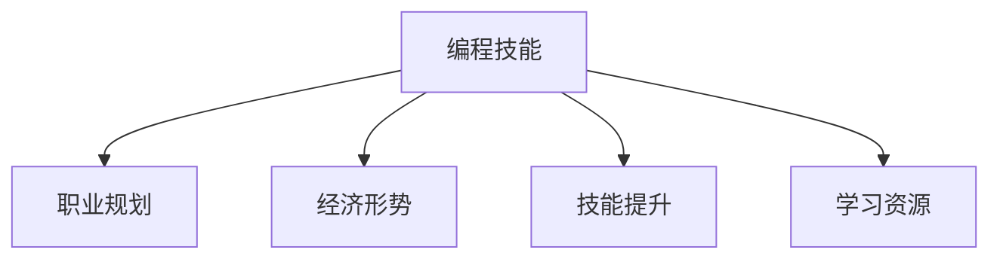

                 

# 程序员如何应对行业薪资波动

> 关键词：编程技能, 职业规划, 经济形势, 技能提升, 学习资源

## 1. 背景介绍

### 1.1 问题由来
随着技术的发展和市场的变化，程序员的行业薪资波动性也在增大。一方面，随着技术的进步，新兴技术领域的程序员需求激增，薪资水平逐年上升；另一方面，一些传统技术领域的程序员面临着失业风险，薪资水平下降。这种薪资波动性对程序员的职业规划和心态产生了深远影响。

### 1.2 问题核心关键点
如何应对行业薪资波动，是当前程序员面临的重要问题。这个问题的核心在于如何在快速变化的技术环境中保持竞争力，同时获得较高的薪资回报。

## 2. 核心概念与联系

### 2.1 核心概念概述

为更好地理解如何应对行业薪资波动，本节将介绍几个密切相关的核心概念：

- 编程技能：程序员的专业技能，包括编程语言、数据结构、算法、系统架构等。
- 职业规划：程序员在职业生涯中的目标设定、路径选择和发展规划。
- 经济形势：宏观经济环境对行业的影响，包括产业结构、经济周期、行业需求等。
- 技能提升：程序员通过学习、培训等方式提升自身技能和知识水平的过程。
- 学习资源：包括在线课程、书籍、技术博客等，用于学习新知识和技能。

这些核心概念之间的逻辑关系可以通过以下Mermaid流程图来展示：



这个流程图展示了他它们之间的基本联系：编程技能是基础，职业规划指导方向，经济形势影响需求，技能提升推动进步，学习资源是助力。

## 3. 核心算法原理 & 具体操作步骤
### 3.1 算法原理概述

程序员应对行业薪资波动，本质上是一个持续学习和适应的过程。其核心思想是：通过不断提升自身技能和适应市场变化，保持竞争力，从而获得较高的薪资回报。

形式化地，假设当前薪资为 $S$，市场对该技能的需求为 $D$，则薪资水平与市场需求的关系可以表示为：

$$
S = f(D)
$$

其中 $f$ 为薪资函数，通常为非线性函数，受多种因素影响。为了适应市场变化，程序员需要不断提高自身的编程技能和市场竞争力，即提高 $D$ 的值。

### 3.2 算法步骤详解

基于持续学习和适应的原则，应对行业薪资波动的步骤一般包括：

**Step 1: 自我评估与定位**
- 评估当前技能水平和市场竞争力。
- 了解自身兴趣和职业目标，确定未来职业规划方向。

**Step 2: 识别技术趋势与需求**
- 关注技术动态，识别当前和未来的技术趋势。
- 分析市场对不同技术的需求，选择有发展潜力的技能进行学习。

**Step 3: 制定学习计划**
- 根据市场和自身需求，制定详细的学习计划。
- 选择高效的学习资源和工具，如在线课程、书籍、博客等。

**Step 4: 持续学习与实践**
- 通过自学、培训等方式提升技能。
- 在实际项目中应用所学技能，积累经验。

**Step 5: 定期回顾与调整**
- 定期回顾学习成果和市场变化，调整学习计划。
- 根据市场反馈调整职业规划，重新定位。

### 3.3 算法优缺点

持续学习和适应的方法具有以下优点：
1. 提升技能水平，保持竞争力。
2. 适应市场变化，减少薪资波动风险。
3. 通过不断学习和实践，实现自我超越。

同时，该方法也存在一定的局限性：
1. 学习资源和时间的投入较大。
2. 面对快速变化的市场，容易陷入盲目跟风。
3. 需要较强的自我驱动力和毅力。

### 3.4 算法应用领域

持续学习和适应的方法适用于所有类型的程序员，无论是在软件开发、数据科学、运维、测试等领域，都有其广泛的应用。

## 4. 数学模型和公式 & 详细讲解  
### 4.1 数学模型构建

为更好地理解持续学习和适应的数学模型，我们可以引入数学语言对模型进行刻画。

设当前薪资为 $S$，市场对该技能的需求为 $D$，则薪资函数可以表示为：

$$
S = \alpha D + \beta
$$

其中 $\alpha$ 为技能对薪资的贡献率，$\beta$ 为其他因素对薪资的影响，如地区、经验等。

### 4.2 公式推导过程

根据上述模型，薪资函数对需求 $D$ 的偏导数为：

$$
\frac{\partial S}{\partial D} = \alpha
$$

这表明，市场需求 $D$ 的增加，可以显著提高薪资 $S$ 的水平。因此，程序员需要不断提高自身的市场竞争力，以满足市场需求。

### 4.3 案例分析与讲解

假设某程序员当前薪资为 $10,000，技能贡献率为 $1,000，其他因素对薪资的影响为 $1,000。如果市场需求增加 $1,000，则该程序员的薪资可以提升 $1,000。例如，通过学习新技能，提高自身的编程水平，市场需求增加，薪资水平也会随之提升。

## 5. 项目实践：代码实例和详细解释说明
### 5.1 开发环境搭建

在进行编程技能提升和职业规划时，我们需要准备好开发环境。以下是使用Python进行开发的环境配置流程：

1. 安装Anaconda：从官网下载并安装Anaconda，用于创建独立的Python环境。

2. 创建并激活虚拟环境：
```bash
conda create -n pyenv python=3.8 
conda activate pyenv
```

3. 安装Python开发工具包：
```bash
pip install numpy pandas scikit-learn matplotlib tqdm jupyter notebook ipython
```

4. 安装Python虚拟包管理工具：
```bash
pip install virtualenv
```

完成上述步骤后，即可在`pyenv`环境中开始技能提升和职业规划的实践。

### 5.2 源代码详细实现

下面我们以学习新技术为例，给出使用Python进行编程技能提升的PyTorch代码实现。

首先，定义技能提升的目标和当前水平：

```python
import numpy as np
import pandas as pd

# 设定技能提升目标和当前水平
target_skill_level = 10
current_skill_level = 5
skill_increase_per_course = 2
```

然后，定义技能提升的步骤：

```python
# 设置学习课程的数量和周期
courses_needed = (target_skill_level - current_skill_level) // skill_increase_per_course
weeks_per_course = 4

# 计算总学习周期
total_learning_period = courses_needed * weeks_per_course
```

接着，计算每周需要学习的技能提升量：

```python
# 计算每周需要提升的技能量
weekly_skill_increase = target_skill_level - current_skill_level
```

最后，输出学习周期和每周学习量：

```python
print(f"总共需要学习 {courses_needed} 门课程，总共 {total_learning_period} 周，每周需要提升 {weekly_skill_increase} 点技能。")
```

以上就是使用Python进行编程技能提升的完整代码实现。可以看到，通过设定目标和当前水平，结合每周学习量，可以较为准确地规划出学习路径。

### 5.3 代码解读与分析

让我们再详细解读一下关键代码的实现细节：

- `target_skill_level`和`current_skill_level`分别表示目标技能水平和当前技能水平。
- `skill_increase_per_course`表示每次学习课程技能提升量。
- `courses_needed`和`weeks_per_course`分别表示需要学习的课程数量和每门课程的周期。
- `total_learning_period`表示总共需要学习的时间周期。
- `weekly_skill_increase`表示每周需要提升的技能量。

这些变量和计算，共同构成了学习路径规划的基本模型。

## 6. 实际应用场景
### 6.1 技术学习与职业发展

程序员可以通过持续学习和技能提升，实现职业发展目标。例如，某个程序员对数据分析感兴趣，可以学习Python、R、SQL等技能，通过在实际项目中应用这些技能，积累经验，从而进入数据科学领域。

### 6.2 技术转型与行业迁移

在行业需求变化时，程序员可以通过学习新技能，实现技术转型和行业迁移。例如，随着人工智能的兴起，许多传统软件开发人员可以通过学习机器学习、深度学习等技能，进入AI领域，提高薪资水平。

### 6.3 跨领域项目与合作

通过跨领域的项目合作，程序员可以扩展技能和知识，提升市场竞争力。例如，某个程序员可以通过参与开源项目，学习新的编程语言和技术栈，从而提高自身的多样性和市场竞争力。

### 6.4 未来应用展望

随着技术的不断发展和市场的变化，未来程序员需要具备更多元化的技能和知识。除了编程技能，还需要掌握项目管理、产品设计、团队协作等软技能。

## 7. 工具和资源推荐
### 7.1 学习资源推荐

为了帮助程序员系统掌握编程技能提升的方法，这里推荐一些优质的学习资源：

1. 《编程珠玑》系列书籍：经典算法和数据结构的集合，帮助程序员提高编程水平。
2. Coursera和edX等在线教育平台：提供丰富的编程课程，覆盖多种编程语言和技术栈。
3. GitHub和Stack Overflow：了解行业动态和程序员社区的最新技术。
4. Codecademy和LeetCode等在线编程平台：提供互动式的编程练习，帮助程序员巩固和提升技能。
5. 技术博客和论坛：如Medium、Hacker News等，提供最新的技术资讯和讨论。

通过这些资源的学习实践，相信你一定能够不断提升自己的编程技能，保持竞争力。

### 7.2 开发工具推荐

高效的开发离不开优秀的工具支持。以下是几款用于编程技能提升和职业规划的常用工具：

1. VSCode：轻量级、功能强大的代码编辑器，支持多种编程语言和插件扩展。
2. Atom：另一个流行的代码编辑器，具有丰富的社区支持和扩展。
3. GitHub：代码托管平台，支持版本控制、协作和项目管理。
4. Docker和Kubernetes：容器化和微服务管理工具，方便构建和部署应用程序。
5. JIRA和Trello：项目管理工具，帮助团队协作和任务追踪。

合理利用这些工具，可以显著提升编程技能提升和职业规划的效率，加快创新迭代的步伐。

### 7.3 相关论文推荐

编程技能提升和职业规划的研究源于学界的持续研究。以下是几篇奠基性的相关论文，推荐阅读：

1. "How to Become a Better Programmer" by Eric Freeman：探讨了成为优秀程序员所需的素质和技巧。
2. "Learning to Program" by Ivan Prates：介绍了编程学习的心理学和方法论。
3. "A Taxonomy of Learning by Doing" by Brenda和密码学T：分析了实践和理论学习的效果。
4. "Software Engineering" by Robert C. Martin：探讨了软件工程的实践和理论基础。
5. "The Pragmatic Programmer" by Andrew Hunt and David Thomas：提供实用的编程建议和技巧。

这些论文代表了大语言模型微调技术的发展脉络。通过学习这些前沿成果，可以帮助研究者把握学科前进方向，激发更多的创新灵感。

## 8. 总结：未来发展趋势与挑战
### 8.1 总结

本文对如何应对行业薪资波动进行了全面系统的介绍。首先阐述了编程技能提升和职业规划的背景和意义，明确了持续学习在保持竞争力和获得高薪资中的重要作用。其次，从原理到实践，详细讲解了编程技能提升的数学模型和关键步骤，给出了编程技能提升的完整代码实例。同时，本文还广泛探讨了编程技能提升在技术学习、技术转型、跨领域项目等方面的应用前景，展示了持续学习范式的巨大潜力。此外，本文精选了编程技能提升的技术资源，力求为读者提供全方位的技术指引。

通过本文的系统梳理，可以看到，持续学习和技能提升是程序员应对行业薪资波动的重要手段。尽管在快速变化的技术环境中，编程技能提升面临诸多挑战，但只要不断学习、适应和创新，程序员依然能够保持竞争力，实现职业目标。

### 8.2 未来发展趋势

展望未来，编程技能提升将呈现以下几个发展趋势：

1. 编程语言和技术的更新迭代速度加快。新技术、新框架和新工具层出不穷，程序员需要不断学习和适应。
2. 跨领域技术和知识融合增多。编程技能提升不仅仅是编程技能的提升，还包括产品设计、项目管理、团队协作等多方面。
3. 自动化和人工智能技术的辅助增多。AI辅助编程工具、自动化测试工具等，将帮助程序员提高效率，减少错误。
4. 远程协作和分布式工作模式增多。疫情和远程办公的普及，将推动远程协作工具和平台的进一步发展。
5. 个性化学习路径和资源推荐增多。通过大数据分析和个性化推荐算法，为程序员提供更精准的学习路径和资源。

以上趋势凸显了编程技能提升在快速变化的技术环境中的重要性。这些方向的探索发展，将为程序员提供更高效、更有趣的学习体验，推动技术进步和职业发展。

### 8.3 面临的挑战

尽管编程技能提升方法在很大程度上帮助程序员应对行业薪资波动，但仍面临以下挑战：

1. 技术更新迭代快，学习成本高。新技能和新技术的出现，需要程序员不断投入时间和精力学习。
2. 行业需求变化快，技术栈不稳定。某些技术栈可能快速兴衰，导致程序员需要不断调整学习方向。
3. 知识更新速度快，知识储备容易过时。编程技能提升需要不断更新知识，避免知识储备的快速过时。
4. 学习资源质量参差不齐，容易陷入伪科学陷阱。选择高质量的学习资源，避免学习到错误的知识。

### 8.4 研究展望

面对编程技能提升所面临的挑战，未来的研究需要在以下几个方面寻求新的突破：

1. 开发高效、自动化的学习工具。利用AI和大数据分析，自动推荐高质量的学习资源和路径。
2. 研究跨领域技能和知识融合方法。将编程技能与项目管理、产品设计等融合，培养更多元化的技能。
3. 探索机器学习和AI辅助编程。利用机器学习算法和AI辅助工具，提升编程效率和准确性。
4. 开发远程协作和分布式工作平台。利用云计算和大数据技术，实现远程协作和分布式工作模式。
5. 研究和应用个性化学习路径。利用大数据和机器学习算法，为程序员提供个性化的学习路径和资源。

这些研究方向的探索，将引领编程技能提升技术迈向更高的台阶，为程序员提供更高效、更有趣的学习体验，推动技术进步和职业发展。面向未来，编程技能提升需要与其他AI技术进行更深入的融合，多路径协同发力，共同推动自然语言理解和智能交互系统的进步。只有勇于创新、敢于突破，才能不断拓展编程技能的边界，让编程技能更好地服务于人类社会。

## 9. 附录：常见问题与解答

**Q1：如何选择合适的编程语言和技术栈？**

A: 选择合适的编程语言和技术栈，需要考虑多个因素：
1. 项目需求和目标：根据项目需求和目标选择合适的编程语言。
2. 团队经验和能力：根据团队的经验和能力选择合适的技术栈。
3. 行业趋势和发展：关注行业趋势和发展，选择有前景的技术栈。

**Q2：如何有效利用在线学习资源？**

A: 有效利用在线学习资源的方法包括：
1. 选择合适的平台和课程：选择高质量、符合自己需求的平台和课程。
2. 制定学习计划：制定详细的学习计划，合理安排时间和学习内容。
3. 实践和应用：通过实际项目和代码练习，巩固和应用所学知识。
4. 参与社区和讨论：加入社区和论坛，与同行交流和讨论，获取反馈和建议。

**Q3：如何提升编程效率和准确性？**

A: 提升编程效率和准确性的方法包括：
1. 使用自动化工具：利用自动化工具和脚本，减少重复性工作。
2. 学习编程最佳实践：学习编程最佳实践和编码规范，提高代码质量。
3. 使用版本控制工具：利用版本控制工具，管理代码变更和协作。
4. 使用集成开发环境(IDE)：使用高效的IDE工具，提升开发效率和代码质量。

**Q4：如何应对技术变化带来的挑战？**

A: 应对技术变化带来的挑战的方法包括：
1. 持续学习和适应：不断学习新技术和知识，适应技术变化。
2. 保持灵活性和开放性：保持灵活性和开放性，不排斥新技术和工具。
3. 多渠道获取信息：通过多种渠道获取信息，如技术博客、论坛、会议等。
4. 实践和创新：通过实践和创新，探索新技术和应用场景。

**Q5：如何在远程协作中保持高效沟通和协作？**

A: 在远程协作中保持高效沟通和协作的方法包括：
1. 使用协作工具：利用协作工具和平台，实现远程沟通和协作。
2. 明确沟通渠道和规则：明确沟通渠道和规则，确保信息传递和协作顺利。
3. 定期沟通和会议：定期沟通和会议，确保团队成员了解项目进展和问题。
4. 远程协作最佳实践：遵循远程协作的最佳实践，提高协作效率和质量。

这些问题的解答，可以帮助程序员更好地应对行业薪资波动，提升编程技能和职业竞争力。总之，编程技能提升和职业规划需要程序员不断学习和适应，不断优化和改进，方能保持竞争力，实现职业目标。

