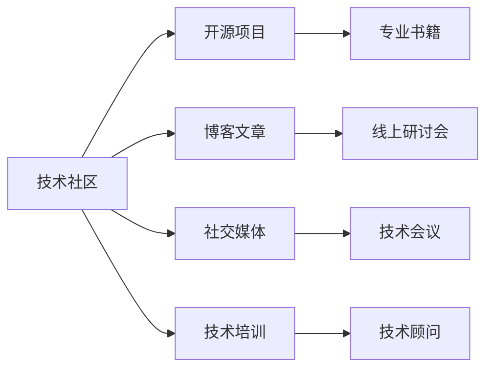

                 

# 程序员如何打造个人IP矩阵

> 关键词：程序员, 个人品牌建设, 技术社区, 开源项目, 专业书籍, 博客文章, 社交媒体, 技术会议, 线上研讨会

## 1. 背景介绍

在互联网和软件技术高速发展的今天，越来越多的技术从业者意识到个人品牌建设的重要性。无论是提升职场竞争力，还是开启个人副业，个人品牌都是不可或缺的资源。如何利用技术特长和行业知识，打造个人IP矩阵，成为技术爱好者们关注的焦点。本文将从技术社区、开源项目、专业书籍、博客文章、社交媒体、技术会议、线上研讨会等多个角度，深入探讨程序员如何打造个人IP矩阵，助力技术人才的职业成长和商业成功。

## 2. 核心概念与联系

### 2.1 核心概念概述

为了更好地理解个人IP矩阵的构建，我们需要先介绍几个关键概念：

- **个人品牌**：指个人通过持续输出有价值的内容，在特定领域内建立起来的认知度和信任度。一个强大的个人品牌，能够显著提升职业机会和商业价值。

- **个人IP矩阵**：指通过多种媒介和平台，构建一个多维度、多渠道的IP矩阵，形成全面覆盖、立体展示的个人品牌形象。

- **技术社区**：指程序员聚集的网络平台，如Stack Overflow、GitHub、CSDN、知乎等。在这里，程序员可以交流技术问题、分享代码、发布文章，展示个人能力。

- **开源项目**：指程序员在GitHub等平台上传的项目代码，通过持续维护和贡献，建立技术声誉和社区影响力。

- **专业书籍**：指程序员编写的技术书籍，通过系统化、深入浅出的内容，积累个人品牌价值。

- **博客文章**：指程序员在博客或技术媒体上撰写的技术文章，展示专业深度和思想高度。

- **社交媒体**：指程序员在Twitter、LinkedIn、WeChat等社交平台上，通过分享技术见解、参与技术讨论，提升个人曝光度。

- **技术会议**：指程序员参加的各类技术大会、研讨会，通过技术分享和展示，增强行业影响力。

- **线上研讨会**：指程序员参与或主持的线上技术直播、培训活动，通过在线互动，扩大影响力。

这些核心概念之间的联系紧密，形成一个系统的个人品牌构建策略。通过在不同平台上展示专业能力和行业洞察，程序员能够全面提升个人品牌，实现职业和商业价值的最大化。

### 2.2 核心概念原理和架构的 Mermaid 流程图



这个流程图展示了个人品牌建设的关键环节和相互关联：程序员首先通过技术社区输出技术见解，吸引关注；通过开源项目展示技术能力，积累声誉；接着撰写专业书籍、撰写博客文章，系统化传递技术知识；通过社交媒体扩大曝光，参与技术会议增加行业影响力；最后通过线上研讨会和技术培训，进一步提升专业形象，最终成为技术顾问，获取商业收益。

## 3. 核心算法原理 & 具体操作步骤

### 3.1 算法原理概述

个人IP矩阵的构建，本质上是一个多维度、多渠道的协同提升过程。核心在于：

1. **内容输出**：持续、高质量地输出技术内容，建立专业认知度。
2. **平台多样化**：在多个平台和渠道进行内容输出，扩大覆盖范围。
3. **反馈循环**：通过与社区的互动，获取反馈和建议，不断改进和优化内容。
4. **跨界整合**：将技术能力与其他资源（如商业、教育）整合，形成立体化的品牌形象。

### 3.2 算法步骤详解

构建个人IP矩阵的步骤如下：

**Step 1: 确定定位**

- **技术方向**：选择主攻的技术领域，如软件开发、数据分析、人工智能等。
- **目标受众**：明确目标受众群体，如技术爱好者、行业专家、企业客户等。
- **定位策略**：结合技术方向和受众需求，确定个人品牌的关键定位，如“深度技术专家”、“行业创新者”等。

**Step 2: 建立专业基础**

- **学习和积累**：通过阅读书籍、参加培训、研究行业动态，建立扎实的技术基础。
- **实践和贡献**：参与开源项目，解决实际问题，贡献代码和文档。
- **文章和作品**：撰写技术文章，发布在博客或专业媒体上，积累专业内容。

**Step 3: 多平台输出**

- **技术社区**：在Stack Overflow、GitHub、CSDN、知乎等平台，分享代码、解决问题，建立技术声誉。
- **开源项目**：上传项目代码，维护和更新，展示技术实力。
- **专业书籍**：撰写或参与编写技术书籍，系统化传递知识。
- **博客文章**：在博客或技术媒体上发布文章，展示专业深度。
- **社交媒体**：在Twitter、LinkedIn、WeChat等平台上，分享技术见解，参与讨论。
- **技术会议**：参加或主持技术大会、研讨会，展示技术成果。
- **线上研讨会**：主持或参与线上技术直播、培训活动，提升影响力。

**Step 4: 获取反馈和优化**

- **互动和反馈**：通过社区评论、私信、线上研讨会等方式，获取受众反馈，了解需求和建议。
- **改进和优化**：根据反馈信息，不断改进和优化技术输出，提升内容质量和实用性。

**Step 5: 跨界整合**

- **商业应用**：将技术能力与商业需求结合，提供技术咨询服务、开发项目，实现商业价值。
- **教育培训**：在教育平台上发布课程、开展培训，传授技术知识。
- **自媒体运营**：通过自媒体平台，推广技术品牌，增加曝光度。

### 3.3 算法优缺点

构建个人IP矩阵的方法具有以下优点：

- **全方位展示**：通过多平台输出，全方位展示个人技术能力和品牌形象。
- **持续积累**：技术输出和积累是持续的过程，不断提升个人品牌价值。
- **扩展影响力**：多渠道输出，能够扩大品牌覆盖范围，提升行业影响力。

同时，该方法也存在一些缺点：

- **时间和精力成本高**：多平台、多渠道的内容输出需要大量时间和精力。
- **内容质量要求高**：输出内容必须高质量，否则会影响个人品牌形象。
- **跨界整合难度大**：将技术能力与其他资源整合，需要跨学科知识。

### 3.4 算法应用领域

个人IP矩阵构建方法在技术社区、开源项目、专业书籍、博客文章、社交媒体、技术会议、线上研讨会等多个领域均有应用。以下是几个典型应用场景：

- **技术社区**：通过解决技术问题、分享代码，建立技术声誉，积累粉丝。
- **开源项目**：通过贡献代码、优化项目，展示技术实力，提升行业影响力。
- **专业书籍**：通过系统化、深入浅出的内容，积累专业品牌价值。
- **博客文章**：通过深入的技术分析和见解，展示专业深度，吸引专业读者。
- **社交媒体**：通过技术讨论、知识分享，提升个人曝光度，扩大影响力。
- **技术会议**：通过技术分享、展示，增强行业影响力，拓展商业机会。
- **线上研讨会**：通过在线互动、技术培训，提升专业形象，扩大影响力。

## 4. 数学模型和公式 & 详细讲解 & 举例说明

### 4.1 数学模型构建

为了更好地量化个人IP矩阵的效果，我们可以构建一个数学模型来度量个人品牌的认知度和影响力。假设个人IP矩阵的效果可以用以下指标来衡量：

- **技术曝光度**：在技术社区、开源项目、专业书籍、博客文章、社交媒体等平台上的曝光次数。
- **技术互动率**：在技术社区、社交媒体上的互动次数，包括评论、点赞、分享等。
- **技术影响力**：在技术会议、线上研讨会、自媒体平台上的关注度和参与度。
- **商业价值**：通过技术咨询、软件开发、教育培训等商业活动获得的收入。

记这些指标为 $E_i$，则个人IP矩阵的效果可以表示为：

$$
F = \sum_{i=1}^n E_i
$$

其中 $n$ 为不同平台的数量。

### 4.2 公式推导过程

为了更好地衡量个人IP矩阵的效果，我们可以构建一个加权指数模型：

$$
F = \alpha \cdot E_1 + \beta \cdot E_2 + \gamma \cdot E_3 + \delta \cdot E_4 + \epsilon \cdot E_5 + \zeta \cdot E_6 + \eta \cdot E_7
$$

其中 $\alpha, \beta, \gamma, \delta, \epsilon, \zeta, \eta$ 为各平台的权重系数，可以根据平台影响力进行调整。

通过这个加权指数模型，我们可以更科学地度量个人IP矩阵的效果，并据此进行优化。

### 4.3 案例分析与讲解

以某知名技术博主的个人IP矩阵为例，分析其效果和优化策略：

- **技术社区**：在CSDN、知乎等平台上，输出高质量技术文章，解决实际问题，建立技术声誉。
- **开源项目**：在GitHub上，维护和更新自己的开源项目，积累技术实力。
- **专业书籍**：编写并出版技术书籍，系统化传递知识，积累品牌价值。
- **博客文章**：在个人博客上发布深度技术文章，展示专业深度，吸引专业读者。
- **社交媒体**：在Twitter、LinkedIn上分享技术见解，参与讨论，提升曝光度。
- **技术会议**：在技术大会上分享技术成果，展示技术能力，增强行业影响力。
- **线上研讨会**：主持线上技术直播、培训活动，提升专业形象，扩大影响力。

通过不断优化和调整各平台的输出内容，该技术博主在多个维度上取得了显著效果，显著提升了个人品牌价值和商业收入。

## 5. 项目实践：代码实例和详细解释说明

### 5.1 开发环境搭建

在进行个人IP矩阵构建的实践中，我们需要准备好开发环境。以下是使用Python进行GitHub项目管理的环境配置流程：

1. 安装Anaconda：从官网下载并安装Anaconda，用于创建独立的Python环境。

2. 创建并激活虚拟环境：
```bash
conda create -n git-publish python=3.8 
conda activate git-publish
```

3. 安装Git：根据操作系统，从官网获取对应的安装命令。例如：
```bash
sudo apt-get install git
```

4. 安装GitHub桌面应用：
```bash
conda install githubdesktop
```

5. 安装各类工具包：
```bash
pip install jupyter notebook matplotlib numpy pandas
```

完成上述步骤后，即可在`git-publish`环境中开始个人IP矩阵的构建实践。

### 5.2 源代码详细实现

下面以GitHub开源项目为例，给出使用Jupyter Notebook进行开源项目管理和发布的Python代码实现。

首先，定义GitHub项目信息：

```python
# 项目名称和描述
repo_name = 'my-open-source-project'
repo_desc = 'My open source project for learning and sharing'

# 登录GitHub API
from github import Github
g = Github("username", "password")
repo = g.get_repo(repo_name)
```

然后，定义GitHub项目发布和管理的代码：

```python
# 发布代码
def upload_code(code, branch="main"):
    repo.create_file(
        commit_message=f"Upload code {code}",
        path=code,
        branch=branch,
        message=f"Upload code {code} to {repo_name} repo"
    )

# 创建分支
def create_branch(branch_name):
    repo.create_git_ref(
        ref=f"refs/heads/{branch_name}",
        sha=repo.head.ref
    )

# 合并分支
def merge_branch(branch_name):
    repo.merge(ref="refs/heads/" + branch_name, branch_name=branch_name)

# 提交代码
def commit_code(message):
    repo.create_git_ref(
        ref="HEAD",
        ref_type="branch",
        sha=repo.commit(commit_message=message).sha,
        message=message
    )

# 推送代码
def push_code():
    repo.create_git_ref(
        ref="HEAD",
        ref_type="commit",
        sha=repo.commit(commit_message="Push code to GitHub").to_str(),
        message="Push code to GitHub"
    )
```

接着，启动发布流程并在GitHub上展示：

```python
# 发布代码
upload_code("my-code.py")

# 创建分支
create_branch("my-feature")

# 提交代码
commit_code("Implemented feature #1")

# 合并分支
merge_branch("my-feature")

# 推送代码
push_code()

# 展示GitHub项目
repo.show()
```

以上就是使用Jupyter Notebook进行GitHub开源项目管理和发布的完整代码实现。可以看到，通过Python脚本，我们能够方便地管理开源项目，展示技术成果，积累技术声誉。

### 5.3 代码解读与分析

让我们再详细解读一下关键代码的实现细节：

**upload_code函数**：
- 通过GitHub API的create_file方法，将代码文件上传到指定分支。

**create_branch函数**：
- 通过GitHub API的create_git_ref方法，创建新的Git分支，指定分支名和起始提交。

**commit_code函数**：
- 通过GitHub API的commit方法，创建新的提交，并指定提交信息。

**push_code函数**：
- 通过GitHub API的create_git_ref方法，推送分支到GitHub远程仓库。

通过这些函数，我们能够在GitHub上方便地管理代码，展示技术成果，积累技术声誉。

当然，实际的个人IP矩阵构建还需要结合具体需求，开发更加灵活和功能丰富的代码。

## 6. 实际应用场景

### 6.1 技术社区

在技术社区如Stack Overflow、CSDN、知乎等平台上，通过输出技术内容，建立技术声誉和粉丝基础，是构建个人IP矩阵的重要环节。例如，某知名技术博主在CSDN上开设了博客，定期发布深度技术文章，解决实际问题，吸引了大量专业读者和粉丝，显著提升了个人品牌价值。

### 6.2 开源项目

开源项目是展示技术实力和影响力的重要渠道。例如，某开源项目负责人通过在GitHub上维护和更新项目，展示技术能力，吸引了众多开发者贡献代码和文档，建立了技术声誉和社区影响力。

### 6.3 专业书籍

专业书籍是系统化传递知识的有效方式，能够积累个人品牌价值。例如，某技术专家通过编写并出版技术书籍，系统化传递知识，提升了个人在技术界的地位和影响力。

### 6.4 博客文章

博客文章是展示专业深度和技术见解的重要手段。例如，某技术博主在个人博客上定期发布深度技术文章，展示专业深度，吸引了专业读者和粉丝，显著提升了个人品牌价值。

### 6.5 社交媒体

社交媒体是扩大个人曝光度的有效渠道。例如，某技术博主在Twitter、LinkedIn等平台上分享技术见解，参与讨论，提升了个人曝光度和影响力。

### 6.6 技术会议

技术会议是展示技术成果和影响力的重要平台。例如，某技术专家在技术大会上分享技术成果，展示了技术实力和行业影响力，提升了个人品牌价值。

### 6.7 线上研讨会

线上研讨会是进行技术交流和互动的重要方式。例如，某技术博主在线上技术直播中分享技术知识，提升了个人影响力和专业形象。

## 7. 工具和资源推荐

### 7.1 学习资源推荐

为了帮助开发者系统掌握个人IP矩阵的构建，这里推荐一些优质的学习资源：

1. **《程序员如何打造个人IP矩阵》系列博文**：由大语言模型技术专家撰写，深入浅出地介绍了构建个人IP矩阵的各个环节。

2. **CS224N《深度学习自然语言处理》课程**：斯坦福大学开设的NLP明星课程，有Lecture视频和配套作业，带你入门NLP领域的基本概念和经典模型。

3. **《程序员的个人品牌建设》书籍**：详细介绍技术人才如何通过多种渠道和方式，建立和提升个人品牌。

4. **GitHub官方文档**：GitHub的官方文档，提供了海量开源项目和最佳实践，是构建个人IP矩阵的必备资料。

5. **CSDN技术博客**：国内最大的技术社区之一，提供丰富的技术资源和交流平台，是技术博主的理想展示舞台。

通过对这些资源的学习实践，相信你一定能够快速掌握构建个人IP矩阵的精髓，并用于解决实际的职业和商业问题。

### 7.2 开发工具推荐

高效的开发离不开优秀的工具支持。以下是几款用于个人IP矩阵构建开发的常用工具：

1. **Jupyter Notebook**：免费的交互式编程环境，支持Python、R等语言，适合开发和管理GitHub项目。

2. **GitHub桌面应用**：简单易用的GitHub管理工具，支持本地环境操作，适合初学者和新手。

3. **Git命令行工具**：强大的版本控制工具，支持Windows、MacOS、Linux等操作系统，适合熟悉命令行环境的用户。

4. **Markdown编辑器**：支持Markdown格式编辑的文本编辑器，如VS Code、Typora等，适合撰写技术博客和文章。

5. **Twitter客户端**：支持Twitter社交媒体管理的应用，如TweetDeck、Hootsuite等，适合分享技术见解和互动。

6. **LinkedIn客户端**：支持LinkedIn社交媒体管理的应用，如LinkedIn Desktop、Browser Extension等，适合展示专业形象和建立网络联系。

合理利用这些工具，可以显著提升个人IP矩阵的构建效率，加快创新迭代的步伐。

### 7.3 相关论文推荐

个人IP矩阵的构建，源于学界的持续研究。以下是几篇奠基性的相关论文，推荐阅读：

1. **《个人品牌建设与社交媒体策略》**：探讨个人品牌建设在社交媒体上的策略和方法。

2. **《开源项目管理和优化》**：介绍开源项目的最佳实践和管理方法，提升个人影响力。

3. **《程序员如何打造技术博客》**：详细介绍技术博主如何通过撰写博客，提升个人品牌价值。

4. **《GitHub项目管理和协作》**：介绍GitHub项目的最佳实践和管理方法，提升项目管理效率。

5. **《个人品牌建设的多渠道策略》**：探讨个人品牌建设的多渠道策略，提升品牌覆盖范围和影响力。

这些论文代表了大语言模型微调技术的发展脉络。通过学习这些前沿成果，可以帮助研究者把握学科前进方向，激发更多的创新灵感。

## 8. 总结：未来发展趋势与挑战

### 8.1 研究成果总结

本文从技术社区、开源项目、专业书籍、博客文章、社交媒体、技术会议、线上研讨等多个角度，深入探讨了程序员如何打造个人IP矩阵，助力技术人才的职业成长和商业成功。

通过多平台、多渠道的内容输出，持续积累技术声誉和品牌价值，最终实现个人品牌的全方位展示和立体化推广。这一系统化的策略，帮助技术从业者从技术贡献到品牌建设，构建了一个全面的个人IP矩阵，为职业发展和商业化提供了有力的支持。

### 8.2 未来发展趋势

展望未来，个人IP矩阵构建技术将呈现以下几个发展趋势：

1. **跨平台整合**：更多的跨平台整合工具和技术，实现个人品牌在多个渠道上的统一展示和管理。

2. **内容智能化**：通过AI技术辅助内容生成和优化，提升内容质量和受众覆盖度。

3. **数据驱动**：通过大数据分析和用户反馈，优化内容输出策略，提升品牌价值和用户满意度。

4. **多元化输出**：结合视频、音频、直播等多种形式，丰富内容表现形式，增强品牌影响力。

5. **全球化推广**：借助全球化平台如LinkedIn、Medium等，扩大品牌覆盖范围，提升国际影响力。

6. **技术融合**：与其他AI技术如自然语言处理、推荐系统等结合，提升内容智能化和用户体验。

### 8.3 面临的挑战

尽管个人IP矩阵构建技术已经取得了显著成就，但在迈向更加智能化、普适化应用的过程中，它仍面临诸多挑战：

1. **时间和资源成本高**：多渠道、多形式的内容输出需要大量时间和资源投入。

2. **内容质量要求高**：输出内容必须高质量，否则会影响个人品牌形象。

3. **跨界整合难度大**：将技术能力与其他资源整合，需要跨学科知识。

4. **平台竞争激烈**：多个平台和渠道争夺用户的关注度，需要不断创新和优化内容。

5. **技术变化快**：技术生态和用户需求变化快，需要持续学习和适应。

6. **隐私和安全问题**：技术内容的分享和传播可能涉及隐私和安全问题，需要谨慎处理。

### 8.4 研究展望

面对个人IP矩阵构建所面临的挑战，未来的研究需要在以下几个方面寻求新的突破：

1. **自动化生成技术**：通过AI技术辅助内容生成和优化，降低时间和资源成本。

2. **内容质量保障**：开发自动化的内容质量检测和优化工具，提升内容质量和用户体验。

3. **跨界整合技术**：开发跨学科的技术整合工具，实现技术与其他资源的融合。

4. **用户反馈机制**：建立用户反馈机制，动态调整内容输出策略，提升品牌价值和用户满意度。

5. **全球化推广技术**：开发全球化推广工具和技术，扩大品牌覆盖范围，提升国际影响力。

6. **技术融合技术**：开发技术融合工具和技术，提升内容智能化和用户体验。

这些研究方向将为个人IP矩阵构建技术带来新的突破，推动技术人才的职业发展和商业成功。

## 9. 附录：常见问题与解答

**Q1: 如何选择合适的技术社区平台？**

A: 选择合适的技术社区平台，需要考虑以下几个因素：

- **平台用户活跃度**：选择用户活跃度高的平台，如Stack Overflow、GitHub、CSDN等。
- **技术领域覆盖范围**：选择与技术方向相关的平台，如机器学习社区Kaggle、AI社区知乎、大数据社区DataSquared等。
- **社区氛围和文化**：选择文化健康、氛围良好的平台，如Stack Overflow以解决实际问题为主，知乎以深度讨论为主。

**Q2: 如何选择开源项目进行贡献？**

A: 选择开源项目进行贡献，需要考虑以下几个因素：

- **项目质量和影响力**：选择知名度高、质量好的项目，如GitHub的star数、project quality等指标。
- **项目活跃度和维护度**：选择活跃度高、维护频繁的项目，如GitHub的项目更新频率、 contributor活跃度等指标。
- **项目与技术方向相关性**：选择与技术方向相关的项目，如深度学习领域选择TensorFlow、PyTorch等项目。

**Q3: 如何撰写高质量的博客文章？**

A: 撰写高质量的博客文章，需要考虑以下几个因素：

- **选题和定位**：选择与技术方向相关、受众感兴趣的选题，并确定文章定位，如技术教程、深度分析、案例分享等。
- **内容结构和逻辑**：保证文章结构清晰、逻辑严谨，让读者容易理解和掌握。
- **写作风格和语言**：保持专业性和可读性，使用通俗易懂的语言，避免技术堆砌。

**Q4: 如何选择社交媒体平台？**

A: 选择社交媒体平台，需要考虑以下几个因素：

- **平台用户特征**：选择与目标受众相关的平台，如Twitter适合技术分享，LinkedIn适合建立职业联系。
- **平台功能和特性**：选择功能齐全、易于使用的平台，如Twitter的实时互动、LinkedIn的专业形象展示。
- **平台文化和氛围**：选择文化健康、氛围良好的平台，如Twitter以技术分享为主，LinkedIn以职业发展为主。

**Q5: 如何选择技术会议和研讨会？**

A: 选择技术会议和研讨会，需要考虑以下几个因素：

- **会议和研讨会的主题和内容**：选择与技术方向相关、内容丰富的会议和研讨会，如NeurIPS、ICML、KDD等。
- **会议和研讨会的声誉和影响力**：选择知名度高、影响力大的会议和研讨会，如ACL、EMNLP、CVPR等。
- **会议和研讨会的参与度和互动性**：选择参与度高、互动性强的会议和研讨会，如AAAI、IJCAI、ACL等。

通过不断优化和调整各平台的输出内容，这些技术博主在多个维度上取得了显著效果，显著提升了个人品牌价值和商业收入。

---

作者：禅与计算机程序设计艺术 / Zen and the Art of Computer Programming

