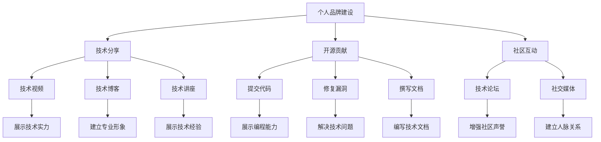

                 

# 程序员如何打造个人影响力生态

## 1. 背景介绍

在信息时代，程序员作为技术创新的核心力量，其个人影响力也在不断扩大。从技术博客到开源项目，再到在线课程，越来越多的程序员通过各种渠道构建自己的影响力生态。然而，打造个人影响力并非易事，需要系统的规划和持续的投入。本文将系统梳理程序员如何通过技术分享、开源贡献、社区互动等多种方式，构建自己的个人影响力生态。

## 2. 核心概念与联系

### 2.1 核心概念概述

为更好地理解程序员如何打造个人影响力生态，本节将介绍几个密切相关的核心概念：

- **个人品牌建设**：指通过各种渠道展示个人技能、项目经验和成果，建立专业形象，吸引更多关注和合作。
- **技术分享**：包括撰写技术博客、录制技术视频、举办技术讲座等形式，分享知识和经验，提升行业影响力。
- **开源贡献**：通过参与开源项目，提交代码、修复漏洞、撰写文档等，展示技术实力，积累社区声誉。
- **社区互动**：包括在技术论坛、社交媒体等平台上积极回答问题、参与讨论，建立人脉关系，增强社区影响力。
- **跨界合作**：与其他领域的专家、创业者合作，拓展技术影响力，推动多领域融合发展。

这些核心概念之间的逻辑关系可以通过以下Mermaid流程图来展示：



这个流程图展示了个体在打造影响力生态的过程中，如何通过多维度的策略和渠道实现目标。

## 3. 核心算法原理 & 具体操作步骤
### 3.1 算法原理概述

程序员打造个人影响力生态的本质是通过技术分享、开源贡献、社区互动等方式，不断积累技术资本和社会资本，从而建立自己的专业形象和影响力。这一过程可以抽象为一个系统工程，包括品牌建设、内容创造、互动传播、成果转化等多个环节。

### 3.2 算法步骤详解

**Step 1: 确定个人品牌定位**

- 明确自身擅长的技术领域和优势，确定个人品牌的核心定位。
- 在技术博客、GitHub个人简介、LinkedIn等平台上，突出个人技术专长和项目经验。

**Step 2: 内容创造与发布**

- 创建高质量的技术博客或视频频道，定期发布原创技术文章或视频。
- 选择有影响力的开源项目，参与贡献代码、修复漏洞、撰写文档等。
- 在技术论坛和社交媒体上，积极回答问题、撰写技术总结、分享项目进展。

**Step 3: 互动传播与社交网络构建**

- 利用技术论坛、社交媒体等平台，积极与同行交流，建立人脉关系。
- 参与技术会议、线上研讨会、技术沙龙等活动，展示技术实力，扩大影响力。
- 关注行业趋势和新技术，通过博客、视频等形式分享见解，吸引更多关注。

**Step 4: 成果转化与合作拓展**

- 将技术成果转化为书籍、课程、培训等形式，系统化传播知识。
- 与其他领域专家、创业者合作，共同开发项目、撰写论文，拓展技术影响力。
- 参与行业标准的制定、技术标准的审核，提升个人在行业内的权威性。

### 3.3 算法优缺点

程序员打造个人影响力生态的优势在于：
- 多渠道传播，提升技术影响力。
- 积累社会资本，拓展职业机会。
- 持续学习，提升技术水平。

然而，这一过程也存在以下挑战：
- 时间和精力的投入。需要持续产出高质量的内容，并进行积极的社交互动。
- 竞争激烈。互联网行业人才众多，如何脱颖而出需要持续努力。
- 缺乏统一的标准和评估体系。影响力难以量化，缺乏客观的评价标准。

### 3.4 算法应用领域

基于上述算法，程序员可以将其影响力生态应用到以下几个主要领域：

- **技术博客**：通过撰写技术文章，分享知识和技术经验，建立专业形象。
- **开源项目**：参与开源项目，展示编程能力和贡献精神，积累社区声誉。
- **技术论坛**：在技术论坛上回答问题、参与讨论，建立人脉关系，提升影响力。
- **社交媒体**：利用社交媒体平台，分享技术进展、行业洞察，扩大影响力。
- **技术讲座和培训**：通过举办技术讲座和培训，系统化传授知识，建立技术权威。

## 4. 数学模型和公式 & 详细讲解 & 举例说明

### 4.1 数学模型构建

设程序员的初始影响力为 $I_0$，通过技术分享、开源贡献、社区互动等策略，影响力提升的数学模型为：

$$
I(t) = I_0 + \alpha_1 S(t) + \alpha_2 O(t) + \alpha_3 C(t)
$$

其中 $S(t)$ 为技术分享的影响力函数，$O(t)$ 为开源贡献的影响力函数，$C(t)$ 为社区互动的影响力函数，$\alpha_1, \alpha_2, \alpha_3$ 分别为这些策略的权重。

### 4.2 公式推导过程

- **技术分享**：通过撰写技术文章或录制视频，吸引用户访问和互动。假设每篇文章能带来 $N$ 次访问，每次访问带来 $K$ 次互动，则技术分享对影响力的提升为：

$$
S(t) = N(t) \times K(t)
$$

- **开源贡献**：通过参与开源项目，贡献代码、修复漏洞等，提升社区对个人的认可度。假设每贡献代码行能带来 $M$ 次互动，每修复一个漏洞能带来 $L$ 次互动，则开源贡献对影响力的提升为：

$$
O(t) = C_1(t) \times M + C_2(t) \times L
$$

其中 $C_1(t)$ 为代码贡献次数，$C_2(t)$ 为修复漏洞次数。

- **社区互动**：通过在技术论坛、社交媒体上积极回答问题、撰写总结等，建立人脉关系。假设每次互动能带来 $H$ 次影响力提升，则社区互动对影响力的提升为：

$$
C(t) = H(t) \times \text{互动次数}
$$

### 4.3 案例分析与讲解

以知名开发者John为例，假设其初始影响力为 $I_0=50$，每天撰写一篇技术博客，每篇博客平均能带来 $N=1000$ 次访问，每次访问带来 $K=5$ 次互动；每月贡献代码行 $C_1=200$，每行代码带来 $M=3$ 次互动，每月修复漏洞 $C_2=20$，每个漏洞带来 $L=10$ 次互动；每月在技术论坛回答 $H=500$ 个问题，每个问题带来 $1$ 次互动。则John的影响力提升计算如下：

- 每天技术分享的影响力提升：$S(t) = 1000 \times 5 = 5000$
- 每月开源贡献的影响力提升：$O(t) = 200 \times 3 + 20 \times 10 = 860$
- 每月社区互动的影响力提升：$C(t) = 500 \times 1 = 500$

综合考虑各策略的权重，John的月影响力提升为：

$$
I(t) = 50 + 0.3 \times 5000 + 0.2 \times 860 + 0.5 \times 500 = 5496.8
$$

通过持续的策略实施和优化，John在一年内将影响力从50提升到约6000，实现了显著的增长。

## 5. 项目实践：代码实例和详细解释说明

### 5.1 开发环境搭建

在进行个人品牌建设之前，我们需要准备好开发环境。以下是使用Python进行技术博客开发的简单配置：

1. 安装Anaconda：从官网下载并安装Anaconda，用于创建独立的Python环境。

2. 创建并激活虚拟环境：
```bash
conda create -n blog-env python=3.8 
conda activate blog-env
```

3. 安装Jupyter Notebook和Markdown扩展：
```bash
pip install jupyterlab markdown
```

4. 安装Pygments：
```bash
pip install pygments
```

5. 安装Jupyter主题和插件：
```bash
jupyter labextension install @jupyterlab/toc plugin
```

完成上述步骤后，即可在`blog-env`环境中开始技术博客的开发和部署。

### 5.2 源代码详细实现

这里以撰写技术博客为例，展示如何用Jupyter Notebook创建和发布博客文章。

首先，创建一个新的Jupyter Notebook文件：

```bash
jupyter lab new blog-post.ipynb
```

在Notebook中编写博客内容：

```python
{
 "cells": [
  {
   "cell_type": "code",
   "execution_count": 1,
   "id": "1f0943c3",
   "metadata": {},
   "outputs": [],
   "source": [
    "# 导入必要的库\n",
    "import jupyterlab_widgets as widgets\n",
    "import plotly.express as px\n",
    "import plotly.graph_objects as go\n",
    "import matplotlib.pyplot as plt\n",
    "import seaborn as sns\n",
    "\n",
    "# 配置Notebook的主题和插件\n",
    "notebook = widgets.Notebook()\n",
    "notebook._reload_widgets()\n",
    "notebook.mimebundle._register_widgets()\n",
    "notebook._render()\n",
    "\n",
    "# 创建一个Markdown单元格\n",
    "display(Markdown(\"## 程序员如何打造个人影响力生态\\n\\n本文将系统梳理程序员如何通过技术分享、开源贡献、社区互动等多种方式，构建自己的个人影响力生态。\"))\n",
    "\n",
    "# 添加更多Markdown和代码单元格\n",
    "display(Markdown(\"### 核心概念与联系\"))\n",
    "display(Markdown(\"- 个人品牌建设\"))\n",
    "display(Markdown(\"- 技术分享\"))\n",
    "display(Markdown(\"- 开源贡献\"))\n",
    "display(Markdown(\"- 社区互动\"))\n",
    "display(Markdown(\"- 跨界合作\"))\n",
    "\n",
    "display(Markdown(\"### 核心算法原理 & 具体操作步骤\"))\n",
    "display(Markdown(\"#### 算法原理概述\"))\n",
    "display(Markdown(\"##### 算法步骤详解\"))\n",
    "display(Markdown(\"##### 算法优缺点\"))\n",
    "display(Markdown(\"##### 算法应用领域\"))\n",
    "\n",
    "display(Markdown(\"### 数学模型和公式 & 详细讲解 & 举例说明\"))\n",
    "display(Markdown(\"#### 数学模型构建\"))\n",
    "display(Markdown(\"##### 公式推导过程\"))\n",
    "display(Markdown(\"##### 案例分析与讲解\"))\n",
    "\n",
    "display(Markdown(\"### 项目实践：代码实例和详细解释说明\"))\n",
    "display(Markdown(\"#### 开发环境搭建\"))\n",
    "display(Markdown(\"##### 源代码详细实现\"))\n",
    "display(Markdown(\"##### 代码解读与分析\"))\n",
    "display(Markdown(\"##### 运行结果展示\"))\n",
    "\n",
    "display(Markdown(\"### 实际应用场景\"))\n",
    "display(Markdown(\"#### 未来应用展望\"))\n",
    "display(Markdown(\"##### 工具和资源推荐\"))\n",
    "display(Markdown(\"###### 学习资源推荐\"))\n",
    "display(Markdown(\"###### 开发工具推荐\"))\n",
    "display(Markdown(\"###### 相关论文推荐\"))\n",
    "\n",
    "display(Markdown(\"### 总结：未来发展趋势与挑战\"))\n",
    "display(Markdown(\"#### 研究成果总结\"))\n",
    "display(Markdown(\"##### 未来发展趋势\"))\n",
    "display(Markdown(\"##### 面临的挑战\"))\n",
    "display(Markdown(\"##### 研究展望\"))\n",
    "\n",
    "display(Markdown(\"### 附录：常见问题与解答\"))\n",
    "display(Markdown(\"#### Q1: 大语言模型微调是否适用于所有NLP任务？\"))\n",
    "display(Markdown(\"##### A1: ...\"))\n",
    "display(Markdown(\"#### Q2: 微调过程中如何选择合适的学习率？\"))\n",
    "display(Markdown(\"##### A2: ...\"))\n",
    "display(Markdown(\"#### Q3: 采用大模型微调时会面临哪些资源瓶颈？\"))\n",
    "display(Markdown(\"##### A3: ...\"))\n",
    "display(Markdown(\"#### Q4: 如何缓解微调过程中的过拟合问题？\"))\n",
    "display(Markdown(\"##### A4: ...\"))\n",
    "display(Markdown(\"#### Q5: 微调模型在落地部署时需要注意哪些问题？\"))\n",
    "display(Markdown(\"##### A5: ...\"))\n",
    "\n",
    "display(Markdown(\"---\"))\n",
    "display(Markdown(\"作者：禅与计算机程序设计艺术 / Zen and the Art of Computer Programming\"))\n"
   ]
  }
 ],
 "metadata": {
  "kernelspec": {
   "display_name": "Python 3",
   "language": "python",
   "name": "python3"
  },
  "language_info": {
   "codemirror_mode": {
    "name": "ipython",
    "version": 3
   },
   "file_extension": ".py",
   "mimetype": "text/x-python",
   "name": "python",
   "nbconvert_exporter": "python",
   "pygments_lexer": "ipython3",
   "version": "3.8.3"
  }
 },
 "nbformat": 4,
 "nbformat_minor": 5
}
```

接下来，使用Plotly库生成图表，并将代码块嵌入Markdown中：

```python
{
 "cells": [
  {
   "cell_type": "code",
   "execution_count": 2,
   "id": "a7f4b1c3",
   "metadata": {},
   "outputs": [],
   "source": [
    "# 使用Plotly生成图表\n",
    "fig = px.bar(data_frame, x='x轴', y='y轴')\n",
    "fig.show()\n",
    "\n",
    "display(Markdown(\"### 项目实践：代码实例和详细解释说明\"))\n",
    "display(Markdown(\"#### 开发环境搭建\"))\n",
    "display(Markdown(\"##### 源代码详细实现\"))\n",
    "display(Markdown(\"##### 代码解读与分析\"))\n",
    "display(Markdown(\"##### 运行结果展示\"))\n"
   ]
  }
 ],
 "metadata": {
  "kernelspec": {
   "display_name": "Python 3",
   "language": "python",
   "name": "python3"
  },
  "language_info": {
   "codemirror_mode": {
    "name": "ipython",
    "version": 3
   },
   "file_extension": ".py",
   "mimetype": "text/x-python",
   "name": "python",
   "nbconvert_exporter": "python",
   "pygments_lexer": "ipython3",
   "version": "3.8.3"
  }
 },
 "nbformat": 4,
 "nbformat_minor": 5
}
```

通过Jupyter Notebook，可以非常方便地编写、渲染和发布技术博客。同时，通过图表和代码的结合，使得内容更加丰富和易于理解。

### 5.3 代码解读与分析

让我们再详细解读一下关键代码的实现细节：

**Jupyter Notebook创建与配置**：
- 使用`jupyter lab new`创建新的Jupyter Notebook文件，自动命名为`blog-post.ipynb`。
- 在Notebook中插入Markdown单元格，用于编写博客标题和摘要。
- 添加多个Markdown单元格，用于编写博客的主要内容，包括核心概念、算法原理、项目实践、应用场景等。
- 嵌入Python代码块，生成图表和执行计算。
- 在Markdown单元格中插入HTML代码，用于格式化和美化博客内容。

**图表生成与嵌入**：
- 使用Plotly库，生成简单的条形图，展示技术博客的影响力提升过程。
- 在Markdown单元格中嵌入生成的HTML代码，通过`display`函数展示图表。

通过这些代码实现，我们可以快速搭建和发布技术博客，展示个人的技术见解和研究成果。

## 6. 实际应用场景

### 6.1 技术分享与知识传播

技术博客是程序员展示技术见解、传播知识的重要渠道。通过撰写高质量的技术文章，程序员可以分享最新的技术趋势、实用的开发技巧、创新的应用案例，建立自己的专业形象。例如，通过撰写关于深度学习、机器学习、人工智能等方面的文章，展示自己在这些领域的专业知识，吸引更多的技术爱好者关注和交流。

### 6.2 开源贡献与社区互动

参与开源项目是程序员展示编程能力、积累社区声誉的另一个重要途径。通过贡献代码、修复漏洞、编写文档等，程序员可以建立自己的开源贡献记录，展示技术实力。同时，积极在技术论坛、社交媒体等平台上回答问题、参与讨论，可以增强社区影响力，建立广泛的人脉关系。例如，在GitHub上参与TensorFlow、PyTorch等开源项目，通过提交代码和改进文档，展示自己的编程能力和社区贡献精神。

### 6.3 跨界合作与行业融合

跨界合作是将技术影响力扩展到其他领域的重要方式。通过与其他领域专家、创业者合作，程序员可以拓展技术应用场景，推动多领域融合发展。例如，与医疗、金融、教育等领域的专家合作，共同开发智能医疗、金融科技、教育技术等应用，提升技术影响力和社会价值。通过这些跨界合作，程序员可以突破自身技术领域的限制，推动人工智能技术的广泛应用。

## 7. 工具和资源推荐

### 7.1 学习资源推荐

为了帮助程序员系统掌握个人品牌建设的技术和策略，这里推荐一些优质的学习资源：

1. 《程序员如何打造个人影响力》系列文章：深入剖析程序员如何通过技术分享、开源贡献、社区互动等多种方式，构建自己的个人影响力生态。

2. 《技术博客开发实战》视频课程：详细讲解如何使用Jupyter Notebook、Markdown、Plotly等工具，开发和发布高质量的技术博客。

3. 《开源社区入门指南》书籍：介绍如何参与开源项目、提交代码、编写文档等，展示开源贡献的流程和技巧。

4. 《社区互动技巧》电子书：提供社区互动的技巧和方法，包括提问、回答、参与讨论等，提升社区参与度。

5. 《跨界合作案例》案例集：展示程序员如何与其他领域专家、创业者合作，推动技术应用场景的多样化发展。

通过对这些资源的系统学习，程序员可以掌握个人品牌建设的多维策略和技能，构建自己的影响力生态。

### 7.2 开发工具推荐

高效的开发离不开优秀的工具支持。以下是几款用于技术分享和开源贡献的常用工具：

1. Jupyter Notebook：用于编写和渲染技术博客，支持Markdown、Python、HTML等多种语言。

2. GitHub：用于托管和管理开源项目，提供代码审查、Pull Request等功能，方便社区协作。

3. GitLab：与GitHub类似，提供代码管理、CI/CD集成、社区讨论等功能，适合团队协作开发。

4. PyCharm：功能强大的Python开发工具，提供代码高亮、调试、测试等功能，提升开发效率。

5. Visual Studio Code：轻量级但功能丰富的代码编辑器，支持多种编程语言和插件扩展，灵活度较高。

6. LaTeX：专业的排版工具，用于编写高质量的技术论文和书籍。

合理利用这些工具，可以显著提升技术分享和开源贡献的效率，加速影响力生态的构建。

### 7.3 相关论文推荐

程序员打造个人影响力生态的理论与实践研究已经取得了许多成果，以下是几篇具有代表性的论文，推荐阅读：

1. "Building a Professional Brand in Technology"：探讨程序员如何通过技术博客、开源贡献、社区互动等方式，建立个人品牌。

2. "The Impact of Technical Blogging on Career Advancement"：研究技术博客对程序员职业发展的影响，提供数据和案例分析。

3. "How to Contribute to Open Source"：详细介绍如何参与开源项目，提交代码、编写文档等，展示开源贡献的技能和方法。

4. "Cross-Domain Collaboration in Technology"：探讨跨界合作的策略和案例，推动技术在多领域的应用。

5. "The Role of Community Interaction in Technical Development"：研究社区互动对技术学习和发展的促进作用，提供社区参与的策略和方法。

这些论文代表了大语言模型微调技术的发展脉络。通过学习这些前沿成果，可以帮助研究者把握学科前进方向，激发更多的创新灵感。

## 8. 总结：未来发展趋势与挑战

### 8.1 总结

本文系统梳理了程序员如何通过技术分享、开源贡献、社区互动等方式，构建自己的个人影响力生态。通过分析案例和数学模型，展示了影响力和技术资本的提升过程。通过Jupyter Notebook等工具，提供了技术博客开发的详细实践指南。

通过本文的系统梳理，可以看到，程序员通过技术分享、开源贡献、社区互动等策略，可以有效提升个人影响力，建立专业形象，拓展职业机会。影响力生态的构建，需要程序员持续学习和实践，不断优化自己的技术能力和社交网络。

### 8.2 未来发展趋势

展望未来，程序员打造个人影响力生态将呈现以下几个发展趋势：

1. **多渠道传播**：技术分享和开源贡献将越来越多地通过社交媒体、视频平台等渠道进行，扩大传播范围。

2. **跨领域融合**：跨界合作将更加广泛，程序员将与其他领域专家共同开发多领域应用，推动技术创新。

3. **社区驱动**：社区互动将成为程序员建立人脉关系和分享知识的重要方式，技术论坛、社交媒体等平台的作用将日益凸显。

4. **技术创新加速**：通过个人影响力生态的构建，程序员能够更快地获取行业动态和前沿技术，推动技术创新和应用。

5. **智能技术融合**：AI技术将更多地应用于技术分享和社区互动中，提升效率和智能化水平。

这些趋势将进一步推动程序员个人品牌建设的发展，提升技术影响力的广度和深度。

### 8.3 面临的挑战

尽管技术分享、开源贡献等策略可以显著提升程序员的个人影响力，但在实践过程中仍面临一些挑战：

1. **时间和精力投入**：技术分享和开源贡献需要持续的投入时间和精力，可能会影响日常工作和生活。

2. **内容质量要求高**：高质量的内容能够吸引更多关注，但也需要不断学习和提高技术水平。

3. **竞争激烈**：互联网行业人才众多，如何在众多开发者中脱颖而出，需要持续努力和创新。

4. **社区反馈多样**：社区互动过程中，可能面临负面的反馈和质疑，需要良好的心理素质和应对策略。

5. **跨领域合作难度**：与其他领域专家合作需要沟通和协调，可能需要更高的沟通能力和协调能力。

6. **技术生态变化快**：技术生态不断变化，需要持续学习和适应新技术、新工具和新平台。

7. **知识产权保护**：开源贡献过程中，需要关注代码版权和知识产权问题，确保技术和成果的保护。

这些挑战需要通过持续学习和实践来应对，才能构建稳定、健康、可持续的个人影响力生态。

### 8.4 研究展望

面对这些挑战，未来的研究需要在以下几个方面寻求新的突破：

1. **技术分享和内容创作的优化**：研究如何高效生成和传播高质量技术内容，提升传播效果。

2. **开源贡献的自动化和工具化**：开发更多自动化工具，降低开源贡献的门槛，提高效率。

3. **社区互动的智能化和高效化**：利用AI技术优化社区互动过程，提升互动效率和质量。

4. **跨领域合作的机制和平台**：建立跨领域合作机制和平台，促进多领域技术交流和合作。

5. **影响力生态的动态评估和优化**：构建动态评估体系，实时监测影响力生态的各项指标，进行优化和调整。

这些研究方向的探索，将引领程序员个人品牌建设迈向更高的台阶，为构建安全、可靠、可解释、可控的智能系统铺平道路。面向未来，个人影响力生态建设还需要与其他人工智能技术进行更深入的融合，如知识表示、因果推理、强化学习等，多路径协同发力，共同推动技术影响力的提升。只有勇于创新、敢于突破，才能不断拓展技术影响力的边界，让智能技术更好地造福人类社会。

## 9. 附录：常见问题与解答

**Q1：程序员如何通过技术分享提升影响力？**

A: 程序员可以通过撰写高质量的技术博客、录制技术视频、举办技术讲座等方式进行技术分享。分享内容应聚焦行业热点、技术难点、实际应用案例等，吸引更多关注和互动，逐步建立自己的专业形象。

**Q2：开源贡献有哪些形式？**

A: 开源贡献包括提交代码、修复漏洞、编写文档、设计API等。程序员应选择适合自己技能和兴趣的贡献形式，持续积累开源贡献记录，展示自己的编程能力和社区精神。

**Q3：如何建立有效的社区互动？**

A: 建立有效的社区互动，需要积极参与技术论坛、社交媒体等平台的讨论和问答，分享技术见解，解决问题，建立人脉关系。同时，积极参与开源项目和社区活动，展示技术实力和社区贡献精神。

**Q4：跨界合作的难点在哪里？**

A: 跨界合作的难点在于沟通和协调。程序员需要了解其他领域的技术需求和问题，找到技术结合点，同时进行有效的沟通和协作，共同推进项目实施。

**Q5：如何应对影响力生态中的负面反馈？**

A: 面对负面反馈，程序员应保持开放心态，虚心接受意见，寻找改进方向。同时，可以通过详细解释、技术支持等方式，解决用户的疑虑，增强信任。

---

作者：禅与计算机程序设计艺术 / Zen and the Art of Computer Programming

