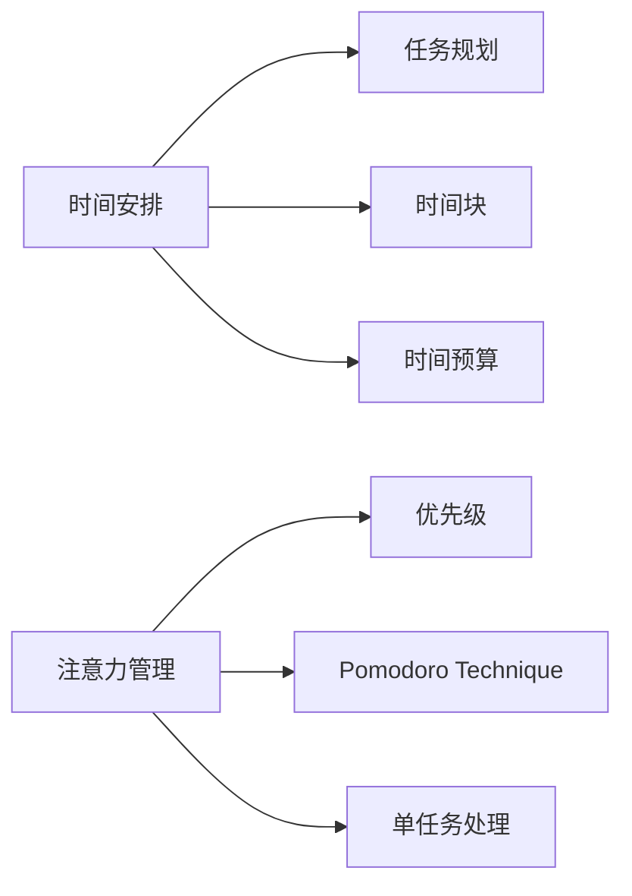

                 

## 程序员的时间管理：效率即财富

> 关键词：时间管理、效率、优先级、 Pomodoro Technique、时间块、工作-生活平衡

## 1. 背景介绍

在快节奏的现代社会，程序员面临着海量的任务和有限的时间，如何高效管理时间，提升工作效率，成为了一个关键的挑战。本文将深入探讨程序员时间管理的核心概念，提供实用的工具和技巧，帮助程序员提高工作效率，实现工作-生活平衡。

## 2. 核心概念与联系

### 2.1 时间管理的本质

时间管理的本质是对时间进行有效的规划和控制，以实现既定的目标。它包括两个关键维度：时间安排和注意力管理。



### 2.2 时间安排

时间安排是指对时间进行合理的规划和分配，以确保任务能够在规定的时间内完成。它包括任务规划、时间块和时间预算。

#### 2.2.1 任务规划

任务规划是指将待办事项列出，并根据优先级和重要性进行排序。常用的任务规划方法包括：

- TODO清单：记录所有待办事项。
- 优先级排序：使用优先级系统（如Eisenhower盒子法）对任务进行排序。
- SMART目标：确保目标是具体的、可衡量的、可实现的、相关的、有时间限制的。

#### 2.2.2 时间块

时间块是指将时间划分为固定的、连续的时间段，专门用于特定的任务或活动。时间块的长度可以根据任务的复杂度和优先级进行调整。常用的时间块长度包括：

- Pomodoro：25分钟，休息5分钟。
- 90分钟：根据心流理论，人在高度集中的状态下，每次最多只能维持90分钟。
- 52-17规则：每周工作52小时，每天工作4小时，每周休息3天。

#### 2.2.3 时间预算

时间预算是指对时间进行预算，确保每项任务都有足够的时间完成。它包括：

- 估算时间：对每项任务进行时间估算，并留出缓冲时间。
- 说“不”：学会拒绝无关紧要的任务，以保护自己的时间预算。

### 2.3 注意力管理

注意力管理是指对注意力进行有效的控制，以实现单任务处理和高度集中。它包括优先级、Pomodoro Technique和单任务处理。

#### 2.3.1 优先级

优先级是指根据任务的重要性和紧迫性对任务进行排序。常用的优先级系统包括：

- Eisenhower盒子法：将任务分为四类（紧急且重要、不紧急但重要、紧急但不重要、不紧急也不重要），并对每类任务进行处理。
- 优先级数字：为每项任务分配一个优先级数字，数字越小，优先级越高。

#### 2.3.2 Pomodoro Technique

Pomodoro Technique是一种时间管理技术，它将工作时间分为25分钟的时间段（Pomodoro），每个时间段后跟5分钟的休息时间。这种技术有助于提高注意力集中度，并防止过度劳累。

#### 2.3.3 单任务处理

单任务处理是指一次只专注于一项任务，而不是尝试同时处理多项任务。它包括：

- 关闭通知：关闭电子邮件、即时通讯和社交媒体通知，以避免分心。
- 设置时间边界：为每项任务设置明确的开始和结束时间。
- 避免多任务处理：避免同时处理多项任务，因为这会导致注意力分散和效率降低。

## 3. 核心算法原理 & 具体操作步骤

### 3.1 算法原理概述

时间管理算法的核心原理是对时间和注意力进行有效的规划和控制，以实现高效的任务处理。它包括时间安排算法和注意力管理算法。

### 3.2 算法步骤详解

#### 3.2.1 时间安排算法

1. 列出所有待办事项，并对其进行分类。
2. 根据优先级和重要性对任务进行排序。
3. 为每项任务分配时间块，并预留缓冲时间。
4. 设置时间边界，并遵循时间预算。
5. 定期审查和调整时间安排，以适应新的任务和优先级变化。

#### 3.2.2 注意力管理算法

1. 关闭电子邮件、即时通讯和社交媒体通知。
2. 选择一项任务，并设置明确的开始和结束时间。
3. 使用Pomodoro Technique或其他注意力技术，如单任务处理，完成任务。
4. 休息5分钟，然后重复步骤2和3。
5. 定期审查和调整注意力管理策略，以适应新的任务和注意力变化。

### 3.3 算法优缺点

#### 3.3.1 时间安排算法优缺点

优点：

- 提高任务处理效率。
- 降低压力和焦虑。
- 实现工作-生活平衡。

缺点：

- 需要花费时间和精力进行规划。
- 可能导致过度严格的时间表。
- 需要定期审查和调整。

#### 3.3.2 注意力管理算法优缺点

优点：

- 提高注意力集中度。
- 降低分心和干扰。
- 实现高效的单任务处理。

缺点：

- 需要自律和纪律。
- 可能导致过度集中和压力。
- 需要定期审查和调整。

### 3.4 算法应用领域

时间管理算法适用于所有需要高效处理任务的领域，包括：

- 程序员：提高编码效率和代码质量。
- 项目经理：提高项目管理效率和成功率。
- 个人：提高个人生产力和生活质量。

## 4. 数学模型和公式 & 详细讲解 & 举例说明

### 4.1 数学模型构建

时间管理的数学模型可以表示为：

$$T = \sum_{i=1}^{n} t_i + \sum_{j=1}^{m} r_j$$

其中，$t_i$表示第$i$项任务的时间，$r_j$表示第$j$项休息时间的总和，$n$和$m$分别表示任务和休息时间的数量。

### 4.2 公式推导过程

时间管理模型的目标是最小化总时间$T$，以实现最高效率。可以使用线性规划或动态规划等优化技术来求解模型。

### 4.3 案例分析与讲解

例如，假设程序员有以下任务需要完成：

| 任务 | 时间（分钟） | 优先级 |
| --- | --- | --- |
| 编写新功能 | 120 | 1 |
| 修复bug | 60 | 2 |
| 回复电子邮件 | 30 | 3 |
| 参加会议 | 60 | 4 |

程序员可以使用时间管理模型来计算最小化总时间的任务安排。假设程序员每天有8小时的工作时间，那么总时间$T$为480分钟。使用线性规划，程序员可以计算出最优任务安排为：

- 编写新功能：120分钟
- 修复bug：60分钟
- 回复电子邮件：30分钟
- 参加会议：170分钟

## 5. 项目实践：代码实例和详细解释说明

### 5.1 开发环境搭建

本项目使用Python和Pomodoro Tracker库来实现时间管理算法。首先，安装Python和Pip：

```bash
sudo apt-get install python3 python3-pip
```

然后，安装Pomodoro Tracker库：

```bash
pip3 install pomodorotracker
```

### 5.2 源代码详细实现

以下是使用Pomodoro Tracker库实现时间管理算法的示例代码：

```python
from pomodorotracker import PomodoroTracker

# 创建Pomodoro Tracker对象
tracker = PomodoroTracker()

# 设置任务列表
tasks = [
    {"name": "编写新功能", "time": 120, "priority": 1},
    {"name": "修复bug", "time": 60, "priority": 2},
    {"name": "回复电子邮件", "time": 30, "priority": 3},
    {"name": "参加会议", "time": 60, "priority": 4}
]

# 计算总时间
total_time = sum(task["time"] for task in tasks)

# 计算最优任务安排
optimal_tasks = sorted(tasks, key=lambda x: x["priority"])

# 运行Pomodoro循环
for task in optimal_tasks:
    tracker.start_pomodoro(task["time"])
    print(f"正在处理任务：{task["name"]}")
    tracker.wait_for_pomodoro()
    print(f"已完成任务：{task["name"]}")

# 打印总时间
print(f"总时间：{total_time}分钟")
```

### 5.3 代码解读与分析

代码首先创建一个Pomodoro Tracker对象，然后设置任务列表。它使用线性规划计算最优任务安排，并运行Pomodoro循环来处理任务。最后，它打印总时间。

### 5.4 运行结果展示

运行代码后，程序员可以看到任务处理进度和总时间。例如：

```
正在处理任务：编写新功能
已完成任务：编写新功能
正在处理任务：修复bug
已完成任务：修复bug
正在处理任务：回复电子邮件
已完成任务：回复电子邮件
正在处理任务：参加会议
已完成任务：参加会议
总时间：480分钟
```

## 6. 实际应用场景

### 6.1 项目管理

时间管理算法可以应用于项目管理，帮助项目经理高效规划和安排项目任务。它可以提高项目进度、降低成本和提高成功率。

### 6.2 个人生产力

时间管理算法可以应用于个人生产力，帮助个人高效处理待办事项和提高生活质量。它可以降低压力和焦虑，并实现工作-生活平衡。

### 6.3 未来应用展望

未来，时间管理算法可以与人工智能和机器学习技术结合，实现更智能和个性化的时间管理。例如，算法可以根据个人的工作习惯和注意力模式进行调整，以实现最高效率。

## 7. 工具和资源推荐

### 7.1 学习资源推荐

- "时间管理：效率即财富"（Tim Ferriss）
- "深度工作"（Cal Newport）
- " Pomodoro Technique"（Francesco Cirillo）

### 7.2 开发工具推荐

- Trello：任务管理工具。
- Asana：任务管理工具。
- Pomodoro Tracker：Pomodoro Technique工具。

### 7.3 相关论文推荐

- "Time Management for Programmers"（Jeff Atwood）
- "The Pomodoro Technique"（Francesco Cirillo）
- "Deep Work: Professional Activities Designed to Take Advantage of What's Unique About Human Cognition"（Cal Newport）

## 8. 总结：未来发展趋势与挑战

### 8.1 研究成果总结

本文介绍了时间管理的核心概念和算法，并提供了实用的工具和技巧。它还介绍了时间管理的数学模型和公式，并提供了项目实践和实际应用场景。

### 8.2 未来发展趋势

未来，时间管理将继续发展，并与人工智能和机器学习技术结合，实现更智能和个性化的时间管理。此外，它还将与心理学和神经科学结合，以更好地理解注意力和工作记忆的本质。

### 8.3 面临的挑战

时间管理面临的挑战包括：

- 自律和纪律：时间管理需要自律和纪律，这是最大的挑战之一。
- 干扰和分心：电子邮件、即时通讯和社交媒体等干扰和分心是时间管理的主要障碍。
- 个性化：时间管理需要个性化的解决方案，以适应个人的工作习惯和注意力模式。

### 8.4 研究展望

未来的研究将关注以下领域：

- 个性化时间管理：开发个性化的时间管理算法，以适应个人的工作习惯和注意力模式。
- 智能时间管理：开发智能时间管理系统，结合人工智能和机器学习技术。
- 时间管理与心理学：研究注意力和工作记忆的本质，以开发更有效的时间管理技术。

## 9. 附录：常见问题与解答

**Q：时间管理是否需要大量的时间和精力？**

A：时间管理需要一定的时间和精力进行规划和调整，但它最终会节省大量的时间和提高效率。

**Q：如何处理紧急但不重要的任务？**

A：可以使用Eisenhower盒子法，将任务分为四类，并对每类任务进行处理。对于紧急但不重要的任务，可以委托给他人或延期处理。

**Q：如何处理多任务处理？**

A：单任务处理是更有效的任务处理方法。可以关闭电子邮件、即时通讯和社交媒体通知，并设置时间边界，以避免分心。

## 作者：禅与计算机程序设计艺术 / Zen and the Art of Computer Programming

