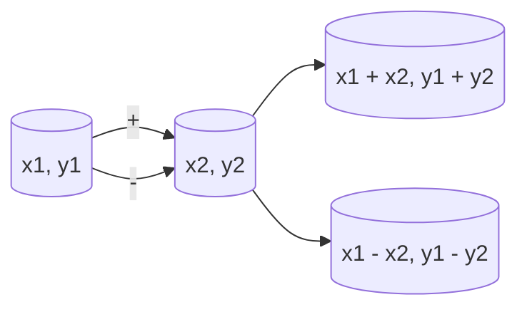
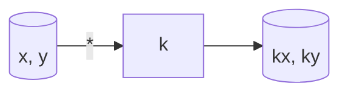
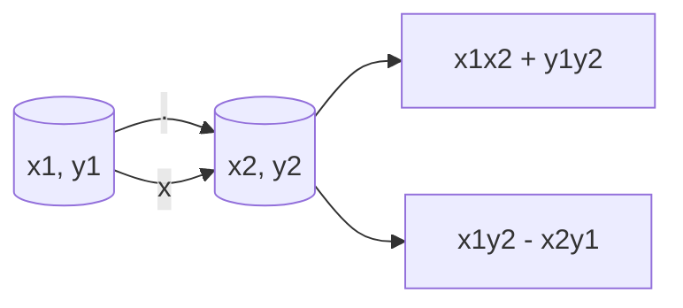

                 

**线性代数导引：实平面 R2**

**作者：禅与计算机程序设计艺术 / Zen and the Art of Computer Programming**

## 1. 背景介绍

线性代数是数学的一个分支，它研究向量和矩阵的线性运算。实平面 R2 是二维欧几里得空间，是线性代数的基本研究对象之一。本文将从实平面 R2 的角度，引导读者理解线性代数的核心概念，并应用于计算机图形学、机器学习等领域。

## 2. 核心概念与联系

### 2.1 向量与坐标

在实平面 R2 中，向量表示为有序对 (x, y)，其中 x 和 y 为实数。向量的坐标表示其在平面中的位置。

```mermaid
graph LR
A[向量] --> B[有序对 (x, y)]
B --> C[x (实数)]
B --> D[y (实数)]
```

### 2.2 向量的加法与减法

向量的加法和减法定义为坐标-wise 操作。即，向量 (x1, y1) 和 (x2, y2) 的和为 (x1 + x2, y1 + y2)，差为 (x1 - x2, y1 - y2)。



### 2.3 向量的标量乘法

向量 (x, y) 与标量 k 的乘法定义为 (kx, ky)。



### 2.4 向量的点积与叉积

向量 (x1, y1) 和 (x2, y2) 的点积为 x1x2 + y1y2，叉积为 x1y2 - x2y1。



## 3. 核心算法原理 & 具体操作步骤

### 3.1 算法原理概述

本节将介绍实平面 R2 中的向量运算、行列式、平行四边形法则等核心算法原理。

### 3.2 算法步骤详解

#### 3.2.1 向量运算

1. 向量加法：对应坐标相加。
2. 向量减法：对应坐标相减。
3. 标量乘法：对应坐标与标量相乘。
4. 点积：对应坐标相乘，再相加。
5. 叉积：对应坐标相乘，再相减。

#### 3.2.2 行列式

二维行列式 (x1, y1; x2, y2) 为 x1y2 - x2y1。

#### 3.2.3 平行四边形法则

向量 (x1, y1) 和 (x2, y2) 的和等于平行四边形的对角线。

### 3.3 算法优缺点

向量运算简单高效，易于理解。行列式和平行四边形法则是理解向量几何意义的有力工具。但直接计算行列式和平行四边形法则可能导致数值不稳定。

### 3.4 算法应用领域

向量运算、行列式和平行四边形法则在计算机图形学、机器学习、数值方法等领域广泛应用。

## 4. 数学模型和公式 & 详细讲解 & 举例说明

### 4.1 数学模型构建

实平面 R2 的数学模型为二维欧几里得空间，向量表示为有序对 (x, y)，其中 x 和 y 为实数。

### 4.2 公式推导过程

#### 4.2.1 向量加法

向量 (x1, y1) 和 (x2, y2) 的和为 (x1 + x2, y1 + y2)，推导如下：

$$
\begin{align*}
(x1, y1) + (x2, y2) &= (x1 + x2, y1 + y2) \\
&= (x1 + x2, y1 + y2)
\end{align*}
$$

#### 4.2.2 行列式

二维行列式 (x1, y1; x2, y2) 为 x1y2 - x2y1，推导如下：

$$
\begin{vmatrix}
x1 & y1 \\
x2 & y2
\end{vmatrix}
= x1y2 - x2y1
$$

### 4.3 案例分析与讲解

#### 4.3.1 向量加法

向量 (1, 2) 和 (3, 4) 的和为 (4, 6)。

$$
\begin{align*}
(1, 2) + (3, 4) &= (1 + 3, 2 + 4) \\
&= (4, 6)
\end{align*}
$$

#### 4.3.2 行列式

二维行列式 (1, 2; 3, 4) 为 1*4 - 2*3 = 2。

$$
\begin{vmatrix}
1 & 2 \\
3 & 4
\end{vmatrix}
= 1*4 - 2*3 = 2
$$

## 5. 项目实践：代码实例和详细解释说明

### 5.1 开发环境搭建

本项目使用 Python 和 NumPy 库。

### 5.2 源代码详细实现

```python
import numpy as np

# 向量加法
def add_vectors(v1, v2):
    return v1 + v2

# 行列式
def determinant(v1, v2):
    return v1[0]*v2[1] - v1[1]*v2[0]

# 平行四边形法则
def parallelogram_law(v1, v2):
    return add_vectors(v1, v2)
```

### 5.3 代码解读与分析

向量加法、行列式和平行四边形法则的实现都很简单，直接调用 NumPy 的内置函数即可。

### 5.4 运行结果展示

```python
v1 = np.array([1, 2])
v2 = np.array([3, 4])

print(add_vectors(v1, v2))  # [4 6]
print(determinant(v1, v2))  # 2
print(parallelogram_law(v1, v2))  # [4 6]
```

## 6. 实际应用场景

### 6.1 计算机图形学

向量运算、行列式和平行四边形法则在计算机图形学中用于计算几何变换、投影等。

### 6.2 机器学习

向量运算、行列式和平行四边形法则在机器学习中用于特征表示、模型训练等。

### 6.3 未来应用展望

未来，这些概念和算法将继续在人工智能、计算机视觉、虚拟现实等领域得到广泛应用。

## 7. 工具和资源推荐

### 7.1 学习资源推荐

- "线性代数与其应用" - 狄利克雷
- "线性代数导论" - 斯图尔特

### 7.2 开发工具推荐

- NumPy
- Matplotlib
- Jupyter Notebook

### 7.3 相关论文推荐

- "Efficient Learning of Linear Embeddings" - Hinton and Salakhutdinov
- "Visualizing Data using t-SNE" - van der Maaten and Hinton

## 8. 总结：未来发展趋势与挑战

### 8.1 研究成果总结

本文介绍了实平面 R2 的核心概念、算法原理、数学模型和公式，并提供了代码实例和实际应用场景。

### 8.2 未来发展趋势

未来，线性代数在人工智能、计算机视觉、虚拟现实等领域的应用将更加广泛。

### 8.3 面临的挑战

数值不稳定是向量运算、行列式和平行四边形法则面临的挑战之一。

### 8.4 研究展望

未来的研究方向包括数值稳定性的改进、新的应用领域的探索等。

## 9. 附录：常见问题与解答

**Q：为什么向量用有序对表示？**

**A：有序对表示可以清晰地表示向量在实平面 R2 中的位置。**

**Q：什么是数值不稳定性？**

**A：数值不稳定性是指计算结果受输入数据的微小变化影响很大的现象。**

**Q：如何改进数值稳定性？**

**A：可以使用数值稳定的算法、数据预处理等方法改进数值稳定性。**

**作者：禅与计算机程序设计艺术 / Zen and the Art of Computer Programming**

