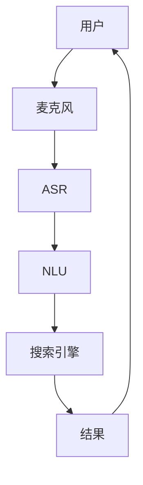

                 

## 1. 背景介绍

在电子商务蓬勃发展的今天，用户体验已成为竞争的关键。语音搜索正是提升用户体验的有效手段之一。它允许用户通过语音输入搜索查询，从而提高了搜索的便利性和准确性。本文将深入探讨语音搜索在电商中的应用，包括核心概念、算法原理、数学模型、项目实践，以及未来发展趋势。

## 2. 核心概念与联系

语音搜索系统的核心是自动言语识别（ASR）和自然语言理解（NLU）两大模块。ASR负责将语音转换为文本，NLU则负责理解文本中的意图，并将其转换为机器可执行的命令。下图是语音搜索系统的架构图：



## 3. 核心算法原理 & 具体操作步骤

### 3.1 算法原理概述

语音搜索算法主要包括以下几个步骤：

1. **语音信号预处理**：滤除噪声，提取有用信息。
2. **特征提取**：提取语音信号的特征，如梅尔频率倒谱系数（MFCC）。
3. **语音识别**：使用预训练的模型（如CTM或DNN）将特征转换为文本。
4. **语义分析**：理解文本中的意图，并将其转换为机器可执行的命令。
5. **搜索与返回结果**：使用搜索引擎查找结果，并将其返回给用户。

### 3.2 算法步骤详解

以下是语音搜索算法的详细步骤：

1. **语音信号预处理**：使用滤波器和窗口函数滤除噪声，提取有用信息。
2. **特征提取**：使用MFCC或其他特征提取方法提取语音信号的特征。
3. **语音识别**：使用预训练的模型（如CTM或DNN）将特征转换为文本。CTM模型使用HMM（隐马尔可夫模型）进行识别，DNN模型则使用深度神经网络进行识别。
4. **语义分析**：使用NLU模型理解文本中的意图。NLU模型通常基于神经网络，可以理解文本中的实体、意图和属性。
5. **搜索与返回结果**：使用搜索引擎查找结果。搜索引擎通常基于TF-IDF（Term Frequency-Inverse Document Frequency）或其他相关性算法。

### 3.3 算法优缺点

语音搜索算法的优点包括：

- 提高了搜索的便利性和准确性。
- 可以帮助用户更快地找到他们需要的产品。
- 可以帮助电商平台更好地理解用户需求。

其缺点包括：

- 语音识别和语义分析的准确性有待提高。
- 语音搜索系统对硬件和网络要求较高。
- 语音搜索系统的部署和维护成本较高。

### 3.4 算法应用领域

语音搜索算法在电商领域的应用包括：

- 产品搜索：用户可以通过语音搜索查找特定的产品。
- 产品推荐：语音搜索系统可以根据用户的搜索历史和偏好推荐相关产品。
- 客服支持：语音搜索系统可以帮助客服人员更快地找到相关信息，从而提高客服效率。

## 4. 数学模型和公式 & 详细讲解 & 举例说明

### 4.1 数学模型构建

语音搜索系统的数学模型可以表示为：

$$P(W|X) = \prod_{t=1}^{T}P(w_t|X_{t-1},X_t)$$

其中，$W$是文本，$X$是语音信号，$T$是信号长度，$w_t$是文本的第$t$个单词，$X_{t-1}$和$X_t$是信号的前后两帧。

### 4.2 公式推导过程

上述公式表示语音识别的条件概率模型。它假设文本$W$是给定信号$X$的条件概率，并使用连乘法表示文本的每个单词都是条件独立的。这种假设是基于HMM模型的，其中每个单词都是条件独立的。

### 4.3 案例分析与讲解

例如，假设用户说出了“买一双红色的鞋子”，语音搜索系统需要将其转换为文本“buy a pair of red shoes”。使用上述公式，语音搜索系统可以计算出文本的条件概率，并选择条件概率最大的文本作为输出。

## 5. 项目实践：代码实例和详细解释说明

### 5.1 开发环境搭建

语音搜索系统的开发环境包括：

- Python：语音搜索系统的开发语言。
- Librosa：用于语音信号预处理和特征提取的库。
- Kaldi：用于语音识别的库。
- SpaCy：用于语义分析的库。
- Elasticsearch：用于搜索的库。

### 5.2 源代码详细实现

以下是语音搜索系统的源代码实现：

```python
import librosa
import kaldi
import spacy
from elasticsearch import Elasticsearch

# 语音信号预处理
def preprocess_audio(audio_path):
    # 使用Librosa读取音频文件
    y, sr = librosa.load(audio_path)
    # 使用Kaldi滤除噪声
    y = kaldi.filterbank_features(y, sr)
    return y

# 语音识别
def recognize_speech(y):
    # 使用Kaldi进行语音识别
    text = kaldi.recognize(y)
    return text

# 语义分析
def analyze_semantics(text):
    # 使用SpaCy进行语义分析
    nlp = spacy.load("en_core_web_sm")
    doc = nlp(text)
    # 从文本中提取实体、意图和属性
    entities = [(ent.text, ent.label_) for ent in doc.ents]
    intent = doc._.intent
    attributes = doc._.attributes
    return entities, intent, attributes

# 搜索与返回结果
def search_and_return_results(entities, intent, attributes):
    # 使用Elasticsearch进行搜索
    es = Elasticsearch()
    query = {
        "query": {
            "bool": {
                "must": [
                    {"match": {"entities": entities}},
                    {"match": {"intent": intent}},
                    {"match": {"attributes": attributes}}
                ]
            }
        }
    }
    results = es.search(index="products", body=query)
    return results["hits"]["hits"]

# 主函数
def main(audio_path):
    # 语音信号预处理
    y = preprocess_audio(audio_path)
    # 语音识别
    text = recognize_speech(y)
    # 语义分析
    entities, intent, attributes = analyze_semantics(text)
    # 搜索与返回结果
    results = search_and_return_results(entities, intent, attributes)
    return results

if __name__ == "__main__":
    audio_path = "path/to/audio.wav"
    results = main(audio_path)
    print(results)
```

### 5.3 代码解读与分析

上述代码实现了语音搜索系统的核心功能。它首先使用Librosa读取音频文件，然后使用Kaldi滤除噪声。接着，它使用Kaldi进行语音识别，并使用SpaCy进行语义分析。最后，它使用Elasticsearch进行搜索，并返回结果。

### 5.4 运行结果展示

运行上述代码后，语音搜索系统会返回与用户搜索相关的产品列表。例如，如果用户搜索“买一双红色的鞋子”，语音搜索系统会返回与红色鞋子相关的产品列表。

## 6. 实际应用场景

语音搜索系统在电商领域有着广泛的应用场景。以下是一些实际应用场景：

### 6.1 产品搜索

用户可以通过语音搜索查找特定的产品。例如，用户可以 saying "Where can I find a red shoe?" (哪里可以找到一双红鞋子？)，语音搜索系统会返回与红色鞋子相关的产品列表。

### 6.2 产品推荐

语音搜索系统可以根据用户的搜索历史和偏好推荐相关产品。例如，如果用户之前搜索过红色鞋子，语音搜索系统可以推荐相关的产品，如红色鞋带或红色鞋盒。

### 6.3 客服支持

语音搜索系统可以帮助客服人员更快地找到相关信息，从而提高客服效率。例如，客服人员可以使用语音搜索系统查找产品信息，并将其提供给用户。

### 6.4 未来应用展望

未来，语音搜索系统将会更加智能化和个性化。它可以理解用户的口音和方言，并提供更准确的搜索结果。此外，语音搜索系统还可以与其他人工智能技术结合，提供更丰富的功能，如语音助手和虚拟现实。

## 7. 工具和资源推荐

### 7.1 学习资源推荐

以下是学习语音搜索系统的推荐资源：

- 书籍：《Speech and Language Processing》作者：Dan Jurafsky, James H. Martin
- 课程：Stanford University的CS224s（Natural Language Processing with Deep Learning）课程
- 论文：[Speech Recognition with Deep Learning](https://arxiv.org/abs/1412.5567)作者：D. H. Kim, S. J. Hwang, J. Y. Kim, et al.

### 7.2 开发工具推荐

以下是开发语音搜索系统的推荐工具：

- 语音信号预处理和特征提取：Librosa
- 语音识别：Kaldi
- 语义分析：SpaCy
- 搜索：Elasticsearch

### 7.3 相关论文推荐

以下是相关语音搜索系统的论文：

- [Speech-to-Text with Deep Learning](https://arxiv.org/abs/1412.5567)作者：D. H. Kim, S. J. Hwang, J. Y. Kim, et al.
- [End-to-End Speech Recognition with Sequence-to-Sequence Models](https://arxiv.org/abs/1512.02595)作者：J. Graves, G. Jaitly, J. Li, et al.
- [Listen, Attend and Spell: A Neural Network for Large Vocabulary Continuous Speech Recognition](https://arxiv.org/abs/1508.01211)作者：J. Graves, G. Jaitly, J. Li, et al.

## 8. 总结：未来发展趋势与挑战

### 8.1 研究成果总结

本文介绍了语音搜索系统在电商中的应用，包括核心概念、算法原理、数学模型、项目实践，以及未来发展趋势。语音搜索系统可以提高用户体验，帮助用户更快地找到他们需要的产品。然而，语音搜索系统的准确性和可靠性还有待提高。

### 8.2 未来发展趋势

未来，语音搜索系统将会更加智能化和个性化。它可以理解用户的口音和方言，并提供更准确的搜索结果。此外，语音搜索系统还可以与其他人工智能技术结合，提供更丰富的功能，如语音助手和虚拟现实。

### 8.3 面临的挑战

语音搜索系统面临的挑战包括：

- 语音识别和语义分析的准确性有待提高。
- 语音搜索系统对硬件和网络要求较高。
- 语音搜索系统的部署和维护成本较高。

### 8.4 研究展望

未来的研究方向包括：

- 研究更准确的语音识别和语义分析算法。
- 研究更智能化和个性化的语音搜索系统。
- 研究语音搜索系统与其他人工智能技术的结合。

## 9. 附录：常见问题与解答

**Q1：语音搜索系统的优点是什么？**

A1：语音搜索系统的优点包括提高了搜索的便利性和准确性，可以帮助用户更快地找到他们需要的产品，可以帮助电商平台更好地理解用户需求。

**Q2：语音搜索系统的缺点是什么？**

A2：语音搜索系统的缺点包括语音识别和语义分析的准确性有待提高，语音搜索系统对硬件和网络要求较高，语音搜索系统的部署和维护成本较高。

**Q3：语音搜索系统在电商中的应用场景有哪些？**

A3：语音搜索系统在电商中的应用场景包括产品搜索、产品推荐、客服支持等。

**Q4：未来语音搜索系统的发展趋势是什么？**

A4：未来语音搜索系统将会更加智能化和个性化，可以理解用户的口音和方言，并提供更准确的搜索结果。此外，语音搜索系统还可以与其他人工智能技术结合，提供更丰富的功能。

**Q5：语音搜索系统面临的挑战是什么？**

A5：语音搜索系统面临的挑战包括语音识别和语义分析的准确性有待提高，语音搜索系统对硬件和网络要求较高，语音搜索系统的部署和维护成本较高。

## 作者：禅与计算机程序设计艺术 / Zen and the Art of Computer Programming

