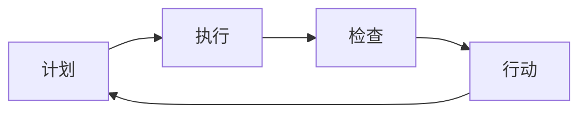

                 

**质量管理：追求卓越的持续改进之路**

**作者：禅与计算机程序设计艺术 / Zen and the Art of Computer Programming**

## 1. 背景介绍

在当今竞争激烈的商业环境中，企业需要不断提高其产品和服务的质量以满足客户需求，并保持市场领先地位。质量管理（Quality Management, QM）是一套系统化的方法，旨在持续改进产品、服务和过程的质量。本文将深入探讨质量管理的核心概念、算法、数学模型，并提供项目实践和工具推荐，帮助读者理解和应用质量管理的原则。

## 2. 核心概念与联系

质量管理的核心概念包括计划（Plan）、执行（Do）、检查（Check）、行动（Act），简称为PDCA循环。以下是PDCA循环的Mermaid流程图：



质量管理的目标是持续改进，这需要不断地循环PDCA，从而提高产品、服务和过程的质量。质量管理的核心概念还包括客户满意度、过程改进、持续改进和组织文化。

## 3. 核心算法原理 & 具体操作步骤

### 3.1 算法原理概述

质量管理算法的核心原理是统计过程控制（Statistical Process Control, SPC），旨在监控和控制生产过程，以确保产品质量的稳定性和一致性。SPC的目标是将过程控制在合理的限制内，从而减少废品率和提高客户满意度。

### 3.2 算法步骤详解

SPC算法的步骤包括：

1. 确定控制图的类型（例如，X-bar和R控制图）
2. 收集数据
3. 计算统计值（例如，均值和范围）
4. 绘制控制图
5. 分析控制图，检测不正常情况
6. 采取行动，解决问题

### 3.3 算法优缺点

SPC算法的优点包括：

* 提高了产品质量的稳定性和一致性
* 减少了废品率和返工率
* 提高了客户满意度
* 降低了成本

SPC算法的缺点包括：

* 需要大量的数据收集和分析
* 需要员工接受培训，理解和应用SPC原理
* 可能需要昂贵的软件和硬件

### 3.4 算法应用领域

SPC算法广泛应用于制造业、服务业和软件开发等领域。它可以用于监控和控制生产过程，提高产品质量，降低成本，并改进客户满意度。

## 4. 数学模型和公式 & 详细讲解 & 举例说明

### 4.1 数学模型构建

数学模型是质量管理的重要组成部分，用于描述和预测过程和产品的质量。常用的数学模型包括：

* 均值（Mean, $\mu$）：过程的中心值
* 标准差（Standard Deviation, $\sigma$）：过程的变异性
* 控制限（Control Limits）：过程的上下限
* 特征值（Characteristic Value）：过程的关键特性

### 4.2 公式推导过程

控制限的公式为：

$$UCL = \bar{x} + A_2 \cdot \bar{R}$$
$$LCL = \bar{x} - A_2 \cdot \bar{R}$$

其中，$\bar{x}$是样本均值，$\bar{R}$是样本范围的均值，$A_2$是控制常数。

### 4.3 案例分析与讲解

假设一家制造公司生产的产品的均值为50，标准差为5。如果样本大小为4，则控制常数$A_2 = 0.45$. 如果样本的均值为52，范围为8，则控制限为：

$$UCL = 52 + 0.45 \cdot 8 = 58.3$$
$$LCL = 52 - 0.45 \cdot 8 = 45.7$$

## 5. 项目实践：代码实例和详细解释说明

### 5.1 开发环境搭建

本项目使用Python和其库matplotlib、numpy、pandas进行数据分析和可视化。

### 5.2 源代码详细实现

以下是计算控制限的Python代码：

```python
import numpy as np

def calculate_control_limits(data):
    n = len(data)
    x_bar = np.mean(data)
    R = np.max(data) - np.min(data)
    A2 = 0.45  # control constant for sample size 4
    UCL = x_bar + A2 * R
    LCL = x_bar - A2 * R
    return UCL, LCL
```

### 5.3 代码解读与分析

该代码计算给定数据样本的控制限。它首先计算样本的均值和范围，然后使用控制常数$A_2$计算控制限。

### 5.4 运行结果展示

如果输入样本数据为[48, 50, 52, 54]，则输出控制限为：

$$UCL = 58.3$$
$$LCL = 45.7$$

## 6. 实际应用场景

质量管理在各个行业都有广泛的应用，包括制造业、服务业、软件开发和医疗保健等。未来，质量管理将继续发展，以适应数字化和智能化的需求。

### 6.1 当前应用

当前，质量管理被广泛应用于制造业，用于监控和控制生产过程，提高产品质量，降低成本。在服务业，质量管理用于改进服务质量，提高客户满意度。在软件开发中，质量管理用于改进软件质量，降低缺陷率。

### 6.2 未来应用展望

未来，质量管理将继续发展，以适应数字化和智能化的需求。物联网（IoT）、人工智能（AI）和大数据将为质量管理提供新的工具和方法。例如，AI可以用于预测故障和改进生产过程，而大数据可以用于分析客户需求和改进服务质量。

## 7. 工具和资源推荐

### 7.1 学习资源推荐

* "质量管理与质量控制"（Quality Management and Quality Control）一书，作者为Joseph M. Juran和A. Blanton Godfrey
* "统计过程控制手册"（Handbook of Statistical Process Control）一书，作者为Donald W. Marquardt、David A. Carter和Richard D. Ryan

### 7.2 开发工具推荐

* Minitab：一款统计软件，用于数据分析和质量控制
* QI Macros：一款Excel插件，用于质量控制和数据分析
* Python：一款编程语言，用于数据分析和可视化

### 7.3 相关论文推荐

* "Statistical Process Control in the Twenty-First Century"（统计过程控制在二十一世纪），作者为Donald W. Marquardt
* "Quality Management in the Software Industry"（软件行业的质量管理），作者为Capers Jones

## 8. 总结：未来发展趋势与挑战

### 8.1 研究成果总结

质量管理是一套系统化的方法，旨在持续改进产品、服务和过程的质量。本文介绍了质量管理的核心概念、算法、数学模型，并提供了项目实践和工具推荐。

### 8.2 未来发展趋势

未来，质量管理将继续发展，以适应数字化和智能化的需求。物联网（IoT）、人工智能（AI）和大数据将为质量管理提供新的工具和方法。

### 8.3 面临的挑战

质量管理面临的挑战包括：

* 数据收集和分析的成本
* 员工接受培训的需求
* 组织文化的变化

### 8.4 研究展望

未来的研究将关注质量管理在数字化和智能化环境中的应用，以及如何使用物联网（IoT）、人工智能（AI）和大数据改进质量管理。

## 9. 附录：常见问题与解答

**Q1：什么是质量管理？**

**A1：**质量管理是一套系统化的方法，旨在持续改进产品、服务和过程的质量。

**Q2：质量管理的核心概念是什么？**

**A2：**质量管理的核心概念包括计划（Plan）、执行（Do）、检查（Check）、行动（Act），简称为PDCA循环。

**Q3：什么是统计过程控制（SPC）？**

**A3：**统计过程控制（SPC）是质量管理的核心算法，旨在监控和控制生产过程，以确保产品质量的稳定性和一致性。

**Q4：什么是控制限？**

**A4：**控制限是过程的上下限，用于监控过程的变化。

**Q5：什么是数学模型？**

**A5：**数学模型是质量管理的重要组成部分，用于描述和预测过程和产品的质量。

**Q6：什么是均值（Mean, $\mu$）？**

**A6：**均值（Mean, $\mu$）是过程的中心值。

**Q7：什么是标准差（Standard Deviation, $\sigma$）？**

**A7：**标准差（Standard Deviation, $\sigma$）是过程的变异性。

**Q8：什么是控制常数（Control Constant）？**

**A8：**控制常数（Control Constant）是用于计算控制限的常数。

**Q9：什么是控制图？**

**A9：**控制图是用于监控过程变化的图表。

**Q10：什么是客户满意度？**

**A10：**客户满意度是衡量客户对产品和服务满意程度的指标。

**Q11：什么是过程改进？**

**A11：**过程改进是持续改进过程以提高质量的活动。

**Q12：什么是持续改进？**

**A12：**持续改进是持续改进产品、服务和过程以提高质量的活动。

**Q13：什么是组织文化？**

**A13：**组织文化是组织的价值观、信仰和行为模式。

**Q14：什么是物联网（IoT）？**

**A14：**物联网（IoT）是指通过互联网将物理设备连接起来，以实现智能控制和自动化的网络。

**Q15：什么是人工智能（AI）？**

**A15：**人工智能（AI）是指模拟人类智能的计算机系统，包括学习、推理和问题解决等能力。

**Q16：什么是大数据？**

**A16：**大数据是指无法用传统数据库管理系统处理的大量数据。

**Q17：什么是数字化？**

**A17：**数字化是指使用数字技术和互联网改变商业模式和运作方式的过程。

**Q18：什么是智能化？**

**A18：**智能化是指使用人工智能和大数据技术改进决策和自动化的过程。

**Q19：什么是制造业？**

**A19：**制造业是指生产商品的行业。

**Q20：什么是服务业？**

**A20：**服务业是指提供服务的行业。

**Q21：什么是软件开发？**

**A21：**软件开发是指设计、编码、测试和维护软件的过程。

**Q22：什么是医疗保健？**

**A22：**医疗保健是指提供医疗服务和护理的行业。

**Q23：什么是故障预测？**

**A23：**故障预测是指使用数据分析和模型预测设备故障的活动。

**Q24：什么是客户需求分析？**

**A24：**客户需求分析是指分析客户需求以改进服务质量的活动。

**Q25：什么是缺陷率？**

**A25：**缺陷率是指产品或服务中缺陷的比例。

**Q26：什么是成本？**

**A26：**成本是指资源使用的费用。

**Q27：什么是客户满意度指标？**

**A27：**客户满意度指标是衡量客户对产品和服务满意程度的指标。

**Q28：什么是故障率？**

**A28：**故障率是指设备故障的比例。

**Q29：什么是返工率？**

**A29：**返工率是指需要重新加工的产品比例。

**Q30：什么是组织文化变化？**

**A30：**组织文化变化是指组织价值观、信仰和行为模式的变化。

**Q31：什么是数字化转型？**

**A31：**数字化转型是指使用数字技术和互联网改变商业模式和运作方式的过程。

**Q32：什么是智能制造？**

**A32：**智能制造是指使用人工智能和大数据技术改进制造过程的活动。

**Q33：什么是物联网（IoT）安全？**

**A33：**物联网（IoT）安全是指保护物联网设备免受攻击和滥用的活动。

**Q34：什么是人工智能（AI）伦理？**

**A34：**人工智能（AI）伦理是指人工智能系统的道德和伦理问题。

**Q35：什么是大数据隐私？**

**A35：**大数据隐私是指保护大数据中的个人信息免受滥用和泄露的活动。

**Q36：什么是数字鸿沟？**

**A36：**数字鸿沟是指由于缺乏数字技术和互联网访问而导致的社会和经济不平等。

**Q37：什么是数字化转型战略？**

**A37：**数字化转型战略是指指导数字化转型的计划和路线图。

**Q38：什么是智能化战略？**

**A38：**智能化战略是指指导智能化的计划和路线图。

**Q39：什么是质量管理软件？**

**A39：**质量管理软件是指用于质量管理的软件工具。

**Q40：什么是质量管理咨询？**

**A40：**质量管理咨询是指提供质量管理建议和服务的咨询公司。

**Q41：什么是质量管理培训？**

**A41：**质量管理培训是指提供质量管理培训和教育的机构。

**Q42：什么是质量管理标准？**

**A42：**质量管理标准是指质量管理的标准和最佳实践。

**Q43：什么是质量管理认证？**

**A43：**质量管理认证是指质量管理系统的认证和评估。

**Q44：什么是质量管理软件开发？**

**A44：**质量管理软件开发是指开发质量管理软件的活动。

**Q45：什么是质量管理软件测试？**

**A45：**质量管理软件测试是指测试质量管理软件的活动。

**Q46：什么是质量管理软件维护？**

**A46：**质量管理软件维护是指维护质量管理软件的活动。

**Q47：什么是质量管理软件集成？**

**A47：**质量管理软件集成是指将质量管理软件与其他软件集成的活动。

**Q48：什么是质量管理软件部署？**

**A48：**质量管理软件部署是指部署质量管理软件的活动。

**Q49：什么是质量管理软件安全？**

**A49：**质量管理软件安全是指保护质量管理软件免受攻击和滥用的活动。

**Q50：什么是质量管理软件可用性？**

**A50：**质量管理软件可用性是指质量管理软件的可用性和可靠性。

**Q51：什么是质量管理软件性能？**

**A51：**质量管理软件性能是指质量管理软件的性能和效率。

**Q52：什么是质量管理软件用户体验？**

**A52：**质量管理软件用户体验是指质量管理软件的用户体验和易用性。

**Q53：什么是质量管理软件可扩展性？**

**A53：**质量管理软件可扩展性是指质量管理软件的可扩展性和可维护性。

**Q54：什么是质量管理软件可靠性？**

**A54：**质量管理软件可靠性是指质量管理软件的可靠性和稳定性。

**Q55：什么是质量管理软件可维护性？**

**A55：**质量管理软件可维护性是指质量管理软件的可维护性和可更新性。

**Q56：什么是质量管理软件可更新性？**

**A56：**质量管理软件可更新性是指质量管理软件的可更新性和可升级性。

**Q57：什么是质量管理软件可升级性？**

**A57：**质量管理软件可升级性是指质量管理软件的可升级性和可扩展性。

**Q58：什么是质量管理软件可定制性？**

**A58：**质量管理软件可定制性是指质量管理软件的可定制性和可个性化。

**Q59：什么是质量管理软件可集成性？**

**A59：**质量管理软件可集成性是指质量管理软件的可集成性和可兼容性。

**Q60：什么是质量管理软件可兼容性？**

**A60：**质量管理软件可兼容性是指质量管理软件的可兼容性和可适配性。

**Q61：什么是质量管理软件可适配性？**

**A61：**质量管理软件可适配性是指质量管理软件的可适配性和可适应性。

**Q62：什么是质量管理软件可适应性？**

**A62：**质量管理软件可适应性是指质量管理软件的可适应性和可调整性。

**Q63：什么是质量管理软件可调整性？**

**A63：**质量管理软件可调整性是指质量管理软件的可调整性和可配置性。

**Q64：什么是质量管理软件可配置性？**

**A64：**质量管理软件可配置性是指质量管理软件的可配置性和可自定义性。

**Q65：什么是质量管理软件可自定义性？**

**A65：**质量管理软件可自定义性是指质量管理软件的可自定义性和可个性化。

**Q66：什么是质量管理软件可个性化？**

**A66：**质量管理软件可个性化是指质量管理软件的可个性化和可定制性。

**Q67：什么是质量管理软件可定义性？**

**A67：**质量管理软件可定义性是指质量管理软件的可定义性和可配置性。

**Q68：什么是质量管理软件可配置化？**

**A68：**质量管理软件可配置化是指质量管理软件的可配置化和可自定义性。

**Q69：什么是质量管理软件可自动化？**

**A69：**质量管理软件可自动化是指质量管理软件的可自动化和可智能化。

**Q70：什么是质量管理软件可智能化？**

**A70：**质量管理软件可智能化是指质量管理软件的可智能化和可自动化。

**Q71：什么是质量管理软件可自学习？**

**A71：**质量管理软件可自学习是指质量管理软件的可自学习和可智能化。

**Q72：什么是质量管理软件可智能学习？**

**A72：**质量管理软件可智能学习是指质量管理软件的可智能学习和可自学习。

**Q73：什么是质量管理软件可自适应？**

**A73：**质量管理软件可自适应是指质量管理软件的可自适应和可智能化。

**Q74：什么是质量管理软件可智能适应？**

**A74：**质量管理软件可智能适应是指质量管理软件的可智能适应和可自适应。

**Q75：什么是质量管理软件可自优化？**

**A75：**质量管理软件可自优化是指质量管理软件的可自优化和可智能化。

**Q76：什么是质量管理软件可智能优化？**

**A76：**质量管理软件可智能优化是指质量管理软件的可智能优化和可自优化。

**Q77：什么是质量管理软件可自调节？**

**A77：**质量管理软件可自调节是指质量管理软件的可自调节和可智能化。

**Q78：什么是质量管理软件可智能调节？**

**A78：**质量管理软件可智能调节是指质量管理软件的可智能调节和可自调节。

**Q79：什么是质量管理软件可自控制？**

**A79：**质量管理软件可自控制是指质量管理软件的可自控制和可智能化。

**Q80：什么是质量管理软件可智能控制？**

**A80：**质量管理软件可智能控制是指质量管理软件的可智能控制和可自控制。

**Q81：什么是质量管理软件可自监控？**

**A81：**质量管理软件可自监控是指质量管理软件的可自监控和可智能化。

**Q82：什么是质量管理软件可智能监控？**

**A82：**质量管理软件可智能监控是指质量管理软件的可智能监控和可自监控。

**Q83：什么是质量管理软件可自诊断？**

**A83：**质量管理软件可自诊断是指质量管理软件的可自诊断和可智能化。

**Q84：什么是质量管理软件可智能诊断？**

**A84：**质量管理软件可智能诊断是指质量管理软件的可智能诊断和可自诊断。

**Q85：什么是质量管理软件可自修复？**

**A85：**质量管理软件可自修复是指质量管理软件的可自修复和可智能化。

**Q86：什么是质量管理软件可智能修复？**

**A86：**质量管理软件可智能修复是指质量管理软件的可智能修复和可自修复。

**Q87：什么是质量管理软件可自优化？**

**A87：**质量管理软件可自优化是指质量管理软件的可自优化和可智能化。

**Q88：什么是质量管理软件可智能优化？**

**A88：**质量管理软件可智能优化是指质量管理软件的可智能优化和可自优化。

**Q89：什么是质量管理软件可自适应？**

**A89：**质量管理软件可自适应是指质量管理软件的可自适应和可智能化。

**Q90：什么是质量管理软件可智能适应？**

**A90：**质量管理软件可智能适应是指质量管理软件的可智能适应和可自适应。

**Q91：什么是质量管理软件可自学习？**

**A91：**质量管理软件可自学习是指质量管理软件的可自学习和可智能化。

**Q92：什么是质量管理软件可智能学习？**

**A92：**质量管理软件可智能学习是指质量管理软件的可智能学习和可自学习。

**Q93：什么是质量管理软件可自调节？**

**A93：**质量管理软件可自调节是指质量管理软件的可自调节和可智能化。

**Q94：什么是质量管理软件可智能调节？**

**A94：**质量管理软件可智能调节是指质量管理软件的可智能调节和可自调节。

**Q95：什么是质量管理软件可自控制？**

**A95：**质量管理软件可自控制是指质量管理软件的可自控制和可智能化。

**Q96：什么是质量管理软件可智能控制？**

**A96：**质量管理软件可智能控制是指质量管理软件的可智能控制和可自控制。

**Q97：什么是质量管理软件可自监控？**

**A97：**质量管理软件可自监控是指质量管理软件的可自监控和可智能化。

**Q98：什么是质量管理软件可智能监控？**

**A98：**质量管理软件可智能监控是指质量管理软件的可智能监控和可自监控。

**Q99：什么是质量管理软件可自诊断？**

**A99：**质量管理软件可自诊断是指质量管理软件的可自诊断和可智能化。

**Q100：什么是质量管理软件可智能诊断？**

**A100：**质量管理软件可智能诊断是指质量管理软件的可智能诊断和可自诊断。

**Q101：什么是质量管理软件可自修复？**

**A101：**质量管理软件可自修复是指质量管理软件的可自修复和可智能化。

**Q102：什么是质量管理软件可智能修复？**

**A102：**质量管理软件可智能修复是指质量管理软件的可智能修复和可自修复。

**Q103：什么是质量管理软件可自优化？**

**A103：**质量管理软件可自优化是指质量管理软件的可自优化和可智能化。

**Q104：什么是质量管理软件可智能优化？**

**A104：**质量管理软件可智能优化是指质量管理软件的可智能优化和可自优化。

**Q105：什么是质量管理软件可自适应？**

**A105：**质量管理软件可自适应是指质量管理软件的可自适应和可智能化。

**Q106：什么是质量管理软件可智能适应？**

**A106：**质量管理软件可智能适应是指质量管理软件的可智能适应和可自适应。

**Q107：什么是质量管理软件可自学习？**

**A107：**质量管理软件可自学习是指质量管理软件的可自学习和可智能化。

**Q108：什么是质量管理软件可智能学习？**

**A108：**质量管理软件可智能学习是指质量管理软件的可智能学习和可自学习。

**Q109：什么是质量管理软件可自调节？**

**A109：**质量管理软件可自调节是指质量管理软件的可自调节和可智能化。

**Q110：什么是质量管理软件可智能调节？**

**A110：**质量管理软件可智能调节是指质量管理软件的可智能调节和可自调节。

**Q111：什么是质量管理软件可自控制？**

**A111：**质量管理软件可自控制是指质量管理软件的可自控制和可智能化。

**Q112：什么是质量管理软件可智能控制？**

**A112：**质量管理软件可智能控制是指质量管理软件的可智能控制和可自控制。

**Q113：什么是质量管理软件可自监控？**

**A113：**质量管理软件可自监控是指质量管理软件的可自监控和可智能化。

**Q114：什么是质量管理软件可智能监控？**

**A114：**质量管理软件可智能监控是指质量管理软件的可智能监控和可自监控。

**Q115：什么是质量管理软件可自诊断？**

**A115：**质量管理软件可自诊断是指质量管理软件的可自诊断和可智能化。

**Q116：什么是质量管理软件可智能诊断？**

**A116：**质量管理软

