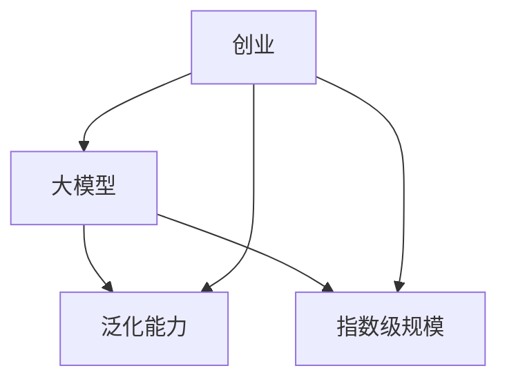

                 

**AI大模型创业战：挑战与机遇并存的分析**

**作者：禅与计算机程序设计艺术 / Zen and the Art of Computer Programming**

## 1. 背景介绍

当前，人工智能（AI）领域正处于大模型创业的热潮之中。大模型，指的是具有数十亿甚至数千亿参数的模型，能够在广泛的领域表现出强大的泛化能力。然而，大模型创业并非易事，挑战与机遇并存。本文将深入分析大模型创业的核心概念、算法原理、数学模型、项目实践、实际应用场景，并提供工具和资源推荐，以期为AI创业者提供有益的参考。

## 2. 核心概念与联系

### 2.1 核心概念

- **大模型（Large Model）**：具有数十亿甚至数千亿参数的模型。
- **泛化能力（Generalization）**：模型在未见过的数据上表现出的能力。
- **指数级规模（Exponential Scale）**：大模型训练和推理所需的计算资源呈指数级增长。
- **创业（Entrepreneurship）**：以创新想法为基础，创建新的商业实体或项目的过程。

### 2.2 核心概念联系 Mermaid 流程图



## 3. 核心算法原理 & 具体操作步骤

### 3.1 算法原理概述

大模型创业的核心算法原理是**Transformer**模型及其变种。Transformer模型引入了自注意力机制，能够处理长序列数据，是当前大模型的基础架构。

### 3.2 算法步骤详解

1. **输入表示**：将输入数据（如文本、图像）转换为模型可以处理的表示形式。
2. **编码器**：使用自注意力机制和前向网络编码输入表示，生成上下文相关的表示。
3. **解码器**：使用自注意力机制和前向网络解码编码器输出，生成输出表示。
4. **输出**：将输出表示转换为最终输出（如文本、图像）。

### 3.3 算法优缺点

**优点**：
- 可以处理长序列数据。
- 在广泛的领域表现出强大的泛化能力。

**缺点**：
- 训练和推理需要大量计算资源。
- 存在过拟合和解释性的挑战。

### 3.4 算法应用领域

大模型在自然语言处理（NLP）、计算机视觉（CV）、生物信息学等领域都有广泛应用。例如，在NLP领域，大模型可以用于文本生成、机器翻译、问答系统等。

## 4. 数学模型和公式 & 详细讲解 & 举例说明

### 4.1 数学模型构建

大模型的数学模型是多层感知机（MLP）和自注意力机制的组合。自注意力机制可以表示为：

$$ \text{Attention}(Q, K, V) = \text{softmax}\left(\frac{QK^T}{\sqrt{d_k}}\right)V $$

其中，$Q$, $K$, $V$是查询、键、值向量，$d_k$是键向量的维度。

### 4.2 公式推导过程

自注意力机制的推导过程如下：

1. 计算注意力分数：$e_{ij} = a\left(Q_i, K_j\right) = \frac{Q_iK_j^T}{\sqrt{d_k}}$
2. 计算注意力权重：$a_{ij} = \frac{\exp(e_{ij})}{\sum_{k=1}^{n}\exp(e_{ik})}$
3. 计算注意力输出：$z_i = \sum_{j=1}^{n}a_{ij}V_j$

### 4.3 案例分析与讲解

例如，在文本生成任务中，查询$Q$是当前时间步的表示，键$K$和值$V$是所有时间步的表示。自注意力机制可以帮助模型理解上下文，生成相关的文本。

## 5. 项目实践：代码实例和详细解释说明

### 5.1 开发环境搭建

大模型创业需要强大的计算资源。推荐使用GPU集群，并配置分布式训练环境。

### 5.2 源代码详细实现

大模型的实现可以使用深度学习框架，如PyTorch或TensorFlow。以下是一个简化的Transformer模型实现示例：

```python
import torch
import torch.nn as nn

class Transformer(nn.Module):
    def __init__(self, d_model, n_head, n_layers):
        super(Transformer, self).__init__()
        self.encoder_layers = nn.ModuleList([
            nn.TransformerEncoderLayer(d_model, n_head) for _ in range(n_layers)
        ])
        self.encoder = nn.TransformerEncoder(self.encoder_layers, n_layers)

    def forward(self, src):
        output = self.encoder(src)
        return output
```

### 5.3 代码解读与分析

在上述代码中，`Transformer`类定义了一个Transformer模型，包含多个编码器层。`forward`方法定义了模型的前向传播过程。

### 5.4 运行结果展示

大模型的运行结果取决于模型的规模和训练数据。在大规模数据集上训练的大模型通常表现出强大的泛化能力。

## 6. 实际应用场景

### 6.1 当前应用

大模型当前应用于各种领域，如NLP、CV、生物信息学等。例如，在NLP领域，大模型可以用于文本生成、机器翻译、问答系统等。

### 6.2 未来应用展望

未来，大模型有望在更多领域得到应用，如自动驾驶、医疗诊断等。此外，大模型有望帮助开发新的AI应用，如创造性写作、虚拟助手等。

## 7. 工具和资源推荐

### 7.1 学习资源推荐

- **课程**：斯坦福大学的“深度学习”课程（CS230）和“转换器模型”课程（CS224n）是学习大模型的好资源。
- **书籍**：“注意力是所有事情的关键”一书详细介绍了自注意力机制和Transformer模型。

### 7.2 开发工具推荐

- **PyTorch**：一个流行的深度学习框架，支持动态计算图和分布式训练。
- **Hugging Face Transformers**：一个开源的Transformer模型库，提供了各种预训练模型和工具。

### 7.3 相关论文推荐

- **Attention is All You Need**：介绍了Transformer模型的原始论文。
- **Language Models are Few-Shot Learners**：介绍了大模型在少样本学习中的应用。

## 8. 总结：未来发展趋势与挑战

### 8.1 研究成果总结

大模型创业取得了显著的研究成果，如强大的泛化能力和广泛的应用。

### 8.2 未来发展趋势

未来，大模型有望在更多领域得到应用，并帮助开发新的AI应用。此外，大模型有望帮助开发新的训练方法，如少样本学习和指南学习。

### 8.3 面临的挑战

大模型创业面临的挑战包括计算资源需求、过拟合和解释性等问题。此外，大模型的开发和部署需要考虑伦理和安全问题。

### 8.4 研究展望

未来的研究方向包括开发新的模型架构、优化训练方法、提高模型解释性等。此外，研究人员有望开发新的大模型评估方法，以更好地衡量模型的泛化能力和其他属性。

## 9. 附录：常见问题与解答

**Q：大模型需要多少计算资源？**

**A：大模型需要大量计算资源，通常需要数百甚至数千个GPU进行训练。**

**Q：大模型是否会过拟合？**

**A：是的，大模型可能会过拟合，需要使用技术如正则化和数据增强来减轻过拟合。**

**Q：大模型是否安全？**

**A：大模型的安全性取决于其开发和部署方式。需要考虑数据隐私、模型泄露等问题。**

## 结束语

大模型创业是AI领域的热门话题，具有广阔的应用前景。然而，大模型创业也面临挑战，需要解决计算资源需求、过拟合和解释性等问题。未来，大模型有望在更多领域得到应用，并帮助开发新的AI应用。我们期待着大模型创业的未来发展。

**作者署名：作者：禅与计算机程序设计艺术 / Zen and the Art of Computer Programming**

