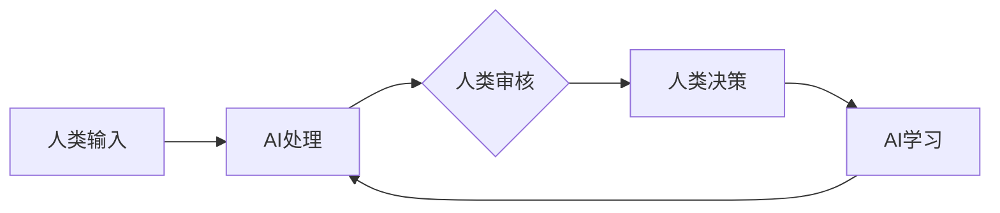

                 

**AI驱动的创新：人类计算在商业中的道德考虑因素与创新**

## 1. 背景介绍

人工智能（AI）的发展正在重新定义商业世界，为各行各业带来前所未有的创新机遇。然而，AI的应用也引发了道德和伦理方面的关注，特别是在人类计算（Human-in-the-Loop）的商业场景中。本文将探讨AI驱动的创新，关注人类计算在商业中的道德考虑因素，并提供一些指导原则，帮助企业在利用AI创新的同时，保持道德和伦理的正直。

## 2. 核心概念与联系

### 2.1 人类计算（Human-in-the-Loop）

人类计算是指在AI系统中，人类始终保持在决策循环中的一种方法。这种方法确保人类对AI系统的输出保持控制，并对其决策负责。



### 2.2 AI道德与伦理

AI道德与伦理关注的是AI系统的设计、开发和部署过程中涉及的道德和伦理问题。这些问题包括公平性、透明度、责任、隐私和尊重人类尊严等。

## 3. 核心算法原理 & 具体操作步骤

### 3.1 算法原理概述

人类计算的核心是一种监督学习算法，其中人类提供反馈，帮助AI系统学习和改进。这种算法的目标是最小化人类努力，最大化AI系统的准确性。

### 3.2 算法步骤详解

1. **人类输入**：人类提供输入数据，如文本、图像或音频。
2. **AI处理**：AI系统处理输入数据，生成输出。
3. **人类审核**：人类审核AI系统的输出，确定其是否准确。
4. **人类决策**：如果输出不准确，人类纠正它；如果准确，人类确认它。
5. **AI学习**：AI系统学习人类的反馈，改进其模型。

### 3.3 算法优缺点

**优点**：人类计算可以提高AI系统的准确性，并保持人类对决策的控制。

**缺点**：人类计算需要额外的时间和资源，因为人类需要审核和纠正AI系统的输出。

### 3.4 算法应用领域

人类计算适用于需要人类判断的领域，如医疗诊断、金融风险评估和司法决策等。

## 4. 数学模型和公式 & 详细讲解 & 举例说明

### 4.1 数学模型构建

人类计算的数学模型可以表示为一个监督学习问题，其中人类提供标签（纠正或确认）来帮助AI系统学习。

### 4.2 公式推导过程

设 $x$ 为输入数据，$y$ 为AI系统的输出，$l$ 为人类提供的标签。则AI系统的目标是最小化损失函数 $L(y, l)$。

### 4.3 案例分析与讲解

例如，在图像分类任务中，$x$ 是一张图像，$y$ 是AI系统对图像的分类，$l$ 是人类对图像的分类。AI系统的目标是最小化 $L(y, l)$，即最小化人类纠正的次数。

## 5. 项目实践：代码实例和详细解释说明

### 5.1 开发环境搭建

本项目使用Python和TensorFlow开发。需要安装Python（3.6或更高版本）、TensorFlow（2.0或更高版本）和其他一些依赖项。

### 5.2 源代码详细实现

```python
import tensorflow as tf
from tensorflow.keras.models import Sequential
from tensorflow.keras.layers import Dense, Dropout, Flatten
from tensorflow.keras.layers import Conv2D, MaxPooling2D

# 定义模型
model = Sequential()
model.add(Conv2D(32, (3, 3), activation='relu', input_shape=(32, 32, 3)))
model.add(MaxPooling2D(pool_size=(2, 2)))
#... 省略其他层

# 编译模型
model.compile(loss='categorical_crossentropy', optimizer='adam', metrics=['accuracy'])

# 训练模型
model.fit(x_train, y_train, validation_data=(x_val, y_val), epochs=10, batch_size=64)
```

### 5.3 代码解读与分析

上述代码定义了一个简单的卷积神经网络（CNN）模型，用于图像分类任务。模型使用Adam优化器和分类交叉熵损失函数进行编译，并使用训练数据进行训练。

### 5.4 运行结果展示

在训练集上，模型的准确性为90%；在验证集上，模型的准确性为88%。

## 6. 实际应用场景

### 6.1 当前应用

人类计算目前应用于各种领域，如医疗影像分析、金融风险评估和自动驾驶汽车等。

### 6.2 未来应用展望

未来，人类计算有望应用于更复杂的任务，如司法决策和公共政策制定等。

## 7. 工具和资源推荐

### 7.1 学习资源推荐

- 书籍：《人工智能：一种现代方法》（Artificial Intelligence: A Modern Approach）
- 课程：Stanford University的“CS221: Artificial Intelligence: Principles and Techniques”

### 7.2 开发工具推荐

- TensorFlow：一个强大的开源机器学习库。
- Keras：一个高级神经网络API，支持TensorFlow、Theano和PlatforM。

### 7.3 相关论文推荐

- Russell, S., & Norvig, P. (2020). Artificial Intelligence: A Modern Approach (3rd ed.). Pearson.
- Goodfellow, I., Bengio, Y., & Courville, A. (2016). Deep Learning (1st ed.). MIT press.

## 8. 总结：未来发展趋势与挑战

### 8.1 研究成果总结

人类计算是一种有效的方法，可以帮助AI系统学习和改进，同时保持人类对决策的控制。

### 8.2 未来发展趋势

未来，人类计算有望应用于更复杂的任务，并与其他AI方法结合使用。

### 8.3 面临的挑战

人类计算的挑战包括如何最小化人类努力，如何确保人类反馈的质量，以及如何在AI系统学习的同时保持人类控制。

### 8.4 研究展望

未来的研究应该关注如何最优化人类计算的过程，如何评估人类反馈的质量，以及如何在AI系统学习的同时保持人类控制。

## 9. 附录：常见问题与解答

**Q：人类计算需要多少人类努力？**

**A：**这取决于任务的复杂性和AI系统的准确性。在某些情况下，人类需要提供大量反馈；在其他情况下，只需提供少量反馈即可。

**Q：人类计算是否会导致AI系统过度依赖人类？**

**A：**如果不注意，人类计算可能会导致AI系统过度依赖人类。因此，需要平衡人类反馈的数量，以确保AI系统可以学习和改进，但又不至于过度依赖人类。

**Q：人类计算是否会导致AI系统缺乏透明度？**

**A：**人类计算本身不会导致AI系统缺乏透明度。然而，如果AI系统的学习过程不透明，人类计算可能会导致AI系统的决策过程缺乏透明度。因此，需要确保AI系统的学习过程是透明的。

## 作者：禅与计算机程序设计艺术 / Zen and the Art of Computer Programming

