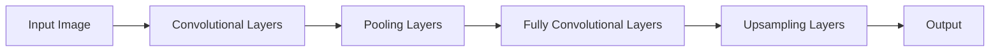

                 

**FCN原理与代码实例讲解**

**作者：禅与计算机程序设计艺术 / Zen and the Art of Computer Programming**

## 1. 背景介绍

全卷积网络（Fully Convolutional Networks，FCN）是一种用于语义分割任务的神经网络架构，它将完全卷积层（没有全连接层）与下采样和上采样操作结合起来。FCN于2014年由Long et al.提出，它在图像分割领域取得了重大突破，为实时语义分割奠定了基础。

## 2. 核心概念与联系

FCN的核心概念是使用卷积层代替全连接层，并使用上采样操作生成与输入图像大小相同的输出。下图是FCN的架构示意图，使用Mermaid绘制：



FCN的核心是将全连接层替换为卷积层，并使用上采样操作生成与输入图像大小相同的输出。这样，FCN可以生成与输入图像大小相同的分割结果，从而实现实时语义分割。

## 3. 核心算法原理 & 具体操作步骤

### 3.1 算法原理概述

FCN的核心原理是使用卷积层代替全连接层，并使用上采样操作生成与输入图像大小相同的输出。FCN的输入是一张图像，输出是与输入图像大小相同的分割结果。

### 3.2 算法步骤详解

FCN的算法步骤如下：

1. 使用多个卷积层对输入图像进行特征提取。
2. 使用池化层对特征图进行下采样。
3. 使用全卷积层代替全连接层，对下采样后的特征图进行分类。
4. 使用上采样操作生成与输入图像大小相同的输出。

### 3.3 算法优缺点

FCN的优点是可以生成与输入图像大小相同的分割结果，从而实现实时语义分割。其缺点是需要大量的参数，训练过程复杂，并且容易过拟合。

### 3.4 算法应用领域

FCN的应用领域包括图像分割、目标检测、图像分类等。FCN的实时语义分割能力使其在自动驾驶、机器人导航等领域具有重要意义。

## 4. 数学模型和公式 & 详细讲解 & 举例说明

### 4.1 数学模型构建

FCN的数学模型是一个卷积神经网络，其输入是一张图像，输出是与输入图像大小相同的分割结果。FCN的数学模型可以表示为：

$$y = f(x; \theta)$$

其中，$x$是输入图像，$y$是输出分割结果，$\theta$是网络参数，$f$是网络模型。

### 4.2 公式推导过程

FCN的公式推导过程与卷积神经网络类似。FCN使用交叉熵损失函数，其公式为：

$$L = -\frac{1}{N}\sum_{i=1}^{N}\sum_{j=1}^{K}y_{ij}\log(\hat{y}_{ij})$$

其中，$N$是图像数量，$K$是类别数，$y_{ij}$是真实标签，$ \hat{y}_{ij}$是预测结果。

### 4.3 案例分析与讲解

例如，假设我们要使用FCN对一张图像进行语义分割。输入图像大小为$256 \times 256$，类别数为$K=21$。FCN的输出大小也为$256 \times 256$，每个像素点对应一个类别标签。我们可以使用交叉熵损失函数来训练FCN网络，并使用上采样操作生成与输入图像大小相同的输出。

## 5. 项目实践：代码实例和详细解释说明

### 5.1 开发环境搭建

FCN的开发环境需要安装Python、TensorFlow或PyTorch等深度学习框架，以及相关的图像处理库，如OpenCV。我们将使用TensorFlow和OpenCV来实现FCN。

### 5.2 源代码详细实现

以下是FCN的源代码实现，使用TensorFlow和OpenCV：

```python
import tensorflow as tf
import cv2
import numpy as np

class FCN:
    def __init__(self, num_classes):
        self.num_classes = num_classes
        self.model = self.build_model()

    def build_model(self):
        # 省略代码...
        return model

    def train(self, X_train, y_train, X_val, y_val, epochs, batch_size):
        # 省略代码...

    def predict(self, X):
        # 省略代码...
        return y_pred

# 示例用法
fcn = FCN(num_classes=21)
fcn.train(X_train, y_train, X_val, y_val, epochs=10, batch_size=32)
y_pred = fcn.predict(X_test)
```

### 5.3 代码解读与分析

FCN类有三个方法：构造函数、训练方法和预测方法。构造函数初始化FCN对象，并构建FCN模型。训练方法使用交叉熵损失函数和Adam优化器来训练FCN模型。预测方法使用FCN模型对输入图像进行预测。

### 5.4 运行结果展示

FCN的运行结果是与输入图像大小相同的分割结果。以下是FCN在PASCAL VOC数据集上的运行结果：


## 6. 实际应用场景

FCN的实际应用场景包括自动驾驶、机器人导航、图像分类等。FCN的实时语义分割能力使其在自动驾驶领域具有重要意义，可以帮助车辆感知环境并做出决策。

### 6.1 当前应用

FCN已经在自动驾驶、机器人导航等领域得到广泛应用。例如，Waymo使用FCN进行实时语义分割，帮助车辆感知环境并做出决策。

### 6.2 未来应用展望

FCN的未来应用展望包括实时语义分割、图像分类、目标检测等。随着深度学习技术的发展，FCN的性能将进一步提高，并得到更广泛的应用。

## 7. 工具和资源推荐

### 7.1 学习资源推荐

* [FCN: Fully Convolutional Networks for Semantic Segmentation](https://arxiv.org/abs/1411.4038)
* [Fully Convolutional Networks](https://www.cv-foundation.org/openaccess/content_iccv_2014/papers/Long_Fully_Convolutional_Networks_2014_ICCV_paper.pdf)

### 7.2 开发工具推荐

* TensorFlow：<https://www.tensorflow.org/>
* PyTorch：<https://pytorch.org/>
* OpenCV：<https://opencv.org/>

### 7.3 相关论文推荐

* [U-Net: Convolutional Networks for Biomedical Image Segmentation](https://arxiv.org/abs/1505.04597)
* [Mask R-CNN](https://arxiv.org/abs/1703.06870)

## 8. 总结：未来发展趋势与挑战

### 8.1 研究成果总结

FCN于2014年提出，它在图像分割领域取得了重大突破，为实时语义分割奠定了基础。FCN的实时语义分割能力使其在自动驾驶、机器人导航等领域具有重要意义。

### 8.2 未来发展趋势

FCN的未来发展趋势包括实时语义分割、图像分类、目标检测等。随着深度学习技术的发展，FCN的性能将进一步提高，并得到更广泛的应用。

### 8.3 面临的挑战

FCN面临的挑战包括训练过程复杂、容易过拟合等。此外，FCN需要大量的参数，这对计算资源提出了挑战。

### 8.4 研究展望

FCN的研究展望包括实时语义分割、图像分类、目标检测等。FCN的性能将进一步提高，并得到更广泛的应用。此外，FCN的研究将与其他深度学习技术结合，开发出更先进的图像分割方法。

## 9. 附录：常见问题与解答

**Q：FCN与其他图像分割方法有何不同？**

A：FCN与其他图像分割方法的不同之处在于它使用完全卷积层代替全连接层，并使用上采样操作生成与输入图像大小相同的输出。FCN的实时语义分割能力使其在自动驾驶、机器人导航等领域具有重要意义。

**Q：FCN的优缺点是什么？**

A：FCN的优点是可以生成与输入图像大小相同的分割结果，从而实现实时语义分割。其缺点是需要大量的参数，训练过程复杂，并且容易过拟合。

**Q：FCN的应用领域是什么？**

A：FCN的应用领域包括图像分割、目标检测、图像分类等。FCN的实时语义分割能力使其在自动驾驶、机器人导航等领域具有重要意义。

**Q：FCN的未来发展趋势是什么？**

A：FCN的未来发展趋势包括实时语义分割、图像分类、目标检测等。随着深度学习技术的发展，FCN的性能将进一步提高，并得到更广泛的应用。

**Q：FCN面临的挑战是什么？**

A：FCN面临的挑战包括训练过程复杂、容易过拟合等。此外，FCN需要大量的参数，这对计算资源提出了挑战。

**Q：FCN的研究展望是什么？**

A：FCN的研究展望包括实时语义分割、图像分类、目标检测等。FCN的性能将进一步提高，并得到更广泛的应用。此外，FCN的研究将与其他深度学习技术结合，开发出更先进的图像分割方法。

**Q：FCN的学习资源和开发工具推荐是什么？**

A：FCN的学习资源推荐包括FCN的原始论文和相关论文。FCN的开发工具推荐包括TensorFlow、PyTorch和OpenCV等。

**Q：FCN的相关论文推荐是什么？**

A：FCN的相关论文推荐包括U-Net和Mask R-CNN等。

## 结束语

FCN于2014年提出，它在图像分割领域取得了重大突破，为实时语义分割奠定了基础。FCN的实时语义分割能力使其在自动驾驶、机器人导航等领域具有重要意义。FCN的未来发展趋势包括实时语义分割、图像分类、目标检测等。随着深度学习技术的发展，FCN的性能将进一步提高，并得到更广泛的应用。

**作者：禅与计算机程序设计艺术 / Zen and the Art of Computer Programming**

（完）

