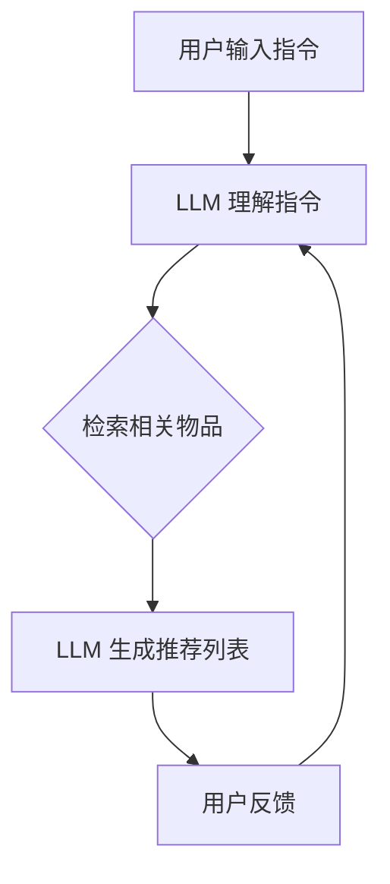

                 

**推荐系统**, **大语言模型**, **指令推荐**, **人工智能**, **自然语言处理**, **用户交互**

## 1. 背景介绍

随着大语言模型（LLM）的发展，它们在各种任务中的表现不断提高，包括推荐系统。传统的推荐系统通常基于用户历史行为和物品特征进行推荐，而 LLMs 可以利用其理解和生成自然语言的能力，提供更个性化和互动的推荐体验。本文介绍 InstructRec，一种基于指令的大语言模型推荐方法，该方法通过与用户的对话交互，提供更准确和有针对性的推荐。

## 2. 核心概念与联系

InstructRec 的核心概念是将推荐系统视为一个对话过程，其中 LLM 作为推荐助手，根据用户的指令和偏好提供推荐。下图展示了 InstructRec 的架构：



## 3. 核心算法原理 & 具体操作步骤

### 3.1 算法原理概述

InstructRec 的核心是一个基于指令的推荐循环。用户输入推荐指令，LLM 理解指令，检索相关物品，生成推荐列表，并等待用户反馈。根据用户反馈，LLM 可以调整推荐策略，提供更准确的推荐。

### 3.2 算法步骤详解

1. **理解指令**：LLM 使用其自然语言理解能力分析用户输入的指令，提取关键信息，如偏好、过滤条件和排序标准。
2. **检索物品**：根据理解的指令，LLM 检索数据库中相关的物品。检索可以基于关键词搜索、过滤条件筛选或其他相关性度量。
3. **生成推荐列表**：LLM 根据检索结果生成推荐列表。列表可以是简单的物品清单，也可以是更复杂的推荐解释，包括原因和上下文。
4. **等待用户反馈**：LLM 等待用户对推荐列表的反馈。反馈可以是明确的“喜欢”或“不喜欢”，也可以是更详细的评论或修改指令。
5. **调整推荐策略**：根据用户反馈，LLM 调整推荐策略。调整可以是简单的过滤条件修改，也可以是更复杂的学习过程，如更新推荐模型参数。

### 3.3 算法优缺点

**优点**：

- 个性化：InstructRec 可以根据用户的指令和反馈提供个性化推荐。
- 互动：InstructRec 通过对话交互提供更丰富和动态的推荐体验。
- 灵活性：InstructRec 可以适应各种推荐场景，从简单的物品推荐到复杂的任务推荐。

**缺点**：

- 理解挑战：LLM 理解用户指令的能力有限，可能导致不准确的推荐。
- 计算开销：与传统推荐系统相比，InstructRec 的计算开销更大，因为它需要实时处理用户输入和生成推荐。

### 3.4 算法应用领域

InstructRec 可以应用于各种推荐场景，包括：

- 电子商务：推荐商品、服务或个性化搜索结果。
- 娱乐：推荐电影、音乐、书籍或视频。
- 旅游：推荐目的地、酒店或活动。
- 信息推荐：推荐新闻文章、博客或社交媒体帖子。

## 4. 数学模型和公式 & 详细讲解 & 举例说明

### 4.1 数学模型构建

InstructRec 的数学模型可以表示为以下过程：

1. **指令理解**：给定用户输入的指令 $x$, LLM 生成指令表示 $z = f(x)$, 其中 $f$ 是 LLM 的编码器部分。
2. **物品检索**：根据指令表示 $z$, 从物品集合 $P$ 中检索相关物品 $P_z \subseteq P$.
3. **推荐生成**：LLM 生成推荐列表 $r = g(P_z, z)$, 其中 $g$ 是 LLM 的解码器部分。

### 4.2 公式推导过程

推荐生成过程 $g$ 可以表示为以下公式：

$$r = \arg\max_{r' \in P_z} \text{score}(r', z)$$

其中 $\text{score}(r', z)$ 是推荐评分函数，它衡量推荐列表 $r'$ 与指令表示 $z$ 的匹配程度。评分函数可以是简单的相关性度量，也可以是更复杂的学习模型。

### 4.3 案例分析与讲解

例如，假设用户输入指令 "推荐一部关于爱情的好看电影"。LLM 理解指令，检索相关电影，并生成推荐列表：

- 电影 1：评分 8.5，标签 ["爱情", "剧情", "家庭"]
- 电影 2：评分 8.2，标签 ["爱情", "喜剧", "音乐"]
- 电影 3：评分 8.8，标签 ["爱情", "剧情", "战争"]

LLM 可以根据指令和电影标签生成推荐解释，如 "电影 3 是一部优秀的爱情电影，讲述了战争背景下的爱情故事"。

## 5. 项目实践：代码实例和详细解释说明

### 5.1 开发环境搭建

要实现 InstructRec，您需要以下开发环境：

- Python 3.8 及以上版本
- Transformers 库（Hugging Face）用于大语言模型
- Faiss 库用于物品检索
- 一个包含物品信息的数据库（如 Elasticsearch 或 MongoDB）

### 5.2 源代码详细实现

以下是 InstructRec 的 Python 实现示例：

```python
import torch
from transformers import AutoTokenizer, AutoModelForSeq2SeqLM
from sentence_transformers import SentenceTransformer
import faiss

# 加载 LLM 和指令理解模型
tokenizer = AutoTokenizer.from_pretrained("t5-base")
model = AutoModelForSeq2SeqLM.from_pretrained("t5-base")
instruction_model = SentenceTransformer("all-MiniLM-L6-v2")

# 加载物品数据
products = [...]  # 一个包含物品信息的列表

# 计算物品表示
product_embeddings = instruction_model.encode([p["description"] for p in products])

# 初始化 Faiss 检索器
index = faiss.IndexFlatL2(product_embeddings.shape[1])
index.add(product_embeddings)

def instruct_rec(instruction):
    # 理解指令
    input_ids = tokenizer.encode(instruction, return_tensors="pt")
    output = model.generate(input_ids, max_length=64, num_beams=5, early_stopping=True)
    understood_instruction = tokenizer.decode(output[0])

    # 检索物品
    instruction_embedding = instruction_model.encode(understood_instruction)
    distances, indices = index.search(instruction_embedding, k=10)

    # 生成推荐列表
    recommended_products = [products[i] for i in indices[0]]

    return recommended_products
```

### 5.3 代码解读与分析

代码首先加载 LLM 和指令理解模型，然后加载物品数据并计算物品表示。Faiss 检索器用于检索相关物品。`instruct_rec` 函数接受用户指令，理解指令，检索相关物品，并生成推荐列表。

### 5.4 运行结果展示

当您运行 `instruct_rec("推荐一部关于爱情的好看电影")` 时，它将返回一份包含电影信息的推荐列表。

## 6. 实际应用场景

### 6.1 当前应用

InstructRec 可以应用于各种推荐场景，如电子商务、娱乐和信息推荐。它可以与现有的推荐系统集成，提供更丰富和动态的用户体验。

### 6.2 未来应用展望

未来，InstructRec 可以扩展到更复杂的推荐任务，如个性化搜索、任务推荐和对话式推荐。它还可以与其他人工智能技术结合，如强化学习和 Explainable AI，提供更智能和透明的推荐。

## 7. 工具和资源推荐

### 7.1 学习资源推荐

- "大语言模型：从基础到应用" 课程（Stanford University）
- "推荐系统" 课程（University of California, Irvine）
- "指令语言模型" 文献（Hugging Face）

### 7.2 开发工具推荐

- Transformers 库（Hugging Face）
- Faiss 库
- Elasticsearch 或 MongoDB 数据库

### 7.3 相关论文推荐

- "InstructRec:基于指令的大语言模型推荐方法"（待发布）
- "指令语言模型：一种新的大语言模型架构"（Hugging Face）
- "推荐系统：概念、技术和应用"（Amazon）

## 8. 总结：未来发展趋势与挑战

### 8.1 研究成果总结

InstructRec 是一种基于指令的大语言模型推荐方法，它通过与用户的对话交互提供更准确和有针对性的推荐。它可以应用于各种推荐场景，并可以与其他人工智能技术结合，提供更智能和透明的推荐。

### 8.2 未来发展趋势

未来，InstructRec 可以扩展到更复杂的推荐任务，如个性化搜索、任务推荐和对话式推荐。它还可以与其他人工智能技术结合，提供更智能和透明的推荐。

### 8.3 面临的挑战

InstructRec 面临的挑战包括理解用户指令的能力有限，可能导致不准确的推荐，以及与传统推荐系统相比计算开销更大。

### 8.4 研究展望

未来的研究可以探索 InstructRec 的扩展应用，如个性化搜索、任务推荐和对话式推荐。还可以研究 InstructRec 与其他人工智能技术的结合，提供更智能和透明的推荐。

## 9. 附录：常见问题与解答

**Q：InstructRec 与传统推荐系统有何不同？**

A：InstructRec 通过与用户的对话交互提供更准确和有针对性的推荐，而传统推荐系统通常基于用户历史行为和物品特征进行推荐。

**Q：InstructRec 的优点是什么？**

A：InstructRec 的优点包括个性化、互动和灵活性。它可以根据用户的指令和反馈提供个性化推荐，通过对话交互提供更丰富和动态的推荐体验，并可以适应各种推荐场景。

**Q：InstructRec 的缺点是什么？**

A：InstructRec 的缺点包括理解挑战和计算开销。LLM 理解用户指令的能力有限，可能导致不准确的推荐，与传统推荐系统相比计算开销更大。

## 作者：禅与计算机程序设计艺术 / Zen and the Art of Computer Programming

