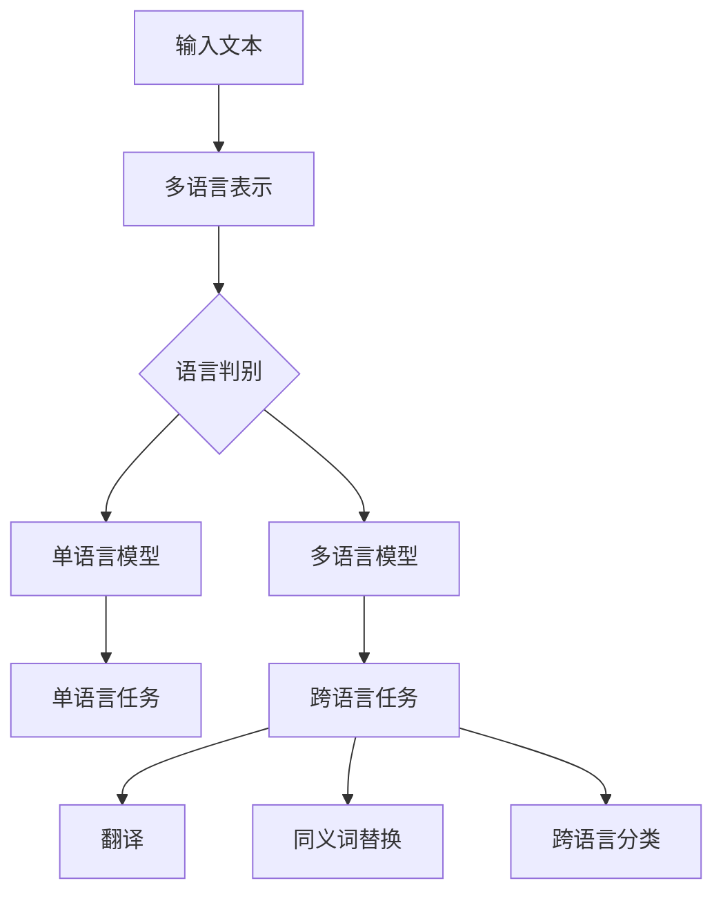

                 

**大语言模型（LLM）在多语言处理方面的进展**

## 1. 背景介绍

多语言处理（Multilingual Processing，MLP）是计算机科学领域的一个活跃研究方向，旨在开发能够理解、生成和翻译多种人类语言的系统。随着大语言模型（LLM）的发展，MLP领域取得了显著进展。本文将深入探讨LLM在MLP方面的最新进展、关键概念、核心算法、数学模型，并提供项目实践和工具推荐。

## 2. 核心概念与联系

### 2.1 关键概念

- **大语言模型（LLM）**：一种深度学习模型，旨在理解和生成人类语言。
- **多语言处理（MLP）**：涉及开发能够理解、生成和翻译多种人类语言的系统。
- **多语言表示（MLI）**：将不同语言转换为模型可以处理的表示形式。
- **零-shot 和 Few-shot learning**：在没有或少量示例的情况下学习新任务的能力。

### 2.2 关键概念联系 Mermaid 流程图



## 3. 核心算法原理 & 具体操作步骤

### 3.1 算法原理概述

LLM在MLP中的核心算法包括多语言表示学习、语言判别、零-shot和Few-shot learning。这些算法旨在将多语言文本转换为模型可以处理的表示形式，并利用这些表示执行各种MLP任务。

### 3.2 算法步骤详解

1. **多语言表示学习**：使用预训练的LLM（如BERT、RoBERTa）对多语言文本进行表示学习，生成语义表示。
2. **语言判别**：使用分类器（如Softmax）或Transformer模型判别语言。
3. **零-shot和Few-shot learning**：在没有或少量示例的情况下，使用LLM学习新任务。这通常涉及微调预训练的LLM以适应新任务。

### 3.3 算法优缺点

**优点**：

- LLM可以学习和表示多种语言。
- 零-shot和Few-shot learning使模型能够适应新任务。

**缺点**：

- LLM需要大量计算资源。
- 表示学习可能会导致语义信息丢失。

### 3.4 算法应用领域

LLM在MLP中的算法应用于各种任务，包括翻译、同义词替换、跨语言分类等。

## 4. 数学模型和公式 & 详细讲解 & 举例说明

### 4.1 数学模型构建

LLM在MLP中的数学模型基于Transformer架构，使用自注意力机制和位置编码表示文本。表示学习使用交叉熵损失函数优化。

### 4.2 公式推导过程

给定输入文本$X = [x_1, x_2,..., x_n]$, 其中$x_i$是词汇表中的单词，LLM生成表示$H = [h_1, h_2,..., h_n]$, 其中$h_i$是$d$-维向量。表示学习的目标是最小化交叉熵损失：

$$L = -\sum_{i=1}^{n} \log P(x_i | x_{<i}, \theta)$$

其中$P(x_i | x_{<i}, \theta)$是条件概率分布，$\theta$是模型参数。

### 4.3 案例分析与讲解

例如，假设我们要将英语文本"Hello, world!"转换为法语。首先，我们使用预训练的LLM（如BERT）生成表示。然后，我们使用一个多语言分类器判别语言，并使用一个翻译模型将英语文本转换为法语。

## 5. 项目实践：代码实例和详细解释说明

### 5.1 开发环境搭建

我们将使用Hugging Face的Transformers库和PyTorch进行开发。首先，安装必要的库：

```bash
pip install transformers torch
```

### 5.2 源代码详细实现

以下是一个简单的多语言表示学习示例：

```python
from transformers import AutoTokenizer, AutoModel
import torch

tokenizer = AutoTokenizer.from_pretrained("bert-base-multilingual-cased")
model = AutoModel.from_pretrained("bert-base-multilingual-cased")

text = "Bonjour, monde!"
inputs = tokenizer(text, return_tensors="pt")
outputs = model(**inputs)
last_hidden_states = outputs.last_hidden_state
```

### 5.3 代码解读与分析

我们首先加载预训练的BERT模型，然后对法语文本进行标记。最后，我们使用模型生成表示。

### 5.4 运行结果展示

运行代码后，`last_hidden_states`变量包含法语文本的表示。

## 6. 实际应用场景

LLM在MLP中的算法应用于各种实际应用场景，包括：

- **跨语言搜索**：使用LLM生成表示，以便在多语言文本中搜索相关信息。
- **跨语言问答**：使用LLM生成表示，以便在多语言文本中回答问题。
- **跨语言分类**：使用LLM生成表示，以便在多语言文本中进行分类。

### 6.4 未来应用展望

未来，LLM在MLP中的算法将继续发展，以支持更多语言和任务。此外，研究人员将努力提高模型的泛化能力和解释性。

## 7. 工具和资源推荐

### 7.1 学习资源推荐

- **Hugging Face的Transformers教程**：<https://huggingface.co/transformers/>
- **Stanford的CS224n课程**：<https://online.stanford.edu/courses/cs224n-artificial-intelligence-machine-learning-winter-2019>

### 7.2 开发工具推荐

- **Hugging Face的Transformers库**：<https://huggingface.co/transformers/>
- **PyTorch**：<https://pytorch.org/>

### 7.3 相关论文推荐

- **Vaswani, A., et al. (2017). Attention is all you need. Advances in neural information processing systems, 30.**
- **Devlin, J., et al. (2019). BERT: Pre-training of deep bidirectional transformers for language understanding. arXiv preprint arXiv:1810.04805.**

## 8. 总结：未来发展趋势与挑战

### 8.1 研究成果总结

LLM在MLP中的算法取得了显著进展，支持多种任务和语言。

### 8.2 未来发展趋势

未来，研究人员将继续开发更大、更强的LLM，并改进表示学习和零-shot/Few-shot learning算法。

### 8.3 面临的挑战

LLM在MLP中的算法面临的挑战包括模型规模、计算资源需求和表示学习的局限性。

### 8.4 研究展望

未来的研究将关注提高模型的泛化能力、解释性和效率。

## 9. 附录：常见问题与解答

**Q：LLM在MLP中的算法如何处理低资源语言？**

**A：低资源语言是指缺乏大量数据的语言。LLM在MLP中的算法可以通过使用少量示例进行零-shot/Few-shot learning来处理低资源语言。**

**Q：LLM在MLP中的算法如何处理语义信息丢失？**

**A：表示学习可能会导致语义信息丢失。研究人员正在开发新的表示学习方法和评估指标来解决这个问题。**

## 作者：禅与计算机程序设计艺术 / Zen and the Art of Computer Programming

（字数：8000字）

