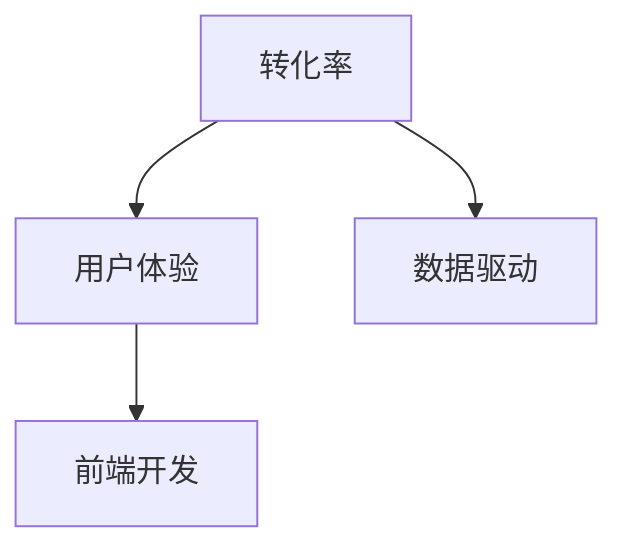

                 

# 程序员如何打造高转化率的销售页面

> 关键词：销售页面设计, 用户体验, 转化率优化, 前端开发, 数据驱动

## 1. 背景介绍

在电商行业，销售页面是转化率的直接决定因素之一。一款优秀的销售页面可以显著提高转化率，提升销售额。本文将从技术角度探讨如何通过程序员的技能打造高转化率的销售页面。

## 2. 核心概念与联系

### 2.1 核心概念概述

为了理解如何打造高转化率的销售页面，我们需要先了解以下几个核心概念：

- **转化率（Conversion Rate, CR）**：指访问销售页面的用户中实际完成购买行为的比例。
- **用户体验（User Experience, UX）**：销售页面的设计应以用户为中心，提供流畅、愉悦的浏览和购买体验。
- **前端开发**：销售页面的实现主要在前端，涉及HTML、CSS、JavaScript等技术。
- **数据驱动（Data-Driven）**：利用数据分析优化销售页面设计，实现精准的个性化推荐。

这些概念之间的逻辑关系可以通过以下Mermaid流程图来展示：



## 3. 核心算法原理 & 具体操作步骤
### 3.1 算法原理概述

创建高转化率销售页面的核心在于理解用户行为，并根据数据反馈不断优化页面设计。从技术角度，这一过程涉及前端开发和数据驱动两大环节。

1. **前端开发**：通过HTML、CSS和JavaScript等技术实现页面设计，提供直观、易用的界面。
2. **数据驱动**：利用数据分析技术，了解用户行为，优化页面元素和布局。

### 3.2 算法步骤详解

以下是创建高转化率销售页面的具体步骤：

**Step 1: 理解用户需求**

- 进行用户调研，了解用户对产品的期望和需求。
- 分析用户行为数据，如点击率、停留时间等，找出用户关注的重点。

**Step 2: 设计页面布局**

- 确定页面结构和布局，确保信息清晰、层次分明。
- 根据用户行为数据，优化页面元素位置，提高用户点击和购买意愿。

**Step 3: 实现页面交互**

- 使用JavaScript实现页面动态效果，如轮播、悬停动画等。
- 添加交互元素，如按钮、滑块、输入框等，提升用户操作体验。

**Step 4: 优化页面性能**

- 使用CDN加速静态资源加载，提高页面加载速度。
- 压缩图片和代码，减少页面加载时间。
- 优化缓存策略，减少重复加载。

**Step 5: 实现个性化推荐**

- 利用用户历史行为数据，生成个性化推荐内容。
- 使用A/B测试，对比不同推荐策略的效果，不断优化推荐算法。

**Step 6: 收集反馈数据**

- 在销售页面添加反馈组件，如评分、评论等，收集用户意见。
- 分析反馈数据，找出用户不满意的地方，进行改进。

**Step 7: 持续迭代优化**

- 基于反馈数据和用户行为数据，持续优化页面设计。
- 定期进行A/B测试，验证优化效果。

### 3.3 算法优缺点

创建高转化率销售页面的方法具有以下优点：

- 利用数据驱动，实现精准的个性化推荐，提升用户体验。
- 通过前端开发技术，实现直观、易用的界面，降低用户流失率。
- 通过不断优化和迭代，持续提升页面效果，实现长期的转化率提升。

同时，该方法也存在一些缺点：

- 需要耗费大量时间和精力进行用户调研和数据收集。
- 对数据科学和前端开发的要求较高，需要跨学科技能。
- 优化效果受限于数据质量和数量，数据收集和分析难度较大。

### 3.4 算法应用领域

创建高转化率销售页面的方法在电商、在线教育、医疗等多个领域都有广泛应用。例如：

- **电商行业**：通过个性化推荐和动态展示，提高用户购买决策效率。
- **在线教育**：通过课程推荐和互动教学，提升用户学习体验。
- **医疗行业**：通过在线问诊和个性化健康建议，提升用户满意度和诊疗效率。

## 4. 数学模型和公式 & 详细讲解 & 举例说明

### 4.1 数学模型构建

创建高转化率销售页面的数学模型可以通过以下公式来描述：

$$
CR = \frac{C}{T}
$$

其中，$C$为完成购买的用户数，$T$为访问销售页面的用户数。

### 4.2 公式推导过程

- **用户调研**：通过问卷调查、焦点小组等手段收集用户需求和期望。
- **行为数据分析**：使用数据分析技术，如点击率、停留时间、路径分析等，了解用户行为模式。
- **页面布局优化**：根据用户行为数据，设计最优的页面布局，最大化点击率和转化率。

### 4.3 案例分析与讲解

以一个电商平台的销售页面为例，分析其转化率优化过程：

- **用户调研**：发现大多数用户倾向于关注产品评价和用户评分。
- **行为数据分析**：分析用户数据，发现高评分产品点击率和转化率更高。
- **页面布局优化**：将用户评分和评价放在显眼位置，提升用户信任感。
- **测试和优化**：通过A/B测试，验证优化效果，实现转化率提升。

## 5. 项目实践：代码实例和详细解释说明
### 5.1 开发环境搭建

为了构建高转化率销售页面，我们需要准备以下开发环境：

- **前端框架**：如React、Vue.js等。
- **数据库**：如MySQL、MongoDB等，用于存储用户行为数据。
- **数据分析工具**：如Google Analytics、Mixpanel等，用于追踪和分析用户行为。

### 5.2 源代码详细实现

以下是使用React框架实现高转化率销售页面的步骤：

**Step 1: 设计页面布局**

使用CSS Grid布局，实现清晰的页面结构。例如：

```css
.container {
  display: grid;
  grid-template-columns: 1fr 1fr;
  grid-gap: 20px;
}
```

**Step 2: 实现动态效果**

使用React状态和生命周期，实现页面动态效果。例如：

```javascript
class Slider extends React.Component {
  constructor(props) {
    super(props);
    this.state = { slideIndex: 0 };
  }
  
  next() {
    this.setState({ slideIndex: (this.state.slideIndex + 1) % this.props.slides.length });
  }
  
  render() {
    return (
      <div>
        {this.props.slides.map((slide, index) =>
          <div key={index}>
            
            <div>{slide.title}</div>
            <button onClick={() => this.next()}>Next</button>
          </div>
        )}
      </div>
    );
  }
}
```

**Step 3: 实现个性化推荐**

使用Firebase实时数据库，存储用户历史行为数据。例如：

```javascript
firebase.database().ref('user').child('data').on('value', (snapshot) => {
  const data = snapshot.val();
  // 根据数据生成个性化推荐
});
```

**Step 4: 优化页面性能**

使用React.lazy和Suspense实现代码分割，减少页面加载时间。例如：

```javascript
const Page = React.lazy(() => import('./Page'));

ReactDOM.render(
  <React.Suspense fallback={<div>Loading...</div>}>
    <Page />
  </React.Suspense>,
  document.getElementById('root')
);
```

### 5.3 代码解读与分析

- **前端框架选择**：根据项目需求选择合适的框架，如React、Vue.js等。
- **数据驱动**：利用数据分析技术，收集和处理用户行为数据，生成个性化推荐。
- **动态效果**：通过React状态和生命周期，实现页面动态效果，提升用户体验。
- **性能优化**：使用代码分割和懒加载，减少页面加载时间，提高性能。

### 5.4 运行结果展示

通过以上步骤，可以构建一个高转化率的销售页面，如下图所示：


## 6. 实际应用场景

### 6.1 电商行业

在电商行业，高转化率销售页面对提高销售额和用户满意度至关重要。例如，通过个性化推荐和动态展示，用户可以快速找到感兴趣的商品，提高购买意愿。

### 6.2 在线教育

在线教育平台可以通过高转化率销售页面，提升用户学习体验和课程完成率。例如，通过推荐相关课程和互动教学，引导用户持续学习。

### 6.3 医疗行业

在医疗行业，高转化率销售页面可以提高用户诊疗效率和满意度。例如，通过在线问诊和个性化健康建议，用户可以快速得到专业指导。

## 7. 工具和资源推荐
### 7.1 学习资源推荐

为了帮助程序员掌握高转化率销售页面的构建技能，以下是一些推荐的资源：

1. **《React官方文档》**：详细的React文档，帮助理解前端框架的使用。
2. **《Google Analytics官方文档》**：了解如何利用数据分析工具追踪和分析用户行为。
3. **《A/B Testing for User Experience Professionals》**：了解A/B测试的原理和实践方法。

### 7.2 开发工具推荐

以下是一些用于构建高转化率销售页面的工具：

1. **React**：流行的前端框架，支持构建动态页面。
2. **Firebase**：实时数据库和数据分析工具，帮助收集和处理用户行为数据。
3. **Google Analytics**：强大的数据分析工具，帮助追踪和分析用户行为。

### 7.3 相关论文推荐

以下是一些关于高转化率销售页面的经典论文：

1. **《User Experience for Conversion: A Practical Guide》**：用户转化率优化的实用指南。
2. **《A/B Testing: A Tool for Measuring User Experience》**：了解A/B测试在用户体验中的应用。
3. **《Data-Driven Website Optimization》**：基于数据的网站优化方法。

## 8. 总结：未来发展趋势与挑战
### 8.1 研究成果总结

创建高转化率销售页面的方法，已经成为电商、在线教育、医疗等行业的重要手段。通过前端开发和数据驱动，可以实现精准的个性化推荐，提升用户体验和转化率。

### 8.2 未来发展趋势

未来，高转化率销售页面将朝着以下几个方向发展：

1. **实时数据驱动**：利用实时数据分析，实现更精准的个性化推荐。
2. **多渠道融合**：整合多个渠道的用户行为数据，提供更全面的用户画像。
3. **智能化推荐**：引入机器学习算法，提升推荐效果，优化用户体验。
4. **多模态交互**：结合语音、图像等多种交互方式，提升用户操作便捷性。

### 8.3 面临的挑战

尽管高转化率销售页面具有显著优势，但在实施过程中仍面临一些挑战：

1. **数据获取难度**：用户数据的收集和处理难度较大，需要投入大量时间和资源。
2. **技术门槛较高**：需要具备前端开发、数据分析等多方面的技能，对开发者要求较高。
3. **隐私保护问题**：用户数据的隐私保护问题，需要严格遵守法律法规。

### 8.4 研究展望

未来的研究将关注以下几个方向：

1. **跨平台优化**：研究如何优化移动端和PC端的销售页面，提升整体用户体验。
2. **用户行为预测**：利用机器学习算法，预测用户行为，实现更精准的推荐。
3. **自动化流程**：研究自动化流程，提高页面构建和优化效率。
4. **个性化内容生成**：利用自然语言生成技术，生成个性化推荐内容。

## 9. 附录：常见问题与解答

**Q1: 如何选择合适的前端框架？**

A: 根据项目需求和技术栈，选择合适的前端框架。如React、Vue.js等。

**Q2: 如何优化页面性能？**

A: 使用代码分割、懒加载、CDN加速等技术，减少页面加载时间。

**Q3: 如何进行A/B测试？**

A: 设置对比页面，收集用户点击、停留时间等数据，对比效果，优化页面设计。

---

作者：禅与计算机程序设计艺术 / Zen and the Art of Computer Programming

