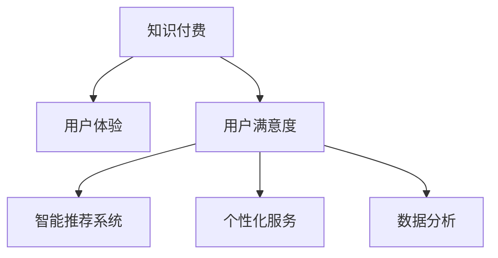

                 

# 程序员如何提高知识付费的用户满意度

> 关键词：知识付费, 用户体验, 用户满意度, 智能推荐系统, 个性化服务, 数据分析

## 1. 背景介绍

### 1.1 问题由来
在知识经济时代，知识付费逐渐成为人们获取新知识和技能的主要方式之一。然而，面对市场上种类繁多的知识产品和服务，如何吸引并留住付费用户，提升用户满意度，成为知识付费平台需要解决的核心问题。

### 1.2 问题核心关键点
用户满意度的提升涉及到用户体验的多个方面，包括但不限于知识产品内容的质量和实用性、支付流程的简便性和安全性、获取内容的便捷性、与课程互动的互动性、反馈机制的响应速度等。同时，不同用户群体（如新手、进阶用户、专家）的需求差异较大，如何针对不同用户提供个性化推荐和差异化服务，成为知识付费平台的关键挑战。

### 1.3 问题研究意义
提高知识付费用户满意度，不仅可以增强平台的竞争力和用户粘性，还能带动知识的传播和应用，推动社会的学习进步。通过技术手段优化用户体验，提升用户满意度，可以有效降低平台的运营成本，提升用户的支付意愿和频率。

## 2. 核心概念与联系

### 2.1 核心概念概述

为更好地理解如何提高知识付费的用户满意度，本节将介绍几个核心概念：

- 知识付费：指用户为获取知识和信息而支付费用的行为。知识付费平台通过在线课程、电子书、直播课程等形式，为用户提供有价值的知识内容。
- 用户体验：指用户在使用产品或服务过程中，对产品或服务的整体感知和情感体验。用户体验涉及界面设计、功能实现、交互流程等多个方面。
- 用户满意度：指用户对产品或服务的总体满意度，通常通过用户反馈、评分、流失率等指标来衡量。
- 智能推荐系统：指利用机器学习和数据分析技术，根据用户行为和偏好，推荐用户可能感兴趣的知识产品和服务。
- 个性化服务：指根据用户特征和行为，定制个性化的知识产品和服务，满足用户的独特需求。
- 数据分析：指收集、整理、分析和应用用户数据，以优化产品和服务，提升用户体验和满意度。

这些核心概念之间的逻辑关系可以通过以下Mermaid流程图来展示：



这个流程图展示了一组关键概念及其之间的关系：

1. 知识付费提供内容基础，用户体验和满意度是该内容发挥价值的保障。
2. 智能推荐系统和个性化服务通过数据分析实现，目的是提升用户体验和满意度。
3. 数据分析是从用户行为中提取洞察，进一步优化用户体验和推荐效果的关键手段。

## 3. 核心算法原理 & 具体操作步骤

### 3.1 算法原理概述

为了提高知识付费的用户满意度，平台需要通过数据分析和智能推荐系统，个性化地提供用户所需的知识内容。具体来说，就是利用用户行为数据，构建用户画像，基于用户画像和知识内容特征，推荐用户可能感兴趣的内容，并不断优化推荐算法，提升推荐效果。

这一过程涉及到以下几个关键步骤：

1. 数据收集：收集用户的行为数据，如浏览、购买、评价、互动等。
2. 数据分析：通过数据挖掘和机器学习技术，构建用户画像，分析用户偏好和需求。
3. 智能推荐：利用推荐算法，基于用户画像和内容特征，推荐用户可能感兴趣的知识内容。
4. 效果评估：通过用户反馈和评分等指标，评估推荐效果，不断迭代优化推荐模型。

### 3.2 算法步骤详解

**Step 1: 数据收集**

知识付费平台需要收集尽可能丰富的用户数据，包括但不限于：

- 用户基本信息：如年龄、性别、职业等。
- 行为数据：如浏览记录、购买记录、评价记录、互动记录等。
- 上下文数据：如用户登录时间、设备类型、网络环境等。

这些数据可以通过API接口、数据存储、日志记录等方式进行收集。收集的数据需要确保匿名性、完整性和安全性。

**Step 2: 数据预处理**

数据预处理是数据分析和智能推荐的基础。需要以下步骤：

- 数据清洗：去除重复、错误、无效的数据。
- 特征工程：从原始数据中提取有意义的特征，如用户兴趣、内容主题、时间特征等。
- 数据归一化：将数据转换为标准化的格式，方便后续分析。

数据预处理可以使用Python的Pandas、NumPy等库完成。

**Step 3: 用户画像构建**

用户画像是指根据用户数据，构建用户的个性化标签和特征。通过用户画像，平台可以更好地了解用户需求，提供个性化服务。

- 特征提取：通过统计、文本挖掘等方法，提取用户的行为特征和兴趣特征。
- 标签建模：将用户特征映射到预定义的标签上，如"编程新手"、"数据分析专家"等。
- 画像更新：定期更新用户画像，确保其最新性和准确性。

用户画像构建可以使用Python的Scikit-learn、TensorFlow等库完成。

**Step 4: 智能推荐算法**

推荐算法是智能推荐系统的核心。常用的推荐算法包括基于协同过滤、基于内容的推荐、基于矩阵分解的推荐等。

- 协同过滤：通过分析用户和物品之间的相似度，推荐用户可能感兴趣的物品。
- 基于内容的推荐：根据物品的内容特征，推荐用户可能感兴趣的物品。
- 基于矩阵分解的推荐：通过分解用户-物品评分矩阵，预测用户对物品的评分，推荐评分高的物品。

推荐算法可以使用Python的Scikit-learn、TensorFlow等库完成。

**Step 5: 效果评估与优化**

推荐效果评估和优化是提升推荐系统准确性和用户体验的关键。需要以下步骤：

- 评估指标：使用准确率、召回率、F1值等指标评估推荐效果。
- 模型优化：根据评估结果，调整模型参数，优化推荐算法。
- 用户反馈：收集用户反馈，分析推荐效果，不断迭代优化推荐模型。

效果评估和优化可以使用Python的Scikit-learn、TensorFlow等库完成。

### 3.3 算法优缺点

智能推荐系统在提升知识付费用户满意度方面具有以下优点：

- 个性化推荐：根据用户特征和行为，提供个性化推荐，提升用户体验和满意度。
- 减少信息过载：通过推荐系统过滤掉无关信息，减少用户获取新知识时的信息过载。
- 提升用户粘性：通过推荐用户感兴趣的内容，提升用户使用频率和粘性。

同时，智能推荐系统也存在以下局限性：

- 数据隐私：收集和分析用户数据可能涉及用户隐私问题，需要确保数据的匿名性和安全性。
- 算法偏见：推荐算法可能存在偏见，导致某些用户群体被忽视，需要定期监控和调整算法。
- 复杂度：推荐算法通常较为复杂，需要大量的计算资源和时间。

尽管存在这些局限性，但就目前而言，智能推荐系统仍是大数据时代提升知识付费用户满意度的重要手段。未来相关研究的重点在于如何进一步降低推荐算法的计算复杂度，提高推荐效果，同时兼顾隐私保护和算法公平性等因素。

### 3.4 算法应用领域

智能推荐系统在知识付费领域已经得到了广泛的应用，涵盖了几乎所有常见任务，例如：

- 课程推荐：根据用户历史浏览、购买记录，推荐可能感兴趣的新课程。
- 电子书推荐：根据用户阅读偏好，推荐相关领域的新电子书。
- 直播课程推荐：根据用户观看历史，推荐相关主题的直播课程。
- 学习路径推荐：根据用户学习进度和需求，推荐适合的学习路径和课程。

除了上述这些经典任务外，智能推荐系统也被创新性地应用到更多场景中，如广告推荐、个性化资讯推荐等，为知识付费平台带来了更多的用户粘性和收益。

## 4. 数学模型和公式 & 详细讲解

### 4.1 数学模型构建

本节将使用数学语言对智能推荐系统进行更加严格的刻画。

记知识付费平台的用户集合为 $U$，课程集合为 $I$，用户行为数据为 $D$。用户行为数据可以表示为用户对课程的评分 $R \in \mathbb{R}^{U \times I}$，其中 $R_{ui}$ 表示用户 $u$ 对课程 $i$ 的评分。

定义用户画像特征为 $F \in \mathbb{R}^n$，其中 $n$ 为特征维度。用户画像特征可以包括用户基本信息、行为数据、上下文数据等。

定义课程内容特征为 $I \in \mathbb{R}^m$，其中 $m$ 为内容特征维度。课程内容特征可以包括课程主题、难度、时长等。

智能推荐系统的目标是为每个用户推荐评分最高的 $K$ 门课程，即最大化目标函数：

$$
\max_{R} \sum_{u=1}^{|U|} \sum_{i=1}^{|I|} R_{ui} \cdot I_i
$$

其中 $|U|$ 和 $|I|$ 分别表示用户集合和课程集合的大小。

### 4.2 公式推导过程

以下我们以协同过滤算法为例，推导推荐系统的评分预测公式及其优化目标。

假设用户 $u$ 对课程 $i$ 的评分 $r_{ui}$ 是一个固定值，已知用户 $u$ 的历史评分数据 $R_{u[:]}$ 和用户 $v$ 的历史评分数据 $R_{v[:]}$。协同过滤算法的目标是预测用户 $u$ 对课程 $i$ 的评分，可以使用基于用户 $v$ 的评分数据进行加权平均，即：

$$
\hat{r}_{ui} = \frac{1}{\sum_{j=1}^{|I|} R_{vj}^2} \sum_{j=1}^{|I|} R_{vj} \cdot R_{ij}
$$

其中 $R_{vj}$ 表示用户 $v$ 对课程 $j$ 的评分。

基于上述评分预测公式，目标函数可以表示为：

$$
\min_{R} \sum_{u=1}^{|U|} \sum_{i=1}^{|I|} (\hat{r}_{ui} - r_{ui})^2
$$

最小化目标函数即为协同过滤算法的优化目标。

### 4.3 案例分析与讲解

**案例分析：推荐课程示例**

假设用户 $u$ 对课程 $i$ 的评分为 $r_{ui}$，用户 $v$ 的历史评分数据为 $R_{v[:]}$。通过协同过滤算法，计算用户 $u$ 对课程 $i$ 的预测评分 $\hat{r}_{ui}$。

**讲解：**

1. 收集用户 $u$ 和用户 $v$ 的历史评分数据 $R_{u[:]}$ 和 $R_{v[:]}$。
2. 计算用户 $v$ 对课程 $j$ 的评分向量 $R_{v[:]}$ 的平方和 $||R_{v[:]}||^2 = \sum_{j=1}^{|I|} R_{vj}^2$。
3. 计算用户 $u$ 对课程 $i$ 的预测评分 $\hat{r}_{ui}$。
4. 使用目标函数最小化预测误差，优化推荐算法。

## 5. 项目实践：代码实例和详细解释说明

### 5.1 开发环境搭建

在进行推荐系统开发前，我们需要准备好开发环境。以下是使用Python进行TensorFlow开发的环境配置流程：

1. 安装Anaconda：从官网下载并安装Anaconda，用于创建独立的Python环境。

2. 创建并激活虚拟环境：
```bash
conda create -n tf-env python=3.8 
conda activate tf-env
```

3. 安装TensorFlow：根据CUDA版本，从官网获取对应的安装命令。例如：
```bash
conda install tensorflow=2.6.0
```

4. 安装Scikit-learn、Pandas等工具包：
```bash
pip install scikit-learn pandas numpy matplotlib
```

完成上述步骤后，即可在`tf-env`环境中开始推荐系统开发。

### 5.2 源代码详细实现

我们以协同过滤算法为例，实现一个简单的推荐系统。

首先，定义用户和课程的数据结构：

```python
import pandas as pd
import numpy as np
from sklearn.model_selection import train_test_split

# 加载用户-课程评分数据
data = pd.read_csv('user_item_ratings.csv')
user_ids = data['user_id'].tolist()
course_ids = data['course_id'].tolist()
ratings = data['rating'].tolist()

# 加载用户画像特征数据
user_profiles = pd.read_csv('user_profiles.csv')
user_features = user_profiles['features'].tolist()

# 加载课程内容特征数据
course_features = pd.read_csv('course_features.csv')
course_info = course_features['info'].tolist()

# 定义用户和课程的评分矩阵
R = np.zeros((len(user_ids), len(course_ids)))
for i, user_id in enumerate(user_ids):
    for j, course_id in enumerate(course_ids):
        R[i, j] = ratings[i*len(course_ids) + j]

# 定义用户画像特征向量
F = np.array(user_features)

# 定义课程内容特征向量
I = np.array(course_info)
```

然后，定义协同过滤算法的评分预测函数：

```python
def collaborative_filtering_prediction(R, F, I, user_id, course_id):
    user_scores = []
    for u in range(len(user_ids)):
        if u != user_id:
            user_ratings = R[u]
            similarity = np.dot(F[user_id] - np.mean(F), F[u] - np.mean(F))
            weights = np.array([similarity / np.dot(F[u] - np.mean(F), F[v] - np.mean(F)) for v in range(len(user_ids))])
            weights /= np.sum(weights)
            user_scores.append(np.dot(R[u] * weights, I))
    return np.max(user_scores)
```

接着，定义推荐函数：

```python
def recommend_courses(R, F, I, user_id, num_courses):
    scores = np.zeros(len(course_ids))
    for i, course_id in enumerate(course_ids):
        scores[i] = collaborative_filtering_prediction(R, F, I, user_id, course_id)
    top_courses = np.argsort(scores)[-num_courses:]
    return course_ids[top_courses]
```

最后，启动推荐流程：

```python
user_id = 12345
num_courses = 5
recommended_courses = recommend_courses(R, F, I, user_id, num_courses)
print(recommended_courses)
```

以上就是使用Python实现协同过滤算法的简单代码实现。可以看到，Python结合TensorFlow等工具，可以快速迭代研究和开发推荐系统。

### 5.3 代码解读与分析

让我们再详细解读一下关键代码的实现细节：

**用户和课程数据处理**：
- `data.read_csv()`：加载用户-课程评分数据，构建评分矩阵 $R$。
- `user_profiles.read_csv()`：加载用户画像特征数据，构建特征向量 $F$。
- `course_features.read_csv()`：加载课程内容特征数据，构建特征向量 $I$。

**评分预测函数**：
- `collaborative_filtering_prediction()`：计算用户 $u$ 对课程 $i$ 的评分预测值。
- `np.dot()`：计算两个向量之间的点积。
- `np.mean()`：计算向量的平均值。

**推荐函数**：
- `recommend_courses()`：根据评分预测函数，计算用户 $u$ 对所有课程的评分，并排序选取评分最高的课程推荐给用户。
- `np.argsort()`：对评分数组进行排序，返回对应的课程索引。

**推荐流程**：
- `user_id`：指定推荐用户ID。
- `num_courses`：指定推荐课程数量。
- `recommend_courses()`：调用推荐函数，获取推荐课程列表。
- `print()`：输出推荐课程列表。

可以看到，Python结合TensorFlow等工具，可以快速实现协同过滤算法的推荐系统，且代码结构清晰、易于理解和维护。

当然，工业级的系统实现还需考虑更多因素，如模型的保存和部署、超参数的自动搜索、更灵活的任务适配层等。但核心的推荐算法基本与此类似。

## 6. 实际应用场景

### 6.1 智能课程推荐

在知识付费平台上，智能推荐系统可以用于推荐用户感兴趣的新课程。通过收集用户的历史浏览、购买、评价等行为数据，智能推荐系统可以分析用户的学习偏好，预测其可能感兴趣的新课程。

在技术实现上，可以构建用户画像和课程特征向量，使用协同过滤算法或基于内容的推荐算法，生成推荐结果。通过调用API接口，将推荐结果展示给用户，提升其使用频率和满意度。

### 6.2 个性化学习路径

智能推荐系统不仅可以推荐课程，还可以根据用户的学习进度和需求，推荐适合的学习路径和课程。通过分析用户的学习行为和评分数据，智能推荐系统可以构建用户的学习路径，推荐下一阶段的学习内容，提升学习效率和效果。

在技术实现上，可以构建用户的学习路径模型，使用协同过滤算法或基于路径的推荐算法，生成推荐结果。通过API接口，将推荐结果展示给用户，帮助其制定和调整学习路径。

### 6.3 广告推荐

智能推荐系统还可以用于推荐广告内容。通过分析用户的浏览和互动行为数据，智能推荐系统可以识别用户的兴趣和需求，推荐相关主题的广告内容，提升广告的点击率和转化率。

在技术实现上，可以构建用户的兴趣特征，使用协同过滤算法或基于广告的推荐算法，生成推荐结果。通过API接口，将推荐结果展示给用户，增加广告曝光率和广告收入。

### 6.4 未来应用展望

随着智能推荐系统的发展，未来的应用场景将更加广泛和深入。例如：

- 智能问答：通过分析用户的问题，智能推荐系统可以推荐合适的答案和相关内容，提升用户的学习效果。
- 智能笔记：智能推荐系统可以推荐用户常用的笔记模板和格式，提升用户的学习效率和质量。
- 智能应用：智能推荐系统可以推荐用户感兴趣的应用，拓展其知识领域和技能。
- 智能视频：智能推荐系统可以推荐用户感兴趣的视频内容和视频学习路径，提升用户的学习效果和体验。

总之，智能推荐系统将广泛应用于知识付费平台的各种场景中，提升用户满意度和平台收益，推动知识经济的发展。

## 7. 工具和资源推荐

### 7.1 学习资源推荐

为了帮助开发者系统掌握智能推荐系统的理论基础和实践技巧，这里推荐一些优质的学习资源：

1. 《推荐系统》书籍：由图书出版社出版的推荐系统经典教材，深入浅出地介绍了推荐系统的理论基础、算法实现和应用案例。
2. Coursera《推荐系统》课程：由斯坦福大学开设的推荐系统课程，有Lecture视频和配套作业，带你入门推荐系统领域的基本概念和经典模型。
3 Kaggle《推荐系统竞赛》：Kaggle平台上的推荐系统竞赛，通过实战提升推荐系统的设计和优化能力。
4 Scikit-learn官方文档：Scikit-learn库的官方文档，提供了丰富的推荐系统样例代码和详细解释。
5 TensorFlow官方文档：TensorFlow库的官方文档，提供了完整的推荐系统开发流程和工具支持。

通过对这些资源的学习实践，相信你一定能够快速掌握智能推荐系统的精髓，并用于解决实际的推荐问题。

### 7.2 开发工具推荐

高效的开发离不开优秀的工具支持。以下是几款用于推荐系统开发的常用工具：

1. Python：Python语言语法简洁，生态丰富，适合推荐系统的开发和研究。
2. TensorFlow：Google主导开发的深度学习框架，生产部署方便，适合大规模工程应用。
3. Scikit-learn：Python的机器学习库，提供丰富的推荐算法实现和工具支持。
4. Pandas：Python的数据分析库，提供高效的数据处理和分析功能。
5. NumPy：Python的数学库，提供高效的数组和矩阵运算功能。
6. Jupyter Notebook：开源的交互式编程环境，支持代码编写和结果展示。

合理利用这些工具，可以显著提升推荐系统的开发效率，加快创新迭代的步伐。

### 7.3 相关论文推荐

智能推荐系统的发展源于学界的持续研究。以下是几篇奠基性的相关论文，推荐阅读：

1. " collaborative filtering"：由Karger和Schmid.de在1988年提出的协同过滤算法，是推荐系统中的经典算法。
2. " item-based collaborative filtering"：由Sarwar等人在2000年提出的基于物品的协同过滤算法，进一步提升了协同过滤的准确性和效率。
3 " matrix factorization for recommender systems"：由Carselli等人在2007年提出的基于矩阵分解的推荐算法，在推荐精度和计算效率之间取得了新的平衡。
4 " deep collaborative filtering"：由Pawelec等人在2017年提出的深度协同过滤算法，利用深度学习提升协同过滤的推荐效果。

这些论文代表了大推荐系统的发展脉络。通过学习这些前沿成果，可以帮助研究者把握学科前进方向，激发更多的创新灵感。

## 8. 总结：未来发展趋势与挑战

### 8.1 总结

本文对智能推荐系统进行了全面系统的介绍。首先阐述了智能推荐系统在知识付费平台中的重要性和应用场景，明确了提升用户满意度的目标。其次，从原理到实践，详细讲解了推荐系统的数学模型和算法实现，给出了推荐任务开发的完整代码实例。同时，本文还广泛探讨了推荐系统在智能课程推荐、个性化学习路径、广告推荐等多个行业领域的应用前景，展示了推荐范式的巨大潜力。此外，本文精选了推荐技术的各类学习资源，力求为读者提供全方位的技术指引。

通过本文的系统梳理，可以看到，智能推荐系统在提升知识付费用户满意度方面具有广阔的应用前景，将极大地推动知识付费平台的成长和变革。同时，推荐系统面临的数据隐私、算法偏见、计算复杂度等挑战，也需要未来的研究者深入探索和解决。

### 8.2 未来发展趋势

展望未来，智能推荐系统将呈现以下几个发展趋势：

1. 个性化推荐算法：个性化推荐算法将不断进步，从传统的协同过滤、内容过滤等算法，拓展到基于深度学习、强化学习等高级算法。推荐系统将更加注重用户个性化需求和行为特征的建模，提升推荐效果。

2. 实时推荐系统：实时推荐系统将成为推荐系统的下一个发展方向。通过引入流式计算、在线学习等技术，实时分析和优化推荐算法，提升推荐效果和用户体验。

3. 跨平台推荐系统：跨平台推荐系统将成为智能推荐的新趋势。不同平台之间的数据共享和协同推荐，将进一步提升推荐效果和用户粘性。

4. 多模态推荐系统：多模态推荐系统将成为推荐系统的新热点。推荐系统将融合图像、音频、视频等多模态数据，提升推荐效果和用户满意度。

5. 可解释推荐系统：可解释推荐系统将成为推荐系统的新方向。推荐系统将提供推荐结果的解释和反馈机制，增强用户信任和满意度。

以上趋势凸显了智能推荐系统的广阔前景。这些方向的探索发展，将进一步提升推荐系统的精准性和用户体验，为知识付费平台带来更多的创新和价值。

### 8.3 面临的挑战

尽管智能推荐系统已经取得了瞩目成就，但在迈向更加智能化、普适化应用的过程中，它仍面临着诸多挑战：

1. 数据隐私：推荐系统需要收集和分析大量用户数据，可能涉及用户隐私问题，需要确保数据的匿名性和安全性。

2. 算法偏见：推荐算法可能存在偏见，导致某些用户群体被忽视，需要定期监控和调整算法。

3. 计算复杂度：推荐算法通常较为复杂，需要大量的计算资源和时间。如何在保证推荐效果的同时，减少计算复杂度，是未来的研究方向。

4. 效果评估：推荐系统的效果评估指标复杂多样，如何综合考虑各个指标，设计合理的评估体系，是未来的研究课题。

5. 用户反馈：用户反馈是推荐系统优化和改进的重要依据，但如何高效收集和分析用户反馈，提高推荐系统的适应性和灵活性，还需要进一步探索。

6. 系统鲁棒性：推荐系统面临多方面的攻击和干扰，如何提高系统的鲁棒性和稳定性，是未来的研究方向。

正视推荐系统面临的这些挑战，积极应对并寻求突破，将使推荐系统不断走向成熟和完善。相信随着学界和产业界的共同努力，推荐系统必将在未来的发展中取得更大的突破和进步。

### 8.4 研究展望

未来的研究需要在以下几个方面寻求新的突破：

1. 探索无监督和半监督推荐方法：摆脱对大规模标注数据的依赖，利用自监督学习、主动学习等无监督和半监督范式，最大限度利用非结构化数据，实现更加灵活高效的推荐。

2. 研究参数高效和计算高效的推荐范式：开发更加参数高效的推荐方法，在固定大部分预训练参数的同时，只更新极少量的任务相关参数。同时优化推荐模型的计算图，减少前向传播和反向传播的资源消耗，实现更加轻量级、实时性的部署。

3. 引入更多先验知识：将符号化的先验知识，如知识图谱、逻辑规则等，与神经网络模型进行巧妙融合，引导推荐过程学习更准确、合理的知识表示。同时加强不同模态数据的整合，实现视觉、语音等多模态信息与文本信息的协同建模。

4. 结合因果分析和博弈论工具：将因果分析方法引入推荐模型，识别出推荐决策的关键特征，增强输出解释的因果性和逻辑性。借助博弈论工具刻画人机交互过程，主动探索并规避推荐模型的脆弱点，提高系统稳定性。

5. 纳入伦理道德约束：在推荐目标中引入伦理导向的评估指标，过滤和惩罚有偏见、有害的推荐结果。同时加强人工干预和审核，建立推荐行为的监管机制，确保推荐内容符合人类价值观和伦理道德。

这些研究方向的探索，将引领智能推荐系统走向更高的台阶，为构建安全、可靠、可解释、可控的智能推荐系统铺平道路。面向未来，智能推荐技术还需要与其他人工智能技术进行更深入的融合，如知识表示、因果推理、强化学习等，多路径协同发力，共同推动智能推荐系统的进步。只有勇于创新、敢于突破，才能不断拓展推荐系统的边界，让智能技术更好地造福人类社会。

## 9. 附录：常见问题与解答

**Q1：智能推荐系统如何应对用户行为变化？**

A: 智能推荐系统需要持续收集和分析用户行为数据，及时更新用户画像和推荐模型。具体方法包括：
1. 实时数据收集：通过API接口、日志记录等方式，实时收集用户行为数据。
2. 定期更新模型：根据收集到的数据，定期更新推荐模型，确保其最新性和准确性。
3. 动态调整参数：根据用户行为变化，动态调整推荐算法的参数，提升推荐效果。

**Q2：智能推荐系统如何避免过拟合？**

A: 智能推荐系统需要避免在训练集上过拟合，常见方法包括：
1. 数据增强：通过引入噪声、随机变换等方式扩充训练集，减少过拟合风险。
2. 正则化：使用L2正则、Dropout等技术，限制模型复杂度，减少过拟合。
3. 交叉验证：使用交叉验证等方法，评估模型在多个数据集上的泛化能力，避免过拟合。
4. 对抗训练：引入对抗样本，提高模型的鲁棒性，减少过拟合风险。

**Q3：智能推荐系统如何提升推荐效果？**

A: 提升推荐效果需要综合考虑多个因素：
1. 数据质量：确保数据的完整性和准确性，避免数据偏差。
2. 特征工程：优化特征提取和特征选择，提高特征质量。
3. 模型选择：选择合适的推荐算法，并根据数据特点进行调整。
4. 参数调优：通过网格搜索、随机搜索等方法，优化模型参数，提升推荐效果。
5. 模型融合：使用集成学习等方法，将多个模型融合，提升推荐效果。

**Q4：智能推荐系统如何提升用户满意度？**

A: 提升用户满意度需要从多个方面进行优化：
1. 内容质量：确保推荐内容的准确性和实用性，满足用户需求。
2. 用户体验：优化用户界面和交互流程，提升用户使用体验。
3. 个性化推荐：根据用户行为和需求，提供个性化推荐，提升用户体验。
4. 用户反馈：及时收集和分析用户反馈，优化推荐算法和模型。

**Q5：智能推荐系统如何处理用户反馈？**

A: 处理用户反馈需要以下步骤：
1. 数据收集：收集用户反馈数据，包括评分、评论、评价等。
2. 情感分析：使用自然语言处理技术，分析用户反馈的情感倾向。
3. 用户画像更新：根据用户反馈，更新用户画像特征，重新构建推荐模型。
4. 推荐结果优化：根据用户反馈，优化推荐结果，提升推荐效果。

总之，智能推荐系统需要持续优化算法和模型，提升推荐效果和用户满意度，才能在知识付费平台中取得成功。

---

作者：禅与计算机程序设计艺术 / Zen and the Art of Computer Programming

