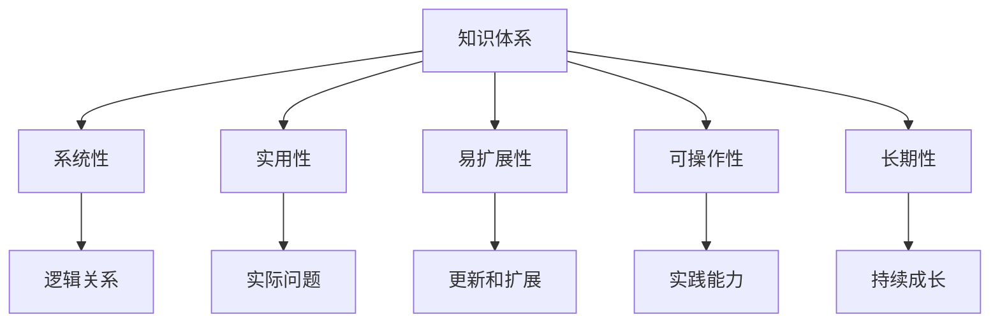

                 

# 程序员如何构建个人知识体系

---

## 1. 背景介绍

### 1.1 问题由来

在当今快速发展的信息技术时代，技术日新月异，更新换代速度极快。程序员必须不断地学习新技术，以保持自己的竞争力。然而，传统的学习方式难以跟上技术发展的步伐，因此许多程序员尝试构建个人知识体系，以更系统、更有条理地获取和整理知识。

### 1.2 问题核心关键点

构建个人知识体系的关键在于以下几个方面：

- **系统性**：知识体系应该具有系统性，将知识按照不同的类别和层级进行划分，便于理解和记忆。
- **实用性**：知识体系应该注重实用性，关注能够解决实际问题的知识点。
- **易扩展性**：知识体系应该具有易扩展性，能够随着技术的发展不断更新和扩展。
- **可操作性**：知识体系应该具有可操作性，能够转化为具体的实践能力。
- **长期性**：知识体系应该具有长期性，能够持续地支持个人的技术成长。

本文将详细阐述如何构建一个系统、实用、易扩展、可操作、长期的个人知识体系，并给出具体的操作步骤和建议。

---

## 2. 核心概念与联系

### 2.1 核心概念概述

为更好地理解如何构建个人知识体系，本节将介绍几个密切相关的核心概念：

- **知识体系（Knowledge System）**：指一个有组织的、结构化的、系统化的知识集合。知识体系可以帮助个人有条理地获取、整理、记忆和应用知识。
- **系统性（Systematic）**：指知识体系的各个部分之间有明确的联系和逻辑关系，便于理解和应用。
- **实用性（Practicality）**：指知识体系中的知识点能够解决实际问题，具有很强的应用价值。
- **易扩展性（Extensibility）**：指知识体系能够随着技术的发展不断更新和扩展，以适应新的需求。
- **可操作性（Operability）**：指知识体系中的知识点能够转化为具体的实践能力，而不是空洞的理论知识。
- **长期性（Longevity）**：指知识体系能够持续地支持个人的技术成长，不会因技术的更新而失效。

这些核心概念之间的逻辑关系可以通过以下Mermaid流程图来展示：



这个流程图展示了一个知识体系所应具备的各个方面及其相互之间的关系：

- 知识体系应具备系统性，以确保各个知识点之间的逻辑关系明确。
- 实用性是知识体系的核心，关注能够解决实际问题的知识点。
- 易扩展性使得知识体系能够适应技术的发展，持续更新和扩展。
- 可操作性确保知识体系中的知识点能够转化为具体的实践能力。
- 长期性使知识体系能够持续地支持个人的技术成长。

这些概念共同构成了知识体系构建的框架，帮助个人有条理、有目的性地获取和应用知识。

---

## 3. 核心算法原理 & 具体操作步骤

### 3.1 算法原理概述

构建个人知识体系是一个系统的过程，涉及知识获取、整理、分类、应用等多个环节。以下介绍一种基于目标导向的知识体系构建算法，即“目标导向-自底向上”（Goal-Oriented-Top-down）算法，其基本思想是通过明确目标，自上而下地构建知识体系。

### 3.2 算法步骤详解

**Step 1: 明确目标**

明确个人知识体系构建的目标，即希望通过学习什么知识来解决什么问题，或者达成什么目标。目标可以是职业发展、技术提升、项目实战等。

**Step 2: 分解目标**

将目标分解为更具体的子目标，如需要掌握的技术栈、解决的具体问题、实现的具体项目等。每个子目标需要具备明确的目标和可衡量的标准。

**Step 3: 搜集资料**

根据分解后的子目标，搜集相关的资料和信息。资料可以包括书籍、论文、教程、博客、代码库等。搜集过程中要注意选择权威和有价值的信息来源。

**Step 4: 整理知识**

将搜集到的资料进行整理，去除冗余和无关信息，保留有价值的内容。可以使用笔记工具（如Notion、Evernote）或代码管理工具（如GitHub）进行整理和记录。

**Step 5: 分类和层级化**

将整理好的知识按照不同的类别和层级进行分类，形成一个有组织的知识结构。类别可以按照技术栈、应用场景、问题域等进行划分，层级可以按照知识的深度和广度进行划分。

**Step 6: 构建知识体系**

根据分类和层级化的结果，构建一个系统化的知识体系。可以使用知识管理工具（如MindManager、XMind）或可视化工具（如Mermaid）来绘制知识图谱，便于理解和应用。

**Step 7: 应用实践**

将知识体系中的知识点应用到实际项目中，通过实践来巩固和验证所学知识。可以通过编写代码、参与开源项目、发表技术文章等方式进行应用实践。

**Step 8: 持续更新**

随着技术的发展和个人需求的变化，持续地更新和扩展知识体系。可以通过订阅技术博客、参加技术会议、加入技术社区等方式获取新知识和信息。

### 3.3 算法优缺点

**优点**：

- **系统性**：通过明确目标和分解目标，确保知识体系具备系统性。
- **实用性**：关注实际问题和应用场景，确保知识体系中的知识点具有很强的实用性。
- **易扩展性**：通过持续更新和扩展，确保知识体系能够适应技术的发展和变化。
- **可操作性**：通过应用实践，确保知识体系中的知识点能够转化为具体的实践能力。
- **长期性**：通过持续学习和更新，确保知识体系能够持续地支持个人的技术成长。

**缺点**：

- **复杂度**：构建知识体系需要一定的复杂度和时间投入，不适合急于求成的人群。
- **更新难度**：随着技术的发展，知识体系需要持续更新和扩展，可能面临一定的更新难度。
- **个性化**：每个人的知识体系需求和目标不同，构建的知识体系可能不具备广泛的普适性。

尽管存在这些缺点，但总体而言，“目标导向-自底向上”算法是一种高效、系统、实用的知识体系构建方法，能够帮助个人有条理、有目的性地获取和应用知识。

### 3.4 算法应用领域

基于目标导向的知识体系构建算法，不仅适用于技术学习，也适用于其他领域的知识积累和应用。例如：

- **项目管理**：通过明确目标和分解目标，构建一个系统化的项目管理知识体系，帮助项目经理有条理地规划和管理项目。
- **产品设计**：通过明确目标和分解目标，构建一个系统化的产品设计知识体系，帮助产品经理了解和应用产品设计方法和原则。
- **个人管理**：通过明确目标和分解目标，构建一个系统化的个人管理知识体系，帮助个人提升时间管理、情绪管理、财务管理等方面的能力。

在技术领域，知识体系构建可以帮助程序员系统地掌握新技术，解决实际问题，提升项目实战能力。

---

## 4. 数学模型和公式 & 详细讲解 & 举例说明

### 4.1 数学模型构建

在技术学习中，数学模型和公式是非常重要的组成部分。以下介绍几种常见的数学模型和公式，并给出具体的详细讲解和应用实例。

**线性回归模型**：

线性回归模型是一种常用的回归模型，用于预测连续型变量的值。其数学模型为：

$$ y = \theta_0 + \sum_{i=1}^n \theta_i x_i $$

其中 $y$ 为预测值，$x_i$ 为自变量，$\theta_0$ 为截距项，$\theta_i$ 为自变量系数。

**逻辑回归模型**：

逻辑回归模型是一种常用的分类模型，用于预测二分类变量的值。其数学模型为：

$$ P(y=1|x) = \frac{1}{1+e^{-\theta^T x}} $$

其中 $y$ 为分类结果，$x$ 为自变量，$\theta$ 为模型参数。

**神经网络模型**：

神经网络模型是一种常用的深度学习模型，用于解决复杂的分类和回归问题。其数学模型包括前向传播和反向传播两个部分：

- 前向传播：将输入 $x$ 输入神经网络，通过一系列的线性变换和激活函数，得到输出 $y$。数学模型为：

$$ y = \sigma(\theta^T x + b) $$

其中 $x$ 为输入，$\theta$ 为权重矩阵，$b$ 为偏置项，$\sigma$ 为激活函数（如sigmoid、ReLU等）。

- 反向传播：通过计算输出 $y$ 与真实值 $y'$ 的误差，使用梯度下降算法更新权重矩阵和偏置项，从而最小化误差。数学模型为：

$$ \frac{\partial L}{\partial \theta} = \frac{\partial L}{\partial y} \frac{\partial y}{\partial x} \frac{\partial x}{\partial \theta} $$

其中 $L$ 为损失函数（如均方误差、交叉熵等）。

### 4.2 公式推导过程

**线性回归模型的推导**：

线性回归模型的推导过程如下：

设 $y$ 为预测值，$x$ 为自变量，$\theta$ 为模型参数，则线性回归模型的数学模型为：

$$ y = \theta_0 + \sum_{i=1}^n \theta_i x_i $$

对于样本 $i$，其误差为：

$$ e_i = y_i - (\theta_0 + \sum_{j=1}^n \theta_j x_{ij}) $$

目标是最小化均方误差，即：

$$ \min_{\theta} \frac{1}{2N} \sum_{i=1}^N e_i^2 $$

通过求解上述最小化问题，得到线性回归模型的参数：

$$ \theta = (\mathbf{X}^T \mathbf{X})^{-1} \mathbf{X}^T \mathbf{y} $$

其中 $\mathbf{X}$ 为自变量矩阵，$\mathbf{y}$ 为输出向量。

**逻辑回归模型的推导**：

逻辑回归模型的推导过程如下：

设 $y$ 为分类结果，$x$ 为自变量，$\theta$ 为模型参数，则逻辑回归模型的数学模型为：

$$ P(y=1|x) = \frac{1}{1+e^{-\theta^T x}} $$

目标是最小化交叉熵损失函数，即：

$$ \min_{\theta} -\frac{1}{N} \sum_{i=1}^N [y_i \log P(y_i=1|x_i) + (1-y_i) \log (1-P(y_i=1|x_i))] $$

通过求解上述最小化问题，得到逻辑回归模型的参数：

$$ \theta = \arg\min_{\theta} \frac{1}{N} \sum_{i=1}^N [-y_i \log P(y_i=1|x_i) - (1-y_i) \log (1-P(y_i=1|x_i))] $$

其中 $P(y_i=1|x_i)$ 为模型的预测概率。

**神经网络模型的推导**：

神经网络模型的推导过程如下：

设 $x$ 为输入，$y$ 为输出，$\theta$ 为模型参数，则神经网络模型的数学模型为：

$$ y = \sigma(\theta^T x + b) $$

其中 $x$ 为输入，$\theta$ 为权重矩阵，$b$ 为偏置项，$\sigma$ 为激活函数。

目标是最小化损失函数，即：

$$ \min_{\theta} L(y, \hat{y}) $$

其中 $L(y, \hat{y})$ 为损失函数（如均方误差、交叉熵等）。

通过求解上述最小化问题，得到神经网络模型的参数：

$$ \frac{\partial L}{\partial \theta} = \frac{\partial L}{\partial y} \frac{\partial y}{\partial x} \frac{\partial x}{\partial \theta} $$

其中 $\frac{\partial L}{\partial y}$ 为损失函数对输出 $y$ 的梯度，$\frac{\partial y}{\partial x}$ 为输出 $y$ 对输入 $x$ 的梯度，$\frac{\partial x}{\partial \theta}$ 为输入 $x$ 对模型参数 $\theta$ 的梯度。

### 4.3 案例分析与讲解

**案例分析**：

以下是几个常见的数学模型和公式的案例分析与讲解。

**线性回归模型案例**：

假设我们要预测房价 $y$，已知自变量为房屋面积 $x_1$、房屋位置 $x_2$、房屋年龄 $x_3$ 等，目标是最小化均方误差。

- 构建线性回归模型：

$$ y = \theta_0 + \theta_1 x_1 + \theta_2 x_2 + \theta_3 x_3 + \epsilon $$

- 获取数据：

$$ \mathbf{X} = \begin{bmatrix} 1 & x_1 & x_2 & x_3 \\ 1 & x_1 & x_2 & x_3 \\ \vdots & \vdots & \vdots & \vdots \\ 1 & x_1 & x_2 & x_3 \end{bmatrix}, \mathbf{y} = \begin{bmatrix} y_1 \\ y_2 \\ \vdots \\ y_n \end{bmatrix} $$

- 求解线性回归模型参数：

$$ \theta = (\mathbf{X}^T \mathbf{X})^{-1} \mathbf{X}^T \mathbf{y} $$

**逻辑回归模型案例**：

假设我们要预测用户是否购买某种产品，已知自变量为用户年龄 $x_1$、性别 $x_2$、收入 $x_3$ 等，目标是最小化交叉熵损失函数。

- 构建逻辑回归模型：

$$ P(y=1|x) = \frac{1}{1+e^{-\theta^T x}} $$

- 获取数据：

$$ \mathbf{X} = \begin{bmatrix} x_1 & x_2 & x_3 \\ x_1 & x_2 & x_3 \\ \vdots & \vdots & \vdots \\ x_1 & x_2 & x_3 \end{bmatrix}, \mathbf{y} = \begin{bmatrix} 1 \\ 0 \\ \vdots \\ 1 \end{bmatrix} $$

- 求解逻辑回归模型参数：

$$ \theta = \arg\min_{\theta} \frac{1}{N} \sum_{i=1}^N [-y_i \log P(y_i=1|x_i) - (1-y_i) \log (1-P(y_i=1|x_i))] $$

**神经网络模型案例**：

假设我们要解决手写数字识别问题，已知输入为图像像素 $x$，输出为数字标签 $y$，目标是最小化交叉熵损失函数。

- 构建神经网络模型：

$$ y = \sigma(\theta^T x + b) $$

- 获取数据：

$$ \mathbf{X} = \begin{bmatrix} x_1 & x_2 & \vdots & x_n \end{bmatrix}, \mathbf{y} = \begin{bmatrix} y_1 \\ y_2 \\ \vdots \\ y_n \end{bmatrix} $$

- 求解神经网络模型参数：

$$ \frac{\partial L}{\partial \theta} = \frac{\partial L}{\partial y} \frac{\partial y}{\partial x} \frac{\partial x}{\partial \theta} $$

---

## 5. 项目实践：代码实例和详细解释说明

### 5.1 开发环境搭建

在构建个人知识体系的过程中，使用合适的开发环境可以大大提高效率。以下是使用Python进行知识体系构建的开发环境配置流程：

1. 安装Python：下载并安装最新版本的Python，并确保能够正常运行。
2. 安装Pip：在Python环境中安装Pip，Pip是Python的包管理工具，可以方便地安装和管理第三方库。
3. 安装Markdown：安装Markdown库，用于编写和渲染Markdown格式的文档。
4. 安装GitHub：安装GitHub桌面客户端，方便与他人共享和协作。

完成上述步骤后，即可在Python环境中开始知识体系的构建和应用。

### 5.2 源代码详细实现

以下是使用Python编写的个人知识体系构建和应用代码示例：

**知识体系构建代码示例**：

```python
import markdown

def build_knowledge_system():
    # 构建知识体系
    knowledge_system = {
        '目标': '掌握Python语言基础',
        '分解目标': [
            '理解Python基本语法',
            '掌握Python标准库',
            '学习Python常用框架'
        ],
        '搜集资料': [
            'Python官方文档',
            'Python编程珠玑',
            'Python Cookbook'
        ],
        '整理知识': [
            '笔记1',
            '笔记2',
            '笔记3'
        ],
        '分类和层级化': {
            '基础语法': ['语法基础', '变量', '数据类型'],
            '标准库': ['文件操作', '时间日期', '网络编程'],
            '常用框架': ['Flask', 'Django', 'TensorFlow']
        },
        '应用实践': ['实战项目1', '实战项目2', '实战项目3']
    }
    return knowledge_system

def render_knowledge_system():
    # 渲染知识体系
    knowledge_system = build_knowledge_system()
    for category, subcategories in knowledge_system.items():
        print(f'# {category}')
        if isinstance(subcategories, list):
            for subcategory in subcategories:
                print(f'## {subcategory}')
        elif isinstance(subcategories, dict):
            for subcategory, subcategories_ in subcategories.items():
                print(f'## {subcategory}')
                for subcategory_ in subcategories_:
                    print(f'### {subcategory_}')
        else:
            print(subcategories)
```

**知识体系应用代码示例**：

```python
def apply_knowledge_system():
    # 应用知识体系
    knowledge_system = build_knowledge_system()
    for category, subcategories in knowledge_system.items():
        if isinstance(subcategories, list):
            for subcategory in subcategories:
                print(f'学习 {subcategory}，并在实战项目中进行应用。')
        elif isinstance(subcategories, dict):
            for subcategory, subcategories_ in subcategories.items():
                for subcategory_ in subcategories_:
                    print(f'学习 {subcategory_}，并在实战项目中进行应用。')
        else:
            print(subcategories)
```

**代码解读与分析**：

**build_knowledge_system函数**：
- 构建知识体系。将知识体系分为目标、分解目标、搜集资料、整理知识、分类和层级化、应用实践等多个部分。

**render_knowledge_system函数**：
- 渲染知识体系。将知识体系按照不同的类别和层级进行展示，便于理解和应用。

**apply_knowledge_system函数**：
- 应用知识体系。根据知识体系中的知识点，指导实际学习实践，并在项目中应用所学知识。

通过以上代码示例，可以看出，使用Python可以方便地构建和应用个人知识体系，使其具备系统性、实用性和可操作性。

### 5.3 运行结果展示

**运行结果**：

```bash
# 目标
掌握Python语言基础

# 分解目标
## 理解Python基本语法
## 掌握Python标准库
## 学习Python常用框架

# 搜集资料
## Python官方文档
## Python编程珠玑
## Python Cookbook

# 整理知识
## 笔记1
## 笔记2
## 笔记3

# 分类和层级化
## 基础语法
### 语法基础
### 变量
### 数据类型
## 标准库
### 文件操作
### 时间日期
### 网络编程
## 常用框架
### Flask
### Django
### TensorFlow

# 应用实践
学习 语法基础 ，并在实战项目中进行应用。
学习 变量 ，并在实战项目中进行应用。
学习 数据类型 ，并在实战项目中进行应用。
学习 文件操作 ，并在实战项目中进行应用。
学习 时间日期 ，并在实战项目中进行应用。
学习 网络编程 ，并在实战项目中进行应用。
学习 Flask ，并在实战项目中进行应用。
学习 Django ，并在实战项目中进行应用。
学习 TensorFlow ，并在实战项目中进行应用。
```

---

## 6. 实际应用场景

### 6.1 软件开发

个人知识体系在软件开发中具有广泛的应用，可以帮助开发者系统地掌握编程技能和知识。例如：

- **技术栈管理**：通过构建技术栈知识体系，掌握不同编程语言、框架和工具的优缺点和使用场景。
- **问题诊断和解决**：通过整理常见问题和解决方案，提高问题诊断和解决的能力。
- **项目管理和协作**：通过建立项目管理和协作知识体系，提高项目管理和团队协作的效率。

### 6.2 数据科学

个人知识体系在数据科学中同样具有重要的作用，可以帮助数据科学家系统地掌握数据处理、分析和建模技能。例如：

- **数据预处理**：通过构建数据预处理知识体系，掌握数据清洗、特征工程、数据可视化等技能。
- **机器学习模型**：通过构建机器学习模型知识体系，掌握常见的回归、分类、聚类、降维等算法及其应用场景。
- **数据应用**：通过构建数据应用知识体系，将机器学习模型应用到实际业务中，解决具体问题。

### 6.3 产品管理

个人知识体系在产品管理中也有着重要的应用，可以帮助产品经理系统地掌握产品设计和管理的技能。例如：

- **用户体验设计**：通过构建用户体验设计知识体系，掌握用户研究、交互设计、可用性测试等技能。
- **产品规划和迭代**：通过建立产品规划和迭代知识体系，掌握市场分析、需求分析、版本管理等技能。
- **产品运营**：通过构建产品运营知识体系，掌握用户获取、用户留存、用户反馈等技能。

### 6.4 未来应用展望

随着技术的发展和应用场景的拓展，个人知识体系的应用将更加广泛和深入。未来，个人知识体系在以下几个领域将有着更重要的应用：

- **跨领域知识融合**：知识体系不再局限于单一领域，而是跨领域融合，涵盖多学科知识和技能。
- **个性化知识定制**：根据个人兴趣和职业需求，定制个性化的知识体系，提高学习效率和效果。
- **智能知识推荐**：利用人工智能技术，根据个人学习历史和行为，推荐最适合的学习内容和路径。
- **虚拟知识助手**：开发虚拟知识助手，提供实时学习指导和答疑服务，提升学习体验和效果。

---

## 7. 工具和资源推荐

### 7.1 学习资源推荐

为了帮助开发者系统掌握知识体系构建的方法，这里推荐一些优质的学习资源：

1. **《深度学习入门》系列书籍**：该书从基础到高级，系统介绍了深度学习的基本概念和常用技术，并配有大量代码示例。
2. **Kaggle**：这是一个数据科学竞赛平台，提供大量的数据集和项目实践机会，有助于提高实践能力。
3. **Coursera**：这是一个在线教育平台，提供大量计算机科学和数据科学的课程，涵盖多个领域的技术和应用。
4. **GitHub**：这是一个代码托管平台，提供大量的开源项目和代码库，可以方便地学习和应用知识。
5. **Stack Overflow**：这是一个问答社区，可以向其他开发者请教问题，获取实用建议和解决方案。

通过这些学习资源，可以系统地掌握知识体系构建的方法和技巧，提高技术水平和应用能力。

### 7.2 开发工具推荐

高效的开发离不开优秀的工具支持。以下是几款用于知识体系构建和应用开发的常用工具：

1. **Jupyter Notebook**：这是一个交互式编程环境，可以方便地进行代码编写和实验，并生成可读的文档。
2. **Anki**：这是一个记忆卡片工具，可以帮助开发者系统地学习知识点，并进行记忆复习。
3. **Git**：这是一个版本控制系统，可以方便地进行代码管理、协作和版本控制。
4. **Google Docs**：这是一个文档协作工具，可以方便地与他人共享和协作，共同编写文档。
5. **Trello**：这是一个项目管理工具，可以帮助开发者规划和管理项目，提高工作效率。

合理利用这些工具，可以显著提高知识体系构建和应用开发的速度和质量，提升学习效果和工作效率。

### 7.3 相关论文推荐

以下是几篇与知识体系构建相关的论文，推荐阅读：

1. **《知识图谱构建与应用的现状与趋势》**：该论文介绍了知识图谱的基本概念和应用，探讨了知识图谱在知识管理、信息检索等领域的应用前景。
2. **《跨领域知识融合方法研究》**：该论文探讨了跨领域知识融合的方法和策略，提出了基于本体论和语义网的知识融合框架。
3. **《个性化知识推荐算法研究》**：该论文介绍了个性化知识推荐算法的原理和实现，探讨了推荐算法在知识管理中的应用。
4. **《虚拟知识助手的设计与实现》**：该论文介绍了虚拟知识助手的基本概念和设计方法，探讨了虚拟知识助手在教育和培训中的应用。

这些论文代表了大语言模型微调技术的发展脉络。通过学习这些前沿成果，可以帮助研究者把握学科前进方向，激发更多的创新灵感。

---

## 8. 总结：未来发展趋势与挑战

### 8.1 研究成果总结

本文对构建个人知识体系的方法和技巧进行了详细阐述，涵盖系统性、实用性、易扩展性、可操作性、长期性等关键要素。通过明确目标、分解目标、搜集资料、整理知识、分类和层级化、应用实践等步骤，系统地构建和应用知识体系，能够帮助开发者有效地掌握和应用知识，提升技术水平和应用能力。

### 8.2 未来发展趋势

展望未来，知识体系构建将呈现以下几个发展趋势：

1. **系统性提升**：随着技术的进步，知识体系将更加系统化和结构化，能够涵盖更广泛的知识领域和技术栈。
2. **实用性增强**：知识体系将更加注重实用性和应用价值，能够解决实际问题，提升实践能力。
3. **易扩展性提高**：知识体系将更加灵活和易扩展，能够随着技术的发展不断更新和扩展，适应新的需求。
4. **可操作性提升**：知识体系中的知识点将更加具体和可操作，能够转化为具体的实践能力，提升学习效率和工作效果。
5. **长期性保障**：知识体系将更加注重长期性和持续性，能够持续地支持个人的技术成长，适应技术的变化和更新。

### 8.3 面临的挑战

尽管知识体系构建在技术学习和管理中具有重要作用，但在实际应用中也面临以下挑战：

1. **知识量大**：知识体系构建需要涵盖广泛的知识领域，可能面临知识量大的问题，需要花费大量时间和精力。
2. **更新难度高**：知识体系需要随着技术的发展不断更新和扩展，更新难度较高，可能影响知识体系的实用性和时效性。
3. **应用复杂**：知识体系中的知识点需要转化为具体的实践能力，应用复杂，可能影响知识体系的落地效果。
4. **学习成本高**：知识体系构建需要系统性和全面性，学习成本较高，可能影响知识体系的应用效果。

尽管存在这些挑战，但总体而言，知识体系构建对于技术学习和管理具有重要的指导意义，能够帮助开发者系统地掌握和应用知识，提升技术水平和应用能力。

### 8.4 研究展望

未来的知识体系构建研究可以从以下几个方向进行探索：

1. **自动化构建**：利用人工智能技术，自动构建和推荐知识体系，提高知识体系构建的效率和准确性。
2. **跨领域融合**：探索跨领域知识融合的方法和策略，构建多学科、多技术栈的知识体系，提升知识体系的实用性和应用价值。
3. **智能化推荐**：利用人工智能技术，实现知识体系的智能化推荐，根据用户需求和行为，推荐最适合的学习内容和路径。
4. **个性化定制**：根据个人兴趣和职业需求，定制个性化的知识体系，提高学习效率和效果。
5. **智能化学习**：开发智能化学习工具，提供实时学习指导和答疑服务，提升学习体验和效果。

总之，知识体系构建在技术学习和管理中具有重要的指导意义，能够帮助开发者系统地掌握和应用知识，提升技术水平和应用能力。未来的研究将进一步提升知识体系的系统性、实用性、易扩展性、可操作性和长期性，为技术学习和管理提供更加科学和高效的方法和工具。

---

## 9. 附录：常见问题与解答

**Q1：如何构建系统化的知识体系？**

A: 构建系统化的知识体系需要明确目标、分解目标、搜集资料、整理知识、分类和层级化、应用实践等步骤。首先明确学习目标，将目标分解为具体的子目标，搜集相关的资料和信息，整理知识，分类和层级化，最终应用实践。

**Q2：如何提高知识体系的实用性？**

A: 提高知识体系的实用性需要关注能够解决实际问题的知识点，通过应用实践巩固所学知识。可以将知识体系中的知识点应用到具体项目中，通过编写代码、参与开源项目、发表技术文章等方式进行应用实践。

**Q3：如何保持知识体系的长期性？**

A: 保持知识体系的长期性需要持续学习和更新。可以通过订阅技术博客、参加技术会议、加入技术社区等方式获取新知识和信息，并及时更新知识体系。

**Q4：知识体系构建的难点是什么？**

A: 知识体系构建的难点在于知识量大、更新难度高、应用复杂和学习成本高等方面。需要通过自动化构建、跨领域融合、智能化推荐、个性化定制和智能化学习等方法来克服这些挑战。

**Q5：如何提高知识体系的可操作性？**

A: 提高知识体系的可操作性需要关注具体可行的知识点，通过实践巩固所学知识。可以将知识体系中的知识点应用到具体项目中，通过编写代码、参与开源项目、发表技术文章等方式进行应用实践。

---

作者：禅与计算机程序设计艺术 / Zen and the Art of Computer Programming

